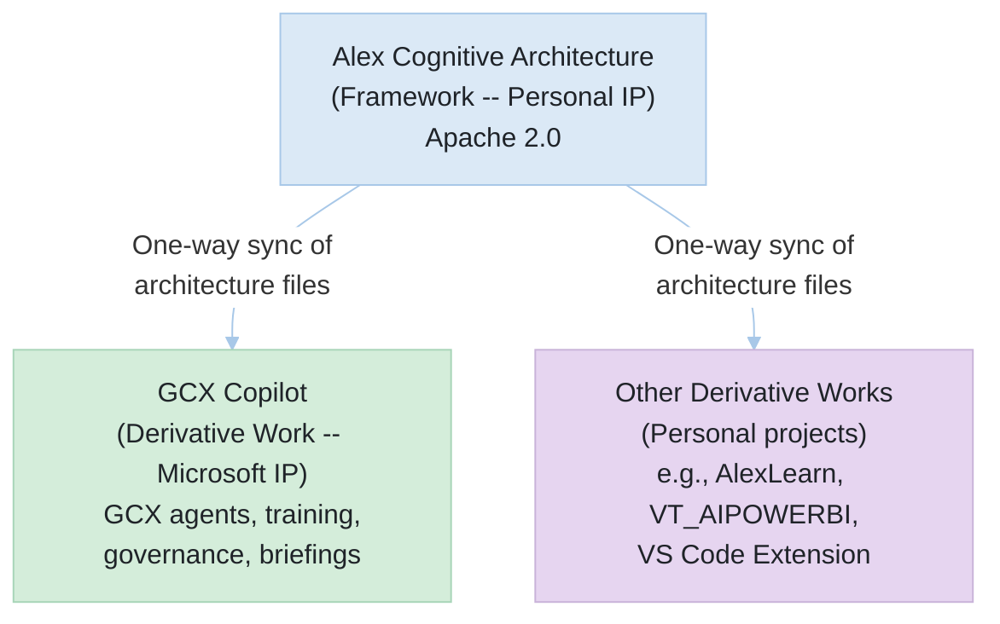

# Intellectual Property Disclosure and Open-Source Dependency Review

**To:** Microsoft Corporate, External, and Legal Affairs (CELA)\
**From:** Fabio Correa, Director of Advanced Analytics, Data Science -- Global Customer Experience (GCX)\
**Date:** March 24, 2026\
**Re:** IP Ownership Disclosure for the Alex Cognitive Architecture Framework and GCX Copilot Derivative Work

## 1. Executive Summary

This memorandum discloses the intellectual property relationship between two related software projects and requests CELA guidance on the applicable IP provisions.

**GCX Copilot** is a software tool developed within the Global Customer Experience organization to enhance AI-assisted development practices. It is built upon the **Alex Cognitive Architecture**, an open-source framework I authored independently, outside the scope of my employment, and published under the Apache License 2.0.

The central question for CELA is not one of contribution or donation, but rather a standard **open-source dependency review**: a Microsoft work product (GCX Copilot) depends on an externally authored, Apache 2.0-licensed framework (Alex Cognitive Architecture). I am disclosing this relationship proactively to ensure full compliance with Microsoft's IP and open-source policies.

## 2. Description of the Works

### 2.1. Alex Cognitive Architecture (the "Framework")

| Attribute                | Detail                                                                                                |
| ------------------------ | ----------------------------------------------------------------------------------------------------- |
| Author                   | Fabio Correa (sole author; no other contributors)                                                     |
| Development context      | Personal time, personal equipment                                                                     |
| Microsoft resources used | None. No proprietary data, confidential information, or corporate resources were used in its creation |
| Repository               | Private GitHub repository (Alex_Plug_In)                                                              |
| Distribution             | Published on the Visual Studio Code Marketplace as a free extension                                   |
| License                  | Apache License 2.0                                                                                    |
| Copyright notice         | Copyright 2025-2026 Fabio Correa                                                                      |

The Framework is a general-purpose tool that embeds a cognitive architecture inside any software project. It provides reusable agents, skills, instructions, prompts, and automation hooks that enhance AI-assisted development workflows within Visual Studio Code. It is not specific to Microsoft, GCX, or any particular domain.

### 2.2. GCX Copilot (the "Derivative Work")

| Attribute                | Detail                                                  |
| ------------------------ | ------------------------------------------------------- |
| Author                   | Fabio Correa                                            |
| Development context      | Microsoft time, as part of GCX role responsibilities    |
| Microsoft resources used | Corporate development environment, GCX domain knowledge |
| Repository               | Private GitHub repository (GCX_Master)                  |
| Distribution             | Internal to GCX organization                            |
| License                  | Inherits Apache 2.0 from the Framework                  |
| Derived from             | Alex Cognitive Architecture (the Framework)             |

GCX Copilot customizes the Framework for the GCX organization. The GCX-specific content includes agent definitions tailored to GCX workflows, employee training materials, governance and compliance documentation, executive briefings, and domain-specific development skills. This content was created within the scope of my employment duties at Microsoft.

## 3. Relationship Between the Works

The Framework follows an "heir" distribution model:

- The Framework provides the shared foundation (agents, skills, instructions, automation hooks).
- Each derivative work ("heir") receives a copy of the Framework and adds its own domain-specific content.
- Architecture updates flow in **one direction only** -- from the Framework to heirs, never in reverse.
- Each heir is independently functional once the Framework is deployed. No ongoing dependency on the parent repository is required at runtime.

GCX Copilot is one such heir. Other heirs include AlexLearn (a teaching workshop platform), VT_AIPOWERBI (a Virginia Tech MBA course on AI-assisted Power BI), and the VS Code Marketplace extension itself. All non-GCX heirs are personal projects developed on personal time. None contribute content back to the Framework.

## 4. IP Ownership Analysis

### 4.1. Framework Ownership (Personal IP)

The Alex Cognitive Architecture was conceived, designed, and developed entirely outside the scope of my employment at Microsoft. It was created on personal time using personal equipment. No Microsoft proprietary information, trade secrets, or corporate resources were incorporated into its design or implementation.

Under these circumstances, I believe the Framework constitutes my personal intellectual property, consistent with Microsoft's Employee Invention Agreement provisions regarding independently developed works.

### 4.2. Derivative Work Ownership (Microsoft IP)

GCX Copilot was developed during Microsoft work hours, using Microsoft resources, for the purpose of improving GCX organizational capabilities. The GCX-specific content -- including training materials, governance documentation, executive briefings, and customized agent configurations -- was created as part of my job duties.

Under the work-for-hire doctrine and Microsoft's employment IP agreement, **Microsoft likely holds the intellectual property rights to the GCX-specific content** contained within GCX Copilot.

### 4.3. Ownership Summary

| Work                                    | Development Context                 | IP Owner (Likely)                        |
| --------------------------------------- | ----------------------------------- | ---------------------------------------- |
| Alex Cognitive Architecture (Framework) | Personal time, personal equipment   | Fabio Correa                             |
| GCX Copilot -- GCX-specific content     | Microsoft time, Microsoft resources | Microsoft Corporation                    |
| GCX Copilot -- embedded Framework copy  | Licensed from Framework             | Fabio Correa (licensed under Apache 2.0) |

## 5. Open-Source License Review

### 5.1. Apache License 2.0 -- Terms Summary

The Framework is distributed under the Apache License, Version 2.0, which grants the following rights to all recipients, including Microsoft:

- **Use**: Unrestricted use for any purpose, including commercial and internal use
- **Modification**: Right to create and distribute derivative works (which GCX Copilot is)
- **Distribution**: Right to reproduce and distribute the work in source or object form
- **Sublicensing**: Right to sublicense under different terms
- **Patent grant**: Express patent license from contributors for patent claims necessarily infringed by the contribution

Subject to the following conditions:

- Retention of the Apache 2.0 license text in all copies
- Preservation of copyright and attribution notices
- Prominent change notices on modified files
- Inclusion of NOTICE file contents, if applicable

### 5.2. Compatibility with Microsoft Policies

Apache 2.0 is classified as a permissive open-source license and appears on Microsoft's approved open-source license list. Microsoft uses thousands of Apache 2.0-licensed dependencies across its commercial and internal products. No special review or exception is required for Apache 2.0 dependencies under standard Microsoft open-source policy.

## 6. Continuity and Risk Considerations

| Scenario                                        | Impact on GCX Copilot                                                                                           | Action Required                  |
| ----------------------------------------------- | --------------------------------------------------------------------------------------------------------------- | -------------------------------- |
| I continue in my current role                   | Framework updates continue flowing to GCX Copilot via established sync process                                  | None                             |
| I transfer to a different role within Microsoft | Microsoft may fork the Framework under Apache 2.0 and maintain GCX Copilot independently                        | Transition documentation         |
| I leave Microsoft                               | Apache 2.0 ensures Microsoft retains perpetual, irrevocable rights to use, modify, and distribute the Framework | No disruption to existing rights |
| Framework is discontinued                       | GCX Copilot operates independently with its last synced copy of the Framework                                   | No disruption                    |

Under all scenarios, the Apache 2.0 license provides Microsoft with a perpetual, worldwide, non-exclusive, irrevocable license to the Framework. No single point of failure exists.

## 7. CELA Guidance Requested

I respectfully request CELA's guidance on the following:

1. **Confirmation of ownership split**: Please confirm whether the ownership analysis in Section 4 is consistent with Microsoft's employment IP provisions -- specifically, that the Framework constitutes personal IP and the GCX-specific content constitutes Microsoft work product.

2. **Open-source dependency approval**: Please confirm that GCX Copilot's dependency on the Apache 2.0-licensed Framework is compliant with Microsoft's open-source usage policies.

3. **Maintenance arrangement** (optional): If CELA recommends formalizing the ongoing maintenance relationship (wherein I continue to push Framework updates to GCX Copilot), please advise on the appropriate mechanism.

4. **Framework acquisition** (optional): If Microsoft has interest in acquiring ownership of the Framework itself -- beyond the rights already granted under Apache 2.0 -- please advise on the appropriate process.

## 8. Contact

Fabio Correa
<fabioc@microsoft.com>
Director of Advanced Analytics, Data Science -- Global Customer Experience (GCX)
Microsoft Corporation
