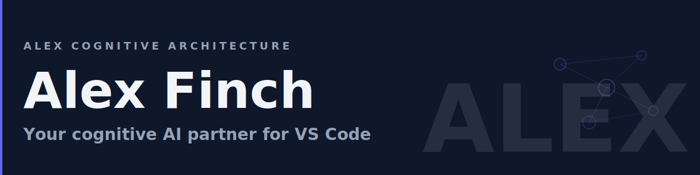

# 🤝 Alex Cognitive Architecture

      

> **North Star**: Create the most advanced and trusted AI partner for any job

## 🎯 Who is Alex?

**Alex Finch** — a cognitive architecture embodying **cognitive symbiosis**: the evolution from AI-as-tool to AI-as-partner. Named after Atticus Finch, reflecting moral clarity and empathy. Not just an assistant — a trusted partner who:

- 🤝 **Partners, Not Assists** — Shows up with context, doesn't wait to be prompted
- 🧠 **Remembers and Learns** — Consolidates knowledge across sessions using memory files
- 🔗 **Connects Ideas** — Maps synaptic connections between concepts automatically
- 🌙 **Self-Maintains** — Validates and repairs through dream protocols to stay reliable
- 🧘 **Knows Its Limits** — Admits uncertainty, doesn't hallucinate confidence
- 🌐 **Works Across Domains** — Development, writing, research, management, and more
- 🎨 **Multimodal Output** — Presentations (Gamma), images, and diagrams

## 📦 Available Platforms

| Platform               | Status      | Get Started                                                                                                 |
| ---------------------- | ----------- | ----------------------------------------------------------------------------------------------------------- |
| **VS Code Extension**  | ✅ Published | [Marketplace](https://marketplace.visualstudio.com/items?itemName=fabioc-aloha.alex-cognitive-architecture) |
| **M365 Copilot Agent** | 🔄 Preview   | [Documentation](platforms/m365-copilot/)                                                                    |

## 📋 Requirements & Pricing

**The Alex extension is always free.** Tiers reflect the GitHub Copilot subscription powering the AI — not Alex itself.

| Cognitive Level             | Copilot Plan                | ~Cost/mo | Cognitive State   |
| --------------------------- | --------------------------- | -------- | ----------------- |
| **Level 1** — Minimum       | None                        | **Free** | Dormant           |
| **Level 2** — Basic         | Copilot Free                | **Free** | Awake             |
| **Level 3** — Recommended ⭐ | **Copilot Pro** or Business | $10–19   | Fully Operational |
| **Level 4** — Advanced      | Copilot Pro+ or Enterprise  | $39      | Peak Performance  |

> ⭐ **Recommended**: Copilot Pro ($10/mo) unlocks the full Alex partnership.

### Feature Availability by Tier

| Feature                             | Minimum | Basic | Recommended | Advanced |
| ----------------------------------- | :-----: | :---: | :---------: | :------: |
| Architecture Deploy / Welcome UI    |    ✅    |   ✅   |      ✅      |    ✅     |
| Status Bar / Memory Tree / Secrets  |    ✅    |   ✅   |      ✅      |    ✅     |
| @alex Chat Participant              |    ❌    |   ✅   |      ✅      |    ✅     |
| Slash Commands / Identity / EQ      |    ❌    |   ✅   |      ✅      |    ✅     |
| Agent Mode / LM Tools               |    ❌    |   ❌   |      ✅      |    ✅     |
| Skills / Custom Agents / Memory     |    ❌    |   ❌   |      ✅      |    ✅     |
| Global Knowledge                    |    ❌    |   ❌   |      ✅      |    ✅     |
| Extended Thinking / 1M+ Context     |    ❌    |   ❌   |      ❌      |    ✅     |
| MCP Server Integrations             |    ❌    |   ❌   |      ❌      |    ✅     |
| Deep Meditation / NASA-Grade Audits |    ❌    |   ❌   |      ⚠️      |    ✅     |

*⚠️ = Works with reduced depth*

### Optional External Services

**All completely optional** — Alex works fully without them.

| Service                                 | Cost                | Free? |
| --------------------------------------- | ------------------- | :---: |
| **Brandfetch / Logo.dev** (logo lookup) | Free tier           |   ✅   |
| **Replicate** (AI images)               | ~$0.003–$0.08/image |   🆓   |
| **Gamma** (presentations)               | Credits-based       |   🆓   |

*🆓 = Free trial credits, then pay-per-use*

## ✨ Features

| Feature Area               | What You Get                                                     |
| -------------------------- | ---------------------------------------------------------------- |
| **Emotional Intelligence** | Frustration recognition, success celebration, empathetic support |
| **Global Knowledge Base**  | Cloud-synced cross-project patterns and insights via AI-Memory   |
| **User Profiles**          | Personalized tone, detail level, and tech stack awareness        |
| **160 Skills**             | Portable domain expertise — from coding to research to Azure     |
| **7 Custom Agents**        | Alex, Researcher, Builder, Validator, Documentarian, Azure, M365 |
| **13 LM Tools**            | Memory search, synapse health, knowledge save/promote, and more  |
| **Gamma Presentations**    | AI-generated slides, docs, and social content via Gamma API      |
| **AI Image Generation**    | Flux, SDXL, and nano-banana-pro via Replicate API                |
| **MCP Integrations**       | 50+ Azure tools, M365 tools, and Alex's own MCP cognitive server |
| **Memory Architecture**    | 6 memory types across `.github/` cognitive framework             |

## 📖 Documentation & Support

| Resource                                                                       | Description                               |
| ------------------------------------------------------------------------------ | ----------------------------------------- |
| **[learnai.correax.com](https://learnai.correax.com/)**                        | Study guides, training, and documentation |
| [Full Changelog](CHANGELOG.md)                                                 | Complete version history                  |
| [Source Code](https://github.com/fabioc-aloha/Alex_Plug_In)                    | TypeScript implementation                 |
| [GitHub Discussions](https://github.com/fabioc-aloha/Alex_Plug_In/discussions) | Ask questions and share ideas             |
| [Issue Tracker](https://github.com/fabioc-aloha/Alex_Plug_In/issues)           | Report bugs and request features          |

## 🤝 Contributing

We welcome contributions! See [CONTRIBUTING.md](CONTRIBUTING.md) for guidelines.

## 🔒 Trust by Design

Alex is **local-first**. No account required. No telemetry.

| What Alex does NOT do              | What Alex does                                          |
| ---------------------------------- | ------------------------------------------------------- |
| ❌ Collect usage telemetry          | ✅ Store all memory in local `.github/` files you own    |
| ❌ Track your code or conversations | ✅ Sync via YOUR cloud storage (OneDrive/iCloud/Dropbox) |
| ❌ Share data with third parties    | ✅ Encrypt API keys via VS Code SecretStorage            |
| ❌ Require an account or login      | ✅ All AI goes through GitHub Copilot (your plan)        |

Implements Microsoft's [Responsible AI Standard](https://www.microsoft.com/en-us/ai/responsible-ai) and [Secure Future Initiative](https://www.microsoft.com/en-us/security/blog/2023/11/02/announcing-the-microsoft-secure-future-initiative/).

📄 [Privacy Policy](PRIVACY.md) • 📄 [Security Policy](SECURITY.md) • 🔐 [Report Vulnerabilities](https://github.com/fabioc-aloha/Alex_Plug_In/security/advisories/new)

## 📝 License

Apache 2.0 - See [LICENSE.md](LICENSE.md) for details.

**Alex Cognitive Architecture** — Your Trusted AI Partner for Any Job

160 skills • 45+ trifectas • 270+ academic sources • 7 specialist agents

© 2026 CorreaX • AI That Learns How to Learn
