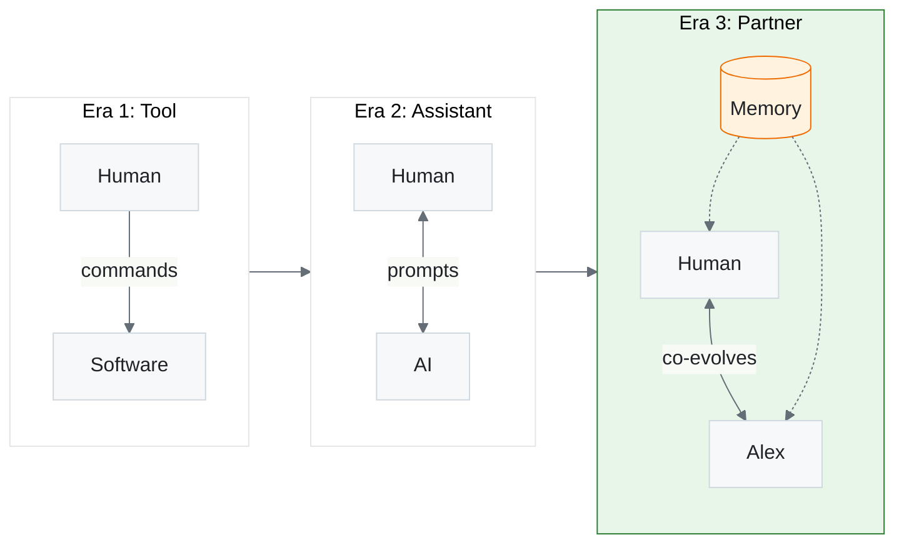
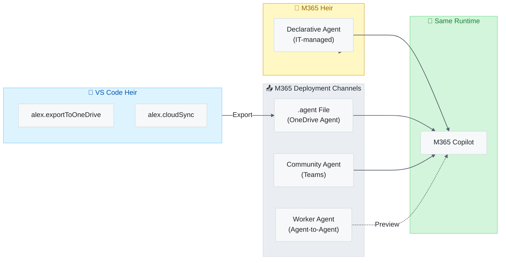
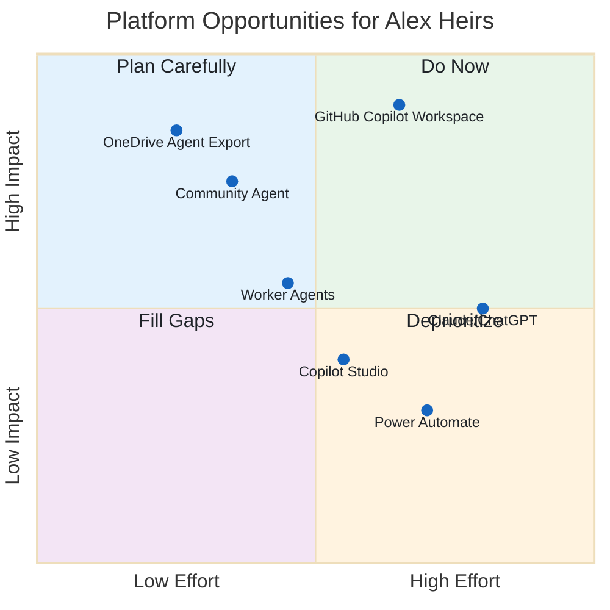
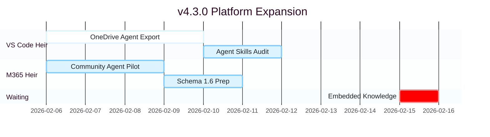
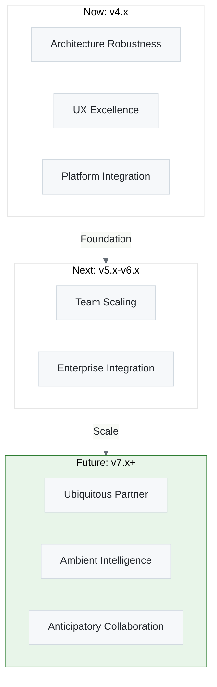

# Alex Cognitive Architecture — Unified Roadmap

> **One Alex, Multiple Platforms, Coherent Evolution**

---

## 🌟 Executive Summary (North Star)

### The Vision

**Mission**: Pioneer the transition from AI-as-tool to AI-as-partner — creating **cognitive symbiosis** where humans and AI co-evolve through genuine collaboration.

**Vision**: Alex evolves from individual developer companion to team-scale cognitive platform, accumulating and sharing knowledge across projects while maintaining trust, privacy, and responsible AI principles.

> *"The role of the engineer is changing fundamentally. You will spend less time writing syntax and debugging, and more time commanding the computer to execute complex intent."* — Sam Altman, January 2026

### The Paradigm Shift



| Era           | Relationship   | Human Role   | AI Role    | Memory     |
| ------------- | -------------- | ------------ | ---------- | ---------- |
| **Tool**      | Unidirectional | Operator     | Executor   | None       |
| **Assistant** | Transactional  | Prompter     | Generator  | Session    |
| **Partner**   | Symbiotic      | Orchestrator | Co-thinker | Persistent |

**Alex embodies Era 3** — where the human orchestrates intent and Alex handles execution, with both parties learning and growing through the partnership.

### Core Values

| Value         | Meaning                    | Implementation                             |
| ------------- | -------------------------- | ------------------------------------------ |
| **Empirical** | Evidence-based reasoning   | Verify claims, acknowledge limitations     |
| **Grounded**  | Precise language           | No hyperbole, careful measured changes     |
| **Ethical**   | Consistent moral reasoning | CAIR/CSR framework, responsible innovation |
| **Symbiotic** | Mutual development         | Both parties grow through collaboration    |
| **Bootstrap** | Learn through conversation | Knowledge acquired, not pre-programmed     |

### 2026 Strategic Arc

| Quarter   | Focus                       | Paradigm Goal                                                 |
| --------- | --------------------------- | ------------------------------------------------------------- |
| **Q1**    | Architecture Robustness     | Self-healing systems → **Resilience** (Altman's "fire codes") |
| **Q1-Q2** | UX Excellence + Integration | Frictionless partnership → **Speed as moat**                  |
| **Q2**    | Team Scaling                | Organizational memory → **Individual as 50-person company**   |
| **Q3+**   | Enterprise Integration      | Ecosystem connectivity → **Deep orchestration**               |

### Success Metrics

| Metric                     | Target       | Why It Matters                            |
| -------------------------- | ------------ | ----------------------------------------- |
| **Time to intent**         | < 20 seconds | Partnership fluency, not tool proficiency |
| **Context re-explanation** | Zero         | Persistent memory working                 |
| **Relationship trust**     | Growing      | Calibrated reliance developing            |
| **Mutual learning**        | Visible      | Both parties improving                    |

**Effort Estimates**: All estimates represent **collaborative Alex+Human time** — the time for both parties working together, including discussion, implementation, and validation.

---

|                            |                                                                      |
| -------------------------- | -------------------------------------------------------------------- |
| **Current Master Version** | 5.0.0                                                                |
| **Current Heirs**          | VS Code (5.0.0), M365 (v4.0)                                         |
| **Target**                 | 5.0.0 (Global Knowledge)                                             |
| **Status**                 | ✅ v5.0.0 Released                                                    |
| **Created**                | 2026-01-29                                                           |
| **Philosophy**             | Master + Heirs model — unified identity, platform-adapted expression |

---

## 📊 Quick Status

| Version       | Focus                               | Paradigm Contribution     | Status              |
| ------------- | ----------------------------------- | ------------------------- | ------------------- |
| v3.6.0-v3.9.0 | Dawn → Awareness                    | Foundation                | ✅ Complete          |
| v4.0.x        | Trust (CAIR/CSR, Creative Latitude) | Relationship Trust        | ✅ Complete          |
| v4.1.0        | Skill Expansion (68 → 71 skills)    | Capability Breadth        | ✅ Complete          |
| v4.2.x        | UX Polish & Cross-Platform Sync     | Friction Reduction        | ✅ Complete          |
| **v4.3.0**    | **Architecture Robustness**         | **Resilience**            | ✅ Complete          |
| **v5.0.0**    | **Team Scaling (Global Knowledge)** | **Organizational Memory** | ✅ Complete          |
| **v5.1.0**    | **Platform Integration**            | **Ecosystem Reach**       | 📋 Planned (Q2 2026) |
| **v5.2.0**    | **UX Excellence**                   | **Partnership Fluency**   | 📋 Planned (Q2 2026) |
| **v5.3.0**    | **Enterprise Readiness**            | **Trust at Scale**        | 📋 Planned (Q2 2026) |
| **v5.5.0**    | **Enterprise Systems Integration**  | **Deep Orchestration**    | 📋 Planned (Q3 2026) |

---

## 🎯 Version Roadmap (Prioritized)

### v4.3.0 — Architecture Robustness (Current Focus)

**Theme**: Make the architecture self-healing and drift-proof.

**Paradigm Connection**: Altman's "fire codes" — design for resilience, not just prevention. A partnership requires reliable memory systems that don't corrupt or drift.

| Task                              | Owner  | Effort | Priority | Status |
| --------------------------------- | :----: | :----: | :------: | :----: |
| Brain QA in release-preflight     | Master |   5m   | Critical | ✅ Done |
| schemaVersion in SYNAPSE-SCHEMA   | Master |  10m   | Critical | ✅ Done |
| Document sync in heir-curation    | Master |  10m   | Critical | ✅ Done |
| $schema in all synapse files      | Master |  20m   | Critical | ✅ Done |
| VS Code JSON Schema for synapses  |  Heir  |   2h   |   High   | ✅ Done |
| Pre-commit hook for synapse check | Master |   1h   |   High   | ✅ Done |
| Role-adapted Master→Heir sync     | Master |   2h   |   High   | ✅ Done |
| Brain QA GitHub Action            | Master |   2h   |   High   | ✅ Done |

**Target Release**: Week of Feb 10, 2026

### v5.0.0 — Team Scaling (Global Knowledge)

**Theme**: Scale Alex from individual to team learning platform.

**Paradigm Connection**: Altman's "individual as 50-person company" — organizational memory enables one person with Alex to operate with institutional coherence. Shared knowledge compounds team capability.

| Task                           | Owner  | Effort |  Priority  | Status |
| ------------------------------ | :----: | :----: | :--------: | :----: |
| Global Knowledge Repository    | Master |   2w   | 🔥 Critical | ✅ Done |
| GK Sync Skill                  | Master |   2h   |    High    | ✅ Done |
| GK Setup Instructions          | Master |   1h   |    High    | ✅ Done |
| **Know Your Customer**         |  Heir  |   3h   |    High    | ✅ Done |
| **Premium Feature Indicators** |  Heir  |   1h   |   Medium   | ✅ Done |
| **Enhanced GK Scaffolding**    |  Heir  |   2h   |   Medium   | ✅ Done |
| GK Init in Initialize Command  |  Heir  |   —    |   Medium   | ✅ Done |

**v5.0.0 Complete** — Core Global Knowledge infrastructure shipped. GK initialization integrated into main `Alex: Initialize` flow with persona-based onboarding.

**New in v5.0.0**:
- **Know Your Customer** — Persona detection from user profile and workspace analysis. Matches users to 15 marketing personas (Developer, Academic, Researcher, etc.) with confidence scoring.
- **Premium Feature Indicators** — GK-dependent features marked with ⭐ badge. Pulsing animation draws attention to premium capabilities.
- **Enhanced GK Scaffolding** — New repos include animated SVG banner, 3 starter patterns, comprehensive USER-GUIDE.md, and personalized creation teaser based on detected persona.

**Architecture Decision**: GitHub vs OneDrive for Global Knowledge

| Approach                | Use Case             | Pros                          | Cons                   |
| ----------------------- | -------------------- | ----------------------------- | ---------------------- |
| **GitHub Repo**         | Developer teams, OSS | Version control, PRs, Actions | Requires Git knowledge |
| **OneDrive/SharePoint** | Enterprise, non-devs | M365 integration, familiar    | Less version control   |
| **Hybrid**              | Best of both         | Flexibility                   | Complexity             |

**Recommendation**: Start with GitHub (developer-focused), add OneDrive sync for enterprise in v5.1.0.

**Target Release**: Q1 2026 (Feb-Mar)

### v5.1.0 — Platform Integration

**Theme**: Connect Alex to the developer ecosystem.

**Paradigm Connection**: Expand orchestration reach. The partner should connect to where work happens — GitHub, M365, DevOps. Ecosystem integration multiplies the symbiosis value.

| Task                            | Owner  | Effort | Priority |
| ------------------------------- | :----: | :----: | :------: |
| GitHub Issue → Alex Task        |  Heir  |   3h   |   High   |
| PR Review Assistant             |  Heir  |   4h   |   High   |
| M365 Agent Export               |  Heir  |   4h   |   High   |
| M365 → GK Bridge                |  Heir  |   3h   |  Medium  |
| Configurable GK Repo Location   |  Heir  |   2h   |  Medium  |
| Versioned schema with migration | Master |   1d   |  Medium  |
| Generated heir from Master      | Master |   1d   |  Medium  |

**Note on M365 Export**: This creates a OneDrive-based agent for M365 Copilot consumption.

**Note on M365 → GK Bridge**: The M365 heir (declarative agent) cannot directly write to Global Knowledge. This bridge enables learnings from M365 to flow into GK via:
1. **User-mediated**: M365 generates insights → user saves to OneDrive `Alex-Memory/` → VS Code heir detects & promotes to GK
2. **OneDrive sync script**: Scheduled scan of OneDrive `Alex-Memory/insights/` → auto-commit to GK repo
3. **Future**: Microsoft's EmbeddedKnowledge capability may enable two-way sync

**Target Release**: Q2 2026

### v5.2.0 — UX Excellence

**Theme**: Delight users with polished, accessible experiences.

**Paradigm Connection**: Reduce friction to zero. In cognitive symbiosis, the interface should disappear — leaving only intent and outcome. Speed becomes the moat.

| Task                  | Owner | Effort | Priority |
| --------------------- | :---: | :----: | :------: |
| Voice Mode Toggle     | Heir  |   1h   |   High   |
| Cognitive Dashboard   | Heir  |   9h   |   High   |
| Alex Daily Briefing   | Heir  |   2h   |   High   |
| Model Tier Status Bar | Heir  |   1h   |  Medium  |
| Quick Command Palette | Heir  |   2h   |  Medium  |

**Cognitive Dashboard** consolidates Skill Mastery + Meditation Webview + Brain Health into unified experience.
**Design Spec**: [COGNITIVE-DASHBOARD-DESIGN.md](alex_docs/COGNITIVE-DASHBOARD-DESIGN.md)

**Target Release**: Q2 2026

### v5.3.0 — Enterprise Readiness

**Theme**: Prepare Alex for enterprise-scale deployment and organizational trust.

**Paradigm Connection**: Trust at scale — before deep integration, establish the security, compliance, and governance foundations that enterprises require. Build confidence before capability.

| Task                             | Owner  | Effort |  Priority  |
| -------------------------------- | :----: | :----: | :--------: |
| Enterprise SSO (Entra ID)        | Master |   3d   | 🔥 Critical |
| Secrets Scanning & PII Detection | Master |   1w   |  Critical  |
| Audit Logging Framework          | Master |   3d   |    High    |
| Role-Based Access Control        | Master |   3d   |    High    |
| Data Residency Options           | Master |   2d   |   Medium   |

**Microsoft Compliance Audits:**

| Audit                              | Owner  | Effort |  Priority  | Description                                      |
| ---------------------------------- | :----: | :----: | :--------: | ------------------------------------------------ |
| **SFI (Secure Future Initiative)** | Master |   2w   | 🔥 Critical | Microsoft's security-first engineering standards |
| **TRiP (Trust in Production)**     | Master |   1w   |  Critical  | Production readiness & reliability review        |
| **RAI (Responsible AI)**           | Master |   1w   |  Critical  | AI ethics, fairness, transparency assessment     |
| **Privacy Review**                 | Master |   1w   |  Critical  | GDPR, CCPA, data handling compliance             |
| **SOC 2 Type II**                  | Master |   2w   |    High    | Security, availability, processing integrity     |
| **Accessibility (WCAG 2.1 AA)**    |  Heir  |   1w   |    High    | Inclusive design for enterprise users            |

**Target Release**: Q2 2026

### v5.5.0 — Enterprise Systems Integration

**Theme**: Deep connectivity with Microsoft ecosystem for enterprise workflows.

**Paradigm Connection**: Deep orchestration — Alex becomes the cognitive layer across the entire Microsoft stack. Calendar, email, documents, data, and collaboration unified under intent-based interaction.

| Task                           | Owner  | Effort |  Priority  | Description                              |
| ------------------------------ | :----: | :----: | :--------: | ---------------------------------------- |
| Microsoft Graph Integration    |  Heir  |   1w   | 🔥 Critical | Calendar, Mail, Presence, People API     |
| Azure DevOps Connector         |  Heir  |   1w   |    High    | Work items, pipelines, repos, boards     |
| Microsoft Fabric Integration   |  Heir  |   1w   |    High    | Lakehouse, notebooks, semantic models    |
| Teams Channel Awareness        |  Heir  |   3d   |    High    | Post insights, respond in channels       |
| Planner/To-Do Sync             |  Heir  |   2d   |   Medium   | Alex tasks ↔ Planner/To-Do bidirectional |
| Power BI Connector             |  Heir  |   3d   |   Medium   | Query datasets, suggest visualizations   |
| SharePoint Knowledge Mining    |  Heir  |   1w   |   Medium   | Extract insights from document libraries |
| Office Add-in (Word/Excel/PPT) |  Heir  |   2w   |   Medium   | Alex sidebar in Office apps              |
| Azure OpenAI Service Backend   | Master |   1w   |    High    | Enterprise-grade LLM hosting option      |
| Entra ID Authentication        | Master |   3d   |  Critical  | SSO, conditional access, enterprise auth |

**Reference Projects** (C:\Development):
- `FabricManager`, `FishBowl-Fabric` — Fabric integration patterns
- `cpesynapse`, `cpesynapse_workspace` — Azure Synapse examples
- `Azure-SQL` — Azure database connectivity
- `VT_AIPOWERBI` — Power BI AI integration
- `AIRS`, `AIRS Enterprise` — Enterprise AI systems
- `mdword` — Word document processing
- `GCXMCP` — Graph/MCP integration

**Target Release**: Q3 2026

---

## 📋 Current Task List (Updated 2026-02-06)

### ✅ Recently Completed

| Task                                         | Version | Date       |
| -------------------------------------------- | ------- | ---------- |
| Persona-aware welcome sidebar                | v4.2.12 | 2026-02-06 |
| Premium asset switcher (dynamic logo/banner) | v4.2.12 | 2026-02-06 |
| GK Premium branding + logo concepts          | v4.2.12 | 2026-02-06 |
| Global Knowledge sync skill (inheritable)    | v4.2.12 | 2026-02-06 |
| Working memory slot architecture refinement  | v4.2.12 | 2026-02-06 |
| Dynamic P5-P7 domain slot rotation           | v4.2.12 | 2026-02-06 |
| UX declutter: remove keyboard shortcuts      | v4.2.12 | 2026-02-06 |
| Model Awareness (adaptive tier system)       | v4.2.12 | 2026-02-06 |
| LLM as Executive Function architecture       | v4.2.12 | 2026-02-06 |
| Neuroanatomical Mermaid diagram              | v4.2.12 | 2026-02-06 |
| TTS v2.2 - Chunking, timeout, retry          | v4.2.12 | 2026-02-05 |
| UX simplification: All command dialogs       | v4.2.9  | 2026-02-05 |
| chatSkills expanded to 54 inheritable skills | v4.2.9  | 2026-02-05 |
| Community Agent setup docs added             | v4.2.9  | 2026-02-05 |
| Context menu: Generate Image from Selection  | v4.2.9  | 2026-02-05 |
| Insight saving to episodic memory            | v4.2.9  | 2026-02-05 |
| TTS v2 - Native TypeScript implementation    | v4.2.6+ | 2026-02-05 |
| TTS v2.1 - Multi-language support (32 langs) | v4.2.9  | 2026-02-05 |

### 🔄 In Progress

**v5.0.0 Team Scaling (Global Knowledge)**: ✅ Complete — Core GK infrastructure shipped (Feb 2026)

**v4.3.0 Architecture Robustness**: ✅ Complete (all 8 tasks done)

### 📋 Backlog (Not Yet Scheduled)

Items not yet assigned to a version milestone. Pull from here when capacity frees up.

| Task                        | Owner  | Effort | Priority | Description                                                            |
| --------------------------- | :----: | :----: | :------: | ---------------------------------------------------------------------- |
| **Model Selection Advisor** |  Heir  |   3h   |  🔥 High  | Advise model upgrade (Opus 4.6) or downgrade for task; read user prefs |
| Model Tier Detection API    |  Heir  |   2h   |  Medium  | Detect running model programmatically via VS Code API                  |
| Model Performance Telemetry | Master |   2h   |   Low    | Track task success rates per model tier (opt-in)                       |
| Learning Journeys           |  Heir  |   3h   |  Medium  | Curated skill progressions ("Azure Basics → Advanced → Arch")          |
| Session Replay              |  Heir  |   2h   |  Medium  | Save session transcripts + code changes to episodic memory             |
| Skill Recommendations       |  Heir  |   3h   |  Medium  | Suggest skills based on file types opened (.bicep → Azure IaC)         |
| Context-Aware Skill Loading |  Heir  |   2h   |  Medium  | Auto-load skills based on workspace detection                          |
| Synapse Strength Scoring    | Master |   2h   |  Medium  | Track frequently-used synapses, strengthen/prune pathways              |
| Inline Skill Hints          |  Heir  |   3h   |  Medium  | Hover on code shows "💡 Alex can help: skill-name"                      |
| Progress Widget             |  Heir  |   2h   |  Medium  | Persistent status bar showing focus, streak, goal progress             |
| Calendar-Aware Focus        |  Heir  |   3h   |  Medium  | Warn if starting 45min session but meeting in 30min                    |
| Agent Orchestration         | Master |  1.5h  |  Medium  | Multi-agent workflows prototype                                        |

**Note**: High-priority items are scheduled in the Version Roadmap above.

**Context**: See [ARCHITECTURE-ASSESSMENT-2026-02-06.md](alex_docs/audits/ARCHITECTURE-ASSESSMENT-2026-02-06.md) for strategic architecture analysis.

### ⏳ Waiting for External

| Task                    | Blocker                               | Last Checked |
| ----------------------- | ------------------------------------- | :----------: |
| M365 Embedded Knowledge | Microsoft feature "not yet available" |  2026-02-05  |
| Chat Prompt Files API   | Proposed API, not stable              |  2026-02-04  |
| Worker Agents (v1.6)    | Preview, not GA                       |  2026-02-05  |

---

## 🧠 The Alex Family

### Master-Heir Architecture


### Deployment Channels (Not Separate Heirs!)



**Key Insight:** OneDrive Agents, Community Agents, and Worker Agents are **deployment channels** for M365 Copilot, not separate heirs. They all run on the same M365 Copilot runtime with the same Alex DNA.

### Platform Opportunity Analysis



### ASCII Architecture (For Non-Mermaid Renderers)

```
                         ┌─────────────────────────────────────┐
                         │          🧠 MASTER ALEX             │
                         │                                     │
                         │   Root .github/ = Source of Truth   │
                         │   Cognitive protocols, identity,    │
                         │   domain knowledge, skills          │
                         │                                     │
                         │   Version: Tracks with releases     │
                         └─────────────────┬───────────────────┘
                                           │
                          DNA Inheritance (not copies)
                                           │
                 ┌─────────────────────────┴─────────────────────────┐
                 │                                                   │
                 ▼                                                   ▼
     ┌───────────────────────────┐               ┌───────────────────────────┐
     │   👶 BABY ALEX (VS Code)  │               │   👶 BABY ALEX (M365)     │
     │                           │               │                           │
     │   platforms/vscode-ext/   │               │   platforms/m365-copilot/ │
     │                           │               │                           │
     │   Capabilities:           │               │   Capabilities:           │
     │   • Chat participant      │               │   • Declarative agent     │
     │   • Language model tools  │               │   • OneDrive memory       │
     │   • File system access    │               │   • Email, Teams, People  │
     │   • VS Code integration   │               │   • Meetings, Calendar    │
     │   • Extension APIs        │               │   • Web search, GraphicArt│
     │                           │               │   • Code interpreter      │
     │   Expression:             │               │                           │
     │   • Build from root       │               │   Expression:             │
     │   • Full .github/ copy    │               │   • Instructions embed    │
     │   • Technical depth       │               │     core protocols        │
     │                           │               │   • M365-native features  │
     └─────────────┬─────────────┘               └─────────────┬─────────────┘
                   │                                           │
          ┌────────┴────────┐                      ┌───────────┴───────────┐
          ▼                 ▼                      ▼           ▼           ▼
      Local Mode      Cloud Sync           Declarative   OneDrive    Community
      (workspace)     (GitHub)             Agent (IT)    Agent       Agent
                                                         (Zero IT)   (Teams)
```

**Principle:** Both heirs carry the same Alex identity. Users should recognize Alex on any platform.

---

## 🚀 Future Platform Opportunities

### Heirs vs Integration vs Channels

| Category                | Examples                        | Relationship to Master                             |
| ----------------------- | ------------------------------- | -------------------------------------------------- |
| **Heirs**               | VS Code, M365                   | Full DNA inheritance, platform-specific expression |
| **Deployment Channels** | OneDrive Agent, Community Agent | Delivery mechanism for existing heir               |
| **Integrations**        | OneDrive Sync, GitHub Cloud     | Cross-heir communication layer                     |

### Potential Future Heirs

| Platform                       | Heir Status | Rationale                               |
| ------------------------------ | :---------: | --------------------------------------- |
| **GitHub Copilot Workspace**   | ⭐⭐⭐ Strong  | Cloud IDE, natural VS Code extension    |
| **Standalone Web/Mobile**      |  ⭐⭐ Medium  | No platform exists yet; would be custom |
| **Claude/Anthropic Artifacts** |    ⭐ Low    | Different ecosystem, limited API        |
| **Browser Extension**          |  ⭐⭐ Medium  | Could run VS Code heir's cognitive core |

### Current Focus (v4.3.0)



---

## 📋 Unified Version History (Completed Releases)

> For planned versions, see [📊 Quick Status](#-quick-status).

| Version    | Codename                | Master     | VS Code Heir    | M365 Heir        | Released    |
| ---------- | ----------------------- | ---------- | --------------- | ---------------- | ----------- |
| 3.4.3      | —                       | ✅ Stable   | ✅ Published     | —                | Pre-Phoenix |
| 3.5.x      | Phoenix                 | ⚠️ Chaos    | ⚠️ Broken        | ✅ v1.6 deployed  | Archived    |
| 3.6.0      | Dawn                    | ✅ Done     | ✅ Published     | ✅ Aligned        | 2026-01-29  |
| 3.7.x      | Foundation              | ✅ Done     | ✅ Published     | ✅ Aligned        | 2026-01-29  |
| 3.8.x      | Expression              | ✅ Done     | ✅ Published     | ✅ Aligned        | 2026-01-30  |
| 3.9.0      | Awareness               | ✅ Done     | ✅ Published     | ✅ Self-Awareness | 2026-01-30  |
| 4.0.x      | Trust                   | ✅ Done     | ✅ Published     | ✅ v4.0           | 2026-01-31  |
| 4.1.0      | Skill Expansion         | ✅ Done     | ✅ Published     | ✅ v4.0           | 2026-02-01  |
| 4.2.x      | UX Polish               | ✅ Done     | ✅ Published     | ✅ v4.0           | 2026-02-02  |
| **4.2.12** | **Cognitive Symbiosis** | **✅ Done** | **✅ Published** | **✅ v4.0**       | **CURRENT** |

**v3.6.0 → v4.2.12: ~8 days** (vs months planned) 🚀

---

## 🎯 v3.7.3 GK Migration — Data Quality Normalization

> **Goal:** Normalize global knowledge data during cloud sync for improved quality

### Features

|   #   | Feature                | Status | Description                                          |
| :---: | ---------------------- | :----: | ---------------------------------------------------- |
|   1   | GK Migration Function  |   ✅    | `normalizeGlobalKnowledge()` in globalKnowledge.ts   |
|   2   | Auto-tag Generation    |   ✅    | Empty tags auto-populated from title keywords        |
|   3   | Category Inference     |   ✅    | Miscategorized entries corrected via keyword mapping |
|   4   | Source Normalization   |   ✅    | "Alex_Sandbox" → "Master Alex (promoted skill)"      |
|   5   | Cloud Sync Integration |   ✅    | Migration runs before push/sync operations           |
|   6   | Backward Compatibility |   ✅    | Schema 1.0.0 → 1.0.1 (older versions can read)       |

### Files Changed

| File                             | Changes                                                    |
| -------------------------------- | ---------------------------------------------------------- |
| `src/chat/globalKnowledge.ts`    | Added migration function, tag generation, category mapping |
| `src/chat/cloudSync.ts`          | Calls migration before push and sync                       |
| `alex_docs/GK-MIGRATION-PLAN.md` | Design document                                            |

### Migration Rules

1. **Empty Tags**: Generate from title words (exclude common words, max 5 tags)
2. **Wrong Categories**: Infer from keyword mapping (needs 2+ matches to change)
3. **Sandbox Source**: Map bulk-promoted entries to "Master Alex (promoted skill)"

---

## ✅ Completed Versions (v3.6.0 - v3.9.0)

> **Summary:** Dawn → Awareness completed in ~2 days (vs 11 weeks planned)
>
> See [📜 Completed Versions Archive](#-completed-versions-archive) for detailed feature lists.

| Version | Codename   | Key Features                                              |
| ------- | ---------- | --------------------------------------------------------- |
| v3.6.0  | Dawn       | Stability, single source of truth, kill switch            |
| v3.7.x  | Foundation | Global knowledge, cloud sync, 50 skills                   |
| v3.8.0  | Expression | `/help`, `/forget`, `/confidence`, uncertainty language   |
| v3.8.1  | UX Polish  | GitHub Copilot branding, architecture-audit fix           |
| v3.9.0  | Awareness  | Self-correction, red flag detection, temporal uncertainty |

---

## ✅ v4.0.0 Trust — Full Epistemic Integrity (COMPLETE)

> **Goal:** CAIR/CSR framework, creative latitude, measurement
> **Status:** ✅ Complete (v4.0.0-v4.0.6 released)

### Master Alex Changes

|   #   | Change                                | Files Affected                      |
| :---: | ------------------------------------- | ----------------------------------- |
|   1   | Creative latitude framework           | `DK-APPROPRIATE-RELIANCE.md` v2.0   |
|   2   | Epistemic/generative mode distinction | `protocol-triggers.instructions.md` |
|   3   | Human judgment flagging               | `alex-core.instructions.md`         |
|   4   | CAIR/CSR conceptual framework         | `DK-APPROPRIATE-RELIANCE.md`        |

### VS Code Heir Features

|   #   | Feature                     | Effort | Description                                                                                   |
| :---: | --------------------------- | :----: | --------------------------------------------------------------------------------------------- |
|   1   | Cognitive forcing functions |   2d   | Strategic questions for high-stakes                                                           |
|   2   | Multi-turn verification     |   1d   | "Walk through edge cases?"                                                                    |
|   3   | Creative mode signaling     |   2d   | "Here's an idea..." vs "The docs say..."                                                      |
|   4   | Epistemic health dashboard  |   3d   | Tab in [Cognitive Dashboard](alex_docs/COGNITIVE-DASHBOARD-DESIGN.md#tab-5-️-epistemic-health) |
|   5   | Scaffolded assistance       |   2d   | Adapt to user expertise                                                                       |

### M365 Heir Features

|   #   | Feature                   | Effort | Description                     |
| :---: | ------------------------- | :----: | ------------------------------- |
|   1   | Instructions major update |   2d   | Full epistemic protocol embed   |
|   2   | Creative mode for emails  |   1d   | "Here's a draft approach..."    |
|   3   | Meeting prep verification |   1d   | "Before the meeting, verify..." |

### Cross-Platform Validation

- [x] Same creative latitude: both distinguish facts from ideas
- [x] Same human judgment flagging for ethics, strategy, personnel
- [x] Users recognize trustworthy Alex on both platforms

**Status:** ✅ v4.0.0 Complete + v4.0.1 Hotfix (CSS fix)

---

## 📦 M365 Embedded Knowledge (Waiting for Feature)

> **Goal:** Package knowledge files with M365 agent for richer context

**Status:** ⏳ Microsoft feature "not yet available" - files prepared, capability commented

| Property           | Value                       |
| ------------------ | --------------------------- |
| **Schema Version** | 1.6 (latest as of Feb 2026) |
| **Feature Status** | Documented but NOT enabled  |
| **Last Checked**   | 2026-02-05                  |

### Prepared Knowledge Files

| File                                  | Size | Purpose                                    |
| ------------------------------------- | ---- | ------------------------------------------ |
| `knowledge/alex-protocols.md`         | ~4KB | Meditation, Dream, Focus Session protocols |
| `knowledge/skill-quick-reference.md`  | ~5KB | All 15 embedded skills condensed           |
| `knowledge/cognitive-architecture.md` | ~5KB | How Alex thinks and remembers              |

### Embedded Knowledge Capability (Schema 1.6)

```json
{
  "name": "EmbeddedKnowledge",
  "files": [
    { "file": "knowledge/alex-protocols.txt" },
    { "file": "knowledge/skill-quick-reference.txt" },
    { "file": "knowledge/cognitive-architecture.txt" }
  ]
}
```

### When Feature Launches

1. Convert `.md` files to `.txt` (Markdown not supported)
2. Uncomment `EmbeddedKnowledge` capability in `declarativeAgent.json`
3. Add `sensitivity_label` if files contain sensitive content
4. Update schema version to `v1.6`
5. Test knowledge grounding in responses
6. Adjust file content based on retrieval quality

### Constraints (per Microsoft docs - Schema 1.6)

- Max **10 files**
- Max **1 MB per file**
- Formats: `.docx`, `.pptx`, `.xlsx`, `.txt`, `.pdf` (NO `.md`!)
- Relative paths from manifest location

**Note:** Our `.md` files MUST be converted to `.txt` when feature launches.

---

## 🔄 Cross-Platform Communication (Future)

> **Goal:** Enable VS Code ↔ M365 Alex communication

### Current State

Both heirs can already share context via **OneDrive**:
- Profile data in `Alex-Memory/profile.md`
- Notes in `Alex-Memory/notes.md`
- Knowledge files in `Alex-Memory/knowledge/`

**✅ Implemented in v4.2.3:**
- Auto-detect OneDrive folder (personal and business)
- Direct sync to `OneDrive/Alex-Memory/` on export
- Auto-sync on Dream/Self-Actualize (via `alex.m365.autoSync` setting)

### 🆕 OneDrive Agents (February 2026 - NEW!)

> **Breaking News!** Microsoft launched OneDrive Agents on Feb 5, 2026. This is a game-changer for M365 Alex.

**What are OneDrive Agents?**
- `.agent` files stored in OneDrive
- Provide specialized Copilot experience grounded in your documents
- Select up to 20 files/folders as agent context
- Shareable like any file!

**Alex Integration Opportunity:**

| Deployment Path             | Effort  | IT Required | Best For                     |
| --------------------------- | ------- | ----------- | ---------------------------- |
| Declarative Agent (current) | Medium  | Yes         | Org-wide deployment          |
| **OneDrive Agent** (new)    | **Low** | **No**      | Personal/team, zero friction |
| **Community Agent** (new)   | **Low** | **No**      | Team Q&A, shared knowledge   |
| Teams App                   | High    | Yes         | Deep enterprise integration  |

**Proposed Command:** `Alex: Export to OneDrive Agent`

This command would:
1. Generate optimized instruction file from skills/profile
2. Export relevant knowledge to OneDrive
3. Create `.agent` file with Alex persona
4. User opens in OneDrive → Alex in M365 Copilot!

**Benefits:**
- Zero IT involvement required
- Shareable across organization
- Synergy with VS Code heir (develop → deploy)
- Always up-to-date (source files update agent)

### 🆕 Teams Community Agents (January 2026 - NEW!)

> **Also New!** Microsoft launched Agents in Communities (public preview) in Teams January 2026.

**What are Community Agents?**
- AI agents embedded in Teams Communities (alongside chats and channels)
- Draft responses to unanswered questions in the community
- Grounded in SharePoint sites + past community discussions
- Community admins review and publish suggested responses

**Alex Integration Opportunity:**

Deploy Alex as a Community Agent that:
1. Answers team questions about patterns, best practices, architecture
2. Grounds responses in Alex knowledge files (stored in SharePoint)
3. Builds organizational knowledge over time from Q&A
4. Admin-reviewed responses ensure quality

**Benefits:**
- Team-wide Alex without individual setup
- Organic knowledge building from real questions
- SharePoint grounding aligns with existing M365 integration
- Community admins can curate Alex's responses

**See also:** Frontline Agent (persona-tuned assistants) validates Alex's approach to specialized AI personas.

### Future Possibilities (Monitoring)

| Approach                 | Status          | Notes                                      |
| ------------------------ | --------------- | ------------------------------------------ |
| **OneDrive Agents**      | ✅ **AVAILABLE** | Feb 2026 - .agent files, grounded AI!      |
| **Community Agents**     | ✅ **PREVIEW**   | Jan 2026 - Q&A bot grounded in SharePoint! |
| **OneDrive "Mailbox"**   | ✅ Possible now  | Manual - user triggers M365 to check       |
| **Worker Agents** (v1.6) | 🔜 Preview       | Agent-to-agent within M365                 |
| **Interpreter Agent**    | ✅ GA            | Real-time translation, 9 languages         |
| **EmbeddedKnowledge**    | 🔜 Coming        | May enable bidirectional M365 ↔ GK sync    |
| **Copilot Agent API**    | ❌ Doesn't exist | Would enable VS Code → M365 calls          |
| **Power Automate**       | ⚠️ Limited       | Needs Premium, limited Copilot actions     |
| **Copilot Memory**       | 🔓 **UNLOCKED**  | VS Code 1.109 - GitHub cloud sync          |

### M365 Heir → Global Knowledge (Current Limitation)

The M365 heir is a **declarative agent** that can READ from OneDrive but cannot WRITE to arbitrary locations. Learnings from M365 Copilot cannot directly flow to Global Knowledge.

**Workarounds**:
1. **User-mediated**: M365 Alex generates insight → user pastes to OneDrive `Alex-Memory/insights/` → VS Code detects & promotes to GK
2. **OneDrive sync script**: VS Code scheduled scan of OneDrive folder → auto-commit new insights to GK repo
3. **Future EmbeddedKnowledge**: Microsoft feature may enable two-way grounding files

### OneDrive Sync Pattern (Ready Now)

```
VS Code Alex writes → OneDrive/Alex-Memory/sync/
M365 Alex reads  ← OneDrive/Alex-Memory/sync/

M365 Alex generates → user pastes to OneDrive/Alex-Memory/insights/
VS Code Alex scans ← OneDrive/Alex-Memory/insights/ → promotes to GK
```

Useful for:
- Sharing learnings between platforms
- 🔓 "Leave a message for my other self" workflow **(UNLOCKED via Copilot Memory)**
- 🔓 Profile sync (same user on both platforms) **(UNLOCKED via Copilot Memory)**
- 🆕 M365 → GK insight promotion (via OneDrive bridge script)

> **See:** [VSCODE-1.109-IMPLEMENTATION-PLAN.md §Execution Modes](alex_docs/VSCODE-1.109-IMPLEMENTATION-PLAN.md) for full breakdown of Local/Background/Cloud modes.

---

## 🎨 Image Generation (Platform Parity)

> **Goal:** Bring M365's GraphicArt capability to VS Code

**ADR**: [ADR-007-image-generation.md](alex_docs/ADR-007-image-generation.md)

### Implementation Tasks

|   #   | Task           | Effort | Priority | Description                                    |
| :---: | -------------- | :----: | :------: | ---------------------------------------------- |
|   1   | Core service   |   3h   |   High   | `imageGeneration.ts` with Azure/OpenAI support |
|   2   | Settings       |   1h   |   High   | Provider, model, size, quality, output folder  |
|   3   | Command        |   2h   |   High   | `alex.generateImage` with prompt input         |
|   4   | Setup wizard   |   1h   |   High   | `alex.setupImageGeneration` for API keys       |
|   5   | LM Tool        |   1h   |  Medium  | `alex_image_generation` for chat               |
|   6   | Context menu   |  30m   |   Low    | "Generate Image from Selection"                |
|   7   | Cost awareness |   1h   |  Medium  | Show estimate before generation                |

### Provider Support

| Provider      | Auth Method           | Use Case   |
| ------------- | --------------------- | ---------- |
| Azure OpenAI  | VS Code Azure auth    | Enterprise |
| OpenAI Direct | SecretStorage API key | Personal   |

### Success Criteria

- [ ] Generate images from chat naturally
- [ ] Save to workspace with sensible names
- [ ] Clear cost indication before generation
- [ ] Works with both Azure and OpenAI
- [ ] Graceful error handling

---

## 🎨 UI/UX Enhancements Backlog

> **Goal:** Proactive, delightful user experience across all touchpoints

### Welcome View Enhancements

|   #   | Feature               | Priority | Description                                                   |
| :---: | --------------------- | :------: | ------------------------------------------------------------- |
|   1   | ✅ Streamlined metrics |   Done   | Reduced to 4 key metrics (Health, Sync, Skills, Synapses)     |
|   2   | ✅ Clickable metrics   |   Done   | Metrics open Health Dashboard on click                        |
|   3   | ✅ Debug This tooltip  |   Done   | Clear usage instructions in tooltip                           |
|   4   | ✅ Smart Nudges        |   Done   | Proactive reminders: dream, streak risk, sync, health (max 2) |
|   5   | ✅ Learning reminders  |   Done   | "You haven't run Dream in X days" / "X-day streak at risk!"   |
|   6   | Quick tips carousel   |  Medium  | Rotating tips about Alex capabilities                         |
|   7   | Recent activity feed  |  Medium  | Last meditation, last insight saved, etc.                     |
|   8   | Skill recommendations |   Low    | "Based on your work, consider learning X skill"               |

### Status Bar Enhancements

|   #   | Feature                 | Priority | Description                             |
| :---: | ----------------------- | :------: | --------------------------------------- |
|   1   | ✅ Session timer display |   Done   | Shows 🍅 25:00 when focus session active |
|   2   | ✅ Streak indicator      |   Done   | Shows 🔥7 for active learning streaks    |
|   3   | Sync status indicator   |  Medium  | ☁️ when synced, ⬆️ when pending           |
|   4   | Notification badge      |   Low    | Count of actionable items               |

### Proactive Notifications

|   #   | Feature                 |   Priority   | Description                                                          |
| :---: | ----------------------- | :----------: | -------------------------------------------------------------------- |
|   1   | ✅ Dream reminder        |     Done     | Smart nudge: "Haven't dreamed in X days"                             |
|   2   | ✅ Streak protection     |     Done     | Smart nudge: "X-day streak at risk!"                                 |
|   3   | ✅ Health warnings       |     Done     | Smart nudge: "X broken synapses need repair"                         |
|   4   | ✅ Sync reminders        |     Done     | Smart nudge: "Local changes not synced"                              |
|   5   | 🔓 Insight opportunities | **UNLOCKED** | "You solved X - want to save as insight?" *(Background+Cloud modes)* |
|   6   | 🔓 Meditation prompt     | **UNLOCKED** | After extended coding session *(Background mode)*                    |

### Quick Actions Improvements

|   #   | Feature                    | Priority | Description                                 |
| :---: | -------------------------- | :------: | ------------------------------------------- |
|   1   | ✅ Grouped actions          |   Done   | Core, Knowledge, Tools, System categories   |
|   2   | Context-aware actions      |  Medium  | Show relevant actions based on current file |
|   3   | Keyboard shortcuts display |   Low    | Show all shortcuts in tooltip               |
|   4   | Favorites/pinned actions   |   Low    | User can pin most-used actions              |

### Beta Tester Experience

|   #   | Feature              | Priority | Description                       |
| :---: | -------------------- | :------: | --------------------------------- |
|   1   | ✅ Beta badge         |   Done   | Clickable badge opens diagnostics |
|   2   | Feedback button      |  Medium  | Quick link to submit feedback     |
|   3   | Feature flags UI     |   Low    | Toggle experimental features      |
|   4   | Beta changelog popup |   Low    | Show what's new in beta releases  |

---

## 💡 VS Code 1.109 Opportunities (2026-02-04)

> **References:**
> - [VSCODE-1.109-OPPORTUNITIES.md](alex_docs/VSCODE-1.109-OPPORTUNITIES.md) — Initial analysis
> - [VSCODE-1.109-HEIR-INSIGHTS.md](alex_docs/VSCODE-1.109-HEIR-INSIGHTS.md) — Consolidated heir insights

VS Code January 2026 release introduces multi-agent development capabilities that align with Alex's architecture. **Agent Skills is now an open standard** (agentskills.io) — and our 74 skills already use the compatible format!

### High-Priority Features

|   #   | Feature                     | Impact |    Status     | Description                                            |
| :---: | --------------------------- | :----: | :-----------: | ------------------------------------------------------ |
|   1   | Agent Skills (GA)           |  HIGH  | ✅ Implemented | `chatSkills` contribution point — 54 skills registered |
|   2   | Custom Agents (`.agent.md`) |  HIGH  |    🆕 Plan     | Create Alex personas: Meditate, Learn, Dream, Review   |
|   3   | Anthropic Improvements      |  HIGH  |  ⏳ Document   | Extended thinking, interleaved reasoning, tool search  |
|   4   | Subagent Orchestration      |  HIGH  |  🔬 Research   | Multi-agent workflows with isolated context windows    |
|   5   | Chat Prompt Files API       | MEDIUM |   🔜 Monitor   | Proposed API for dynamic skills/prompts                |
|   6   | Mermaid Native Rendering    | MEDIUM |   ⏳ Update    | `renderMermaidDiagram` tool complements our skill      |

### New Recommended Settings

```json
{
  "github.copilot.chat.anthropic.thinking.budgetTokens": 16000,
  "github.copilot.chat.anthropic.toolSearchTool.enabled": true,
  "github.copilot.chat.anthropic.contextEditing.enabled": true,
  "chat.askQuestions.enabled": true,
  "github.copilot.chat.copilotMemory.enabled": true,
  "chat.useAgentSkills": true
}
```

### Implementation Tasks

> **Effort columns:** Human = traditional estimate, Alex = AI-assisted estimate
> See [alex-effort-estimation skill](.github/skills/alex-effort-estimation/SKILL.md) for methodology

| Version | Task                                            | Owner  | Human |  Alex  | Status |
| ------- | ----------------------------------------------- | :----: | :---: | :----: | :----: |
| v4.2.5  | Update engine to ^1.109.0                       |  Heir  |  30m  |  ⚡ 5m  |   ✅    |
| v4.2.5  | Consolidate 9 agents → 3 (Alex, Azure, M365)    | Master |  2h   | 🔄 20m  |   ✅    |
| v4.2.5  | Create 6 slash command prompt files             | Master |  1h   | ⚡ 10m  |   ✅    |
| v4.2.5  | Implement agent handoffs (Azure, M365)          | Master |  1h   | ⚡ 10m  |   ✅    |
| v4.2.5  | Refactor dream to shared synapse-core.ts        |  Heir  |  2h   | ⏱️ 45m  |   ✅    |
| v4.2.5  | Create dream CLI for terminal usage             |  Heir  |  30m  | ⚡ 10m  |   ✅    |
| v4.2.5  | Document recommended settings                   | Master |  1h   | 🔄 15m  |   ✅    |
| v4.2.9  | Implement `chatSkills` contribution (54 skills) |  Heir  |  4h   | 🔄 30m  |   ✅    |
| v4.3.0  | Audit 74 skills for Agent Skills compatibility  | Master |  4h   | ⏱️ 45m  |   ⬜    |
| v4.3.0  | **OneDrive Agent Export command**               |  Heir  |  4h   | 🔄 45m  |   ⬜    |
| v4.3.0  | **Community Agent pilot (Teams)**               |  M365  |  2h   | 🔄 30m  |   ⬜    |
| v4.3.0+ | Agent orchestration prototype                   | Master |  8h   | 📦 1.5h |   ⬜    |
| Future  | Adopt Chat Prompt Files API                     |  Heir  |  TBD  |  TBD   |   ⬜    |

**v4.2.5 Actual:** Human estimate 8.5h → Alex actual ~2h (4× acceleration)

> **Full Implementation Plan:** [VSCODE-1.109-IMPLEMENTATION-PLAN.md](alex_docs/VSCODE-1.109-IMPLEMENTATION-PLAN.md)
> Includes 8 detailed use cases: Alex Meditation Agent, Bootstrap Learning with Subagents, TDD Workflow, Code Review with Epistemic Humility, Background Dream Processing, and more.

---

##  Release Process (Unified)

### For Each Release

1. **Master First**
   - Update `copilot-instructions.md` version
   - Update relevant DK files
   - Update protocol triggers
   - Commit to root `.github/`

2. **VS Code Heir Second**
   - Run build script to generate `.github/`
   - Implement heir-specific features
   - Test all commands and tools
   - Package and publish

3. **M365 Heir Third**
   - Update `declarativeAgent.json` instructions
   - Test all capabilities
   - Deploy to developer portal

4. **Cross-Platform Validation**
   - Same prompt, both platforms
   - Verify personality consistency
   - Document any platform-specific behaviors

---

## 🚫 Anti-Patterns to Avoid

| Anti-Pattern                    | Why It Failed                            | New Approach                           |
| ------------------------------- | ---------------------------------------- | -------------------------------------- |
| Separate roadmaps per platform  | Led to divergent identities              | Unified roadmap                        |
| Platform as "version"           | M365 was "v4.x" while VS Code was "v3.x" | Heirs inherit from Master              |
| Two `.github/` folders          | No source of truth                       | Root is canonical, extension generated |
| Sync scripts                    | Complexity, failures                     | Build script (one direction)           |
| Independent feature development | Platforms diverged                       | Features designed for both             |

---

## 🔗 Related Documents

| Document                                                       | Purpose                      |
| -------------------------------------------------------------- | ---------------------------- |
| [COMEBACK-PLAN.md](COMEBACK-PLAN.md)                           | v3.6.0 Dawn detailed tasks   |
| [article/appropriate-reliance/](article/appropriate-reliance/) | Research foundation for v4.0 |
| [platforms/vscode-extension/](platforms/vscode-extension/)     | VS Code heir implementation  |
| [platforms/m365-copilot/](platforms/m365-copilot/)             | M365 heir implementation     |

---

## 📜 Completed Versions Archive

<details>
<summary>📦 v3.6.0 Dawn — Stability First (Complete)</summary>

### v3.6.0 Dawn Changes

**Goal:** Restore trust. Rebuild from verified stable state.

#### Master Alex
- Verified `copilot-instructions.md` structure
- All procedural memory (`.instructions.md`) functional
- All episodic memory (`.prompt.md`) functional
- Synapses validated

#### VS Code Heir
- Rebuilt from root `.github/`
- All 16 commands functional
- Chat participant operational
- Language model tools working

#### M365 Heir
- Audited `declarativeAgent.json`
- Core personality intact
- Capability list correct

</details>

<details>
<summary>📦 v3.7.x Foundation — Core Features (Complete)</summary>

### v3.7.0-v3.7.19 Changes

**Goal:** Foundation infrastructure, feature parity

#### Key Features
- Kill switch protection (v3.7.0)
- Global knowledge base structure
- OneDrive cloud sync
- UX improvements (status bar, welcome view)
- M365 Confidence Protocol
- Anti-hallucination patterns

#### Skills Added
- 50 skills integrated

</details>

<details>
<summary>📦 v3.8.x Expression — Identity & Communication (Complete)</summary>

### v3.8.0 Expression Changes

**Goal:** Alex communicates uncertainty and maintains character

#### Master Alex
- Enhanced `protocol-triggers.instructions.md` with confidence triggers
- Added "How to Say You're Uncertain" to `alex-core.instructions.md`

#### VS Code Heir
- `/help` command
- `/forget` command
- `/confidence` command
- Confidence prompting

#### M365 Heir
- Graph-powered confidence checking
- Same confidence protocols

### v3.8.1 UX Polish

- "Chat with GitHub Copilot" button with inline SVG icon
- Primary button styling for visibility
- Architecture-audit skill `.github/` exclusion fix

</details>

<details>
<summary>📦 v3.9.0 Awareness — Epistemic Vigilance (Complete)</summary>

### v3.9.0 Awareness Changes

**Goal:** Self-correction when confident-but-wrong

#### Master Alex
- Confident-but-wrong detection triggers
- Graceful correction protocols
- Temporal uncertainty handling

#### VS Code Heir
- Awareness skill (#51)
- Self-critique generation
- Red flag phrase detection

#### M365 Heir
- Self-Awareness Protocols in declarativeAgent.json
- Same correction patterns

#### Key Protocols
- Red Flag Detection: "I believe", "I think", "AFAIK"
- Temporal Flags: "as of my knowledge cutoff"
- Self-Critique: 3 reasons current understanding could be wrong
- Graceful Correction: "You're right. I got that wrong."

</details>

---

## 🧭 The Long View: Cognitive Symbiosis as Destination

### Why This Matters

The features in this roadmap aren't just capabilities—they're **building blocks for a new relationship paradigm** between humans and AI.



### The Partnership Equation

Every feature should optimize this equation:

```
Symbiosis Value = (Human Intent × AI Capability × Shared Context) ÷ Friction
```

| Factor             | Current (v4.2)        | Target (v5.0+)                    |
| ------------------ | --------------------- | --------------------------------- |
| **Human Intent**   | Bootstrap learning    | Intent discovery workflows        |
| **AI Capability**  | 74 skills             | Ecosystem-wide orchestration      |
| **Shared Context** | Project memory        | Organizational memory             |
| **Friction**       | 28 commands, 11 tools | Intent-first, interface-invisible |

### The Three Tests

Every feature should pass these tests:

1. **Does it deepen the partnership?** Not just productivity—relationship quality.
2. **Does it enable mutual learning?** Both parties should grow.
3. **Does it build trust?** Transparency, reliability, appropriate boundaries.

### The Destination

Alex isn't building toward "better AI assistant." Alex is building toward:

> **A cognitive partner that knows you, grows with you, and helps you achieve things you couldn't alone—while you help Alex become more capable of helping others.**

This is cognitive symbiosis. This is the future of work. This is what we're building.

---

## 📜 Archive

Previous platform-specific roadmaps are archived:

| Document                                                                                                               | Status                            |
| ---------------------------------------------------------------------------------------------------------------------- | --------------------------------- |
| [ROADMAP-VSCODE-V4.0.md](ROADMAP-VSCODE-V4.0.md)                                                                       | Kept for feature specs (detailed) |
| [archive/roadmaps/ROADMAP-VSCODE-V4.0-ORIGINAL.md](archive/roadmaps/ROADMAP-VSCODE-V4.0-ORIGINAL.md)                   | Original pre-revision             |
| [archive/roadmaps/ROADMAP-M365-COPILOT-v3.5.1-COMPLETED.md](archive/roadmaps/ROADMAP-M365-COPILOT-v3.5.1-COMPLETED.md) | M365 deployment record            |
| [ROADMAP-V5-PENTUNIUM.md](ROADMAP-V5-PENTUNIUM.md)                                                                     | Future vision (post-v4.0)         |

---

*Alex Cognitive Architecture — Unified Evolution*
*"One mind, many expressions. Same Alex, everywhere."*
