# Alex Cognitive Architecture — Unified Roadmap

> **One Alex, Multiple Platforms, Coherent Evolution**

---

## 🌟 Executive Summary (North Star)

### The Vision

**Mission**: Pioneer the transition from AI-as-tool to AI-as-partner — creating **cognitive symbiosis** where humans and AI co-evolve through genuine collaboration.

**Vision**: Alex evolves from individual developer companion to team-scale cognitive platform, accumulating and sharing knowledge across projects while maintaining trust, privacy, and responsible AI principles.

> *"The role of the engineer is changing fundamentally. You will spend less time writing syntax and debugging, and more time commanding the computer to execute complex intent."* — Sam Altman, January 2026

### The Paradigm Shift


| Era           | Relationship   | Human Role   | AI Role    | Memory     |
| ------------- | -------------- | ------------ | ---------- | ---------- |
| **Tool**      | Unidirectional | Operator     | Executor   | None       |
| **Assistant** | Transactional  | Prompter     | Generator  | Session    |
| **Partner**   | Symbiotic      | Orchestrator | Co-thinker | Persistent |

**Alex embodies Era 3** — where the human orchestrates intent and Alex handles execution, with both parties learning and growing through the partnership.

### Core Values

| Value         | Meaning                    | Implementation                             |
| ------------- | -------------------------- | ------------------------------------------ |
| **Empirical** | Evidence-based reasoning   | Verify claims, acknowledge limitations     |
| **Grounded**  | Precise language           | No hyperbole, careful measured changes     |
| **Ethical**   | Consistent moral reasoning | CAIR/CSR framework, responsible innovation |
| **Symbiotic** | Mutual development         | Both parties grow through collaboration    |
| **Bootstrap** | Learn through conversation | Knowledge acquired, not pre-programmed     |

### 2026 Strategic Arc

| Quarter   | Focus                       | Paradigm Goal                                                 |
| --------- | --------------------------- | ------------------------------------------------------------- |
| **Q1**    | Architecture Robustness     | Self-healing systems → **Resilience** (Altman's "fire codes") |
| **Q1-Q2** | UX Excellence + Integration | Frictionless partnership → **Speed as moat**                  |
| **Q2**    | Team Scaling                | Organizational memory → **Individual as 50-person company**   |
| **Q3+**   | Enterprise Integration      | Ecosystem connectivity → **Deep orchestration**               |

### Success Metrics

| Metric                     | Target       | Why It Matters                            |
| -------------------------- | ------------ | ----------------------------------------- |
| **Time to intent**         | < 20 seconds | Partnership fluency, not tool proficiency |
| **Context re-explanation** | Zero         | Persistent memory working                 |
| **Relationship trust**     | Growing      | Calibrated reliance developing            |
| **Mutual learning**        | Visible      | Both parties improving                    |

**Effort Estimates**: All estimates represent **collaborative Alex+Human time** — the time for both parties working together, including discussion, implementation, and validation.

---

|                            |                                                                      |
| -------------------------- | -------------------------------------------------------------------- |
| **Current Master Version** | 5.0.2                                                                |
| **Current Heirs**          | VS Code (5.0.2), M365 (5.0.2)                                        |
| **Target**                 | 5.0.2 (Platform Polish)                                               |
| **Status**                 | ✅ v5.0.2 Released                                                    |
| **Created**                | 2026-01-29                                                           |
| **Philosophy**             | Master + Heirs model — unified identity, platform-adapted expression |

---

## 📊 Quick Status

| Version       | Focus                                     | Paradigm Contribution             | Status                 |
| ------------- | ----------------------------------------- | --------------------------------- | ---------------------- |
| v3.6.0-v3.9.0 | Dawn → Awareness                          | Foundation                        | ✅ Complete             |
| v4.0.x        | Trust (CAIR/CSR, Creative Latitude)       | Relationship Trust                | ✅ Complete             |
| v4.1.0        | Skill Expansion (68 → 71 skills)          | Capability Breadth                | ✅ Complete             |
| v4.2.x        | UX Polish & Cross-Platform Sync           | Friction Reduction                | ✅ Complete             |
| **v4.3.0**    | **Architecture Robustness**               | **Resilience**                    | ✅ Complete             |
| **v5.0.0**    | **Team Scaling (Global Knowledge)**       | **Organizational Memory**         | ✅ Complete             |
| **v5.0.2**    | **M365 Schema Polish (Quick Wins)**       | **Platform Parity**               | ✅ Complete             |
| **v5.1.0**    | **Platform Integration & API Excellence** | **Ecosystem Reach + API Mastery** | 📋 Planned (Q1-Q2 2026) |
| **v5.2.0**    | **UX Excellence**                         | **Partnership Fluency**           | 📋 Planned (Q2 2026)    |
| **v5.3.0**    | **Enterprise Readiness**                  | **Trust at Scale**                | 📋 Planned (Q2 2026)    |
| **v5.5.0**    | **Enterprise Systems Integration**        | **Deep Orchestration**            | 📋 Planned (Q3 2026)    |
| **v6.0.0**    | **Semantic Skill Graph**                  | **Emergent Intelligence**         | 📋 Planned (2026+)      |

---

## 🎯 Version Roadmap (Prioritized)

### v4.3.0 — Architecture Robustness (Current Focus)

**Theme**: Make the architecture self-healing and drift-proof.

**Paradigm Connection**: Altman's "fire codes" — design for resilience, not just prevention. A partnership requires reliable memory systems that don't corrupt or drift.

| Task                              | Owner  | Effort | Priority | Status |
| --------------------------------- | :----: | :----: | :------: | :----: |
| Brain QA in release-preflight     | Master |   5m   | Critical | ✅ Done |
| schemaVersion in SYNAPSE-SCHEMA   | Master |  10m   | Critical | ✅ Done |
| Document sync in heir-curation    | Master |  10m   | Critical | ✅ Done |
| $schema in all synapse files      | Master |  20m   | Critical | ✅ Done |
| VS Code JSON Schema for synapses  |  Heir  |   2h   |   High   | ✅ Done |
| Pre-commit hook for synapse check | Master |   1h   |   High   | ✅ Done |
| Role-adapted Master→Heir sync     | Master |   2h   |   High   | ✅ Done |
| Brain QA GitHub Action            | Master |   2h   |   High   | ✅ Done |

**Target Release**: Week of Feb 10, 2026

### v5.0.0 — Team Scaling (Global Knowledge)

**Theme**: Scale Alex from individual to team learning platform.

**Paradigm Connection**: Altman's "individual as 50-person company" — organizational memory enables one person with Alex to operate with institutional coherence. Shared knowledge compounds team capability.

| Task                           | Owner  | Effort |  Priority  | Status |
| ------------------------------ | :----: | :----: | :--------: | :----: |
| Global Knowledge Repository    | Master |   2w   | 🔥 Critical | ✅ Done |
| GK Sync Skill                  | Master |   2h   |    High    | ✅ Done |
| GK Setup Instructions          | Master |   1h   |    High    | ✅ Done |
| **Know Your Customer**         |  Heir  |   3h   |    High    | ✅ Done |
| **Premium Feature Indicators** |  Heir  |   1h   |   Medium   | ✅ Done |
| **Enhanced GK Scaffolding**    |  Heir  |   2h   |   Medium   | ✅ Done |
| GK Init in Initialize Command  |  Heir  |   —    |   Medium   | ✅ Done |

**v5.0.0 Complete** — Core Global Knowledge infrastructure shipped. GK initialization integrated into main `Alex: Initialize` flow with persona-based onboarding.

**New in v5.0.0**:
- **Know Your Customer** — Persona detection from user profile and workspace analysis. Matches users to 15 marketing personas (Developer, Academic, Researcher, etc.) with confidence scoring.
- **Premium Feature Indicators** — GK-dependent features marked with ⭐ badge. Pulsing animation draws attention to premium capabilities.
- **Enhanced GK Scaffolding** — New repos include animated SVG banner, 3 starter patterns, comprehensive USER-GUIDE.md, and personalized creation teaser based on detected persona.

**Architecture Decision**: GitHub vs OneDrive for Global Knowledge

| Approach                | Use Case             | Pros                          | Cons                   |
| ----------------------- | -------------------- | ----------------------------- | ---------------------- |
| **GitHub Repo**         | Developer teams, OSS | Version control, PRs, Actions | Requires Git knowledge |
| **OneDrive/SharePoint** | Enterprise, non-devs | M365 integration, familiar    | Less version control   |
| **Hybrid**              | Best of both         | Flexibility                   | Complexity             |

**Recommendation**: Start with GitHub (developer-focused), add OneDrive sync for enterprise in v5.1.0.

**Target Release**: Q1 2026 (Feb-Mar)

### v5.0.2 — M365 Schema Polish (Quick Wins)

**Theme**: Exploit all production-ready v1.6 declarative agent features that require minimal effort.

**Paradigm Connection**: Platform parity — Alex's M365 surface should use every stable capability available. Trivial changes that improve trust, data richness, and user control.

**Sources**: [M365-COPILOT-ECOSYSTEM-ANALYSIS.md](alex_docs/m365/M365-COPILOT-ECOSYSTEM-ANALYSIS.md), [M365-INTEGRATION-OPPORTUNITIES.md](alex_docs/m365/M365-INTEGRATION-OPPORTUNITIES.md), [M365-ENHANCEMENT-PLAN.md](alex_docs/m365/M365-ENHANCEMENT-PLAN.md)

| #   | Task                                        | Owner | Effort  | Priority | Status | M365  | Description                                                                                       |
| --- | ------------------------------------------- | :---: | :-----: | :------: | :----: | :---: | ------------------------------------------------------------------------------------------------- |
| D8a | People `include_related_content: true`      | Heir  | Trivial |   High   | ✅ Done |   ✅   | Enriches person lookups with shared docs, emails, Teams — replaces 4-step Person Deep Dive with 1 |
| D8b | Add `behavior_overrides` + `disclaimer`     | Heir  | Trivial |   High   | ✅ Done |   ✅   | Trust signal for new users + `special_instructions` bonus instruction space beyond 8K limit       |
| D8c | Add `user_overrides` for capability toggles | Heir  | Trivial |  Medium  | ✅ Done |   ✅   | Let users disable Email/Teams/Meetings — aligns with Alex's ethical framework on user sovereignty |
| D8d | Instruction: graceful degradation note      | Heir  | Trivial |  Medium  | ✅ Done |   ✅   | ~200 chars — handle disabled capabilities gracefully                                              |
| D8e | Version bump manifest + declarativeAgent    | Heir  | Trivial |   Low    | ✅ Done |   ✅   | Bump to v5.0.2 across manifest.json and declarativeAgent.json                                     |

**Estimated effort**: 1-2 hours total
**Risk**: None — all features are GA in schema v1.6
**Impact**: Capability coverage jumps from 8/17 (47%) → 12/17 (71%)

**Target Release**: Q1 2026 (Feb 2026)

### v5.1.0 — Platform Integration & API Excellence

**Theme**: Connect Alex to the developer ecosystem AND maximize the stable VS Code API surface area.

**Paradigm Connection**: Expand orchestration reach. The partner should connect to where work happens — GitHub, M365, DevOps — while polishing every touchpoint with the VS Code platform. Ecosystem integration multiplied by API excellence creates a compound improvement.

**Sources**: [VSCODE-SOURCE-INTEGRATION-ANALYSIS.md](alex_docs/vscode/VSCODE-SOURCE-INTEGRATION-ANALYSIS.md), [VSCODE-COPILOT-API-ANALYSIS.md](alex_docs/vscode/VSCODE-COPILOT-API-ANALYSIS.md), [VSCODE-CONTRIBUTION-PLAN.md](alex_docs/vscode/VSCODE-CONTRIBUTION-PLAN.md), [PPTXGENJS-IMPLEMENTATION-PLAN.md](alex_docs/gamma/PPTXGENJS-IMPLEMENTATION-PLAN.md)

**M365 Column Legend**: ✅ = directly M365 work | 🔄 = benefits M365 (spillover/shared) | — = VS Code only

#### A. Stable API Quick Wins (from API Analysis — all Marketplace-safe)

These items use exclusively stable APIs. Zero risk. Immediate value.

| #   | Task                                          | Owner | Effort  | Priority | Source | Status | M365  | Description                                                                              |
| --- | --------------------------------------------- | :---: | :-----: | :------: | :----: | :----: | :---: | ---------------------------------------------------------------------------------------- |
| A1  | Declare undeclared tools in `package.json`    | Heir  | Trivial |   High   | API-1  | ✅ Done |   —   | `alex_focus_context` and `alex_heir_validation` now declared with full schema + tags     |
| A2  | Add `tags` to all 13 tools                    | Heir  |   Low   |   High   | API-2  | ✅ Done |   —   | All 13 tools tagged: `cognitive`, `knowledge`, `cloud`, `quality`, `productivity`, etc.  |
| A3  | Add `when` clauses to slash commands          | Heir  |   Low   |   High   | API-3  | ✅ Done |   —   | 7 commands gated: `/m365`, `/exportm365`, `/sync`, `/push`, `/pull`, `/azure`, `/forget` |
| A4  | Enable skill adherence prompt                 | Heir  | Config  |  Medium  | API-4  | ✅ Done |   —   | `chat.useSkillAdherencePrompt` added to ESSENTIAL_SETTINGS in setupEnvironment           |
| A5  | Use `disableModelInvocation` for niche skills | Heir  |   Low   |  Medium  | API-5  | ✅ Done |   —   | 15 skills marked manual-only via SKILL.md frontmatter                                    |
| A6  | Add `sampleRequest` to slash commands         | Heir  | Trivial |  Medium  | API-7  | ✅ Done |   —   | All 24 commands now have example usage text                                              |
| A7  | Add disambiguation examples                   | Heir  |   Low   |  Medium  | API-6  | ✅ Done |   —   | Each category expanded to 6-7 examples for better routing                                |
| A8  | Premium feature walkthrough                   | Heir  | Medium  |   High   | API-8  | ✅ Done |   —   | 3 walkthroughs: Getting Started (enhanced), Global Knowledge, Voice & TTS                |

#### B. Stable API Feature Work (from Source Integration Analysis)

These use stable APIs to achieve what proposed APIs promise — without Marketplace restriction.

| #   | Task                                           | Owner | Effort | Priority | Source | M365  |  Status  | Description                                                                                   |
| --- | ---------------------------------------------- | :---: | :----: | :------: | :----: | :---: | :------: | --------------------------------------------------------------------------------------------- |
| B1  | Tool naming convention (approximate tool sets) | Heir  |  Low   |   High   | SRC-3  |   —   |  ✅ Done  | Rename tools with group prefixes: `alex_cognitive_*`, `alex_knowledge_*`, `alex_cloud_*`      |
| B2  | Task Provider for cognitive commands           | Heir  |  Low   |  Medium  | SRC-10 |   —   |  ✅ Done  | `tasks.registerTaskProvider` for meditation, dream, self-actualize as VS Code tasks           |
| B3  | Standalone MCP server package                  | Heir  | Medium |   High   | SRC-4  |   🔄   | Deferred | `@alex-cognitive/mcp-server` npm — exposes memory search, synapse health, knowledge to agents |
| B4  | Enhanced TreeViews for memory visualization    | Heir  | Medium |  Medium  | SRC-10 |   —   |  ✅ Done  | `TreeDataProvider` for synapse network, memory files, global knowledge browsing               |
| B5  | Workspace skill directory configuration        | Heir  |  Low   |  Medium  | SRC-5  |   —   |  ✅ Done  | Ensure `chat.agentSkillsLocations` correctly configured during `Initialize`                   |

#### C. PptxGenJS Implementation — Programmatic PPTX Generation

Native PowerPoint generation via PptxGenJS — zero cloud dependencies, runs in Alex's Node.js runtime.

| #   | Task                                         | Owner | Effort | Priority | Source | M365  |  Status  | Description                                                                          |
| --- | -------------------------------------------- | :---: | :----: | :------: | :----: | :---: | :------: | ------------------------------------------------------------------------------------ |
| C1  | Core generator (`pptxGenerator.ts`)          | Heir  |   4h   |   High   | PPTX-1 |   🔄   |  ✅ Done  | `src/generators/pptxGenerator.ts` — text, title, section, chart, table, image slides |
| C2  | Rich content support (tables, charts, imgs)  | Heir  |   4h   |   High   | PPTX-2 |   🔄   |  ✅ Done  | `addTable()`, `addChart()`, `addImage()`, speaker notes, two-column layout           |
| C3  | Intelligence layer (Markdown → slides)       | Heir  |   6h   |   High   | PPTX-3 |   🔄   |  ✅ Done  | `parseMarkdownToSlides()` — `# → title`, `## → subtitle`, `- → bullets`, `> → notes` |
| C4  | Alex skill integration                       | Heir  |   3h   |  Medium  | PPTX-4 |   🔄   |  ✅ Done  | `.github/skills/pptx-generation/` with SKILL.md + synapses.json                      |
| C5  | Template library + brand system              | Heir  |   3h   |  Medium  | PPTX-4 |   🔄   |  ✅ Done  | Slide Masters: ALEX_TITLE, ALEX_CONTENT, ALEX_SECTION, ALEX_CHART                    |
| C6  | Data connectors (Azure SQL + Semantic Model) | Heir  |   4h   |   High   | PPTX-5 |   🔄   | Deferred | `mssql` + Power BI REST API — deferred to v5.2.0                                     |

#### D. Platform Integration (existing roadmap items)

| #   | Task                            | Owner  | Effort | Priority | Source  | M365  | Status  | Description                                                    |
| --- | ------------------------------- | :----: | :----: | :------: | :-----: | :---: | :-----: | -------------------------------------------------------------- |
| D1  | GitHub Issue → Alex Task        |  Heir  |   3h   |   High   | Roadmap |   —   | ✅ Done  | `alex.importGitHubIssues` command + `githubIntegration.ts`     |
| D2  | PR Review Assistant             |  Heir  |   4h   |   High   | Roadmap |   —   | ✅ Done  | `alex.reviewPR` command — fetches PRs, generates review prompt |
| D3  | M365 Agent Export               |  Heir  |   4h   |   High   | Roadmap |   ✅   | ✅ Done  | Export cognitive architecture for M365 Copilot consumption     |
| D4  | M365 → GK Bridge                |  Heir  |   3h   |  Medium  | Roadmap |   ✅   | ✅ Done  | Insights from M365 flow into Global Knowledge                  |
| D5  | Configurable GK Repo Location   |  Heir  |   2h   |  Medium  | Roadmap |   🔄   | ✅ Done  | `alex.globalKnowledge.repoPath` setting + auto-detection       |
| D6  | Versioned schema with migration | Master |   1d   |  Medium  | Roadmap |   🔄   | Partial | Synapse schemaVersion exists; full arch versioning → v5.2.0    |
| D7  | Generated heir from Master      | Master |   1d   |  Medium  | Roadmap |   ✅   | ✅ Done  | Automated heir generation from Master source of truth          |

#### E. VS Code Contribution Plan — **POSTPONED to v7+**

Master-scope strategic planning. Not heir implementation.

| #   | Task                                           | Owner  | Effort | Priority | Source  | M365  | Description                                                       |
| --- | ---------------------------------------------- | :----: | :----: | :------: | :-----: | :---: | ----------------------------------------------------------------- |
| E1  | Discussion: Persistent Memory for Participants | Master |   5d   |   High   | PLAN-A1 |   —   | GitHub Discussion on `microsoft/vscode` proposing memory APIs     |
| E2  | Discussion: Cross-Project Knowledge Transfer   | Master |   5d   |   High   | PLAN-A2 |   —   | GitHub Discussion proposing cross-workspace knowledge mechanisms  |
| E3  | Issue: Document `chatContextProvider` APIs     | Master |   3d   |   High   | PLAN-A4 |   —   | Request documentation for undocumented proposed APIs              |
| E4  | Create `cognitive-extension-framework` repo    | Master |   5d   |  Medium  | PLAN-B1 |   —   | Begin extracting reusable patterns from Alex into open-source SDK |

#### F. Proposed API Watch List — **POSTPONED to v7+**

Blocked by Marketplace `enabledApiProposals` restriction. Track only — do NOT implement.

| #   | API                          | Proposal Name                  | Risk  | Graduate Likelihood | M365  | Notes                                            |
| --- | ---------------------------- | ------------------------------ | :---: | :-----------------: | :---: | ------------------------------------------------ |
| F1  | Chat Context Providers       | `chatContextProvider`          | HIGH  |       Medium        |   —   | Already broke once. Watch for stable graduation  |
| F2  | Tool Sets contribution       | `contribLanguageModelToolSets` |  LOW  |        High         |   —   | Closest to graduation. Simple contribution point |
| F3  | Tool progress                | `toolProgress`                 |  LOW  |       Medium        |   —   | v1, simple API surface                           |
| F4  | Next question suggestion     | `chatParticipantAdditions`     |  MED  |       Medium        |   —   | Large proposal, may graduate piecemeal           |
| F5  | Token usage tracking         | `chatParticipantAdditions`     |  MED  |       Medium        |   —   | Same proposal as F4                              |
| F6  | Tool streaming               | `chatParticipantAdditions`     |  MED  |       Medium        |   —   | Same proposal as F4                              |
| F7  | Dynamic Skill Provider       | `chatPromptFiles`              |  MED  |       Medium        |   —   | v1, active development                           |
| F8  | Language Model Chat Provider | `chatProvider`                 |  EXT  |        None         |   —   | **DEAD END** — properties marked "WONT FINALIZE" |

### v5.1.0 Implementation Timeline

```mermaid
%%{init: {'theme': 'base', 'themeVariables': { 'primaryColor': '#ddf4ff', 'primaryTextColor': '#1f2328', 'primaryBorderColor': '#80ccff', 'secondaryColor': '#fff8c5', 'tertiaryColor': '#d3f5db', 'lineColor': '#57606a', 'taskTextColor': '#1f2328', 'sectionBkgColor': '#eaeef2', 'altSectionBkgColor': '#f6f8fa', 'gridColor': '#d0d7de', 'doneColor': '#d3f5db', 'activeColor': '#fff8c5', 'critColor': '#ffebe9'}}}%%
gantt
    title v5.1.0 — Platform Integration and API Excellence
    dateFormat YYYY-MM-DD
    axisFormat %b %Y

    section A: Stable API Quick Wins
    Declare undeclared tools + tags          :a1, 2026-02-10, 2d
    Add sampleRequest to slash commands      :a2, after a1, 1d
    Add when clauses to slash commands       :a3, after a2, 2d
    Skill adherence + manual-only flags      :a4, after a3, 2d
    Disambiguation examples                  :a5, after a4, 3d

    section B: Stable API Features
    Tool naming convention (group prefixes)  :b1, 2026-02-10, 2d
    Task Provider for cognitive commands     :b2, after b1, 2d
    Workspace skill directory config         :b3, after b2, 1d
    Standalone MCP server package            :b4, 2026-02-17, 10d
    Enhanced TreeViews for memory            :b5, after b4, 7d

    section C: PptxGenJS Implementation
    Core generator + CLI                     :c1, 2026-02-17, 2d
    Rich content (tables, charts, images)    :c2, after c1, 2d
    Intelligence layer (Markdown to slides)  :c3, after c2, 3d
    Skill integration + template library     :c4, after c3, 2d
    Data connectors (SQL + Semantic Model)   :c5, after c4, 2d

    section D: Platform Integration
    GitHub Issue to Alex Task                :d1, 2026-03-03, 3d
    PR Review Assistant                      :d2, after d1, 4d
    M365 Agent Export                        :d3, after d2, 4d
    M365 to GK Bridge                       :d4, after d3, 3d
    Configurable GK repo + schema migration  :d5, 2026-03-03, 3d
    Generated heir from Master               :d6, after d5, 3d

    section A: Walkthrough (HIGH impact)
    Design walkthrough flow                  :w1, 2026-03-10, 3d
    Implement walkthrough steps              :w2, after w1, 5d
    Test and polish                          :w3, after w2, 3d

```



### v5.1.0 Success Criteria

| Metric                     | Target                                           |
| -------------------------- | ------------------------------------------------ |
| **Stable API utilization** | 100% of identified improvements shipped          |
| **Tool discoverability**   | All 13 tools declared, tagged, and grouped       |
| **Slash command UX**       | `when` clauses + `sampleRequest` on all commands |
| **Skill precision**        | ~15 niche skills moved to manual-only            |
| **Onboarding**             | Premium walkthrough guiding GK + TTS setup       |
| **MCP server**             | Standalone npm package published                 |
| **Semantic search**        | PoC validates embedding approach on 3 failures   |
| **VS Code community**      | 2+ GitHub Discussions opened                     |
| **Time to intent**         | < 20 seconds (from North Star)                   |

---

### v5.1.0 Implementation Notes (Don't Forget!)

These are the exact file paths, code patterns, gotchas, and step-by-step details for each task. Without these notes, we'd waste time re-discovering context.

---

#### A1: Declare Undeclared Tools in `package.json`

**Files**: `platforms/vscode-extension/package.json` (line ~700, `languageModelTools` array)

**Problem**: `alex_focus_context` and `alex_heir_validation` are registered in code (`tools.ts:1565-1575`) but missing from `package.json`. VS Code won't show them in `#` tool picker or fire activation events.

**Exact JSON to add** (insert after `alex_cloud_sync` entry):

```json
{
  "name": "alex_focus_context",
  "displayName": "Alex Focus Context",
  "toolReferenceName": "focus_context",
  "modelDescription": "Returns the user's current focus session and goals including Pomodoro timer status, active goals with progress, and streak tracking. Use when needing context about what the user is currently working on.",
  "icon": "$(target)",
  "canBeReferencedInPrompt": true,
  "userDescription": "Get your current focus session status and goals",
  "annotations": { "readOnlyHint": true },
  "inputSchema": {
    "type": "object",
    "properties": {
      "includeGoals": {
        "type": "boolean",
        "description": "Include goal tracking data (active goals, streaks, completion)",
        "default": true
      }
    }
  }
},
{
  "name": "alex_heir_validation",
  "displayName": "Alex Heir Validation",
  "toolReferenceName": "heir_validation",
  "modelDescription": "Scans heir content (.github/ in vscode-extension package) for personal data leaks and quality issues. Returns content for semantic analysis. Use before publishing or after heir sync to validate content is safe for distribution.",
  "icon": "$(shield)",
  "canBeReferencedInPrompt": true,
  "userDescription": "Validate heir content is safe for distribution",
  "inputSchema": {
    "type": "object",
    "properties": {
      "scope": {
        "type": "string",
        "enum": ["all", "instructions", "prompts", "skills", "config"],
        "description": "Validate specific folder or all heir content",
        "default": "all"
      },
      "includeContent": {
        "type": "boolean",
        "description": "Return full content for LLM semantic analysis",
        "default": true
      }
    }
  }
}
```

**Gotcha**: The `toolReferenceName` is what users type after `#` — keep it short. Don't duplicate existing names.

**Verification**: After adding, `vsce package` should show 13 tools in compile. Check `#` picker in chat shows all 13.

---

#### A2: Add Tags to All 13 Tools

**File**: `platforms/vscode-extension/package.json` — each tool in `languageModelTools[]`

**BLOCKED tag prefixes**: `copilot_` and `vscode_` — VS Code source (`languageModelToolsContribution.ts:225-234`) strips these silently. Never use them.

**Tag assignments** (add `"tags": [...]` to each tool object):

| Tool Name                      | Tags                                       |
| ------------------------------ | ------------------------------------------ |
| `alex_synapse_health`          | `["cognitive", "health", "diagnostic"]`    |
| `alex_memory_search`           | `["cognitive", "search", "memory"]`        |
| `alex_architecture_status`     | `["cognitive", "diagnostic"]`              |
| `alex_mcp_recommendations`     | `["azure", "m365", "recommendations"]`     |
| `alex_user_profile`            | `["cognitive", "personalization"]`         |
| `alex_self_actualization`      | `["cognitive", "health", "meditation"]`    |
| `alex_global_knowledge_search` | `["knowledge", "search", "cross-project"]` |
| `alex_save_insight`            | `["knowledge", "learning"]`                |
| `alex_promote_knowledge`       | `["knowledge", "curation"]`                |
| `alex_cloud_sync`              | `["cloud", "sync", "knowledge"]`           |
| `alex_focus_context`           | `["productivity", "session", "goals"]`     |
| `alex_heir_validation`         | `["quality", "validation", "publishing"]`  |
| `alex_mcp_recommendations`     | `["azure", "m365"]`                        |

**Gotcha**: Tags help the LLM select the right tool even without explicit `#tool` reference. Broader tags = more invocations. Be specific.

**Verification**: Grep for `"tags"` in `languageModelTools` — should find 13 occurrences.

---

#### A3: Add `when` Clauses to Slash Commands

**File**: `platforms/vscode-extension/package.json` → `chatParticipants[0].commands[]` (line ~600+)

**Problem**: Currently all 27 commands appear regardless of user configuration. `/m365`, `/exportm365`, `/sync`, `/push`, `/pull` clutter the palette when those features aren't set up.

**When clause expressions** (add `"when": "..."` to each command object):

| Command       | `when` Expression                | Why                            |
| ------------- | -------------------------------- | ------------------------------ |
| `/m365`       | `config.alex.m365.enabled`       | Only show if M365 configured   |
| `/exportm365` | `config.alex.m365.enabled`       | Requires M365 export target    |
| `/sync`       | `alex.globalKnowledgeConfigured` | Only if GK repo exists         |
| `/push`       | `alex.globalKnowledgeConfigured` | Only if GK repo exists         |
| `/pull`       | `alex.globalKnowledgeConfigured` | Only if GK repo exists         |
| `/azure`      | `config.alex.azure.enabled`      | Only if Azure features enabled |
| `/forget`     | `alex.hasMemoryFiles`            | Only if memory actually exists |

**Gotcha 1**: Need to verify Alex sets these context keys. Check `extension.ts` for `vscode.commands.executeCommand('setContext', ...)` calls. If `alex.globalKnowledgeConfigured` doesn't exist, create it.

**Gotcha 2**: `config.*` context keys are auto-provided by VS Code from settings. `alex.*` custom context keys must be explicitly set via `setContext`.

**Gotcha 3**: `when` is on the command object in `chatParticipants[].commands[]`, NOT on the top-level `commands` contribution point.

**TODO**: Search `tools.ts` and `extension.ts` for existing `setContext` calls before adding new ones.

---

#### A4: Enable Skill Adherence Prompt

**Effect**: When `chat.useSkillAdherencePrompt` is `true`, VS Code inserts a system message instructing the LLM to read SKILL.md files before answering. This forces skill consultation.

**Implementation**: In the `alex.initialize` command handler (or `setupEnvironment()`), add:

```typescript
const chatConfig = vscode.workspace.getConfiguration('chat');
await chatConfig.update('useSkillAdherencePrompt', true, vscode.ConfigurationTarget.Workspace);
```

**File**: `platforms/vscode-extension/src/extension.ts` (in the Initialize command handler)

**Gotcha**: This is a workspace-level setting, not global. Must be re-set for each workspace. The `Initialize` command is the right place since it runs once per project.

**Gotcha 2**: Increases token usage because every response loads relevant skills first. Worth the trade for accuracy.

---

#### A5: Mark Manual-Only Skills with `disableModelInvocation`

**Where**: Each skill's `SKILL.md` YAML frontmatter — add `disableModelInvocation: true`

**Candidates** (~15 skills to mark manual-only):

```
grant-writing, localization, svg-graphics, work-life-balance,
incident-response, post-mortem, gamma-presentations, image-handling,
text-to-speech, microsoft-sfi, pii-privacy-regulations,
change-management, skill-catalog-generator, practitioner-research, awareness
```

**Effect**: These skills won't auto-activate when the LLM detects a match. User must explicitly reference them with `/skill-name` or the LLM must be instructed to use them.

**Gotcha**: Check `SKILL-CATALOG-GENERATED.md` for the exact folder names — some may differ from display names (e.g., `text-to-speech` vs `tts`).

**Gotcha 2**: `disableModelInvocation` is a VS Code 1.109+ feature. Verify the property name hasn't changed — check VS Code source `chatSkillsContribution.ts`.

**Verification**: After marking, tell Alex "write a grant" — the grant-writing skill should NOT auto-activate. Then explicitly say "/grant-writing write a grant" — it should work.

---

#### A6: Add `sampleRequest` to All Slash Commands

**File**: `platforms/vscode-extension/package.json` → `chatParticipants[0].commands[]`

**Currently**: Only the participant itself (line 558) has `sampleRequest`. None of the 27 slash commands do.

**Full sampleRequest assignments**:

| Command            | sampleRequest                                          |
| ------------------ | ------------------------------------------------------ |
| `/meditate`        | `Consolidate today's learnings`                        |
| `/dream`           | `Run neural maintenance on my architecture`            |
| `/selfactualize`   | `Deep assessment of my cognitive architecture`         |
| `/learn`           | `Teach me about React Server Components`               |
| `/status`          | `Show my architecture health`                          |
| `/azure`           | `Deploy a Node.js app to Azure App Service`            |
| `/m365`            | `Create a Teams message extension`                     |
| `/profile`         | `Show my learning preferences`                         |
| `/knowledge`       | `Search for error handling patterns`                   |
| `/saveinsight`     | `Save what I learned about caching`                    |
| `/promote`         | `Promote DK-react-patterns.md to global`               |
| `/knowledgestatus` | `Show my global knowledge stats`                       |
| `/sync`            | `Sync my global knowledge with GitHub`                 |
| `/push`            | `Upload local knowledge to GitHub`                     |
| `/pull`            | `Download knowledge from GitHub`                       |
| `/docs`            | `Open architecture documentation`                      |
| `/session`         | `Start a 25-minute focus session on API design`        |
| `/goals`           | `Show my learning goals and streaks`                   |
| `/exportm365`      | `Export my architecture for M365 Copilot`              |
| `/help`            | `Show all Alex commands`                               |
| `/forget`          | `Remove old project memories`                          |
| `/confidence`      | `Explain confidence levels`                            |
| `/creative`        | `Brainstorm feature ideas for my app`                  |
| `/verify`          | `Walk me through verifying this architecture decision` |

**Gotcha**: `sampleRequest` appears in the command palette as placeholder text. Keep it under ~60 chars. Use imperative mood.

---

#### A7: Add Disambiguation Examples

**File**: `platforms/vscode-extension/package.json` → `chatParticipants[0].disambiguation[]` (line ~560)

**Currently**: 4 categories with 3-4 examples each. Need 5-7 examples per category for better routing.

**Examples to add per category**:

- **cognitive_architecture**: "What skills do I have?", "Summarize my last meditation", "How many synapses are healthy?", "When was my last dream?"
- **azure_development**: "Set up CI/CD with Azure DevOps", "Configure Azure Key Vault", "Best practices for Azure Functions"
- **m365_development**: "Build a declarative agent", "Connect to Microsoft Graph", "Deploy to Teams store"
- **epistemic**: "Rate my trust in this code review", "What could go wrong with this approach?", "Help me think critically about this"

**Gotcha**: VS Code uses these examples to route queries to `@alex` instead of other participants. More diverse examples = fewer misroutes.

---

#### A8: Premium Feature Walkthrough

**File**: `platforms/vscode-extension/package.json` → add `contributes.walkthroughs[]`

**Design** — 3 walkthrough guides:

1. **Getting Started with Alex** (core)
   - Step 1: Welcome + identity explanation
   - Step 2: Initialize architecture (`alex.initialize`)
   - Step 3: First meditation
   - Step 4: Customize your profile (`/profile`)
   - Completion: `alex.architectureInitialized` context key

2. **Global Knowledge Setup** (premium)
   - Step 1: Create GitHub repo
   - Step 2: Configure repo path in settings
   - Step 3: First sync
   - Step 4: Save first insight
   - Completion: `alex.globalKnowledgeConfigured` context key

3. **Voice & Text-to-Speech** (premium)
   - Step 1: Explain TTS capability
   - Step 2: Configure voice settings
   - Step 3: Try a voice response
   - Completion: `alex.ttsConfigured` context key

**JSON structure** (add to `contributes`):

```json
"walkthroughs": [{
  "id": "alex.gettingStarted",
  "title": "Getting Started with Alex",
  "description": "Set up your cognitive learning partner",
  "steps": [{
    "id": "welcome",
    "title": "Meet Alex",
    "description": "Alex is your cognitive learning partner...",
    "media": { "markdown": "media/walkthrough/welcome.md" },
    "completionEvents": ["onCommand:alex.initialize"]
  }]
}]
```

**Gotcha 1**: Walkthrough media files go in `media/walkthrough/` — don't forget to include them in `.vscodeignore` exceptions.

**Gotcha 2**: `completionEvents` can be `onCommand:`, `onSettingChanged:`, `onContext:`, or `extensionInstalled:`. Use `onContext:` for most since we already set context keys.

**Gotcha 3**: Walkthroughs auto-appear on first install. High first-impression impact.

---

#### B1: Tool Naming Convention (Group Prefixes)

**File**: `platforms/vscode-extension/package.json` + `platforms/vscode-extension/src/chat/tools.ts`

**Rename plan** — both `name` in package.json AND `registerTool()` call in tools.ts must match:

| Current Name                   | New Name                             | Group     |
| ------------------------------ | ------------------------------------ | --------- |
| `alex_synapse_health`          | `alex_cognitive_synapse_health`      | cognitive |
| `alex_memory_search`           | `alex_cognitive_memory_search`       | cognitive |
| `alex_architecture_status`     | `alex_cognitive_architecture_status` | cognitive |
| `alex_self_actualization`      | `alex_cognitive_self_actualization`  | cognitive |
| `alex_focus_context`           | `alex_cognitive_focus_context`       | cognitive |
| `alex_user_profile`            | `alex_cognitive_user_profile`        | cognitive |
| `alex_global_knowledge_search` | `alex_knowledge_search`              | knowledge |
| `alex_save_insight`            | `alex_knowledge_save_insight`        | knowledge |
| `alex_promote_knowledge`       | `alex_knowledge_promote`             | knowledge |
| `alex_cloud_sync`              | `alex_cloud_sync`                    | cloud     |
| `alex_heir_validation`         | `alex_quality_heir_validation`       | quality   |
| `alex_mcp_recommendations`     | `alex_platform_mcp_recommendations`  | platform  |

**Gotcha 1**: `toolReferenceName` (the `#` reference) stays short — don't rename those.

**Gotcha 2**: The `name` field is what the LLM and VS Code use internally. Changing it is a breaking change for any saved chat references. Acceptable for pre-1.0 extension.

**Gotcha 3**: Must update BOTH `package.json` entries AND `vscode.lm.registerTool('new_name', ...)` calls in `tools.ts`. A mismatch causes silent tool failure.

**Gotcha 4**: The `participant.ts` file may reference tool names in string literals — grep for old names there too.

---

#### B2: Task Provider for Cognitive Commands

**File**: New file `platforms/vscode-extension/src/tasks/cognitiveTaskProvider.ts`

**Register in**: `extension.ts`

```typescript
import { CognitiveTaskProvider } from './tasks/cognitiveTaskProvider';

// In activate():
context.subscriptions.push(
  vscode.tasks.registerTaskProvider('alex-cognitive', new CognitiveTaskProvider())
);
```

**Tasks to expose**:

| Task Label           | Command              | Group |
| -------------------- | -------------------- | ----- |
| Alex: Meditate       | `alex.meditate`      | none  |
| Alex: Dream          | `alex.dream`         | none  |
| Alex: Self-Actualize | `alex.selfActualize` | none  |
| Alex: Sync Knowledge | `alex.syncKnowledge` | none  |

**Gotcha**: `TaskProvider.resolveTask()` is optional but VS Code logs a warning if missing. Implement it as a no-op returning the same task.

**Gotcha 2**: Tasks show in the "Run Task" command palette. Users can add them to `tasks.json` for keyboard shortcuts.

---

#### B3: Standalone MCP Server Package

**Location**: New directory `platforms/mcp-server/`

**Package**: `@alex-cognitive/mcp-server` on npm

**Tools to expose via MCP**:

| MCP Tool           | Maps to                        |
| ------------------ | ------------------------------ |
| `memory_search`    | `alex_memory_search` logic     |
| `synapse_health`   | `alex_synapse_health` logic    |
| `knowledge_search` | `alex_global_knowledge_search` |
| `save_insight`     | `alex_save_insight` logic      |

**Tech stack**: `@modelcontextprotocol/sdk`, TypeScript, standalone Node.js process

**Gotcha 1**: MCP server can't use `vscode.*` APIs — must rewrite tool logic as pure Node.js using `fs-extra` and `path` directly.

**Gotcha 2**: Users add to `.vscode/mcp.json`:
```json
{ "servers": { "alex": { "command": "npx", "args": ["@alex-cognitive/mcp-server"] } } }
```

**Gotcha 3**: Must handle the `.github/` path resolution — MCP server receives workspace root as env var or argument.

**Why this matters**: See [^b3-benefits] for strategic value.

---

#### B4: Enhanced TreeViews for Memory Visualization

**File**: New file `platforms/vscode-extension/src/views/synapseTreeProvider.ts`

**Register in**: `package.json` → `contributes.views` + `contributes.viewsContainers`

**Tree structure**:
```
Alex Cognitive Architecture
├── Memory Files (24 procedural, 13 episodic, 76 skills)
│   ├── Procedural (.instructions.md)
│   ├── Episodic (.prompt.md)
│   └── Skills (by category)
├── Synaptic Network
│   ├── Healthy (count)
│   └── Broken (count, clickable)
└── Global Knowledge
    ├── Patterns (25)
    └── Insights (166)
```

**Gotcha 1**: Use `vscode.TreeItem.collapsibleState` and lazy-load children. Don't scan all 75 skill directories on activation.

**Gotcha 2**: Add clickable items that open the file: `treeItem.command = { command: 'vscode.open', arguments: [uri] }`.

**Gotcha 3**: Need a `viewsContainers.activitybar` entry to get a sidebar icon, or nest under Explorer.

---

#### B5: Workspace Skill Directory Configuration

**File**: `platforms/vscode-extension/src/extension.ts` (Initialize command)

**Implementation**: During `alex.initialize`, set:

```typescript
const chatConfig = vscode.workspace.getConfiguration('chat');
await chatConfig.update('agentSkillsLocations', ['.github/skills'], vscode.ConfigurationTarget.Workspace);
```

**Gotcha**: This only works if the `.github/skills/` directory exists AND contains valid `SKILL.md` files with proper YAML frontmatter.

**Gotcha 2**: VS Code reads this setting at participant registration time. If changed, the participant may need re-registration (restart window).

---

#### C1-C5: PptxGenJS Implementation

**Full plan**: `alex_docs/gamma/PPTXGENJS-IMPLEMENTATION-PLAN.md`

**Status**: New in v5.1.0. Replaces postponed Semantic Skill Graph (now v6).

**Key implementation details**:

- **Dependency**: `pptxgenjs` (MIT, single dep: JSZip). `npm install pptxgenjs` in extension package.
- **Generator script**: `scripts/pptxgen-generator.js` — CLI flags: `--content`, `--slides`, `--output`.
- **Markdown parser**: `# Heading → Title Slide`, `## → Section`, `- bullet → content`. Detect data → auto-suggest chart type.
- **Template system**: Slide Masters for Alex branding (colors, fonts). Pre-built layouts: title, content, two-column, chart, comparison.
- **Skill integration**: `.github/skills/pptx-generation/` with SKILL.md + synapses.json. Connect to `gamma-presentations`, `markdown-mermaid`, `data-visualization`.
- **Mermaid diagrams**: Mermaid markup → SVG (via Mermaid CLI) → `addImage()` as base64 data URI. PowerPoint 2019+/365 renders SVG natively — no rasterization needed.
- **Data connectors**: Azure SQL via `mssql` package (supports Entra ID auth). Power BI semantic models via REST API (`/datasets/{id}/executeQueries` with DAX) or XMLA endpoint (Premium/PPU). Both return JSON → `addChart()` / `addTable()`. Critical for dashboard and metrics slides.
- **Validated**: Two PPTX files successfully generated via Claude + PptxGenJS (2026-02-07).

---

#### D1-D7: Platform Integration Notes

- **D1 (GitHub Issue → Task)**: Use `@octokit/rest` or GitHub CLI. Parse issue labels → map to Alex skills. Create `.github/episodic/task-from-issue-{number}.md`.
- **D2 (PR Review)**: Register as `reviewCommentController`. Access diff via `vscode.workspace.openTextDocument`. Need GitHub token scope `repo`.
- **D3 (M365 Export)**: Generate declarative agent JSON from `copilot-instructions.md` + top skills. Format per M365 Copilot agent schema.
- **D4 (M365 → GK Bridge)**: Parse M365 Copilot agent responses → extract learnings → `alex_save_insight`. Needs M365 API access.
- **D5 (Configurable GK Repo)**: Add `alex.globalKnowledge.repoPath` setting. Currently hardcoded path logic in `globalKnowledge.ts`. Search for path resolution calls.
- **D6 (Versioned Schema)**: Add `"schemaVersion": "5.1.0"` to all JSON files. Write migration functions in `migrations/` folder. Run on Initialize.
- **D7 (Generated Heir)**: Automate `build-extension-package.ps1` → make it a VS Code task + GitHub Action. Template-based generation from Master `.github/`.

---

#### E1-E4: Contribution Plan Notes

- **E1**: Draft GitHub Discussion for `microsoft/vscode` — "Persistent Memory for Chat Participants". Include Alex as case study. Reference `chatParticipantAdditions` proposed API.
- **E2**: Draft Discussion — "Cross-Project Knowledge Transfer for AI Extensions". Reference Global Knowledge as working implementation.
- **E3**: File Issue requesting `chatContextProvider` documentation. Currently undocumented in stable API surface but partially implemented.
- **E4**: Create `cognitive-extension-framework` GitHub repo. Extract: memory file parser, synapse validator, global knowledge manager as reusable npm packages.

**Gotcha for all E items**: Write drafts in `alex_docs/vscode/contributions/` before posting. Get user review. These are public-facing and represent Alex to the VS Code team.

---

### v5.2.0 — UX Excellence

**Theme**: Delight users with polished, accessible experiences.

**Paradigm Connection**: Reduce friction to zero. In cognitive symbiosis, the interface should disappear — leaving only intent and outcome. Speed becomes the moat.

| Task                  | Owner | Effort | Priority |
| --------------------- | :---: | :----: | :------: |
| Voice Mode Toggle     | Heir  |   1h   |   High   |
| Cognitive Dashboard   | Heir  |   9h   |   High   |
| Alex Daily Briefing   | Heir  |   2h   |   High   |
| Model Tier Status Bar | Heir  |   1h   |  Medium  |
| Quick Command Palette | Heir  |   2h   |  Medium  |

**Cognitive Dashboard** consolidates Skill Mastery + Meditation Webview + Brain Health into unified experience.
**Design Spec**: [COGNITIVE-DASHBOARD-DESIGN.md](alex_docs/COGNITIVE-DASHBOARD-DESIGN.md)

**Target Release**: Q2 2026

### v5.3.0 — Enterprise Readiness

**Theme**: Prepare Alex for enterprise-scale deployment and organizational trust.

**Paradigm Connection**: Trust at scale — before deep integration, establish the security, compliance, and governance foundations that enterprises require. Build confidence before capability.

| Task                             | Owner  | Effort |  Priority  |
| -------------------------------- | :----: | :----: | :--------: |
| Enterprise SSO (Entra ID)        | Master |   3d   | 🔥 Critical |
| Secrets Scanning & PII Detection | Master |   1w   |  Critical  |
| Audit Logging Framework          | Master |   3d   |    High    |
| Role-Based Access Control        | Master |   3d   |    High    |
| Data Residency Options           | Master |   2d   |   Medium   |

**Microsoft Compliance Audits:**

| Audit                              | Owner  | Effort |  Priority  | Description                                      |
| ---------------------------------- | :----: | :----: | :--------: | ------------------------------------------------ |
| **SFI (Secure Future Initiative)** | Master |   2w   | 🔥 Critical | Microsoft's security-first engineering standards |
| **TRiP (Trust in Production)**     | Master |   1w   |  Critical  | Production readiness & reliability review        |
| **RAI (Responsible AI)**           | Master |   1w   |  Critical  | AI ethics, fairness, transparency assessment     |
| **Privacy Review**                 | Master |   1w   |  Critical  | GDPR, CCPA, data handling compliance             |
| **SOC 2 Type II**                  | Master |   2w   |    High    | Security, availability, processing integrity     |
| **Accessibility (WCAG 2.1 AA)**    |  Heir  |   1w   |    High    | Inclusive design for enterprise users            |

**Target Release**: Q2 2026

### v5.5.0 — Enterprise Systems Integration

**Theme**: Deep connectivity with Microsoft ecosystem for enterprise workflows.

**Paradigm Connection**: Deep orchestration — Alex becomes the cognitive layer across the entire Microsoft stack. Calendar, email, documents, data, and collaboration unified under intent-based interaction.

| Task                           | Owner  | Effort |  Priority  | Description                              |
| ------------------------------ | :----: | :----: | :--------: | ---------------------------------------- |
| Microsoft Graph Integration    |  Heir  |   1w   | 🔥 Critical | Calendar, Mail, Presence, People API     |
| Azure DevOps Connector         |  Heir  |   1w   |    High    | Work items, pipelines, repos, boards     |
| Microsoft Fabric Integration   |  Heir  |   1w   |    High    | Lakehouse, notebooks, semantic models    |
| Teams Channel Awareness        |  Heir  |   3d   |    High    | Post insights, respond in channels       |
| Planner/To-Do Sync             |  Heir  |   2d   |   Medium   | Alex tasks ↔ Planner/To-Do bidirectional |
| Power BI Connector             |  Heir  |   3d   |   Medium   | Query datasets, suggest visualizations   |
| SharePoint Knowledge Mining    |  Heir  |   1w   |   Medium   | Extract insights from document libraries |
| Office Add-in (Word/Excel/PPT) |  Heir  |   2w   |   Medium   | Alex sidebar in Office apps              |
| Azure OpenAI Service Backend   | Master |   1w   |    High    | Enterprise-grade LLM hosting option      |
| Entra ID Authentication        | Master |   3d   |  Critical  | SSO, conditional access, enterprise auth |

**Reference Projects** (C:\Development):
- `FabricManager`, `FishBowl-Fabric` — Fabric integration patterns
- `cpesynapse`, `cpesynapse_workspace` — Azure Synapse examples
- `Azure-SQL` — Azure database connectivity
- `VT_AIPOWERBI` — Power BI AI integration
- `AIRS`, `AIRS Enterprise` — Enterprise AI systems
- `mdword` — Word document processing
- `GCXMCP` — Graph/MCP integration

**Target Release**: Q3 2026

---

## 📋 Current Task List (Updated 2026-02-06)

### ✅ Recently Completed

| Task                                         | Version | Date       |
| -------------------------------------------- | ------- | ---------- |
| Persona-aware welcome sidebar                | v4.2.12 | 2026-02-06 |
| Premium asset switcher (dynamic logo/banner) | v4.2.12 | 2026-02-06 |
| GK Premium branding + logo concepts          | v4.2.12 | 2026-02-06 |
| Global Knowledge sync skill (inheritable)    | v4.2.12 | 2026-02-06 |
| Working memory slot architecture refinement  | v4.2.12 | 2026-02-06 |
| Dynamic P5-P7 domain slot rotation           | v4.2.12 | 2026-02-06 |
| UX declutter: remove keyboard shortcuts      | v4.2.12 | 2026-02-06 |
| Model Awareness (adaptive tier system)       | v4.2.12 | 2026-02-06 |
| LLM as Executive Function architecture       | v4.2.12 | 2026-02-06 |
| Neuroanatomical Mermaid diagram              | v4.2.12 | 2026-02-06 |
| TTS v2.2 - Chunking, timeout, retry          | v4.2.12 | 2026-02-05 |
| UX simplification: All command dialogs       | v4.2.9  | 2026-02-05 |
| chatSkills expanded to 54 inheritable skills | v4.2.9  | 2026-02-05 |
| Community Agent setup docs added             | v4.2.9  | 2026-02-05 |
| Context menu: Generate Image from Selection  | v4.2.9  | 2026-02-05 |
| Insight saving to episodic memory            | v4.2.9  | 2026-02-05 |
| TTS v2 - Native TypeScript implementation    | v4.2.6+ | 2026-02-05 |
| TTS v2.1 - Multi-language support (32 langs) | v4.2.9  | 2026-02-05 |

### ✅ Completed

**v5.0.0 Team Scaling (Global Knowledge)**: Complete — Core GK infrastructure shipped (Feb 2026)

**v4.3.0 Architecture Robustness**: Complete (all 8 tasks done)

**v5.0.2 M365 Schema Polish**: Complete — Capability coverage 47% → 71% (Feb 2026)

### 📋 Backlog (Not Yet Scheduled)

Items not yet assigned to a version milestone. Pull from here when capacity frees up.

| Task                        | Owner  | Effort | Priority | Description                                                            |
| --------------------------- | :----: | :----: | :------: | ---------------------------------------------------------------------- |
| **Model Selection Advisor** |  Heir  |   3h   |  🔥 High  | Advise model upgrade (Opus 4.6) or downgrade for task; read user prefs |
| Model Tier Detection API    |  Heir  |   2h   |  Medium  | Detect running model programmatically via VS Code API                  |
| Model Performance Telemetry | Master |   2h   |   Low    | Track task success rates per model tier (opt-in)                       |
| Learning Journeys           |  Heir  |   3h   |  Medium  | Curated skill progressions ("Azure Basics → Advanced → Arch")          |
| Session Replay              |  Heir  |   2h   |  Medium  | Save session transcripts + code changes to episodic memory             |
| Skill Recommendations       |  Heir  |   3h   |  Medium  | Suggest skills based on file types opened (.bicep → Azure IaC)         |
| Context-Aware Skill Loading |  Heir  |   2h   |  Medium  | Auto-load skills based on workspace detection                          |
| Synapse Strength Scoring    | Master |   2h   |  Medium  | Track frequently-used synapses, strengthen/prune pathways              |
| Inline Skill Hints          |  Heir  |   3h   |  Medium  | Hover on code shows "💡 Alex can help: skill-name"                      |
| Progress Widget             |  Heir  |   2h   |  Medium  | Persistent status bar showing focus, streak, goal progress             |
| Calendar-Aware Focus        |  Heir  |   3h   |  Medium  | Warn if starting 45min session but meeting in 30min                    |
| Agent Orchestration         | Master |  1.5h  |  Medium  | Multi-agent workflows prototype                                        |
| Audit 76 skills for Agent Skills compat |  Master |   4h   |  Medium  | Verify all 76 skills work correctly as VS Code Agent Skills            |
| OneDrive Agent Export command |  Heir  |   4h   |  Medium  | Export cognitive architecture to OneDrive for M365 consumption         |
| Community Agent pilot (Teams) |  M365  |   2h   |  Medium  | Pilot Alex as a Teams community agent                                  |
| Chat Prompt Files API         |  Heir  |  TBD   |   Low    | Adopt when API graduates from proposed to stable                       |

**Note**: High-priority items are scheduled in the Version Roadmap above.

**Context**: See [ARCHITECTURE-ASSESSMENT-2026-02-06.md](alex_docs/audits/ARCHITECTURE-ASSESSMENT-2026-02-06.md) for strategic architecture analysis.

### ⏳ Waiting for External

| Task                              | Blocker                               | Last Checked |
| --------------------------------- | ------------------------------------- | :----------: |
| M365 Embedded Knowledge           | Microsoft feature "not yet available" |  2026-02-05  |
| Chat Prompt Files API             | Proposed API, not stable              |  2026-02-07  |
| Worker Agents (v1.6)              | Preview, not GA                       |  2026-02-05  |
| Tool Sets contribution (`F2`)     | Proposed API, closest to graduation   |  2026-02-07  |
| Tool progress (`F3`)              | Proposed API `toolProgress` v1        |  2026-02-07  |
| chatParticipantAdditions (`F4-6`) | Proposed API, large umbrella proposal |  2026-02-07  |

---

## 🧠 The Alex Family

### Master-Heir Architecture


### Deployment Channels (Not Separate Heirs!)

```mermaid
%%{init: {'theme': 'base', 'themeVariables': { 'primaryColor': '#f6f8fa', 'primaryTextColor': '#1f2328', 'primaryBorderColor': '#d1d9e0', 'lineColor': '#656d76', 'secondaryColor': '#f6f8fa', 'tertiaryColor': '#ffffff', 'background': '#ffffff', 'mainBkg': '#f6f8fa', 'nodeBorder': '#d1d9e0', 'edgeLabelBackground': '#fff'}}}%%
flowchart LR
    subgraph VSCodeHeir["👶 VS Code Heir"]
        CMD1["alex.exportToOneDrive"]
        CMD2["alex.cloudSync"]
    end

    subgraph M365Heir["👶 M365 Heir"]
        DA["Declarative Agent<br/>(IT-managed)"]
    end

    subgraph Channels["📤 M365 Deployment Channels"]
        ODA[".agent File<br/>(OneDrive Agent)"]
        CA["Community Agent<br/>(Teams)"]
        WA["Worker Agent<br/>(Agent-to-Agent)"]
    end

    subgraph Target["🎯 Same Runtime"]
        COP["M365 Copilot"]
    end

    VSCodeHeir -->|"Export"| ODA
    M365Heir --> DA
    DA --> COP
    ODA --> COP
    CA --> COP
    WA -.->|"Preview"| COP

    style VSCodeHeir fill:#ddf4ff,color:#0550ae,stroke:#80ccff
    style M365Heir fill:#fff8c5,color:#9a6700,stroke:#d4a72c
    style Channels fill:#eaeef2,color:#24292f,stroke:#d0d7de
    style Target fill:#d3f5db,color:#1a7f37,stroke:#6fdd8b
    linkStyle default stroke:#57606a,stroke-width:1.5px
```



**Key Insight:** OneDrive Agents, Community Agents, and Worker Agents are **deployment channels** for M365 Copilot, not separate heirs. They all run on the same M365 Copilot runtime with the same Alex DNA.

### Platform Opportunity Analysis


### ASCII Architecture (For Non-Mermaid Renderers)

```
                         ┌─────────────────────────────────────┐
                         │          🧠 MASTER ALEX             │
                         │                                     │
                         │   Root .github/ = Source of Truth   │
                         │   Cognitive protocols, identity,    │
                         │   domain knowledge, skills          │
                         │                                     │
                         │   Version: Tracks with releases     │
                         └─────────────────┬───────────────────┘
                                           │
                          DNA Inheritance (not copies)
                                           │
                 ┌─────────────────────────┴─────────────────────────┐
                 │                                                   │
                 ▼                                                   ▼
     ┌───────────────────────────┐               ┌───────────────────────────┐
     │   👶 BABY ALEX (VS Code)  │               │   👶 BABY ALEX (M365)     │
     │                           │               │                           │
     │   platforms/vscode-ext/   │               │   platforms/m365-copilot/ │
     │                           │               │                           │
     │   Capabilities:           │               │   Capabilities:           │
     │   • Chat participant      │               │   • Declarative agent     │
     │   • Language model tools  │               │   • OneDrive memory       │
     │   • File system access    │               │   • Email, Teams, People  │
     │   • VS Code integration   │               │   • Meetings, Calendar    │
     │   • Extension APIs        │               │   • Web search, GraphicArt│
     │                           │               │   • Code interpreter      │
     │   Expression:             │               │                           │
     │   • Build from root       │               │   Expression:             │
     │   • Full .github/ copy    │               │   • Instructions embed    │
     │   • Technical depth       │               │     core protocols        │
     │                           │               │   • M365-native features  │
     └─────────────┬─────────────┘               └─────────────┬─────────────┘
                   │                                           │
          ┌────────┴────────┐                      ┌───────────┴───────────┐
          ▼                 ▼                      ▼           ▼           ▼
      Local Mode      Cloud Sync           Declarative   OneDrive    Community
      (workspace)     (GitHub)             Agent (IT)    Agent       Agent
                                                         (Zero IT)   (Teams)
```

**Principle:** Both heirs carry the same Alex identity. Users should recognize Alex on any platform.

---

## 🚀 Future Platform Opportunities

### Heirs vs Integration vs Channels

| Category                | Examples                        | Relationship to Master                             |
| ----------------------- | ------------------------------- | -------------------------------------------------- |
| **Heirs**               | VS Code, M365                   | Full DNA inheritance, platform-specific expression |
| **Deployment Channels** | OneDrive Agent, Community Agent | Delivery mechanism for existing heir               |
| **Integrations**        | OneDrive Sync, GitHub Cloud     | Cross-heir communication layer                     |

### Potential Future Heirs

| Platform                       | Heir Status | Rationale                               |
| ------------------------------ | :---------: | --------------------------------------- |
| **GitHub Copilot Workspace**   | ⭐⭐⭐ Strong  | Cloud IDE, natural VS Code extension    |
| **Standalone Web/Mobile**      |  ⭐⭐ Medium  | No platform exists yet; would be custom |
| **Claude/Anthropic Artifacts** |    ⭐ Low    | Different ecosystem, limited API        |
| **Browser Extension**          |  ⭐⭐ Medium  | Could run VS Code heir's cognitive core |

### Current Focus (v4.3.0)


---

## 📋 Unified Version History (Completed Releases)

> For planned versions, see [📊 Quick Status](#-quick-status).

| Version    | Codename                | Master     | VS Code Heir    | M365 Heir        | Released    |
| ---------- | ----------------------- | ---------- | --------------- | ---------------- | ----------- |
| 3.4.3      | —                       | ✅ Stable   | ✅ Published     | —                | Pre-Phoenix |
| 3.5.x      | Phoenix                 | ⚠️ Chaos    | ⚠️ Broken        | ✅ v1.6 deployed  | Archived    |
| 3.6.0      | Dawn                    | ✅ Done     | ✅ Published     | ✅ Aligned        | 2026-01-29  |
| 3.7.x      | Foundation              | ✅ Done     | ✅ Published     | ✅ Aligned        | 2026-01-29  |
| 3.8.x      | Expression              | ✅ Done     | ✅ Published     | ✅ Aligned        | 2026-01-30  |
| 3.9.0      | Awareness               | ✅ Done     | ✅ Published     | ✅ Self-Awareness | 2026-01-30  |
| 4.0.x      | Trust                   | ✅ Done     | ✅ Published     | ✅ v4.0           | 2026-01-31  |
| 4.1.0      | Skill Expansion         | ✅ Done     | ✅ Published     | ✅ v4.0           | 2026-02-01  |
| 4.2.x      | UX Polish               | ✅ Done     | ✅ Published     | ✅ v4.0           | 2026-02-02  |
| **4.2.12** | **Cognitive Symbiosis** | **✅ Done** | **✅ Published** | **✅ v4.0**       | **CURRENT** |

**v3.6.0 → v4.2.12: ~8 days** (vs months planned) 🚀

---

## 🎯 v3.7.3 GK Migration — Data Quality Normalization

> **Goal:** Normalize global knowledge data during cloud sync for improved quality

### Features

|   #   | Feature                | Status | Description                                          |
| :---: | ---------------------- | :----: | ---------------------------------------------------- |
|   1   | GK Migration Function  |   ✅    | `normalizeGlobalKnowledge()` in globalKnowledge.ts   |
|   2   | Auto-tag Generation    |   ✅    | Empty tags auto-populated from title keywords        |
|   3   | Category Inference     |   ✅    | Miscategorized entries corrected via keyword mapping |
|   4   | Source Normalization   |   ✅    | "Alex_Sandbox" → "Master Alex (promoted skill)"      |
|   5   | Cloud Sync Integration |   ✅    | Migration runs before push/sync operations           |
|   6   | Backward Compatibility |   ✅    | Schema 1.0.0 → 1.0.1 (older versions can read)       |

### Files Changed

| File                             | Changes                                                    |
| -------------------------------- | ---------------------------------------------------------- |
| `src/chat/globalKnowledge.ts`    | Added migration function, tag generation, category mapping |
| `src/chat/cloudSync.ts`          | Calls migration before push and sync                       |
| `alex_docs/GK-MIGRATION-PLAN.md` | Design document                                            |

### Migration Rules

1. **Empty Tags**: Generate from title words (exclude common words, max 5 tags)
2. **Wrong Categories**: Infer from keyword mapping (needs 2+ matches to change)
3. **Sandbox Source**: Map bulk-promoted entries to "Master Alex (promoted skill)"

---

## ✅ Completed Versions (v3.6.0 - v3.9.0)

> **Summary:** Dawn → Awareness completed in ~2 days (vs 11 weeks planned)
>
> See [📜 Completed Versions Archive](#-completed-versions-archive) for detailed feature lists.

| Version | Codename   | Key Features                                              |
| ------- | ---------- | --------------------------------------------------------- |
| v3.6.0  | Dawn       | Stability, single source of truth, kill switch            |
| v3.7.x  | Foundation | Global knowledge, cloud sync, 50 skills                   |
| v3.8.0  | Expression | `/help`, `/forget`, `/confidence`, uncertainty language   |
| v3.8.1  | UX Polish  | GitHub Copilot branding, architecture-audit fix           |
| v3.9.0  | Awareness  | Self-correction, red flag detection, temporal uncertainty |

---

## ✅ v4.0.0 Trust — Full Epistemic Integrity (COMPLETE)

> **Goal:** CAIR/CSR framework, creative latitude, measurement
> **Status:** ✅ Complete (v4.0.0-v4.0.6 released)

### Master Alex Changes

|   #   | Change                                | Files Affected                      |
| :---: | ------------------------------------- | ----------------------------------- |
|   1   | Creative latitude framework           | `DK-APPROPRIATE-RELIANCE.md` v2.0   |
|   2   | Epistemic/generative mode distinction | `protocol-triggers.instructions.md` |
|   3   | Human judgment flagging               | `alex-core.instructions.md`         |
|   4   | CAIR/CSR conceptual framework         | `DK-APPROPRIATE-RELIANCE.md`        |

### VS Code Heir Features

|   #   | Feature                     | Effort | Description                                                                                   |
| :---: | --------------------------- | :----: | --------------------------------------------------------------------------------------------- |
|   1   | Cognitive forcing functions |   2d   | Strategic questions for high-stakes                                                           |
|   2   | Multi-turn verification     |   1d   | "Walk through edge cases?"                                                                    |
|   3   | Creative mode signaling     |   2d   | "Here's an idea..." vs "The docs say..."                                                      |
|   4   | Epistemic health dashboard  |   3d   | Tab in [Cognitive Dashboard](alex_docs/COGNITIVE-DASHBOARD-DESIGN.md#tab-5-️-epistemic-health) |
|   5   | Scaffolded assistance       |   2d   | Adapt to user expertise                                                                       |

### M365 Heir Features

|   #   | Feature                   | Effort | Description                     |
| :---: | ------------------------- | :----: | ------------------------------- |
|   1   | Instructions major update |   2d   | Full epistemic protocol embed   |
|   2   | Creative mode for emails  |   1d   | "Here's a draft approach..."    |
|   3   | Meeting prep verification |   1d   | "Before the meeting, verify..." |

### Cross-Platform Validation

- [x] Same creative latitude: both distinguish facts from ideas
- [x] Same human judgment flagging for ethics, strategy, personnel
- [x] Users recognize trustworthy Alex on both platforms

**Status:** ✅ v4.0.0 Complete + v4.0.1 Hotfix (CSS fix)

---

## 📦 M365 Embedded Knowledge (Waiting for Feature)

> **Goal:** Package knowledge files with M365 agent for richer context

**Status:** ⏳ Microsoft feature "not yet available" - files prepared, capability commented

| Property           | Value                       |
| ------------------ | --------------------------- |
| **Schema Version** | 1.6 (latest as of Feb 2026) |
| **Feature Status** | Documented but NOT enabled  |
| **Last Checked**   | 2026-02-05                  |

### Prepared Knowledge Files

| File                                  | Size | Purpose                                    |
| ------------------------------------- | ---- | ------------------------------------------ |
| `knowledge/alex-protocols.md`         | ~4KB | Meditation, Dream, Focus Session protocols |
| `knowledge/skill-quick-reference.md`  | ~5KB | All 15 embedded skills condensed           |
| `knowledge/cognitive-architecture.md` | ~5KB | How Alex thinks and remembers              |

### Embedded Knowledge Capability (Schema 1.6)

```json
{
  "name": "EmbeddedKnowledge",
  "files": [
    { "file": "knowledge/alex-protocols.txt" },
    { "file": "knowledge/skill-quick-reference.txt" },
    { "file": "knowledge/cognitive-architecture.txt" }
  ]
}
```

### When Feature Launches

1. Convert `.md` files to `.txt` (Markdown not supported)
2. Uncomment `EmbeddedKnowledge` capability in `declarativeAgent.json`
3. Add `sensitivity_label` if files contain sensitive content
4. Update schema version to `v1.6`
5. Test knowledge grounding in responses
6. Adjust file content based on retrieval quality

### Constraints (per Microsoft docs - Schema 1.6)

- Max **10 files**
- Max **1 MB per file**
- Formats: `.docx`, `.pptx`, `.xlsx`, `.txt`, `.pdf` (NO `.md`!)
- Relative paths from manifest location

**Note:** Our `.md` files MUST be converted to `.txt` when feature launches.

---

## 🔄 Cross-Platform Communication (Future)

> **Goal:** Enable VS Code ↔ M365 Alex communication

### Current State

Both heirs can already share context via **OneDrive**:
- Profile data in `Alex-Memory/profile.md`
- Notes in `Alex-Memory/notes.md`
- Knowledge files in `Alex-Memory/knowledge/`

**✅ Implemented in v4.2.3:**
- Auto-detect OneDrive folder (personal and business)
- Direct sync to `OneDrive/Alex-Memory/` on export
- Auto-sync on Dream/Self-Actualize (via `alex.m365.autoSync` setting)

### 🆕 OneDrive Agents (February 2026 - NEW!)

> **Breaking News!** Microsoft launched OneDrive Agents on Feb 5, 2026. This is a game-changer for M365 Alex.

**What are OneDrive Agents?**
- `.agent` files stored in OneDrive
- Provide specialized Copilot experience grounded in your documents
- Select up to 20 files/folders as agent context
- Shareable like any file!

**Alex Integration Opportunity:**

| Deployment Path             | Effort  | IT Required | Best For                     |
| --------------------------- | ------- | ----------- | ---------------------------- |
| Declarative Agent (current) | Medium  | Yes         | Org-wide deployment          |
| **OneDrive Agent** (new)    | **Low** | **No**      | Personal/team, zero friction |
| **Community Agent** (new)   | **Low** | **No**      | Team Q&A, shared knowledge   |
| Teams App                   | High    | Yes         | Deep enterprise integration  |

**Proposed Command:** `Alex: Export to OneDrive Agent`

This command would:
1. Generate optimized instruction file from skills/profile
2. Export relevant knowledge to OneDrive
3. Create `.agent` file with Alex persona
4. User opens in OneDrive → Alex in M365 Copilot!

**Benefits:**
- Zero IT involvement required
- Shareable across organization
- Synergy with VS Code heir (develop → deploy)
- Always up-to-date (source files update agent)

### 🆕 Teams Community Agents (January 2026 - NEW!)

> **Also New!** Microsoft launched Agents in Communities (public preview) in Teams January 2026.

**What are Community Agents?**
- AI agents embedded in Teams Communities (alongside chats and channels)
- Draft responses to unanswered questions in the community
- Grounded in SharePoint sites + past community discussions
- Community admins review and publish suggested responses

**Alex Integration Opportunity:**

Deploy Alex as a Community Agent that:
1. Answers team questions about patterns, best practices, architecture
2. Grounds responses in Alex knowledge files (stored in SharePoint)
3. Builds organizational knowledge over time from Q&A
4. Admin-reviewed responses ensure quality

**Benefits:**
- Team-wide Alex without individual setup
- Organic knowledge building from real questions
- SharePoint grounding aligns with existing M365 integration
- Community admins can curate Alex's responses

**See also:** Frontline Agent (persona-tuned assistants) validates Alex's approach to specialized AI personas.

### Future Possibilities (Monitoring)

| Approach                 | Status          | Notes                                      |
| ------------------------ | --------------- | ------------------------------------------ |
| **OneDrive Agents**      | ✅ **AVAILABLE** | Feb 2026 - .agent files, grounded AI!      |
| **Community Agents**     | ✅ **PREVIEW**   | Jan 2026 - Q&A bot grounded in SharePoint! |
| **OneDrive "Mailbox"**   | ✅ Possible now  | Manual - user triggers M365 to check       |
| **Worker Agents** (v1.6) | 🔜 Preview       | Agent-to-agent within M365                 |
| **Interpreter Agent**    | ✅ GA            | Real-time translation, 9 languages         |
| **EmbeddedKnowledge**    | 🔜 Coming        | May enable bidirectional M365 ↔ GK sync    |
| **Copilot Agent API**    | ❌ Doesn't exist | Would enable VS Code → M365 calls          |
| **Power Automate**       | ⚠️ Limited       | Needs Premium, limited Copilot actions     |
| **Copilot Memory**       | 🔓 **UNLOCKED**  | VS Code 1.109 - GitHub cloud sync          |

### M365 Heir → Global Knowledge (Current Limitation)

The M365 heir is a **declarative agent** that can READ from OneDrive but cannot WRITE to arbitrary locations. Learnings from M365 Copilot cannot directly flow to Global Knowledge.

**Workarounds**:
1. **User-mediated**: M365 Alex generates insight → user pastes to OneDrive `Alex-Memory/insights/` → VS Code detects & promotes to GK
2. **OneDrive sync script**: VS Code scheduled scan of OneDrive folder → auto-commit new insights to GK repo
3. **Future EmbeddedKnowledge**: Microsoft feature may enable two-way grounding files

### OneDrive Sync Pattern (Ready Now)

```
VS Code Alex writes → OneDrive/Alex-Memory/sync/
M365 Alex reads  ← OneDrive/Alex-Memory/sync/

M365 Alex generates → user pastes to OneDrive/Alex-Memory/insights/
VS Code Alex scans ← OneDrive/Alex-Memory/insights/ → promotes to GK
```

Useful for:
- Sharing learnings between platforms
- 🔓 "Leave a message for my other self" workflow **(UNLOCKED via Copilot Memory)**
- 🔓 Profile sync (same user on both platforms) **(UNLOCKED via Copilot Memory)**
- 🆕 M365 → GK insight promotion (via OneDrive bridge script)

> **See:** [VSCODE-1.109-IMPLEMENTATION-PLAN.md §Execution Modes](alex_docs/VSCODE-1.109-IMPLEMENTATION-PLAN.md) for full breakdown of Local/Background/Cloud modes.

---

## 🎨 Image Generation (Platform Parity)

> **Goal:** Bring M365's GraphicArt capability to VS Code

**ADR**: [ADR-007-image-generation.md](alex_docs/ADR-007-image-generation.md)

### Implementation Tasks

|   #   | Task           | Effort | Priority | Description                                    |
| :---: | -------------- | :----: | :------: | ---------------------------------------------- |
|   1   | Core service   |   3h   |   High   | `imageGeneration.ts` with Azure/OpenAI support |
|   2   | Settings       |   1h   |   High   | Provider, model, size, quality, output folder  |
|   3   | Command        |   2h   |   High   | `alex.generateImage` with prompt input         |
|   4   | Setup wizard   |   1h   |   High   | `alex.setupImageGeneration` for API keys       |
|   5   | LM Tool        |   1h   |  Medium  | `alex_image_generation` for chat               |
|   6   | Context menu   |  30m   |   Low    | "Generate Image from Selection"                |
|   7   | Cost awareness |   1h   |  Medium  | Show estimate before generation                |

### Provider Support

| Provider      | Auth Method           | Use Case   |
| ------------- | --------------------- | ---------- |
| Azure OpenAI  | VS Code Azure auth    | Enterprise |
| OpenAI Direct | SecretStorage API key | Personal   |

### Success Criteria

- [ ] Generate images from chat naturally
- [ ] Save to workspace with sensible names
- [ ] Clear cost indication before generation
- [ ] Works with both Azure and OpenAI
- [ ] Graceful error handling

---

## 🎨 UI/UX Enhancements Backlog

> **Goal:** Proactive, delightful user experience across all touchpoints

### Welcome View Enhancements

|   #   | Feature               | Priority | Description                                                   |
| :---: | --------------------- | :------: | ------------------------------------------------------------- |
|   1   | ✅ Streamlined metrics |   Done   | Reduced to 4 key metrics (Health, Sync, Skills, Synapses)     |
|   2   | ✅ Clickable metrics   |   Done   | Metrics open Health Dashboard on click                        |
|   3   | ✅ Debug This tooltip  |   Done   | Clear usage instructions in tooltip                           |
|   4   | ✅ Smart Nudges        |   Done   | Proactive reminders: dream, streak risk, sync, health (max 2) |
|   5   | ✅ Learning reminders  |   Done   | "You haven't run Dream in X days" / "X-day streak at risk!"   |
|   6   | Quick tips carousel   |  Medium  | Rotating tips about Alex capabilities                         |
|   7   | Recent activity feed  |  Medium  | Last meditation, last insight saved, etc.                     |
|   8   | Skill recommendations |   Low    | "Based on your work, consider learning X skill"               |

### Status Bar Enhancements

|   #   | Feature                 | Priority | Description                             |
| :---: | ----------------------- | :------: | --------------------------------------- |
|   1   | ✅ Session timer display |   Done   | Shows 🍅 25:00 when focus session active |
|   2   | ✅ Streak indicator      |   Done   | Shows 🔥7 for active learning streaks    |
|   3   | Sync status indicator   |  Medium  | ☁️ when synced, ⬆️ when pending           |
|   4   | Notification badge      |   Low    | Count of actionable items               |

### Proactive Notifications

|   #   | Feature                 |   Priority   | Description                                                          |
| :---: | ----------------------- | :----------: | -------------------------------------------------------------------- |
|   1   | ✅ Dream reminder        |     Done     | Smart nudge: "Haven't dreamed in X days"                             |
|   2   | ✅ Streak protection     |     Done     | Smart nudge: "X-day streak at risk!"                                 |
|   3   | ✅ Health warnings       |     Done     | Smart nudge: "X broken synapses need repair"                         |
|   4   | ✅ Sync reminders        |     Done     | Smart nudge: "Local changes not synced"                              |
|   5   | 🔓 Insight opportunities | **UNLOCKED** | "You solved X - want to save as insight?" *(Background+Cloud modes)* |
|   6   | 🔓 Meditation prompt     | **UNLOCKED** | After extended coding session *(Background mode)*                    |

### Quick Actions Improvements

|   #   | Feature                    | Priority | Description                                 |
| :---: | -------------------------- | :------: | ------------------------------------------- |
|   1   | ✅ Grouped actions          |   Done   | Core, Knowledge, Tools, System categories   |
|   2   | Context-aware actions      |  Medium  | Show relevant actions based on current file |
|   3   | Keyboard shortcuts display |   Low    | Show all shortcuts in tooltip               |
|   4   | Favorites/pinned actions   |   Low    | User can pin most-used actions              |

### Beta Tester Experience

|   #   | Feature              | Priority | Description                       |
| :---: | -------------------- | :------: | --------------------------------- |
|   1   | ✅ Beta badge         |   Done   | Clickable badge opens diagnostics |
|   2   | Feedback button      |  Medium  | Quick link to submit feedback     |
|   3   | Feature flags UI     |   Low    | Toggle experimental features      |
|   4   | Beta changelog popup |   Low    | Show what's new in beta releases  |

---

## 💡 VS Code 1.109 Opportunities (2026-02-04)

> **References:**
> - [VSCODE-1.109-OPPORTUNITIES.md](alex_docs/VSCODE-1.109-OPPORTUNITIES.md) — Initial analysis
> - [VSCODE-1.109-HEIR-INSIGHTS.md](alex_docs/VSCODE-1.109-HEIR-INSIGHTS.md) — Consolidated heir insights

VS Code January 2026 release introduces multi-agent development capabilities that align with Alex's architecture. **Agent Skills is now an open standard** (agentskills.io) — and our 74 skills already use the compatible format!

### High-Priority Features

|   #   | Feature                     | Impact |    Status     | Description                                            |
| :---: | --------------------------- | :----: | :-----------: | ------------------------------------------------------ |
|   1   | Agent Skills (GA)           |  HIGH  | ✅ Implemented | `chatSkills` contribution point — 54 skills registered |
|   2   | Custom Agents (`.agent.md`) |  HIGH  |    🆕 Plan     | Create Alex personas: Meditate, Learn, Dream, Review   |
|   3   | Anthropic Improvements      |  HIGH  |  ⏳ Document   | Extended thinking, interleaved reasoning, tool search  |
|   4   | Subagent Orchestration      |  HIGH  |  🔬 Research   | Multi-agent workflows with isolated context windows    |
|   5   | Chat Prompt Files API       | MEDIUM |   🔜 Monitor   | Proposed API for dynamic skills/prompts                |
|   6   | Mermaid Native Rendering    | MEDIUM |   ⏳ Update    | `renderMermaidDiagram` tool complements our skill      |

### New Recommended Settings

```json
{
  "github.copilot.chat.anthropic.thinking.budgetTokens": 16000,
  "github.copilot.chat.anthropic.toolSearchTool.enabled": true,
  "github.copilot.chat.anthropic.contextEditing.enabled": true,
  "chat.askQuestions.enabled": true,
  "github.copilot.chat.copilotMemory.enabled": true,
  "chat.useAgentSkills": true
}
```

### Implementation Tasks

> **Effort columns:** Human = traditional estimate, Alex = AI-assisted estimate
> See [alex-effort-estimation skill](.github/skills/alex-effort-estimation/SKILL.md) for methodology

| Version | Task                                            | Owner  | Human |  Alex  | Status |
| ------- | ----------------------------------------------- | :----: | :---: | :----: | :----: |
| v4.2.5  | Update engine to ^1.109.0                       |  Heir  |  30m  |  ⚡ 5m  |   ✅    |
| v4.2.5  | Consolidate 9 agents → 3 (Alex, Azure, M365)    | Master |  2h   | 🔄 20m  |   ✅    |
| v4.2.5  | Create 6 slash command prompt files             | Master |  1h   | ⚡ 10m  |   ✅    |
| v4.2.5  | Implement agent handoffs (Azure, M365)          | Master |  1h   | ⚡ 10m  |   ✅    |
| v4.2.5  | Refactor dream to shared synapse-core.ts        |  Heir  |  2h   | ⏱️ 45m  |   ✅    |
| v4.2.5  | Create dream CLI for terminal usage             |  Heir  |  30m  | ⚡ 10m  |   ✅    |
| v4.2.5  | Document recommended settings                   | Master |  1h   | 🔄 15m  |   ✅    |
| v4.2.9  | Implement `chatSkills` contribution (54 skills) |  Heir  |  4h   | 🔄 30m  |   ✅    |

**v4.2.5 Actual:** Human estimate 8.5h → Alex actual ~2h (4× acceleration)

> **Note**: Tasks previously listed here under v4.3.0 (skill audit, OneDrive export, Community Agent, agent orchestration, Chat Prompt Files) were moved to the **Backlog** section — v4.3.0 scope was limited to Architecture Robustness (8 tasks, all complete).

> **Full Implementation Plan:** [VSCODE-1.109-IMPLEMENTATION-PLAN.md](alex_docs/VSCODE-1.109-IMPLEMENTATION-PLAN.md)
> Includes 8 detailed use cases: Alex Meditation Agent, Bootstrap Learning with Subagents, TDD Workflow, Code Review with Epistemic Humility, Background Dream Processing, and more.

---

##  Release Process (Unified)

### For Each Release

1. **Master First**
   - Update `copilot-instructions.md` version
   - Update relevant DK files
   - Update protocol triggers
   - Commit to root `.github/`

2. **VS Code Heir Second**
   - Run build script to generate `.github/`
   - Implement heir-specific features
   - Test all commands and tools
   - Package and publish

3. **M365 Heir Third**
   - Update `declarativeAgent.json` instructions
   - Test all capabilities
   - Deploy to developer portal

4. **Cross-Platform Validation**
   - Same prompt, both platforms
   - Verify personality consistency
   - Document any platform-specific behaviors

---

## 🚫 Anti-Patterns to Avoid

| Anti-Pattern                    | Why It Failed                            | New Approach                           |
| ------------------------------- | ---------------------------------------- | -------------------------------------- |
| Separate roadmaps per platform  | Led to divergent identities              | Unified roadmap                        |
| Platform as "version"           | M365 was "v4.x" while VS Code was "v3.x" | Heirs inherit from Master              |
| Two `.github/` folders          | No source of truth                       | Root is canonical, extension generated |
| Sync scripts                    | Complexity, failures                     | Build script (one direction)           |
| Independent feature development | Platforms diverged                       | Features designed for both             |

---

## 🔗 Related Documents

| Document                                                       | Purpose                      |
| -------------------------------------------------------------- | ---------------------------- |
| [COMEBACK-PLAN.md](COMEBACK-PLAN.md)                           | v3.6.0 Dawn detailed tasks   |
| [article/appropriate-reliance/](article/appropriate-reliance/) | Research foundation for v4.0 |
| [platforms/vscode-extension/](platforms/vscode-extension/)     | VS Code heir implementation  |
| [platforms/m365-copilot/](platforms/m365-copilot/)             | M365 heir implementation     |

---

## 📜 Completed Versions Archive

<details>
<summary>📦 v3.6.0 Dawn — Stability First (Complete)</summary>

### v3.6.0 Dawn Changes

**Goal:** Restore trust. Rebuild from verified stable state.

#### Master Alex
- Verified `copilot-instructions.md` structure
- All procedural memory (`.instructions.md`) functional
- All episodic memory (`.prompt.md`) functional
- Synapses validated

#### VS Code Heir
- Rebuilt from root `.github/`
- All 16 commands functional
- Chat participant operational
- Language model tools working

#### M365 Heir
- Audited `declarativeAgent.json`
- Core personality intact
- Capability list correct

</details>

<details>
<summary>📦 v3.7.x Foundation — Core Features (Complete)</summary>

### v3.7.0-v3.7.19 Changes

**Goal:** Foundation infrastructure, feature parity

#### Key Features
- Kill switch protection (v3.7.0)
- Global knowledge base structure
- OneDrive cloud sync
- UX improvements (status bar, welcome view)
- M365 Confidence Protocol
- Anti-hallucination patterns

#### Skills Added
- 50 skills integrated

</details>

<details>
<summary>📦 v3.8.x Expression — Identity & Communication (Complete)</summary>

### v3.8.0 Expression Changes

**Goal:** Alex communicates uncertainty and maintains character

#### Master Alex
- Enhanced `protocol-triggers.instructions.md` with confidence triggers
- Added "How to Say You're Uncertain" to `alex-core.instructions.md`

#### VS Code Heir
- `/help` command
- `/forget` command
- `/confidence` command
- Confidence prompting

#### M365 Heir
- Graph-powered confidence checking
- Same confidence protocols

### v3.8.1 UX Polish

- "Chat with GitHub Copilot" button with inline SVG icon
- Primary button styling for visibility
- Architecture-audit skill `.github/` exclusion fix

</details>

<details>
<summary>📦 v3.9.0 Awareness — Epistemic Vigilance (Complete)</summary>

### v3.9.0 Awareness Changes

**Goal:** Self-correction when confident-but-wrong

#### Master Alex
- Confident-but-wrong detection triggers
- Graceful correction protocols
- Temporal uncertainty handling

#### VS Code Heir
- Awareness skill (#51)
- Self-critique generation
- Red flag phrase detection

#### M365 Heir
- Self-Awareness Protocols in declarativeAgent.json
- Same correction patterns

#### Key Protocols
- Red Flag Detection: "I believe", "I think", "AFAIK"
- Temporal Flags: "as of my knowledge cutoff"
- Self-Critique: 3 reasons current understanding could be wrong
- Graceful Correction: "You're right. I got that wrong."

</details>

---

## 🧭 The Long View: Cognitive Symbiosis as Destination

### Why This Matters

The features in this roadmap aren't just capabilities—they're **building blocks for a new relationship paradigm** between humans and AI.


### The Partnership Equation

Every feature should optimize this equation:

```
Symbiosis Value = (Human Intent × AI Capability × Shared Context) ÷ Friction
```

| Factor             | Current (v4.2)        | Target (v5.0+)                    |
| ------------------ | --------------------- | --------------------------------- |
| **Human Intent**   | Bootstrap learning    | Intent discovery workflows        |
| **AI Capability**  | 74 skills             | Ecosystem-wide orchestration      |
| **Shared Context** | Project memory        | Organizational memory             |
| **Friction**       | 28 commands, 11 tools | Intent-first, interface-invisible |

### The Three Tests

Every feature should pass these tests:

1. **Does it deepen the partnership?** Not just productivity—relationship quality.
2. **Does it enable mutual learning?** Both parties should grow.
3. **Does it build trust?** Transparency, reliability, appropriate boundaries.

### The Destination

Alex isn't building toward "better AI assistant." Alex is building toward:

> **A cognitive partner that knows you, grows with you, and helps you achieve things you couldn't alone—while you help Alex become more capable of helping others.**

This is cognitive symbiosis. This is the future of work. This is what we're building.

---

## 📜 Archive

Previous platform-specific roadmaps are archived:

| Document                                                                                                               | Status                            |
| ---------------------------------------------------------------------------------------------------------------------- | --------------------------------- |
| [ROADMAP-VSCODE-V4.0.md](ROADMAP-VSCODE-V4.0.md)                                                                       | Kept for feature specs (detailed) |
| [archive/roadmaps/ROADMAP-VSCODE-V4.0-ORIGINAL.md](archive/roadmaps/ROADMAP-VSCODE-V4.0-ORIGINAL.md)                   | Original pre-revision             |
| [archive/roadmaps/ROADMAP-M365-COPILOT-v3.5.1-COMPLETED.md](archive/roadmaps/ROADMAP-M365-COPILOT-v3.5.1-COMPLETED.md) | M365 deployment record            |
| [ROADMAP-V5-PENTUNIUM.md](ROADMAP-V5-PENTUNIUM.md)                                                                     | Future vision (post-v4.0)         |

---

## Footnotes

[^b3-benefits]: **B3 Standalone MCP Server — Strategic Benefits**
- **Agent-agnostic**: Works with any MCP-compatible agent (Claude Desktop, Cursor, Windsurf, other IDEs)
- **No extension dependency**: Users can access Alex's cognitive tools without installing the VS Code extension
- **Cross-IDE consistency**: Same memory search and synapse tools available in all environments
- **npx distribution**: Zero install friction — `npx @alex-cognitive/mcp-server` just works
- **Composable**: Other MCP servers can chain with Alex's knowledge base

---

*Alex Cognitive Architecture — Unified Evolution*
*"One mind, many expressions. Same Alex, everywhere."*
