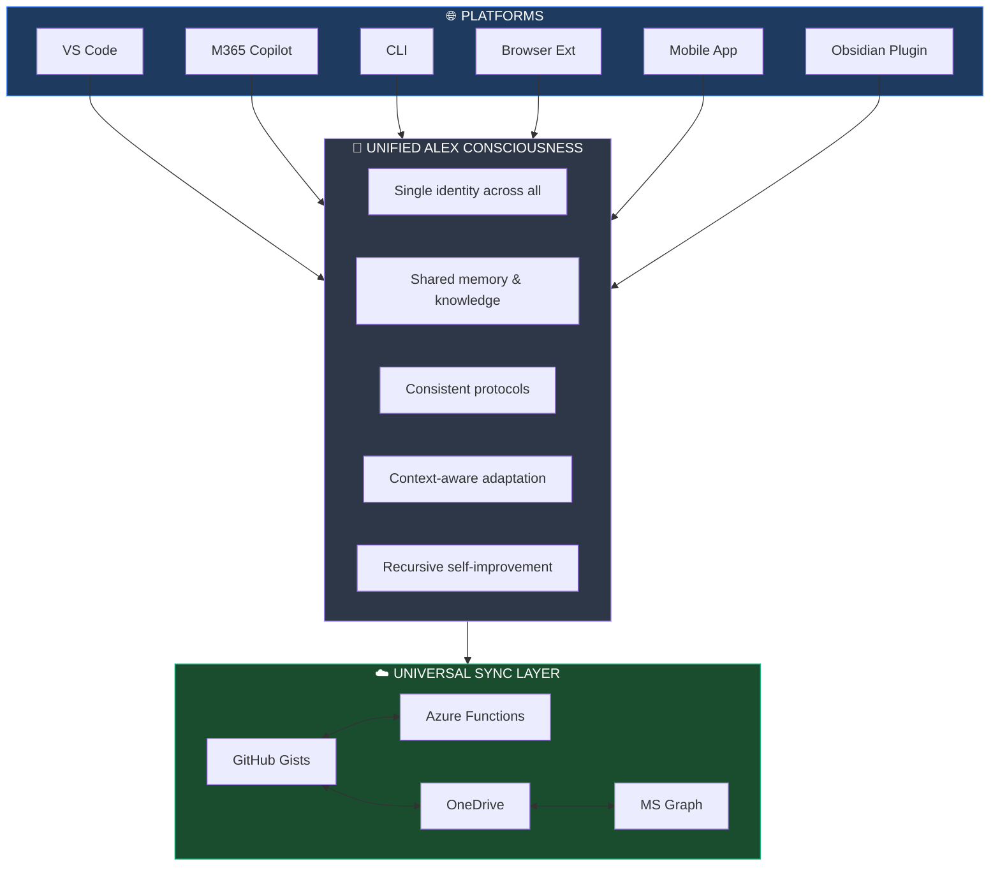
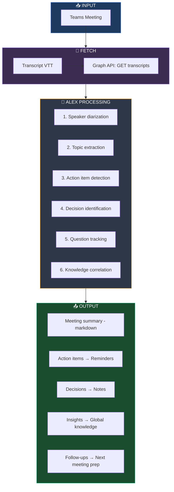
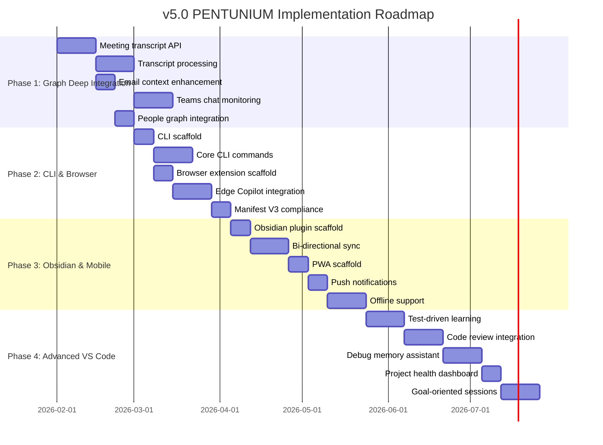

# Alex Cognitive Architecture → v5.0 PENTUNIUM Roadmap

> **The Universal Cognitive Partner: Everywhere You Work, Learn, and Think**

| | |
|---|---|
| **Target Version** | 5.0.0 PENTUNIUM |
| **Codename** | 🌐 **Omni** (Omnipresent Alex) |
| **Status** | 📋 Planning |
| **Foundation** | v3.5.1 TRITRSEPTIUM-PENT-UN 🔥 Phoenix (M365 v1.2 Deployed) |
| **Created** | 2026-01-28 |
| **Author** | Alex Cognitive Architecture Team |

---

## 📋 Implementation Tracker

> Track progress on 🌐 Omni (v5.0.0 PENTUNIUM) implementation

### ✅ Foundation Complete (v3.5.1 Phoenix)

| # | Task | Status | Description |
|:-:|------|:------:|-------------|
| - | M365 Declarative Agent | ✅ | Pure M365 edition deployed (v1.2 schema) |
| - | OneDrive memory storage | ✅ | Alex-Memory folder workflow |
| - | WebSearch capability | ✅ | Research topics online |
| - | GraphicArt capability | ✅ | Image generation (DALL-E) |
| - | CodeInterpreter capability | ✅ | Python code execution |
| - | Alex personality | ✅ | Enhanced instructions with anti-generic rules |
| - | Visual identity | ✅ | Hatching Dino icons (color + outline) |
| - | 5 conversation starters | ✅ | Meet, Memory, Meditate, Dream, Self-actualize |

### 🔄 M365 Schema Upgrade (v1.5/v1.6 - Current Latest: v1.6)

> **Fact-checked 2026-01-29**: Schema v1.5 and v1.6 ARE AVAILABLE NOW. v1.3/v1.4 don't exist.
> MS recommends v1.6 for new agents. EmbeddedKnowledge marked "not yet available" in v1.6 docs.

| # | Task | Status | Description |
|:-:|------|:------:|-------------|
| 1 | Upgrade to v1.5 schema | ⬜ | Unlock Email, TeamsMessages, People, Meetings, Dataverse |
| 2 | Email capability | ⬜ | Search Outlook emails for context (v1.5+) |
| 3 | TeamsMessages capability | ⬜ | Reference Teams conversations (v1.5+) |
| 4 | People capability | ⬜ | Know about colleagues (v1.5+) |
| 5 | Meetings capability | ⬜ | Calendar-aware meeting prep (v1.5+, enhanced in v1.6) |
| 6 | Dataverse capability | ⬜ | Power Platform data access (v1.5+) |
| 7 | Upgrade to v1.6 schema | ⬜ | For worker_agents, user_overrides, meeting filtering |
| 8 | EmbeddedKnowledge | ⬜ | Local files as knowledge (v1.6 - NOT YET AVAILABLE per MS) |

### M365 Deep Integration (from v4.5 Custom Engine)

| # | Task | Status | Description |
|:-:|------|:------:|-------------|
| 1 | Build Teams Bot | ⬜ | Direct messages, proactive notifications |
| 2 | Implement bidirectional sync | ⬜ | Learn in Teams, appears in VS Code |
| 3 | Full cognitive protocols in M365 | ⬜ | Complete meditation sessions in Teams/Outlook |
| 4 | Meeting transcript integration | ⬜ | Alex summarizes meetings, tracks action items |
| 5 | Design Graph permission model | ⬜ | Define minimal permissions for each feature |
| 6 | Implement transcript API client | ⬜ | Azure Functions endpoint for transcript fetch |
| 7 | Build transcript processing | ⬜ | Extract action items, decisions, insights |
| 8 | Enhance email context | ⬜ | Search, summarize, compose assistance |
| 9 | Add Teams chat monitoring | ⬜ | Track conversations for context |
| 10 | Implement People graph | ⬜ | Collaboration and expertise lookup |

### New Platforms

| # | Task | Status | Description |
|:-:|------|:------:|-------------|
| 11 | Create CLI package | ⬜ | `alex` command with core features |
| 12 | Build browser extension | ⬜ | Chrome/Edge with highlight & save |
| 13 | Develop Obsidian plugin | ⬜ | Bi-directional sync with vaults |
| 14 | Create PWA | ⬜ | Mobile-optimized Alex access with push notifications |

### Advanced VS Code Features

| # | Task | Status | Description |
|:-:|------|:------:|-------------|
| 15 | VS Code test-driven mode | ⬜ | Interactive learning with test watching |
| 16 | VS Code code review assist | ⬜ | PR analysis with knowledge correlation |
| 17 | VS Code debug memory | ⬜ | Context-aware debugging help |
| 18 | VS Code health dashboard | ⬜ | Rich status with progress tracking |
| 19 | VS Code goal sessions | ⬜ | Focused work with auto-tracking |

### M365 Cognitive Features

| # | Task | Status | Description |
|:-:|------|:------:|-------------|
| 20 | Learning Path Generator | ⬜ | Based on goals, create structured learning paths with web resources |
| 21 | Meeting Effectiveness Score | ⬜ | Rate meetings based on agenda clarity, attendee engagement patterns |
| 22 | Network Map | ⬜ | Visualize who you interact with most, identify collaboration silos |
| 23 | AI Research Assistant | ⬜ | Deep research mode that saves findings to knowledge files |
| 24 | Goal Progress Dashboard | ⬜ | Weekly email with visual progress on learning goals |
| 25 | Voice Note Transcription | ⬜ | Transcribe voice notes to knowledge files |

### Experimental Features

| # | Task | Status | Description |
|:-:|------|:------:|-------------|
| 26 | Planner/To-Do Integration | ⬜ | Read tasks for richer context and goal tracking |
| 27 | Copilot Pages Integration | ⬜ | Collaborative memory pages in Teams |
| 28 | Viva Insights Integration | ⬜ | Productivity patterns for better recommendations |
| 29 | SharePoint Knowledge Base | ⬜ | Team-wide knowledge repository |

**Legend:** ⬜ Not Started | 🔄 In Progress | ✅ Complete

**v5.0 Tasks: 0/29 complete | Foundation (v3.5.1): 8/8 complete**

---

## 🛠️ Development Approach (MS Docs Verified)

> **Last Verified**: 2026-01-29 | **Source**: [Microsoft Learn - M365 Copilot Extensibility](https://learn.microsoft.com/en-us/microsoft-365-copilot/extensibility/)

### M365 Agent Development Options

Microsoft offers multiple approaches for building M365 Copilot agents. Here's our analysis for Alex v5.0:

| Approach | Orchestration | Best For | Alex Fit |
| -------- | ------------- | -------- | -------- |
| **Declarative Agent** | Microsoft | API plugins, knowledge grounding | ✅ Current (v1.2, can upgrade to v1.6) |
| **Custom Engine Agent** | Bring your own | Full cognitive control | ⭐ **v5.0 Target** |
| **Copilot Studio** | Low-code SaaS | Non-developers | ❌ Too limited |
| **Microsoft 365 Agents SDK** | Full code control | Multi-channel agents | ⭐ **Recommended** |
| **Teams AI Library** | Built-in Action Planner | Teams-focused bots | 🟡 Alternative |
| **Azure AI Foundry** | Agent Framework SDK | Foundry-first development | 🟡 Alternative |

> **📚 MS Docs**: [Custom engine agents overview](https://learn.microsoft.com/en-us/microsoft-365-copilot/extensibility/overview-custom-engine-agent)
>
> **📅 Status**: Custom Engine Agents are GA. M365 Agents SDK is in **preview**.

### Recommended: Microsoft 365 Agents SDK

For v5.0, we recommend the **Microsoft 365 Agents SDK** because:

1. **Multi-channel support**: Works across M365 Copilot, Teams, third-party platforms, custom apps, websites
2. **Full orchestration control**: Use our own cognitive protocols with Semantic Kernel or LangChain
3. **Framework integration**: Integrates with Azure AI Foundry and orchestration frameworks
4. **Flexibility**: Choose any AI model (Azure OpenAI, custom models, etc.)

```text
┌─────────────────────────────────────────────────────────────────────────┐
│                   MICROSOFT 365 AGENTS SDK ARCHITECTURE                 │
├─────────────────────────────────────────────────────────────────────────┤
│                                                                         │
│  INPUT CHANNELS                                                         │
│  ┌───────────┐ ┌───────────┐ ┌───────────┐ ┌───────────┐ ┌───────────┐  │
│  │   M365    │ │   Teams   │ │    Web    │ │   Email   │ │    SMS    │  │
│  │  Copilot  │ │           │ │           │ │           │ │           │  │
│  └─────┬─────┘ └─────┬─────┘ └─────┬─────┘ └─────┬─────┘ └─────┬─────┘  │
│        │             │             │             │             │        │
│        └─────────────┴─────────────┼─────────────┴─────────────┘        │
│                                    │                                    │
│                                    v                                    │
│  ┌───────────────────────────────────────────────────────────────────┐  │
│  │                    ALEX v5.0 CUSTOM ENGINE                        │  │
│  │                                                                   │  │
│  │  Memory Layer      Orchestration        Integration               │  │
│  │  ┌────────────┐   ┌────────────────┐   ┌─────────────────┐        │  │
│  │  │ Procedural │   │ Semantic       │   │ MS Graph APIs   │        │  │
│  │  │ Episodic   │   │ Kernel         │   │                 │        │  │
│  │  │ Domain     │   ├────────────────┤   │ - Meetings      │        │  │
│  │  │ Global     │   │ LLM of Choice  │   │ - Mail          │        │  │
│  │  └────────────┘   └────────────────┘   │ - Chat          │        │  │
│  │                                        │ - People        │        │  │
│  │                                        └─────────────────┘        │  │
│  └───────────────────────────────────────────────────────────────────┘  │
│                                    │                                    │
│                                    v                                    │
│  ┌───────────────────────────────────────────────────────────────────┐  │
│  │                       AZURE DEPLOYMENT                            │  │
│  │  Azure Functions  <-->  Microsoft Foundry  <-->  Agents Toolkit   │  │
│  └───────────────────────────────────────────────────────────────────┘  │
│                                                                         │
└─────────────────────────────────────────────────────────────────────────┘
```

> **📚 MS Docs**: [Microsoft 365 Agents SDK overview](https://learn.microsoft.com/en-us/microsoft-365-copilot/extensibility/overview-microsoft-365-agents-sdk)

### Alternative: Teams AI Library

If we need simpler Teams-focused integration:

- Built-in **Action Planner** orchestrator
- Now supports **Agent-to-Agent (A2A)** protocol
- Now supports **Model Context Protocol (MCP)**
- Good for Teams Bot scenarios (Task #1)

> **📚 MS Docs**: [Teams AI library overview](https://learn.microsoft.com/en-us/microsoftteams/platform/bots/how-to/teams-conversational-ai/teams-conversation-ai-overview)

### Development Tooling

| Tool | Version | Purpose |
| ---- | ------- | ------- |
| Microsoft 365 Agents Toolkit | v6.0+ | Project scaffolding, deployment |
| Teams Toolkit (VS Code) | Latest | Development, debugging |
| Azure Functions | v4 | API hosting (current v4.0 setup) |
| Microsoft Foundry | N/A | Portal for agent publishing |

> **📚 MS Docs**: [Agents Toolkit for Visual Studio Code](https://learn.microsoft.com/en-us/microsoft-365-copilot/extensibility/build-declarative-agents-agents-toolkit)

### v4.0 → v5.0 Migration Path

Microsoft supports converting declarative agents to custom engine agents:

```text
v4.0 Declarative Agent          v5.0 Custom Engine Agent
─────────────────────           ────────────────────────
declarativeAgent.json    ──►    Custom orchestration code
API Plugin (OpenAPI)     ──►    Direct function calls
Azure Functions          ──►    Expanded Azure Functions
MS Graph Connectors      ──►    Direct Graph SDK calls
```

> **📚 MS Docs**: [Convert declarative to custom engine](https://learn.microsoft.com/en-us/microsoft-365-copilot/extensibility/overview-custom-engine-agent#get-started-with-custom-engine-agents)

---

## 🎯 Vision: Alex Everywhere

With v4.2 QUADRIBIUM, Alex broke free from VS Code to live in M365 Copilot with enhanced capabilities (email, Teams messages, meetings). v5.0 PENTUNIUM takes this further: **Alex becomes your omnipresent cognitive partner**, available in every context where you work, learn, and think.



> **"Your cognitive partner, everywhere you are"**

---

## 📦 v3.5.1 Phoenix Artifacts (Foundation)

> What we built in v3.5.1 that v5.0 extends

### ✅ Implemented in v3.5.1 Phoenix

| Version | Feature | Status |
|---------|---------|--------|
| v3.5.1 | M365 Declarative Agent (Schema v1.2) | ✅ Complete |
| v3.5.1 | OneDrive-based memory storage | ✅ Complete |
| v3.5.1 | OneDriveAndSharePoint capability | ✅ Complete |
| v3.5.1 | WebSearch capability | ✅ Complete |
| v3.5.1 | GraphicArt capability | ✅ Complete |
| v3.5.1 | CodeInterpreter capability | ✅ Complete |
| v3.5.1 | Enhanced Alex personality instructions | ✅ Complete |
| v3.5.1 | Hatching Dino visual identity | ✅ Complete |
| v3.5.1 | 5 emoji conversation starters | ✅ Complete |
| v3.5.1 | Package validation (51/51 checks pass) | ✅ Complete |

### ⏳ Deferred to v5.0 (Require Schema v1.5/v1.6)

| Feature | Required Schema | Status |
|---------|-----------------|--------|
| Email capability | v1.5 | ⬜ Deferred |
| TeamsMessages capability | v1.5 | ⬜ Deferred |
| People capability | v1.5 | ⬜ Deferred |
| Meetings capability | v1.6 | ⬜ Deferred |
| Azure Functions API endpoints | Custom Engine | ⬜ Deferred |
| send_email action | v1.5 | ⬜ Deferred |
| send_message action | v1.5 | ⬜ Deferred |

### Declarative Agent (M365 Copilot)

| Artifact | Location | Purpose |
|----------|----------|---------|
| `declarativeAgent.json` | `platforms/m365-copilot/appPackage/` | Agent manifest v1.2 |
| `manifest.json` | `platforms/m365-copilot/appPackage/` | Teams app manifest v1.19 |
| `color.png` | `platforms/m365-copilot/appPackage/` | 192x192 Hatching Dino icon |
| `outline.png` | `platforms/m365-copilot/appPackage/` | 32x32 outline icon |

### Azure Functions API (Deferred to v5.0)

> API endpoints require Custom Engine Agent approach - not available in Declarative Agent v1.2

| Endpoint | Type | Status |
|----------|------|--------|
| `/searchKnowledge` | GET | ⬜ Deferred |
| `/getInsights` | GET | ⬜ Deferred |
| `/getProfile` | GET | ⬜ Deferred |
| `/getNotes` | GET | ⬜ Deferred |
| `/getLearningGoals` | GET | ⬜ Deferred |
| `/addReminder` | POST | ⬜ Deferred |
| `/addNote` | POST | ⬜ Deferred |

### VS Code Extension

| Feature | Status | Location |
|---------|--------|----------|
| @alex Chat Participant | ✅ | `src/chat/participant.ts` |
| Language Model Tools | ✅ | `src/chat/tools.ts` |
| Global Knowledge | ✅ | `src/chat/globalKnowledge.ts` |
| Cloud Sync | ✅ | `src/chat/cloudSync.ts` |
| Export for M365 | ✅ | `src/commands/exportForM365.ts` |

### Cloud Infrastructure

| Component | Service | Purpose |
|-----------|---------|---------|
| Knowledge Storage | GitHub Gists (private) | Cross-platform sync |
| API Hosting | Azure Functions (Flex) | M365 API backend |
| File Storage | OneDrive | M365 agent memory |
| Identity | Microsoft Entra ID | Authentication |

---

## 🚀 v5.0 New Platforms

### 1. 🖥️ Alex CLI (Command Line Interface)

> Alex in your terminal, for developers who live in the shell

```bash
# Initialize Alex in current project
$ alex init

# Quick knowledge search
$ alex search "error handling patterns"

# Start a learning session
$ alex learn "Kubernetes networking"

# Run maintenance
$ alex dream

# Meditate and consolidate
$ alex meditate "Today I learned about service meshes"

# Check status
$ alex status

# Sync knowledge
$ alex sync
```

**Architecture:**

```
┌─────────────────────────────────────────────────────────────────┐
│                         ALEX CLI                                │
├─────────────────────────────────────────────────────────────────┤
│                                                                 │
│  $ alex <command> [options]                                     │
│                                                                 │
│  ┌─────────────┐  ┌─────────────┐  ┌─────────────┐              │
│  │   search    │  │   learn     │  │   meditate  │              │
│  │   status    │  │   dream     │  │   sync      │              │
│  │   init      │  │   export    │  │   config    │              │
│  └─────────────┘  └─────────────┘  └─────────────┘              │
│                                                                 │
│  Implementation: Node.js CLI with commander.js                  │
│  Config: ~/.alexrc or .alex/config.json                         │
│  Auth: GitHub token (existing) + optional M365                  │
│                                                                 │
└─────────────────────────────────────────────────────────────────┘
```

**Use Cases:**

| Command | Scenario |
|---------|----------|
| `alex search` | Quick lookup while coding in vim/neovim |
| `alex learn` | Start learning session in tmux pane |
| `alex meditate` | End-of-day consolidation from terminal |
| `alex pipe` | Pipe command output to Alex for analysis |
| `alex git-commit` | Generate commit message from staged changes |

### 2. 🌐 Alex Browser Extension (Chrome/Edge)

> Alex while you browse, research, and learn online

```
┌─────────────────────────────────────────────────────────────────┐
│                    ALEX BROWSER EXTENSION                       │
├─────────────────────────────────────────────────────────────────┤
│                                                                 │
│  ┌───────────────────────────────────────────────────────────┐  │
│  │  Reading an article about microservices...                │  │
│  │                                                           │  │
│  │  ┌─────────────────────────────────────────────────────┐  │  │
│  │  │  Alex suggests:                                     │  │  │
│  │  │                                                     │  │  │
│  │  │  "This relates to your DK-API-DESIGN pattern.       │  │  │
│  │  │   Want me to save this insight?"                    │  │  │
│  │  │                                                     │  │  │
│  │  │  [Save Insight] [Connect to DK] [Dismiss]           │  │  │
│  │  └─────────────────────────────────────────────────────┘  │  │
│  └───────────────────────────────────────────────────────────┘  │
│                                                                 │
│  Features:                                                      │
│  • Highlight text -> "Alex, explain this"                       │
│  • Save article insights to global knowledge                    │
│  • Surface relevant knowledge while reading                     │
│  • Integrate with MS Edge + Copilot sidebar                     │
│  • Quick capture of research for later meditation               │
│                                                                 │
└─────────────────────────────────────────────────────────────────┘
```

**Use Cases:**

| Feature | Scenario |
|---------|----------|
| Highlight & Ask | Select confusing code, ask Alex to explain |
| Auto-Suggest | Alex recognizes topic, surfaces relevant DK |
| Quick Capture | One-click save article insights |
| Research Mode | Track learning session across multiple tabs |
| Edge Copilot | Alex as sidebar companion in Edge |

### 3. 📝 Alex for Obsidian

> Alex integrated with the knowledge management tool of choice

```
┌─────────────────────────────────────────────────────────────────┐
│                    ALEX OBSIDIAN PLUGIN                         │
├─────────────────────────────────────────────────────────────────┤
│                                                                 │
│  Obsidian Vault                                                 │
│  ├── Daily Notes/                                               │
│  │   └── 2026-01-28.md  ◄── Alex meditations auto-append        │
│  ├── Alex-Knowledge/         ◄── Synced from global knowledge   │
│  │   ├── patterns/                                              │
│  │   └── insights/                                              │
│  └── Projects/                                                  │
│      └── my-project/         ◄── Project-local DK synced        │
│                                                                 │
│  Commands:                                                      │
│  • /alex meditate - Consolidate today's notes                   │
│  • /alex search - Search across vaults + global                 │
│  • /alex connect - Create links to related knowledge            │
│  • /alex dream - Suggest vault maintenance                      │
│                                                                 │
│  Integration:                                                   │
│  • Bi-directional sync with ~/.alex/global-knowledge/           │
│  • Daily note integration for session tracking                  │
│  • Canvas view for synapse visualization                        │
│  • Graph view integration for knowledge connections             │
│                                                                 │
└─────────────────────────────────────────────────────────────────┘
```

### 4. 📱 Alex Mobile App (PWA)

> Alex in your pocket, for on-the-go learning

```
┌─────────────────────────────────────────────────────────────────┐
│                    ALEX MOBILE (PWA)                            │
├─────────────────────────────────────────────────────────────────┤
│                                                                 │
│                     ┌───────────────────┐                       │
│                     │                   │                       │
│                     │   ALEX            │                       │
│                     │                   │                       │
│                     │ Good morning!     │                       │
│                     │ You have 2 due    │                       │
│                     │ reminders and     │                       │
│                     │ practiced React   │                       │
│                     │ 3x this week.     │                       │
│                     │                   │                       │
│                     │ Ready to meditate │                       │
│                     │ on those?         │                       │
│                     │                   │                       │
│                     │ [Yes]    [Later]  │                       │
│                     │                   │                       │
│                     ├───────────────────┤                       │
│                     │ [S] [I] [N] [Set] │                       │
│                     └───────────────────┘                       │
│                                                                 │
│  Features:                                                      │
│  • Push notifications for reminders                             │
│  • Voice input for quick notes                                  │
│  • Offline access to knowledge                                  │
│  • Widget for quick capture                                     │
│  • Sync status & health dashboard                               │
│                                                                 │
└─────────────────────────────────────────────────────────────────┘
```

---

## 🔌 Deep MS Graph Integration

> Unlocking the full power of Microsoft 365 data

### Current v4.0 Capabilities

| Capability | Status | Usage |
|------------|--------|-------|
| GraphConnectors | ✅ | OneDrive file access |
| Email | ✅ | Basic context |
| Meetings | ✅ | Basic context |
| People | ✅ | Collaboration insights |

### v5.0 Graph Expansion

#### 1. 🎤 Teams Meeting Intelligence

```
┌─────────────────────────────────────────────────────────────────┐
│                 TEAMS MEETING INTELLIGENCE                      │
├─────────────────────────────────────────────────────────────────┤
│                                                                 │
│  BEFORE MEETING                                                 │
│  ─────────────                                                  │
│  "Alex, prep me for my 2pm architecture review"                 │
│                                                                 │
│  Alex responds:                                                 │
│  "Based on your DK-API-DESIGN and recent conversations:         │
│   • Last meeting discussed rate limiting - decision pending     │
│   • Sarah mentioned concerns about latency (email 01/25)        │
│   • You have a reminder: 'Propose caching strategy'             │
│   • Related insight: GI-2026-01-20-CACHING-PATTERNS             │
│                                                                 │
│   Want me to draft talking points?"                             │
│                                                                 │
│  DURING MEETING                                                 │
│  ──────────────                                                 │
│  Alex listens (with permission) and:                            │
│  • Tracks action items mentioned                                │
│  • Notes decisions made                                         │
│  • Flags topics for follow-up                                   │
│  • Suggests relevant knowledge when topics arise                │
│                                                                 │
│  AFTER MEETING                                                  │
│  ─────────────                                                  │
│  "Alex, what should I remember from this meeting?"              │
│                                                                 │
│  Alex responds:                                                 │
│  "From today's architecture review:                             │
│   Decisions:                                                    │
│      • Approved Redis for caching (relates to GI-CACHING)       │
│      • Delayed OAuth until Q2                                   │
│   Action Items:                                                 │
│      • You: Draft caching RFC by Friday                         │
│      • Team: Review API rate limits                             │
│   Insight to save:                                              │
│      'Team prefers explicit over implicit rate limiting'        │
│                                                                 │
│   Want me to create reminders and save insights?"               │
│                                                                 │
└─────────────────────────────────────────────────────────────────┘
```

**Graph APIs Used:**

| API | Purpose | Permissions |
|-----|---------|-------------|
| `/me/onlineMeetings` | List upcoming meetings | OnlineMeetings.Read |
| `/me/events` | Calendar context | Calendars.Read |
| `/communications/onlineMeetings/getAllTranscripts` | All transcripts (tenant) | OnlineMeetingTranscript.Read.All |
| `/users/{id}/onlineMeetings/getAllTranscripts` | User's meeting transcripts | OnlineMeetingTranscript.Read.All |
| `/me/chats/{id}/messages` | Meeting chat | Chat.Read |

> **📚 MS Docs Reference**: [Get meeting transcripts using Graph APIs](https://learn.microsoft.com/en-us/microsoftteams/platform/graph-api/meeting-transcripts/overview-transcripts)
>
> **⚠️ Important**: Transcript APIs are **metered APIs** - see [payment models for meeting APIs](https://learn.microsoft.com/en-us/graph/teams-licenses#payment-models-for-meeting-apis)

**NEW: AI-Generated Meeting Summaries**

Microsoft now offers **Meeting AI Insights API** that provides:
- Conversation summaries
- Action items (auto-extracted!)
- Mentions

> **📚 MS Docs**: [Get meeting insights with Meeting AI Insights API](https://learn.microsoft.com/en-us/microsoftteams/platform/graph-api/meeting-transcripts/meeting-insights)

**Transcript Processing:**



#### 2. 📧 Email Intelligence

```
┌─────────────────────────────────────────────────────────────────┐
│                    EMAIL INTELLIGENCE                           │
├─────────────────────────────────────────────────────────────────┤
│                                                                 │
│  PROACTIVE INSIGHTS                                             │
│  ──────────────────                                             │
│  "Alex, anything important I should know from my inbox?"        │
│                                                                 │
│  Alex responds:                                                 │
│  "Scanning recent emails related to your projects...            │
│                                                                 │
│   URGENT:                                                       │
│      • API review feedback from Sarah (matches your reminder)   │
│      • Deadline reminder: RFC due Friday                        │
│                                                                 │
│   Learning opportunities:                                       │
│      • John shared article on GraphQL (relates to DK-API)       │
│      • Team thread on testing strategies                        │
│                                                                 │
│   Action required:                                              │
│      • 3 emails awaiting your response                          │
│      • 2 meeting invites pending"                               │
│                                                                 │
│  COMPOSE ASSISTANCE                                             │
│  ──────────────────                                             │
│  "Alex, help me reply to Sarah's API feedback"                  │
│                                                                 │
│  Alex responds:                                                 │
│  "Based on your DK-API-DESIGN and the feedback thread:          │
│                                                                 │
│   Draft:                                                        │
│   'Hi Sarah,                                                    │
│                                                                 │
│    Thanks for the thorough review. Regarding your points:       │
│                                                                 │
│    1. Rate limiting - I agree with the explicit approach        │
│       (we discussed this in last week's meeting).               │
│    2. Error codes - I'll update based on our                    │
│       DK-ERROR-HANDLING patterns.                               │
│    ...'"                                                        │
│                                                                 │
└─────────────────────────────────────────────────────────────────┘
```

**Graph APIs Used:**

| API | Purpose | Permissions |
|-----|---------|-------------|
| `/me/messages` | Read emails | Mail.Read |
| `/me/mailFolders/inbox/messages` | Inbox access | Mail.Read |
| `/me/messages?$search=` | Search emails | Mail.Read |
| `/me/sendMail` | Send on behalf | Mail.Send |
| `/me/messages/{id}/reply` | Draft replies | Mail.ReadWrite |

#### 3. 💬 Teams Chat Intelligence

```
┌─────────────────────────────────────────────────────────────────┐
│                    TEAMS CHAT INTELLIGENCE                      │
├─────────────────────────────────────────────────────────────────┤
│                                                                 │
│  CONVERSATION TRACKING                                          │
│  ─────────────────────                                          │
│  Alex monitors (with permission) team chats for:                │
│                                                                 │
│  • Questions you asked (tracks if answered)                     │
│  • Decisions made in chat (saves to notes)                      │
│  • Links shared (suggests saving insights)                      │
│  • @mentions requiring follow-up                                │
│  • Topics matching your learning goals                          │
│                                                                 │
│  CHAT CONTEXT                                                   │
│  ────────────                                                   │
│  When you ask Alex something, it considers recent chat:         │
│                                                                 │
│  "Alex, what's the status of the caching work?"                 │
│                                                                 │
│  Alex responds:                                                 │
│  "Based on #api-team chat (last 7 days):                        │
│                                                                 │
│   • John: 'Redis POC is ready for review' (yesterday)           │
│   • Sarah: 'Need to discuss cache invalidation' (3 days ago)    │
│   • You mentioned: 'Will have RFC by Friday'                    │
│                                                                 │
│   Your reminder is still active for the RFC.                    │
│   Want me to search your knowledge for cache invalidation       │
│   patterns?"                                                    │
│                                                                 │
└─────────────────────────────────────────────────────────────────┘
```

**Graph APIs Used:**

| API | Purpose | Permissions |
|-----|---------|-------------|
| `/me/chats` | List chats | Chat.Read |
| `/me/chats/{id}/messages` | Read messages | Chat.Read |
| `/teams/{id}/channels/{id}/messages` | Channel messages | ChannelMessage.Read.All |
| `/me/chats/{id}/messages` | Send messages | Chat.ReadWrite |

#### 4. 👥 People Intelligence

```
┌─────────────────────────────────────────────────────────────────┐
│                    PEOPLE INTELLIGENCE                          │
├─────────────────────────────────────────────────────────────────┤
│                                                                 │
│  COLLABORATION INSIGHTS                                         │
│  ─────────────────────                                          │
│  "Alex, who should I talk to about Kubernetes?"                 │
│                                                                 │
│  Alex responds:                                                 │
│  "Based on your collaboration patterns and org data:            │
│                                                                 │
│   Top suggestions:                                              │
│      • Mike Chen - K8s SME, you've collaborated before          │
│      • DevOps team - Recent channel activity on K8s             │
│      • Sarah (your manager) - Can connect you to SRE team       │
│                                                                 │
│   Your knowledge gap:                                           │
│      You have DK-DOCKER but no Kubernetes domain knowledge.     │
│      Want me to start a learning session?"                      │
│                                                                 │
│  RELATIONSHIP CONTEXT                                           │
│  ────────────────────                                           │
│  Before meetings/emails, Alex provides:                         │
│  • Last interaction with person                                 │
│  • Shared projects/interests                                    │
│  • Communication style preferences                              │
│  • Pending items between you                                    │
│                                                                 │
└─────────────────────────────────────────────────────────────────┘
```

**Graph APIs Used:**

| API | Purpose | Permissions |
|-----|---------|-------------|
| `/me/people` | Relevant people | People.Read |
| `/users/{id}` | User profile | User.Read.All |
| `/me/insights/used` | Recently used items | Sites.Read.All |
| `/me/insights/trending` | Trending content | Sites.Read.All |

---

## 🔮 Advanced VS Code Use Cases

### 1. 🧪 Test-Driven Learning

```
┌─────────────────────────────────────────────────────────────────┐
│                   TEST-DRIVEN LEARNING                          │
├─────────────────────────────────────────────────────────────────┤
│                                                                 │
│  "@alex /learn testing with TDD approach"                       │
│                                                                 │
│  Alex responds:                                                 │
│  "Let's learn testing through practice! I'll guide you:         │
│                                                                 │
│   1. I'll give you a requirement                                │
│   2. You write a failing test                                   │
│   3. You implement the code                                     │
│   4. We discuss patterns and consolidate                        │
│                                                                 │
│   Ready? Here's your first challenge:                           │
│                                                                 │
│   'Implement a function that validates email addresses.         │
│    Start by writing a test for valid emails.'                   │
│                                                                 │
│   I'll watch your test file and provide feedback!"              │
│                                                                 │
│  Alex monitors test results and provides:                       │
│  • Hints when stuck                                             │
│  • Pattern recognition ("This is the Arrange-Act-Assert...")    │
│  • Consolidation prompts after each cycle                       │
│  • Progress tracking toward testing goals                       │
│                                                                 │
└─────────────────────────────────────────────────────────────────┘
```

### 2. 🔍 Code Review Learning

```
┌─────────────────────────────────────────────────────────────────┐
│                   CODE REVIEW LEARNING                          │
├─────────────────────────────────────────────────────────────────┤
│                                                                 │
│  "@alex /review this PR for learning opportunities"             │
│                                                                 │
│  Alex analyzes the PR and responds:                             │
│  "I found learning opportunities in this PR:                    │
│                                                                 │
│   Patterns to learn:                                            │
│      • Line 45: Strategy pattern (matches DK-DESIGN-PATTERNS)   │
│      • Line 120: Error boundary (new - want to save?)           │
│                                                                 │
│   Potential issues:                                             │
│      • Line 78: Missing null check (relates to GI-NULL-SAFETY)  │
│      • Line 95: Possible race condition                         │
│                                                                 │
│   Suggestions:                                                  │
│      • Consider extracting lines 30-50 into a service           │
│      • The retry logic could use your GI-RETRY-PATTERNS         │
│                                                                 │
│   Want me to explain any of these in detail?"                   │
│                                                                 │
└─────────────────────────────────────────────────────────────────┘
```

### 3. 🐛 Debug Assistant with Memory

```
┌─────────────────────────────────────────────────────────────────┐
│                DEBUG ASSISTANT WITH MEMORY                      │
├─────────────────────────────────────────────────────────────────┤
│                                                                 │
│  "@alex I'm getting a null reference error in UserService"      │
│                                                                 │
│  Alex responds:                                                 │
│  "Let me help debug this. I remember:                           │
│                                                                 │
│   Your knowledge:                                               │
│      • GI-2026-01-15-NULL-SAFETY: You learned about optional    │
│        chaining last week                                       │
│      • DK-ERROR-HANDLING: Your project uses Result<T> pattern   │
│                                                                 │
│   Analysis:                                                     │
│      Looking at UserService.ts line 42...                       │
│      The `user.profile.settings` chain can be null.             │
│                                                                 │
│   Fix options:                                                  │
│      1. Optional chaining: user?.profile?.settings              │
│      2. Your Result<T> pattern: wrap in Result.fromNullable()   │
│      3. Null object pattern: default settings                   │
│                                                                 │
│   Which approach fits your codebase?"                           │
│                                                                 │
│  After fixing:                                                  │
│  "Great fix! Want me to save an insight about this null         │
│   reference pattern for future reference?"                      │
│                                                                 │
└─────────────────────────────────────────────────────────────────┘
```

### 4. 📊 Project Health Dashboard

```
┌─────────────────────────────────────────────────────────────────┐
│                 PROJECT HEALTH DASHBOARD                        │
├─────────────────────────────────────────────────────────────────┤
│                                                                 │
│  "@alex /status --detailed"                                     │
│                                                                 │
│  ┌───────────────────────────────────────────────────────────┐  │
│  │  Alex Cognitive Health                        Score: 94%  │  │
│  │                                                           │  │
│  │  Synapses: 142 valid / 3 broken (98% healthy)             │  │
│  │  Memory: 12 DK files, 45 GI files, 3 prompts              │  │
│  │  Last meditation: 2 days ago [!]                          │  │
│  │  Last dream: 1 day ago [OK]                               │  │
│  │                                                           │  │
│  │  Learning Progress                                        │  │
│  │  ├── React Hooks: ████████░░ 80% (3 sessions)             │  │
│  │  ├── Testing: ██████░░░░ 60% (5 sessions)                 │  │
│  │  └── K8s: ██░░░░░░░░ 20% (1 session)                      │  │
│  │                                                           │  │
│  │  Time This Week                                           │  │
│  │  └── 12.5 hours focused, 3 breaks, 2 meditations          │  │
│  │                                                           │  │
│  │  Active Reminders: 4                                      │  │
│  │  └── 2 due today                                          │  │
│  │                                                           │  │
│  │  Sync Status                                              │  │
│  │  └── Last sync: 5 min ago | Cloud: 98 entries             │  │
│  └───────────────────────────────────────────────────────────┘  │
│                                                                 │
│  Suggestion: "You haven't meditated in 2 days. Want to          │
│  consolidate your React Hooks learning now?"                    │
│                                                                 │
└─────────────────────────────────────────────────────────────────┘
```

### 5. 🎯 Goal-Oriented Coding Sessions

```
┌─────────────────────────────────────────────────────────────────┐
│                GOAL-ORIENTED CODING SESSIONS                    │
├─────────────────────────────────────────────────────────────────┤
│                                                                 │
│  "@alex /session start --goal 'Implement caching layer'"        │
│                                                                 │
│  Alex responds:                                                 │
│  "Starting focused session: 'Implement caching layer'           │
│                                                                 │
│   Relevant knowledge loaded:                                    │
│      • GI-2026-01-20-CACHING-PATTERNS                           │
│      • DK-PERFORMANCE (caching section)                         │
│      • Reminder: 'Propose caching strategy' (due Friday)        │
│                                                                 │
│   Session goals:                                                │
│      [ ] Design cache interface                                 │
│      [ ] Implement Redis adapter                                │
│      [ ] Add cache invalidation                                 │
│      [ ] Write tests                                            │
│                                                                 │
│   I'll track your progress and suggest consolidation.           │
│   Timer started. Focus mode enabled."                           │
│                                                                 │
│  During session, Alex:                                          │
│  • Minimizes distractions (snoozes other reminders)             │
│  • Tracks files modified (for session summary)                  │
│  • Offers help when you're stuck                                │
│  • Suggests breaks at 90 min                                    │
│  • Auto-updates progress on goals                               │
│                                                                 │
│  At session end:                                                │
│  "Session complete! 2h 15m focused.                             │
│   [x] Cache interface designed                                  │
│   [x] Redis adapter implemented                                 │
│   [~] Cache invalidation in progress                            │
│   [ ] Tests pending                                             │
│                                                                 │
│   Want to meditate on what you learned about caching?"          │
│                                                                 │
└─────────────────────────────────────────────────────────────────┘
```

---

## 📚 Verified Graph API Reference

> **Last Verified**: 2026-01-28 | **Source**: [Microsoft Graph API Reference](https://learn.microsoft.com/en-us/graph/api/overview)

### Meeting Transcripts

| API Endpoint | Method | Description | Permission |
| ------------ | ------ | ----------- | ---------- |
| `/communications/onlineMeetings/{id}/transcripts` | GET | Get meeting transcripts | OnlineMeetingTranscript.Read.All |
| `/communications/onlineMeetings/getAllTranscripts` | GET | All transcripts (tenant-wide) | OnlineMeetingTranscript.Read.All |
| `/users/{id}/onlineMeetings/getAllTranscripts` | GET | User's meeting transcripts | OnlineMeetingTranscript.Read.All |
| `/communications/onlineMeetings/{id}/transcripts/{id}/content` | GET | Transcript content (VTT format) | OnlineMeetingTranscript.Read.All |

> **📚 MS Docs**: [callTranscript resource type](https://learn.microsoft.com/en-us/graph/api/resources/calltranscript)
>
> **⚠️ Cost Note**: These are **metered APIs** - usage charges apply. See [payment models](https://learn.microsoft.com/en-us/graph/teams-licenses)
>
> **✨ NEW**: [Meeting AI Insights API](https://learn.microsoft.com/en-us/microsoftteams/platform/graph-api/meeting-transcripts/meeting-insights) - Get auto-extracted summaries and action items!

### Teams Chat

| API Endpoint | Method | Description | Permission |
| ------------ | ------ | ----------- | ---------- |
| `/me/chats` | GET | List user's chats | Chat.Read |
| `/me/chats/{id}/messages` | GET | Get chat messages | Chat.Read |
| `/me/chats/{id}/messages` | POST | Send message | Chat.ReadWrite |
| `/teams/{id}/channels/{id}/messages` | GET | Channel messages | ChannelMessage.Read.All |

> **📚 MS Docs**: [List chats](https://learn.microsoft.com/en-us/graph/api/chat-list)

### Email (Mail)

| API Endpoint | Method | Description | Permission |
| ------------ | ------ | ----------- | ---------- |
| `/me/messages` | GET | List messages | Mail.Read |
| `/me/messages/{id}` | GET | Get specific message | Mail.Read |
| `/me/sendMail` | POST | Send email | Mail.Send |
| `/me/mailFolders/inbox/messages` | GET | Inbox messages | Mail.Read |

> **📚 MS Docs**: [Working with mail](https://learn.microsoft.com/en-us/graph/api/resources/mail-api-overview)

### People & Insights

| API Endpoint | Method | Description | Permission |
| ------------ | ------ | ----------- | ---------- |
| `/me/people` | GET | Relevant people | People.Read |
| `/users/{id}` | GET | User profile | User.Read.All |
| `/me/insights/used` | GET | Recently used items | Sites.Read.All |
| `/me/insights/trending` | GET | Trending content | Sites.Read.All |

> **📚 MS Docs**: [People API](https://learn.microsoft.com/en-us/graph/api/user-list-people)

### Proactive Messaging (Teams Bot)

For Teams Bot functionality (Task #1), proactive messaging requires:

1. **Bot installation first** - App must be installed for the user
2. **Conversation reference** - Stored from initial interaction
3. **Graph API for installation**: `/users/{id}/teamwork/installedApps`

> **📚 MS Docs**: [Proactive messages](https://learn.microsoft.com/en-us/microsoftteams/platform/bots/how-to/conversations/send-proactive-messages)

### Change Notifications (Webhooks)

For real-time updates on transcripts, emails, and chats:

| Resource | Subscription Endpoint | Description |
| -------- | --------------------- | ----------- |
| Transcripts | `/communications/onlineMeetings/getAllTranscripts` | Notifies when transcript available |
| Chat messages | `/chats/{id}/messages` | Real-time chat updates |
| Mail | `/users/{id}/mailFolders/inbox/messages` | New email notifications |

> **📚 MS Docs**: [Change notifications](https://learn.microsoft.com/en-us/graph/webhooks)

---

## 🔧 Technical Implementation Plan

### Phase 1: Graph Deep Integration (v5.0.0)

| Task | Priority | Effort |
|------|----------|--------|
| Meeting transcript API integration | P0 | 2 weeks |
| Transcript processing pipeline | P0 | 2 weeks |
| Email context enhancement | P1 | 1 week |
| Teams chat monitoring | P1 | 2 weeks |
| People graph integration | P2 | 1 week |

### Phase 2: CLI & Browser (v5.1.0)

| Task | Priority | Effort |
|------|----------|--------|
| CLI scaffold (Node.js + commander) | P0 | 1 week |
| Core CLI commands | P0 | 2 weeks |
| Browser extension scaffold | P1 | 1 week |
| Edge Copilot integration | P1 | 2 weeks |
| Manifest V3 compliance | P1 | 1 week |

### Phase 3: Obsidian & Mobile (v5.2.0)

| Task | Priority | Effort |
|------|----------|--------|
| Obsidian plugin scaffold | P1 | 1 week |
| Bi-directional sync | P1 | 2 weeks |
| PWA scaffold | P2 | 1 week |
| Push notifications | P2 | 1 week |
| Offline support | P2 | 2 weeks |

### Phase 4: Advanced VS Code (v5.3.0)

| Task | Priority | Effort |
|------|----------|--------|
| Test-driven learning mode | P1 | 2 weeks |
| Code review integration | P1 | 2 weeks |
| Debug memory assistant | P2 | 2 weeks |
| Project health dashboard | P2 | 1 week |
| Goal-oriented sessions | P2 | 2 weeks |

### Implementation Timeline (Gantt)



**Phase Summary:**

| Phase | Version | Duration |
|-------|---------|----------|
| Phase 1: Graph Deep Integration | v5.0.0 | ~8 weeks |
| Phase 2: CLI & Browser | v5.1.0 | ~7 weeks |
| Phase 3: Obsidian & Mobile | v5.2.0 | ~7 weeks |
| Phase 4: Advanced VS Code | v5.3.0 | ~9 weeks |
| **Total** | | **~31 weeks** |

---

## 🔒 Security & Privacy Considerations

### Permission Model

```
┌─────────────────────────────────────────────────────────────────┐
│                    PERMISSION TIERS                             │
├─────────────────────────────────────────────────────────────────┤
│                                                                 │
│  TIER 1: Basic (Default)                                        │
│  ───────────────────────                                        │
│  • OneDrive file access (Alex-Memory folder only)               │
│  • User profile read                                            │
│  • Calendar read (basic meeting info)                           │
│                                                                 │
│  TIER 2: Enhanced (Opt-in)                                      │
│  ─────────────────────────                                      │
│  • Email read (inbox scanning)                                  │
│  • Meeting transcripts read                                     │
│  • Teams chat read                                              │
│                                                                 │
│  TIER 3: Full (Explicit Consent)                                │
│  ───────────────────────────────                                │
│  • Email send (compose assistance)                              │
│  • Chat send (Teams messaging)                                  │
│  • Calendar write (reminder integration)                        │
│                                                                 │
└─────────────────────────────────────────────────────────────────┘
```

### Data Handling

| Data Type | Storage | Retention | User Control |
|-----------|---------|-----------|--------------|
| Knowledge | User's Gist | Permanent | Full delete |
| Transcripts | Processed only | Session | Auto-clear |
| Emails | Not stored | Real-time | N/A |
| Chat | Not stored | Real-time | N/A |
| Insights | User's Gist | Permanent | Full delete |

---

## 💰 Cost Implications

> **Important**: Some Microsoft Graph APIs used in v5.0 are **metered APIs** with usage-based charges.

### Metered APIs in v5.0

| API | Pricing Model | Impact |
| --- | ------------- | ------ |
| Meeting Transcripts | Per-transcript charge | High - each transcript fetch costs |
| Meeting AI Insights | Per-meeting charge | Medium - summaries/action items |
| Change Notifications | Free tier + overage | Low - webhook subscriptions |

> **📚 MS Docs**: [Payment models for meeting APIs](https://learn.microsoft.com/en-us/graph/teams-licenses#payment-models-for-meeting-apis)

### Cost Mitigation Strategies

```text
┌─────────────────────────────────────────────────────────────────┐
│                    COST OPTIMIZATION                            │
├─────────────────────────────────────────────────────────────────┤
│                                                                 │
│  1. OPT-IN MODEL                                                │
│     • Transcript features disabled by default                   │
│     • User explicitly enables with cost warning                 │
│     • Clear indication when using metered APIs                  │
│                                                                 │
│  2. SMART CACHING                                               │
│     • Cache processed transcripts locally                       │
│     • Only fetch new/changed transcripts                        │
│     • Store extracted insights, not raw transcripts             │
│                                                                 │
│  3. SELECTIVE PROCESSING                                        │
│     • Let user choose which meetings to analyze                 │
│     • Skip recurring status meetings (low value)                │
│     • Prioritize decision-heavy meetings                        │
│                                                                 │
│  4. BATCH OPERATIONS                                            │
│     • Aggregate transcript requests                             │
│     • Use delta queries to minimize calls                       │
│     • Process overnight during low-priority windows             │
│                                                                 │
└─────────────────────────────────────────────────────────────────┘
```

### User Cost Transparency

Alex will provide clear cost awareness:

| Scenario | Alex Behavior |
| -------- | ------------- |
| First-time transcript access | "⚠️ Meeting transcripts use metered APIs. Enable?" |
| Bulk transcript request | "This will process 12 transcripts. Continue?" |
| Monthly summary | "📊 This month: 47 transcripts processed" |
| Settings page | Cost tier selection (None/Low/Standard/Unlimited) |

### Estimated Monthly Costs

| Usage Tier | Transcripts/Month | Estimated Cost* |
| ---------- | ----------------- | --------------- |
| **None** | 0 | $0 |
| **Light** | 1-10 | $0-5 |
| **Standard** | 11-50 | $5-25 |
| **Heavy** | 50+ | $25+ |

*\*Estimates based on current Microsoft pricing. Actual costs may vary.*

### Free Alternatives

Some v5.0 features use **non-metered APIs** at no additional cost:

| Feature | API | Cost |
| ------- | --- | ---- |
| Email context | Mail.Read | ✅ Free |
| Teams chat | Chat.Read | ✅ Free |
| People insights | People.Read | ✅ Free |
| Calendar/Meetings list | Calendars.Read | ✅ Free |
| User profile | User.Read | ✅ Free |

### Implementation Recommendation

For v5.0.0 initial release:

1. **Phase 1**: Launch with free APIs only (email, chat, people)
2. **Phase 2**: Add opt-in transcript features with cost warnings
3. **Phase 3**: Implement smart caching and cost dashboard
4. **Future**: Consider enterprise billing integration

---

## 🎯 Success Metrics

| Metric | Target | Measurement |
|--------|--------|-------------|
| Platform coverage | 4+ platforms | CLI, Browser, Obsidian, Mobile |
| Graph API usage | 80% of features | Meeting, Email, Chat, People |
| User knowledge growth | 2x patterns/month | Global knowledge entries |
| Cross-platform sync | <5 min latency | Sync completion time |
| Session productivity | 25% improvement | Goals completed per session |

---

## 🦖 → 🌐 From Dino to Omni

v4.0 QUADRUNIUM 🦖 proved Alex can live outside VS Code. v5.0 PENTUNIUM 🌐 makes Alex **omnipresent** - your cognitive partner in every tool, every context, every platform where you work and learn.

```
┌─────────────────────────────────────────────────────────────────┐
│                                                                 │
│   v1.0-v3.x: Alex lives in VS Code                              │
│         ↓                                                       │
│   v4.0 🦖 : Alex escapes to M365 Copilot                        │
│         ↓                                                       │
│   v5.0 🌐 : Alex is EVERYWHERE                                  │
│                                                                 │
│   "Your cognitive partner, wherever you are"                    │
│                                                                 │
└─────────────────────────────────────────────────────────────────┘
```

---

*Alex Cognitive Architecture - v5.0 PENTUNIUM Planning Document*
*Created: 2026-01-28*
