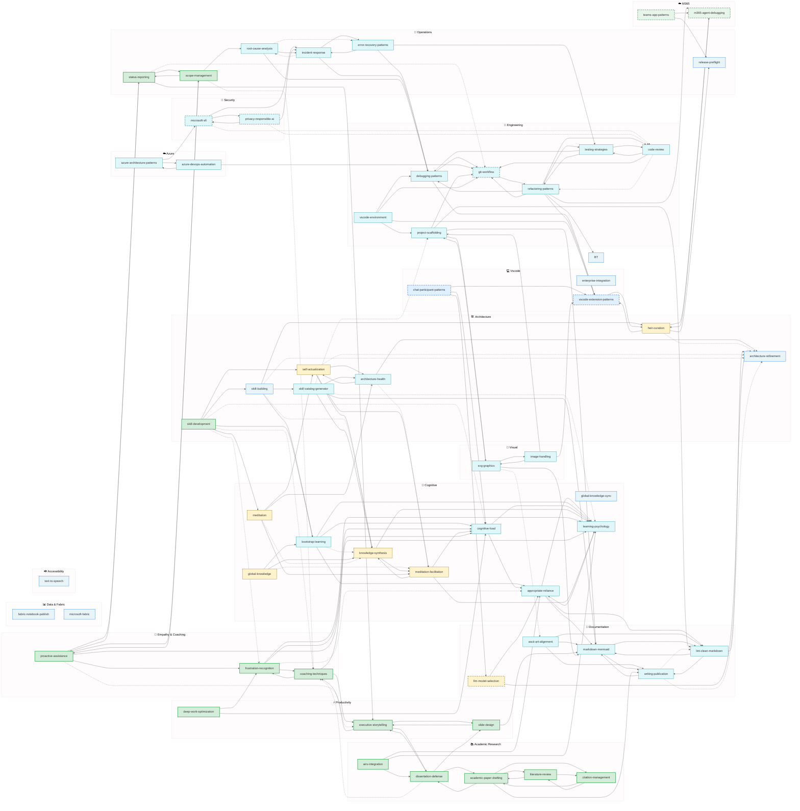

# Alex Skills Catalog (Generated)

> Generated: 2026-02-12
> Total Skills: **102** (92 inheritable, 4 master-only, 1 universal, 3 VS Code, 2 M365)
> ⚠️ **Note**: This catalog is a simplified network diagram. See SKILLS-CATALOG.md for complete inventory.
> 🎉 **+12 skills promoted from sandbox heir** (frustration-recognition, coaching-techniques, deep-work-optimization, executive-storytelling, slide-design, academic-paper-drafting, literature-review, citation-management, dissertation-defense, azure-architecture-patterns, azure-devops-automation, airs-integration)
> 🆕 **+1 meta-skill**: skill-building (guides heirs in creating promotable skills)
> 🆕 **+1 growth skill**: skill-development (track wishlist, contextual skill acquisition)
> 🆕 **+6 domain skills**: bicep-avm-mastery, database-design, microsoft-graph-api, multi-agent-orchestration, observability-monitoring, performance-profiling

---

## Network Diagram

---

## Legend

| Color           | Inheritance              |
| --------------- | ------------------------ |
| 🟨 Yellow        | Master-only              |
| 🟦 Blue          | VS Code heir             |
| 🟩 Green         | M365 heir                |
| 💚 Green (solid) | NEW (promoted from heir) |
| 🧊 Cyan          | Inheritable              |

| Arrow  | Meaning                  |
| ------ | ------------------------ |
| `<-->` | Bidirectional (mutual)   |
| `-->`  | Strong connection (≥0.7) |
| `-.->` | Weak connection (<0.7)   |

---

## Skills in Network Diagram

> Skills shown below are those with synaptic connections. For complete 102-skill inventory, see SKILLS-CATALOG.md.

### 💚 NEW - Promoted from Heir (13)

| Skill                       | Category     | Connections |
| --------------------------- | ------------ | ----------- |
| frustration-recognition     | Empathy      | 4           |
| coaching-techniques         | Empathy      | 3           |
| academic-paper-drafting     | Research     | 4           |
| literature-review           | Research     | 2           |
| citation-management         | Research     | 2           |
| dissertation-defense        | Research     | 4           |
| airs-integration            | Research     | 3           |
| deep-work-optimization      | Productivity | 2           |
| executive-storytelling      | Productivity | 3           |
| slide-design                | Productivity | 2           |
| azure-architecture-patterns | Azure        | 2           |
| azure-devops-automation     | Azure        | 2           |
| skill-development           | Architecture | 7           |

### 🧊 Inheritable (29 shown)

| Skill                   | Connections |
| ----------------------- | ----------- |
| appropriate-reliance    | 4           |
| architecture-health     | 3           |
| ascii-art-alignment     | 3           |
| bootstrap-learning      | 4           |
| code-review             | 3           |
| cognitive-load          | 3           |
| debugging-patterns      | 2           |
| error-recovery-patterns | 3           |
| fabric-notebook-publish | 4           |
| git-workflow            | 2           |
| global-knowledge-sync   | 3           |
| image-handling          | 3           |
| incident-response       | 3           |
| learning-psychology     | 3           |
| lint-clean-markdown     | 3           |
| markdown-mermaid        | 2           |
| microsoft-fabric        | 5           |
| microsoft-sfi           | 4           |
| privacy-responsible-ai  | 3           |
| project-scaffolding     | 4           |
| refactoring-patterns    | 3           |
| release-preflight       | 5           |
| root-cause-analysis     | 3           |
| skill-catalog-generator | 5           |
| svg-graphics            | 4           |
| testing-strategies      | 3           |
| text-to-speech          | 6           |
| vscode-environment      | 4           |
| writing-publication     | 3           |

### 🟨 Master-Only (8 shown)

| Skill                   | Connections |
| ----------------------- | ----------- |
| architecture-refinement | 5           |
| global-knowledge        | 3           |
| heir-curation           | 4           |
| knowledge-synthesis     | 3           |
| llm-model-selection     | 2           |
| meditation              | 4           |
| meditation-facilitation | 4           |
| self-actualization      | 4           |

### 🟦 VS Code Heir (2)

| Skill                     | Connections |
| ------------------------- | ----------- |
| chat-participant-patterns | 3           |
| vscode-extension-patterns | 2           |

### 🟩 M365 Heir (2)

| Skill                | Connections |
| -------------------- | ----------- |
| m365-agent-debugging | 1           |
| teams-app-patterns   | 2           |

---

## Staleness-Prone Skills

| Skill                     | Reason                          |
| ------------------------- | ------------------------------- |
| vscode-extension-patterns | Platform/API changes frequently |
| chat-participant-patterns | Platform/API changes frequently |
| m365-agent-debugging      | Platform/API changes frequently |
| teams-app-patterns        | Platform/API changes frequently |
| llm-model-selection       | Platform/API changes frequently |
| git-workflow              | Platform/API changes frequently |
| privacy-responsible-ai    | Platform/API changes frequently |
| microsoft-sfi             | Platform/API changes frequently |

---

*Generated by Alex: Generate Skill Catalog command*
