# Alex Skills Catalog (Generated)

> Generated: 2026-02-05
> Total Skills: **71** (60 inheritable, 11 master-only, 2 VS Code, 2 M365)
> ⚠️ **Note**: This catalog is a simplified snapshot. See [alex_docs/SKILLS-CATALOG.md](alex_docs/SKILLS-CATALOG.md) for complete inventory.
>
> **Newly Promoted (v4.2.4)**: text-to-speech, fabric-notebook-publish, microsoft-fabric

---

## Network Diagram

```mermaid
%%{init: {'theme': 'base', 'themeVariables': { 'lineColor': '#666', 'primaryColor': '#e8f4f8', 'primaryBorderColor': '#0969da'}}}%%
flowchart LR
    subgraph Cognitive["🧠 Cognitive"]
        AR[appropriate-reliance]
        BL[bootstrap-learning]
        CL[cognitive-load]
        GK[global-knowledge]
        KS[knowledge-synthesis]
        LP[learning-psychology]
        M[meditation]
        MF[meditation-facilitation]
    end
    subgraph Architecture["🏗️ Architecture"]
        AH[architecture-health]
        AR[architecture-refinement]
        HC[heir-curation]
        SA[self-actualization]
        SCG[skill-catalog-generator]
    end
    subgraph Documentation["📝 Documentation"]
        AAA[ascii-art-alignment]
        LCM[lint-clean-markdown]
        LMS[llm-model-selection]
        MM[markdown-mermaid]
        WP[writing-publication]
    end
    subgraph Vscode["💻 Vscode"]
        CPP[chat-participant-patterns]
        VEP[vscode-extension-patterns]
    end
    subgraph Engineering["🔧 Engineering"]
        CR[code-review]
        DP[debugging-patterns]
        GW[git-workflow]
        PS[project-scaffolding]
        RP[refactoring-patterns]
        TS[testing-strategies]
        VE[vscode-environment]
    end
    subgraph Data["📊 Data & Fabric"]
        FNP[fabric-notebook-publish]
        MFB[microsoft-fabric]
    end
    subgraph Accessibility["🔊 Accessibility"]
        TTS[text-to-speech]
    end
    subgraph Operations["🚨 Operations"]
        ERP[error-recovery-patterns]
        IR[incident-response]
        RP[release-preflight]
        RCA[root-cause-analysis]
    end
    subgraph Visual["🎨 Visual"]
        IH[image-handling]
        SG[svg-graphics]
    end
    subgraph M365["☁️ M365"]
        MAD[m365-agent-debugging]
        TAP[teams-app-patterns]
    end
    subgraph Security["🔐 Security"]
        MS[microsoft-sfi]
        PRA[privacy-responsible-ai]
    end

    %% Connections
    AR --> AR & LP & MM & LCM
    AH --> SA & AR
    AH -.-> MF
    AAA --> MM & LCM & WP
    BT --> AH & DP & ERP & RCA
    BT -.-> IR
    BL --> LP & CL & AR
    BL -.-> KS
    CPP --> VEP & LMS & CL
    CR --> TS & GW
    CR -.-> RP
    CL --> LP & AR
    DP --> GW & VEP
    ERP --> DP & IR & TS
    GW --> RP
    GK --> KS & BL
    GK -.-> MF
    HC --> VEP & MAD & RP
    HC -.-> AR
    IH --> SG & PS & VEP
    IR -.-> RCA
    IR --> ERP & DP
    KS --> MF & LP
    LP --> AR
    LCM --> MM & AR & WP
    LMS --> AR & AR
    MAD --> HC
    MM --> WP & LCM
    M --> MF & SA & AH
    M -.-> KS
    MF --> LP & CL & KS
    MS --> PRA & IR
    MS -.-> CR
    PRA --> MS & IR
    PRA -.-> CR
    PS --> MM & SG & LCM & GW
    RP --> TS & DP & CR & GW & BT & VEP & MAD
    RCA --> DP & IR
    RCA -.-> ERP
    SA --> AH & MF & KS
    SA -.-> AR
    SCG --> MM & AH & KS
    SCG -.-> LP & PS
    SG --> PS & IH & MM
    SG -.-> AAA
    TAP --> MAD & RP
    TS --> DP & RP & CR
    VE --> PS & VEP & GW & DP
    VEP --> HC
    WP --> MM
    WP -.-> LCM & AR

    %% Styling
    classDef master fill:#fff3cd,stroke:#856404
    classDef vscode fill:#e1f0ff,stroke:#0969da
    classDef m365 fill:#e6f4ea,stroke:#1a7f37
    classDef inheritable fill:#e0f7fa,stroke:#00838f
    classDef temp fill:#f3e8ff,stroke:#7c3aed,stroke-dasharray:5 5
    classDef stale stroke-dasharray:5 5,stroke-width:2px

    class AR,GK,HC,KS,LMS,M,MF,SA master
    class CPP,VEP vscode
    class MAD,TAP m365
    class AR,AH,AAA,BL,CR,CL,DP,ERP,GW,IH,IR,LP,LCM,MM,MS,PRA,PS,RP,RP,RCA,SCG,SG,TS,VE,WP inheritable
    class BT temp
    class CPP,GW,LMS,MAD,MS,PRA,TAP,VEP stale
```

---

## Legend

| Color             | Inheritance  |
| ----------------- | ------------ |
| 🟨 Yellow          | Master-only  |
| 🟦 Blue            | VS Code heir |
| 🟩 Green           | M365 heir    |
| 🟪 Purple (dashed) | Temporary    |
| 🧊 Cyan            | Inheritable  |

| Arrow  | Meaning                  |
| ------ | ------------------------ |
| `<-->` | Bidirectional (mutual)   |
| `-->`  | Strong connection (≥0.7) |
| `-.->` | Weak connection (<0.7)   |

---

## Skills by Inheritance

### 🧊 Inheritable (28)

| Skill                   | Connections |
| ----------------------- | ----------- |
| appropriate-reliance    | 4           |
| architecture-health     | 3           |
| ascii-art-alignment     | 3           |
| bootstrap-learning      | 4           |
| code-review             | 3           |
| cognitive-load          | 3           |
| debugging-patterns      | 2           |
| error-recovery-patterns | 3           |
| fabric-notebook-publish | 4           |
| git-workflow            | 2           |
| image-handling          | 3           |
| incident-response       | 3           |
| learning-psychology     | 3           |
| lint-clean-markdown     | 3           |
| markdown-mermaid        | 2           |
| microsoft-fabric        | 5           |
| microsoft-sfi           | 4           |
| privacy-responsible-ai  | 3           |
| project-scaffolding     | 4           |
| refactoring-patterns    | 3           |
| release-preflight       | 5           |
| root-cause-analysis     | 3           |
| skill-catalog-generator | 5           |
| svg-graphics            | 4           |
| testing-strategies      | 3           |
| text-to-speech          | 6           |
| vscode-environment      | 4           |
| writing-publication     | 3           |

### 🟨 Master-Only (8)

| Skill                   | Connections |
| ----------------------- | ----------- |
| architecture-refinement | 5           |
| global-knowledge        | 3           |
| heir-curation           | 4           |
| knowledge-synthesis     | 3           |
| llm-model-selection     | 2           |
| meditation              | 4           |
| meditation-facilitation | 4           |
| self-actualization      | 4           |

### 🟦 VS Code Heir (2)

| Skill                     | Connections |
| ------------------------- | ----------- |
| chat-participant-patterns | 3           |
| vscode-extension-patterns | 2           |

### 🟩 M365 Heir (2)

| Skill                | Connections |
| -------------------- | ----------- |
| m365-agent-debugging | 1           |
| teams-app-patterns   | 2           |

---

## Staleness-Prone Skills

| Skill                     | Reason                          |
| ------------------------- | ------------------------------- |
| vscode-extension-patterns | Platform/API changes frequently |
| chat-participant-patterns | Platform/API changes frequently |
| m365-agent-debugging      | Platform/API changes frequently |
| teams-app-patterns        | Platform/API changes frequently |
| llm-model-selection       | Platform/API changes frequently |
| git-workflow              | Platform/API changes frequently |
| privacy-responsible-ai    | Platform/API changes frequently |
| microsoft-sfi             | Platform/API changes frequently |

---

*Generated by Alex: Generate Skill Catalog command*
