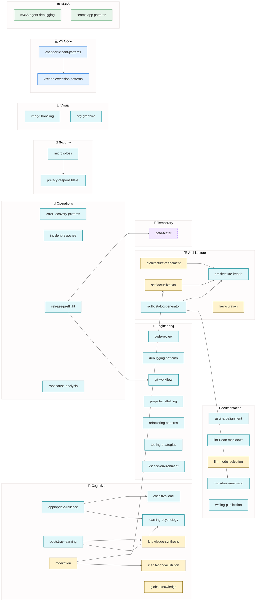

# Alex Skills Catalog

> Generated: 2026-01-30
> Total Skills: **38** (37 system, 1 temporary)

---

## Summary

| Category | Count | Skills |
| -------- | ----- | ------ |
| 🧠 Cognitive | 8 | Learning, reasoning, and self-awareness |
| 🔧 Engineering | 7 | Code quality and development practices |
| 🚨 Operations | 4 | Error handling and incident response |
| 🔐 Security | 2 | Privacy and security compliance |
| 📝 Documentation | 5 | Writing and visualization |
| 🎨 Visual | 2 | Graphics and image handling |
| 🏗️ Architecture | 5 | System design and health |
| 💻 VS Code | 3 | VS Code-specific patterns |
| ☁️ M365 | 2 | Microsoft 365 patterns |

---

## Skills by Category

### 🧠 Cognitive & Learning (8)

| Skill | Inheritance | Connections | Purpose |
| ----- | ----------- | ----------- | ------- |
| appropriate-reliance | 🧊 inheritable | 4 | Calibrated trust in AI outputs |
| bootstrap-learning | 🧊 inheritable | 4 | Domain-agnostic learning protocols |
| cognitive-load | 🧊 inheritable | 3 | Managing user mental load |
| knowledge-synthesis | 🟨 master-only | 3 | Cross-domain knowledge integration |
| learning-psychology | 🧊 inheritable | 3 | Human learning principles |
| meditation | 🟨 master-only | 4 | Knowledge consolidation |
| meditation-facilitation | 🟨 master-only | 4 | Guided meditation sessions |
| global-knowledge | 🟨 master-only | 3 | Cross-project knowledge base |

### 🔧 Engineering (7)

| Skill | Inheritance | Connections | Purpose |
| ----- | ----------- | ----------- | ------- |
| code-review | 🧊 inheritable | 3 | Systematic code review |
| debugging-patterns | 🧊 inheritable | 2 | Systematic debugging approaches |
| git-workflow | 🧊 inheritable | 2 | Git best practices |
| project-scaffolding | 🧊 inheritable | 4 | Project structure and setup |
| refactoring-patterns | 🧊 inheritable | 3 | Safe code transformation |
| testing-strategies | 🧊 inheritable | 3 | Comprehensive testing |
| vscode-environment | 🧊 inheritable | 4 | VS Code workspace setup |

### 🚨 Operations (4)

| Skill | Inheritance | Connections | Purpose |
| ----- | ----------- | ----------- | ------- |
| error-recovery-patterns | 🧊 inheritable | 3 | Graceful error handling |
| incident-response | 🧊 inheritable | 3 | Production incident handling |
| release-preflight | 🧊 inheritable | 5 | Pre-release validation |
| root-cause-analysis | 🧊 inheritable | 3 | Finding root causes |

### 🔐 Security (2)

| Skill | Inheritance | Connections | Purpose |
| ----- | ----------- | ----------- | ------- |
| microsoft-sfi | 🧊 inheritable | 4 | Microsoft Secure Future Initiative |
| privacy-responsible-ai | 🧊 inheritable | 3 | Privacy and responsible AI |

### 📝 Documentation (5)

| Skill | Inheritance | Connections | Purpose |
| ----- | ----------- | ----------- | ------- |
| ascii-art-alignment | 🧊 inheritable | 3 | ASCII diagram alignment |
| lint-clean-markdown | 🧊 inheritable | 3 | Markdown linting |
| llm-model-selection | 🟨 master-only | 2 | LLM comparison and selection |
| markdown-mermaid | 🧊 inheritable | 2 | Markdown and Mermaid diagrams |
| writing-publication | 🧊 inheritable | 3 | Technical writing |

### 🎨 Visual (2)

| Skill | Inheritance | Connections | Purpose |
| ----- | ----------- | ----------- | ------- |
| image-handling | 🧊 inheritable | 3 | Image processing |
| svg-graphics | 🧊 inheritable | 4 | SVG creation and editing |

### 🏗️ Architecture (5)

| Skill | Inheritance | Connections | Purpose |
| ----- | ----------- | ----------- | ------- |
| architecture-health | 🧊 inheritable | 3 | Architecture validation |
| architecture-refinement | 🟨 master-only | 5 | Architecture evolution |
| heir-curation | 🟨 master-only | 4 | Platform heir management |
| self-actualization | 🟨 master-only | 4 | Self-assessment protocols |
| skill-catalog-generator | 🧊 inheritable | 5 | Generate skill catalogs |

### 💻 VS Code (3)

| Skill | Inheritance | Connections | Purpose |
| ----- | ----------- | ----------- | ------- |
| chat-participant-patterns | 🟦 heir:vscode | 3 | Chat participant API |
| vscode-extension-patterns | 🟦 heir:vscode | 2 | VS Code extension development |
| vscode-environment | 🧊 inheritable | 4 | VS Code workspace setup |

### ☁️ M365 (2)

| Skill | Inheritance | Connections | Purpose |
| ----- | ----------- | ----------- | ------- |
| m365-agent-debugging | 🟩 heir:m365 | 1 | M365 Copilot debugging |
| teams-app-patterns | 🟩 heir:m365 | 2 | Teams app development |

### 🧪 Temporary (1)

| Skill | Inheritance | Connections | Remove After |
| ----- | ----------- | ----------- | ------------ |
| beta-tester | 🟪 temporary | 5 | stable-release |

---

## Network Diagram

---

## Legend

| Symbol | Meaning |
| ------ | ------- |
| 🟨 Yellow | Master-only (not inherited by heirs) |
| 🟦 Blue | VS Code heir specific |
| 🟩 Green | M365 heir specific |
| 🟪 Purple (dashed) | Temporary (beta only) |
| 🧊 Cyan | Inheritable (all platforms) |

---

## Statistics

| Metric | Value |
| ------ | ----- |
| Total Skills | 38 |
| Master-only | 8 |
| VS Code heir | 2 |
| M365 heir | 2 |
| Inheritable | 25 |
| Temporary | 1 |
| Total Connections | 125 |
| Avg Connections/Skill | 3.3 |

---

*Catalog generated by Alex Skill Catalog Generator*
