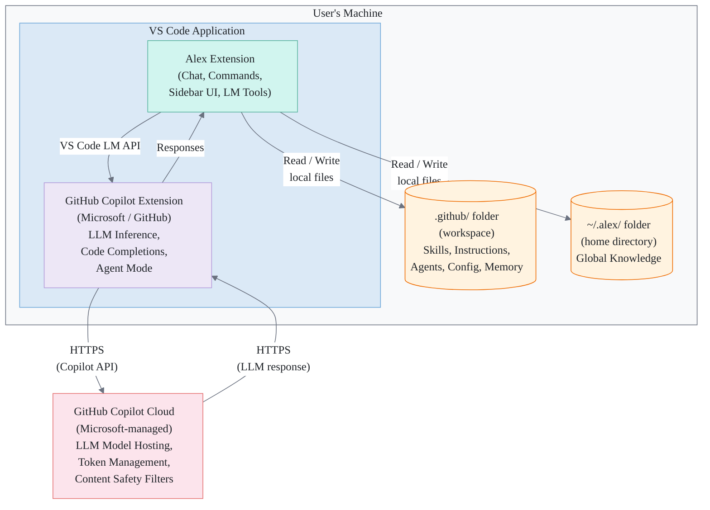
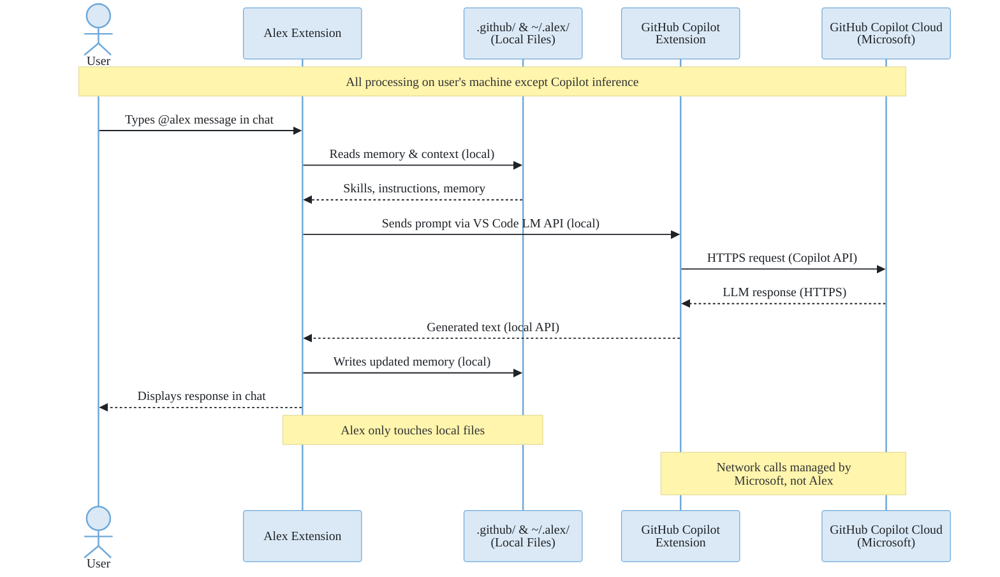

# Alex Cognitive Architecture — Application Description

**Prepared for**: TRIP Review / Responsible AI Assessment
**Author**: Fabio Correa
**Date**: March 17, 2026
**Application Version**: 6.7.0
**Service Tree ID**: a87e327f-0d3e-4682-a325-8b8e936a244f
**Document Version**: 1.0

---

## Executive Summary

Alex Cognitive Architecture is a **free, open-source Visual Studio Code extension** that adds persistent memory and domain skills to GitHub Copilot. It runs **entirely on the user's local machine** with **no backend infrastructure, no data collection, and no AI models of its own**. All AI inference is performed by GitHub Copilot (a Microsoft product with its own RAI certification). The extension reads and writes only local markdown and JSON files in the user's workspace.

**Key facts for reviewers:**

- No AI models contained, trained, or fine-tuned
- No personal data collected or processed
- No cloud infrastructure or backend services
- No network calls made by the extension itself
- Open source (Apache 2.0), published on VS Code Marketplace

---

## 1. Purpose

Alex Cognitive Architecture is a **Visual Studio Code extension** published on the VS Code Marketplace. It enhances the GitHub Copilot AI coding assistant by adding persistent memory, domain skills, and structured cognitive workflows to the developer experience.

The extension exists because GitHub Copilot is stateless by default — it does not remember previous conversations, learn user preferences, or maintain project-specific knowledge across sessions. Alex solves this by deploying a lightweight file-based architecture (`.github/` folder) into the user's workspace, giving Copilot a persistent memory layer and structured capabilities.

**Why we need it**: Developers using GitHub Copilot lose context between sessions and must repeatedly explain project conventions, preferences, and domain knowledge. Alex eliminates this repetition by persisting that context locally, making the AI assistant more effective over time.

### What is Visual Studio Code?

For reviewers unfamiliar with the platform: **Visual Studio Code (VS Code)** is a free code editor made by Microsoft, used by millions of developers to write software. It supports **extensions** — add-on packages that enhance its functionality. Extensions run inside VS Code's security sandbox and are distributed through the official [VS Code Marketplace](https://marketplace.visualstudio.com/), which is managed by Microsoft.

GitHub Copilot is Microsoft's AI coding assistant that runs as a VS Code extension. Alex is a separate extension that enhances how Copilot remembers and organizes information.

---

## 2. Application Overview

| Field | Value |
| --- | --- |
| **Application Name** | Alex Cognitive Architecture |
| **Type** | Visual Studio Code Extension |
| **Publisher** | fabioc-aloha (VS Code Marketplace) |
| **License** | Apache 2.0 (open source) |
| **Current Version** | 6.7.0 |
| **Platform** | VS Code 1.110+ (Windows, macOS, Linux) |
| **Backend Infrastructure** | None — fully client-side |
| **Cloud Services** | None required (optional external services listed below) |
| **Data Storage** | Local filesystem only (user's machine) |

---

## 3. Functionality

### What the Extension Does

1. **Deploys a file-based cognitive architecture** into the user's workspace (`.github/` folder containing markdown and JSON files)
2. **Registers a chat participant** (`@alex`) in VS Code's Copilot Chat, providing 26 slash commands
3. **Provides 13 Language Model Tools** that Copilot's agent mode can invoke (memory search, knowledge save, synapse health, etc.)
4. **Loads 128+ domain skills** as structured markdown files that VS Code auto-loads based on file patterns and task context
5. **Offers 7 specialist agents** (Researcher, Builder, Validator, Documentarian, Azure, M365, and the orchestrating Alex agent)
6. **Maintains a sidebar UI** with a welcome panel, memory tree view, status bar health indicator, and quick settings

### What the Extension Does NOT Do

- Does **not** run any backend server or cloud infrastructure
- Does **not** collect telemetry, analytics, or usage metrics
- Does **not** transmit user code, workspace content, or conversation transcripts
- Does **not** make any network calls on its own (all AI inference is handled by GitHub Copilot's existing infrastructure)
- Does **not** require user accounts, logins, or registration

---

## 4. How Users Leverage the Application

1. **Install** from the VS Code Marketplace (search "Alex Cognitive Architecture" or run `code --install-extension fabioc-aloha.alex-cognitive-architecture`)
2. **Initialize** via Command Palette → "Alex: Initialize Architecture" (deploys `.github/` files)
3. **Chat** by typing `@alex` in VS Code's Copilot Chat panel
4. **Work** with skills, agents, and memory that persist across sessions in local files

The extension enhances the **existing** GitHub Copilot subscription the user already has. Alex itself is free; the AI inference cost is covered by the user's Copilot plan.

---

## 5. Architecture and Data Flow

### 5.1 Component Architecture

The extension is a single VS Code extension package (`.vsix`) that runs entirely within the VS Code process on the user's machine. There is no backend, database, or cloud service.

> **Boundary note**: Everything inside the "User's Machine" box is local. The only network boundary is between GitHub Copilot Extension and GitHub Copilot Cloud — that connection is managed by Microsoft, not by Alex.

### 5.2 Data Flow Description

| Step | Action | Data | Source | Destination | Network? |
| --- | --- | --- | --- | --- | --- |
| 1 | User installs extension | Extension package (.vsix) | VS Code Marketplace | User's VS Code | Yes (one-time download) |
| 2 | User initializes architecture | Markdown/JSON template files | Extension bundle | User's `.github/` folder | No |
| 3 | User chats with @alex | Chat message text | User keyboard input | VS Code Copilot Chat API (local) | No (local API) |
| 4 | Copilot processes request | Prompt + context | VS Code (local) | GitHub Copilot Cloud (Microsoft) | Yes (HTTPS) |
| 5 | LLM response returned | Generated text | GitHub Copilot Cloud | VS Code (local) | Yes (HTTPS) |
| 6 | Alex reads/writes memory | Markdown/JSON files | `.github/` and `~/.alex/` | `.github/` and `~/.alex/` | No (local filesystem) |
| 7 | Response displayed to user | Text in chat panel | VS Code | User's screen | No |

**Key points:**

- Steps 4–5 (LLM inference) are handled entirely by **GitHub Copilot's existing infrastructure**, which the user already has a subscription for. Alex does not make these network calls; VS Code's Copilot extension does.
- Alex's own code only performs **local file read/write operations** (steps 2, 3, 6, 7).
- No user data leaves the machine through Alex. The only network communication is the standard Copilot flow managed by Microsoft/GitHub.

### 5.3 Optional External Services (User Opt-In)

These are **not required** and are disabled by default. Users must explicitly configure API keys to enable them:

| Service | Purpose | Data Sent | When Used |
| --- | --- | --- | --- |
| **Microsoft Edge TTS** | Text-to-speech voice synthesis | Text to be read aloud | User triggers "Read Aloud" |
| **Replicate API** | AI image generation | Text prompts only | User requests image generation |
| **Gamma API** | Presentation generation | Slide content text | User requests presentation |

API keys for these services are stored encrypted via VS Code's SecretStorage API on the user's machine.

---

## 6. AI Components Assessment

### Does this application use AI?

**The extension itself does not contain or run any AI models.** It is a structured layer on top of GitHub Copilot, which is a separate Microsoft product with its own RAI reviews.

| Question | Answer |
| --- | --- |
| Does the extension contain or train AI models? | No |
| Does the extension perform LLM inference? | No — GitHub Copilot handles all inference |
| Does the extension fine-tune models? | No |
| Does the extension collect training data? | No |
| Does the extension process personal data with AI? | No |
| Does the extension make autonomous decisions? | No — all actions require user initiation or Copilot agent mode approval |

### Relationship to GitHub Copilot

Alex uses the **VS Code Language Model API** (`vscode.lm`), which is the standard public API provided by VS Code for extensions to interact with whatever Copilot model the user has access to. This is the same API available to all VS Code extensions.

- Alex does not bypass Copilot's content safety filters
- Alex does not access models outside the user's Copilot subscription
- Alex does not modify request routing or model selection
- All content safety and responsible AI controls applied by GitHub Copilot remain fully in effect

---

## 7. Privacy and Security

### Data Collection Summary

| Category | Collected? | Details |
| --- | --- | --- |
| Personal information | No | No names, emails, or identifiers collected |
| Usage telemetry | No | No analytics or metrics |
| User code or workspace content | No | Never transmitted |
| Conversation transcripts | No | Not stored or sent anywhere |
| IP addresses | No | No server to receive them |
| Device identifiers | No | Not accessed |

### Security Measures

- **Local-first architecture**: All data stored in readable local files the user controls
- **VS Code sandbox**: Extension runs within VS Code's extension host security sandbox
- **SecretStorage API**: Any API keys encrypted via VS Code's native credential store
- **Content Security Policy**: Webviews enforce CSP to prevent XSS
- **No inline scripts**: All JavaScript in separate files
- **HTTPS only**: All optional external communication over encrypted channels
- **No `eval()`**: No dynamic code execution
- **Minimal dependencies**: Reduced supply chain attack surface
- **Open source**: Full source code available for inspection (Apache 2.0)

Full policies: [PRIVACY.md](PRIVACY.md) | [SECURITY.md](SECURITY.md)

---

## 8. Data Classification

| Data Category | Classification | Rationale |
| --- | --- | --- |
| Extension source code | Public | Open source (Apache 2.0), published on GitHub |
| Deployed `.github/` files | User-controlled | Local workspace files; content varies by project |
| Global knowledge (`~/.alex/`) | User-controlled | Local files on user's home directory |
| API keys (optional) | Confidential | Encrypted via VS Code SecretStorage; never transmitted by Alex |
| User code / workspace | Not accessed | Alex does not read, index, or transmit user source code |
| Conversation content | Not stored | Handled by GitHub Copilot; Alex does not persist chat transcripts |

---

## 9. Risk Assessment

| Risk Category | Risk Level | Justification |
| --- | --- | --- |
| **Data exfiltration** | None | No backend; no outbound network calls from Alex |
| **Personal data processing** | None | No PII collected, stored, or processed |
| **AI bias / harmful output** | Not applicable | Alex does not perform AI inference; all content safety is managed by GitHub Copilot (Microsoft) |
| **Autonomous decision-making** | None | All actions require explicit user initiation |
| **Supply chain** | Low | Minimal dependencies; open-source; VS Code Marketplace security scanning |
| **Credential exposure** | Low | Secrets stored via VS Code SecretStorage (OS-level encryption); no secrets in logs or files |
| **Third-party data sharing** | None | No data shared with third parties; optional services (Edge TTS, Replicate, Gamma) are user-initiated and user-configured |

---

## 10. Review Recommendation

Based on the architecture described above, this application:

1. **Does not contain AI models** — it extends an existing Microsoft AI product (GitHub Copilot)
2. **Has no backend infrastructure** — runs entirely on the user's machine
3. **Collects no data** — zero telemetry, zero personal information
4. **Makes no autonomous decisions** — all actions are user-initiated or require Copilot agent mode approval
5. **Has no data flows to external systems** — the only network traffic is Copilot's standard API calls, managed by Microsoft

**Recommendation**: This extension functions as a **local file-based configuration and memory layer** on top of GitHub Copilot. It does not independently perform AI inference, process personal data, or communicate with external services. The RAI review team should determine whether this qualifies as a **non-AI application** (proceeding under regular review) or requires further assessment given its dependency on GitHub Copilot.

If further review is needed, the extension's open-source codebase is fully available for inspection.

---

## Appendix A: Technology Stack

| Component | Technology |
| --- | --- |
| Language | TypeScript |
| Runtime | VS Code Extension Host (Node.js) |
| UI Framework | VS Code Webview API |
| Chat Integration | VS Code Chat API / Language Model API |
| File Storage | Markdown (.md) and JSON (.json) |
| Package Format | VSIX (VS Code Extension Package) |
| Marketplace | VS Code Marketplace |
| License | Apache 2.0 |

## Appendix B: Feature Summary

| Feature | Description |
| --- | --- |
| Chat participant (`@alex`) | Conversational AI interface in Copilot Chat |
| 26 slash commands | Structured operations (e.g., `/dream`, `/meditate`, `/status`) |
| 13 Language Model Tools | Agent-mode tools for memory, knowledge, and health |
| 128+ domain skills | Portable expertise loaded by file pattern matching |
| 7 specialist agents | Role-based AI modes (Researcher, Builder, Validator, etc.) |
| Memory systems | Procedural, episodic, and domain memory in local files |
| Welcome sidebar | Interactive panel with quick actions and settings |
| TTS voice synthesis | Read documents aloud via Edge TTS (optional) |
| AI image generation | Generate images via Replicate API (optional, user-configured) |
| Presentation generation | Create slides via Gamma API (optional, user-configured) |

## Appendix C: Contacts

| Role | Name | Contact |
| --- | --- | --- |
| Application Owner | Fabio Correa | *(e-mail to be added)* |
| Publisher | fabioc-aloha | [VS Code Marketplace](https://marketplace.visualstudio.com/items?itemName=fabioc-aloha.alex-cognitive-architecture) |
| Source Repository | GitHub | [github.com/fabioc-aloha/Alex_Plug_In](https://github.com/fabioc-aloha/Alex_Plug_In) |

## Appendix D: Document History

| Version | Date | Author | Changes |
| --- | --- | --- | --- |
| 1.0 | March 17, 2026 | Fabio Correa | Initial document created for TRIP review |
