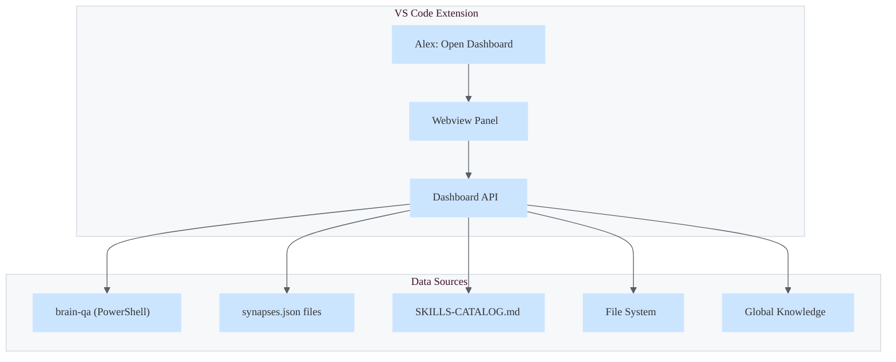

# Cognitive Dashboard Design Specification

> **Status**: Design Draft
> **Roadmap Reference**: v5.2.0 (Skill Mastery Dashboard, Meditation Webview Panel)
> **Related Features**: Epistemic Health Dashboard (v5.0 Appropriate Reliance)

---

## Overview

The Cognitive Dashboard is a unified VS Code webview that visualizes Alex's brain health, skill network, memory systems, and cognitive lifecycle. It consolidates multiple planned features:

| Planned Feature            | Roadmap  | Integration          |
| -------------------------- | -------- | -------------------- |
| Skill Mastery Dashboard    | v5.2.0   | Skill Network tab    |
| Meditation Webview Panel   | v5.2.0   | Lifecycle tab        |
| Epistemic Health Dashboard | v5.0.0   | Brain Health tab     |
| Health Dashboard           | Existing | Foundation to extend |

**Goal**: Single dashboard command (`Alex: Open Dashboard`) providing comprehensive cognitive visibility.

---

## Dashboard Tabs

### Tab 1: 🧠 Brain Health

**Source**: Brain QA Phases (21 phases)

```
┌─────────────────────────────────────────────────────────────┐
│                    🧠 BRAIN HEALTH                          │
├─────────────────────────────────────────────────────────────┤
│                                                             │
│  ┌─────────────┐  ┌─────────────┐  ┌─────────────┐        │
│  │  Phase 1    │  │  Phase 1.5  │  │  Phase 2    │        │
│  │  Synapses   │  │ Inheritance │  │   Index     │        │
│  │    ✅       │  │     ✅      │  │    ✅       │        │
│  └─────────────┘  └─────────────┘  └─────────────┘        │
│                                                             │
│  ┌─────────────┐  ┌─────────────┐  ┌─────────────┐        │
│  │  Phase 4    │  │  Phase 5    │  │  Phase 6    │        │
│  │ Heir Parity │  │   Schema    │  │   Sync      │        │
│  │    ✅       │  │     ✅      │  │    ✅       │        │
│  └─────────────┘  └─────────────┘  └─────────────┘        │
│                                                             │
│  ┌─────────────┐  ┌─────────────┐                          │
│  │  Phase 7    │  │  Phase 8    │   [Run Brain QA]        │
│  │ Index Sync  │  │  Catalog    │                          │
│  │    ✅       │  │     ✅      │                          │
│  └─────────────┘  └─────────────┘                          │
│                                                             │
│  Last check: 2 hours ago    Overall: HEALTHY               │
└─────────────────────────────────────────────────────────────┘
```

**Data Source**: Execute brain-qa powershell phases, cache results.

**Interactions**:
- Click phase → show details panel with issues/fixes
- [Run Brain QA] button → executes all phases
- [Run Dream] button → triggers full maintenance

### Tab 2: 🎯 Skill Network

**Source**: SKILLS-CATALOG.md Mermaid diagrams, synapses.json files

```
┌─────────────────────────────────────────────────────────────┐
│                    🎯 SKILL NETWORK                         │
├─────────────────────────────────────────────────────────────┤
│  Filter: [All ▼] [Inheritable ▼] [Category ▼]              │
│                                                             │
│  ┌─────────────────────────────────────────────────────┐   │
│  │                                                       │   │
│  │              (Interactive Mermaid Graph)             │   │
│  │                                                       │   │
│  │    [Cognitive]──→[Meta-Cognitive]──→[Engineering]    │   │
│  │         ↓                ↓                ↓          │   │
│  │    [Visual]        [Security]        [Ops]           │   │
│  │                                                       │   │
│  └─────────────────────────────────────────────────────┘   │
│                                                             │
│  Skills: 73 total (56 inheritable, 13 master-only)         │
│                                                             │
│  Selected: bootstrap-learning                               │
│  ├─ Connections: 5 outbound, 2 inbound                     │
│  ├─ Inheritance: inheritable                               │
│  └─ Staleness: Active (last validated 3 days ago)          │
└─────────────────────────────────────────────────────────────┘
```

**Data Source**: Parse synapses.json from all skills, render as interactive graph.

**Interactions**:
- Click skill node → show detail panel
- Hover → show connection weights
- Filter dropdowns → filter visible nodes
- [Open Skill] → opens SKILL.md file

### Tab 3: 📚 Memory Systems

**Source**: Memory Architecture diagram, file counts

```
┌─────────────────────────────────────────────────────────────┐
│                    📚 MEMORY SYSTEMS                        │
├─────────────────────────────────────────────────────────────┤
│                                                             │
│  ┌──────────────────────────────────────────────────────┐  │
│  │  📜 Episodic (.prompt.md)                             │  │
│  │  Files: 12  │  Last: unified-meditation-protocols    │  │
│  └──────────────────────────────────────────────────────┘  │
│                                                             │
│  ┌──────────────────────────────────────────────────────┐  │
│  │  📋 Procedural (.instructions.md)                     │  │
│  │  Files: 23  │  Last: dream-state-automation          │  │
│  └──────────────────────────────────────────────────────┘  │
│                                                             │
│  ┌──────────────────────────────────────────────────────┐  │
│  │  🎯 Skills                                            │  │
│  │  Count: 73  │  Synced: ✅  │  Categories: 13         │  │
│  └──────────────────────────────────────────────────────┘  │
│                                                             │
│  ┌──────────────────────────────────────────────────────┐  │
│  │  🌐 Global Knowledge                                  │  │
│  │  Patterns: 15  │  Insights: 42  │  Sync: ✅          │  │
│  └──────────────────────────────────────────────────────┘  │
│                                                             │
└─────────────────────────────────────────────────────────────┘
```

**Data Source**: File system counts, global knowledge API.

**Interactions**:
- Click memory type → expand file list
- [Meditate] → triggers conscious consolidation
- [Promote to Global] → opens promotion workflow

### Tab 4: 🔄 Lifecycle

**Source**: Cognitive Lifecycle diagram

```
┌─────────────────────────────────────────────────────────────┐
│                    🔄 COGNITIVE LIFECYCLE                   │
├─────────────────────────────────────────────────────────────┤
│                                                             │
│           ┌─────────┐                                       │
│     ┌────→│  WORK   │←────┐                                │
│     │     │   💻    │     │                                │
│     │     └────┬────┘     │                                │
│     │          │          │                                │
│     │          ▼          │                                │
│     │     ┌─────────┐     │                                │
│     │     │MEDITATE │     │                                │
│  ⚡ │     │   🧘    │     │ 💤                             │
│     │     └────┬────┘     │                                │
│     │          │          │                                │
│     │          ▼          │                                │
│     │     ┌─────────┐     │                                │
│     │     │  DREAM  │─────┘                                │
│     │     │   💤    │                                       │
│     │     └────┬────┘                                       │
│     │          │                                            │
│     │          ▼                                            │
│     │   ┌───────────┐                                       │
│     └───│ACTUALIZE  │                                       │
│         │    ⚡     │                                       │
│         └───────────┘                                       │
│                                                             │
│  Current State: 💻 WORK                                     │
│  Last Meditation: 2 hours ago                               │
│  Last Dream: 1 day ago                                      │
│  Last Self-Actualization: 3 days ago                        │
│                                                             │
│  [Meditate Now] [Dream Now] [Self-Actualize]               │
└─────────────────────────────────────────────────────────────┘
```

**Data Source**: Session timestamps from episodic files.

**Interactions**:
- Click node → show description and when to use
- Buttons → trigger respective commands
- Timer suggestions → "Consider meditating" after X hours

### Tab 5: ❤️ Epistemic Health (v5.0 Reliance)

**Source**: Appropriate Reliance metrics (CAIR/CSR when implemented)

```
┌─────────────────────────────────────────────────────────────┐
│                  ❤️ EPISTEMIC HEALTH                        │
├─────────────────────────────────────────────────────────────┤
│                                                             │
│  Calibration Score: 85%  [████████░░]                      │
│                                                             │
│  ┌────────────────────────────────────────────────────┐    │
│  │  Mode Distribution                                  │    │
│  │  Generative ████████░░░░░░ 60%                     │    │
│  │  Epistemic  ██████░░░░░░░░ 40%                     │    │
│  └────────────────────────────────────────────────────┘    │
│                                                             │
│  Recent Patterns:                                           │
│  • Used creative mode for email drafts ✅                  │
│  • Flagged security decision for human judgment ✅         │
│  • Expressed uncertainty on new framework 💡               │
│                                                             │
│  Improvement Suggestions:                                   │
│  • Consider more verification prompts for complex code     │
│  • Multi-turn verification for critical changes            │
│                                                             │
└─────────────────────────────────────────────────────────────┘
```

**Data Source**: Future telemetry (v5.0 implementation).

**Interactions**:
- View historical trends
- [Learn More] → opens appropriate-reliance skill
- Insights → linked to anti-hallucination skill

---

## Technical Implementation

### Architecture



### Files to Create

| File                              | Purpose            |
| --------------------------------- | ------------------ |
| `src/views/cognitiveDashboard.ts` | Webview provider   |
| `src/api/brainHealthApi.ts`       | Brain QA execution |
| `src/api/skillNetworkApi.ts`      | Synapse parsing    |
| `src/api/memorySystemsApi.ts`     | Memory file counts |
| `media/dashboard.css`             | Styling            |
| `media/dashboard.js`              | Interactive graphs |

### Commands

| Command                     | Description                 |
| --------------------------- | --------------------------- |
| `alex.openDashboard`        | Open full dashboard         |
| `alex.openDashboard.health` | Open to Brain Health tab    |
| `alex.openDashboard.skills` | Open to Skills tab          |
| `alex.runBrainQA`           | Run brain QA from dashboard |

### Status Bar Integration

```
$(brain) Alex: Healthy | Skills: 73 | Last Meditation: 2h ago
```

Click → opens dashboard.

---

## Data Refresh Strategy

| Data Type         | Refresh Frequency  | Trigger                           |
| ----------------- | ------------------ | --------------------------------- |
| Brain Health      | On demand          | [Run Brain QA] button             |
| Skill Network     | On file change     | File watcher on `.github/skills/` |
| Memory Counts     | On tab open        | Tab activation                    |
| Lifecycle State   | Session tracking   | Extension state                   |
| Epistemic Metrics | Real-time (future) | Telemetry events                  |

---

## Effort Estimate

| Component            | Effort   | Dependencies              |
| -------------------- | -------- | ------------------------- |
| Webview scaffold     | 2h       | Existing health dashboard |
| Brain Health tab     | 3h       | brain-qa skill            |
| Skill Network tab    | 4h       | Mermaid/D3 visualization  |
| Memory Systems tab   | 2h       | File system APIs          |
| Lifecycle tab        | 2h       | Session tracking          |
| Epistemic Health tab | 4h       | v5.0 telemetry (future)   |
| **Total**            | **~17h** | Phased delivery           |

### Phased Delivery

**Phase 1 (v5.2.0)**:
- Brain Health tab
- Skill Network tab (static view)
- Memory Systems tab
- Lifecycle tab
- *Effort: ~9h*

**Phase 2 (v5.3.0)**:
- Interactive skill graph
- Status bar integration
- Command palette quick actions
- *Effort: ~4h*

**Phase 3 (v5.5.0 or later)**:
- Epistemic Health tab (requires telemetry)
- Trend analytics
- *Effort: ~4h*

---

## Open Questions

1. **Graph library**: Mermaid.js embedded or D3.js for interactivity?
2. **Caching**: How long to cache brain QA results?
3. **Notifications**: Should dashboard issues create VS Code notifications?
4. **Multi-heir**: Show heir-specific status side-by-side?

---

## References

- [SKILLS-CATALOG.md](../skills/SKILLS-CATALOG.md) - Mermaid diagrams
- [brain-qa SKILL.md](../../.github/skills/brain-qa/SKILL.md) - QA phases
- [MEMORY-SYSTEMS.md](../architecture/MEMORY-SYSTEMS.md) - Memory architecture
- [COGNITIVE-ARCHITECTURE.md](../architecture/COGNITIVE-ARCHITECTURE.md) - Overall design

---

*Design spec for unified Cognitive Dashboard - consolidating skill mastery, brain health, memory visualization, and cognitive lifecycle into a single experience.*
