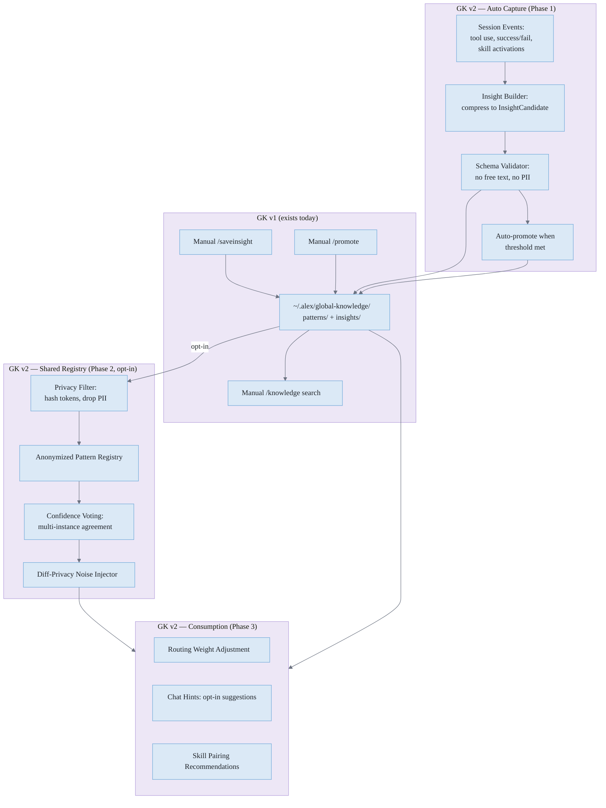

# 🧠 Global Knowledge v2 — Automated Capture & Shared Patterns (2026-03-14)

**Goal:** Evolve the existing Global Knowledge system (`~/.alex/global-knowledge/`) with two capabilities it lacks today: (1) automatic insight capture from session events, and (2) opt-in cross-instance pattern sharing with privacy guarantees.

---

## 📊 What GK v1 Already Does

Today's Global Knowledge system provides:
- **Manual capture**: `/saveinsight` and `/promote` commands for user-driven knowledge storage
- **Cross-project search**: `GK-*` patterns and `GI-*` insights searchable from any workspace via MCP tools
- **Promotion scoring**: automated candidate detection with point-based evaluation
- **Structured storage**: `~/.alex/global-knowledge/` with `patterns/` and `insights/` directories
- **Synaptic connections**: knowledge items linked through the synapse network

**What's missing:**
1. Insights are only captured when the user explicitly runs `/saveinsight` — most learnings are lost
2. All knowledge stays on one machine — no way to learn from other Alex instances
3. No structured schema enforcement on insight content (free text allowed)
4. No automatic routing adjustment based on accumulated patterns

---

## 🎯 What v2 Adds (and Where It Builds on v1)

| Capability | GK v1 (today) | GK v2 (proposed) |
|---|---|---|
| Insight capture | Manual (`/saveinsight`) | Automatic from session events |
| Storage location | `~/.alex/global-knowledge/` | Same — extends existing store |
| Schema | Free-form markdown | Structured `InsightCandidate` + `PatternSummary` |
| Cross-project | Yes (local machine) | Yes (local + opt-in shared registry) |
| Privacy controls | N/A (single user) | Differential privacy, cohort thresholds, PII stripping |
| Routing influence | None | Patterns adjust skill/tool selection weights |
| Promotion | Manual `/promote` | Auto-promote when threshold met; manual still works |
| Consumption | Manual `/knowledge` search | Automatic hints during task routing |

---

## 🔑 Principles
- **Extend, don't replace** — v2 builds on `~/.alex/global-knowledge/`, same directories, same MCP tools.
- **No raw data sharing** — no chat logs, code snippets, PII, or workspace content cross instances.
- **Pattern-first** — capture *what worked*, *why*, and *conditions*; never *who* or *what file*.
- **Opt-in sharing** — cross-instance exchange is off by default. Local auto-capture works regardless.
- **Backward compatible** — existing `GK-*` patterns and `GI-*` insights remain accessible and valid.

---

## 🧱 Architecture Sketch



---

## 🧭 How Consumption Works in Practice

All of these build on the existing `~/.alex/global-knowledge/` store — the only difference is patterns are now also auto-captured and (optionally) enriched by other instances.

- **During task routing**: Query accumulated patterns for the current domain/stack. If a high-confidence pattern suggests a different skill order, adjust routing weights.
- **When tests fail**: Pull patterns tagged with `jest`, `ts-node`, or `integration` to suggest known fixes (e.g., "switch to `ts-jest` transformer").
- **During release prep**: Patterns might recommend running `quality-gate` before `vsce publish` if accumulated data shows reduced regressions.
- **Onboarding a new stack**: Detect `python`, `bicep`, or `m365` tags; surface "top 3 steps that led to success" from local + shared patterns.
- **Skill evolution**: If accumulated patterns show a skill pairing increases success, suggest promoting that connection into `synapses.json` with a higher weight.
- **Chat hints (opt-in)**: Subtle suggestions from patterns ("Running `audit-synapses` before `lint:unused` has a higher success rate").

---

## 🔄 Insight Lifecycle (extends existing `/saveinsight` + `/promote`)

1. **Capture**: Auto-emit `InsightCandidate` on workflow outcomes (replaces manual-only `/saveinsight`).
   ```ts
   interface InsightCandidate {
     domain: string;
     skills: string[];
     tools: string[];
     outcome: 'success' | 'failure';
     contextTags: string[]; // e.g. typescript, azure, jest
     metadata?: { sampleSize?: number; runtimeMs?: number };
   }
   ```
2. **Validate**: Schema enforcement — no free-text fields, no file paths, no user strings.
3. **Store**: Write to `~/.alex/global-knowledge/insights/` (same location as today's `GI-*` files).
4. **Auto-promote**: When `sampleSize >= M` or `successRate > X%` with `N` samples, promote to `PatternSummary` (replaces manual-only `/promote` for auto-captured insights).
   ```ts
   interface PatternSummary {
     patternId: string;          // hashed composite key
     domain: string;
     skills: string[];
     tools: string[];
     confidence: number;         // 0-1 (weighted, noisy if shared)
     evidenceCount: number;      // aggregated
     triggers: string[];         // normalized action verbs
     recommendations: string[];  // skills/tools to try next
     version: string;
   }
   ```
5. **Share (opt-in)**: If `alex.sharedPatterns.enabled`, push anonymized `PatternSummary` to shared registry.
6. **Consume**: Query patterns during routing to adjust weights and surface hints.

**Backward compatibility**: Manual `/saveinsight`, `/promote`, and `/knowledge` commands continue to work exactly as before. Auto-captured insights coexist with manually saved ones.

---

## 🛡️ Guardrails (Phase 2 only — shared registry)
- **Schema enforcement**: `PatternSummary` disallows free text; only whitelisted vocab.
- **Minimum cohort**: publish only if `cohortSize >= 5` (configurable, per pattern).
- **Noise injection**: Laplace noise on counts/confidence for differential privacy.
- **Provenance**: store `sourceInstanceHash` (non-reversible) + timestamp for audit.
- **Revocation**: blacklist bad `patternId` globally.
- **Audit logs**: local `~/.alex/logs/pattern-promotion.log` for user review/delete.

---

## 🛠 Implementation Plan

### Phase 1 — Auto Capture (extends existing GK)
- [ ] Add `InsightCandidate` schema to `~/.alex/global-knowledge/schema/`.
- [ ] Emit insight candidates from session events (tool use, skill activation, success/fail).
- [ ] Schema validation: reject free text, enforce structured fields only.
- [ ] Auto-promote: threshold-based promotion from `GI-*` insight to `GK-*` pattern.
- [ ] CI gate: `scripts/audit-insight-schema.cjs` validates no free text or PII in stored insights.
- [ ] Unit tests for capture, validation, and auto-promotion.

### Phase 2 — Shared Registry (opt-in, new)
- [ ] Privacy filter: anonymize, hash tokens, enforce cohort thresholds before sharing.
- [ ] Diff-privacy module: Laplace noise on counts and confidence.
- [ ] Shared registry backend (GH repo, bucket, or API — TBD).
- [ ] CI gate: `scripts/audit-shared-patterns.cjs` for schema and privacy checks.

### Phase 3 — Consumption & Feedback (new)
- [ ] Routing weight adjustment: query patterns during skill/tool selection.
- [ ] Chat hints: surface suggestions from accumulated patterns (opt-in).
- [ ] Skill pairing recommendations based on co-occurrence data.
- [ ] Settings toggle: `alex.sharedPatterns.enabled` (default off).
- [ ] Feedback loop: thumbs up/down adjusts confidence weights.

---

## 📏 Acceptance Criteria
- **Phase 1**: Auto-captured insights appear in `~/.alex/global-knowledge/insights/` with structured schema. Existing `/saveinsight` and `/knowledge` commands unaffected.
- **Phase 2**: No PII in shared artifacts (enforced via schema + CI audit). Cohort thresholds respected.
- **Phase 3**: Measurable routing improvement from pattern consumption. User can disable sharing; local auto-capture still works.

---

## 🧭 Legacy Awareness
> Notes for future Alex (architect's diary): preserve intent, context, and constraints behind decisions.

- **Decision journals**: For each major change (CI gate, privacy rule, routing weight), append a structured entry to `alex_docs/decisions/*.md` or `~/.alex/decisions-log.json`:
  ```jsonc
  {
    "decisionId": "CI-GATE-008",
    "date": "2026-03-14",
    "context": "lint:unused enforcement with allowlist",
    "options": ["allow-all", "warn-only", "fail-on-unallowlisted"],
    "decision": "fail-on-unallowlisted",
    "why": "Prevent silent drift; low false positives after allowlist",
    "tradeoffs": "Requires maintaining ts-unused-exports.json",
    "rollback": "Switch to warn-only via env flag",
    "signals": ["tsc --noUnused* now clean", "CI green"]
  }
  ```
- **Architectural "letters to future self"**: `## Legacy Notes` sections in key docs explaining *why not* certain options.
- **Compatibility contracts**: `docs/COMPATIBILITY.md` listing public APIs and what's safe to change, enforced by `scripts/audit-contracts.cjs`.
- **Pattern tombstones**: When deprecating patterns, record why they were removed to prevent reintroduction.
- **Breadcrumbs in code**: Structured comments (e.g., `// @legacy: I8 guard`) detectable by `scripts/audit-legacy-tags.cjs`.

---

## 📂 File Placement

All new files extend the existing GK directory structure:

| File | Purpose | Phase |
|---|---|---|
| `~/.alex/global-knowledge/schema/insight-candidate.json` | InsightCandidate JSON schema | 1 |
| `~/.alex/global-knowledge/schema/pattern-summary.json` | PatternSummary JSON schema | 1 |
| `~/.alex/global-knowledge/insights/` (existing) | Auto-captured + manual insights | 1 |
| `~/.alex/global-knowledge/patterns/` (existing) | Auto-promoted + manual patterns | 1 |
| `scripts/audit-insight-schema.cjs` | CI validation for insight schema | 1 |
| `scripts/audit-shared-patterns.cjs` | Privacy and cohort threshold checks | 2 |
| `src/chat/skillRecommendations.ts` | Pattern-driven routing and hints | 3 |
| `alex_docs/legacy/LEGACY-NOTES.md` | Architectural decision breadcrumbs | 1 |
| `scripts/audit-legacy-tags.cjs` | Legacy comment checker | 1 |

---

## 🔭 Future Ideas
- **Federated signal aggregation**: share gradient updates for routing weights, not raw data.
- **Tiered meshes**: team-level vs global pattern registries.
- **Trust scores**: weight patterns from instances passing strict CI (quality-gate green).

---

**Summary:** GK v2 extends the existing `~/.alex/global-knowledge/` system with automatic insight capture (Phase 1), opt-in cross-instance pattern sharing with differential privacy (Phase 2), and pattern-driven routing and chat hints (Phase 3). Existing manual commands (`/saveinsight`, `/promote`, `/knowledge`) continue to work unchanged. The only genuinely new infrastructure is the shared registry in Phase 2 — everything else builds on what's already there.
