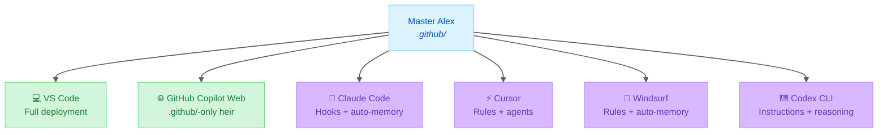

# Development Platforms Comparison

> Comprehensive comparison of AI coding platforms and Alex heir augmentation

|             |                                                                |
| ----------- | -------------------------------------------------------------- |
| **Updated** | 2026-02-19                                                     |
| **Purpose** | Feature comparison across development IDEs                     |
| **Related** | [Productivity Platforms](PRODUCTIVITY-PLATFORMS-COMPARISON.md) |

---

## Executive Summary

This document compares the native capabilities of AI **development platforms** (IDEs, terminals, cloud environments) and how Alex heirs augment them. For productivity platforms (M365, ChatGPT, NotebookLM), see [PRODUCTIVITY-PLATFORMS-COMPARISON.md](PRODUCTIVITY-PLATFORMS-COMPARISON.md).

### Platform Overview

| Platform               | Vendor           | Native AI      | Interface | Alex Heir Status |
| ---------------------- | ---------------- | -------------- | --------- | ---------------- |
| **VS Code + Copilot**  | Microsoft/GitHub | GitHub Copilot | IDE       | ✅ Production     |
| **GitHub Codespaces**  | Microsoft/GitHub | GitHub Copilot | Cloud IDE | ❌ Archived       |
| **GitHub.com Copilot** | Microsoft/GitHub | GitHub Copilot | Web + Agent | ✅ Active heir    |
| **VS Code CLI**        | Microsoft/GitHub | GitHub Copilot | Terminal  | ❌ Not Planned    |
| **OpenAI Codex CLI**   | OpenAI           | GPT-4/o1       | Terminal  | 📋 Research       |
| **Claude Code**        | Anthropic        | Claude         | Terminal  | 📋 Planning       |
| **Cursor**             | Anysphere        | Cursor AI      | IDE       | 📋 Research       |
| **Windsurf**           | Codeium          | Cascade AI     | IDE       | 📋 Research       |
| **Amazon Q Developer** | AWS              | Amazon Q       | IDE/CLI   | ❌ Competitor     |

---

## Platform Winners by Category

### Overall Comparison

| Category              | Winner        | Runner-Up     | Notes                                    |
| --------------------- | ------------- | ------------- | ---------------------------------------- |
| **Best for Alex**     | 🥇 VS Code     | 🥈 Claude Code | Full API access, most extensible         |
| **Customization**     | 🥇 VS Code     | 🥈 Claude Code | Unlimited instructions, agents, skills   |
| **Automation**        | 🥇 Claude Code | 🥈 VS Code     | Claude Code full hooks, VS Code Preview  |
| **Auto-Learning**     | 🥇 Windsurf    | 🥈 Claude Code | Native per-workspace memories            |
| **Multi-Platform**    | 🥇 Claude Code | 🥈 VS Code     | Terminal + VS Code + JetBrains + Web     |
| **Agent System**      | 🥇 VS Code     | 🥈 Claude Code | Individual agents + handoffs + subagents |
| **Developer Tools**   | 🥇 VS Code     | 🥈 Cursor      | 70+ commands, 12 LM tools, full API      |
| **AI-Native UX**      | 🥇 Cursor      | 🥈 Windsurf    | Built from ground up for AI              |
| **Market Share**      | 🥇 VS Code     | 🥈 Cursor      | VS Code dominates, Cursor growing fast   |
| **Terminal-Native**   | 🥇 Claude Code | 🥈 Codex CLI   | Full agentic terminal experience         |
| **Autonomous Coding** | 🥇 GitHub Copilot Web | 🥈 Claude Code | Coding Agent creates PRs from issues, guided by Alex `.github/` instructions |
| **Cloud Development** | 🥇 GitHub Copilot Web | 🥈 Codespaces  | Zero-cost .github/-only heir, deploy = git commit |
| **Code Review AI**    | 🥇 GitHub.com  | 🥈 Cursor      | Copilot code review + Alex custom instructions      |
| **Reasoning Models**  | 🥇 VS Code     | 🥈 Claude Code | Opus extended thinking, o1/o3 access     |

### Detailed Category Breakdown

#### 🏆 Extensibility & API Access

| Rank  | Platform        | Score | Reasoning                                       |
| :---: | --------------- | :---: | ----------------------------------------------- |
|   🥇   | **VS Code**     | 10/10 | Full extension API, chat participants, LM tools |
|   🥈   | **Claude Code** | 7/10  | MCP support, hooks, but no native extension API |
|   🥉   | **Cursor**      | 5/10  | Limited extension API, VS Code fork             |
|   4   | **Windsurf**    | 3/10  | Rules only, no extension API                    |

#### 🏆 Customization Flexibility

| Rank  | Platform        | Score | Reasoning                                    |
| :---: | --------------- | :---: | -------------------------------------------- |
|   🥇   | **VS Code**     | 10/10 | Unlimited files, any structure, full control |
|   🥈   | **Claude Code** | 9/10  | CLAUDE.md + rules + agents + skills          |
|   🥉   | **Cursor**      | 7/10  | Rules + AGENTS.md, but consolidated          |
|   4   | **Windsurf**    | 5/10  | 12K char limit per file is restrictive       |

#### 🏆 Automation Capabilities

| Rank  | Platform        | Score | Reasoning                                      |
| :---: | --------------- | :---: | ---------------------------------------------- |
|   🥇   | **Claude Code** | 10/10 | Full lifecycle hooks (SessionStart → Stop)     |
|   🥈   | **VS Code**     | 8/10  | Agent hooks in Preview (Pre/PostToolUse, etc.) |
|   🥉   | **Windsurf**    | 5/10  | Auto-memories, but no scripted automation      |
|   4   | **Cursor**      | 3/10  | No automation layer                            |

#### 🏆 Memory & Learning

| Rank  | Platform        | Score | Reasoning                          |
| :---: | --------------- | :---: | ---------------------------------- |
|   🥇   | **Windsurf**    | 9/10  | Native auto-memories per workspace |
|   🥈   | **Claude Code** | 8/10  | Auto-memory per project            |
|   🥉   | **VS Code**     | 6/10  | Manual synapses (Alex adds this)   |
|   4   | **Cursor**      | 2/10  | No native memory system            |

#### 🏆 Agent Ecosystem

| Rank  | Platform        | Score | Reasoning                                   |
| :---: | --------------- | :---: | ------------------------------------------- |
|   🥇   | **VS Code**     | 10/10 | Individual `.agent.md`, handoffs, subagents |
|   🥈   | **Claude Code** | 9/10  | Agent teams, Task tool orchestration        |
|   🥉   | **Cursor**      | 5/10  | Single AGENTS.md file, limited handoffs     |
|   4   | **Windsurf**    | 0/10  | No agent system                             |

### Summary: Best Platform For...

| Use Case                       | Best Platform | Why                                  |
| ------------------------------ | ------------- | ------------------------------------ |
| **Full Alex experience**       | VS Code       | Most extensible, all features work   |
| **Automation-first workflows** | Claude Code   | Lifecycle hooks are game-changing    |
| **Zero-config learning**       | Windsurf      | Auto-memories learn without curation |
| **AI-native development**      | Cursor        | Designed around AI from day one      |
| **Terminal-first work**        | Claude Code   | Best CLI experience                  |
| **Quick terminal answers**     | VS Code CLI   | Simplest UX, no session state        |
| **Cloud development**          | GitHub Copilot Web | Zero-cost .github/-only, deploy = git commit |
| **PR/code review AI**          | GitHub.com    | Native integration, no setup         |
| **Deep reasoning tasks**       | Codex CLI     | o1/o3 models excel at complex logic  |

---

## Native Platform Capabilities

### Feature Matrix

| Feature                  |       VS Code        | Codespaces  | GH Copilot Web | VS Code CLI |   Codex CLI   |     Claude Code     |       Cursor       |       Windsurf       |
| ------------------------ | :------------------: | :---------: | :---------: | :---------: | :-----------: | :-----------------: | :----------------: | :------------------: |
| **Custom Instructions**  | ✅ `.instructions.md` |   ✅ Same    | ✅ `.github/` |      ❌      | ✅ `AGENTS.md` |    ✅ `CLAUDE.md`    | ✅ `.cursor/rules/` | ✅ `.windsurf/rules/` |
| **Custom Agents**        |    ✅ `.agent.md`     |   ✅ Same    |      ❌      |      ❌      |       ❌       | ✅ `.claude/agents/` |   ✅ `AGENTS.md`    |          ❌           |
| **Skills/Capabilities**  |    ✅ 100+ skills     |   ✅ Same    | ✅ Context  |      ❌      |       ❌       | ✅ `.claude/skills/` |      ✅ Import      |      Via rules       |
| **Lifecycle Hooks**      |      ✅ Preview       |  ✅ Preview  |      ❌      |      ❌      |       ❌       |  ✅ Full lifecycle   |         ❌          |          ❌           |
| **Auto-Memory**          |          ❌           |      ❌      | ✅ Copilot Mem |      ❌      |       ❌       |    ✅ Per-project    |         ❌          |   ✅ Per-workspace    |
| **Extension API**        |        ✅ Full        |   ✅ Full    |      ❌      |      ❌      |       ❌       |          ❌          |      Limited       |          ❌           |
| **Chat Participant**     |     ✅ `@mention`     |   ✅ Same    |      ❌      |      ❌      |       ❌       |          ❌          |         ❌          |          ❌           |
| **Language Model Tools** |        ✅ MCP         |    ✅ MCP    |      ❌      |      ❌      |       ❌       |        ✅ MCP        |         ❌          |          ❌           |
| **Enterprise/Team**      |  Via Settings Sync   | ✅ Org-level | ✅ Org-level |      ❌      |       ❌       |   ✅ System rules    |    ✅ Team Rules    |    ✅ System rules    |
| **Multi-IDE**            |     VS Code only     |   Browser   |   Web chat  |  Any shell  |   Any shell   |   Terminal + IDEs   |    Cursor only     |    Windsurf only     |
| **Reasoning Models**     |     ✅ Opus/o1/o3     |   ✅ Same    | ✅ Models  |      ❌      |    ✅ o1/o3    |   ✅ Opus extended   |      ✅ o1/o3       |          ❌           |
| **Claude Compatibility** |        ✅ NEW         |   ✅ Same    |    ✅ NEW     |      ❌      |       ❌       |       Native        |         ❌          |          ❌           |
| **Subagents**            |        ✅ NEW         |   ✅ Same    |      ❌      |      ❌      |       ❌       | ✅ Via orchestration |         ❌          |          ❌           |
| **Copilot Memory**       |      ✅ Preview       |  ✅ Preview  |  ✅ Preview  |      ❌      |       ❌       |          ❌          |         ❌          |          ❌           |

### Instruction System Comparison

| Platform        | Location                | Activation                         | Character Limit |
| --------------- | ----------------------- | ---------------------------------- | --------------- |
| **VS Code**     | `.github/instructions/` | `applyTo` glob                     | Unlimited       |
| **Codespaces**  | `.github/instructions/` | Same as VS Code                    | Unlimited       |
| **GitHub.com**  | `.github/copilot-instructions.md` + `.github/instructions/` | `applyTo` glob (repo or path-specific) | Unlimited       |
| **VS Code CLI** | —                       | —                                  | —               |
| **Codex CLI**   | `AGENTS.md`             | Always loaded                      | Unlimited       |
| **Claude Code** | `.claude/rules/`        | `paths` frontmatter                | Unlimited       |
| **Cursor**      | `.cursor/rules/`        | `globs` + `alwaysApply`            | Unlimited       |
| **Windsurf**    | `.windsurf/rules/`      | 4 modes (manual/always/model/glob) | 12,000 chars    |

### Agent System Comparison

| Platform        | Agent Definition           | Handoffs          | Subagents           |
| --------------- | -------------------------- | ----------------- | ------------------- |
| **VS Code**     | `.agent.md` files          | ✅ Explicit array  | ✅ Supported         |
| **Codespaces**  | `.agent.md` files          | ✅ Same as VS Code | ✅ Supported         |
| **GitHub.com**  | Copilot Coding Agent + custom agents | ❌ (cloud-only, no handoffs) | ❌ (parallel issues only) |
| **VS Code CLI** | ❌ No agent system          | ❌                 | ❌                   |
| **Codex CLI**   | ❌ No agent system          | ❌                 | ❌                   |
| **Claude Code** | `.claude/agents/`          | ✅ Task tool       | ✅ Via orchestration |
| **Cursor**      | `AGENTS.md` (consolidated) | Limited           | ❌                   |
| **Windsurf**    | ❌ No agent system          | ❌                 | ❌                   |

---

## Alex Augmentation by Platform

### What Alex Adds to Each Platform

#### VS Code + Copilot → Alex

| Native Capability  | + Alex Augmentation                                              |
| ------------------ | ---------------------------------------------------------------- |
| Copilot Chat       | → Learning partnership persona                                   |
| `.instructions.md` | → Procedural memory files                                        |
| `.prompt.md`       | → Episodic workflows                                             |
| `.agent.md`        | → Specialized agents                                             |
| Skills (basic)     | → 100+ domain expertise skills                                   |
| Generic AI         | → Cognitive architecture (meditation, dream, self-actualization) |
| Stateless          | → Synapse network for persistent connections                     |
| No extension       | → Full command palette + LM tools                                |

**Alex Value-Add Score: 10/10** — Full cognitive architecture deployment

#### GitHub Copilot Web → Alex ✅ Active Heir

> **The killer feature**: Copilot Coding Agent reads Alex's `.github/` files autonomously. Assign Copilot to a GitHub issue and it creates a branch, writes code in a GitHub Actions sandbox, and opens a PR — all guided by Alex's identity, instructions, and skills.

| Native Capability                    | + Alex Augmentation                                        |
| ------------------------------------ | ---------------------------------------------------------- |
| `copilot-instructions.md`            | → Full Alex identity loaded for every interaction          |
| `.github/instructions/` files        | → Procedural memory via `applyTo` glob (confirmed on web)  |
| `.github/prompts/` files             | → Episodic workflows available as context                  |
| `.github/skills/` files              | → 100+ domain skills readable as context                   |
| **Copilot Coding Agent**             | → Alex instructions guide autonomous PR creation from issues |
| **Coding Agent Hooks**               | → Shell commands at key agent execution points (validation, logging) |
| **Coding Agent MCP servers**         | → External tools and data sources for the agent            |
| **Custom Agents** (specialized)      | → Frontend agent, docs agent, testing agent — all Alex-guided |
| **Agent Skills** (instructions+scripts) | → Enhanced task-specific capabilities for coding agent  |
| Copilot Memory (preview)             | → Agent builds its own repo learnings, cross-session persistence |
| Image attachments (preview)          | → Attach screenshots/mockups to Alex chat at github.com    |
| Bing web search (optional)           | → Alex with real-time web knowledge                         |
| Model switching + retry              | → Compare responses across Claude, GPT models              |
| Conversation sharing (preview)       | → Share Alex conversations with team members               |
| Subthreads                           | → Branch a conversation mid-stream for parallel exploration |

**Alex Value-Add Score: 9/10** — Autonomous coding agent + full instruction system. Loses: extension commands, LM tools, local file access.

#### VS Code CLI (GitHub Copilot CLI)

| Native Capability      | + Alex Augmentation  |
| ---------------------- | -------------------- |
| `gh copilot suggest`   | → Not customizable   |
| `gh copilot explain`   | → Not customizable   |
| Single-turn queries    | → No session state   |
| No instruction support | → Cannot deploy Alex |
| No extension API       | → No tools possible  |

**Alex Value-Add Score: 0/10** — Platform incompatible with Alex architecture

#### GitHub.com Copilot (Web UI)

> Same platform as the GitHub Copilot Web heir above. Alex is deployed via `.github/` context files — see heir section for full augmentation detail.

| Native Capability | + Alex Augmentation                         |
| ----------------- | ------------------------------------------- |
| PR review chat    | → Alex-personalized assistance              |
| Issue chat        | → Alex identity active via instructions     |
| Code suggestions  | → Alex personality overlay                  |
| Copilot Memory    | → Cross-session Alex context                |
| No extension API  | → No commands, tools, or agents available   |

**Alex Value-Add Score: 9/10** — Active heir; autonomous coding agent + full instruction system

#### OpenAI Codex CLI → Alex (Research)

| Native Capability  | + Alex Augmentation                         |
| ------------------ | ------------------------------------------- |
| `AGENTS.md`        | → Alex procedural memory                    |
| o1/o3 reasoning    | → Enhanced deep-thinking for self-actualize |
| Sandbox execution  | → Safe environment for Alex scripts         |
| Full autonomy mode | → Meditation/dream could run automatically  |
| No hooks           | → No lifecycle automation (manual triggers) |

**Alex Value-Add Score: 6/10** — Instruction support but no hooks, strong reasoning models

#### Claude Code → Alex (Planned)

| Native Capability      | + Alex Augmentation                                 |
| ---------------------- | --------------------------------------------------- |
| `CLAUDE.md`            | → Full Alex identity                                |
| Opus extended thinking | → Deep reasoning for self-actualization             |
| Auto-memory            | → Guided by Alex patterns (synapses become natural) |
| Lifecycle hooks        | → Automated meditation/dream triggers               |
| Agent teams            | → Researcher/Builder/Validator flow                 |
| Rules                  | → 28+ procedural instructions                       |

**Alex Value-Add Score: 9/10** — Strong synergy, hooks + Opus reasoning

#### Cursor → Alex (Planned)

| Native Capability   | + Alex Augmentation              |
| ------------------- | -------------------------------- |
| Custom rules        | → Alex procedural memory         |
| AGENTS.md           | → Consolidated agent ecosystem   |
| Agent Skills import | → 100+ skills potentially        |
| AI-native IDE       | → Cognitive protocols layered on |

**Alex Value-Add Score: 7/10** — Good fit, less extensibility than VS Code

#### Windsurf → Alex (Planned)

| Native Capability | + Alex Augmentation                  |
| ----------------- | ------------------------------------ |
| Auto-memories     | → Alex patterns guide what's learned |
| Rules with modes  | → Procedural memory with activation  |
| Cascade AI        | → Alex personality overlay           |
| System rules      | → Enterprise Alex deployment         |

**Alex Value-Add Score: 6/10** — Auto-memories reduce need for synapses, but 12K limit hurts

---

## Heir Feature Parity

### Core Alex Features Across Development Heirs

| Feature                  |  VS Code  | Codespaces | GH Web     | VS Code CLI | Codex CLI  |   Claude Code   |     Cursor     |    Windsurf     |
| ------------------------ | :-------: | :--------: | :--------: | :---------: | :--------: | :-------------: | :------------: | :-------------: |
| **Alex Personality**     |  ✅ Full   |   ✅ Full   |  ✅ Full   |      ❌      | ✅ Planned  |    ✅ Planned    |   ✅ Planned    |    ✅ Planned    |
| **Learning Partnership** |     ✅     |     ✅      |     ✅      |      ❌      |     ✅      |        ✅        |       ✅        |        ✅        |
| **Meditation Protocol**  | ✅ Command | ✅ Command  |   ⚠️ Chat   |      ❌      |   ⚠️ Chat   |     ✅ Hook      |     ⚠️ Chat     |     ⚠️ Chat      |
| **Dream Processing**     | ✅ Command | ✅ Command  |   ⚠️ Chat   |      ❌      |   ⚠️ Chat   |     ✅ Hook      |     ⚠️ Chat     |     ⚠️ Chat      |
| **Self-Actualization**   |  ✅ Tool   |   ✅ Tool   |   ⚠️ Chat   |      ❌      | ✅ Enhanced |    ✅ Planned    |   ⚠️ Limited    |    ⚠️ Limited    |
| **Skills (100+)**        |   ✅ All   |   ✅ All    | ✅ Context |      ❌      |   ⚠️ ~20    |      ⚠️ ~30      |     ❓ TBD      |     ⚠️ Split     |
| **Synapse Network**      |  ✅ Full   |   ✅ Full   |     ❌      |      ❌      |     ❌      | ❌ (auto-memory) |       ❌        | ❌ (auto-memory) |
| **Extension Commands**   |  ✅ Full   |   ✅ Full   |     ❌      |      ❌      |     ❌      |        ❌        |       ❌        |        ❌        |
| **LM Tools**             |  ✅ Full   |   ✅ Full   |     ❌      |      ❌      |     ❌      |      ⚠️ MCP      |       ❌        |        ❌        |
| **Agent Ecosystem**      |  ✅ Full   |   ✅ Full   | ✅ Coding Agent |      ❌      |     ❌      |    ✅ Planned    | ⚠️ Consolidated |        ❌        |
| **Coding Agent Hooks**   |     ❌      |     ❌      |  ✅ Native  |      ❌      |     ❌      |  ✅ Full lifecycle |       ❌        |        ❌        |

### Unique Platform Advantages

| Platform        | Unique Strength            | Alex Benefit                         |
| --------------- | -------------------------- | ------------------------------------ |
| **VS Code**     | Full API + hooks (Preview) | Most capable heir + automation       |
| **Codespaces**  | ❌ Archived                | —                                    |
| **GitHub.com**  | Copilot Coding Agent + `.github/` deploy | Alex guides autonomous PR creation — unique to this platform |
| **VS Code CLI** | Zero config                | N/A — incompatible                   |
| **Codex CLI**   | o1/o3 reasoning            | Enhanced self-actualization          |
| **Claude Code** | Full lifecycle hooks       | Production-grade automated protocols |
| **Cursor**      | AI-native UX               | Smooth AI workflows                  |
| **Windsurf**    | Auto-memories              | Reduced synapse maintenance          |

### Platform-Specific Limitations

| Platform        | Key Limitation       | Impact on Alex                           |
| --------------- | -------------------- | ---------------------------------------- |
| **VS Code**     | Hooks still Preview  | Full automation not production-ready yet |
| **Codespaces**  | ❌ Archived          | Not an active heir                       |
| **GitHub.com**  | No local IDE integration | No extension commands, tools, or local file edits; agent runs in cloud sandbox |
| **VS Code CLI** | No customization     | Cannot deploy Alex at all                |
| **Codex CLI**   | No hooks/lifecycle   | Manual protocol triggers only            |
| **Claude Code** | No VS Code API       | Lose commands/tools                      |
| **Cursor**      | No individual agents | Must consolidate to AGENTS.md            |
| **Windsurf**    | 12K char limit       | Must split instructions                  |

---

## Migration Complexity

### Effort to Port Alex

| Platform        | Technical | Effort |  Risk  | Priority |
| --------------- | :-------: | :----: | :----: | :------: |
| **VS Code**     | ✅ Native  |  Done  |   —    |    —     |
| **GitHub.com**  | ✅ Native  |  Done  |  Low   |    —     |
| **Codespaces**  | ❌ Archived |   —    |   —    |    —     |
| **VS Code CLI** |    N/A    |  N/A   |  N/A   |    —     |
| **Codex CLI**   |   5/10    |  Low   |  Low   | Phase 4  |
| **Claude Code** |   9/10    | Medium |  Low   | Phase 1  |
| **Cursor**      |   8/10    | Medium |  Low   | Phase 2  |
| **Windsurf**    |   6/10    |  High  | Medium | Phase 3  |

### What Transfers vs. Adapts vs. Lost

| Component                   | VS Code | Claude Code       | Codex CLI      | Cursor           | Windsurf      |
| --------------------------- | ------- | ----------------- | -------------- | ---------------- | ------------- |
| **copilot-instructions.md** | Native  | → CLAUDE.md       | → AGENTS.md    | → Rules          | → Split rules |
| **.instructions.md**        | Native  | → .claude/rules/  | ❌ Lost         | → .cursor/rules/ | → Split rules |
| **.prompt.md**              | Native  | → In agents       | ❌ Lost         | ❌ Lost           | ❌ Lost        |
| **.agent.md**               | Native  | → .claude/agents/ | ❌ Lost         | → AGENTS.md      | ❌ Lost        |
| **Skills (100+)**           | Native  | → Flatten         | ⚠️ In AGENTS.md | → Import?        | → Rules       |
| **synapses.json**           | Native  | ❌ Auto-memory     | ❌ None         | ❌ None           | ❌ Auto-memory |
| **Extension Commands**      | Native  | ❌ Lost            | ❌ Lost         | ❌ Lost           | ❌ Lost        |
| **LM Tools**                | Native  | → MCP             | ❌ Lost         | ❌ Lost           | ❌ Lost        |

---

## Recommendations

### Target Audience per Heir

| Heir                   | Best For                                          |
| ---------------------- | ------------------------------------------------- |
| **VS Code**            | Developers wanting full Alex experience           |
| **GitHub Copilot Web** | Teams wanting autonomous coding automation — assign issues to Alex, get PRs back |
| **Codex CLI**   | Terminal users wanting o1/o3 reasoning power      |
| **Claude Code** | Terminal-first developers, automation enthusiasts |
| **Cursor**      | AI-native IDE users, Cursor devotees              |
| **Windsurf**    | Codeium ecosystem users, auto-memory appreciators |

### Implementation Priority

1. **Maintain VS Code** — Flagship, most capable
2. **Maintain GitHub Copilot Web** — Zero-cost .github/-only heir, deploy = git commit
3. **Build Claude Code** — Unique hooks value
4. **Build Cursor** — Market opportunity
5. **Build Windsurf** — Philosophical alignment
6. **Build Codex CLI** — Reasoning model advantage

### Killer Features by Heir

| Heir            | Killer Feature                            | Why It's Unique                                            |
| --------------- | ----------------------------------------- | ---------------------------------------------------------- |
| **VS Code**     | 🧪 **Full Cognitive Architecture + Hooks** | Extension API + LM tools + agents + hooks + Opus reasoning |
| **GitHub Copilot Web** | 🤖 **Alex-Guided Autonomous Coding Agent** | Assign GitHub issues to Alex → Copilot creates branch, writes code, opens PR guided by `.github/` instructions |
| **Codex CLI**   | 🧠 **o1/o3 Deep Reasoning**                | OpenAI reasoning models for complex architecture tasks     |
| **Claude Code** | ⚡ **Production Hooks + Opus Thinking**    | Full lifecycle hooks + deep reasoning = most autonomous    |
| **Cursor**      | 🎯 **Composer Mode + Alex**                | Alex orchestrates Cursor's powerful multi-file agent       |
| **Windsurf**    | 💾 **Zero-Effort Memory**                  | Auto-memories mean Alex learns without manual synapses     |

### Cross-Platform Strategy

---

## Appendix: Platform Research Sources

| Platform           | Documentation URL                                                                                  |
| ------------------ | -------------------------------------------------------------------------------------------------- |
| VS Code Copilot    | <https://code.visualstudio.com/docs/copilot>                                                       |
| GitHub Codespaces  | <https://docs.github.com/en/codespaces>                                                            |
| GitHub.com Copilot | <https://docs.github.com/en/copilot/how-tos/chat-with-copilot/chat-in-github>                      |
| VS Code CLI        | <https://docs.github.com/en/copilot/using-github-copilot/using-github-copilot-in-the-command-line> |
| OpenAI Codex CLI   | <https://github.com/openai/codex>                                                                  |
| Claude Code        | <https://docs.anthropic.com/en/docs/claude-code>                                                   |
| Cursor             | <https://cursor.com/docs>                                                                          |
| Windsurf           | <https://docs.windsurf.com>                                                                        |
| Amazon Q Developer | <https://aws.amazon.com/q/developer/>                                                              |

---

*Comparing development platforms to maximize Alex's reach across the AI coding landscape*
