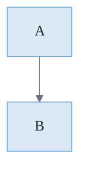

# CorreaX Mermaid Theme Snippet

> **Source**: DK §12 · Use this init block at the top of every Mermaid diagram in Alex documentation.
> **Copy** the `%%{init}%%` block and place it as the first line inside every ` ```mermaid ` code fence.

---

## Usage

````markdown

````

---

## Theme Variables Reference

| Variable | Value | Role |
|----------|-------|------|
| `background` | `#f8f9fa` | Diagram canvas (light pastel) |
| `primaryColor` | `#dbe9f6` | Node fill (soft blue) |
| `primaryTextColor` | `#1f2328` | Node label text (dark) |
| `primaryBorderColor` | `#6ea8d9` | Node border (medium blue) |
| `lineColor` | `#6b7280` | Edge / connector color (gray) |
| `secondaryColor` | `#d1f5ef` | Secondary node fill (soft teal) |
| `secondaryBorderColor` | `#5ab5a0` | Secondary node border (teal) |
| `tertiaryColor` | `#ede7f6` | Tertiary node fill (soft purple) |
| `tertiaryBorderColor` | `#b39ddb` | Tertiary node border (purple) |
| `edgeLabelBackground` | `#ffffff` | Arrow label background (white) |
| `fontFamily` | `Segoe UI, system-ui, sans-serif` | Diagram text font |

---

## Compact One-Liner (for tight spaces)

```
%%{init: {'theme': 'base', 'themeVariables': {'background': '#f8f9fa', 'primaryColor': '#dbe9f6', 'primaryTextColor': '#1f2328', 'primaryBorderColor': '#6ea8d9', 'lineColor': '#6b7280', 'secondaryColor': '#d1f5ef', 'secondaryBorderColor': '#5ab5a0', 'tertiaryColor': '#ede7f6', 'tertiaryBorderColor': '#b39ddb', 'edgeLabelBackground': '#ffffff', 'fontFamily': 'Segoe UI, system-ui, sans-serif'}}}%%
```
