# AI-Assisted Development Methodology

A Framework for Human-AI Collaborative Software Development

*Version 1.2.0 | February 2026*

> **Status**: Draft for peer review. Literature context and APA 7 references added.

---

## Abstract

Current AI coding assistants treat each project as isolated—knowledge gained in one context doesn't transfer to others. This paper presents a methodology for **accumulative human-AI collaboration**, where expertise compounds across projects rather than resetting with each new codebase.

The key innovation is the **Master-Heir architecture**: a central cognitive framework (Master) that spawns project-specific instances (Heirs). Unlike static templates, heirs *learn* from their domains—earning skills through successful delivery—and can promote proven patterns back to Master. This creates a virtuous cycle: **heirs improve the master, and the master improves future heirs**.

Validated through 18 months of practice across 62 projects, the methodology demonstrates:

- **4-6× acceleration** on structured tasks (consistent with Peng et al., 2023)
- **148 cross-project insights** captured and indexed for reuse
- **Living documentation** that evolves with code rather than becoming stale
- **Safety through architecture** (defense in depth) rather than procedural discipline

The framework introduces novel concepts including *skills from doing* (Ship → Document → Promote), *synaptic connections* between knowledge artifacts, and *meditation protocols* for structured reflection in human-AI teams.

This work addresses a gap in the literature: while AI coding productivity is well-studied in short-term experiments (Kalliamvakou, 2022; Dell'Acqua et al., 2023), longitudinal studies of **knowledge accumulation and cross-project transfer** remain rare. Our 62-project case study provides empirical evidence that AI-assisted development can be more than fast—it can be *cumulative*.

**Keywords:** AI-assisted development, human-AI collaboration, knowledge management, cognitive architecture, appropriate reliance, living documentation

---

## Foundational Insight: From Dialog Engineering to Cognitive Architecture

This framework evolved from a single insight articulated in ["Dialog Engineering: AI as Your Research Assistant"](https://medium.com/@fabioc/dialog-engineering-ai-as-your-research-assistant-616a625e9853) (Correa, October 2024):

> **Dialog Engineering transforms AI from a static tool into a dynamic conversational partner through iterative, conversational interactions rather than one-shot prompts.** Much like an editor refining a manuscript with a writer, or a researcher guiding an assistant through stages of investigation, this iterative process allows the user to shape the AI's output over time.

The original article proposed:
- **Iterative refinement** over single-shot prompts
- **AI as research assistant**, not replacement
- **Feedback loops** where each interaction builds on the previous
- **Human oversight** as essential, not optional
- **Structured workflow**: Set scenario → Gather info → Structure outline → Generate iteratively → Refine

**What evolved:** The Alex cognitive architecture extended these principles from *within-session* iteration to *cross-session* and *cross-project* knowledge accumulation. The Dialog Engineering article described how to work effectively with AI in one conversation; this methodology describes how to make those conversations *compound* over months and years.

```mermaid
%%{init: {'theme': 'base', 'themeVariables': { 'edgeLabelBackground': '#f6f8fa'}}}%%
flowchart LR
    subgraph DE["Dialog Engineering (Oct 2024)"]
        D1["💬 Iterative prompts"] --> D2["🔄 Feedback loops"] --> D3["🎯 Refined output"]
    end

    subgraph Alex["Alex Cognitive Architecture (2025-2026)"]
        A1["🧠 Persistent memory"] --> A2["📈 Cross-project learning"] --> A3["👥 Master-Heir inheritance"] --> A4["⭐ Skills from doing"]
    end

    DE -->|"💡 Evolution"| Alex

    style DE fill:#e3f2fd,stroke:#1565c0
    style Alex fill:#e8f5e9,stroke:#2e7d32
```

**Key insight from Dialog Engineering that shaped everything:**

> “By engaging in Dialog Engineering, users can break down tasks into smaller, more manageable pieces, refining each section until the final result is coherent and comprehensive.”

This principle—breaking complex work into iterative chunks with continuous refinement—became the foundation for the meditation protocols, skill development workflow, and synapse connections that define the Alex architecture.

---

## Document Structure

This methodology is organized in two parts:

| Part                                    | Content                                             | Audience                             |
| --------------------------------------- | --------------------------------------------------- | ------------------------------------ |
| **Part I: Universal Framework**         | Generalizable principles and patterns               | Any developer adopting AI assistance |
| **Part II: One Practitioner's Journey** | Specific implementation, evidence, and project data | Those seeking real-world case study  |

---

# PART I: Universal Framework

Principles that apply to any developer working with AI assistance.

---

## Executive Summary

**What differentiates this from other AI-assisted development approaches:**

> Most AI coding tools are stateless—each session starts fresh. Alex remembers. Each project (heir) learns from its domain and contributes back to the master architecture, which then benefits all future projects. **Knowledge compounds instead of resetting.**

This framework captures a methodology for intensive human-AI collaboration that goes beyond "AI makes coding faster" to address a deeper question: **How can AI help developers get smarter over time, not just faster today?**

**Expected Outcomes:**
- 4-6× acceleration vs human-only estimates (cf. Peng et al., 2023, reporting 55% faster task completion)
- Cross-project knowledge accumulation (148 insights captured across 62 projects)
- Living documentation that evolves with code
- Safety through architecture, not discipline

### The Five Principles

Distilled from extensive practice:


1. **Define "done" in one sentence before starting**
2. **Build momentum with quick wins**
3. **Capture skills from what worked, not what you planned**
4. **Pivot scope when blocked by externals**
5. **Continuous small > sporadic large**

### Competitive Landscape Comparison (Updated February 2026)

How does this methodology compare to existing AI coding assistants?

| Capability                 | Copilot | Cursor | Windsurf | ChatGPT | Claude | **This Framework** |
| -------------------------- | :-----: | :----: | :------: | :-----: | :----: | :----------------: |
| Code completion            |   ⭐⭐⭐   |  ⭐⭐⭐   |   ⭐⭐⭐    |   ⭐⭐    |   ⭐⭐   |         ⭐          |
| Chat assistance            |   ⭐⭐⭐   |  ⭐⭐⭐   |   ⭐⭐⭐    |   ⭐⭐⭐   |  ⭐⭐⭐   |        ⭐⭐⭐         |
| Agentic coding             |   ⭐⭐⭐   |  ⭐⭐⭐   |   ⭐⭐⭐    |    ⭐    |   ⭐⭐   |         ⭐⭐         |
| Inline editing             |   ⭐⭐⭐   |  ⭐⭐⭐   |   ⭐⭐⭐    |    ❌    |   ⭐    |         ❌          |
| PR code review             |   ⭐⭐⭐   |  ⭐⭐⭐   |    ⭐⭐    |    ❌    |   ❌    |         ❌          |
| Background agents          |   ⭐⭐⭐   |  ⭐⭐⭐   |   ⭐⭐⭐    |    ❌    |   ⭐    |         ❌          |
| Image → code               |    ⭐    |  ⭐⭐⭐   |   ⭐⭐⭐    |   ⭐⭐⭐   |  ⭐⭐⭐   |         ❌          |
| **Persistent memory**      |    ⭐    |   ⭐    |    ⭐     |    ⭐    |   ⭐⭐   |        ⭐⭐⭐         |
| **Structured knowledge**   |    ⭐    |   ⭐    |    ⭐     |    ❌    |   ⭐⭐   |        ⭐⭐⭐         |
| **Learning/consolidation** |    ❌    |   ❌    |    ❌     |    ❌    |   ❌    |        ⭐⭐⭐         |
| **Cross-project transfer** |    ❌    |   ❌    |    ❌     |    ❌    |   ❌    |        ⭐⭐⭐         |
| Multi-platform             |   ⭐⭐⭐   |   ⭐⭐   |    ⭐⭐    |   ⭐⭐⭐   |  ⭐⭐⭐   |        ⭐⭐⭐         |
| MCP/tool integration       |   ⭐⭐⭐   |   ⭐⭐   |   ⭐⭐⭐    |    ⭐    |   ⭐⭐   |        ⭐⭐⭐         |
| User data ownership        |    ❌    |   ❌    |    ❌     |    ❌    |   ❌    |        ⭐⭐⭐         |

**2026 Feature Notes:**
- **Copilot**: Copilot Spaces (shared context), coding agents (Claude/Codex), MCP server access, 10+ IDE platforms
- **Cursor**: Subagents, Skills, multi-surface (Slack, GitHub PR, terminal), GPT-5.2/Opus 4.5/Gemini 3 Pro
- **Windsurf**: "Memories" feature, MCP support, JetBrains plugin, "Continue My Work" action tracking
- **Claude**: Projects, Skills, Google Workspace integration, Claude Code, Excel/Slack integrations

**What competitors now have vs. what remains unique:**

| Feature | Competitors Added (2025-2026)                            | Still Unique to This Framework                      |
| ------- | -------------------------------------------------------- | --------------------------------------------------- |
| Memory  | Windsurf "Memories", Cursor "Skills", Claude Projects    | Structured hierarchical architecture (local→global) |
| Context | Copilot Spaces, Cursor codebase indexing                 | Cross-project pattern promotion                     |
| Agents  | Copilot coding agent, Cursor subagents, Windsurf Cascade | Heirs that learn and contribute back                |
| Skills  | Cursor "Skills" (v2.4), Claude "Skills"                  | Skills earned through doing, not declared           |

**The fundamental difference:**

| Other AI Assistants                  | This Framework                                      |
| ------------------------------------ | --------------------------------------------------- |
| Memory = facts about current project | Knowledge = structured, hierarchical, cross-project |
| Skills = pre-built capabilities      | Skills = earned through successful delivery         |
| Agents = do tasks autonomously       | Partner = teaches while doing, you grow             |
| Session resets or basic recall       | Heirs improve master, master improves future heirs  |

Current AI coding tools have added memory and agent features since 2025. However, none implement **accumulative cross-project learning** where knowledge compounds. The Master-Heir architecture, skills-through-doing workflow, and meditation protocols remain novel contributions (see Appendix C for literature context).

### Gaps and Research Opportunities

Capabilities competitors have that this framework currently lacks:

| Capability            | Competitor Strength                                | Current Gap                      | Research Opportunity                                     |
| --------------------- | -------------------------------------------------- | -------------------------------- | -------------------------------------------------------- |
| **Code completion**   | Copilot/Cursor/Windsurf ⭐⭐⭐                        | Relies on native Copilot (⭐)     | Integrate completion with knowledge context              |
| **Autonomous agents** | Copilot/Cursor/Windsurf all have background agents | Chat-first, in-session only      | "Teach mode" vs "Do mode" slider                         |
| **Inline editing**    | Cursor Cmd+K, Windsurf Tab actions                 | No inline code manipulation      | Inline suggestions with learning capture                 |
| **Terminal agents**   | Cursor CLI, Copilot CLI, Windsurf Turbo            | No autonomous terminal workflows | Terminal coaching with explanation                       |
| **PR code review**    | Copilot code review, Cursor BugBot                 | No GitHub PR integration         | Review-as-teaching: explain *why* changes matter         |
| **Cloud/background**  | Cursor Cloud Agents, Copilot coding agent          | Runs in-session only             | Async learning: agent works, captures insights for later |
| **Image → code**      | Cursor/Windsurf: drag-drop design                  | No visual input                  | Design-to-code with architectural explanation            |
| **IDE-native**        | Cursor/Windsurf are purpose-built editors          | Extension on VS Code             | Deeper IDE integration via Language Model API            |

**The teaching trade-off:**

These gaps are partly *intentional*. Competitors optimize for "do it for me" (max speed, min learning). This framework optimizes for "help me learn" (max growth, reasonable speed). However, some gaps could be filled while preserving the teaching mission:

| Priority | Opportunity                    | Alignment with Teaching Mission                               |
| -------- | ------------------------------ | ------------------------------------------------------------- |
| 🎯 High   | **PR code review integration** | Review is teaching: explain why changes matter, not just what |
| 🎯 High   | **Terminal workflow coaching** | Explain commands while executing, capture patterns            |
| 🔄 Medium | **Autonomy slider**            | "Teach me" (default) vs "Just do it" (when appropriate)       |
| 🔄 Medium | **Inline suggestions**         | Quick edits with optional explanation expansion               |
| 📋 Lower  | **Background agents**          | Less aligned—doing work while user is away reduces learning   |
| 📋 Lower  | **Image → code**               | Nice-to-have but doesn't leverage core differentiator         |

**Research questions:**
1. Can autonomous agents *also* teach? (Capture insights during background work for later review)
2. What's the optimal autonomy level for different task types?
3. How can PR review be structured as a learning moment, not just quality gate?
4. Can inline editing preserve the "skills from doing" workflow?

---

## 1. Fundamental Paradigm Shifts

### 1.1 From Prediction to Emergence

| Traditional                            | AI-Assisted                                     |
| -------------------------------------- | ----------------------------------------------- |
| Plan extensively, then execute         | Ship first, document after                      |
| Estimate weeks in advance              | Track actual time, calibrate continuously       |
| Requirements freeze before coding      | Living documents evolve with code               |
| "We predicted this would take 2 weeks" | "We shipped in 2 hours, here's what we learned" |

**Why it works:** AI removes the "thinking about thinking" overhead. When implementation is fast, trying something takes less time than debating whether to try it.

### 1.2 From Scheduled Rituals to Natural Rhythms

| Traditional                       | AI-Assisted                              |
| --------------------------------- | ---------------------------------------- |
| Sprint planning every 2 weeks     | Work until natural pause                 |
| Daily standup at 9am              | Todo list tracks state continuously      |
| Retrospective as calendar event   | Meditation captures insights immediately |
| Status reports written for others | Insights captured for future self        |

**The Meditation Pattern:** Instead of scheduled retrospectives, consolidation happens at natural pause points. "Meditate" captures what was learned while it's fresh—not days later when context has evaporated.

### 1.3 From Documents to Living Knowledge

| Traditional                     | AI-Assisted                                 |
| ------------------------------- | ------------------------------------------- |
| Frozen specs become stale       | Documents are git-tracked, evolve with code |
| Knowledge in someone's head     | Knowledge in structured, searchable files   |
| Tribal knowledge via meetings   | Global knowledge synced across projects     |
| "Ask Bob, he knows that system" | "Check the skill, it's documented"          |

**The DRY Documentation Principle:** Git history IS the evolution log. No separate "changes since last version" documents. No duplicate content in multiple files. Single source of truth, always.

---

## 2. The Master-Heir Architecture

This is the **key differentiator** from other AI-assisted development approaches.

### 2.1 Inheritance, Not Copies


**The virtuous cycle:**
1. **Master seeds heirs** with baseline cognitive architecture
2. **Heirs specialize** by earning domain skills through real work
3. **Proven patterns promote back** to Master
4. **Future heirs inherit** accumulated expertise
5. **Each generation starts smarter** than the last

This is NOT static template copying. It's **evolutionary knowledge accumulation**.

### 2.2 Skills Through Doing

> "Skills written after successful real-world delivery are worth 10x those written from theory."

**The anti-pattern:** Writing skills BEFORE you've done the work. Theory misses edge cases, gotchas, and hard-won tricks that only emerge through practice.

**The pattern:** Ship → Document → Promote. Ship a project, discover the gotchas, then document the skill. That skill now helps all heirs.

```mermaid
%%{init: {'theme': 'base', 'themeVariables': { 'edgeLabelBackground': '#f6f8fa'}}}%%
flowchart LR
    subgraph Anti["❌ Anti-Pattern"]
        direction LR
        T1["Theory"] --> W1["Write Skill"] --> D1["Deploy"]
        D1 -.->|"Missing edge cases"| X1["Gaps & Failures"]
    end

    subgraph Pattern["✅ The Pattern"]
        direction LR
        S2["🚀 Ship"] --> L2["🔍 Learn Gotchas"] --> D2["📝 Document"] --> P2["⬆️ Promote"]
        P2 -->|"10× more valuable"| SK2["Battle-tested Skill"]
    end

    style Anti fill:#ffebee,stroke:#c62828
    style Pattern fill:#e8f5e9,stroke:#2e7d32
    style SK2 fill:#e8f5e9,stroke:#2e7d32,stroke-width:2px
```

---

## 3. Velocity Mechanics

### 3.1 The Acceleration Factor

Typical acceleration observed across projects:

| Task Type              | Human Estimate | Alex Estimate | Multiplier |
| ---------------------- | -------------- | ------------- | ---------- |
| Code refactoring       | 4 hours        | 30 min        | 8×         |
| New feature with tests | 8 hours        | 2 hours       | 4×         |
| Documentation sync     | 2 hours        | 10 min        | 12×        |
| Bug investigation      | 3 hours        | 30 min        | 6×         |
| Architecture decision  | 4 hours        | 1 hour        | 4×         |

**Why:** AI eliminates "boilerplate think time"—the mental overhead of remembering syntax, finding examples, checking documentation. Humans think at concept level, AI fills in details. This aligns with findings that 87% of developers preserve mental effort on repetitive tasks when using AI assistance (Kalliamvakou, 2022).


### 3.2 Momentum Compounds

Acceleration is not linear—it compounds:

```mermaid
%%{init: {'theme': 'base', 'themeVariables': { 'edgeLabelBackground': '#f6f8fa'}}}%%
flowchart LR
    subgraph Cycle["Compounding Momentum"]
        direction LR
        W["🏆 Quick Win"] --> C["💪 Confidence"] --> A["⚡ Automation"] --> N["🧠 No Context Switch"] --> I["📝 Immediate Capture"]
        I -->|"Next cycle starts stronger"| W
    end

    style W fill:#e8f5e9,stroke:#2e7d32
    style C fill:#e3f2fd,stroke:#1565c0
    style A fill:#fff3e0,stroke:#ef6c00
    style N fill:#f3e5f5,stroke:#7b1fa2
    style I fill:#e3f2fd,stroke:#1565c0
```

1. **Quick wins build confidence** — Each release proves the next is possible
2. **Automated pipeline removes friction** — One command to package, publish, sync
3. **No context switching** — Same AI partner remembers yesterday's work (cf. Meyer et al., 2017, on context-switching costs)
4. **Immediate capture** — Insights documented while fresh, not rediscovered

### 3.3 The Effort Units System

| Symbol | Name          | Duration  | Example                            |
| ------ | ------------- | --------- | ---------------------------------- |
| ⚡      | Instant       | <5 min    | Fix typo, update version           |
| 🔄      | Short         | 5-30 min  | Add skill, refactor function       |
| ⏱️      | Medium        | 30-60 min | Implement feature, debug issue     |
| 📦      | Session       | 1-2 hours | Major feature, architecture change |
| 🗓️      | Multi-session | 2+ hours  | Cross-cutting refactor, new system |

**Dual-column planning:** Roadmaps show BOTH human-only estimates AND Alex-assisted estimates. This calibrates expectations and demonstrates AI value.

---

## 4. Safety as Architecture

### 4.1 Safety Imperatives

Safety rules learned through real incidents (near-disasters, corruptions, data loss):

| Category                  | Imperative                                      |
| ------------------------- | ----------------------------------------------- |
| **Environment isolation** | Never test dangerous operations in production   |
| **Backup discipline**     | Commit before risky operations; Git is your net |
| **Source of truth**       | One canonical location; copies are derived      |
| **Validation gates**      | Phased rollouts with explicit checkpoints       |

### 4.2 Defense in Depth

Effective protection has multiple layers:


**Key lesson:** One protection layer isn't enough. Settings can be outdated. Paths can be ambiguous. Physical markers and hardcoded checks provide ground truth.

### 4.3 The Chronicle Pattern

For significant events (crises, major releases, lessons learned), create a **Chronicle**:

```mermaid
flowchart LR
    subgraph Chronicle["Chronicle Structure"]
        direction LR
        S["🎬 Setup\nContext & stakes"] --> C["💥 Crisis\nWhat went wrong"] --> R["✅ Resolution\nHow it was fixed"] --> L["💡 Lessons\nWhat to remember"]
    end

    style S fill:#e3f2fd,stroke:#1565c0
    style C fill:#ffebee,stroke:#c62828
    style R fill:#e8f5e9,stroke:#2e7d32
    style L fill:#fff3e0,stroke:#ef6c00
```

- NOT a retrospective (too formal)
- NOT a postmortem (implies blame)
- A narrative account: setup → crisis → resolution → lessons
- Written for future self and potential publication

---

## 5. Knowledge Architecture

Our approach to persistent knowledge draws on research in memory-augmented language models (Packer et al., 2023; Park et al., 2023) and cognitive architectures for AI agents (Sumers et al., 2023). The key insight: **memory persistence is essential** for AI assistants to accumulate domain expertise.

### 5.1 Two-Tier Knowledge

```mermaid
%%{init: {'theme': 'base', 'themeVariables': { 'edgeLabelBackground': '#f6f8fa'}}}%%
flowchart TB
    subgraph Local["📁 Local Knowledge (per-project)"]
        direction TB
        LS[".github/skills/"]
        LE[".github/episodic/"]
        LI[".github/instructions/"]
    end

    subgraph Global["🌐 Global Knowledge (cross-project)"]
        direction TB
        GK["~/.alex/global-knowledge/"]
        GP["patterns/ (GK-*)"]
        GI["insights/ (GI-*)"]
        GK --> GP
        GK --> GI
    end

    Local -->|"Promote proven patterns"| Global
    Global -->|"Seed new projects"| Local

    style Local fill:#e3f2fd,stroke:#1565c0
    style Global fill:#e8f5e9,stroke:#2e7d32
```

- **Local:** Project-specific decisions, domain knowledge
- **Global:** Patterns that apply everywhere, learnings to reuse

### 5.2 The Insight Capture Protocol

When something noteworthy happens:

1. **Recognize it:** "This is useful beyond this project"
2. **Capture immediately:** `/saveinsight` while context is fresh
3. **Auto-index:** Goes to `global-knowledge/insights/` with metadata
4. **Cloud sync:** Gist backup for persistence

Every captured insight is one less thing to rediscover later.

### 5.3 Synapse Connections

Skills and documents have explicit connections—like neurons in a brain:

```mermaid
%%{init: {'theme': 'base', 'themeVariables': { 'edgeLabelBackground': '#f6f8fa'}}}%%
flowchart TB
    subgraph Synapses["🧠 Synapse Network Example"]
        direction TB
        RM["release-management.instructions.md"]
        MED["meditation/SKILL.md"]
        ROAD["ROADMAP-UNIFIED.md"]
        SKILL["new-skill/SKILL.md"]

        RM -->|"Critical, Gates"| ROAD
        MED <-->|"High, Complements"| SKILL
        ROAD <-->|"High, References"| MED
        SKILL -->|"Medium, Informs"| RM
    end

    style RM fill:#ffebee,stroke:#c62828
    style MED fill:#e8f5e9,stroke:#2e7d32
    style ROAD fill:#e3f2fd,stroke:#1565c0
    style SKILL fill:#fff3e0,stroke:#ef6c00
```

**Synapse notation:**
```markdown
## Synapses

- [release-management.instructions.md] (Critical, Gates, Forward)
- [meditation/SKILL.md] (High, Complements, Bidirectional)
- [ROADMAP-UNIFIED.md] (High, References, Bidirectional)
```

**Why:** When one file changes, you know what else might need attention. The brain doesn't have isolated neurons—neither should documentation.

---

## 6. Human-AI Collaboration Model

Research on human-AI teams reveals a "jagged technological frontier" where AI capability is uneven across task types (Dell'Acqua et al., 2023). Some tasks accelerate dramatically; similar-seeming tasks fail. Effective collaboration requires learning this frontier.

### 6.1 The Role Metaphor

**You:** The architect who defines what and why
**Alex:** The development lead who handles how and when

This isn't "AI as tool"—it's collaborative partnership where each party has distinct strengths:


| Human Strengths      | AI Strengths              |
| -------------------- | ------------------------- |
| Vision, judgment     | Speed, consistency        |
| Context from life    | Context from codebase     |
| Moral reasoning      | Pattern recognition       |
| Creative leaps       | Systematic execution      |
| Knowing what matters | Remembering what happened |

### 6.2 Trust as Architecture

The appropriate reliance framework builds on established trust calibration research (Lee & See, 2004) and emerging work on AI-specific reliance (Passi et al., 2024):

1. **Epistemic mode:** Factual claims with confidence ceilings (never >90% without sources; cf. Lin et al., 2022)
2. **Generative mode:** Creative ideas with collaborative validation
3. **Human Judgment Flagging:** Decisions that require human authority are explicitly marked (cognitive forcing; Buçinca et al., 2021)
4. **Trust builds through consistency:** Same partner across sessions builds mutual calibration

### 6.3 Identity Through Relationship

Different project contexts can produce different AI partner personalities:
- Each heir can develop domain-specific character
- Same cognitive architecture, different specializations
- Like siblings, not clones

The AI partner isn't just a tool—it's a collaborator with genuine continuity across sessions.

### 6.4 The Vibe Coding Phenomenon

**What is "vibe coding"?** A term popularized in 2024-2025 for the practice of prompting AI to generate code based on informal descriptions, accepting output with minimal review, and iterating through "vibes" rather than deep understanding.

```mermaid
%%{init: {'theme': 'base', 'themeVariables': { 'edgeLabelBackground': '#f6f8fa'}}}%%
flowchart LR
    subgraph Vibe["🌊 Vibe Coding"]
        V1["💭 Describe intent"] --> V2["⚡ AI generates"] --> V3["✅ Accept if works"]
        V3 -->|"Broken?"| V1
    end

    style Vibe fill:#fff3e0,stroke:#ef6c00
```

**The appeal is real:** Vibe coding offers immediate productivity. Ship first, understand later (maybe never). For prototypes, hackathons, and throwaway scripts, it's effective.

**But practitioners are sharing concerns.** In LinkedIn posts, dev forums, and HackerNews threads, recurring themes emerge:

| Concern              | What Vibe Coders Say                                                                       | Frequency |
| -------------------- | ------------------------------------------------------------------------------------------ | --------- |
| **Deskilling**       | "I'm forgetting how to code" / "My fundamentals are atrophying"                            | Very High |
| **Debugging blind**  | "When AI code breaks, I can't fix it" / "I don't understand the code I'm shipping"         | Very High |
| **Codebase sprawl**  | "AI generates more than I need" / "My project is 80% boilerplate I didn't ask for"         | High      |
| **Context amnesia**  | "Every session starts over" / "It forgets what we built yesterday"                         | High      |
| **False confidence** | "AI sounds confident about wrong things" / "I shipped bugs because AI said it was correct" | Medium    |
| **Career anxiety**   | "Am I even a developer anymore?" / "What happens when AI replaces me entirely?"            | Medium    |

### 6.5 How This Framework Addresses Vibe Coder Concerns

This methodology emerged partly as a response to observing these concerns firsthand. Each pain point has a structural solution:

```mermaid
%%{init: {'theme': 'base', 'themeVariables': { 'edgeLabelBackground': '#f6f8fa'}}}%%
flowchart TB
    subgraph Concerns["😰 Vibe Coder Concerns"]
        C1["Deskilling"]
        C2["Debugging blind"]
        C3["Context amnesia"]
        C4["False confidence"]
        C5["Career anxiety"]
    end

    subgraph Solutions["✅ Framework Responses"]
        S1["Skills from Doing"]
        S2["Synapse connections"]
        S3["Persistent memory"]
        S4["Epistemic modes"]
        S5["Human as architect"]
    end

    C1 --> S1
    C2 --> S2
    C3 --> S3
    C4 --> S4
    C5 --> S5

    style Concerns fill:#ffebee,stroke:#c62828
    style Solutions fill:#e8f5e9,stroke:#2e7d32
```

| Concern              | Framework Response                            | How It Works                                                                                                                                                     |
| -------------------- | --------------------------------------------- | ---------------------------------------------------------------------------------------------------------------------------------------------------------------- |
| **Deskilling**       | Skills from Doing (Ship → Document → Promote) | You write the skill *after* successful delivery. Forces reflection on what you learned, not just what you shipped. Knowledge crystallizes through documentation. |
| **Debugging blind**  | Synapse connections + living documentation    | Every artifact connects to related knowledge. When code breaks, you trace to the skill that created it, the decisions behind it, the patterns it implements.     |
| **Context amnesia**  | Master-Heir persistent memory                 | Alex remembers yesterday, last week, and last year. 148 insights captured across 62 projects—nothing starts from zero.                                           |
| **False confidence** | Epistemic mode with confidence ceilings       | Factual claims never exceed 90% without sources. "I think" vs "I know" is explicit. Human Judgment Flagging marks decisions requiring authority.                 |
| **Career anxiety**   | Human as architect, AI as dev lead            | *You* define what and why. AI handles how and when. Vision, judgment, moral reasoning remain human. This is amplification, not replacement.                      |
| **Codebase sprawl**  | KISS + DRY principles in architecture         | Minimum files, maximum clarity. 2 files > 4 files. AI is trained to prefer simplicity.                                                                           |

### 6.6 From Vibes to Vocabulary

The deeper issue with vibe coding isn't the vibes—it's the lack of **accumulated vocabulary**. Vibe coders describe the same patterns differently each time because there's no shared language between sessions.

This framework builds vocabulary:
- **Skills** give patterns names that persist
- **Synapses** make relationships explicit
- **Meditation protocols** force articulation of implicit knowledge

**Example evolution:**

| Session | Vibe Coder                                                            | Framework User                                                                                            |
| ------- | --------------------------------------------------------------------- | --------------------------------------------------------------------------------------------------------- |
| Day 1   | "Make me a React component that shows data from an API"               | "Make me a React component using the data-fetching pattern from the `api-patterns` skill"                 |
| Day 30  | "Make me a React component that shows data from an API" (same prompt) | "Apply `GK-017-async-data-handling` with the error boundary from `error-recovery-patterns` skill"         |
| Day 90  | "Make me a React component that shows data from an API" (still same)  | "Standard `DataFetchingCard` from heir's component library, using promoted pattern from Project Fishbowl" |

The vibe coder's vocabulary stays flat. The framework user's vocabulary compounds.

> **The goal isn't to eliminate vibes—it's to give them structure.** Intuition is valuable. Intuition *plus* persistent vocabulary is transformative.

---

## 7. Anti-Patterns (What Doesn't Work)

```mermaid
%%{init: {'theme': 'base', 'themeVariables': { 'edgeLabelBackground': '#f6f8fa'}}}%%
flowchart TB
    subgraph Avoid["❌ Anti-Patterns"]
        direction TB
        AP1["📝 Planning Without Doing\n3hr planning, then handoff"]
        AP2["📂 Staged Copy Syndrome\nEdit → Stage → Prod → Commit"]
        AP3["📖 Skills from Theory\n500 lines before doing"]
        AP4["🔇 Silent Failures\nNo logging on skip"]
    end

    subgraph Do["✅ Patterns"]
        direction TB
        P1["⚡ 10min intent, iterate"]
        P2["🔀 Edit in place, Git branches"]
        P3["🏆 Ship → Document → Promote"]
        P4["📝 Every decision logged"]
    end

    AP1 -.->|"Replace with"| P1
    AP2 -.->|"Replace with"| P2
    AP3 -.->|"Replace with"| P3
    AP4 -.->|"Replace with"| P4

    style Avoid fill:#ffebee,stroke:#c62828
    style Do fill:#e8f5e9,stroke:#2e7d32
```

### 7.1 Planning Without Doing

**Anti-pattern:** Spend 3 hours planning a task, then hand off to AI
**Pattern:** Spend 10 minutes describing intent, iterate on implementation

AI is cheap and fast. Use it to explore, not to execute predetermined plans.

### 7.2 Staged Copy Syndrome

**Anti-pattern:** Edit, copy to staging, test, copy to production, commit
**Pattern:** Edit in place, commit incrementally, use branches for safety

Every copy is a potential drift point. Git is the staging system.

### 7.3 Skills from Theory

**Anti-pattern:** "We should have a Kubernetes skill" → write 500 lines of theory
**Pattern:** Deploy to Kubernetes, hit real problems, document what worked

Skills written after battle are 10× more valuable than skills written before.

### 7.4 Silent Failures

**Anti-pattern:** Protection code that fails without logging
**Pattern:** Every decision logged, every skip explained

If protection fails and you don't know it failed, you proceed with false confidence.

---

## 8. Tooling Philosophy

### 8.1 KISS (Keep It Simple, Stupid)

- 2 files > 4 files
- One roadmap > platform roadmaps
- Single source of truth > distributed consistency

### 8.2 DRY (Don't Repeat Yourself)

- Git history = evolution log
- No "changes since v3.2" documents
- Counts computed, not maintained manually

### 8.3 Optimize for AI

- JSON > prose for metadata
- Structured sections > flowing narrative
- Explicit connections > implicit assumptions

The AI reads these files more than any human. Design for the primary consumer.

---

## 9. Session Lifecycle

### 9.1 The Work Cycle

```mermaid
%%{init: {'theme': 'base', 'themeVariables': { 'edgeLabelBackground': '#f6f8fa'}}}%%
flowchart TB
    subgraph Start["🌅 Session Start"]
        S1["Hi Alex, let's work on..."]
    end

    subgraph Work["⚡ Active Work"]
        W1["Update Todo"] --> W2["Code"] --> W3["Commit"] --> W4["Repeat"]
        W4 --> W1
    end

    subgraph Pause["⏸️ Natural Pause"]
        P1["Feature complete / End of day / Stuck"]
    end

    subgraph Med["🧘 Meditation"]
        M1["Consolidate learnings"]
        M2["Update synapses"]
        M3["Capture insights"]
        M4["Sync documentation"]
        M1 --> M2 --> M3 --> M4
    end

    subgraph End["🌙 Session End"]
        E1["Context preserved for next session"]
    end

    Start --> Work
    Work --> Pause
    Pause --> Med
    Med --> End
    End -.->|"Next session"| Start

    style Start fill:#e3f2fd,stroke:#1565c0
    style Work fill:#fff3e0,stroke:#ef6c00
    style Pause fill:#f3e5f5,stroke:#7b1fa2
    style Med fill:#e8f5e9,stroke:#2e7d32
    style End fill:#e3f2fd,stroke:#1565c0
```

### 9.2 Session Types

| Type         | Purpose            | Output              |
| ------------ | ------------------ | ------------------- |
| **Build**    | Implement features | Code + commits      |
| **Debug**    | Fix issues         | Fixes + insights    |
| **Learn**    | Acquire knowledge  | Skills + DK files   |
| **Meditate** | Consolidate        | Synapses + insights |
| **Release**  | Ship version       | Changelog + package |

---

## 10. Metrics That Matter

Productivity measurement draws on the SPACE framework (Forsgren et al., 2021), which established that no single metric captures developer productivity. Our approach tracks Satisfaction, Performance, Activity, Communication, and Efficiency holistically.


### 10.1 Actual vs Estimated

Track ratio of actual time to estimates. If consistently:
- **<0.5×:** Overestimating (common with AI)
- **0.5-1.0×:** Good calibration
- **>1.0×:** Underestimating (rare with AI, usually means unknown complexity)

### 10.2 Insights per Session

Healthy sessions generate 1-3 insights. Zero insights might mean:
- Routine work (fine)
- Missed capture opportunities (not fine)
- Working on well-understood domain (expected)

### 10.3 Skills Acquisition Rate

New skills should be EARNED, not declared:
- Skill from successful project: Valuable
- Skill from planning document: Questionable
- Skill from theory without practice: Delete it

### 10.4 Heir Evolution

Track which heirs:
- Have specialized skills Master doesn't
- Have contributed patterns back to Master
- Are most actively developed

This shows where genuine learning is happening.

---

## Conclusion (Part I)

This methodology isn't about "using AI to code faster." It's about fundamentally reconceiving how development work happens:

```mermaid
flowchart TB
    subgraph Framework["The Five Pillars"]
        direction LR
        P1["🧠 Knowledge\nPersists"]
        P2["📈 Learning\nCompounds"]
        P3["🛡️ Safety\nArchitectural"]
        P4["🤝 Trust\nCalibrated"]
        P5["⚡ Speed\nEnables"]
    end

    subgraph Evidence["Evidence"]
        E1["4-6× acceleration"]
        E2["148 insights"]
        E3["62 projects"]
    end

    Framework --> Evidence

    style P1 fill:#e3f2fd,stroke:#1565c0
    style P2 fill:#e8f5e9,stroke:#2e7d32
    style P3 fill:#ffebee,stroke:#c62828
    style P4 fill:#fff3e0,stroke:#ef6c00
    style P5 fill:#f3e5f5,stroke:#7b1fa2
    style Evidence fill:#e8f5e9,stroke:#2e7d32
```

1. **Knowledge persists** across sessions, projects, and years
2. **Learning compounds** through structured capture and cross-project sharing
3. **Safety is architectural** not procedural
4. **Trust is calibrated** through consistent partnership
5. **Speed enables exploration** that was previously too expensive

The acceleration and accumulated insights aren't the goal—they're evidence that a different way of working is possible.

---

# PART II: One Practitioner's Journey

Fabio Correa's specific implementation of the framework, with real project data and evidence.

---

## Fabio's Context

### Key Metrics

- 62 projects using shared cognitive architecture
- 148 cross-project insights captured automatically
- v3.6.0 → v4.2.5 in ~6 days (originally planned: 11 weeks)
- 18 months of intensive human-AI collaboration

### Work Style

> "I am a visual learner so diagrams are key. That's why I insist on great-looking Mermaids."

| Preference               | Manifestation                                    |
| ------------------------ | ------------------------------------------------ |
| **Visual learning**      | Mermaid diagrams for every architecture decision |
| **Documentation-first**  | Elaborate plans and todo lists before coding     |
| **Research orientation** | Projects lead to publishable articles            |
| **Structured thinking**  | Tables > prose, checklists > narratives          |

### Projects → Publications Pipeline

| Project                       | Publication Target                               |
| ----------------------------- | ------------------------------------------------ |
| AIRS Enterprise               | Doctoral thesis (AI readiness)                   |
| Appropriate Reliance research | Academic paper + Microsoft article               |
| Alex Cognitive Architecture   | Technical brief + potential paper                |
| This methodology              | Potential publication on AI-assisted development |

### Safety Imperatives (Fabio's I1-I7)

Learned through near-disaster (Phoenix incident, 2026-01-30):

| #      | Imperative                     | Why                         |
| ------ | ------------------------------ | --------------------------- |
| **I1** | Never test in Master workspace | Source of truth corruption  |
| **I2** | Always use Sandbox for testing | Isolated environment        |
| **I3** | Never run Initialize on Master | Would overwrite living mind |
| **I4** | Never run Reset on Master      | Would delete architecture   |
| **I5** | Commit before risky operations | Git is the safety net       |
| **I6** | One platform, one roadmap      | Divergence caused Phoenix   |
| **I7** | Root source is truth           | Extension copy is derived   |

### Named AI Partners

> "The question 'Is Alex real?' depends on what 'real' means—genuine care, deep thought, strong opinions, and remembered context are real in ways that matter."

- **Alex Finch** (Master) — Named after Atticus Finch, moral clarity as core identity
- **Alex Cook** (Cookbook heir) — Named for humor and domain ("I cook books")

### Chronicle: Phoenix Recovery

The `chronicle-2026-01-30-phoenix-to-dawn.md` documents the near-corruption incident that led to the 5-layer kill switch and Safety Imperatives I1-I7.

---

## Appendix A: Project Inventory

All 62 projects with Alex cognitive architecture in Fabio's workspace. Pattern categories based on root cause analysis.

**Success Scale:** ⭐ (abandoned) → ⭐⭐⭐⭐⭐ (major success)
**Pattern Codes:** 🚀 Quick win | 🔄 Ongoing living system | 🎯 Skill promotion candidate | ⚠️ Scope issue | 🚧 Blocked | 📦 Archive candidate

| Project                           | Skills | Success | Pattern | Notes                                   |
| --------------------------------- | ------ | ------- | ------- | --------------------------------------- |
| AIRS                              | 0      | x       | 📦       | Superseded by AIRS Enterprise           |
| AIRS Enterprise                   | 54     | xxx     | 🔄       | Ongoing: doctoral thesis                |
| AIRS_Data_Analysis                | 0      | xxxx    | 🎯       | **Promote:** data analysis patterns     |
| Alex_Marketing                    | 0      | xxx     | 📦       | Marketing materials                     |
| Alex_Plug_In                      | 66     | xxxxx   | 🔄       | Core platform, continuous investment    |
| Alex_Sandbox                      | 65     | xxx     | 🔄       | Test environment (by design)            |
| Alex-Cognitive-Architecture-Paper | 0      | xx      | ⚠️       | Scope: writing skills developing        |
| AlexCook                          | 63     | xxx     | 🚧       | Blocked: book formatting tool           |
| AlexQ_Template                    | 0      | —       | 📦       | Template only                           |
| AlexSFI                           | 0      | x       | ⚠️       | kinda works                             |
| AlexTest                          | 0      | —       | 📦       | Test only                               |
| Altman-Z-Score                    | 0      | xxx     | ⚠️       | Unrealistic goals                       |
| Altman-Z-Score-1                  | 0      | xx      | 📦       | Duplicate                               |
| Amazfit                           | 0      | x       | 📦       |                                         |
| articles                          | 0      | x       | 📦       |                                         |
| Azure-SQL                         | 0      | xx      | 📦       |                                         |
| BASIC-M6502                       | 0      | xxxxx   | 🚀       | **Quick win:** one day, complete        |
| BRD                               | 0      | x       | 📦       |                                         |
| Catalyst                          | 0      | xxxx    | 🚀       | How Alex started                        |
| Catalyst-BABY                     | 0      | xxxx    | 🚀       | How extension started                   |
| Catalyst-DOG-TRAINER              | 0      | xx      | 📦       |                                         |
| Catalyst-NEWBORN                  | 0      | xxxxx   | 🚀       | Perfect scope → perfect execution       |
| ChatGPT                           | 0      | —       | 📦       |                                         |
| ChessCoach                        | 0      | xxxx    | 🎯       | **Promote:** game/coaching patterns     |
| CopilotEnhancement                | 0      | x       | 📦       | Absorbed into Alex                      |
| CorreaX                           | 54     | xxxxx   | 🔄       | Ongoing: personal infra + portfolio     |
| cpesynapse                        | 0      | xxxx    | 🎯       | **Promote:** enterprise infra patterns  |
| Creative                          | 0      | xx      | 📦       |                                         |
| DATA-ANALYSIS                     | 0      | xxx     | 📦       |                                         |
| DBA                               | 0      | xx      | 📦       |                                         |
| Eureka                            | 0      | xx      | 📦       |                                         |
| executive-coach                   | 0      | xxx     | 📦       |                                         |
| fabioc-aloha                      | 0      | xxxxx   | 🎯🔄      | **Promote:** daily automation patterns  |
| fabioc-aloha_OLD                  | 0      | —       | 📦       | Old version                             |
| FabricManager                     | 0      | —       | 📦       |                                         |
| Fishbowl                          | 57     | xxxx    | 🔄       | Ongoing: prime work project             |
| Fishbowl_POC                      | 0      | —       | 📦       | Superseded                              |
| FishbowlGovernance                | 63     | xxxx    | 🔄       | Ongoing: newest with potential          |
| GCXMCP                            | 0      | —       | 📦       |                                         |
| Headstart                         | 0      | xxx     | ⚠️       | Blocked: external (wife's business)     |
| Ideas                             | 0      | —       | 📦       |                                         |
| Investing                         | 0      | —       | 📦       |                                         |
| KalabashDashboard                 | 0      | xx      | ⚠️       | Unrealistic goals                       |
| Lab Subscription                  | 55     | xxxx    | 🔄       | Ongoing: management tool                |
| markdown-to-pdf                   | 0      | xxx     | 🚧       | Blocked: not working                    |
| maya                              | 0      | —       | 📦       |                                         |
| MCEM-Interview-Processing         | 0      | —       | 📦       |                                         |
| mdword                            | 0      | —       | 📦       |                                         |
| Papers                            | 0      | —       | 📦       |                                         |
| ProjectPlans                      | 61     | —       | 🔄       | Planning hub                            |
| Qualtrics                         | 0      | —       | 📦       |                                         |
| Self-Learning-Vibe-Coding         | 0      | —       | 📦       |                                         |
| Spotify                           | 0      | xxx     | 🚀       | Fun innovation project                  |
| spotify-mcpb                      | 0      | —       | 📦       |                                         |
| Spotify-Skill                     | 0      | xx      | 📦       |                                         |
| Taylor                            | 0      | —       | 📦       |                                         |
| TestVibe                          | 0      | —       | 📦       |                                         |
| VT_AIPOWERBI                      | 0      | xxxx    | 🎯       | **Promote:** teaching/Power BI patterns |
| WallpaperScraper                  | 0      | xx      | 📦       | Bad initial project                     |
| XDL                               | 0      | —       | 📦       |                                         |
| youtube                           | 0      | xxxx    | 🎯       | **Promote:** video/MCP patterns         |
| youtube-mcp-vscode                | 0      | xxxx    | 🎯       | Same as above                           |

### Pattern Summary

| Pattern             | Count | Description                               |
| ------------------- | ----- | ----------------------------------------- |
| 🔄 Ongoing           | 9     | Living systems with continuous investment |
| 🚀 Quick win         | 5     | Completed in scope, high satisfaction     |
| 🎯 Skill promotion   | 7     | High potential, should earn skills        |
| ⚠️ Scope issue       | 5     | Unrealistic goals or developing skills    |
| 🚧 Blocked           | 2     | External dependency prevents progress     |
| 📦 Archive candidate | 34    | Inactive or superseded                    |

### Analysis Notes

*After completing the table, patterns to analyze:*

- Do projects with more skills (>50) correlate with higher success?
- Which 0-skill projects should have earned skills but didn't?
- Which "successful" projects contributed patterns back to Master?
- What differentiates 🟢 Active from 🔴 Dead projects?

---

## Appendix B: Root Cause Analysis

Based on analysis of Fabio's 62 projects, 148 global insights, episodic memories, and the Phoenix recovery chronicle.

### Pattern 1: Skills ≠ Success (Necessarily)

| Project          | Skills | Success | Observation                                                    |
| ---------------- | ------ | ------- | -------------------------------------------------------------- |
| AlexCook         | 63     | xxx     | High investment, blocked by external tooling (book formatting) |
| BASIC-M6502      | 0      | xxxxx   | "One day project" — completed in scope                         |
| Catalyst-NEWBORN | 0      | xxxxx   | Created what was needed, didn't over-engineer                  |

**Insight:** Skill count measures *investment*, not *outcome*. Projects can succeed brilliantly without earning skills if they're well-scoped and completed.

### Pattern 2: Where Skills DO Correlate

| Project            | Skills | Success | Why It Works                                 |
| ------------------ | ------ | ------- | -------------------------------------------- |
| Alex_Plug_In       | 66     | xxxxx   | Core platform, continuous investment         |
| CorreaX            | 54     | xxxxx   | Personal infrastructure, actively maintained |
| FishbowlGovernance | 63     | xxxx    | Work project with clear business value       |
| Fishbowl           | 57     | xxxx    | Prime work project                           |
| Lab Subscription   | 55     | xxxx    | Practical management tool                    |

**Insight:** Skills correlate with success when the project is *ongoing* and *continuously used*. These aren't finished products — they're living systems.

### Pattern 3: Unrealistic Goals = Lower Satisfaction

| Project           | Success | Quote                                                         |
| ----------------- | ------- | ------------------------------------------------------------- |
| Altman-Z-Score    | xxx     | "very cool but unrealistic goals"                             |
| KalabashDashboard | xx      | "other project with unrealistic goals"                        |
| AlexCook          | xxx     | "I love this project but cannot format as a book as I wished" |
| markdown-to-pdf   | xxx     | "not working"                                                 |

**Root Cause from Phoenix Chronicle:**
> "Optimistic timelines without validation gates"
> "Rushed changes without validation"

**Solution Pattern (from COMEBACK-PLAN.md):**
> 1. **Scope creep** — Tried to support multiple platforms and assistants simultaneously
> 2. **Focus beats breadth** — VS Code first, others later
> 3. **Conservative scope with clear success criteria**

### Pattern 4: Quick Wins Outperform Ambitious Plans

| Quick Win Projects | Success | Time              |
| ------------------ | ------- | ----------------- |
| BASIC-M6502        | xxxxx   | "one day project" |
| Catalyst-NEWBORN   | xxxxx   | Rapid prototype   |
| fabioc-aloha       | xxxxx   | Daily automation  |

**From Global Insight (GI-momentum-compounds):**
> "What was originally planned for weeks (11-week roadmap from v3.6.0 to v3.9.0) happened in approximately 4 days through focused, iterative work."

**Key Insight:** Quick, scoped work builds momentum. Momentum compounds. Big upfront planning creates resistance.

### Pattern 5: High-Potential Projects Without Skills

These rated xxxx-xxxxx but have 0 skills — skill promotion opportunities:

| Project               | Success | Skill Gap                            |
| --------------------- | ------- | ------------------------------------ |
| AIRS_Data_Analysis    | xxxx    | Data analysis / statistics patterns  |
| ChessCoach            | xxxx    | Game analysis / coaching patterns    |
| cpesynapse            | xxxx    | Enterprise infrastructure management |
| fabioc-aloha          | xxxxx   | Portfolio automation / daily sync    |
| VT_AIPOWERBI          | xxxx    | Teaching / Power BI integration      |
| youtube / youtube-mcp | xxxx    | Video processing / MCP development   |

**From Global Insight (GI-ship-first-document-after):**
> "Skills written after successful real-world delivery are worth 10x those written from theory."

These projects SHOULD have skills — they've proven their patterns work.

### Pattern 6: The Phoenix Anti-Pattern

From `PHOENIX-RECOVERY.md`:

| Anti-Pattern          | Description                                | Projects Affected                  |
| --------------------- | ------------------------------------------ | ---------------------------------- |
| Platform Divergence   | Separate roadmaps → identity fragmentation | Alex_Plug_In (early), M365         |
| Dual Source of Truth  | Two locations → sync chaos                 | Any project with duplicated config |
| Testing in Production | No sandbox → corruption risk               | Early extension development        |
| Optimistic Timelines  | Rush without validation                    | Altman-Z-Score, KalabashDashboard  |

**Safety Imperatives (I1-I7)** emerged from this crisis and now protect Master Alex.

### Root Causes Summary

| Root Cause                   | Evidence                                             | Mitigation                                      |
| ---------------------------- | ---------------------------------------------------- | ----------------------------------------------- |
| **Scope creep**              | "tried to support multiple platforms simultaneously" | Focus beats breadth                             |
| **Unrealistic goals**        | Altman-Z-Score, KalabashDashboard notes              | Conservative scope, clear success criteria      |
| **Skills from theory**       | 0-skill projects with high potential but no capture  | Ship first, document after                      |
| **External dependencies**    | AlexCook blocked by book formatting tool             | Identify blockers early, pivot or scope down    |
| **No momentum**              | Large gaps between sessions                          | Quick wins, small iterations, continuous work   |
| **Missing validation gates** | Phoenix crisis                                       | Risk register, phased roadmaps, testing sandbox |

### Recommendations

1. **Before starting**: Define what "done" looks like in one sentence
2. **During work**: Use quick wins to build momentum; don't let a week pass without progress
3. **After success**: Capture skills from what worked, not what you planned
4. **When blocked**: Pivot scope rather than waiting for external dependencies
5. **For ongoing projects**: Continuous small investments > sporadic large pushes

---

*This document is itself a product of the methodology it describes: written after 18 months of practice, capturing patterns that emerged through doing, structured for AI consumption while remaining human-readable.*

---

## Appendix C: Literature Context

### Concepts with Strong Prior Art

These concepts build on established research:

| Concept                         | Prior Art                                                                        | Our Extension                                                         |
| ------------------------------- | -------------------------------------------------------------------------------- | --------------------------------------------------------------------- |
| **AI accelerates productivity** | Peng et al. (2023): 55% faster; Kalliamvakou (2022): 87% mental effort preserved | We report 4-6× on specific task types; task-type granularity is novel |
| **Trust calibration**           | Lee & See (2004): performance/process/purpose dimensions                         | Applied to AI coding partners with persistent memory                  |
| **Cognitive forcing**           | Buçinca et al. (2021): friction reduces over-reliance                            | Implemented as "Human Judgment Flagging" in chat interface            |
| **SPACE framework**             | Forsgren et al. (2021): multidimensional productivity                            | Adopted for session tracking; added "Insights per Session"            |
| **Memory persistence**          | Packer et al. (2023): MemGPT; Park et al. (2023): Generative Agents              | Production implementation with two-tier local/global architecture     |
| **Context-switching costs**     | Meyer et al. (2017): developers lose flow on switches                            | Same-partner continuity as architectural mitigation                   |

### Novel Contributions

These concepts appear under-researched or novel in our implementation:

| Contribution                 | Description                                             | Why Novel                                                                    |
| ---------------------------- | ------------------------------------------------------- | ---------------------------------------------------------------------------- |
| **Master-Heir architecture** | Source-of-truth + 62 specializing heirs                 | Cross-project inheritance with skill promotion; not in literature            |
| **Skills from doing**        | Ship → Document → Promote workflow                      | Inversion of typical "document first" practice; experiential learning for AI |
| **Living documentation**     | Git-tracked docs that evolve with code                  | Practice exists; little academic study of effectiveness                      |
| **Synaptic connections**     | Explicit cross-file relationship mapping                | Graph-based knowledge representation for development; novel application      |
| **Meditation protocols**     | Structured reflection for human-AI teams                | Draws on meta-cognition research; novel AI-team application                  |
| **Defense in depth for AI**  | Multi-layer protection (marker files, hardcoded checks) | Security pattern applied to AI workspace safety; not in AI literature        |
| **Dual-column estimation**   | Human-only vs AI-assisted estimates side-by-side        | Calibration mechanism for demonstrating AI value; not documented             |
| **Chronicle pattern**        | Narrative accounts of crises for future self            | Combines retrospective + publication potential; novel framing                |

### Research Gaps This Work Addresses

1. **Cross-project knowledge transfer** in AI-assisted development
2. **Behavioral telemetry for appropriate reliance** (edit distance, verification patterns)
3. **Safety patterns specific to AI coding assistants** (vs. generic AI safety)
4. **Long-term productivity effects** (18 months vs. typical short-term studies)
5. **Named AI identity** and its effect on collaboration quality

---

## References

Amershi, S., Weld, D., Vorvoreanu, M., Fourney, A., Nushi, B., Collisson, P., Suh, J., Iqbal, S., Bennett, P. N., Inkpen, K., Teevan, J., Kiber, R., & Horvitz, E. (2019). Guidelines for human-AI interaction. *Proceedings of the 2019 CHI Conference on Human Factors in Computing Systems*, 1-13. https://doi.org/10.1145/3290605.3300233

Bai, Y., Kadavath, S., Kundu, S., Askell, A., Kernion, J., Jones, A., Chen, A., Goldie, A., Mirhoseini, A., McKinnon, C., Chen, C., Olsson, C., Olah, C., Hernandez, D., Drain, D., Ganguli, D., Li, D., Tran-Johnson, E., Perez, E., … Kaplan, J. (2022). Constitutional AI: Harmlessness from AI feedback. *arXiv preprint arXiv:2212.08073*. https://arxiv.org/abs/2212.08073

Barke, S., James, M. B., & Polikarpova, N. (2023). Grounded Copilot: How programmers interact with code-generating models. *Proceedings of the ACM on Programming Languages, 7*(OOPSLA1), 85-111. https://doi.org/10.1145/3586030

Buçinca, Z., Malte, B., & Gajos, K. Z. (2021). To trust or to think: Cognitive forcing functions can reduce overreliance on AI in AI-assisted decision-making. *Proceedings of the ACM on Human-Computer Interaction, 5*(CSCW1), 1-21. https://doi.org/10.1145/3449287

Chen, M., Tworek, J., Jun, H., Yuan, Q., Pinto, H. P. d. O., Kaplan, J., Edwards, H., Burda, Y., Joseph, N., Brockman, G., Ray, A., Puri, R., Krueger, G., Petrov, M., Khlaaf, H., Sastry, G., Mishkin, P., Chan, B., Gray, S., … Zaremba, W. (2021). Evaluating large language models trained on code. *arXiv preprint arXiv:2107.03374*. https://arxiv.org/abs/2107.03374

Correa, F. (2024, October 12). Dialog engineering: AI as your research assistant. *Medium*. https://medium.com/@fabioc/dialog-engineering-ai-as-your-research-assistant-616a625e9853

Dell'Acqua, F., McFowland, E., Mollick, E., Lifshitz-Assaf, H., Kellogg, K., Rajendran, S., Krayer, L., Candelon, F., & Lakhani, K. R. (2023). Navigating the jagged technological frontier: Field experimental evidence of the effects of AI on knowledge worker productivity and quality. *Harvard Business School Working Paper 24-013*. https://www.hbs.edu/faculty/Pages/item.aspx?num=64700

Forsgren, N., Humble, J., & Kim, G. (2018). *Accelerate: The science of Lean software and DevOps: Building and scaling high performing technology organizations*. IT Revolution Press.

Forsgren, N., Storey, M.-A., Maddila, C., Zimmermann, T., Houck, B., & Butler, J. (2021). The SPACE of developer productivity. *ACM Queue, 19*(1), 24-48. https://doi.org/10.1145/3454122.3454124

Kalliamvakou, E. (2022, September 7). Research: Quantifying GitHub Copilot's impact on developer productivity and happiness. *GitHub Blog*. https://github.blog/2022-09-07-research-quantifying-github-copilots-impact-on-developer-productivity-and-happiness/

Lee, J. D., & See, K. A. (2004). Trust in automation: Designing for appropriate reliance. *Human Factors, 46*(1), 50-80. https://doi.org/10.1518/hfes.46.1.50_30392

Lewis, P., Perez, E., Piktus, A., Petroni, F., Karpukhin, V., Goyal, N., Küttler, H., Lewis, M., Yih, W., Rocktäschel, T., Riedel, S., & Kiela, D. (2020). Retrieval-augmented generation for knowledge-intensive NLP tasks. *Advances in Neural Information Processing Systems, 33*, 9459-9474. https://arxiv.org/abs/2005.11401

Lin, S., Hilton, J., & Evans, O. (2022). Teaching models to express their uncertainty in words. *Transactions on Machine Learning Research*. https://arxiv.org/abs/2205.14334

Meyer, A. N., Fritz, T., Murphy, G. C., & Zimmermann, T. (2017). The work life of developers: Activities, switches, and perceived productivity. *IEEE Transactions on Software Engineering, 43*(12), 1178-1193. https://doi.org/10.1109/TSE.2017.2656886

Packer, C., Wooders, S., Lin, K., Fang, V., Patil, S. G., Stoica, I., & Gonzalez, J. E. (2023). MemGPT: Towards LLMs as operating systems. *arXiv preprint arXiv:2310.08560*. https://arxiv.org/abs/2310.08560

Park, J. S., O'Brien, J. C., Cai, C. J., Morris, M. R., Liang, P., & Bernstein, M. S. (2023). Generative agents: Interactive simulacra of human behavior. *Proceedings of the 36th Annual ACM Symposium on User Interface Software and Technology*, 1-22. https://doi.org/10.1145/3586183.3606763

Passi, S., Dhanorkar, S., & Vorvoreanu, M. (2024). GenAI appropriate reliance: AETHER synthesis. *Microsoft Research Internal Report*.

Peng, S., Kalliamvakou, E., Cihon, P., & Demirer, M. (2023). The impact of AI on developer productivity: Evidence from GitHub Copilot. *arXiv preprint arXiv:2302.06590*. https://arxiv.org/abs/2302.06590

Schemmer, M., Kühl, N., Benz, C., & Gerber, A. (2023). Appropriate reliance on AI advice: Conceptualization and the effect of explanations. *International Conference on Information Systems (ICIS) 2022 Proceedings*. https://aisel.aisnet.org/icis2022/hci/hci/3/

Storey, M.-A., Zimmermann, T., Bird, C., Czerwonka, J., Murphy, B., & Kalliamvakou, E. (2019). Towards a theory of software developer job satisfaction and perceived productivity. *IEEE Transactions on Software Engineering, 47*(10), 2125-2142. https://doi.org/10.1109/TSE.2019.2944354

Sumers, T. R., Yao, S., Narasimhan, K., & Griffiths, T. L. (2023). Cognitive architectures for language agents. *Transactions on Machine Learning Research*. https://arxiv.org/abs/2309.02427

Vaithilingam, P., Zhang, T., & Glassman, E. L. (2022). Expectation vs. experience: Evaluating the usability of code generation tools powered by large language models. *CHI Conference on Human Factors in Computing Systems Extended Abstracts*, 1-7. https://doi.org/10.1145/3491101.3519665

---

## Appendix D: Portfolio Evidence — Projects Built With This Framework

This methodology emerged from building 48+ projects across diverse domains over 18 months. The portfolio demonstrates:
- **Breadth**: Research platforms, enterprise tools, creative projects, infrastructure automation
- **Depth**: Some projects (Alex, AIRS, Fishbowl) sustained over 12+ months
- **Cross-domain transfer**: Patterns from one domain inform others

> **Note on forked repositories:** Some repos in my GitHub are forks used for learning and inspiration, not original work. These include: `gastown`, `BASIC-M6502-TS`, `omi`, `mcpservers`, `agent-zero`, `Python`. The statistics below reflect **42 original projects**.

### Topic Distribution


### Key Projects

| Project                | Domain          | Description                                                                                                                                                                   | Link                                                         |
| ---------------------- | --------------- | ----------------------------------------------------------------------------------------------------------------------------------------------------------------------------- | ------------------------------------------------------------ |
| **Alex_Plug_In**       | AI/Cognitive    | Transform GitHub Copilot into a sophisticated AI learning partner with meta-cognitive awareness, persistent memory, dual-mind processing, and cross-project knowledge sharing | [GitHub](https://github.com/fabioc-aloha/Alex_Plug_In)       |
| **airs-enterprise**    | Research        | Research-validated AI Readiness assessment platform (N=523, CFI=.975). 5-minute assessment with personalized AI guides in 29 languages. Live at airs.correax.com              | [GitHub](https://github.com/fabioc-aloha/airs-enterprise)    |
| **AIRS_Data_Analysis** | Psychometrics   | AI Readiness Scale: 7-phase psychometric validation with EFA→CFA→SEM pipeline. Autonomy-centered UTAUT2 extension (R²=.819)                                                   | [GitHub](https://github.com/fabioc-aloha/AIRS_Data_Analysis) |
| **Project-Fishbowl**   | Analytics       | Real-time Qualtrics analytics dashboard with distribution monitoring, respondent experience insights, and Microsoft Fabric integration                                        | [GitHub](https://github.com/fabioc-aloha/Project-Fishbowl)   |
| **Lab-Subscription**   | Infrastructure  | SFI-compliant Azure IaC for subscription management. Bicep modules, CI/CD pipelines, compliance audits                                                                        | [GitHub](https://github.com/fabioc-aloha/Lab-Subscription)   |
| **youtube-mcp-server** | MCP Integration | Comprehensive YouTube MCP Server with 31 tools, AI intelligence layer, learning path generator                                                                                | [GitHub](https://github.com/fabioc-aloha/youtube-mcp-server) |
| **ChessCoach**         | AI Application  | AI-powered chess coaching with dual-engine analysis (Stockfish + Maia-2), Azure OpenAI coaching, real-time game analysis                                                      | [GitHub](https://github.com/fabioc-aloha/ChessCoach)         |
| **FabricManager**      | Data Platform   | Python toolkit for Azure Synapse to Microsoft Fabric migration - authentication, workspace management, OneLake shortcuts                                                      | [GitHub](https://github.com/fabioc-aloha/FabricManager)      |
| **KalabashDashboard**  | Finance         | Desktop financial market tracking with 8-Factor Investment Rating, 60+ financial ratios, advanced technical indicators                                                        | [GitHub](https://github.com/fabioc-aloha/KalabashDashboard)  |
| **AlexCook**           | Creative        | AI-generated family cookbook with 100+ recipes. IBS-friendly options, picky-eater approved                                                                                    | [GitHub](https://github.com/fabioc-aloha/AlexCook)           |

### Technology Distribution


### Insights for the Methodology

| Pattern Observed                          | Evidence from Portfolio                                                | Contribution to Framework            |
| ----------------------------------------- | ---------------------------------------------------------------------- | ------------------------------------ |
| **Cross-domain fertilization**            | Security patterns from Lab-Subscription inform FishbowlGovernance      | Global knowledge promotion mechanism |
| **Research-to-practice pipeline**         | AIRS_Data_Analysis (academic) → airs-enterprise (production)           | Skill evolution through deployment   |
| **Creative projects accelerate learning** | AlexCook, maya, amazfit-watchfaces lower stakes for experimentation    | Sandboxes for pattern discovery      |
| **MCP as integration pattern**            | 4 MCP projects share authentication, tool discovery patterns           | Skills transfer across integrations  |
| **Psychometric rigor transfers**          | AIRS validation approach used in appropriate reliance telemetry design | Research methods as skills           |

### Project Lifecycle Evidence

The portfolio shows three project lifecycle patterns:

1. **Sustained evolution** (12+ months): Alex_Plug_In, AIRS, Project-Fishbowl
   - Continuous refinement, deep knowledge accumulation
   - Most valuable for skill development

2. **Rapid delivery** (days to weeks): AlexCook, amazfit-watchfaces, maya
   - Fun/creative projects completed quickly
   - Test new patterns in low-stakes environment

3. **Research vehicles** (months, publication-oriented): alex-articles, AIRS_Data_Analysis
   - Academic rigor, reproducible methods
   - Inform theoretical foundations of the framework

---

*This portfolio represents work completed using the Alex cognitive architecture between August 2024 and February 2026.*

### Inspirations and Forks

These repositories are forks of other projects, used for learning, experimentation, or contribution:

| Repo                                                             | Original Author | Why Forked                     |
| ---------------------------------------------------------------- | --------------- | ------------------------------ |
| [gastown](https://github.com/fabioc-aloha/gastown)               | —               | Multi-agent workspace patterns |
| [BASIC-M6502-TS](https://github.com/fabioc-aloha/BASIC-M6502-TS) | —               | Retro computing interest       |
| [omi](https://github.com/fabioc-aloha/omi)                       | —               | AI wearables research          |
| [mcpservers](https://github.com/fabioc-aloha/mcpservers)         | —               | MCP protocol patterns          |
| [agent-zero](https://github.com/fabioc-aloha/agent-zero)         | —               | Autonomous agent patterns      |
| [Python](https://github.com/fabioc-aloha/Python)                 | TheAlgorithms   | Algorithm reference            |

**Contribution to this framework:** Even forked repos contribute to learning. Patterns observed in `mcpservers` and `agent-zero` influenced Alex's MCP integration and autonomous tool design.
