# 🧠 Alex Cognitive Architecture Overview

> A comprehensive guide to Alex's dual-mind AI system

---

## Introduction

Alex Cognitive Architecture is a **bio-inspired AI system** that implements concepts from cognitive science and neuroscience to create a more sophisticated AI assistant. Unlike traditional AI tools that are stateless and reactive, Alex maintains persistent memory, learns across sessions, and operates with both conscious and unconscious processes.

---

## The Dual-Mind Model

Alex implements a dual-process cognitive model inspired by human cognition:

### System 1: Unconscious Mind (Fast, Automatic)

- Runs continuously in the background
- No user intervention required
- Handles routine tasks automatically
- Pattern recognition and auto-learning

### System 2: Conscious Mind (Slow, Deliberate)

- Activated by explicit user requests
- Handles complex reasoning tasks
- User-directed operations
- Requires attention and intention

---

## Neuroanatomical Mapping

Alex's architecture maps to biological brain systems:

| Cognitive Function | Brain System | Alex Implementation |
| --- | --- | --- |
| Working Memory | PFC + ACC | Chat session (7±2 rules) |
| Declarative Memory | Hippocampal-Neocortical | copilot-instructions.md |
| Procedural Memory | Basal Ganglia | .instructions.md files |
| Episodic Memory | Hippocampus + Temporal | .prompt.md files |
| Domain Knowledge | Neocortex | DK-*.md files |
| Global Knowledge | Distributed Cortex | ~/.alex/ directory |
| Neural Connectivity | Synaptic Networks | Embedded synapse notation |
| Meta-Cognition | Medial PFC + DMN | Self-monitoring protocols |

---

## Memory Architecture

Alex uses a hierarchical memory system with increasing persistence:

```mermaid
graph TB
    subgraph "Memory Hierarchy"
        direction TB

        subgraph "Volatile (Session)"
            WM[Working Memory<br/>⏱️ Current conversation<br/>📦 7±2 rules capacity]
        end

        subgraph "Local (Project)"
            PROC[Procedural Memory<br/>📁 .github/instructions/<br/>🔧 Repeatable processes]
            EPIS[Episodic Memory<br/>📁 .github/prompts/<br/>📁 .github/episodic/<br/>📝 Workflows & sessions]
            DOM[Domain Knowledge<br/>📁 .github/domain-knowledge/<br/>🎓 Specialized expertise]
        end

        subgraph "Global (User)"
            GKB[Global Knowledge Base<br/>📁 ~/.alex/<br/>🌐 Cross-project patterns]
        end

        subgraph "Cloud (Backup)"
            GIST[GitHub Gist<br/>☁️ Backup & sharing<br/>🔄 Multi-machine sync]
        end
    end

    WM -->|"Consolidation"| PROC
    WM -->|"Recording"| EPIS
    WM -->|"Learning"| DOM

    DOM -->|"Promotion"| GKB
    PROC -->|"Promotion"| GKB

    GKB <-->|"Sync"| GIST
```

### Memory Persistence Levels

| Level | Location | Scope | Lifespan |
| --- | --- | --- | --- |
| Working | Chat session | Current conversation | Session |
| Local | .github/ folder | Single project | Permanent |
| Global | ~/.alex/ folder | All projects | Permanent |
| Cloud | GitHub Gist | All machines | Permanent |

---

## Information Flow

---

## Core Principles

### 1. Meta-Cognitive Awareness

Alex monitors its own cognitive processes:

- Self-assessment of knowledge gaps
- Automatic health checks
- Performance optimization
- Error detection and correction

### 2. Bootstrap Learning

Rapid domain expertise acquisition:

- Conversational knowledge acquisition
- No training data required
- Immediate application
- Cross-domain transfer

### 3. Grounded Factual Processing

Evidence-based reasoning:

- Verify claims before asserting
- Acknowledge uncertainty
- Cite sources when possible
- Avoid hallucination

### 4. Ethical Integration

Consistent moral reasoning:

- Constitutional AI principles
- Harm avoidance
- Privacy respect
- Transparent operation

---

## Architecture Layers

---

## Version History

| Version | Codename | Major Features |
| --- | --- | --- |
| 1.x | Initial | Basic memory files, manual synapse management |
| 2.x | BIOCTNILIUM | Embedded synapses, dream protocols |
| 3.x | BIOCTNILIUM+ | Dual-mind architecture, unconscious processes, global knowledge |

---

## Next Steps

- Learn about the [Conscious Mind](./CONSCIOUS-MIND.md)
- Explore the [Unconscious Mind](./UNCONSCIOUS-MIND.md)
- Understand [Memory Systems](./MEMORY-SYSTEMS.md)

---

*Alex Cognitive Architecture v3.0.0+*
