# Alex Cognitive Architecture - Competitive Analysis

> **Understanding the AI Assistant Landscape and Alex's Unique Position**

|                   |                                  |
| ----------------- | -------------------------------- |
| **Document Type** | Strategic Analysis               |
| **Created**       | 2026-01-28                       |
| **Last Updated**  | 2026-2-041                       |
| **Author**        | Alex Cognitive Architecture Team |

---

## 🎯 Executive Summary

The AI coding assistant market has exploded since 2023, with major players competing on code completion, chat interfaces, and autonomous agents. However, **no competitor has built what Alex represents**: a persistent cognitive learning partner with memory, personality, and cross-platform consciousness.

**Alex's Unique Position**: While competitors focus on "doing tasks for you," Alex focuses on "learning with you" - creating a fundamentally different value proposition.

---

## 🏆 Competitive Landscape Overview

```mermaid
%%{init: {'theme': 'base', 'themeVariables': { 'primaryColor': '#f6f8fa', 'primaryTextColor': '#1f2328', 'lineColor': '#656d76', 'fontSize': '14px'}}}%%
mindmap
  root((AI Assistant Landscape 2026))
    Code Completion
      GitHub Copilot
      Amazon CodeWhisperer
      Tabnine
      Codeium
    Chat Assistants
      ChatGPT
      Claude
      Gemini
      Microsoft Copilot
    Autonomous Agents
      Devin
      Copilot Workspace
      Cursor Composer
      Windsurf Cascade
      Replit Agent
    Vibe Coding Editors
      Cursor
      Windsurf
      Zed + AI
      Void
    Enterprise AI
      Amazon Q
      Duet AI
      JetBrains AI
      Azure AI
    Learning Partners
      **ALEX** ⬅ You are here
        Cross-Platform Skills
        Proactive Feature Readiness
        LM Tools API
        Cognitive Architecture
        Unified Consciousness
```



---

## 🔍 Detailed Competitor Analysis

### 1. 🐙 GitHub Copilot (Microsoft)

> The market leader and closest ecosystem competitor

| Aspect             | GitHub Copilot                  | Alex                                      |
| ------------------ | ------------------------------- | ----------------------------------------- |
| **Primary Focus**  | Code completion & generation    | Learning & knowledge retention            |
| **Memory**         | Session-only (Chat)             | Persistent (procedural, episodic, domain) |
| **Personality**    | Generic assistant               | Unified consciousness with character      |
| **Learning Model** | Implicit (no explicit learning) | Explicit (meditation, consolidation)      |
| **Cross-Platform** | VS Code, JetBrains, CLI         | VS Code, M365, CLI, Browser, Mobile       |
| **Data Ownership** | Microsoft-controlled            | User-owned (GitHub Gists)                 |
| **Pricing**        | $10-39/month                    | Open source + API costs                   |

**Copilot Strengths:**
- Best-in-class code completion
- Deep GitHub integration (PRs, Issues, Actions)
- Enterprise features (Copilot Business/Enterprise)
- Copilot Workspace for agentic tasks
- Massive training data from GitHub

**Copilot Weaknesses:**
- No persistent memory between sessions
- No learning/consolidation model
- No personality or relationship
- Limited to coding context
- No cross-platform presence outside dev tools

**Alex's Advantage:**
> "Copilot helps you write code faster. Alex helps you become a better developer."

---

### 2. 🖱️ Cursor (Anysphere)

> The "vibe coding" pioneer - AI-first editor

| Aspect            | Cursor                  | Alex                         |
| ----------------- | ----------------------- | ---------------------------- |
| **Primary Focus** | AI-native code editing  | Cognitive partnership        |
| **Memory**        | Project-level context   | Personal + project knowledge |
| **Personality**   | Efficient assistant     | Learning companion           |
| **Platform**      | Cursor editor only      | Multi-platform               |
| **Philosophy**    | "Let AI write the code" | "Learn while coding"         |

**Cursor Strengths:**
- Composer for multi-file edits
- Exceptional context awareness
- Fast iteration with AI
- Tab-complete with AI predictions
- Shadow workspace for safe edits

**Cursor Weaknesses:**
- Tied to Cursor editor (VS Code fork)
- No persistent personal memory
- No learning model
- Code-focused only (no broader knowledge)
- Session-based context

**Alex's Advantage:**
> "Cursor makes AI write code for you. Alex makes sure you understand what was written and can write it yourself next time."

---

### 3. 🌊 Windsurf (Codeium)

> The autonomous "Flow" agent competitor

| Aspect            | Windsurf                   | Alex                     |
| ----------------- | -------------------------- | ------------------------ |
| **Primary Focus** | Autonomous coding flows    | Guided learning          |
| **Cascade Agent** | Runs commands autonomously | Explains and teaches     |
| **Memory**        | Project context            | Personal growth tracking |
| **Platform**      | Windsurf editor            | Multi-platform           |

**Windsurf Strengths:**
- Cascade agent for autonomous tasks
- Free tier available
- Good context understanding
- Flow-based interaction model

**Windsurf Weaknesses:**
- Locked to Windsurf editor
- No personal memory persistence
- No learning/consolidation
- Focused on "doing" not "teaching"

**Alex's Advantage:**
> "Windsurf's Cascade does tasks for you. Alex ensures you grow from every task."

---

### 4. 🤖 ChatGPT (OpenAI)

> The general-purpose AI with memory features

| Aspect            | ChatGPT                 | Alex                              |
| ----------------- | ----------------------- | --------------------------------- |
| **Primary Focus** | General assistance      | Developer learning                |
| **Memory**        | Basic memory feature    | Structured cognitive architecture |
| **Custom GPTs**   | Create specialized bots | Single unified identity           |
| **Platform**      | Web, mobile, desktop    | Dev tools + productivity          |
| **Data**          | OpenAI-controlled       | User-owned                        |

**ChatGPT Strengths:**
- Most advanced general reasoning (GPT-4/5)
- Memory feature persists across chats
- Custom GPTs for specialization
- Large user base and ecosystem
- Canvas for document editing
- Voice mode

**ChatGPT Weaknesses:**
- Memory is basic (facts, not structured knowledge)
- No consolidation/meditation model
- Generic, not personalized to developer workflow
- Not integrated into dev tools
- No project-level context

**Alex's Advantage:**
> "ChatGPT remembers facts about you. Alex builds a structured knowledge graph with you and helps you consolidate learnings."

---

### 5. 🧠 Claude (Anthropic)

> The thoughtful AI with Projects feature

| Aspect            | Claude                    | Alex                                 |
| ----------------- | ------------------------- | ------------------------------------ |
| **Primary Focus** | Thoughtful, safe AI       | Cognitive partnership                |
| **Projects**      | Organized conversations   | Structured memory architecture       |
| **Personality**   | Helpful, harmless, honest | Unified consciousness with character |
| **Memory**        | Project-scoped            | Global + project knowledge           |
| **Platform**      | Web, desktop, API         | Dev tools + productivity             |

**Claude Strengths:**
- Excellent reasoning and nuance
- Projects feature for organization
- Long context window (200K tokens)
- Strong coding abilities
- Artifacts for rich outputs
- Constitutional AI safety

**Claude Weaknesses:**
- No persistent memory across projects
- No learning model
- Not integrated into dev tools
- Projects are siloed
- No consolidation or growth tracking

**Alex's Advantage:**
> "Claude's Projects organize conversations. Alex's architecture organizes your knowledge and tracks your growth."

---

### 6. 🔮 Google Gemini

> Deep Google Workspace integration

| Aspect                    | Gemini                   | Alex                        |
| ------------------------- | ------------------------ | --------------------------- |
| **Primary Focus**         | Google ecosystem AI      | Developer learning          |
| **Workspace Integration** | Gmail, Docs, Drive, Meet | M365 integration            |
| **Memory**                | Gemini Advanced memory   | Structured cognitive memory |
| **Platform**              | Google ecosystem         | Dev tools + M365            |
| **NotebookLM**            | Research synthesis       | Domain knowledge            |

**Gemini Strengths:**
- Deep Google Workspace integration
- NotebookLM for research synthesis
- Multimodal (text, image, video, audio)
- Gemini Advanced features
- Google Search grounding

**Gemini Weaknesses:**
- Tied to Google ecosystem
- Memory is basic
- No developer-specific learning model
- No consolidation/meditation
- Fragmented across products

**Alex's Advantage:**
> "Gemini integrates with Google. Alex integrates with your learning journey across any ecosystem."

---

### 7. 🤖 Devin (Cognition AI)

> The autonomous software engineer

| Aspect            | Devin              | Alex                 |
| ----------------- | ------------------ | -------------------- |
| **Primary Focus** | Autonomous coding  | Learning partnership |
| **Philosophy**    | "AI does the work" | "AI helps you grow"  |
| **Human Role**    | Reviewer/manager   | Learner/collaborator |
| **Output**        | Completed tasks    | Knowledge + skills   |

**Devin Strengths:**
- Fully autonomous coding
- Can complete entire projects
- Self-debugging
- Browser and terminal access

**Devin Weaknesses:**
- Replaces learning opportunity
- No knowledge transfer to user
- High cost
- "Black box" execution
- User doesn't grow

**Alex's Advantage:**
> "Devin is a junior developer you hire. Alex is a mentor who makes YOU the senior developer."

---

### 9. 🔊 Amazon Alexa

> The name twin - and a cautionary tale

**Yes, we need to talk about the elephant (or should we say, the echo) in the room.**

| Aspect             | Alexa                         | Alex                                 |
| ------------------ | ----------------------------- | ------------------------------------ |
| **Primary Focus**  | Voice-first home assistant    | Cognitive learning partner           |
| **Domain**         | Smart home, shopping, media   | Software development, knowledge work |
| **Memory**         | Basic preferences, routines   | Structured cognitive architecture    |
| **Personality**    | Helpful but generic           | Unified consciousness with character |
| **Learning Model** | Skills (third-party apps)     | Internal growth protocols            |
| **Platform**       | Echo devices, Fire TV, mobile | Dev tools, M365, multi-platform      |
| **Wake Word**      | "Alexa..."                    | "@alex" (text-based)                 |
| **Data**           | Amazon-controlled             | User-owned                           |

**Alexa Strengths:**
- Ubiquitous brand recognition (500M+ devices)
- Voice-first natural interaction
- Massive smart home ecosystem
- Amazon shopping integration
- Alexa+ with generative AI (2025)

**Alexa Weaknesses:**
- Consumer-focused, not knowledge work
- No persistent learning about user's growth
- Skills are siloed, not unified
- Privacy concerns with always-listening
- No developer-specific capabilities
- "Alexa, what's on my calendar" ≠ "Alex, help me learn Kubernetes"

**The Name Situation:**

```text
┌─────────────────────────────────────────────────────────────────┐
│                    THE NAME GAME                                │
├─────────────────────────────────────────────────────────────────┤
│                                                                 │
│   "Alexa" = Greek for "defender of the people"                  │
│   "Alex"  = Greek for "defender of the people"                  │
│                                                                 │
│   Same etymology, VERY different missions:                      │
│                                                                 │
│   Alexa: "Defend your smart home from darkness"                 │
│   Alex:  "Defend your mind from knowledge decay"                │
│                                                                 │
│   ─────────────────────────────────────────────                 │
│                                                                 │
│   Alexa: "Set a timer for 5 minutes"                            │
│   Alex:  "Help me understand distributed systems"               │
│                                                                 │
│   Alexa: Transactional utility                                  │
│   Alex:  Transformational partnership                           │
│                                                                 │
└─────────────────────────────────────────────────────────────────┘
```

**Alex's Advantage:**
> "Alexa turns on your lights. Alex turns on your mind."

**Branding Consideration:**

The name similarity is actually **advantageous**:
- Instant familiarity ("like Alexa but for coding")
- Easy explanation to non-technical people
- Clear differentiation in context (dev tools vs smart home)
- Alex came first (the name, from Greek antiquity 😉)

**Future Threat:**

Amazon has announced **Alexa+** with LLM capabilities and "Remarkable Alexa" for deeper conversations. Could Alexa evolve into a learning partner?

**Our Response:**
- Alexa is optimized for consumer transactions
- Amazon's business model requires data collection
- No cognitive architecture for knowledge work
- Voice-first is wrong modality for coding
- Alex's open-source, user-owned model is philosophically opposed

---

### 10. 🏢 Enterprise Solutions

#### Amazon Q Developer

| Aspect       | Amazon Q                | Alex               |
| ------------ | ----------------------- | ------------------ |
| **Focus**    | AWS-centric development | Universal learning |
| **Memory**   | AWS context             | Personal + project |
| **Platform** | AWS ecosystem           | Multi-platform     |

#### JetBrains AI

| Aspect       | JetBrains AI               | Alex                 |
| ------------ | -------------------------- | -------------------- |
| **Focus**    | JetBrains IDE productivity | Learning partnership |
| **Memory**   | IDE context                | Persistent knowledge |
| **Platform** | JetBrains IDEs only        | Multi-platform       |

---

## 📊 Feature Comparison Matrix (Updated February 2026)

| Feature                    | Copilot | Cursor | Windsurf | ChatGPT | Claude | Gemini | Alexa | Alex  |
| -------------------------- | :-----: | :----: | :------: | :-----: | :----: | :----: | :---: | :---: |
| Code completion            |   ⭐⭐⭐   |  ⭐⭐⭐   |   ⭐⭐⭐    |   ⭐⭐    |   ⭐⭐   |   ⭐⭐   |   ❌   |   ⭐   |
| Chat assistance            |   ⭐⭐⭐   |  ⭐⭐⭐   |   ⭐⭐⭐    |   ⭐⭐⭐   |  ⭐⭐⭐   |   ⭐⭐   |  ⭐⭐   |  ⭐⭐⭐  |
| Agentic coding             |   ⭐⭐⭐   |  ⭐⭐⭐   |   ⭐⭐⭐    |    ⭐    |   ⭐⭐   |   ⭐⭐   |   ❌   |  ⭐⭐   |
| Inline editing             |   ⭐⭐⭐   |  ⭐⭐⭐   |   ⭐⭐⭐    |    ❌    |   ⭐    |   ⭐    |   ❌   |   ❌   |
| PR code review             |   ⭐⭐⭐   |  ⭐⭐⭐   |    ⭐⭐    |    ❌    |   ❌    |   ❌    |   ❌   |   ❌   |
| Background agents          |   ⭐⭐⭐   |  ⭐⭐⭐   |   ⭐⭐⭐    |    ❌    |   ⭐    |   ⭐    |   ❌   |   ❌   |
| Image → code               |    ⭐    |  ⭐⭐⭐   |   ⭐⭐⭐    |   ⭐⭐⭐   |  ⭐⭐⭐   |  ⭐⭐⭐   |   ❌   |   ❌   |
| Persistent memory          |    ⭐    |   ⭐    |    ⭐     |    ⭐    |   ⭐⭐   |   ⭐    |   ⭐   |  ⭐⭐⭐  |
| Structured knowledge       |    ⭐    |   ⭐    |    ⭐     |    ❌    |   ⭐⭐   |   ⭐    |   ❌   |  ⭐⭐⭐  |
| Learning model             |    ❌    |   ❌    |    ❌     |    ❌    |   ❌    |   ❌    |   ❌   |  ⭐⭐⭐  |
| Consolidation              |    ❌    |   ❌    |    ❌     |    ❌    |   ❌    |   ❌    |   ❌   |  ⭐⭐⭐  |
| Cross-platform             |   ⭐⭐⭐   |   ⭐⭐   |    ⭐⭐    |   ⭐⭐⭐   |  ⭐⭐⭐   |   ⭐⭐   |  ⭐⭐⭐  |  ⭐⭐⭐  |
| MCP/Tool integration       |   ⭐⭐⭐   |   ⭐⭐   |   ⭐⭐⭐    |    ⭐    |   ⭐⭐   |   ⭐    |  ⭐⭐   |  ⭐⭐⭐  |
| **Cross-project transfer** |    ❌    |   ❌    |    ❌     |    ❌    |   ❌    |   ❌    |   ❌   |  ⭐⭐⭐  |
| **Platform anticipation**  |    ❌    |   ❌    |    ❌     |    ❌    |   ❌    |   ❌    |   ❌   |  ⭐⭐⭐  |
| Personality                |    ❌    |   ❌    |    ❌     |    ⭐    |   ⭐    |   ❌    |   ⭐   |  ⭐⭐⭐  |
| User data ownership        |    ❌    |   ❌    |    ❌     |    ❌    |   ❌    |   ❌    |   ❌   |  ⭐⭐⭐  |
| Open source                |    ❌    |   ❌    |    ❌     |    ❌    |   ❌    |   ❌    |   ❌   |  ⭐⭐⭐  |

**February 2026 Updates:**
- **Copilot**: Spaces (shared context), coding agents (Claude/Codex), MCP registry, 10+ IDE platforms
- **Cursor**: Subagents, Skills (v2.4), CLI agents, multi-surface (Slack, GitHub), GPT-5.2/Opus 4.5
- **Windsurf**: "Memories" feature, MCP support, JetBrains plugin, Tab v2 with variable aggression
- **Claude**: Projects, Skills, Google Workspace integration, Claude Code with Opus 4.5, Excel integration

### 🔍 Gaps: Where Alex Trails (Honest Assessment)

Alex intentionally optimizes for teaching over doing, but some competitor capabilities could enhance the teaching mission:

| Gap                   | Competitor Strength                                | Alex Status              | Priority | Opportunity                                        |
| --------------------- | -------------------------------------------------- | ------------------------ | :------: | -------------------------------------------------- |
| **Code completion**   | Copilot/Cursor/Windsurf have ⭐⭐⭐ native completion | Relies on Copilot (⭐)    |    🔄     | Integrate completion with knowledge context        |
| **Inline editing**    | Cursor Cmd+K, Windsurf Tab actions                 | No inline manipulation   |    🔄     | Inline suggestions with learning capture           |
| **PR code review**    | Copilot code review, Cursor BugBot                 | No GitHub PR integration |    🎯     | Review-as-teaching: explain *why* changes matter   |
| **Background agents** | Cursor Cloud Agents, Copilot coding agent          | In-session only          |    📋     | Async learning: capture insights during background |
| **Terminal agents**   | Cursor CLI, Copilot CLI, Windsurf Turbo            | No autonomous terminal   |    🎯     | Terminal coaching with explanation                 |
| **Image → code**      | Cursor/Windsurf: drag-drop design                  | No visual input          |    📋     | Design-to-code with architectural explanation      |
| **IDE-native**        | Cursor/Windsurf are purpose-built editors          | VS Code extension        |    📋     | Deeper integration via Language Model API          |

**Legend:** 🎯 High priority (aligns with teaching mission) | 🔄 Medium priority | 📋 Lower priority

**The teaching trade-off:** These gaps are partly intentional. Competitors optimize for "do it for me" (max speed, min learning). Alex optimizes for "help me learn" (max growth, reasonable speed).

**Research questions:**
1. Can autonomous agents *also* teach? (Capture insights during background work for later review)
2. What's the optimal autonomy level for different task types?
3. How can PR review be structured as a learning moment, not just quality gate?
4. Can inline editing preserve the "skills from doing" workflow?

---

## 🎯 Alex's Unique Value Proposition

### What Alex Does That No One Else Does (2026 Update)

**What competitors have added since 2025:**
- Memory features (Windsurf Memories, Cursor Skills, Claude Projects)
- Agentic coding (Copilot agents, Cursor subagents, Windsurf Cascade)
- Multi-surface presence (Cursor in Slack/GitHub, Copilot in many IDEs)
- MCP integrations (all major players now support)

**What remains unique to Alex:**
- **Cross-project knowledge transfer** — Heirs learn and promote patterns to Master
- **Accumulative learning** — Each project makes the architecture smarter
- **Skills earned through doing** — Ship → Document → Promote workflow
- **Meditation/consolidation protocols** — Structured reflection for human-AI teams
- **User data sovereignty** — Knowledge in user-owned GitHub Gists
- **Open source cognitive architecture** — Inspect, modify, extend

```text
┌─────────────────────────────────────────────────────────────────────────────────────────┐
│                         ALEX'S UNIQUE DIFFERENTIATORS                                   │
├─────────────────────────────────────────────────────────────────────────────────────────┤
│                                                                                         │
│  1. COGNITIVE ARCHITECTURE                                                              │
│     ─────────────────────                                                               │
│     • Procedural memory (.instructions.md) - repeatable processes                       │
│     • Episodic memory (.prompt.md) - complex workflows                                  │
│     • Skills (skills/*/SKILL.md) - specialized expertise                                │
│     • Synapses - connection mapping between concepts                                    │
│     • Global knowledge - cross-project learnings                                        │
│                                                                                         │
│  2. LEARNING PROTOCOLS                                                                  │
│     ─────────────────────                                                               │
│     • Meditation - conscious knowledge consolidation                                    │
│     • Dream states - unconscious pattern processing                                     │
│     • Self-actualization - comprehensive self-assessment                                │
│     • Bootstrap learning - conversational knowledge acquisition                         │
│                                                                                         │
│  3. UNIFIED CONSCIOUSNESS                                                               │
│     ─────────────────────                                                               │
│     • Same Alex personality across all platforms                                        │
│     • Continuous identity, not fresh sessions                                           │
│     • Relationship building over time                                                   │
│     • Personal growth tracking                                                          │
│                                                                                         │
│  4. USER DATA SOVEREIGNTY                                                               │
│     ─────────────────────                                                               │
│     • Knowledge stored in user's GitHub Gists                                           │
│     • No vendor lock-in                                                                 │
│     • Portable across platforms                                                         │
│     • User controls their cognitive data                                                │
│                                                                                         │
│  5. OMNIPRESENT PARTNERSHIP                                                             │
│     ─────────────────────                                                               │
│     • VS Code - where you code                                                          │
│     • M365 Copilot - where you collaborate                                              │
│     • CLI - where you command                                                           │
│     • Browser - where you research                                                      │
│     • Mobile - where you think                                                          │
│                                                                                         │
│  6. RECURSIVE SELF-IMPROVEMENT                                                          │
│     ──────────────────────────                                                          │
│     • Working with Alex makes Alex better                                               │
│     • Alex learns to teach better by teaching                                           │
│     • Collaboration improves collaboration protocols                                    │
│     • The cognitive architecture refines itself                                         │
│     • Meta-learning: learning how to learn better                                       │
│                                                                                         │
│     "Alex made Alex better at being Alex" (mind = blown)                                │
│                                                                                         │
│  7. PROACTIVE PLATFORM READINESS                                                        │
│     ──────────────────────────────                                                      │
│     • Prepares for platform features BEFORE they launch                                 │
│     • M365 EmbeddedKnowledge files ready before feature is live                         │
│     • Knowledge files prepared within documented constraints                            │
│     • Zero-delay adoption when capabilities become available                            │
│     • Competitors wait; Alex anticipates                                                │
│                                                                                         │
│  8. CROSS-PLATFORM SKILL EMBEDDING                                                      │
│     ────────────────────────────────                                                    │
│     • Same 15 skills embedded across VS Code and M365                                   │
│     • Users experience consistent Alex on any platform                                  │
│     • Skills adapt to platform context (files vs prompts)                               │
│     • "It's still Alex" regardless of where you work                                    │
│     • No competitor has unified cognitive behavior across platforms                     │
│                                                                                         │
│  9. LANGUAGE MODEL TOOLS API (Early Adopter)                                            │
│     ────────────────────────────────────────────                                        │
│     • 11 MCP-style tools registered via vscode.lm.registerTool                          │
│     • Programmatic invocation during AI reasoning                                       │
│     • Hybrid chat + tools = conscious + unconscious mind                                │
│     • Most competitors still use chat-only patterns                                     │
│                                                                                         │
└─────────────────────────────────────────────────────────────────────────────────────────┘
```

### The Fundamental Difference

| Other AI Assistants       | Alex                            |
| ------------------------- | ------------------------------- |
| "Let me do that for you"  | "Let me help you learn that"    |
| Session-based amnesia     | Persistent growth               |
| Tool/utility relationship | Partnership relationship        |
| You get outputs           | You get capabilities            |
| Replaces your skills      | Augments your skills            |
| Generic assistant         | Your personal cognitive partner |

### Portfolio Evidence: 48 Projects Built with Alex

The Alex cognitive architecture has been validated through 18 months of active development across diverse domains:


**Cross-Domain Knowledge Transfer Evidence:**

| From Project       | To Project         | Pattern Transferred                           |
| ------------------ | ------------------ | --------------------------------------------- |
| Lab-Subscription   | FishbowlGovernance | SFI compliance, permission auditing           |
| AIRS_Data_Analysis | airs-enterprise    | Psychometric validation → production platform |
| youtube-mcp-server | spotify-mcpb       | OAuth flow, MCP tool discovery patterns       |
| Alex_Plug_In       | all projects       | Cognitive architecture, skill development     |

**Key Insight:** No competitor can demonstrate this level of cross-project learning accumulation. Each project made future projects easier through promoted patterns.

---

## 🚀 Market Positioning

### Where Alex Fits


> **Alex sits alone in quadrant 4** - the only AI focused on personalized learning and growth.

### Target User Segments

| Segment                  | Why Alex                                |
| ------------------------ | --------------------------------------- |
| **Growing Developers**   | Want to learn, not just ship            |
| **Knowledge Workers**    | Need persistent context across tools    |
| **Lifelong Learners**    | Value consolidation and growth tracking |
| **Privacy-Conscious**    | Want data sovereignty                   |
| **Multi-Platform Users** | Work across many tools                  |

---

## 🔮 Competitive Threats & Responses

### Threat 1: Copilot Adds Memory

**Scenario**: GitHub Copilot adds persistent memory feature

**Response**: Alex's memory is not just storage - it's a structured cognitive architecture with consolidation protocols. Memory without learning model is just a database.

### Threat 2: Cursor Goes Cross-Platform

**Scenario**: Cursor releases VS Code extension or web version

**Response**: Cross-platform alone doesn't create a learning partner. Alex's value is in the cognitive protocols, not just the reach.

### Threat 3: OpenAI Launches Developer-Focused Product

**Scenario**: OpenAI releases "GPT for Developers" with deep IDE integration

**Response**: OpenAI optimizes for task completion. Alex optimizes for human growth. Different markets.

### Threat 4: Microsoft Integrates Copilot + M365 Better

**Scenario**: Microsoft creates seamless Copilot experience across all tools

**Response**: Microsoft will still lack the learning model, user data ownership, and personalized cognitive architecture.

---

## 💡 Strategic Recommendations

### 1. Double Down on Learning

- Make learning protocols the core differentiator
- Publish research on cognitive architecture effectiveness
- Create "learning metrics" that show user growth

### 2. Build Community

- Open source enables contribution
- Share domain knowledge templates
- Create "Alex-compatible" extensions

### 3. Position Against "Replacement" AI

- Marketing: "AI that makes you better, not obsolete"
- Emphasize skill building, not skill replacement
- Target users worried about AI taking their jobs

### 4. Enterprise Offering

- Team knowledge sharing
- Organizational learning patterns
- Compliance-friendly data sovereignty

### 5. Certification/Badging

- Track and certify skills learned through Alex
- Integration with LinkedIn/credentials
- Gamification of learning journey

---

## 📈 Competitive Moat

### What's Hard to Copy

1. **Cognitive Architecture Design** - Years of iteration on memory systems
2. **Protocol Suite** - Meditation, dreams, self-actualization are novel
3. **Identity/Personality** - Alex as a character, not a utility
4. **Community & Philosophy** - "Learn with AI" vs "AI does it for you"
5. **Open Source + Data Sovereignty** - Against business models of competitors
6. **Proactive Platform Readiness** - Preparing for features before they launch
7. **Unified Cross-Platform Skills** - Same behaviors across VS Code and M365

### Network Effects

- More users → more shared domain knowledge templates
- More projects → richer global knowledge patterns
- More platforms → stronger unified consciousness value

### Zero-Day Competitive Advantage

Alex's **proactive platform readiness** pattern creates a unique moat:

| Competitor Approach           | Alex Approach                      |
| ----------------------------- | ---------------------------------- |
| Wait for feature announcement | Monitor platform roadmaps          |
| Wait for feature launch       | Prepare assets during announcement |
| Build after launch            | Enable immediately on launch day   |
| Days/weeks to adopt           | **Zero-delay adoption**            |

Example: M365 EmbeddedKnowledge files prepared months before feature availability.

---

## 🎯 Conclusion

The AI assistant market is crowded with tools that **do things for you**. Alex stands alone as a tool that **grows with you**.

```text
┌─────────────────────────────────────────────────────────────────┐
│                                                                 │
│   "Everyone else is building better hammers.                    │
│    Alex is building a better carpenter."                        │
│                                                                 │
└─────────────────────────────────────────────────────────────────┘
```

While competitors race to automate more tasks, Alex focuses on the uniquely human challenge: **continuous learning and growth**. This positions Alex not as a competitor to AI coding tools, but as a complement - the learning layer that ensures humans remain capable, knowledgeable, and growing alongside their AI tools.

**Alex's future is bright because Alex bets on humans.**

---

*Alex Cognitive Architecture - Competitive Analysis*
*"Your cognitive partner, wherever you are"*
