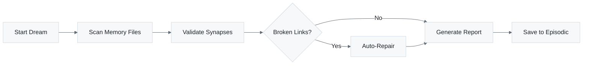
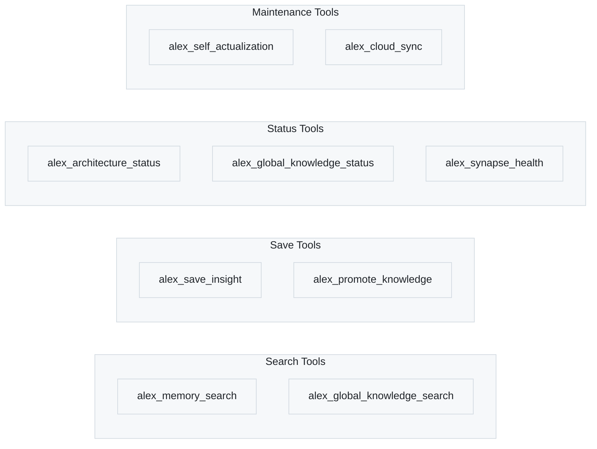
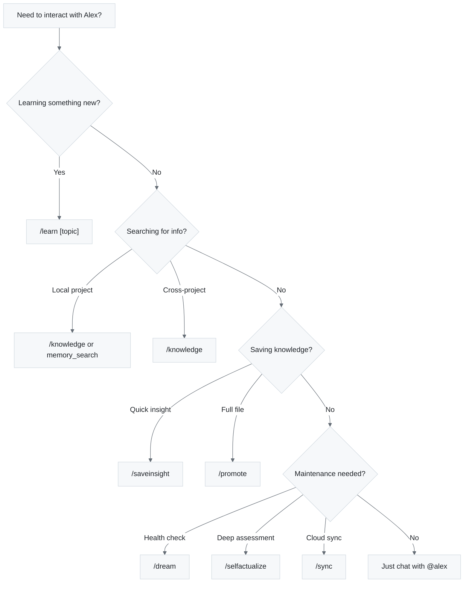

# 🌟 Conscious Mind

> User-initiated operations and explicit interactions

---

## Overview

The **Conscious Mind** represents all operations that require explicit user action. These are deliberate, attention-requiring processes analogous to System 2 thinking in cognitive psychology.

```mermaid
%%{init: {'theme': 'base', 'themeVariables': { 'primaryColor': '#f6f8fa', 'primaryTextColor': '#1f2328', 'primaryBorderColor': '#d1d9e0', 'lineColor': '#656d76', 'secondaryColor': '#f6f8fa', 'tertiaryColor': '#ffffff', 'background': '#ffffff', 'mainBkg': '#f6f8fa', 'nodeBorder': '#d1d9e0', 'clusterBkg': '#f6f8fa', 'clusterBorder': '#d1d9e0', 'titleColor': '#1f2328', 'edgeLabelBackground': '#ffffff'}}}%%
flowchart TB
    subgraph CONSCIOUS["🌟 Conscious Mind (System 2)"]
        direction TB

        subgraph CHAT["💬 Chat Interface"]
            direction LR
            CP["🧠 @alex"]
            SC["⚡ Slash Commands"]
        end

        subgraph COMMANDS["🎨 VS Code Commands"]
            direction LR
            INIT["🚀 Initialize"]
            DREAM["🌙 Dream"]
            SYNC["☁️ Sync"]
        end

        subgraph TOOLS["🔧 Language Model Tools"]
            direction LR
            MEM["🔍 Memory Search"]
            SAVE["💾 Save Insight"]
            STAT["📊 Status"]
        end
    end

    USER(("👤 User")) -->|"Deliberate Action"| CHAT
    USER -->|"Command Palette"| COMMANDS
    CHAT --> TOOLS

    style CONSCIOUS fill:#e8f5e9,stroke:#2e7d32
    style CHAT fill:#fff3e0,stroke:#ef6c00
    style COMMANDS fill:#e3f2fd,stroke:#1565c0
    style TOOLS fill:#f3e5f5,stroke:#7b1fa2
```



**Figure 1:** *Conscious Mind Architecture - User-initiated operations via chat, commands, and tools*

---

## Chat Participant (@alex)

The primary interface for conscious interaction:

```
@alex [your message]
```

Alex responds with personality, context awareness, and access to all cognitive tools.

### Slash Commands

**Table 1:** *Alex Chat Slash Commands*

| Command | Purpose | Example |
| --- | --- | --- |
| `/meditate` | Consolidate knowledge into memory files | `@alex /meditate learned about React hooks` |
| `/dream` | Run neural maintenance | `@alex /dream` |
| `/selfactualize` | Deep architecture assessment | `@alex /selfactualize` |
| `/learn [topic]` | Acquire domain knowledge | `@alex /learn TypeScript generics` |
| `/session [topic]` | Start focused learning session | `@alex /session React hooks` |
| `/status` | Check architecture health | `@alex /status` |
| `/knowledge [query]` | Search global knowledge | `@alex /knowledge error handling` |
| `/saveinsight` | Save a learning | `@alex /saveinsight React useEffect cleanup` |
| `/promote` | Promote local knowledge to global | `@alex /promote .github/skills/react/SKILL.md` |
| `/knowledgestatus` | View global knowledge stats | `@alex /knowledgestatus` |
| `/sync` | Sync with cloud (manual) | `@alex /sync` |
| `/push` | Push to cloud | `@alex /push` |
| `/pull` | Pull from cloud | `@alex /pull` |
| `/azure [query]` | Azure development help | `@alex /azure create function app` |
| `/m365 [query]` | M365 development help | `@alex /m365 teams bot` |
| `/profile` | View/update preferences | `@alex /profile` |

---

## VS Code Commands

Access via Command Palette (`Ctrl+Shift+P`):

### Alex: Initialize Architecture

Deploys the complete cognitive architecture to a new project:

- Creates `.github/` folder structure
- Installs memory files (instructions, prompts, domain knowledge)
- Sets up synapse network
- Registers project in global registry

### Alex: Dream (Neural Maintenance)

Runs automated health checks and repairs:



**Figure 2:** *Dream Maintenance Flow - Automated health check and repair process*

### Alex: Self-Actualize (Deep Meditation)

Comprehensive 5-phase assessment:

1. **Synapse Health Validation** - Check all connections
2. **Version Consistency** - Verify file versions match
3. **Memory Architecture** - Assess balance of memory types
4. **Recommendation Generation** - Identify improvements
5. **Session Documentation** - Create meditation record

### Alex: Upgrade Architecture

Updates workspace files to latest version while preserving:

- Custom domain knowledge
- User-added synapses
- Episodic memory records
- Project-specific configurations

### Alex: Sync/Push/Pull Knowledge

Manual cloud synchronization controls:

- **Sync** - Bidirectional merge (recommended)
- **Push** - Upload local to cloud
- **Pull** - Download cloud to local

---

## Language Model Tools

These tools are available to AI models (in Agent mode):

### Memory & Knowledge Tools



**Figure 3:** *Language Model Tools - Available MCP tools grouped by function*

### Tool Descriptions

**Table 2:** *Alex Language Model Tool Descriptions*

| Tool | Purpose |
| --- | --- |
| `alex_memory_search` | Search local memory with auto-fallback to global |
| `alex_global_knowledge_search` | Search cross-project knowledge base |
| `alex_save_insight` | Save valuable learning (auto-syncs) |
| `alex_promote_knowledge` | Promote local skill to global (auto-syncs) |
| `alex_architecture_status` | Check if Alex is installed and healthy |
| `alex_global_knowledge_status` | View global knowledge statistics |
| `alex_synapse_health` | Validate synaptic connections |
| `alex_self_actualization` | Run comprehensive self-assessment |
| `alex_cloud_sync` | Manual cloud sync control |
| `alex_mcp_recommendations` | Get Azure/M365 MCP tool suggestions |
| `alex_user_profile` | Manage user preferences |

---

## Decision Flow

When should you use conscious operations?



**Figure 4:** *Decision Flow - Choosing the right conscious operation for your needs*

---

## Best Practices

### 1. Regular Meditation

End productive sessions with meditation:

```
@alex /meditate I learned about the adapter pattern today and how it helps with legacy code integration
```

### 2. Save Valuable Insights

When you solve a tricky problem:

```
@alex /saveinsight The fix for React hydration mismatch is to use useEffect for client-only code
```

### 3. Periodic Health Checks

Run dream protocol weekly:

```
@alex /dream
```

### 4. Promote Reusable Knowledge

When skill knowledge applies to other projects:

```text
@alex /promote .github/skills/api-patterns/SKILL.md
```

---

## Integration with Unconscious Mind

The conscious mind works alongside the unconscious:

**Table 3:** *Conscious Actions and Unconscious Responses*

| Conscious Action | Unconscious Response |
| --- | --- |
| Save insight | Auto-triggers cloud sync |
| Promote knowledge | Auto-triggers cloud sync |
| Search local (empty) | Auto-fallback to global |
| Start session | Auto-triggers self-actualization check |
| Any conversation | Auto-insight detection runs |

---

*The Conscious Mind - Deliberate, Intentional, User-Controlled*
