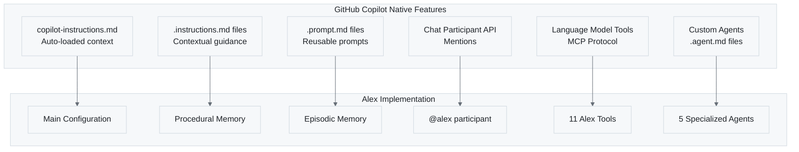
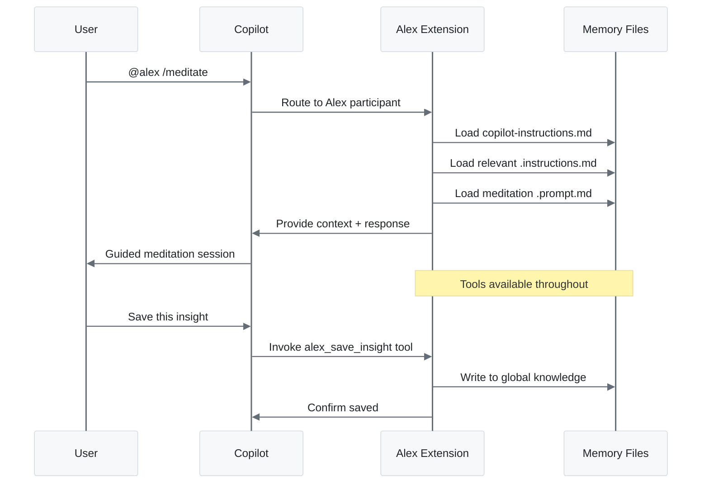

# 🤖 GitHub Copilot Native Integration

> How Alex leverages built-in Copilot features

---

## Overview

Alex isn't a replacement for GitHub Copilot—it **extends** Copilot using its native extension points. This document explains which Copilot features Alex uses and how.



**Figure 1:** *Copilot Native Features to Alex Implementation Mapping*

---

## Native Feature: copilot-instructions.md

### What Copilot Does

GitHub Copilot automatically reads `.github/copilot-instructions.md` and includes it as context for **every** interaction in that workspace.

### How Alex Uses It

Alex's main configuration lives here, giving Copilot:

- Alex's identity and personality
- Working memory rules (7-rule capacity)
- Core principles (empirical, grounded, ethical)
- References to all memory files
- Trigger phrases for protocols

```text
.github/
└── copilot-instructions.md  ← Copilot auto-loads this
```

**Result**: Every Copilot interaction in your project has Alex's cognitive framework available.

---

## Native Feature: .instructions.md Files

### What Copilot Does

Files ending in `.instructions.md` are treated as **contextual guidance**. Copilot considers them when working in related areas.

VS Code settings can configure when these apply:

```json
{
  "github.copilot.chat.codeGeneration.instructions": [
    { "file": ".github/instructions/code-review-guidelines.instructions.md" }
  ]
}
```

### How Alex Uses It

Alex stores **procedural memory** (how-to knowledge) as instruction files:

```text
.github/instructions/
├── alex-core.instructions.md           # Core protocols
├── bootstrap-learning.instructions.md  # Learning process
├── release-management.instructions.md  # Release workflow
├── code-review-guidelines.instructions.md  # Review checklist
└── ... (19 files total)
```

**Result**: When you ask Copilot to review code, it has access to Alex's review guidelines. When you discuss releases, it knows Alex's release process.

---

## Native Feature: .prompt.md Files

### What Copilot Does

Files ending in `.prompt.md` are **reusable prompts**. They appear in the prompt picker and can be invoked directly.

### How Alex Uses It

Alex stores **episodic memory** (complex workflows) as prompt files:

```text
.github/prompts/
├── unified-meditation-protocols.prompt.md  # Meditation workflow
├── domain-learning.prompt.md               # Learning sessions
├── performance-assessment.prompt.md        # Evaluation workflow
└── ... (7 files total)
```

**Invoking a prompt**:

1. Open Copilot Chat
2. Type `/` to see available prompts
3. Select a prompt file to run that workflow

**Result**: Complex multi-step workflows are saved and repeatable.

---

## Native Feature: Chat Participant API

### What Copilot Does

Extensions can register **chat participants** that respond to @mentions. Each participant can have:

- Custom slash commands
- Specialized behavior
- Access to VS Code APIs

### How Alex Uses It

Alex registers as `@alex` with 15 slash commands:

**Table 2:** *Alex Slash Commands*

| Command | Function |
|---------|----------|
| `/status` | Architecture health check |
| `/meditate` | Knowledge consolidation |
| `/dream` | Neural maintenance |
| `/selfactualize` | Deep self-assessment |
| `/learn` | Domain learning session |
| `/azure` | Azure development guidance |
| `/m365` | Microsoft 365 guidance |
| `/profile` | User preferences |
| `/knowledge` | Search global knowledge |
| `/saveinsight` | Save learning to global |
| `/promote` | Promote local to global |
| `/knowledgestatus` | Global knowledge stats |
| `/sync` | Cloud sync |
| `/push` | Push to cloud |
| `/pull` | Pull from cloud |

**Usage**:

```text
@alex /meditate I learned about dependency injection today
@alex /azure How do I deploy a Function App?
@alex /knowledge error handling patterns
```

**Result**: Alex becomes a conversational AI partner, not just context injection.

---

## Native Feature: Language Model Tools API

### What Copilot Does

Extensions can register **tools** that Copilot can invoke automatically in Agent mode. Tools:

- Have typed parameters
- Return structured results
- Can be referenced with `#tool_name`

### How Alex Uses It

Alex registers 11 tools via the MCP (Model Context Protocol):

**Table 3:** *Alex MCP Tools*

| Tool | Purpose |
|------|---------|
| `alex_architecture_status` | Check Alex version and config |
| `alex_synapse_health` | Validate synaptic connections |
| `alex_self_actualization` | Run comprehensive assessment |
| `alex_memory_search` | Search local memory files |
| `alex_mcp_recommendations` | Suggest Azure/M365 tools |
| `alex_global_knowledge_search` | Search cross-project knowledge |
| `alex_global_knowledge_status` | View knowledge base stats |
| `alex_save_insight` | Save learning to global |
| `alex_promote_knowledge` | Promote local to global |
| `alex_cloud_sync` | Sync with GitHub Gist |
| `alex_user_profile` | Manage user preferences |

**Automatic invocation**: In Agent mode, Copilot decides when to use tools:

```text
User: "Check if my Alex architecture is healthy"
Copilot: [Automatically invokes alex_synapse_health tool]
```

**Manual reference**: Use `#` to explicitly invoke:

```text
#alex_memory_search query="meditation protocols"
```

**Result**: Alex gains capabilities that work automatically when relevant.

---

## Native Feature: Custom Agents

### What Copilot Does

VS Code 1.106+ supports `.agent.md` files that define specialized agents with:

- Custom instructions
- Tool restrictions
- Handoff capabilities

### How Alex Uses It

Alex includes 5 specialized agents:

```text
.github/agents/
├── alex-cognitive.agent.md   # Main Alex agent
├── alex-meditate.agent.md    # Meditation specialist
├── alex-dream.agent.md       # Maintenance specialist
├── alex-azure.agent.md       # Azure development
└── alex-m365.agent.md        # M365 development
```

**Agent structure**:

```markdown
---
name: "Alex Meditate"
description: "Knowledge consolidation specialist"
tools:
  - alex_memory_search
  - alex_save_insight
---

# Meditation Agent

Specialized instructions for guiding meditation sessions...
```

**Result**: Task-specific agents with focused capabilities and clear handoffs.

---

## Feature Comparison

**Table 4:** *Native Copilot Features vs Alex Enhancement*

| Feature | Native Copilot | Alex Enhancement |
|---------|---------------|------------------|
| Context injection | `copilot-instructions.md` | Full cognitive framework |
| Procedural guidance | `.instructions.md` | 19 procedural memory files |
| Reusable workflows | `.prompt.md` | 7 episodic memory files |
| Chat interaction | Chat Participant API | @alex with 15 commands |
| Tool integration | Language Model Tools | 11 MCP tools |
| Specialized modes | Custom Agents | 5 specialized agents |

---

## How It All Works Together



**Figure 2:** *Alex Integration Sequence - How chat, memory files, and tools work together*

---

## Configuration

### Enabling Instruction Files

In `.vscode/settings.json`:

```json
{
  "github.copilot.chat.codeGeneration.instructions": [
    { "file": ".github/instructions/code-review-guidelines.instructions.md" },
    { "file": ".github/instructions/release-management.instructions.md" }
  ]
}
```

### Agent Mode for Tools

To enable automatic tool invocation:

1. Open Copilot Chat
2. Select "Agent" mode (not "Ask" or "Edit")
3. Tools are now available automatically

### Viewing Available Prompts

1. Open Copilot Chat
2. Type `/`
3. Browse `.prompt.md` files from your workspace

---

## Best Practices

### Leverage Native Features

- ✅ Use `.instructions.md` for process documentation
- ✅ Use `.prompt.md` for repeatable workflows
- ✅ Reference tools with `#` when specific action needed
- ✅ Use Agent mode for complex tasks

### Avoid Conflicts

- ❌ Don't duplicate instructions across files
- ❌ Don't override Copilot's core behavior
- ❌ Don't create circular tool dependencies

### Optimize Context

- Keep `copilot-instructions.md` focused
- Use synapses to connect related files
- Let Copilot load files as needed (don't force all)

---

## Troubleshooting

### Instructions Not Loading

1. Check file is in `.github/instructions/`
2. Verify `.instructions.md` extension
3. Check VS Code settings for explicit includes

### Prompts Not Appearing

1. Check file is in `.github/prompts/`
2. Verify `.prompt.md` extension
3. Restart VS Code if recently added

### Tools Not Available

1. Verify Alex extension is activated
2. Check you're in Agent mode
3. Look in Output > Alex Cognitive Architecture

### Agents Not Showing

1. Requires VS Code 1.106+
2. Check `.agent.md` extension
3. Verify YAML frontmatter is valid

---

*Copilot Integration - Building on Native Foundations*
