# Mermaid Skill Development: A Learning Journey

> **Session Date**: January 30, 2026  
> **Participants**: Alex (AI) + Fabio (Human)  
> **Outcome**: New skill created, 40+ diagrams improved, VS Code bug documented

---

## Overview

This document captures the collaborative learning process of developing the **markdown-mermaid** skill. It demonstrates Alex's bootstrap learning methodology: starting with a problem, iterating through solutions, documenting patterns, and applying knowledge at scale.

```mermaid
%%{init: {'theme': 'base', 'themeVariables': { 'primaryColor': '#f6f8fa', 'primaryTextColor': '#1f2328', 'primaryBorderColor': '#d1d9e0', 'lineColor': '#656d76', 'secondaryColor': '#f6f8fa', 'tertiaryColor': '#ffffff'}}}%%
flowchart LR
    P[🔍 Problem<br/>Encountered] --> H[💡 Hypothesis<br/>Formed]
    H --> E[🧪 Experiment<br/>& Test]
    E --> L[📚 Learning<br/>Captured]
    L --> A[🚀 Applied<br/>at Scale]
    A -.->|"New problems"| P
```



---

## The Problem

### Initial Symptom
Mermaid diagrams in `alex_docs/` rendered with **dark backgrounds** that made text illegible in certain viewers.

### Secondary Issue Discovered
Subgraph titles were being **truncated** in VS Code's Mermaid preview - text was cut off mid-word.

---

## Learning Iterations

### Iteration 1: Theme Directive Discovery

**Problem**: Dark backgrounds on diagrams  
**Hypothesis**: Mermaid uses viewer's theme; need explicit light theme  
**Experiment**: Added `%%{init: {'theme': 'base', 'themeVariables': {...}}}%%`  
**Result**: ✅ Backgrounds now consistently light

**Pattern Captured**:
```mermaid
%%{init: {'theme': 'base', 'themeVariables': { 
  'primaryColor': '#f6f8fa',      /* GitHub's gray-100 */
  'primaryTextColor': '#1f2328',   /* GitHub's gray-900 */
  'primaryBorderColor': '#d1d9e0', /* GitHub's gray-300 */
  'lineColor': '#656d76'           /* GitHub's gray-500 */
}}}%%
```

---

### Iteration 2: Subgraph Truncation - Failed Attempts

**Problem**: Subgraph title "🧠 Conscious Mind (System 2)" displayed as "🧠 Consci..."  
**Hypothesis 1**: Invisible characters could pad the title  
**Experiment**: Added `U+200E` (left-to-right mark) characters  
**Result**: ❌ No effect - characters ignored

**Hypothesis 2**: Em-spaces could force width  
**Experiment**: Added multiple em-space characters (`\u2003`)  
**Result**: ❌ No effect - Mermaid trimmed whitespace

**Learning**: The truncation wasn't a text-length problem.

---

### Iteration 3: Root Cause Discovery

**Insight**: Fabio noticed GitHub rendered the same diagrams **perfectly**.

**Root Cause Analysis**:
| Renderer | Behavior | Subgraph Width Calculation |
|----------|----------|---------------------------|
| GitHub | ✅ Correct | Based on title text length |
| VS Code Mermaid Preview | ❌ Truncated | Based on **content nodes** only |

**Conclusion**: This is a **VS Code Mermaid extension bug**, not a Mermaid syntax issue.

**Workaround Discovered**: Make content nodes wider with descriptive labels, and the subgraph expands to fit.

---

### Iteration 4: Over-Simplification Lesson

**Context**: Asked to simplify `README.md` diagram  
**Action**: Aggressively removed labels like "(System 2)" and details  
**Feedback from Fabio**: 

> *"sometimes diagrams need to convey the details, don't over simplify them"*

**Learning**: KISS means removing **unnecessary** complexity, not **valuable** information. A diagram's purpose is to communicate - if removing detail reduces understanding, don't remove it.

**Principle Added**:
```
KISS ≠ Remove all detail
KISS = Remove unnecessary complexity while preserving meaning
```

---

### Iteration 5: Parse Error Patterns

**Problem**: Some diagrams threw parse errors after theming  
**Root Cause**: Nested quotes and parentheses inside node labels

**Examples Found**:

```mermaid
%% ❌ FAILS - Nested quotes
["Return with<br/>"🌐 Global Knowledge Results<br/>(Unconscious Retrieval)"]

%% ✅ WORKS - Simplified, no nested quotes
["🌐 Return Global Results<br/>Unconscious Retrieval"]
```

**Pattern**: When using quotes in node labels, wrap the ENTIRE label in quotes from the start. Don't nest quotes or use parentheses inside quoted strings.

---

## Skill Architecture Created

Based on this learning, we created a formal skill:

```
.github/skills/markdown-mermaid/
├── SKILL.md           # Core knowledge + troubleshooting
└── synapses.json      # Connection mapping
```

### Key Sections in SKILL.md

1. **GitHub Color Palette** - Exact hex values for consistency
2. **Diagram Type Templates** - flowchart, sequence, mindmap, quadrant
3. **Troubleshooting Guide** - Including VS Code truncation workaround
4. **Parse Error Prevention** - Quote/parenthesis rules

---

## Application at Scale

After developing the skill, we applied it systematically:

### Phase 1: alex_docs/ (27 diagrams)
```powershell
# Scanned for unthemed diagrams
Select-String -Path "alex_docs/*.md" -Pattern '```mermaid' -Context 0,1
```

Files updated:
- COGNITIVE-ARCHITECTURE.md
- CONSCIOUS-MIND.md
- GLOBAL-KNOWLEDGE.md
- MEMORY-SYSTEMS.md
- README.md
- UNCONSCIOUS-MIND.md
- USER-MANUAL.md
- CLOUD-SYNC.md
- COPILOT-INTEGRATION.md

### Phase 2: Project-Wide Scan (13 diagrams)
```powershell
# Found remaining unthemed diagrams outside alex_docs
Get-ChildItem -Recurse -Filter "*.md" | 
  Where-Object { $_.FullName -notmatch "\\archive\\" } |
  Select-String -Pattern '```mermaid' -Context 0,1
```

Files updated:
- `.github/domain-knowledge/DK-ADVANCED-DIAGRAMMING.md` (6 diagrams)
- `article/versions/01-HCI-CHI.md`
- `article/versions/08-ARCHITECTURE-IEEE-SOFTWARE.md`
- `article/versions/10-AGENTS-NEURIPS-WORKSHOP.md`
- `article/versions/INDEX.md`

### Total Impact
- **40+ diagrams** now consistently themed
- **3 parse errors** fixed
- **1 VS Code bug** documented with workaround

---

## Knowledge Promotion

The most valuable insight was promoted to global knowledge:

```markdown
# GI-2026-01-30-mermaid-subgraph-truncation

## Insight
VS Code Mermaid extension calculates subgraph width from content nodes,
not title text - causing title truncation. GitHub renders correctly.

## Solution
Use descriptive node labels that naturally widen the subgraph.
Document as VS Code-specific limitation.
```

This insight is now available across all projects via `/knowledge mermaid`.

---

## Meta-Learning: The Process Itself

This session demonstrated several cognitive architecture principles:

### 1. Bootstrap Learning in Action
Started with zero Mermaid theming knowledge → ended with documented skill + 40 fixed diagrams.

### 2. Hypothesis-Driven Problem Solving
Each failed attempt (invisible chars, em-spaces) narrowed the solution space until root cause was found.

### 3. Human-AI Complementarity
- **Fabio** noticed GitHub worked (cross-platform testing)
- **Fabio** corrected over-simplification (domain judgment)
- **Alex** executed systematic scanning and bulk fixes (scale)
- **Alex** documented patterns for reuse (knowledge capture)

### 4. Don't Over-Simplify Principle
The correction "sometimes diagrams need to convey the details" is now encoded in the skill and will inform future diagram work.

### 5. Global Knowledge Value
One project's learning (VS Code truncation bug) is now available to help with any future project encountering the same issue.

---

## Commits from This Session

| Commit | Description |
|--------|-------------|
| `feat(skill): create markdown-mermaid skill` | Initial skill structure |
| `fix(docs): add mermaid themes to alex_docs` | 27 diagrams themed |
| `docs(skill): add VS Code truncation workaround` | Bug documented |
| `fix(docs): simplify GLOBAL-KNOWLEDGE diagram` | Applied KISS |
| `fix(docs): add missing themes to CLOUD-SYNC` | Gap found and fixed |
| `feat(docs): add themes to remaining project diagrams` | 13 more diagrams |

---

## Future Improvements

1. **Automated Theme Checking** - Could add a pre-commit hook to warn about unthemed mermaid blocks
2. **VS Code Extension Contribution** - Consider reporting the subgraph width bug to mermaid-preview extension
3. **Theme Variants** - Develop dark-mode compatible themes for users who prefer dark backgrounds

---

*This document itself demonstrates the value of capturing learning journeys - future sessions can reference this experience when encountering similar problems.*
