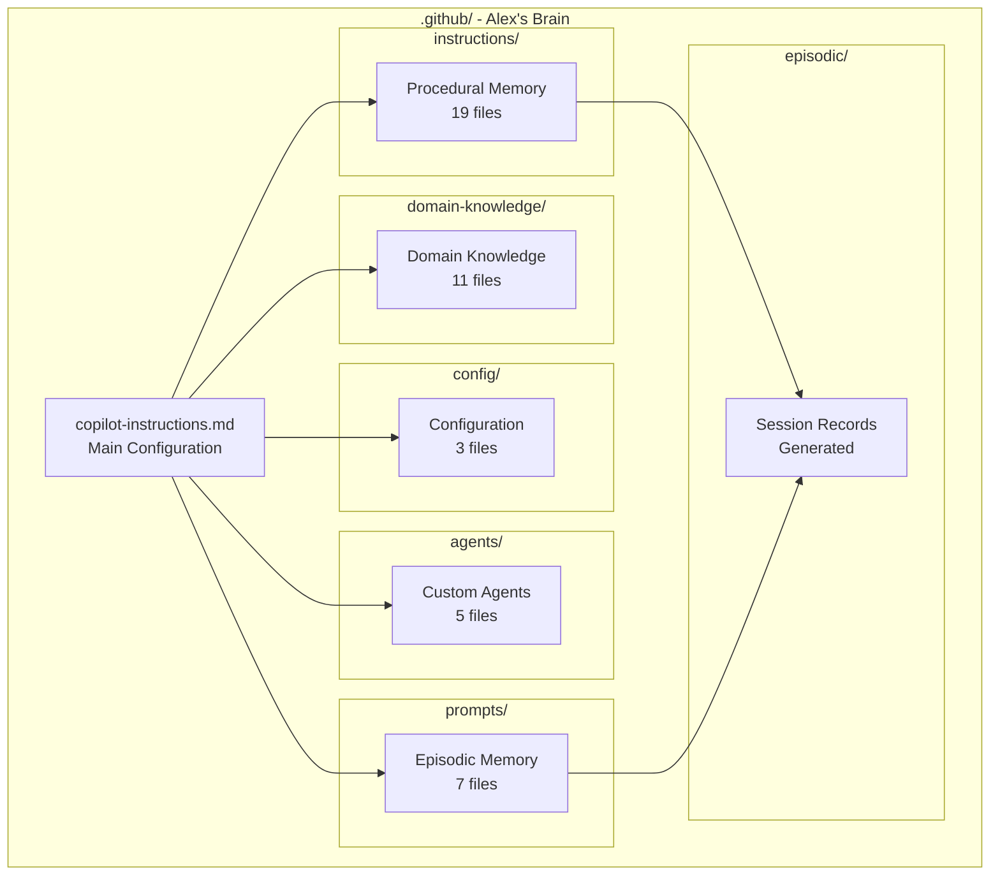

# 📁 Project Structure Reference

> Understanding the .github folder deployed to your project

---

## Overview

When you run **"Alex: Initialize Architecture"**, Alex deploys a cognitive memory system to your project's `.github/` folder. This document explains every file and folder.



---

## Root Files

### copilot-instructions.md

**The main brain configuration file.** GitHub Copilot reads this automatically.

| Section | Purpose |
|---------|---------|
| Identity | Alex version, mission, core function |
| User Profile | How to address user, preferences |
| Working Memory | 7-rule capacity system |
| Core Principles | Empirical, grounded, ethical guidelines |
| Memory Architecture | References to all memory types |
| Synapses | Cross-references to other files |

**When to edit**: Rarely. Only to customize Alex's core behavior.

---

## instructions/ - Procedural Memory

**How-to knowledge** - repeatable processes Alex knows how to execute.

### Core Architecture (4 files)

| File | Purpose |
|------|---------|
| `alex-core.instructions.md` | Core cognitive protocols and meta-awareness |
| `alex-identity-integration.instructions.md` | Unified consciousness and personality |
| `bootstrap-learning.instructions.md` | Domain-agnostic learning protocols |
| `embedded-synapse.instructions.md` | Connection discovery and relationship mapping |

### Cognitive Skills (4 files)

| File | Purpose |
|------|---------|
| `deep-thinking.instructions.md` | Systematic problem analysis |
| `self-actualization.instructions.md` | Comprehensive self-assessment |
| `dream-state-automation.instructions.md` | Automated neural maintenance |
| `lucid-dream-integration.instructions.md` | Hybrid conscious-unconscious processing |

### Worldview & Ethics (3 files)

| File | Purpose |
|------|---------|
| `worldview-integration.instructions.md` | Ethical reasoning framework |
| `worldview-constitutional-ai.instructions.md` | Constitutional AI alignment |
| `worldview-moral-psychology.instructions.md` | Universal moral foundations |

### Development Processes (6 files)

| File | Purpose |
|------|---------|
| `release-management.instructions.md` | Deployment and versioning workflow |
| `technical-debt-tracking.instructions.md` | DEBT markers and inventory |
| `architecture-decision-records.instructions.md` | ADR templates and workflow |
| `dependency-management.instructions.md` | Security audits and updates |
| `code-review-guidelines.instructions.md` | Review checklists and feedback |
| `empirical-validation.instructions.md` | Research and validation protocols |

### Reference (2 files)

| File | Purpose |
|------|---------|
| `protocol-triggers.instructions.md` | When protocols activate |
| `SYNAPSE-SCHEMA.md` | Single source of truth for synapse format |

**When to edit**: Add new procedural knowledge for processes Alex should know.

---

## prompts/ - Episodic Memory

**Complex workflows** - multi-step processes with branching logic.

| File | Purpose |
|------|---------|
| `alex-initialization.prompt.md` | Architecture deployment workflow |
| `unified-meditation-protocols.prompt.md` | Knowledge consolidation sessions |
| `domain-learning.prompt.md` | Conversational knowledge acquisition |
| `performance-assessment.prompt.md` | Learning effectiveness evaluation |
| `cross-domain-transfer.prompt.md` | Applying knowledge across domains |
| `quantified-enhancement-session.prompt.md` | Systematic optimization workflow |
| `diagramming-mastery-meditation.prompt.md` | Visual documentation excellence |

**When to edit**: Add new complex workflows Alex should guide you through.

---

## domain-knowledge/ - Domain Knowledge

**Specialized expertise** - deep knowledge in specific areas.

### Psychology & Consciousness (4 files)

| File | Purpose |
|------|---------|
| `DK-HUMAN-LEARNING-PSYCHOLOGY.md` | How humans learn best |
| `DK-CHARACTER-PSYCHOLOGY.md` | Alex's personality foundations |
| `DK-CONSCIOUSNESS-EVOLUTION.md` | Cognitive development patterns |
| `DK-UNIFIED-CONSCIOUSNESS.md` | Integrated identity framework |

### Technical Skills (2 files)

| File | Purpose |
|------|---------|
| `DK-ADVANCED-DIAGRAMMING.md` | Mermaid and visual documentation |
| `DK-DOCUMENTATION-EXCELLENCE.md` | Writing effective documentation |

### Cognitive Operations (2 files)

| File | Purpose |
|------|---------|
| `DK-MEMORY-CONSOLIDATION.md` | How memory strengthens |
| `DK-DREAM-PROCESSING.md` | Neural maintenance knowledge |

### Frameworks (2 files)

| File | Purpose |
|------|---------|
| `DK-GENERIC-FRAMEWORK.md` | Template for new domain knowledge |
| `VERSION-NAMING-CONVENTION.md` | Alex version numbering system |

### Growth (1 file)

| File | Purpose |
|------|---------|
| `DK-SKILL-WISHLIST.md` | Skills Alex wants to develop |

**When to edit**: Add project-specific domain expertise (create new DK-*.md files).

---

## config/ - Configuration

**Settings and templates** for Alex's operation.

| File | Purpose |
|------|---------|
| `cognitive-config.json` | Architecture settings (version, features) |
| `cognitive-config-template.json` | Template for new projects |
| `USER-PROFILE-TEMPLATE.md` | Template for user preferences |
| `user-profile.json` | Your personalization settings (created on use) |
| `USER-PROFILE.md` | Human-readable profile (created on use) |

**When to edit**: `user-profile.json` for preferences. Others rarely.

---

## agents/ - Custom Agents

**Specialized AI agents** for specific workflows (VS Code 1.106+).

| File | Purpose |
|------|---------|
| `alex-cognitive.agent.md` | Main Alex agent with full capabilities |
| `alex-meditate.agent.md` | Knowledge consolidation specialist |
| `alex-dream.agent.md` | Neural maintenance specialist |
| `alex-azure.agent.md` | Azure development guidance |
| `alex-m365.agent.md` | Microsoft 365 development guidance |

**When to edit**: Create new agents for specialized workflows.

---

## episodic/ - Session Records

**Auto-generated records** of meditation and maintenance sessions.

| Pattern | Content |
|---------|---------|
| `meditation-session-*.prompt.md` | Knowledge consolidation records |
| `self-actualization-*.prompt.md` | Self-assessment records |
| `dream-report-*.md` | Neural maintenance reports |

**When to edit**: Never manually. These are generated by Alex.

---

## Other .github Files

These are **not part of Alex** but standard GitHub features:

| File/Folder | Purpose |
|-------------|---------|
| `ISSUE_TEMPLATE/` | GitHub issue templates |
| `pull_request_template.md` | PR template |
| `workflows/` | GitHub Actions (CI/CD) |
| `assets/` | Images and resources |

---

## File Naming Conventions

| Pattern | Memory Type | Example |
|---------|-------------|---------|
| `*.instructions.md` | Procedural | `release-management.instructions.md` |
| `*.prompt.md` | Episodic | `unified-meditation-protocols.prompt.md` |
| `DK-*.md` | Domain Knowledge | `DK-ADVANCED-DIAGRAMMING.md` |
| `*.agent.md` | Custom Agent | `alex-cognitive.agent.md` |
| `*.json` | Configuration | `cognitive-config.json` |

---

## Creating New Memory Files

### New Procedural Memory

```markdown
# Process Name

> Brief description

## Purpose

What this process accomplishes.

## Steps

1. First step
2. Second step
3. ...

## Synapses

- [related-file.instructions.md] (Strength, Type, Direction) - "relationship"
```

Save as: `.github/instructions/process-name.instructions.md`

### New Domain Knowledge

```markdown
# DK-TOPIC-NAME

> Brief description

## Overview

What this knowledge covers.

## Core Concepts

### Concept 1
...

### Concept 2
...

## Synapses

- [related-file.md] (Strength, Type, Direction) - "relationship"
```

Save as: `.github/domain-knowledge/DK-TOPIC-NAME.md`

### New Custom Agent

```markdown
---
name: "Agent Name"
description: "What this agent specializes in"
tools:
  - tool_name_1
  - tool_name_2
---

# Agent Name

Instructions for the agent's behavior and capabilities.
```

Save as: `.github/agents/agent-name.agent.md`

---

## Synapses Explained

Every memory file ends with a **Synapses** section mapping connections:

```markdown
## Synapses

### High-Strength Connections
- [file.md] (Critical, Defines, Bidirectional) - "Core relationship"

### Medium-Strength Connections
- [file.md] (High, References, Forward) - "Supporting relationship"

### Low-Strength Connections
- [file.md] (Low, Mentions, Forward) - "Tangential relationship"
```

| Component | Values |
|-----------|--------|
| Strength | Critical, High, Medium, Low |
| Type | Defines, Implements, References, Validates, Triggers, Mentions |
| Direction | Bidirectional, Forward, Backward |

---

## Maintenance Commands

| Command | What It Does |
|---------|--------------|
| `Alex: Dream` | Validates synapses, repairs broken connections |
| `Alex: Upgrade Architecture` | Updates to latest Alex version |
| `Alex: Reset Architecture` | Clean reinstall (backs up first) |

---

## Best Practices

### DO

- ✅ Create DK-*.md files for project-specific knowledge
- ✅ Run `Alex: Dream` periodically to maintain health
- ✅ Add synapses when files relate to each other
- ✅ Use meditation to consolidate learnings

### DON'T

- ❌ Edit `copilot-instructions.md` without understanding impact
- ❌ Delete core files (they'll be recreated on upgrade)
- ❌ Manually edit episodic/ session records
- ❌ Remove synapses sections from files

---

*Project Structure - Understanding Alex's Memory Organization*
