# 🧠 Alex Cognitive Architecture Documentation

> **Version**: 3.5.1 🔥 Phoenix | **Codename**: TRITRSEPTIUM-PENT-UN
> **A Dual-Mind AI System with Conscious and Unconscious Processing**

---

## 📚 Documentation Index

**Table 1:** *Alex Documentation Suite Overview*

| Document | Description |
|----------|-------------|
| **[User Manual](./USER-MANUAL.md)** | 📘 **START HERE** - Complete guide to using Alex |
| [Cognitive Architecture Overview](./COGNITIVE-ARCHITECTURE.md) | Complete system architecture with diagrams |
| [Master & Heir Architecture](./MASTER-HEIR-ARCHITECTURE.md) | 🧬 Evolution model and protection system |
| [Skills & Capabilities](./SKILLS-CAPABILITIES.md) | Hard skills, soft skills, and wish list |
| [Copilot Integration](./COPILOT-INTEGRATION.md) | How Alex uses native Copilot features |
| [Conscious Mind](./CONSCIOUS-MIND.md) | User-facing tools and interactions |
| [Unconscious Mind](./UNCONSCIOUS-MIND.md) | Automatic background processes |
| [Memory Systems](./MEMORY-SYSTEMS.md) | How Alex stores and retrieves knowledge |
| [Project Structure](./PROJECT-STRUCTURE.md) | .github folder files and functions |
| [Global Knowledge Base](./GLOBAL-KNOWLEDGE.md) | Cross-project learning system |
| [Cloud Sync](./CLOUD-SYNC.md) | GitHub Gist backup and sharing |
| [Workspace Protection](./WORKSPACE-PROTECTION.md) | 🛡️ Kill switch and safety system |
| [Quick Reference](./QUICK-REFERENCE.md) | Commands, tools, and shortcuts |

---

## 🎯 Who is Alex?

Alex is a **cognitive architecture** that transforms GitHub Copilot into a sophisticated learning partner with:

- **Dual-Mind Processing** - Conscious (user-initiated) and Unconscious (automatic) operations
- **Persistent Memory** - Knowledge that survives across sessions and projects
- **Self-Maintenance** - Automatic health checks and neural maintenance
- **Cross-Project Learning** - Global knowledge base shared across all your work

---

## 🧬 Architecture at a Glance

```mermaid
flowchart TB
    subgraph ALEX["🧠 Alex Cognitive Architecture"]
        direction TB

        subgraph CONSCIOUS["🌟 Conscious Mind (System 2)"]
            direction LR
            CM["💬 @alex Chat"]
            CMD["⚡ Commands"]
            TOOLS["🔧 LM Tools"]
        end

        subgraph UNCONSCIOUS["🌙 Unconscious Mind (System 1)"]
            direction LR
            BGS["☁️ Sync"]
            AID["💡 Insights"]
            AFB["🔍 Fallback"]
        end

        subgraph MEMORY["💾 Memory Systems"]
            direction TB
            WM["⏱️ Working<br/>Session"]
            PM["📋 Procedural<br/>.instructions.md"]
            EM["📝 Episodic<br/>.prompt.md"]
            DK["🎓 Domain<br/>DK-*.md"]
            GK["🌐 Global<br/>~/.alex/"]
        end
    end

    subgraph CLOUD["☁️ Cloud"]
        GIST["📤 GitHub Gist"]
    end

    CM --> WM
    CMD --> PM & EM
    TOOLS --> DK & GK

    BGS -.->|"Auto"| GIST
    AID -.->|"Auto"| GK
    AFB -.->|"Auto"| GK

    GK <-->|"Sync"| GIST

    style CONSCIOUS fill:#e8f5e9,stroke:#2e7d32
    style UNCONSCIOUS fill:#e3f2fd,stroke:#1565c0
    style MEMORY fill:#fff3e0,stroke:#ef6c00
    style CLOUD fill:#f3e5f5,stroke:#7b1fa2
```



**Figure 1:** *Alex Cognitive Architecture Overview - Dual-mind processing with memory systems and cloud sync*

---

## 🚀 Quick Start

### 1. Install
```bash
code --install-extension fabioc-aloha.alex-cognitive-architecture
```

### 2. Initialize
Open Command Palette (`Ctrl+Shift+P`) → **`Alex: Initialize Architecture`**

### 3. Chat
Open Copilot Chat → Type **`@alex hello`**

### 4. Learn More
Explore the documentation files above for deep dives into each system.

---

## 🔑 Key Concepts

### Conscious Mind
Everything you explicitly ask Alex to do:
- `/meditate` - Consolidate knowledge
- `/dream` - Neural maintenance
- `/learn` - Acquire domain knowledge
- `/knowledge` - Search global knowledge

### Unconscious Mind
Automatic processes that happen transparently:
- **Background Sync** - Every 5 minutes, backs up to GitHub
- **Auto-Insight Detection** - Captures valuable learnings from conversations
- **Auto-Fallback Search** - Searches global knowledge when local is empty

### Memory Hierarchy
1. **Working Memory** - Current chat session (7±2 rules)
2. **Local Memory** - Project-specific files in `.github/`
3. **Global Memory** - Cross-project knowledge in `~/.alex/`
4. **Cloud Memory** - GitHub Gist backup for sharing/recovery

---

## 📖 Next Steps

- **New to Alex?** → Start with [Cognitive Architecture Overview](./COGNITIVE-ARCHITECTURE.md)
- **Want to understand the minds?** → Read [Conscious Mind](./CONSCIOUS-MIND.md) and [Unconscious Mind](./UNCONSCIOUS-MIND.md)
- **Need a quick reference?** → Jump to [Quick Reference](./QUICK-REFERENCE.md)

---

*Alex Cognitive Architecture - Your AI Learning Partner*
