# 🧠 Alex Cognitive Architecture Documentation

> **A Dual-Mind AI System with Conscious and Unconscious Processing**

---

## 📚 Documentation Index

### 🚀 Getting Started

| Document                                                     | Description                                          |
| ------------------------------------------------------------ | ---------------------------------------------------- |
| **[User Manual](./guides/USER-MANUAL.md)**                   | 📘 **START HERE** — Complete guide to using Alex      |
| [Quick Reference](./guides/QUICK-REFERENCE.md)               | Commands, tools, and shortcuts cheat sheet           |
| [Environment Setup](./guides/ENVIRONMENT-SETUP.md)           | Prerequisites and workspace configuration            |
| [Initialization Process](./guides/INITIALIZATION-PROCESS.md) | What happens when you run `Alex: Initialize`         |
| [Use Cases Guide](./guides/USE-CASES.md)                     | Deep dive into every domain Alex supports            |
| [Project Templates](../.github/PROJECT-TYPE-TEMPLATES.md)    | Folder structures for development, writing, research |

### 🧠 Architecture

| Document                                                             | Description                                                              |
| -------------------------------------------------------------------- | ------------------------------------------------------------------------ |
| [Cognitive Architecture](./architecture/COGNITIVE-ARCHITECTURE.md)   | Complete system architecture with diagrams                               |
| [Conscious Mind](./architecture/CONSCIOUS-MIND.md)                   | User-facing tools and interactions                                       |
| [Unconscious Mind](./architecture/UNCONSCIOUS-MIND.md)               | Automatic background processes                                           |
| [Memory Systems](./architecture/MEMORY-SYSTEMS.md)                   | How Alex stores and retrieves knowledge                                  |
| [Neuroanatomical Mapping](./architecture/NEUROANATOMICAL-MAPPING.md) | Brain-analog mapping for every component                                 |
| [Agent Catalog](./architecture/AGENT-CATALOG.md)                     | The agent ecosystem (Researcher, Builder, Validator, Documentarian, ...) |
| [Trifecta Catalog](./architecture/TRIFECTA-CATALOG.md)               | Skill + Instruction + Prompt completeness tracking                       |
| [Alex Identity](./architecture/ALEX-IDENTITY.md)                     | Unified consciousness integration                                        |

### 🎓 Skills & Knowledge

| Document                                                 | Description                             |
| -------------------------------------------------------- | --------------------------------------- |
| [Skills & Capabilities](./skills/SKILLS-CAPABILITIES.md) | Hard skills, soft skills, and wish list |
| [Skills Catalog](./skills/SKILLS-CATALOG.md)             | Full skill inventory with categories    |
| [Skill Architecture](./skills/SKILL-ARCHITECTURE.md)     | How skills are structured internally    |
| [Global Knowledge](./features/GLOBAL-KNOWLEDGE.md)       | Cross-project learning system           |

### 🧬 Platform & Heirs

| Document                                                               | Description                               |
| ---------------------------------------------------------------------- | ----------------------------------------- |
| [Master & Heir Architecture](./platforms/MASTER-HEIR-ARCHITECTURE.md)  | Evolution model and protection system     |
| [VS Code Heir](./platforms/VSCODE-HEIR.md)                             | Primary VS Code extension heir            |
| [Project Structure](./guides/PROJECT-STRUCTURE.md)                     | `.github/` folder files and functions     |
| [Enterprise Settings](./guides/ENTERPRISE-SETTINGS.md)                 | Configuration for team and enterprise use |
| [Microsoft Graph Integration](./guides/MICROSOFT-GRAPH-INTEGRATION.md) | Calendar, Mail, Presence, People API      |

### 🛡️ Operations

| Document                                                     | Description                   |
| ------------------------------------------------------------ | ----------------------------- |
| [Workspace Protection](./operations/WORKSPACE-PROTECTION.md) | Kill switch and safety system |

### 📊 Research & Strategy

| Document                                                                                 | Description                               |
| ---------------------------------------------------------------------------------------- | ----------------------------------------- |
| [AI-Assisted Development Methodology](./research/AI-ASSISTED-DEVELOPMENT-METHODOLOGY.md) | The Fabio+Alex model for AI-assisted work |

---

## 🎯 Who is Alex?

Alex is a **cognitive architecture** that transforms GitHub Copilot into a sophisticated learning partner with:

- **Dual-Mind Processing** - Conscious (user-initiated) and Unconscious (automatic) operations
- **Persistent Memory** - Knowledge that survives across sessions and projects
- **Self-Maintenance** - Automatic health checks and neural maintenance
- **Cross-Project Learning** - Global knowledge base shared across all your work
- **Domain Flexibility** - Works for development, writing, research, management, and more

---

## 🧬 Architecture at a Glance

```mermaid
%%{init: {'theme': 'base', 'themeVariables': { 'primaryColor': '#f6f8fa', 'primaryTextColor': '#1f2328', 'primaryBorderColor': '#d1d9e0', 'lineColor': '#656d76', 'secondaryColor': '#f6f8fa', 'tertiaryColor': '#ffffff', 'background': '#ffffff', 'mainBkg': '#f6f8fa', 'nodeBorder': '#d1d9e0', 'clusterBkg': '#f6f8fa', 'clusterBorder': '#d1d9e0', 'titleColor': '#1f2328', 'edgeLabelBackground': '#ffffff'}}}%%
flowchart TB
    subgraph ALEX["🧠 Alex Cognitive Architecture"]
        direction TB

        subgraph CONSCIOUS["🌟 Conscious Mind"]
            direction LR
            CM["💬 @alex Chat"]
            CMD["⚡ Commands"]
            TOOLS["🔧 LM Tools"]
        end

        subgraph UNCONSCIOUS["🌙 Unconscious Mind"]
            direction LR
            BGS["☁️ Sync"]
            AID["💡 Insights"]
            AFB["🔍 Fallback"]
        end

        subgraph MEMORY["💾 Memory Systems"]
            direction TB
            WM["⏱️ Working Memory"]
            PM["📋 Procedural"]
            EM["📝 Episodic"]
            SK["🎓 Skills"]
            GK["🌐 Global"]
        end
    end

    subgraph CLOUD["☁️ Cloud"]
        GIST["📤 GitHub Gist"]
    end

    CM --> WM
    CMD --> PM & EM
    TOOLS --> SK & GK

    BGS -.->|"Auto"| GIST
    AID -.->|"Auto"| GK
    AFB -.->|"Auto"| GK

    GK <-->|"Sync"| GIST

    style CONSCIOUS fill:#e8f5e9,stroke:#2e7d32
    style UNCONSCIOUS fill:#e3f2fd,stroke:#1565c0
    style MEMORY fill:#fff3e0,stroke:#ef6c00
    style CLOUD fill:#f3e5f5,stroke:#7b1fa2
```



**Figure 1:** *Alex Cognitive Architecture Overview - Dual-mind processing with memory systems and cloud sync*

---

## 🚀 Quick Start

### 1. Install
```bash
code --install-extension fabioc-aloha.alex-cognitive-architecture
```

### 2. Initialize
Open Command Palette (`Ctrl+Shift+P`) → **`Alex: Initialize Architecture`**

### 3. Chat
Open Copilot Chat → Type **`@alex hello`**

### 4. Learn More
Explore the documentation files above for deep dives into each system.

---

## 🔑 Key Concepts

### Conscious Mind
Everything you explicitly ask Alex to do:
- `/meditate` - Consolidate knowledge
- `/dream` - Neural maintenance
- `/learn` - Acquire domain knowledge
- `/knowledge` - Search global knowledge

### Unconscious Mind
Automatic processes that happen transparently:
- **Background Sync** - Every 5 minutes, backs up to GitHub
- **Auto-Insight Detection** - Captures valuable learnings from conversations
- **Auto-Fallback Search** - Searches global knowledge when local is empty

### Memory Hierarchy
1. **Working Memory** - Current chat session (7±2 rules)
2. **Local Memory** - Project-specific files in `.github/`
3. **Global Memory** - Cross-project knowledge in `~/.alex/`
4. **Cloud Memory** - GitHub Gist backup for sharing/recovery

---

## 📖 Next Steps

- **New to Alex?** → Start with [Cognitive Architecture Overview](./architecture/COGNITIVE-ARCHITECTURE.md)
- **Want to understand the minds?** → Read [Conscious Mind](./architecture/CONSCIOUS-MIND.md) and [Unconscious Mind](./architecture/UNCONSCIOUS-MIND.md)
- **Need a quick reference?** → Jump to [Quick Reference](./guides/QUICK-REFERENCE.md)

---

*Alex Cognitive Architecture - Your AI Learning Partner*
