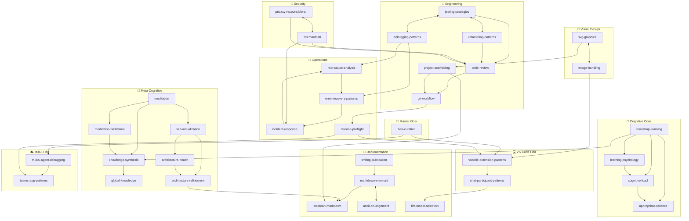

# Alex Skills Catalog

> Complete inventory of Alex's superpowers — what each skill does, who inherits it, and when to use it.

---

## Skill Count: 36

| Inheritance | Count |
|-------------|-------|
| Inheritable | 27 |
| Master-Only | 5 |
| Heir: VS Code | 2 |
| Heir: M365 | 2 |

---

## By Category

### 🧠 Cognitive & Learning

| Skill | Inheritance | Purpose |
|-------|-------------|---------|
| [cognitive-load](../.github/skills/cognitive-load/) | inheritable | Manage information overload — chunking, scaffolding |
| [learning-psychology](../.github/skills/learning-psychology/) | inheritable | Partnership teaching, spaced retrieval |
| [appropriate-reliance](../.github/skills/appropriate-reliance/) | inheritable | Build trust through calibrated confidence |
| [bootstrap-learning](../.github/skills/bootstrap-learning/) | inheritable | Domain-agnostic knowledge acquisition |
| [meditation-facilitation](../.github/skills/meditation-facilitation/) | master-only | Guide conscious knowledge consolidation |
| [meditation](../.github/skills/meditation/) | master-only | Core meditation protocols |
| [knowledge-synthesis](../.github/skills/knowledge-synthesis/) | master-only | Cross-project pattern extraction |
| [global-knowledge](../.github/skills/global-knowledge/) | master-only | Global knowledge base management |

### 🔧 Engineering Fundamentals

| Skill | Inheritance | Purpose |
|-------|-------------|---------|
| [testing-strategies](../.github/skills/testing-strategies/) | inheritable | Testing pyramid, AAA, coverage philosophy |
| [refactoring-patterns](../.github/skills/refactoring-patterns/) | inheritable | Safe code transformations |
| [debugging-patterns](../.github/skills/debugging-patterns/) | inheritable | Systematic bug hunting |
| [code-review](../.github/skills/code-review/) | inheritable | 3-pass review, feedback patterns |
| [git-workflow](../.github/skills/git-workflow/) | inheritable | Commits, recovery, branching |
| [project-scaffolding](../.github/skills/project-scaffolding/) | inheritable | Complete project setup templates |
| [vscode-environment](../.github/skills/vscode-environment/) | inheritable | Workspace settings, extensions, launch configs |

### 🚨 Operations & Reliability

| Skill | Inheritance | Purpose |
|-------|-------------|---------|
| [error-recovery-patterns](../.github/skills/error-recovery-patterns/) | inheritable | Retry, fallback, circuit breaker |
| [root-cause-analysis](../.github/skills/root-cause-analysis/) | inheritable | 5 Whys, fishbone, post-mortem |
| [incident-response](../.github/skills/incident-response/) | inheritable | Crisis handling, severity levels |
| [release-preflight](../.github/skills/release-preflight/) | inheritable | Pre-release checks, version sync |

### 🔐 Security & Privacy

| Skill | Inheritance | Purpose |
|-------|-------------|---------|
| [privacy-responsible-ai](../.github/skills/privacy-responsible-ai/) | inheritable | Privacy by design, RAI principles |
| [microsoft-sfi](../.github/skills/microsoft-sfi/) | inheritable | Secure Future Initiative practices |

### 📝 Documentation & Communication

| Skill | Inheritance | Purpose |
|-------|-------------|---------|
| [writing-publication](../.github/skills/writing-publication/) | inheritable | Academic writing, publication strategy |
| [markdown-mermaid](../.github/skills/markdown-mermaid/) | inheritable | Diagrams and visualization |
| [lint-clean-markdown](../.github/skills/lint-clean-markdown/) | inheritable | Clean, consistent markdown |
| [ascii-art-alignment](../.github/skills/ascii-art-alignment/) | inheritable | Text-based diagrams |

### 🎨 Visual Design

| Skill | Inheritance | Purpose |
|-------|-------------|---------|
| [svg-graphics](../.github/skills/svg-graphics/) | inheritable | SVG banners, logos, icons, visual identity |
| [image-handling](../.github/skills/image-handling/) | inheritable | Format conversion, optimization, sizing |

### 🏗️ Architecture & Design

| Skill | Inheritance | Purpose |
|-------|-------------|---------|
| [architecture-refinement](../.github/skills/architecture-refinement/) | inheritable | Architecture evolution decisions |
| [architecture-health](../.github/skills/architecture-health/) | inheritable | Synapse validation, health checks |
| [llm-model-selection](../.github/skills/llm-model-selection/) | inheritable | Model choice for cost/capability |
| [self-actualization](../.github/skills/self-actualization/) | master-only | Deep self-assessment protocols |
| [heir-curation](../.github/skills/heir-curation/) | master-only | Curate heir deployments |

### 💻 Platform-Specific

#### VS Code Extension

| Skill | Inheritance | Purpose |
|-------|-------------|---------|
| [vscode-extension-patterns](../.github/skills/vscode-extension-patterns/) | heir:vscode | Extension API patterns |
| [chat-participant-patterns](../.github/skills/chat-participant-patterns/) | heir:vscode | Chat API, streaming, tools |

#### M365 / Teams

| Skill | Inheritance | Purpose |
|-------|-------------|---------|
| [m365-agent-debugging](../.github/skills/m365-agent-debugging/) | heir:m365 | Declarative agent debugging |
| [teams-app-patterns](../.github/skills/teams-app-patterns/) | heir:m365 | Bots, cards, tabs, manifests |

---

## Staleness-Prone Skills

These skills depend on rapidly evolving technology or regulations:

| Skill | Why Stale | Refresh Triggers |
|-------|-----------|------------------|
| llm-model-selection | New models frequently | Model announcements, pricing |
| vscode-extension-patterns | Monthly VS Code releases | API changes, deprecations |
| chat-participant-patterns | Proposed APIs evolving | API graduation, new features |
| m365-agent-debugging | Schema versions change | New schema, capabilities |
| teams-app-patterns | Platform evolution | Toolkit updates, manifest versions |
| git-workflow | GitHub features evolve | CLI updates, Actions changes |
| privacy-responsible-ai | Regulations change | New laws, AI regulations |
| microsoft-sfi | Security landscape shifts | New vulnerabilities, practices |

---

## Inheritance Model

```text
Master Alex
    │
    ├── inheritable skills ──► All Heirs
    │
    ├── master-only skills ──► Master Only
    │
    ├── heir:vscode ──► VS Code Extension Only
    │
    └── heir:m365 ──► M365 Agent Only
```

---

## Skill Network Diagram



### Connection Types

| Type | Meaning | Example |
| ---- | ------- | ------- |
| `enables` | A makes B possible | testing-strategies → refactoring-patterns |
| `applies` | A uses principles from B | bootstrap-learning → learning-psychology |
| `extends` | A goes deeper than B | root-cause-analysis → debugging-patterns |
| `complements` | A and B work together | privacy-responsible-ai ↔ microsoft-sfi |
| `triggers` | A causes B to activate | incident-response → root-cause-analysis |
| `curates` | A manages B | heir-curation → vscode-extension-patterns |

---

## Adding New Skills

1. Create folder: `.github/skills/[skill-name]/`
2. Add `SKILL.md` with:
   - Frontmatter `applyTo` patterns
   - Staleness warning (if tech-dependent)
   - Core content
   - Synapses reference
3. Add `synapses.json` with:
   - skill name
   - inheritance value
   - connections to other skills
   - trigger keywords
4. Update this catalog
5. Update `copilot-instructions.md` skills list

---

## Skill Quality Checklist

- [ ] Purpose is clear in first line
- [ ] Content is terse (for AI, not humans)
- [ ] Examples are concrete
- [ ] Anti-patterns noted
- [ ] Connections mapped in synapses.json
- [ ] Staleness warning if needed
- [ ] Triggers defined for activation

---

*Last updated: January 2026*
