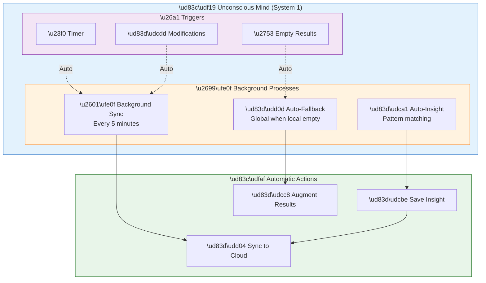
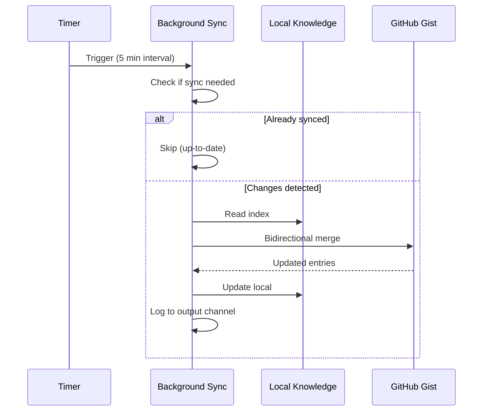
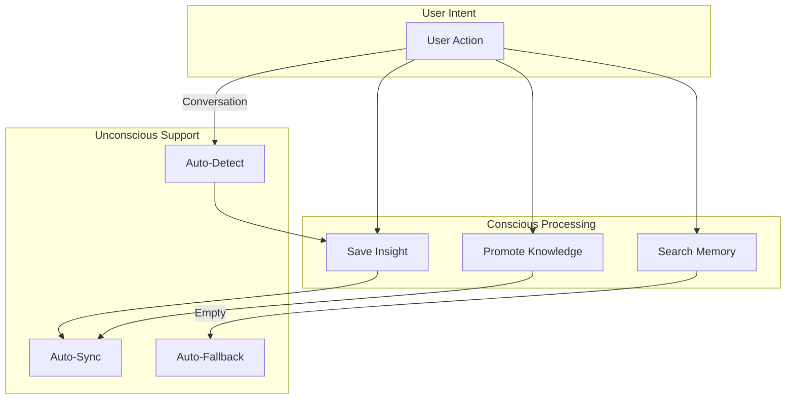

# 🌙 Unconscious Mind

> Automatic processes that run transparently without user intervention

---

## Overview

The **Unconscious Mind** represents Alex's automatic, always-running processes. These are fast, effortless operations analogous to System 1 thinking in cognitive psychology. They handle routine tasks without requiring user attention.



**Figure 1:** *Unconscious Mind Architecture - Automatic background processes and their triggers*

---

## Background Cloud Sync

### What It Does

Automatically backs up your global knowledge to GitHub Gist without any user action.

### When It Runs

**Table 1:** *Background Sync Triggers*

| Trigger | Timing |
| --- | --- |
| Startup | 10 seconds after VS Code activates |
| Periodic | Every 5 minutes while VS Code is open |
| Post-modification | 2 seconds after saving insight or promoting knowledge |

### How It Works



**Figure 2:** *Background Sync Sequence - Timer-triggered synchronization with change detection*

### Logging

All unconscious activity is logged to the "Alex Unconscious Mind" output channel:

```
[2026-01-24T10:30:00.000Z] Background sync enabled - Alex unconscious mind active
[2026-01-24T10:30:10.000Z] Running startup sync...
[2026-01-24T10:30:12.000Z] Sync complete: 3 pushed, 0 pulled
[2026-01-24T10:35:00.000Z] Already up-to-date, no sync needed
```

To view: **View → Output → Select "Alex Unconscious Mind"**

---

## Auto-Insight Detection

### What It Does

Monitors conversations for valuable learnings and automatically saves them to the global knowledge base.

### Pattern Detection

The system looks for phrases indicating valuable insights:

**Learning Indicators:**

- "I learned...", "I discovered...", "I realized..."
- "The solution is...", "The fix is...", "What fixed it..."
- "Turns out...", "The trick is...", "The key is..."

**Domain Keywords:**

- pattern, anti-pattern, best practice
- gotcha, pitfall, workaround
- debugging, performance, security
- architecture, optimization

### Confidence Scoring

```mermaid
graph LR
    subgraph "Input Analysis"
        TEXT[Conversation Text]
    end

    subgraph "Pattern Matching"
        P1[Learning Phrases<br/>+0.3 per match]
        P2[Domain Keywords<br/>+0.1 per keyword]
    end

    subgraph "Decision"
        SCORE[Confidence Score]
        THRESH{Score ≥ 0.5?}
    end

    subgraph "Action"
        SAVE[Auto-Save Insight]
        SKIP[Skip]
    end

    TEXT --> P1
    TEXT --> P2
    P1 --> SCORE
    P2 --> SCORE
    SCORE --> THRESH
    THRESH -->|Yes| SAVE
    THRESH -->|No| SKIP
```



**Figure 3:** *Auto-Insight Confidence Scoring - Pattern matching determines save threshold*

### What Gets Saved

When auto-insight detection triggers:

1. **Title** - Extracted from first sentence
2. **Content** - The valuable learning
3. **Category** - Inferred from keywords (debugging, performance, etc.)
4. **Tags** - Detected domain keywords
5. **Source** - Current project name

### Example

User says:

> "I finally figured it out! The React useEffect cleanup function runs before the next effect, not on unmount. This fixed my subscription memory leak."

Auto-detection:

- **Detected phrase**: "I finally figured it out", "This fixed"
- **Keywords**: (none explicit, but context suggests debugging)
- **Confidence**: 0.6 (above threshold)
- **Action**: Auto-save to global knowledge

---

## Auto-Fallback Search

### What It Does

When you search local memory and find nothing, automatically searches the global knowledge base.

### How It Works

```mermaid
flowchart TD
    START[Memory Search Request]

    START --> LOCAL[Search Local Memory<br/>.github/ files]
    LOCAL --> CHECK{Results found?}

    CHECK -->|Yes| RETURN[Return Local Results]
    CHECK -->|No| GLOBAL[Search Global Knowledge<br/>~/.alex/ files]

    GLOBAL --> GCHECK{Global results?}
    GCHECK -->|Yes| AUGMENT[Return with<br/>"🌐 Global Knowledge Results<br/>(Unconscious Retrieval)"]
    GCHECK -->|No| EMPTY[Return empty message]
```

**Figure 4:** *Auto-Fallback Search Flow - Seamless transition from local to global knowledge*

### User Experience

The user simply uses `alex_memory_search` or `/knowledge` and gets unified results:

**Before (local only):**

```
No matches found for "error handling" in local memory.
```

**After (with auto-fallback):**

```
## 🌐 Global Knowledge Results (Unconscious Retrieval)

*Local search found nothing. Automatically searched cross-project knowledge:*

### 💡 Error Handling Best Practices
- **Type**: insight | **Category**: error-handling
- **Tags**: try-catch, async, typescript
- **Summary**: Always wrap async operations in try-catch...
```

---

## Configuration

The unconscious mind has sensible defaults but can be observed:

**Table 2:** *Unconscious Mind Configuration Defaults*

| Setting | Default | Description |
| --- | --- | --- |
| Background sync interval | 5 minutes | Time between automatic syncs |
| Minimum sync interval | 1 minute | Prevents sync spam |
| Startup delay | 10 seconds | Wait before first sync |
| Post-modification delay | 2 seconds | Wait after changes |
| Insight confidence threshold | 0.5 | Minimum score to auto-save |
| Conversation buffer size | 5 messages | Recent messages analyzed |

---

## Observability

### Output Channel

View unconscious activity:

1. Open **View → Output**
2. Select **"Alex Unconscious Mind"** from dropdown

### Status Indicators

The `alex_global_knowledge_status` tool shows sync status:

```
| Cloud Sync | ✅ up-to-date |
```

Status values:

- ✅ `up-to-date` - Fully synced
- 📤 `needs-push` - Local changes not yet uploaded
- 📥 `needs-pull` - Remote changes available
- ⚪ `Not configured` - GitHub auth not set up
- ❌ `error` - Sync failed

---

## Benefits of Unconscious Processing

### 1. Zero Cognitive Load

Users don't need to remember to:

- Back up their knowledge
- Sync across machines
- Search multiple locations
- Save every insight manually

### 2. Continuous Protection

Knowledge is automatically backed up:

- Every 5 minutes
- After every modification
- Without user intervention

### 3. Unified Knowledge Access

Search once, get results from:

- Current project
- All past projects
- Any machine (via cloud sync)

### 4. Serendipitous Learning

Auto-insight detection captures knowledge you might forget to save:

- Debugging breakthroughs
- Aha moments
- Casual mentions of solutions

---

## Auto-Promotion During Meditation

### What It Does

Automatically evaluates and promotes valuable domain knowledge (DK-*.md files) to the global knowledge base during meditation and self-actualization sessions.

### When It Runs

**Table 2.5:** *Auto-Promotion Triggers*

| Trigger | Timing |
| --- | --- |
| Self-Actualization | Phase 4 of the protocol |
| Meditation Sessions | During knowledge consolidation |

### How It Works



```mermaid
flowchart TD
    START[Meditation/Self-Actualization]

    SCAN[Scan .github/domain-knowledge/<br/>for DK-*.md files]
    EVAL[Evaluate each file]

    subgraph SCORING["📊 Scoring Criteria (min 5 points)"]
        S1["+3: Has synapses"]
        S2["+2: Well-structured (3+ sections)"]
        S3["+1: Has tags defined"]
        S4["+1-3: Content size (1KB-5KB+)"]
        S5["+2: Has code examples"]
        S6["+1-3: General applicability"]
    end

    CHECK{Score ≥ 5?<br/>Not already global?}

    PROMOTE[Promote to Global Knowledge]
    SKIP[Skip - needs improvement]

    SYNC[Trigger Cloud Sync]
    REPORT[Include in Session Report]

    START --> SCAN
    SCAN --> EVAL
    EVAL --> SCORING
    SCORING --> CHECK
    CHECK -->|Yes| PROMOTE
    CHECK -->|No| SKIP
    PROMOTE --> SYNC
    SYNC --> REPORT
    SKIP --> REPORT
```

**Figure 3.5:** *Auto-Promotion Flow - Evaluation and promotion of domain knowledge*

### Scoring Criteria

Files need a minimum score of **5 points** to be promoted:

**Table 2.6:** *Auto-Promotion Scoring*

| Criterion | Points | Description |
| --- | --- | --- |
| Has Synapses | +3 | Contains synapse connections to other files |
| Well-Structured | +2 | Has 3+ H2 sections |
| Has Tags | +1 | Tags defined in file header |
| Substantial Content | +1 | File size > 1KB |
| Rich Content | +2 | File size > 5KB |
| Has Examples | +2 | Contains code blocks |
| General Applicability | +1 to +3 | Contains pattern/best practice language |

### Excluded Files

Some files are intentionally excluded from auto-promotion:

- `DK-SKILL-WISHLIST` - Personal growth tracking
- `DK-GENERIC-FRAMEWORK` - Template file
- `VERSION-NAMING-CONVENTION` - Project-specific naming

### Session Report

After each meditation, the report shows:

```markdown
## 🌐 Global Knowledge Promotion (Unconscious Mind)

| Metric | Value |
|--------|-------|
| DK Files Evaluated | 11 |
| Auto-Promoted | 3 |
| Skipped (needs improvement) | 6 |
| Already Global | 2 |

### Newly Promoted Knowledge
- 📐 **Advanced Diagramming**
- 📐 **Documentation Excellence**
- 📐 **Human Learning Psychology**
```

### Benefits

1. **Knowledge Shares Itself** - Valuable learnings automatically become available across all projects
2. **Quality Gate** - Only well-structured, connected knowledge gets promoted
3. **Zero Manual Effort** - Happens during routine meditation
4. **Cloud Backup** - Promoted knowledge immediately syncs to cloud

---

## Interaction with Conscious Mind

The unconscious mind supports the conscious mind:



**Figure 5:** *Conscious-Unconscious Interaction - How automatic processes support user actions*

---

## Failure Handling

The unconscious mind is designed to fail silently:

**Table 3:** *Failure Scenarios and Behaviors*

| Scenario | Behavior |
| --- | --- |
| No GitHub auth | Sync skipped, logged |
| Network error | Retry on next interval |
| Insight detection fails | Continue conversation |
| Global search fails | Return local results only |

No user notifications for routine failures - just logged for debugging.

---

## Privacy & Security

### What's Synced

Only knowledge **you explicitly create**:

- Insights you save (or auto-detected from your conversations)
- Knowledge files you promote
- Pattern files you create

### What's NOT Synced

- Chat history
- Source code
- Personal information (unless you include it in insights)

### Where It Goes

- Private GitHub Gist (not public)
- Linked to your GitHub account
- Only accessible with your credentials

---

*The Unconscious Mind - Automatic, Effortless, Always-On*
