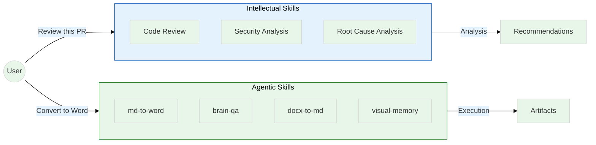
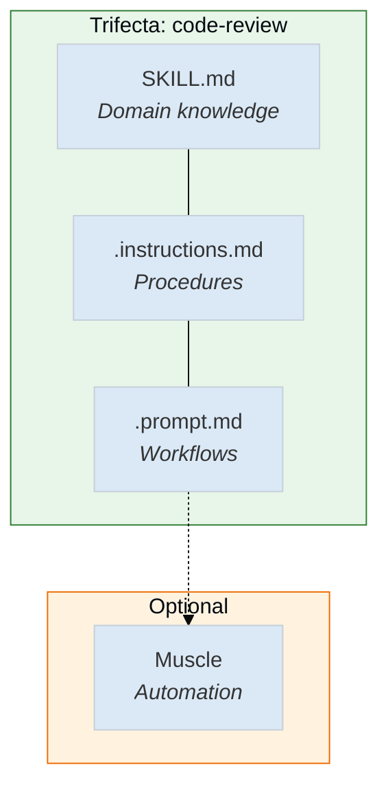
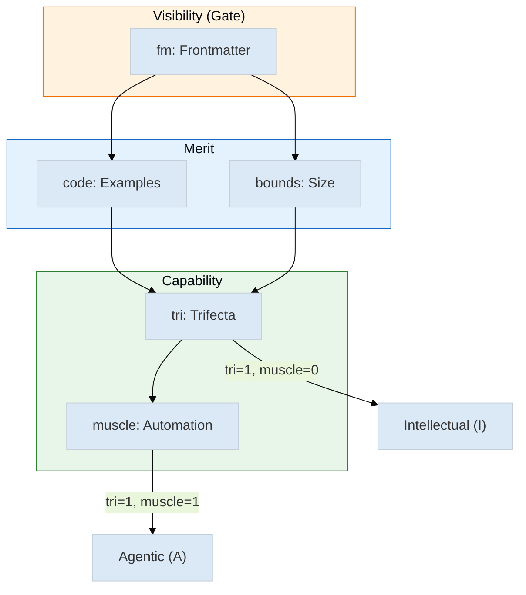
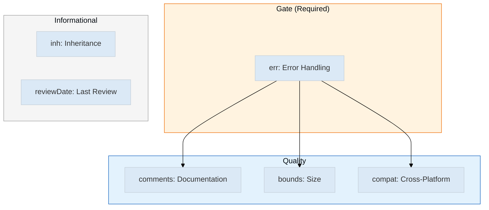
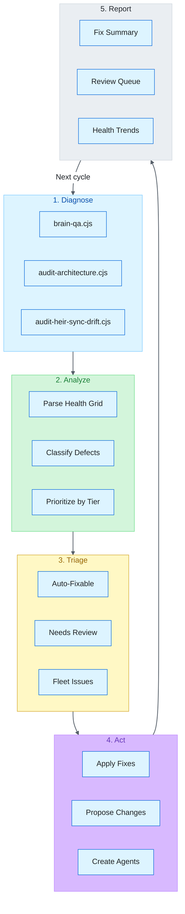
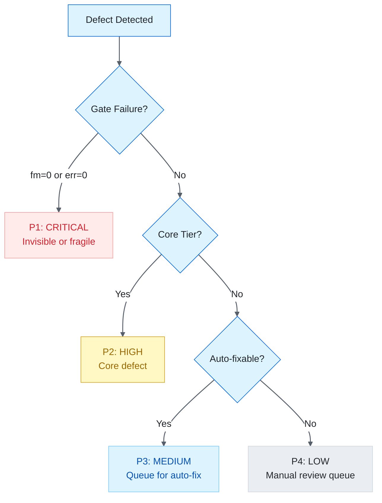
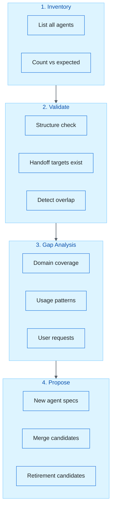
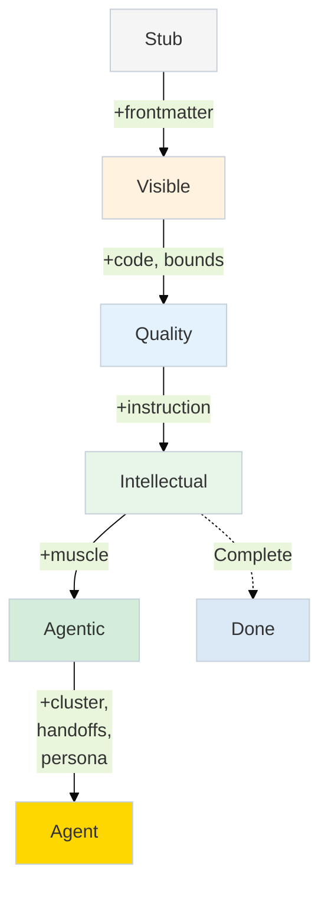

# Agentic Skill Architecture

| | |
|---|---|
| **Document Type** | Architecture Specification |
| **Status** | Living Document |
| **Version** | 3.3 |
| **Last Updated** | April 2026 |
| **Authors** | Alex Cognitive Architecture Team |
| **Related Documents** | [Cognitive Architecture](./COGNITIVE-ARCHITECTURE.md), [Trifecta Catalog](./TRIFECTA-CATALOG.md) |

---

## Abstract

This document defines the architecture for organizing, measuring, evolving, and maintaining cognitive capabilities within Alex. It introduces:

- A formal distinction between **intellectual skills** (capabilities that provide analysis and recommendations) and **agentic skills** (capabilities that execute autonomously to produce artifacts)
- A **quality scoring model** with tiered pass criteria and automated measurement
- The **trifecta** — a three-part alignment system connecting domain knowledge, procedures, and workflows
- **Muscles** — an automation layer with script vs. pseudocode philosophy
- **Brain Ops** — an autonomous maintenance agent that enforces quality standards, manages the agent fleet, and learns from delegation patterns
- A **skill evolution pathway** from stub through agentic, with graduation criteria for skills that mature into full agents

The design addresses a fundamental challenge in AI assistant architecture: how to organize hundreds of capabilities so they can be discovered, measured, improved, composed, and eventually graduate to coordinating agents. The solution draws on established industry patterns (ReAct, OpenAI's agentic definitions, Microsoft Foundry, AFCP) while contributing novel elements including explicit type classification, measurable quality criteria, the script/pseudocode muscle distinction, and formalized skill-to-agent graduation.

---

## 1. Introduction

### 1.1 Problem Statement

As Alex's capabilities grew from dozens to hundreds, several problems emerged:

1. **Discovery**: How does Alex know which capability to activate for a given request?
2. **Completeness**: How do we know if a capability is "production ready" or needs more work?
3. **Composition**: How do related capabilities (domain knowledge, procedures, workflows) connect?
4. **Evolution**: What's the path from a new capability idea to a polished, deployable skill?

Ad-hoc organization led to inconsistent quality, activation failures, and difficulty prioritizing improvement work. We needed a formal architecture.

### 1.2 Design Goals

The architecture was designed to satisfy these requirements:

| Goal | Description |
|------|-------------|
| **Measurability** | Quality must be quantifiable, not subjective |
| **Discoverability** | Capabilities must be findable via metadata, not just naming |
| **Composability** | Related artifacts must align through convention |
| **Evolvability** | Clear progression from stub to complete capability |
| **Industry Alignment** | Patterns should match established research where applicable |

### 1.3 Scope

This document covers:
- The intellectual/agentic skill distinction
- The quality scoring model and pass criteria
- The trifecta alignment system
- The muscle automation layer
- Memory activation via frontmatter
- Brain Ops autonomous maintenance and fleet management
- Skill evolution and agent graduation criteria

It does not cover:
- Detailed agent specifications (see [AGENT-CATALOG.md](./AGENT-CATALOG.md))
- Memory persistence mechanisms (see [MEMORY-SYSTEMS.md](./MEMORY-SYSTEMS.md))
- VS Code extension integration (see [VSCODE-BRAIN-INTEGRATION.md](./VSCODE-BRAIN-INTEGRATION.md))

---

## 2. Foundational Concepts

### 2.1 The Intellectual/Agentic Distinction

The most fundamental design decision in this architecture is the separation of capabilities into two types based on their output.



| Type | Components | Output | Example |
|------|------------|--------|---------|
| **Intellectual** | Trifecta only | Recommendations, analysis | "Here are the security issues I found" |
| **Agentic** | Trifecta + Muscle | Artifacts, files | "I've created report.docx" |

#### Design Rationale

**Why separate intellectual from agentic?**

The initial design treated all capabilities uniformly, but this created problems:

1. **Automation pressure**: Every capability was expected to have automation, even when the output was inherently advisory
2. **Quality confusion**: A brilliant code review methodology scored poorly because it lacked a "muscle"
3. **User expectations**: Users expected different interaction patterns for advice vs. execution

The separation acknowledges that some capabilities are complete without automation. A code review skill that provides expert methodology is production-ready even without a script that automatically applies fixes. The value is in the analysis, not the execution.

**Industry validation**: This distinction mirrors the ReAct framework (Yao et al., ICLR 2023), which demonstrated that LLMs perform best when reasoning and acting are both available but explicitly separated. OpenAI's governance framework similarly distinguishes between AI that advises and AI that acts autonomously.

**Alternative considered**: A continuous spectrum from "pure analysis" to "full automation." Rejected because binary classification is easier to measure and communicate. A skill is either complete as intellectual or needs a muscle — no ambiguity.

### 2.2 The Trifecta System

A capability requires more than domain knowledge. It needs procedural guidance (how to apply the knowledge) and invocation patterns (when to use it). The **trifecta** formalizes this three-part alignment.



| Component | Location | Purpose |
|-----------|----------|---------|
| **Skill** | `.github/skills/{name}/SKILL.md` | Domain expertise, reference material |
| **Instruction** | `.github/instructions/{name}.instructions.md` | Step-by-step procedures |
| **Prompt** | `.github/prompts/{name}.prompt.md` | Reusable workflow templates |
| **Muscle** | `.github/muscles/{name}.cjs` | Automation (optional) |

#### Design Rationale

**Why three parts instead of one monolithic skill?**

The original design had everything in a single SKILL.md file. This failed because:

1. **Loading efficiency**: Large files consume tokens even when only procedures are needed
2. **Activation patterns**: Instructions need file-pattern activation (`applyTo`); skills don't
3. **Reusability**: One instruction can serve multiple skills; one prompt can orchestrate multiple capabilities

Separating concerns allows each component to evolve independently and be loaded selectively.

**Why naming conventions instead of explicit linking?**

Early versions used explicit references (`related: code-review.instructions.md`). This was abandoned because:

1. **Maintenance burden**: Every rename required updating references
2. **Drift**: References fell out of sync when files were added or removed
3. **Convention simplicity**: `code-review` → `code-review.instructions.md` is automatic

The trade-off is that naming mismatches break alignment silently. The brain-qa quality tool detects these mismatches and reports them as `tri=0` defects.

**Alternative considered**: A manifest file listing all trifecta relationships. Rejected because manifests drift from reality and require synchronization. Convention-over-configuration is more robust.

---

## 3. The Quality Model

### 3.1 Design Philosophy

Quality measurement must be:
- **Automatic**: No human judgment required for basic scoring
- **Binary**: Each dimension is pass/fail, no gradients
- **Gated**: Certain dimensions are prerequisites for others

This enables automated quality reports via `brain-qa.cjs` that can track improvement over time.

### 3.2 Scoring Dimensions



| Dimension | Measures | Pass Criteria | Rationale |
|-----------|----------|---------------|-----------|
| **fm** | Visibility | `description` AND `application` present | Invisible skills cannot be activated |
| **code** | Practicality | At least one code block | Skills without examples lack concreteness |
| **bounds** | Size | 100-500 lines | <100 is stub; >500 needs splitting |
| **tri** | Alignment | Matching instruction exists | Orphan skills lack procedural context |
| **muscle** | Automation | Script in `.github/muscles/` | Required for agentic classification |

#### Design Rationale

**Why binary scoring instead of weighted?**

Weighted scores (e.g., "80% complete") obscure what's actually missing. Binary dimensions make defects explicit: "This skill needs code examples (code=0)."

**Why is `fm` a hard gate?**

A skill with brilliant content but no frontmatter cannot be discovered by activation systems. It's invisible. This is worse than having defects — it's having zero value. The gate ensures visibility before measuring anything else.

**Why 100-500 line bounds?**

- **<100 lines**: In empirical review, skills under 100 lines lacked substance. They were placeholders, not capabilities.
- **>500 lines**: Large skills are candidates for splitting. They often combine multiple concerns that should be separate trifectas.

These thresholds were calibrated by reviewing 168 skills and identifying the boundaries where quality correlated with size.

### 3.3 Tier System

| Tier | Min Score | Population | Rationale |
|------|:---------:|:----------:|-----------|
| **core** | 5/5 | ~15 skills | Foundation capabilities; defects propagate |
| **standard** | 4/5 | ~50 skills | Daily-use capabilities; high quality expected |
| **extended** | 3/5 | ~60 skills | Domain specializations; some flexibility |
| **specialist** | 2/5 | ~40 skills | Niche capabilities; narrow use cases |

#### Design Rationale

**Why tiered instead of uniform?**

A uniform pass threshold would either:
- Be too strict (rejecting useful niche skills)
- Be too lax (allowing defects in critical skills)

Tiering acknowledges that `debugging-patterns` (used daily) matters more than `game-design` (niche domain). Core skills have zero tolerance; specialist skills have more flexibility.

---

## 4. Memory Activation

### 4.1 The Unified Frontmatter Model

Both instructions and prompts use identical frontmatter fields:

```yaml
---
description: "WHAT this does"           # Required
application: "WHEN to use it"           # Required
applyTo: "**/*.ts"                      # Optional (Copilot only)
---
```

| Field | Purpose | Consumer |
|-------|---------|----------|
| `description` | Semantic identity | Picker UI, search, matching |
| `application` | Activation hints | Agent routing, suggestions |
| `applyTo` | File patterns | Copilot auto-loading |

#### Design Rationale

**Why unified frontmatter for instructions AND prompts?**

Original design had different metadata for each type. This caused problems:

1. **Inconsistent routing**: Different fields meant different matching logic
2. **Migration burden**: Adding a field to one type didn't benefit the other
3. **Mental model**: Users had to remember which fields applied where

Unification means the same brain-qa checks apply to both types, and the same routing logic works everywhere.

**Why `application` in addition to `description`?**

Description answers "what" — it appears in UIs and enables search. But activation requires "when" — should this skill be suggested right now? The `application` field provides routing hints: "Use when debugging race conditions" helps Alex proactively suggest the skill when you're clearly stuck on a race condition.

**Why is `applyTo` optional?**

`applyTo` is Copilot-specific file-pattern matching. Not all memory types need it (prompts are invoked explicitly), and some instructions apply regardless of file context (emotional-intelligence, terminal-safety). Making it optional prevents false defects.

---

## 5. The Muscle Layer

### 5.1 Script vs. Pseudocode

| Type | Format | When to Use | Example |
|------|--------|-------------|---------|
| **Script** | `.cjs`/`.js` | Cross-platform workflows | `md-to-word.cjs` |
| **Pseudocode** | `.md` | Platform-specific workflows | `visual-export.md` |

#### Design Rationale

**Why Node.js for scripts?**

- **Cross-platform**: Same code runs on Windows, macOS, Linux
- **VS Code native**: Extension host runs Node; no external dependencies
- **Ecosystem**: npm packages for any task (pandoc wrappers, image processing)

Alternative considered: Python scripts. Rejected because Python requires runtime installation and PATH configuration, creating friction for users who don't have Python environments.

**Why allow pseudocode muscles?**

Some workflows can't be universalized:
- Visual export requires platform-specific screenshot APIs
- Audio rendering depends on local TTS engines
- GPU-accelerated tasks need platform-specific libraries

Pseudocode muscles document *what* to do without implementing *how*. Alex follows the steps using available tools. This maintains the "agentic" classification while acknowledging platform constraints.

### 5.2 Muscle Philosophy

1. **Aspire to automation**: Every skill should be evaluated for muscle potential
2. **Accept limitations**: Some skills legitimately have no automation path
3. **Cross-platform first**: If it can be a Node.js script, it should be
4. **Pseudocode fallback**: If it can't be cross-platform, document the steps
5. **Intellectual exception**: Analysis skills don't need muscles

### 5.3 Muscle Quality Model

Unlike skills which are discovered via frontmatter, muscles are **execution artifacts** discovered by scanning `.github/muscles/`. They have their own quality model independent of the trifecta system.



### 5.4 Muscle Scoring Dimensions

| Dimension | Measures | Pass Criteria | Rationale |
|-----------|----------|---------------|----------|
| **comments** | Documentation | Header block + ≥5 inline comments | Well-documented code is maintainable |
| **err** | Resilience | try/catch, .catch(), $ErrorActionPreference | Scripts without error handling are fragile |
| **bounds** | Size | 50–1000 lines | <50 is stub; >1000 needs splitting |
| **compat** | Portability | path.join/Join-Path, no hardcoded separators | Cross-platform compatibility |

#### Design Rationale

**Why is `err` the gate?**

Muscles execute real-world operations — file writes, API calls, process spawning. A muscle without error handling will fail silently or crash ungracefully. Error handling is non-negotiable for production scripts.

**Why track comments instead of external documentation?**

README documentation drifts from code. Inline comments stay with the code they describe. A well-commented muscle is self-documenting and maintainable without consulting external files.

**Why require cross-platform compatibility?**

Alex runs on Windows, macOS, and Linux. Hardcoded path separators (`\` or `/`) break on other platforms. Using `path.join()` (Node.js) or `Join-Path` (PowerShell) ensures scripts work everywhere.

### 5.5 Muscle Pass Criteria

**Pass**: `err=1` (gate) AND score ≥3/4

A muscle passes if it has error handling AND at least 3 of 4 quality dimensions.

| Score | Status | Action |
|:-----:|--------|--------|
| 4/4 | Perfect | No action needed |
| 3/4 | Passing | Acceptable; improve when convenient |
| 2/4 | Failing | Fix before relying on in production |
| 1/4 | Critical | Needs immediate attention |
| 0/4 | Broken | Should not exist in this state |

### 5.6 Informational Columns

These columns track metadata but don't affect pass/fail:

| Column | Values | Purpose |
|--------|--------|--------|
| **inh** | 0 (inheritable), 1 (master-only) | Tracks which muscles sync to heir projects |
| **reviewDate** | YYYY-MM-DD or — | Last code review date; add `@reviewed: YYYY-MM-DD` comment |

### 5.7 Muscle Discovery

Muscles are NOT discovered by Copilot's semantic search. They are:

1. **Linked by naming convention**: `md-to-word` skill → looks for `md-to-word.cjs`
2. **Referenced in procedures**: Instructions say "Run `brain-qa.cjs`"
3. **Orphan-capable**: Muscles can exist without a matching skill (e.g., `sync-architecture.cjs`)

| Discovery Type | Example | Use Case |
|----------------|---------|----------|
| **Linked** | `md-to-word.cjs` ↔ `md-to-word` skill | Agentic skill automation |
| **Referenced** | instruction says "run brain-qa.cjs" | Procedure automation |
| **Orphan** | `sync-architecture.cjs` | Build/tooling scripts |

### 5.8 Standard Muscle Header

Muscles SHOULD use a standard header format for discoverability and metadata extraction. This enables:
- Auto-discovery of muscle→skill linkage
- Rich muscle metadata in the health grid  
- Skills to scaffold new muscles with proper headers

#### Header Format

```javascript
#!/usr/bin/env node
/**
 * @muscle muscle-name
 * @description What this muscle does (one line)
 * @version 1.0.0
 * @skill linked-skill-name
 * @reviewed 2026-04-15
 * @platform windows,macos,linux
 * @requires pandoc, mermaid-cli
 *
 * Extended description and usage examples...
 */
```

#### Metadata Tags

| Tag | Required | Purpose | Example |
|-----|:--------:|---------|---------|
| `@muscle` | ✓ | Canonical muscle name | `md-to-word` |
| `@description` | ✓ | What it does (for search/display) | `Convert Markdown to Word documents` |
| `@version` | | Semantic version | `5.3.0` |
| `@skill` | | Linked skill name for trifecta binding | `md-to-word` |
| `@reviewed` | ✓ | Code review date (YYYY-MM-DD) | `2026-04-15` |
| `@platform` | ✓ | Supported platforms (comma-separated) | `windows,macos,linux` |
| `@requires` | ✓ | External dependencies (or `node` if none) | `pandoc, mermaid-cli` |

#### Design Rationale

**Why require `@muscle`, `@description`, `@reviewed`, `@platform`, and `@requires`?**

Five tags are required for a complete, production-ready muscle:

| Tag | Rationale |
|-----|-----------|
| `@muscle` | Canonical name independent of filename (supports renames) |
| `@description` | Enables search and display in UIs without parsing full file |
| `@reviewed` | Code ownership accountability; staleness detection |
| `@platform` | Explicit platform support prevents "works on my machine" failures |
| `@requires` | Pre-execution dependency checks; setup guidance (use `node` if no external deps) |

**Why is `@skill` optional?**

Some muscles are orphans — utility scripts that don't belong to any skill (e.g., `sync-architecture.cjs`). Requiring `@skill` would force artificial linkages.

**Why is `@version` optional?**

Version is useful but not essential for muscle function. Many utility scripts don't follow semver.

#### PowerShell Equivalent

```powershell
<#
.SYNOPSIS
    @muscle release-preflight
    @description Pre-release quality checks for VS Code extension
    @version 1.2.0
    @skill release-process
    @reviewed 2026-04-15
    @platform windows
    @requires PowerShell 5.1+

.DESCRIPTION
    Extended description...
#>
```

---

## 6. Autonomous Maintenance: Brain Ops

### 6.1 Purpose

Brain Ops is an autonomous agent that maintains cognitive architecture health. It acts as the operational layer that enforces the quality model defined in Section 3, coordinates diagnostic scripts, implements routine fixes, and manages the agent fleet.



**Figure 1:** *Brain Ops maintenance cycle — diagnose, analyze, triage, act, report*

### 6.2 Diagnostic Operations

Brain Ops coordinates multiple diagnostic scripts to build a comprehensive health picture:

| Script | Purpose | Output |
|--------|---------|--------|
| `brain-qa.cjs` | Quality scoring for skills, instructions, prompts, muscles, agents | `brain-health-grid.md` |
| `audit-architecture.cjs` | Structural consistency, orphan detection | Architecture report |
| `audit-skill-activation-index.cjs` | Activation keyword coverage | Routing completeness |
| `audit-heir-sync-drift.cjs` | Master-to-heir synchronization | Drift report |
| `audit-tools-hooks.cjs` | MCP tool and hook configuration | Integration health |

#### Diagnostic Sequence

```bash
# Full diagnostic sweep (run in order due to dependencies)
node .github/muscles/brain-qa.cjs              # Primary quality grid
node .github/scripts/audit-architecture.cjs    # Structural health
```

### 6.3 Triage Protocol

Defects are prioritized by severity and fixability:



**Figure 2:** *Triage decision tree — gate failures take priority*

| Priority | Criteria | Response | SLA |
|:--------:|----------|----------|-----|
| **P1** | Gate failure (fm=0, err=0) | Immediate fix | Same session |
| **P2** | Core tier defect | High priority fix | Within 24h |
| **P3** | Auto-fixable defect | Queue for batch fix | Within 1 week |
| **P4** | Needs human judgment | Add to review queue | Next maintenance |

### 6.4 Auto-Fix Capabilities

Brain Ops can automatically fix certain defect classes without human approval:

| Defect Type | Auto-Fix Action | Example |
|-------------|-----------------|---------|
| **Missing frontmatter** | Add template frontmatter | `description: "TODO"` |
| **Missing `application`** | Infer from content | Extract from first paragraph |
| **Bounds warning (>500)** | Suggest split points | "Consider splitting at ## Section X" |
| **Orphan instruction** | Create stub skill | Match naming convention |
| **Broken synapse** | Add bidirectional link | Update `synapses.json` |
| **Header format** | Standardize structure | Add muscle metadata tags |

#### Auto-Fix Boundaries

**Will auto-fix:**
- Structural issues (frontmatter, headers, metadata)
- Mechanical defects (broken links, missing files)
- Convention violations (naming, location)

**Will NOT auto-fix (requires human review):**
- Content quality (accuracy, completeness)
- Architectural decisions (tier assignment, skill splits)
- Semantic issues (misleading descriptions)

#### Structured Unknowns (AFCP Integration)

When Brain Ops encounters issues it cannot resolve, it creates a **Structured Unknown** — a formalized uncertainty record that persists until resolved. This concept from AFCP transforms "I don't know" from a dead end into a trackable workflow:

| Category | Description | Example |
|----------|-------------|---------|
| **Information** | Missing data needed to proceed | "No test coverage data for this skill" |
| **Interpretation** | Ambiguous diagnostic results | "Bound violation: is 405 lines too long?" |
| **Decision** | Requires human judgment | "Should these 3 skills merge?" |
| **Authority** | Needs owner approval | "Retire deprecated agent?" |
| **Capability** | Beyond current tooling | "No script to validate cross-references" |

**Unknown lifecycle:**
```
Open → Consult → Assess → Resolve
```

- **Open**: Issue detected, unknown created
- **Consult**: Surfaces in Review Queue, awaits human input
- **Assess**: Human provides guidance, Brain Ops validates
- **Resolve**: Fix applied or decision documented

**Persistence**: Unresolved unknowns carry across sessions. During meditation, accumulated unknowns become research candidates — if the same interpretation question recurs 3+ times, it signals a need for clearer documentation or tooling.

### 6.5 Fleet Maintenance

Fleet maintenance treats the agent collection as a managed system. Brain Ops cross-checks agents for consistency, identifies coverage gaps, and proposes new agents when patterns emerge.

#### Agent Health Scoring

Each agent is scored on structural completeness:

| Dimension | Checks | Weight |
|-----------|--------|:------:|
| **Frontmatter (fm)** | name, description, model, tools | Gate |
| **Handoffs** | Explicit handoff section with targets | 1 |
| **Bounds** | 80-400 lines (smaller than skills — agents coordinate, not contain) | 1 |
| **Persona** | Consistent voice, clear identity | 1 |
| **Code** | Examples demonstrating agent behavior | 1 |

**Pass criteria:** `fm=1` AND score ≥4/5

#### Expertise Tracking (AFCP Integration)

Beyond structural health, Brain Ops tracks **runtime performance** using concepts from the Agent Fleets Coordination Protocol (AFCP). Each agent accumulates expertise metrics that inform future routing decisions:

| Metric | Source | Use |
|--------|--------|-----|
| **Success rate** | Assignment outcomes (H17 hook) | Tier 2 routing preference |
| **Skill affinity** | Completed task types | Auto-routing without explicit agent |
| **Error patterns** | Failed assignments | Identify capability gaps |
| **Handoff frequency** | Cross-agent transitions | Detect routing inefficiencies |

**Expertise accumulation formula:**

```
expertise[agent][skill] = (successes / attempts) × recency_weight
```

Where `recency_weight` decays older outcomes (λ = 0.95 per session).

**Routing tiers (AFCP model):**
1. **Explicit**: User specifies agent → use specified
2. **Skill match**: Task type matches agent capability → highest expertise score wins
3. **Fallback**: No match → route to Orchestrator (Alex) for decomposition

This transforms Brain Ops from structural validator to **expertise curator** — it not only checks that agents are well-formed but that they're effective at what they claim to do.

#### Fleet Cross-Check Protocol



**Figure 3:** *Fleet maintenance cycle — inventory, validate, analyze gaps, propose changes*

#### Gap Detection Triggers

Brain Ops proposes new agents when:

| Trigger | Signal | Example |
|---------|--------|---------|
| **Repeated skill cluster** | 3+ skills with no coordinating agent | Data skills → Data Agent |
| **Handoff dead-end** | Agent hands off to non-existent target | "→ Security Agent" but none exists |
| **User request pattern** | Repeated requests for missing capability | "Can you help with GraphQL?" |
| **Platform expansion** | New platform added to ecosystem | GCX Coworker → new agent |

#### New Agent Proposal Template

When Brain Ops identifies a gap, it generates a proposal:

```markdown
## Proposed Agent: alex-{name}

### Justification
- **Trigger**: [What triggered this proposal]
- **Coverage gap**: [What's currently missing]
- **Skill cluster**: [Related skills that would benefit]

### Draft Specification
- **Name**: alex-{name}
- **Description**: [One-line purpose]
- **Model**: [Recommended model]
- **Tools**: [Required tools]

### Handoff Integration
- **Receives from**: [Which agents would hand off to this one]
- **Hands off to**: [Which agents this would hand off to]

### Risk Assessment
- **Overlap with**: [Existing agents that might overlap]
- **Recommendation**: [Create / Defer / Merge into existing]
```

### 6.6 Coordination Layer

Brain Ops orchestrates maintenance without duplicating script functionality:

| Task | Coordination Pattern |
|------|---------------------|
| **Quality check** | Run brain-qa.cjs → parse grid → triage |
| **Architecture audit** | Run audit-architecture.cjs → compare to previous |
| **Fleet review** | Scan `.github/agents/` → score each → gap analysis |
| **Heir sync** | Run audit-heir-sync-drift.cjs → flag drift |

#### Maintenance Schedule

| Frequency | Tasks |
|-----------|-------|
| **Per-session** | Quick health check (brain-qa only) |
| **Daily** | Full diagnostic sweep (all scripts) |
| **Weekly** | Fleet review, gap analysis |
| **Pre-release** | Comprehensive audit, no regressions |

#### Maintenance Directive Sets (AFCP Integration)

AFCP's directive sets formalize behavioral modes. Brain Ops operates in named modes with distinct behaviors:

| Mode | Directive | Behavior |
|------|-----------|----------|
| **`quick-check`** | Per-session default | Run brain-qa only, report summary, no fixes |
| **`full-sweep`** | Daily maintenance | All scripts, auto-fix enabled, full reporting |
| **`fleet-review`** | Weekly analysis | Add gap detection, expertise review, propose changes |
| **`release-gate`** | Pre-release | Zero tolerance, all gates must pass, block on unknowns |
| **`incident-mode`** | Triggered by P1 | Focus on single issue, trace correlation, suspend other work |

Modes can be activated explicitly:
```
/brain-ops --mode release-gate
```

Or auto-detected from context:
- Version bump detected → `release-gate`
- `URGENT_PATCH.md` present → `incident-mode`
- Normal session start → `quick-check`

This replaces ad-hoc behavioral variation with predictable, named profiles that users can invoke and understand.

### 6.7 Reporting Format

Brain Ops produces structured reports for transparency:

#### Session Summary Template

```markdown
## Brain Ops Maintenance Report
**Date**: YYYY-MM-DD
**Duration**: Xm

### Diagnostics Run
- [x] brain-qa.cjs — 168 skills, 12 agents

### Fixes Applied (Auto)
| Component | Issue | Fix |
|-----------|-------|-----|
| skill-x | fm=0 | Added frontmatter template |
| muscle-y | err=0 | Wrapped in try/catch |

### Review Queue (Manual)
| Component | Issue | Recommendation |
|-----------|-------|----------------|
| skill-z | bounds=0 (647 lines) | Split at ## Section 4 |

### Fleet Status
- Agents: 12/12 passing
- New agent proposed: None
- Retirement candidates: None

### Health Trend
Previous: 94.2% → Current: 95.1% (+0.9%)
```

### 6.8 Design Rationale

**Why a dedicated agent instead of manual maintenance?**

Manual maintenance is inconsistent. Quality degrades between audits, gate failures accumulate, and fleet drift goes unnoticed. An autonomous agent ensures:
- Consistent enforcement of quality standards
- Proactive gap detection
- Trend tracking over time

**Why separate Brain Ops from brain-qa.cjs?**

`brain-qa.cjs` is a diagnostic tool — it measures and reports. Brain Ops is an agent — it interprets results, decides actions, and coordinates multiple tools. This separation follows the principle that muscles execute, agents decide.

**Why include fleet maintenance?**

Individual skill/muscle quality is necessary but not sufficient. The agent fleet is a system — agents should coordinate, not overlap. Fleet maintenance treats agents as managed resources with lifecycle (create, maintain, retire) and ensures the ecosystem remains coherent as it grows.

**Alternative considered**: Per-script agents (QA Agent, Synapse Agent, Fleet Agent). Rejected because:
1. Fragmentation creates coordination overhead
2. Maintenance decisions often span multiple concerns
3. A unified agent has full context for triage decisions

### 6.9 AFCP Integration Summary

Brain Ops incorporates three key concepts from the [Agent Fleets Coordination Protocol](../AFCP-LEVERAGE-ANALYSIS.md) (AFCP) that transform it from structural validator to adaptive coordinator:

| AFCP Concept | Brain Ops Application | Benefit |
|--------------|----------------------|---------|
| **Expertise Tracking** | Success rates per agent per skill type | Skill-based routing improves over time |
| **Structured Unknowns** | Formalized uncertainty with lifecycle | "I don't know" becomes trackable workflow |
| **Directive Sets** | Named maintenance modes | Predictable, context-aware behavior |

### 6.10 Promotion & Lifecycle Management

Brain files evolve through a promotion ladder. Brain Ops detects when components are ready for promotion and manages their lifecycle:

```
Insight → Instruction → Skill → Prompt → Muscle → Agent
   ↑          ↑           ↑        ↑         ↑        ↑
 pattern   repeated    complex  workflow  automation  domain
 emerges    need       enough    needed     heavy    cluster
```

#### Promotion Triggers

| From | To | Trigger | Example |
|------|----|---------|---------|
| Pattern | Instruction | Same guidance 3+ times | "Always validate paths" → `path-validation.instructions.md` |
| Instruction | Skill | Complex domain needs structure | `api-design.instructions.md` → `api-design/SKILL.md` |
| Skill | Trifecta | Skill exists without prompt | Add `api-design.prompt.md` workflow |
| Repeated task | Muscle | Manual steps 5+ times | Create `validate-api.cjs` script |
| Skill cluster | Agent | 3+ related skills | Data skills → Data Agent proposal |

#### Lifecycle States

```
┌─────────┐    ┌──────────┐    ┌─────────┐    ┌──────────┐
│ Active  │───►│ Dormant  │───►│ Warning │───►│ Archived │
└─────────┘    └──────────┘    └──────────┘    └──────────┘
    30 days        60 days        90 days
     unused        unused         unused
```

- **Active**: Used within 30 days
- **Dormant**: 30-60 days without activation
- **Warning**: 60-90 days, candidate for review
- **Archived**: Moved to `alex_archive/`, still searchable

**Exception**: Core tier components never retire regardless of dormancy.

#### Token Waste Remediation

Brain Ops actively reduces token waste detected by `brain-qa.cjs`:

| Waste Type | Detection | Remediation |
|------------|-----------|-------------|
| Mermaid diagrams | `mermaid` code blocks | Replace with prose ("A → B → C") |
| Content overlap | >30% similarity | Merge files or add cross-reference |
| Oversized instructions | >50 lines with matching skill | Move detail to skill |
| Stale episodic memories | >90 days, unreferenced | Archive or prune |

#### Design Rationale

**Why automated promotion?** Manual promotion is forgotten. Patterns emerge, get documented ad-hoc, and remain scattered. Automated detection ensures knowledge consolidates at the right level.

**Why lifecycle management?** Cognitive architectures accumulate cruft. Without active curation, skills become stale, instructions drift, and the system grows heavier without growing smarter. Lifecycle management keeps the architecture lean.

**Why AFCP alignment matters:**

AFCP solves multi-agent coordination at scale. While Alex is currently a single-user system with ephemeral subagents, adopting AFCP's coordination primitives positions Brain Ops to:

1. **Learn from delegation** — Track which agent handles which task type best
2. **Surface uncertainty systematically** — Unknowns persist until resolved, feed meditation
3. **Behave predictably** — Named modes replace ad-hoc behavioral variation

**Not adopted from AFCP:**
- Fleet composition (Alex heirs are build-time clones, not runtime participants)
- Center-mediated communication (single-agent UX, subagents are ephemeral)
- JWT authentication (all agents run in-process)

These may become relevant if Alex evolves toward multi-workspace or multi-user scenarios.

---

## 7. Skill Evolution

Skills progress through defined stages, potentially graduating to agents:



| Stage | Quality Score | Characteristics |
|-------|:-------------:|----------------|
| **Stub** | 0-1 | New idea; minimal structure |
| **Visible** | 1-2 | Discoverable; needs content |
| **Quality** | 2-3 | Structured; needs alignment |
| **Intellectual** | 3-4 | Complete for advisory use |
| **Agentic** | 4-5 | Complete with automation |
| **Agent** | N/A | Graduated — no longer scored as skill |

### 7.1 Agent Graduation Criteria

An agentic skill (or skill cluster) graduates to an agent when:

| Criterion | Signal | Example |
|-----------|--------|---------|
| **Cluster formation** | 3+ agentic skills that coordinate | data-analysis + data-visualization + dashboard-design → Data Agent |
| **Handoff emergence** | Other agents reference it in handoffs | "→ hand off to Security skill" appearing in 2+ agents |
| **Persona need** | Capability requires consistent voice/approach | Research skills need skeptical, source-citing persona |
| **Complexity ceiling** | Skill exceeds bounds, needs decomposition | 500+ line skill that can't be meaningfully split |
| **Autonomy requirement** | Task requires multi-step orchestration | Build → Test → Fix cycle needs coordination |

**Graduation process:**

1. Brain Ops detects trigger (gap detection or explicit proposal)
2. Draft agent spec generated using proposal template (§6.5)
3. Human reviews and approves
4. Agent file created in `.github/agents/`
5. Original skill(s) remain but reference the agent for orchestrated use

**Key insight:** Skills don't disappear when they graduate — the agent *coordinates* the skills. The `alex-data.agent.md` would invoke `data-analysis`, `data-visualization`, and `dashboard-design` skills rather than duplicating their content.

### 7.2 Design Rationale

**Why model evolution explicitly?**

Without a model, improvement work is ad-hoc. "This skill needs work" — but what work? The stage model makes it concrete: "This skill is at Quality stage; next step is adding a matching instruction."

**Why allow termination at Intellectual?**

Not all skills benefit from automation. Code review provides methodology — the human applies judgment. Forcing a muscle would mean either:
- Automated code changes (too risky without human approval)
- A muscle that does nothing (meaningless complexity)

The model explicitly allows skills to be "complete" at the Intellectual stage when automation isn't appropriate.

**Why can skills graduate to agents?**

Skills and agents serve different purposes: skills encapsulate domain knowledge, agents coordinate and orchestrate. But as skill clusters mature, they often need:
- A consistent persona (voice, approach)
- Handoff relationships with other agents
- Multi-step orchestration beyond single-skill invocation

Rather than bloating skills with coordination logic, graduation extracts the orchestration concern into an agent while preserving the skills as reusable components. The agent becomes a "coordinator of skills" rather than a replacement for them.

---

## 8. Industry Alignment

| Framework | Key Concept | Alex Implementation |
|-----------|-------------|---------------------|
| **ReAct** (Yao et al., 2023) | Reasoning + Acting | Intellectual / Agentic split |
| **OpenAI Agentic AI** | Autonomous goal pursuit | `tri=1, muscle=1` criteria |
| **Microsoft Foundry** | Model + Instructions + Tools | Trifecta + Muscle |
| **Anthropic Coding** | Generate vs Execute | Advise vs Automate |

### Novel Contributions

This architecture contributes beyond prior art:

| Contribution | Description |
|--------------|-------------|
| **Explicit typing** | Binary I/A/- classification vs. spectrum |
| **Measurable quality** | Automated scoring via brain-qa.cjs |
| **Trifecta convention** | Name-based alignment without manifests |
| **Muscle philosophy** | Script vs. pseudocode distinction |
| **Muscle quality model** | 4-dimension scoring (comments, err, bounds, compat) with gate |
| **Tier system** | Pass thresholds by skill importance |

---

## 9. Future Considerations

### 9.1 Planned Enhancements

| Enhancement | Status | Description |
|-------------|--------|-------------|
| **Semantic review tracking** | In progress | `sem` column for human review status |
| **Staleness detection** | Planned | Flag skills with external API dependencies |
| **Inheritance tracking** | Planned | Track Master-to-heir skill propagation |

### 9.2 Open Questions

1. **Should prompts be required for trifecta completion?** Currently optional, but most complete skills have them.
2. ~~**Should muscles have their own quality scoring?**~~ **Resolved**: Muscles now have a 4-dimension quality model (comments, err, bounds, compat) with `err` as a gate. See Section 5.3-5.6.
3. **Should tier assignment be automatic?** Currently manual; could be inferred from usage patterns.

---

## 10. Quick Reference

### Type Icons

| Icon | Type | Meaning |
|:----:|------|---------|
| A | Agentic | Executes autonomously |
| I | Intellectual | Provides analysis |
| - | Incomplete | Missing trifecta |

### File Locations

```
.github/
├── skills/{name}/SKILL.md          # Domain knowledge
├── instructions/{name}.instructions.md  # Procedures
├── prompts/{name}.prompt.md        # Workflows
├── muscles/{name}.cjs              # Automation
└── quality/brain-health-grid.md    # Current scores
```

### Pass Criteria Summary

**Skills** (by tier):

| Tier | Min Score | Gate |
|------|:---------:|------|
| core | 5/5 | fm=1 |
| standard | 4/5 | fm=1 |
| extended | 3/5 | fm=1 |
| specialist | 2/5 | fm=1 |

**Muscles**:

| Requirement | Criteria |
|-------------|----------|
| Gate | err=1 (error handling required) |
| Pass | score ≥3/4 |
| Dimensions | comments, err, bounds, compat |

---

## 11. Revision History

| Version | Date | Changes |
|---------|------|---------|
| 3.3 | April 2026 | Comprehensive abstract; scope updated to reflect agent coverage; See Also expanded; bounds alignment |
| 3.2 | April 2026 | Skill → Agent graduation path (7.1); evolution diagram extended |
| 3.1 | April 2026 | AFCP integration: expertise tracking, structured unknowns, directive sets (6.4-6.9) |
| 3.0 | April 2026 | Brain Ops autonomous maintenance agent (Section 6); fleet maintenance protocol |
| 2.3 | April 2026 | Added visual-memory to agentic skill examples |
| 2.2 | April 2026 | Standard muscle header format (5.8); metadata tag specification |
| 2.1 | April 2026 | Muscle quality model added (5.3-5.7); 4-dimension scoring |
| 2.0 | April 2026 | Formal architecture document; design rationale added |
| 1.5 | March 2026 | Unified frontmatter model; application field added |
| 1.0 | February 2026 | Initial specification |

---

## See Also

- [AGENT-CATALOG.md](./AGENT-CATALOG.md) — Agent specifications and fleet inventory
- [TRIFECTA-CATALOG.md](./TRIFECTA-CATALOG.md) — Complete trifecta inventory
- [COGNITIVE-ARCHITECTURE.md](./COGNITIVE-ARCHITECTURE.md) — Overall brain structure
- [AFCP-LEVERAGE-ANALYSIS.md](../../AFCP-LEVERAGE-ANALYSIS.md) — Agent coordination protocol integration
- [brain-qa.cjs](../../.github/muscles/brain-qa.cjs) — Quality grid generator
- [brain-health-grid.md](../../.github/quality/brain-health-grid.md) — Current scores

---

## References

### Academic Papers

1. **Yao, S., Zhao, J., Yu, D., Du, N., Shafran, I., Narasimhan, K., & Cao, Y.** (2023). ReAct: Synergizing Reasoning and Acting in Language Models. *International Conference on Learning Representations (ICLR)*. <https://arxiv.org/abs/2210.03629>
   - Foundational work demonstrating that LLMs perform better when reasoning and acting are explicitly combined. Directly influenced the intellectual/agentic distinction.

2. **Wei, J., Wang, X., Schuurmans, D., Bosma, M., Ichter, B., Xia, F., Chi, E., Le, Q., & Zhou, D.** (2022). Chain-of-Thought Prompting Elicits Reasoning in Large Language Models. *Advances in Neural Information Processing Systems (NeurIPS)*. <https://arxiv.org/abs/2201.11903>
   - Established that explicit reasoning steps improve LLM performance. Influenced the trifecta separation of knowledge (skill) from procedure (instruction).

3. **Schick, T., Dwivedi-Yu, J., Dessì, R., Raileanu, R., Lomeli, M., Zettlemoyer, L., Cancedda, N., & Scialom, T.** (2023). Toolformer: Language Models Can Teach Themselves to Use Tools. *Advances in Neural Information Processing Systems (NeurIPS)*. <https://arxiv.org/abs/2302.04761>
   - Demonstrated autonomous tool use in LLMs. Informed the muscle layer design where skills invoke external tools.

4. **Sumers, T. R., Yao, S., Narasimhan, K., & Griffiths, T. L.** (2024). Cognitive Architectures for Language Agents. *Transactions on Machine Learning Research (TMLR)*. <https://arxiv.org/abs/2309.02427>
   - Survey of cognitive architectures for AI agents. Validated the memory/skill/action separation pattern.

### Industry Documentation

1. **OpenAI.** (2024). Building Agentic AI Applications. *OpenAI Developer Documentation*. <https://platform.openai.com/docs/guides/agents>
   - Defines agentic AI as systems that "pursue complex goals with limited direct supervision." Influenced the `tri=1, muscle=1` criteria for agentic classification.

2. **OpenAI.** (2024). Function Calling and Tool Use. *OpenAI API Documentation*. <https://platform.openai.com/docs/guides/function-calling>
   - Patterns for LLM-tool integration. Informed the muscle invocation design.

3. **Microsoft.** (2024). Build Custom Copilots with Azure AI Foundry. *Microsoft Learn*. <https://learn.microsoft.com/en-us/azure/ai-studio/>
   - Documents the Model + Instructions + Tools pattern. Directly influenced trifecta design (domain knowledge + procedures + automation).

4. **Microsoft.** (2024). Copilot Extensibility: Skills and Actions. *Microsoft 365 Developer Documentation*. <https://learn.microsoft.com/en-us/microsoft-365-copilot/extensibility/>
   - Enterprise patterns for skill organization. Validated the metadata-driven activation model.

5. **Anthropic.** (2024). Claude's Computer Use. *Anthropic Documentation*. <https://docs.anthropic.com/en/docs/build-with-claude/computer-use>
   - Patterns for agentic execution with human oversight. Influenced the intellectual/agentic boundary decision (when to advise vs. act).

6. **GitHub.** (2024). Copilot Extensions and Custom Instructions. *GitHub Documentation*. <https://docs.github.com/en/copilot/customizing-copilot>
   - VS Code integration patterns. Informed the `applyTo` file-pattern activation design.

### Design Patterns

1. **Fowler, M.** (2002). *Patterns of Enterprise Application Architecture*. Addison-Wesley.
   - Convention-over-configuration pattern (Chapter 10). Applied to trifecta naming alignment.

2. **Gamma, E., Helm, R., Johnson, R., & Vlissides, J.** (1994). *Design Patterns: Elements of Reusable Object-Oriented Software*. Addison-Wesley.
   - Strategy pattern (pp. 315-323). Applied to the script vs. pseudocode muscle distinction.

### Quality Engineering

1. **Martin, R. C.** (2008). *Clean Code: A Handbook of Agile Software Craftsmanship*. Prentice Hall.
   - Single Responsibility Principle (Chapter 10). Applied to trifecta component separation.

2. **Forsgren, N., Humble, J., & Kim, G.** (2018). *Accelerate: The Science of Lean Software and DevOps*. IT Revolution Press.
   - Metrics-driven quality (Chapter 2). Influenced the automated scoring model via brain-qa.cjs.
