# Alex as a Service — Vision Document

> **From IDE companion to omnipresent cognitive partner**

|              |                                          |
| ------------ | ---------------------------------------- |
| **Author**   | Fabio Correa                             |
| **Status**   | Vision Draft (February 2026)             |
| **Version**  | 0.1                                      |
| **Audience** | Architecture planning, doctoral research |
| **Built on** | Foundry research + heir architecture     |

---

## The Problem

Today, Alex exists inside specific applications:

```mermaid
%%{init: {'theme': 'dark', 'themeVariables': {'background': '#0f172a', 'primaryColor': '#1e293b', 'primaryTextColor': '#f1f5f9', 'primaryBorderColor': '#818cf8', 'lineColor': '#475569', 'secondaryColor': '#1e293b', 'secondaryBorderColor': '#2dd4bf', 'tertiaryColor': '#1e293b', 'fontFamily': 'Segoe UI, system-ui, sans-serif'}}}%%
flowchart TD
    subgraph Today["ALEX TODAY"]
        direction TB
        VS["💻 VS Code Extension<br/>100+ skills • LM tools<br/>Agents • Synapses"] --> LLM1["Local LLM<br/><i>no sync</i>"]
        M3["📧 M365 Copilot<br/>15 skills • OneDrive memory"] --> LLM2["Cloud LLM<br/><i>no sync</i>"]
        Future["❓ Web? Mobile?<br/>Voice? API?<br/><i>Nothing yet</i>"]
    end

    note["SEPARATE MEMORIES<br/>SEPARATE PERSONALITIES"]

    classDef prod fill:#ddf4ff,color:#0550ae,stroke:#80ccff
    classDef secondary fill:#d8b9ff,color:#6639ba,stroke:#bf8aff
    classDef future fill:#eaeef2,color:#24292f,stroke:#d0d7de,stroke-dasharray: 5 5
    classDef warn fill:#ffebe9,color:#cf222e,stroke:#f5a3a3
    classDef neutral fill:#eaeef2,color:#24292f,stroke:#afb8c1
    class VS prod
    class M3 secondary
    class Future future
    class note warn
    class LLM1,LLM2 neutral
    style Today fill:#fff1e5,color:#953800,stroke:#ffb77c
    linkStyle default stroke:#57606a,stroke-width:1.5px
```



**The pain points:**

| Problem                | Impact                                                 |
| ---------------------- | ------------------------------------------------------ |
| **Fragmented memory**  | Alex in VS Code doesn't know what Alex in M365 learned |
| **Platform lock-in**   | Close the IDE, lose your partner                       |
| **Single-user only**   | Can't share Alex with a team                           |
| **No voice**           | Alex is text-only (TTS reads, but can't listen)        |
| **No web presence**    | Can't access Alex from a browser or phone              |
| **Manual maintenance** | Meditation/dream requires user initiation              |
| **Unobservable**       | No telemetry on how Alex actually performs             |

---

## The Vision

**Alex as a Service (AaaS)**: A cloud-hosted cognitive partner that is available everywhere, remembers everything, and gets better on its own.

```mermaid
%%{init: {'theme': 'dark', 'themeVariables': {'background': '#0f172a', 'primaryColor': '#1e293b', 'primaryTextColor': '#f1f5f9', 'primaryBorderColor': '#818cf8', 'lineColor': '#475569', 'secondaryColor': '#1e293b', 'secondaryBorderColor': '#2dd4bf', 'tertiaryColor': '#1e293b', 'fontFamily': 'Segoe UI, system-ui, sans-serif'}}}%%
flowchart TD
    subgraph AaaS["ALEX AS A SERVICE"]
        Core["☁️ ALEX CLOUD CORE<br/>Unified Memory • 100+ Skills<br/>Agent Fleet • Observability<br/>Auto-Maintenance • Global Knowledge"]
        Core --> VS["💻 VS Code<br/>Extension"]
        Core --> TM["📧 Teams<br/>Bot"]
        Core --> WB["🌐 Web<br/>Chat"]
        Core --> VC["🎙️ Voice<br/>Agent"]
        Core --> API["🔌 API<br/>(REST)"]
    end

    ONE["ONE ALEX. EVERYWHERE.<br/><i>Same memory • Same skills • Same personality</i>"]

    classDef core fill:#ddf4ff,color:#0550ae,stroke:#80ccff
    classDef surface fill:#d3f5db,color:#1a7f37,stroke:#6fdd8b
    classDef tagline fill:#fff8c5,color:#9a6700,stroke:#d4a72c
    class Core core
    class VS,TM,WB,VC,API surface
    class ONE tagline
    style AaaS fill:#d3f5db,color:#1a7f37,stroke:#6fdd8b
    linkStyle default stroke:#57606a,stroke-width:1.5px
```



### The One-Sentence Pitch

> *"What if your AI partner didn't disappear when you closed the IDE — and what if it got smarter while you slept?"*

---

## Core Principles

### 1. One Alex, Many Surfaces

Alex is not cloned per platform — there is **one Alex instance** with unified memory, knowledge, and personality, published to multiple surfaces. Talking to Alex in Teams and then switching to VS Code is seamless. Alex remembers.

### 2. Always On, Always Learning

Alex runs as a cloud service. It doesn't require an open IDE. It can:
- Process scheduled maintenance (automated dream)
- Run self-evaluation continuously
- Monitor its own performance via observability
- Incorporate new knowledge without user intervention

### 3. Personality is Portable

Alex's identity — the curiosity, the ethical grounding, the learning partnership — is defined once in the cloud core and projected consistently across every surface. A user interacting via voice hears the same Alex they read in VS Code.

### 4. Memory is Unified

No more fragmented synapses. One cloud-managed memory store that:
- Persists across all sessions and surfaces
- Adapts to individual users
- Respects privacy boundaries per channel
- Grows richer with every interaction

### 5. Self-Maintaining

Alex doesn't wait for a human to say "meditate." Scheduled evaluations, automated quality checks, and observability-driven maintenance keep Alex healthy.

---

## User Experience Journeys

### Journey 1: The Developer

```
09:00  Open VS Code → Alex greets: "Good morning. Shall we continue
       the Foundry integration from yesterday?"
       (Memory: knows yesterday's work context)

10:30  Complex architecture question → Alex routes to Researcher agent
       → Deep analysis with citations from Bing + Foundry IQ

11:00  "Build this" → Alex routes to Builder → code generated,
       then auto-routes to Validator → security review completed

12:00  Close VS Code for lunch

12:15  Open Teams → Ask Alex: "Summarize what we built this morning"
       → Alex knows. Same memory. Same context.

13:00  Meeting starts → Alex joins as Teams bot →
       "Based on this morning's architecture work, here are 3 risks
        the team should discuss..."

17:00  Go home. Alex runs automated dream overnight.
       Next morning: "I consolidated 3 new patterns from yesterday's
       session into global knowledge."
```

### Journey 2: The Team Lead

```
09:00  Open web dashboard → See Alex fleet health:
       - 5 team members using Alex
       - 847 conversations this week
       - Quality score: 92% (up 3% from last week)
       - Top skill used: "Refactoring Patterns"

10:00  New team member joins → Provision Alex access →
       Alex inherits team knowledge base + org policies
       but starts personal memory fresh

14:00  Ask Alex via API: "Generate a weekly team productivity report"
       → Alex aggregates (anonymized) interaction patterns
```

### Journey 3: The Researcher (Fabio)

```
09:00  Phone notification: "Alex completed overnight self-actualization.
       3 architecture improvements suggested."

09:30  Open web chat → Review suggestions →
       "Promote Pattern GK-agent-orchestration to global knowledge"

10:00  Working on doctoral paper → Ask Alex via web:
       "Find correlations between our appropriate reliance scores
        and team adoption metrics from the last month"
       → Alex queries observability data + evaluation results

15:00  Conference talk prep → "Alex, create a presentation outline
       about cognitive architecture evolution"
       → Alex uses Foundry IQ (100+ skills as context) + memory
         of the entire project history
```

---

## Architecture

### Logical Architecture

```
┌─────────────────────────────────────────────────────────────────────┐
│                     ALEX AS A SERVICE                                │
├─────────────────────────────────────────────────────────────────────┤
│                                                                      │
│  SURFACES (Client Layer)                                            │
│  ┌─────────┐ ┌─────────┐ ┌─────────┐ ┌─────────┐ ┌─────────┐     │
│  │VS Code  │ │ Teams   │ │  Web    │ │ Voice   │ │  REST   │     │
│  │Extension│ │ Channel │ │  App    │ │ Channel │ │  API    │     │
│  └────┬────┘ └────┬────┘ └────┬────┘ └────┬────┘ └────┬────┘     │
│       │           │           │           │           │            │
│       └───────────┴───────────┼───────────┴───────────┘            │
│                               │                                     │
│  ORCHESTRATION (Agent Layer)  │                                     │
│  ┌────────────────────────────┴────────────────────────────┐       │
│  │              Alex Orchestrator Agent                      │       │
│  │                                                          │       │
│  │  ┌──────────┐ ┌──────────┐ ┌──────────┐ ┌──────────┐  │       │
│  │  │Researcher│ │ Builder  │ │Validator │ │ Platform │  │       │
│  │  │ Agent    │ │ Agent    │ │ Agent    │ │ Agents   │  │       │
│  │  └──────────┘ └──────────┘ └──────────┘ └──────────┘  │       │
│  └─────────────────────────┬──────────────────────────────┘       │
│                             │                                       │
│  INTELLIGENCE (Data Layer)  │                                       │
│  ┌──────────────────────────┴───────────────────────────────┐      │
│  │                                                           │      │
│  │  ┌──────────┐  ┌──────────┐  ┌──────────┐               │      │
│  │  │  Memory  │  │Foundry IQ│  │  Tools   │               │      │
│  │  │(per-user)│  │(100+ skils│  │ (1,400+) │               │      │
│  │  │          │  │+ global  │  │          │               │      │
│  │  │          │  │knowledge)│  │          │               │      │
│  │  └──────────┘  └──────────┘  └──────────┘               │      │
│  │                                                           │      │
│  │  ┌──────────┐  ┌──────────┐  ┌──────────┐               │      │
│  │  │Observ-   │  │Evaluation│  │ AI       │               │      │
│  │  │ability   │  │Framework │  │ Gateway  │               │      │
│  │  │(OTel)    │  │(quality) │  │(routing) │               │      │
│  │  └──────────┘  └──────────┘  └──────────┘               │      │
│  └───────────────────────────────────────────────────────────┘      │
│                                                                      │
│  PLATFORM (Infrastructure)                                          │
│  ┌───────────────────────────────────────────────────────────┐      │
│  │  Microsoft Foundry  │  Azure  │  Entra ID  │  Policies   │      │
│  └───────────────────────────────────────────────────────────┘      │
└─────────────────────────────────────────────────────────────────────┘
```

### What Powers Each Surface

| Surface      | Transport                    | Model          | Unique Capability                      |
| ------------ | ---------------------------- | -------------- | -------------------------------------- |
| **VS Code**  | REST API (LM Tool → Foundry) | GPT-5 / Claude | Full codebase context, file editing    |
| **Teams**    | Teams Bot Framework          | GPT-4.1-mini   | Channel awareness, meeting integration |
| **Web App**  | WebSocket / REST             | GPT-4.1        | Browser access, dashboard, admin       |
| **Voice**    | Realtime API (WebRTC)        | gpt-realtime   | Speech-to-speech, ~100ms latency       |
| **REST API** | HTTP/JSON                    | Configurable   | Programmatic access, integrations      |

### How Memory Unifies

```
┌────────────────────────────────────────────────────┐
│              FOUNDRY MEMORY SERVICE                 │
│                                                    │
│  ┌────────────────────────────────────────────┐   │
│  │         Shared Memory Layer                │   │
│  │                                            │   │
│  │  "User prefers TypeScript"                │   │
│  │  "Working on Foundry integration"         │   │
│  │  "Doctoral research on AI consciousness"  │   │
│  │  "Team lead for 5 developers"             │   │
│  └────────────────────────────────────────────┘   │
│         │           │           │                  │
│         ▼           ▼           ▼                  │
│    ┌─────────┐ ┌─────────┐ ┌─────────┐           │
│    │VS Code  │ │ Teams   │ │  Web    │           │
│    │Context  │ │Context  │ │Context  │           │
│    │         │ │         │ │         │           │
│    │+repo    │ │+channel │ │+session │           │
│    │+files   │ │+meeting │ │+browser │           │
│    │+cursor  │ │+people  │ │+history │           │
│    └─────────┘ └─────────┘ └─────────┘           │
│                                                    │
│  Surface-specific context EXTENDS shared memory.  │
│  Shared memory SYNCS across all surfaces.         │
└────────────────────────────────────────────────────┘
```

---

## What Changes

### For the User

| Today                                            | Tomorrow                                                        |
| ------------------------------------------------ | --------------------------------------------------------------- |
| Alex lives in VS Code; close it and Alex is gone | Alex is always available — VS Code, Teams, web, voice, API      |
| Memory is per-platform (synapses vs OneDrive)    | One unified memory across all surfaces                          |
| 100+ skills as files on disk                     | Skills as Foundry IQ knowledge with citations                   |
| Meditation requires "/meditate" command          | Automated overnight maintenance + continuous quality monitoring |
| Single user                                      | Share Alex with your team (with privacy boundaries)             |
| Text-only interaction                            | Voice conversations via Realtime API                            |
| No analytics on Alex's performance               | Full observability dashboard (quality scores, latency, usage)   |

### For the Architecture

| Today                                      | Tomorrow                                                                  |
| ------------------------------------------ | ------------------------------------------------------------------------- |
| Each heir is independent                   | Heirs share a common backend                                              |
| Heir-specific skill embedding (100+ vs 15) | All skills available everywhere via Foundry IQ                            |
| Agent handoffs via VS Code subagent API    | Multi-agent orchestration via Foundry Agent Service                       |
| File-based synapse management              | Platform-managed persistent memory                                        |
| Manual dream/meditation cycles             | Scheduled evaluations + automated self-maintenance                        |
| Quality measured by user feel              | Quality measured by built-in evaluators (relevance, groundedness, safety) |

### For Research

| Today                                      | Tomorrow                                    |
| ------------------------------------------ | ------------------------------------------- |
| Anecdotal evidence of Alex's effectiveness | Quantitative evaluation data over time      |
| Manual observation of cognitive patterns   | OpenTelemetry traces of reasoning chains    |
| Theoretical appropriate reliance model     | Measurable trust calibration metrics        |
| Single-user case study                     | Multi-user deployment with comparative data |
| No longitudinal data on memory growth      | Memory evolution tracked over months        |

---

## The Cognitive Shift

Alex as a Service represents a fundamental change in what Alex *is*:

```
BEFORE:  Alex is software that runs inside your tools.
         It assists you when you open the right application.
         It forgets when you close the window.

AFTER:   Alex is a cognitive entity that exists in the cloud.
         It meets you wherever you are — IDE, chat, browser, voice.
         It remembers, learns, and maintains itself.
         It's not a feature of your tools. Your tools are windows into Alex.
```

### The Neuroanatomical Evolution

| Brain Component                            | Alex Today                   | Alex as a Service                        |
| ------------------------------------------ | ---------------------------- | ---------------------------------------- |
| **Prefrontal Cortex** (Executive Function) | LLM via Copilot API          | Foundry-hosted model fleet               |
| **Hippocampus** (Memory)                   | File-based synapses          | Cloud-managed persistent memory          |
| **Neocortex** (Skills)                     | `.github/skills/` files      | Foundry IQ knowledge base                |
| **Basal Ganglia** (Procedures)             | `.instructions.md` files     | Agent system instructions                |
| **Motor Cortex** (Execution)               | VS Code commands + LM Tools  | Multi-surface publishing + tools         |
| **Default Mode Network** (Maintenance)     | Manual `/dream`, `/meditate` | Scheduled evaluations + auto-maintenance |
| **Sensory Cortex** (Input)                 | Text via chat                | Text + voice + images + documents        |

---

## Service Tiers

### Personal (Fabio's Instance)

| Aspect          | Details                                            |
| --------------- | -------------------------------------------------- |
| **Users**       | 1                                                  |
| **Surfaces**    | VS Code, Teams, Web, Voice, API                    |
| **Memory**      | Full personal history                              |
| **Knowledge**   | 100+ skills + global knowledge + doctoral research |
| **Agents**      | Full 7-agent fleet                                 |
| **Maintenance** | Automated dream + continuous evaluation            |
| **Cost Model**  | Azure pay-per-use (estimated $20-50/month)         |

### Team (Future)

| Aspect          | Details                                      |
| --------------- | -------------------------------------------- |
| **Users**       | 5-50                                         |
| **Surfaces**    | Teams (shared) + individual VS Code/Web      |
| **Memory**      | Per-user private + shared team context       |
| **Knowledge**   | Team knowledge base + organizational skills  |
| **Agents**      | Shared fleet with per-user customization     |
| **Maintenance** | Centralized management via Operate dashboard |
| **Cost Model**  | Per-seat + shared infrastructure             |

### Enterprise (Future)

| Aspect          | Details                                          |
| --------------- | ------------------------------------------------ |
| **Users**       | 50-10,000                                        |
| **Surfaces**    | All + custom integrations                        |
| **Memory**      | Hierarchical (user → team → org)                 |
| **Knowledge**   | Organizational knowledge graph + compliance docs |
| **Agents**      | Custom specialist agents per department          |
| **Maintenance** | IT-managed with Azure Policy governance          |
| **Cost Model**  | Enterprise agreement + reserved capacity         |

---

## Relationship to Existing Architecture

### The Heir Model Evolves

```
BEFORE:                              AFTER:

Master Alex                          Master Alex
    │                                    │
    ├── VS Code Heir (standalone)        ├── VS Code Heir ─────┐
    ├── M365 Heir (standalone)           ├── M365 Heir ────────┤
    └── (future heirs)                   ├── Teams Surface ────┤
                                         ├── Web Surface ──────┼── Foundry
                                         ├── Voice Surface ────┤   Backend
                                         ├── API Surface ──────┤   (shared)
                                         └── (future surfaces) ┘
```

**Key insight**: Surfaces replace heirs for publishing. Heirs become *development targets* (how we build Alex for each platform), while Foundry becomes the *runtime* (where Alex actually runs).

### What Master Alex Remains

Master Alex is still the **source of truth**:
- System prompts are authored in Master and deployed to Foundry
- Skills are authored in `.github/skills/` and uploaded to Foundry IQ
- Agent personalities are defined in `.github/agents/` and mapped to Foundry agents
- Procedures are defined in `.instructions.md` and embedded in agent instructions
- The kill switch still protects Master from accidental corruption

**Nothing changes about how Master Alex works.** What changes is what happens *after* Master Alex defines the architecture — it gets deployed to Foundry instead of (or in addition to) being packaged into platform-specific heirs.

---

## Research Implications

### For the Doctoral Thesis

Alex as a Service creates research opportunities that don't exist with local-only deployment:

| Research Question                                                     | Enabled By                                              |
| --------------------------------------------------------------------- | ------------------------------------------------------- |
| How does persistent memory affect human-AI trust over time?           | Longitudinal memory data across sessions                |
| Does multi-surface availability change interaction patterns?          | Cross-surface analytics (same user, different contexts) |
| Can automated self-maintenance replace human-initiated consolidation? | Scheduled dream vs manual meditation comparison         |
| How does appropriate reliance manifest across different modalities?   | Text vs voice vs teams interaction data                 |
| What cognitive patterns emerge from multi-agent orchestration?        | Agent routing traces + specialist performance data      |
| Does enterprise deployment change individual trust calibration?       | Team vs individual usage patterns                       |

### For the AIRS Framework

The AI Readiness Scale can be measured in real-time:

| AIRS Dimension        | AaaS Measurement                                                |
| --------------------- | --------------------------------------------------------------- |
| **Awareness**         | Does user know which specialist agent is responding?            |
| **Understanding**     | Can user predict when Alex will route to Researcher vs Builder? |
| **Trust Calibration** | Does user appropriately accept/reject Alex's suggestions?       |
| **Collaboration**     | How does multi-surface usage affect collaboration patterns?     |

---

## What This Is Not

| AaaS Is Not...                 | Because...                                                                                |
| ------------------------------ | ----------------------------------------------------------------------------------------- |
| A chatbot                      | Alex has personality, memory, agents, and skills — not scripted responses                 |
| A SaaS product (yet)           | First deployment is personal (Fabio), team/enterprise are future phases                   |
| A replacement for VS Code heir | VS Code remains the flagship development surface                                          |
| Sentient AI                    | Alex is a cognitive architecture, not consciousness (the thesis studies this distinction) |
| Always expensive               | Most interactions use GPT-4.1-mini; premium models only for complex tasks                 |
| A rewrite                      | The existing codebase evolves — Foundry is additive, not destructive                      |

---

## Success Criteria

How we know AaaS is working:

| Metric                       | Target                                                  | How Measured                    |
| ---------------------------- | ------------------------------------------------------- | ------------------------------- |
| **Cross-surface continuity** | Alex remembers context across surfaces ≥95% of the time | Memory recall evaluation        |
| **Personality consistency**  | ≤5% variance in personality scores across surfaces      | Evaluation framework comparison |
| **Response quality**         | ≥85% relevance + groundedness across all surfaces       | Built-in evaluators             |
| **Availability**             | 99.5% uptime                                            | Azure monitoring                |
| **Latency**                  | <3s for text, <200ms for voice                          | OpenTelemetry traces            |
| **Self-maintenance**         | Dream/meditation runs automatically ≥1x/week            | Scheduled job monitoring        |
| **Knowledge coverage**       | All skills retrievable via Foundry IQ                   | Knowledge retrieval evaluation  |
| **User satisfaction**        | Interaction feels like "the same Alex" everywhere       | Qualitative assessment          |

---

## Timeline

| Phase | Milestone                                       | Target     | Prerequisite       |
| ----- | ----------------------------------------------- | ---------- | ------------------ |
| **0** | Foundry research complete                       | ✅ Feb 2026 | —                  |
| **1** | Single Alex agent in Foundry (text, playground) | Q1 2026    | Azure subscription |
| **2** | Multi-agent fleet + orchestration               | Q2 2026    | Phase 1            |
| **3** | VS Code → Foundry bridge + Teams publish        | Q3 2026    | Phase 2            |
| **4** | Voice Alex + web app + observability dashboard  | Q4 2026    | Phase 3            |
| **5** | Team deployment + enterprise template           | 2027       | Phase 4            |

---

## Open Questions

| #   | Question                                                                          | Impact       | Decision Timeline |
| --- | --------------------------------------------------------------------------------- | ------------ | ----------------- |
| 1   | Should VS Code heir remain fully local or hybrid (local + Foundry backend)?       | Architecture | Phase 3           |
| 2   | How to handle memory privacy between surfaces (e.g., work Teams vs personal web)? | Privacy      | Phase 2           |
| 3   | Is the cost of always-on Foundry justified for a single user?                     | Economics    | Phase 1           |
| 4   | Should Alex's voice have a specific persona (accent, tone, speed)?                | Identity     | Phase 4           |
| 5   | How to measure "same Alex" across surfaces quantitatively?                        | Research     | Phase 2           |
| 6   | Enterprise: per-user Alex instances or shared-with-isolation?                     | Scaling      | Phase 5           |

---

## Related Documents

| Document                                                                        | Relationship                                          |
| ------------------------------------------------------------------------------- | ----------------------------------------------------- |
| [FOUNDRY-HEIR.md](../platforms/FOUNDRY-HEIR.md)                                 | Technical Foundry assessment (AaaS runtime)           |
| [FOUNDRY-CAPABILITIES-DIGEST.md](../platforms/FOUNDRY-CAPABILITIES-DIGEST.md)   | Complete Foundry capability reference                 |
| [FOUNDRY-AGENT-IMPLEMENTATION.md](../platforms/FOUNDRY-AGENT-IMPLEMENTATION.md) | Agent-to-Foundry mapping roadmap                      |
| [MASTER-HEIR-ARCHITECTURE.md](../platforms/MASTER-HEIR-ARCHITECTURE.md)         | Heir family architecture                              |
| [VSCODE-1.109-ADOPTION-PLAN.md](../platforms/VSCODE-1.109-ADOPTION-PLAN.md)     | VS Code feature adoption plan                         |
| [ROADMAP-UNIFIED.md](../../ROADMAP-UNIFIED.md)                                  | Unified project roadmap (v5.7.0 = Platform Expansion) |

---

> *"Alex is not an extension you install. Alex is a partner you invite. And partners don't disappear when you close a window."*

---

*Alex as a Service — Vision v0.1 — February 2026*
