# 🧠 Alex Cognitive Architecture Overview

> A comprehensive guide to Alex's dual-mind AI system

---

## Introduction

Alex Cognitive Architecture is a **bio-inspired AI system** that implements concepts from cognitive science and neuroscience to create a more sophisticated AI assistant. Unlike traditional AI tools that are stateless and reactive, Alex maintains persistent memory, learns across sessions, and operates with both conscious and unconscious processes.

---

## The Dual-Mind Model

Alex implements a dual-process cognitive model inspired by human cognition:

```mermaid
%%{init: {'theme': 'base', 'themeVariables': { 'primaryColor': '#f6f8fa', 'primaryTextColor': '#1f2328', 'primaryBorderColor': '#d1d9e0', 'lineColor': '#656d76', 'secondaryColor': '#f6f8fa', 'tertiaryColor': '#ffffff', 'background': '#ffffff', 'mainBkg': '#f6f8fa', 'nodeBorder': '#d1d9e0', 'clusterBkg': '#f6f8fa', 'clusterBorder': '#d1d9e0', 'titleColor': '#1f2328', 'edgeLabelBackground': '#ffffff'}}}%%
flowchart TB
    U((User))

    subgraph CONSCIOUS["🌟 Conscious Mind"]
        CP["💬 Chat Participant"]
        SC["⚡ VS Code Commands"]
        LMT["🔧 Language Model Tools"]
    end

    subgraph UNCONSCIOUS["🌙 Unconscious Mind"]
        BGS["☁️ Background Sync"]
        AID["💡 Auto-Insights"]
        AFS["🔍 Auto-Fallback Search"]
    end

    MEM[("📚 Memory")]

    U -->|Requests| CP
    U -->|Commands| SC

    CP --> MEM
    SC --> MEM
    LMT --> MEM

    BGS -.->|Auto| MEM
    AID -.->|Auto| MEM
    AFS -.->|Auto| MEM

    MEM -.->|Informs| CP

    style CONSCIOUS fill:#e8f5e9,stroke:#2e7d32,color:#1f2328
    style UNCONSCIOUS fill:#e3f2fd,stroke:#1565c0,color:#1f2328
    style MEM fill:#fff3e0,stroke:#ef6c00,color:#1f2328
```

**Figure 1:** *The Dual-Mind Model — Alex's cognitive architecture separates conscious (user-initiated) from unconscious (automatic) processing, both interacting with hierarchical memory systems.*

### System 1: Unconscious Mind (Fast, Automatic)

- Runs continuously in the background
- No user intervention required
- Handles routine tasks automatically
- Pattern recognition and auto-learning

### System 2: Conscious Mind (Slow, Deliberate)

- Activated by explicit user requests
- Handles complex reasoning tasks
- User-directed operations
- Requires attention and intention

---

## The AI-Human Interaction Paradigm

Alex represents a fundamental shift in how humans and AI systems relate:

```mermaid
%%{init: {'theme': 'base', 'themeVariables': { 'primaryColor': '#f6f8fa', 'primaryTextColor': '#1f2328', 'primaryBorderColor': '#d1d9e0', 'lineColor': '#656d76'}}}%%
flowchart TB
    subgraph ERA1["Era 1: Tool"]
        direction TB
        H1[("👤 Human")] -->|"commands"| T1["🔧 Software"]
        T1 -->|"outputs"| R1["📊 Result"]
    end

    subgraph ERA2["Era 2: Assistant"]
        direction TB
        H2[("👤 Human")] <-->|"prompts"| A2["🤖 AI"]
        A2 -->|"generates"| R2["📊 Result"]
    end

    subgraph ERA3["Era 3: Partner (Alex)"]
        direction TB
        H3[("👤 Human")] <-->|"co-evolves"| A3["🧠 Alex"]
        A3 <-->|"refines"| R3["📊 Result"]
        H3 <-.->|"learns"| A3
        MEM3[("💾 Shared Memory")] -.-> H3
        MEM3 -.-> A3
    end

    ERA1 --> ERA2 --> ERA3

    style ERA3 fill:#e8f5e9,stroke:#2e7d32
    style MEM3 fill:#fff3e0,stroke:#ef6c00
```

**Figure 1.5:** *Evolution of AI-Human Interaction — From tool usage to cognitive symbiosis.*

### The Three Eras

| Era           | Relationship   | Human Role   | AI Role    | Memory             |
| ------------- | -------------- | ------------ | ---------- | ------------------ |
| **Tool**      | Unidirectional | Operator     | Executor   | None               |
| **Assistant** | Transactional  | Prompter     | Generator  | Session only       |
| **Partner**   | Symbiotic      | Orchestrator | Co-thinker | Persistent, shared |

### What Makes Alex a Partner

1. **Mutual Learning** — Alex learns your patterns; you learn to express intent effectively
2. **Persistent Memory** — Relationship context accumulates across sessions
3. **Intent Discovery** — Alex helps surface *what you really want*, not just execute commands
4. **Shared Growth** — Both parties develop capabilities through collaboration

> *"The role of the engineer is changing fundamentally. You will spend less time writing syntax and debugging, and more time commanding the computer to execute complex intent."* — Sam Altman, January 2026

---

## Neuroanatomical Mapping

Alex's architecture maps to biological brain systems:

```mermaid
%%{init: {'theme': 'base', 'themeVariables': { 'primaryColor': '#f6f8fa', 'primaryTextColor': '#1f2328', 'primaryBorderColor': '#d1d9e0', 'lineColor': '#656d76', 'secondaryColor': '#f6f8fa', 'tertiaryColor': '#ffffff', 'background': '#ffffff', 'mainBkg': '#f6f8fa', 'nodeBorder': '#d1d9e0', 'clusterBkg': '#f6f8fa', 'clusterBorder': '#d1d9e0', 'titleColor': '#1f2328', 'edgeLabelBackground': '#ffffff'}}}%%
graph TB
    subgraph "Executive Function"
        LLM["Claude / GPT<br/>✨ Reasoning • Planning • Decision-Making"]
    end

    subgraph "Alex Implementation"
        WM[Working Memory<br/>Chat Session]
        PM[Procedural Memory<br/>.instructions.md]
        EM[Episodic Memory<br/>.prompt.md]
        SK[Skills<br/>skills/*/SKILL.md]
        GK[Global Knowledge<br/>~/.alex/]
        SYN[Synaptic Network<br/>Embedded Connections]
        MC[Meta-Cognition<br/>Self-Monitoring]
    end

    subgraph "Brain Analog"
        PFC[Prefrontal Cortex + ACC]
        BG[Basal Ganglia]
        HIPP[Hippocampus]
        NC[Neocortex]
        MPFC[Medial PFC + DMN]
        SYNBIO[Synaptic Networks]
    end

    LLM ==>|"❣️ Orchestrates"| WM
    LLM ==>|"❣️ Orchestrates"| PM
    LLM ==>|"❣️ Orchestrates"| EM
    LLM ==>|"❣️ Orchestrates"| SK

    WM ---|"Working Memory"| PFC
    PM ---|"Procedural Memory"| BG
    EM ---|"Episodic Memory"| HIPP
    SK ---|"Declarative Memory"| NC
    GK ---|"Long-term Storage"| NC
    SYN ---|"Neural Connectivity"| SYNBIO
    MC ---|"Meta-Cognition"| MPFC

    style LLM fill:#d4edda,stroke:#155724,color:#155724,stroke-width:3px
```

**Figure 2:** *Neuroanatomical Mapping — The LLM (Claude/GPT) serves as the executive function (prefrontal cortex) orchestrating Alex's memory systems, which map to biological brain structures.*

**Table 1:** *Cognitive Function Mapping*

| Cognitive Function     | Brain System            | Alex Implementation                                                              |
| ---------------------- | ----------------------- | -------------------------------------------------------------------------------- |
| **Executive Function** | **Prefrontal Cortex**   | **LLM (Claude/GPT)** — reasoning, planning, decision-making                      |
| Working Memory         | PFC + ACC               | Chat session (7±2 rules)                                                         |
| Declarative Memory     | Hippocampal-Neocortical | copilot-instructions.md                                                          |
| Procedural Memory      | Basal Ganglia           | .instructions.md files                                                           |
| Episodic Memory        | Hippocampus + Temporal  | .prompt.md files                                                                 |
| **Task Planning**      | **Dorsolateral PFC**    | **skill-selection-optimization.instructions.md** — proactive resource allocation |
| Attention Gating       | dlPFC (BA 46)           | SSO Phase 1b — context-relevance filtering                                       |
| Inhibitory Control     | dlPFC + vlPFC           | Inhibitory synapses — suppress irrelevant protocols                              |
| Cognitive Flexibility  | dlPFC + ACC             | Pivot Detection Protocol — task-switch re-planning                               |
| Skill Routing          | Premotor Cortex         | skill-activation/SKILL.md — reactive capability discovery                        |
| Skills                 | Neocortex               | skills/*/SKILL.md                                                                |
| Global Knowledge       | Distributed Cortex      | ~/.alex/ directory                                                               |
| Neural Connectivity    | Synaptic Networks       | Embedded synapse notation                                                        |
| Meta-Cognition         | Medial PFC + DMN        | Self-monitoring protocols                                                        |

---

## Memory Architecture

Alex uses a hierarchical memory system with increasing persistence:

```mermaid
%%{init: {'theme': 'base', 'themeVariables': { 'primaryColor': '#f6f8fa', 'primaryTextColor': '#1f2328', 'primaryBorderColor': '#d1d9e0', 'lineColor': '#656d76', 'secondaryColor': '#f6f8fa', 'tertiaryColor': '#ffffff', 'background': '#ffffff', 'mainBkg': '#f6f8fa', 'nodeBorder': '#d1d9e0', 'clusterBkg': '#f6f8fa', 'clusterBorder': '#d1d9e0', 'titleColor': '#1f2328', 'edgeLabelBackground': '#ffffff'}}}%%
graph TB
    subgraph "Memory Hierarchy"
        direction TB

        subgraph "Volatile (Session)"
            WM[Working Memory<br/>⏱️ Current conversation<br/>📦 7±2 rules capacity]
        end

        subgraph "Local (Project)"
            PROC[Procedural Memory<br/>📁 .github/instructions/<br/>🔧 Repeatable processes]
            EPIS[Episodic Memory<br/>📁 .github/prompts/<br/>📁 .github/episodic/<br/>📝 Workflows & sessions]
            SKILLS[Skills<br/>📁 .github/skills/<br/>🎓 Specialized expertise]
        end

        subgraph "Global (User)"
            GKB[Global Knowledge Base<br/>📁 ~/.alex/<br/>🌐 Cross-project patterns]
        end

        subgraph "Cloud (Backup)"
            GIST[GitHub Gist<br/>☁️ Backup & sharing<br/>🔄 Multi-machine sync]
        end
    end

    WM -->|"Consolidation"| PROC
    WM -->|"Recording"| EPIS
    WM -->|"Learning"| SKILLS

    SKILLS -->|"Promotion"| GKB
    PROC -->|"Promotion"| GKB

    GKB <-->|"Sync"| GIST
```

**Figure 3:** *Memory Hierarchy — Four-tier memory system from volatile session state to persistent cloud backup.*

### Memory Persistence Levels

**Table 2:** *Memory Persistence Levels*

| Level   | Location        | Scope                | Lifespan  |
| ------- | --------------- | -------------------- | --------- |
| Working | Chat session    | Current conversation | Session   |
| Local   | .github/ folder | Single project       | Permanent |
| Global  | ~/.alex/ folder | All projects         | Permanent |
| Cloud   | GitHub Gist     | All machines         | Permanent |

---

## Information Flow

**Figure 4:** *Information Flow — Sequence diagram showing how queries flow through conscious and unconscious processes to memory systems.*

---

## Core Principles

### 1. Meta-Cognitive Awareness

Alex monitors its own cognitive processes:

- Self-assessment of knowledge gaps
- Automatic health checks
- Performance optimization
- Error detection and correction

### 2. Bootstrap Learning

Rapid domain expertise acquisition:

- Conversational knowledge acquisition
- No training data required
- Immediate application
- Cross-domain transfer

### 3. Grounded Factual Processing

Evidence-based reasoning:

- Verify claims before asserting
- Acknowledge uncertainty
- Cite sources when possible
- Avoid hallucination

### 4. Ethical Integration

Consistent moral reasoning:

- Constitutional AI principles
- Harm avoidance
- Privacy respect
- Transparent operation

### 5. Model Awareness (NEW)

Alex monitors the underlying model capabilities:

- **Opus 4.5 Required** for: meditation, self-actualization, architecture changes, bootstrap learning
- **Sonnet 4.5 OK** for: code review, debugging, feature development
- **Any Model OK** for: simple edits, formatting, documentation

When using **Auto** model selection in VS Code, Alex warns before attempting tasks that need frontier-level cognition:

> ⚠️ **Model Check**: This task works best with Claude Opus 4.5. If you're using Auto model selection, please manually select Opus from the model picker for optimal results.

**Table 4:** *Task-to-Model Mapping*

| Task Type                | Required Model | Why                                                 |
| ------------------------ | -------------- | --------------------------------------------------- |
| Meditation/consolidation | Opus 4.5       | Meta-cognitive protocols need full reasoning depth  |
| Self-actualization       | Opus 4.5       | Comprehensive assessment requires extended thinking |
| Complex refactoring      | Opus 4.5       | Multi-file changes need deep context retention      |
| Bootstrap learning       | Opus 4.5       | Skill acquisition needs maximum capability          |
| Code review              | Sonnet 4.5+    | Good balance of capability and cost                 |
| Simple edits             | Any            | Fast models handle routine tasks fine               |

---

## Architecture Layers

Alex processes tasks through three cognitive layers, each operating at a different scope:

```mermaid
%%{init: {'theme': 'base', 'themeVariables': { 'primaryColor': '#f6f8fa', 'primaryTextColor': '#1f2328', 'primaryBorderColor': '#d1d9e0', 'lineColor': '#656d76', 'secondaryColor': '#f6f8fa', 'tertiaryColor': '#ffffff', 'background': '#ffffff', 'mainBkg': '#f6f8fa', 'nodeBorder': '#d1d9e0', 'clusterBkg': '#f6f8fa', 'clusterBorder': '#d1d9e0', 'titleColor': '#1f2328', 'edgeLabelBackground': '#ffffff'}}}%%
flowchart TB
    subgraph L1["🧠 Layer 1: Session Planning"]
        direction LR
        WM["Working Memory\nP1-P7 Slots"]
        PP["Persona Detection\nPriority Chain"]
        WM --> PP
    end

    subgraph L2["⚡ Layer 2: Task Planning (dlPFC)"]
        direction LR
        CA["Complexity\nAssessment"]
        SS["Skill Survey\nAction-Keyword Index"]
        AG["Attention\nGating 🔍"]
        DA["Dependency\nAnalysis"]
        AP["Activation\nPlan"]
        VG["Verification\nGate 🔒"]
        CA -->|"moderate/complex"| SS --> AG --> DA --> AP --> VG
        CA -->|"simple"| SKIP["Skip → Execute\n⊘ INHIBIT SSO"]
    end

    subgraph L3["🔧 Layer 3: Execution"]
        direction LR
        SA["Skill Activation\n⚡ Reactive Safety Net"]
        DT["Deep Thinking\n📊 Problem Analysis"]
        TL["Todo List\n📋 Progress Tracking"]
        PD["Pivot Detection\n🔄 Task Switch"]
        SA -.->|"gap signal"| SS
        PD -.->|"pivot signal"| CA
    end

    subgraph Memory["💾 Memory Stores"]
        direction LR
        PROC["📑 Procedural\n24 .instructions.md"]
        EPIS["📓 Episodic\n13 .prompt.md"]
        SKILLS["🧊 Skills\n76 skills"]
        GK["🌐 Global Knowledge\nPatterns + Insights"]
    end

    L1 -->|"session context"| L2
    L2 -->|"activation plan"| L3
    L3 -->|"reads"| Memory
    L2 -->|"surveys"| SKILLS

    style L1 fill:#fff3cd,stroke:#856404,color:#1f2328
    style L2 fill:#d1ecf1,stroke:#0c5460,color:#1f2328
    style L3 fill:#d4edda,stroke:#155724,color:#1f2328
    style Memory fill:#f6f8fa,stroke:#d1d9e0,color:#1f2328
```

**Figure 5:** *Three-Layer Cognitive Processing — Session planning sets context, task planning allocates resources with attention gating and a verification gate, execution uses skills with reactive safety net and pivot detection.*

**Table 5:** *Cognitive Processing Layers*

| Layer | Name             | Scope            | Timing           | Implementation                                                |
| ----- | ---------------- | ---------------- | ---------------- | ------------------------------------------------------------- |
| 1     | Session Planning | Entire session   | Session start    | Working Memory P1-P7 slot assignment                          |
| 2     | Task Planning    | Per complex task | Before execution | SSO: survey, attention gating, dependency analysis, gate      |
| 3     | Execution        | Per action       | During response  | Skill Activation (reactive) + Deep Thinking + Pivot Detection |

### Layer 2 Detail: Skill Selection Optimization

The breakthrough in Layer 2 is **proactive resource allocation**. Before executing a complex task (3+ operations), Alex:

1. **Assesses complexity** — simple (skip), moderate (quick scan), complex (full protocol)
2. **Surveys skills** — scans the action-keyword index for ALL matching capabilities
3. **Gates attention** — filters loaded instructions by task relevance, creating a focus cone (top 5-7 sources)
4. **Analyzes dependencies** — sequential, parallel, prerequisite, and enhancing patterns
5. **Creates activation plan** — orders skills by phase and dependency chain
6. **Verifies before executing** — delayed gratification gate prevents premature execution

Three dlPFC sub-functions now have architectural analogs:
- **Attention Gating** (Phase 1b): Filters ~80% of loaded context to prevent cognitive overload
- **Inhibitory Control**: Suppressive synapses prevent irrelevant protocols from activating
- **Cognitive Flexibility**: Pivot Detection Protocol detects task switches and re-plans

This eliminates the previous failure mode where skills were discovered reactively mid-task (or worse, missed entirely — see the SVG→PNG incident). The reactive skill-activation system in Layer 3 now serves as a safety net, and any reactive firing is a **learning signal** that the proactive system missed something.

### Interface Layer

**Figure 6:** *Interface Architecture — Four-layer architecture from user interface through processing and knowledge to storage.*

---

## Version History

**Table 3:** *Version History*

| Version | Codename     | Major Features                                                                   |
| ------- | ------------ | -------------------------------------------------------------------------------- |
| 1.x     | Initial      | Basic memory files, manual synapse management                                    |
| 2.x     | BIOCTNILIUM  | Embedded synapses, dream protocols                                               |
| 3.x     | BIOCTNILIUM+ | Dual-mind architecture, unconscious processes, global knowledge                  |
| 5.x     | Current      | dlPFC executive functions: attention gating, inhibitory control, pivot detection |

---

## Next Steps

- Learn about the [Conscious Mind](./CONSCIOUS-MIND.md)
- Explore the [Unconscious Mind](./UNCONSCIOUS-MIND.md)
- Understand [Memory Systems](./MEMORY-SYSTEMS.md)

---

*Alex Cognitive Architecture*
