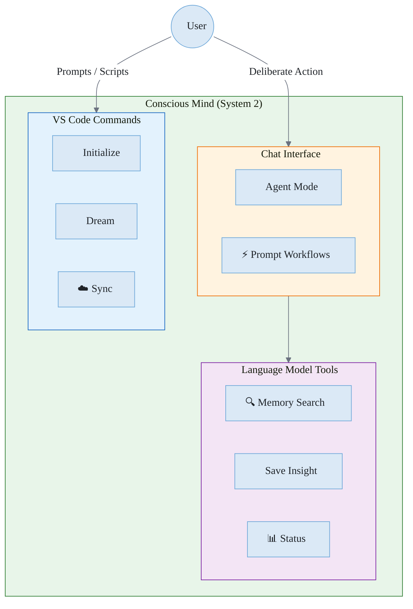
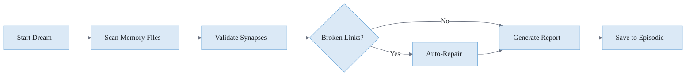
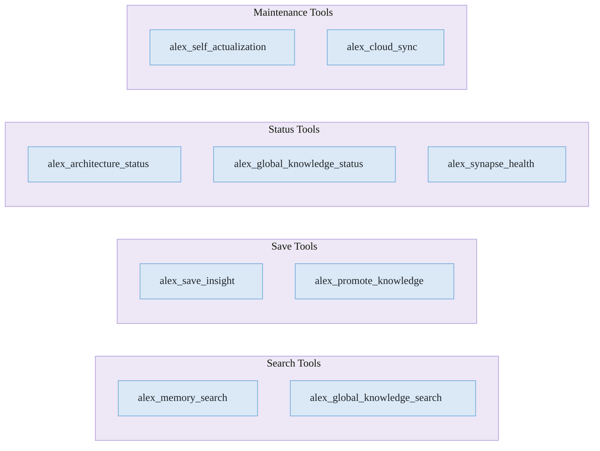
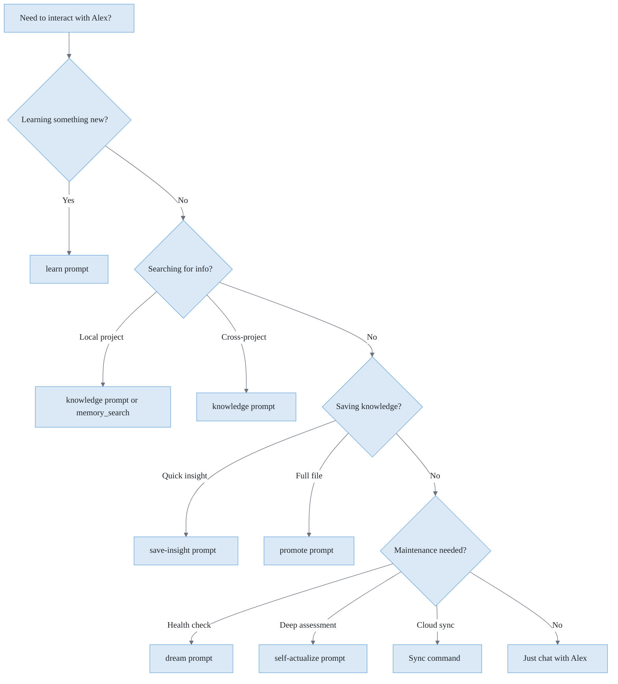

# 🌟 Conscious Mind

> User-initiated operations and explicit interactions

**Related**: [Cognitive Architecture](./COGNITIVE-ARCHITECTURE.md) · [Unconscious Mind](./UNCONSCIOUS-MIND.md) · [Memory Systems](./MEMORY-SYSTEMS.md)

---

## Overview

The **Conscious Mind** represents all operations that require explicit user action. These are deliberate, attention-requiring processes analogous to System 2 thinking in cognitive psychology.

### Pre-Task Planning (Skill Selection Optimization)

Before executing complex conscious tasks (3+ operations), Alex runs a **proactive planning phase** — Layer 2 in the [three-layer cognitive processing model](./COGNITIVE-ARCHITECTURE.md#architecture-layers):

1. **Complexity Assessment** — Classify task as simple (skip), moderate (quick scan), or complex (full protocol)
2. **Skill Survey** — Scan the action-keyword index for ALL matching capabilities
3. **Dependency Analysis** — Map sequential, parallel, prerequisite, and enhancing patterns
4. **Activation Plan** — Order skills by phase, pre-load critical knowledge, flag gaps

This eliminates the previous failure mode where skills were discovered reactively mid-task. Simple tasks skip directly to execution; complex tasks get proactive resource allocation before the first action fires.



**Figure 1:** *Conscious Mind Architecture - User-initiated operations via chat, commands, and tools*

---

## Chat Interface (Agent Mode)

The primary interface for conscious interaction. Open Copilot Chat in agent mode:

```
Ask Alex anything in agent mode
```

Alex responds with personality, context awareness, and access to all cognitive tools.

### Actions

**Table 1:** *Alex Conscious Actions (via prompts or agent mode)*

| Action            | Purpose                                 | How                                    |
| ----------------- | --------------------------------------- | -------------------------------------- |
| meditate          | Consolidate knowledge into memory files | Use the meditate prompt                |
| dream             | Run neural maintenance                  | Use the dream prompt or `brain-qa.cjs` |
| selfactualize     | Deep architecture assessment            | Use the selfactualize prompt           |
| learn [topic]     | Acquire domain knowledge                | Use the learn prompt                   |
| status            | Check architecture health               | Ask Alex for status                    |
| knowledge [query] | Search global knowledge                 | Ask Alex to search knowledge           |
| saveinsight       | Save a learning                         | Ask Alex to save an insight            |
| promote           | Promote local knowledge to global       | Ask Alex to promote a skill            |
| knowledgestatus   | View global knowledge stats             | Ask Alex for knowledge status          |

---

## Core Operations

These operations can be invoked via prompts (agent mode), scripts, or the VS Code extension:

### Initialize Architecture

Deploys the complete cognitive architecture to a new project:

- Creates `.github/` folder structure
- Installs memory files (instructions, prompts, domain knowledge)
- Sets up synapse network
- Registers project in global registry

**Script**: `node .github/muscles/sync-architecture.cjs`

### Dream (Neural Maintenance)

Runs automated health checks and repairs:



**Figure 2:** *Dream Maintenance Flow - Automated health check and repair process*

**Script**: `node .github/muscles/brain-qa.cjs` or use the dream prompt

### Self-Actualize (Deep Meditation)

Comprehensive 5-phase assessment:

1. **Synapse Health Validation** - Check all connections
2. **Version Consistency** - Verify file versions match
3. **Memory Architecture** - Assess balance of memory types
4. **Recommendation Generation** - Identify improvements
5. **Session Documentation** - Create meditation record

**Prompt**: Use the selfactualize prompt in agent mode

### Upgrade Architecture

Updates workspace files to latest version while preserving:

- Custom domain knowledge
- User-added synapses
- Episodic memory records
- Project-specific configurations

**Script**: `node .github/muscles/sync-architecture.cjs`

---

## Language Model Tools

These tools are available to AI models (in Agent mode):

### Memory & Knowledge Tools



**Figure 3:** *Language Model Tools - Available MCP tools grouped by function*

### Tool Descriptions

**Table 2:** *Alex Language Model Tool Descriptions*

| Tool                           | Purpose                                          |
| ------------------------------ | ------------------------------------------------ |
| `alex_memory_search`           | Search local memory with auto-fallback to global |
| `alex_global_knowledge_search` | Search cross-project knowledge base              |
| `alex_save_insight`            | Save valuable learning (auto-syncs)              |
| `alex_promote_knowledge`       | Promote local skill to global (auto-syncs)       |
| `alex_architecture_status`     | Check if Alex is installed and healthy           |
| `alex_global_knowledge_status` | View global knowledge statistics                 |
| `alex_synapse_health`          | Validate synaptic connections                    |
| `alex_self_actualization`      | Run comprehensive self-assessment                |
| `alex_cloud_sync`              | Manual cloud sync control                        |
| `alex_mcp_recommendations`     | Get Azure/M365 MCP tool suggestions              |
| `alex_user_profile`            | Manage user preferences                          |
| `alex_focus_context`           | Get current focus session and goals              |

---

## Decision Flow

When should you use conscious operations?



**Figure 4:** *Decision Flow - Choosing the right conscious operation for your needs*

---

## Best Practices

### 1. Regular Meditation

End productive sessions with meditation:

```
Use the meditate prompt: "I learned about the adapter pattern today and how it helps with legacy code integration"
```

### 2. Save Valuable Insights

When you solve a tricky problem:

```
Ask Alex to save insight: "The fix for React hydration mismatch is to use useEffect for client-only code"
```

### 3. Periodic Health Checks

Run dream protocol weekly:

```bash
node .github/muscles/brain-qa.cjs
```

### 4. Promote Reusable Knowledge

When skill knowledge applies to other projects:

```text
Ask Alex to promote: .github/skills/api-patterns/SKILL.md
```

---

## Integration with Unconscious Mind

The conscious mind works alongside the unconscious:

**Table 3:** *Conscious Actions and Unconscious Responses*

| Conscious Action     | Unconscious Response                   |
| -------------------- | -------------------------------------- |
| Save insight         | Auto-triggers cloud sync               |
| Promote knowledge    | Auto-triggers cloud sync               |
| Search local (empty) | Auto-fallback to global                |
| Start session        | Auto-triggers self-actualization check |
| Any conversation     | Auto-insight detection runs            |

---

*The Conscious Mind - Deliberate, Intentional, User-Controlled*
