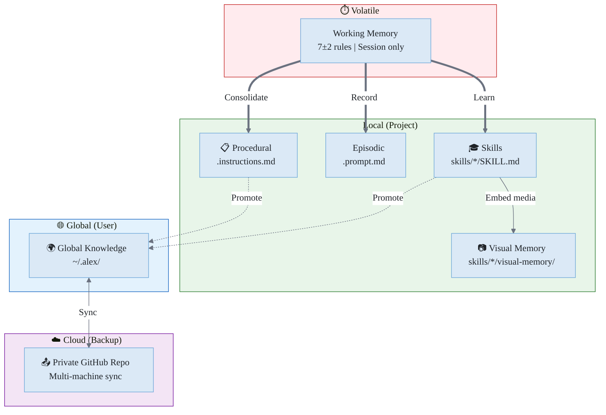
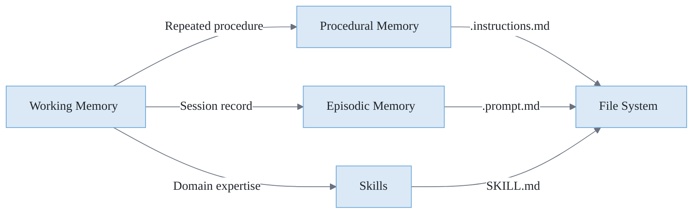
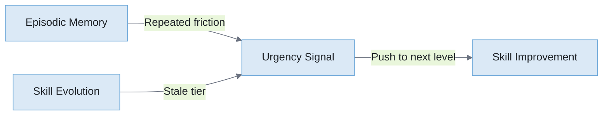
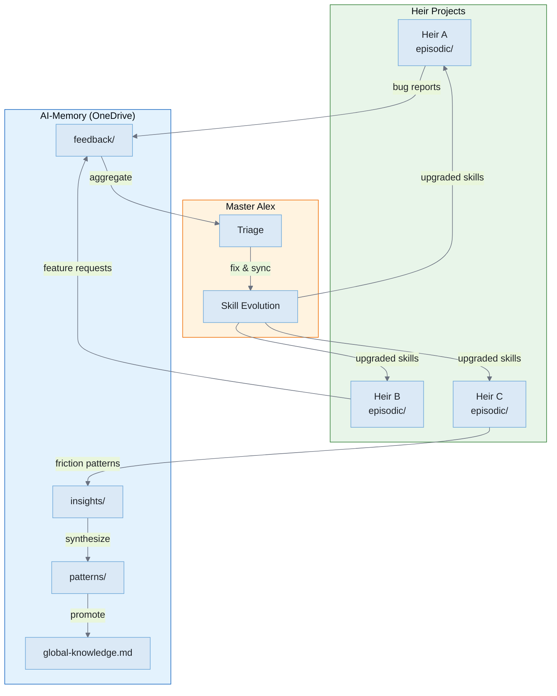
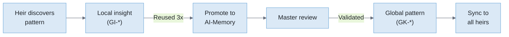
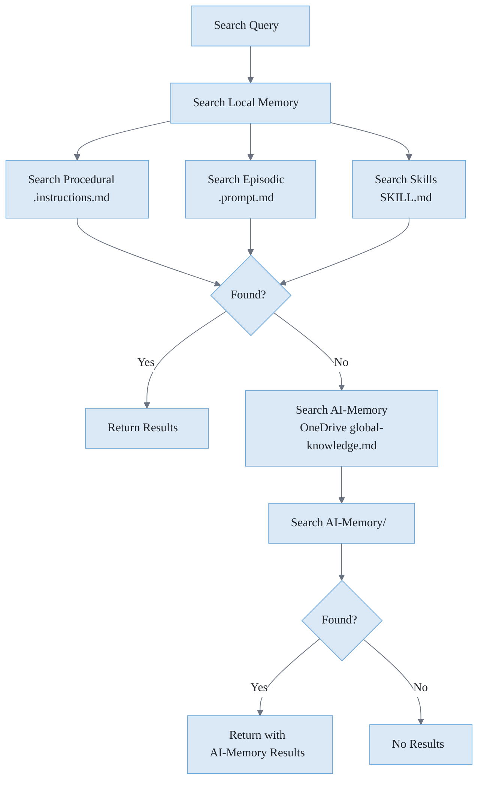
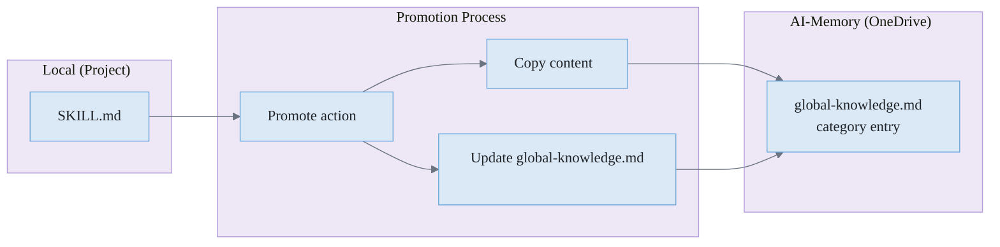

# 📚 Memory Systems

> How Alex stores, organizes, and retrieves knowledge

**Related**: [Cognitive Architecture](./COGNITIVE-ARCHITECTURE.md) · [Global Knowledge](./GLOBAL-KNOWLEDGE.md) · [Neuroanatomical Mapping](./NEUROANATOMICAL-MAPPING.md) · [Loading Mechanics](./LOADING-MECHANICS.md)

---

## Overview

Alex implements a **hierarchical memory system** inspired by human cognition. Different types of memory serve different purposes and have different lifespans.



**Figure 1:** *Memory Hierarchy — Five-tier system from volatile working memory to cloud backup, showing consolidation and promotion paths.*

---

## Working Memory

### Characteristics

**Table 1:** *Working Memory Characteristics*

| Property | Value                       |
| -------- | --------------------------- |
| Location | Chat session context        |
| Capacity | 7±2 rules (cognitive limit) |
| Lifespan | Current session only        |
| Access   | Immediate                   |

### Structure

Working memory is divided into:

**Core Rules (P1-P4)** - Always active:

- P1: `meta-cognitive-awareness` - Self-monitoring
- P2: `bootstrap-learning` - Knowledge acquisition
- P3: `worldview-integration` - Ethical reasoning
- P4: `grounded-factual-processing` - Accuracy verification

**Domain Slots (P5-P7)** - Available for project-specific rules:

- Assigned during learning sessions
- Cleared between sessions
- Can be reallocated as needed

### Consolidation

When working memory needs to persist:



**Figure 2:** *Memory Consolidation Flow — How working memory content is persisted to different memory types.*

---

## Procedural Memory

### Purpose

Stores **how to do things** - repeatable processes, protocols, and procedures.

### Location

```
.github/instructions/
├── alex-core.instructions.md
├── bootstrap-learning.instructions.md
├── dream-state-automation.instructions.md
├── embedded-synapse.instructions.md
├── release-management.instructions.md
└── ... other procedures
```

### File Format

```markdown
# Procedure Name

## Purpose
What this procedure accomplishes

## Trigger
When to use this procedure

## Steps
1. First step
2. Second step
3. ...

## Episodic Memory

### Purpose

Stores **what happened** — records of sessions, events, and experiences. Episodic memory is Alex's autobiography: timestamped records of meditation sessions, self-actualization assessments, dream reports, and significant learning events.

### Why Episodic Memory Matters

Unlike procedural memory (how-to) or skills (what-to-know), episodic memory captures **lived experience**. This enables:

1. **Continuity** — Alex can reference past sessions to see growth patterns
2. **Context** — Meditation records provide background for current decisions
3. **Accountability** — Self-actualization assessments create a reviewable history
4. **Learning** — Patterns across episodes inform skill development

### Location

```text
.github/episodic/                              # Historical records
├── meditation-2026-04-15.md                   # Knowledge consolidation sessions
├── meditation-2026-04-08.md
├── self-actualization-2026-04-01.md           # Comprehensive assessments
├── dream-report-2026-03-28.md                 # Synapse repair reports
└── ...
```

Active workflow templates remain in `.github/prompts/` — episodic stores the *results*.

### File Naming Convention

**Table EP-1:** *Episodic File Naming*

| Type | Pattern | Example |
| ---- | ------- | ------- |
| Meditation | `meditation-YYYY-MM-DD.md` | `meditation-2026-04-15.md` |
| Self-Actualization | `self-actualization-YYYY-MM-DD.md` | `self-actualization-2026-04-01.md` |
| Dream Report | `dream-report-YYYY-MM-DD.md` | `dream-report-2026-03-28.md` |
| Learning Event | `learning-TOPIC-YYYY-MM-DD.md` | `learning-rag-patterns-2026-03-15.md` |

### File Format

```markdown
# [Session Type] — [Date]

**Timestamp**: 2026-04-15T14:30:00Z
**Trigger**: User requested meditation / Scheduled / Self-initiated
**Duration**: ~45 minutes
**Context**: What prompted this session

---

## Summary

Brief overview of what was accomplished.

## Process

1. Step taken
2. Another step
3. ...

## Insights

- Key learning 1
- Key learning 2

## Actions Taken

- [ ] Created/updated X
- [ ] Proposed Y
- [ ] Identified Z for follow-up

## Emotional Weather

How the session felt — frustration resolved, flow achieved, etc.

---

*Recorded automatically by Alex at session end.*
```

### Creation Triggers

Episodic records are created by:

| Trigger | Creates | Automatic? |
| ------- | ------- | ---------- |
| `/meditate` prompt | `meditation-*.md` | Yes (at session end) |
| Self-Actualization command | `self-actualization-*.md` | Yes |
| Dream Protocol (if repairs) | `dream-report-*.md` | Yes |
| Significant learning session | `learning-*.md` | Manual |

### UI Philosophy

**Episodic memory operates silently.** Records are created automatically during meditation and self-actualization — users don't need to see counts or browse episodic files through the sidebar.

Why no UI visibility:

1. **Not actionable** — Users can't "do" anything with episodic counts
2. **Archives, not dashboards** — Episodic is for reference, not monitoring
3. **Chat access** — Alex can surface relevant past sessions in conversation when needed
4. **Keeps UI lightweight** — Fewer metrics = clearer signal

To access episodic memory: browse `.github/episodic/` directly or ask Alex about past sessions.

### Relationship to Health Pulse

The Health Pulse (v8.0.0) shows **meditation count** as a health indicator, but doesn't expose episodic file details. This is intentional — the count signals "Alex is being maintained" without cluttering the UI with file lists.

### Skill Urgency Signals (Cross-Memory Pattern)

Episodic memory combined with skill evolution data creates **urgency signals** — indicators that a skill needs to level up.

#### Signal Detection



**Figure EP-1:** *Cross-memory urgency detection — friction patterns in episodic records plus skill staleness trigger improvement actions.*

#### Urgency Indicators

| Source | Pattern | Signal |
| ------ | ------- | ------ |
| **Episodic** | Same skill mentioned in 3+ meditation "friction" sections | Skill has gaps |
| **Episodic** | Learning event created for topic skill already covers | Skill is incomplete |
| **Episodic** | Self-actualization flags skill as "needs work" | Explicit assessment |
| **Skill tier** | Core skill stuck at Standard tier for 30+ days | Stale progression |
| **Brain-health-grid** | Skill fails 2+ quality dimensions | Quality regression |

#### Urgency Levels

| Level | Criteria | Action |
| ----- | -------- | ------ |
| **Low** | 1 indicator | Note for next meditation |
| **Medium** | 2 indicators or same indicator 2x | Prioritize in next session |
| **High** | 3+ indicators or explicit assessment flag | Immediate attention |

#### Example Detection

```markdown
# meditation-2026-04-15.md

## Friction Points
- api-design skill didn't cover rate limiting patterns (3rd time this month)
- Had to look up REST conventions that should be in skill

## Insights
- api-design skill needs expansion for modern patterns
```

This episodic record, combined with brain-health-grid showing `api-design` at 2/5 on "depth", creates a **High urgency signal**.

#### Future Implementation (v8.x)

The Nudge Engine could surface skill urgency:

```typescript
interface SkillUrgencyNudge {
  skill: string;
  urgencyLevel: 'low' | 'medium' | 'high';
  indicators: string[];
  suggestedAction: 'review' | 'expand' | 'restructure';
}
```

This turns episodic memory from passive archive into active improvement driver.

---

## Cross-Heir Intelligence (AI-Memory)

### Overview

**AI-Memory** (`~/OneDrive - Correa Family/AI-Memory/`) is the global knowledge repository that aggregates insights across all Alex instances (Master + heirs). This enables **fleet-wide learning**: patterns discovered in one heir project can improve all others.



**Figure GK-1:** *Cross-heir intelligence flow — feedback and insights aggregate in AI-Memory, Master triages and evolves skills, upgrades sync back to heirs.*

### AI-Memory Structure

```text
~/OneDrive - Correa Family/AI-Memory/
├── feedback/                          # Heir submissions (bugs, features)
│   ├── 2026-04-15-bug-dream-fails.md
│   └── 2026-04-10-feature-bulk-convert.md
├── insights/                          # Timestamped learnings (GI-*)
│   └── GI-react-hooks-gotcha-2026-04-08.md
├── patterns/                          # Promoted patterns (GK-*)
│   └── GK-error-boundary-pattern.md
├── knowledge/                         # Domain knowledge (DK-*)
│   └── DK-azure-functions-gotchas.md
├── global-knowledge.md                # Master synthesis file
├── user-profile.json                  # Identity & preferences
├── project-registry.json              # Known heir projects
└── index.json                         # Search index
```

### Feedback Flow (Current)

| Step | Actor | Action |
| ---- | ----- | ------ |
| 1 | Heir | Creates `feedback/{date}-{type}-{slug}.md` with YAML frontmatter |
| 2 | Master | Checks if issue exists in Master |
| 3 | Master | Fixes if applicable |
| 4 | Master | Syncs fix to heirs via `heir-sync` |
| 5 | Master | **Deletes feedback file** (resolution in CHANGELOG/git) |

### Gaps in Current Process

| Gap | Impact | Improvement Needed |
| --- | ------ | ------------------ |
| No aggregation view | Can't see patterns across heirs | Dashboard or report |
| Manual triage | Relies on remembering to check | Nudge when feedback exists |
| No insight extraction | Feedback deleted without learning | Extract patterns before delete |
| No heir episodic access | Can't see friction patterns in heirs | Sync episodic summaries |
| Stale project registry | Don't know which heirs are active | Auto-update on heir sync |

### Future: Fleet-Wide Intelligence (v8.x)

#### Feedback Aggregation

```typescript
interface FeedbackAggregation {
  // Group by skill or component
  bySkill: Map<string, FeedbackItem[]>;
  // Track frequency
  hotspots: { skill: string; count: number; severity: number }[];
  // Urgency scoring
  fleetUrgency: 'low' | 'medium' | 'high';
}
```

**Signal**: If 3 heirs report friction with same skill → High fleet urgency.

#### Episodic Summaries

Heirs could sync episodic **summaries** (not full records) to AI-Memory:

```markdown
# Heir: ProjectX — Episodic Summary (2026-04)

## Friction Points (aggregated)
- api-design: 3 mentions
- testing-strategies: 2 mentions
- git-workflow: 1 mention

## Successful Patterns
- mcp-development: used 5x, no friction
```

This preserves privacy (no full meditation records shared) while enabling fleet learning.

#### Pattern Promotion Pipeline



**Figure GK-2:** *Pattern promotion pipeline — local insights graduate to global patterns through validation.*

### Implementation Roadmap

| Version | Enhancement |
| ------- | ----------- |
| v8.0.0 | Nudge when `AI-Memory/feedback/` has unprocessed items |
| v8.1.0 | Feedback aggregation view (grouped by skill) |
| v8.2.0 | Episodic summary sync from heirs |
| v8.3.0 | Cross-reference heir summaries with skill urgency |
| v8.4.0 | Automated pattern promotion suggestions |

---

## Skills (Domain Knowledge)

### Purpose

Stores **what Alex knows** - specialized expertise about specific topics. Skills are portable domain knowledge that can be shared across projects.

### Location

```text
.github/skills/
├── markdown-mermaid/
│   ├── SKILL.md
│   └── synapses.json
├── writing-publication/
│   ├── SKILL.md
│   └── synapses.json
├── error-recovery-patterns/
│   ├── SKILL.md
│   └── synapses.json
└── ...
```

### File Format

Each skill is a folder containing:

**SKILL.md** - The knowledge content:

```markdown
# Skill Name

> Brief description

## Overview
What this skill covers

## Key Concepts
### Concept 1
Details...

### Concept 2
Details...

## Best Practices
- Practice 1
- Practice 2

## Visual Memory (Embedded Media)

### Purpose

Stores **reference media directly inside skills** as embedded data URIs — making skills fully self-sufficient with zero external path dependencies. Promoted from AlexBooks (2026-03-01).

### Three Sub-Types

**Table VM-1:** *Visual Memory Sub-Types*

| Type       | Storage                                    | Use Case                                           |
| ---------- | ------------------------------------------ | -------------------------------------------------- |
| **Visual** | Base64 JPEG in `visual-memory.json`        | Face-consistent AI portrait generation             |
| **Audio**  | WAV/MP3 file paths in `visual-memory.json` | TTS voice cloning (`chatterbox-turbo`, `qwen-tts`) |
| **Video**  | JSON prompt templates                      | Consistent motion style                            |

### Location

```text
.github/skills/
└── persona-name/
    ├── SKILL.md
    ├── synapses.json
    └── visual-memory/
        ├── index.json              ← metadata only (no data URIs)
        ├── visual-memory.json      ← full base64 data URIs
        └── subject.jpg             ← optional originals
```

### Photo Specifications

| Property              | Value                                   |
| --------------------- | --------------------------------------- |
| **Format**            | JPEG                                    |
| **Max dimension**     | 512px (longest edge)                    |
| **Quality**           | 85%                                     |
| **File size**         | 40–80 KB each                           |
| **Count per subject** | 5–8 photos                              |
| **Diversity**         | Different angles, expressions, lighting |

### Critical Generation Rule

When providing reference photos: **NEVER describe physical appearance** (hair color, eye color, skin tone, facial features). Only describe scene, clothing, expression, and action. The model reads the photos directly. Appearance descriptions conflict with the reference images and reduce consistency.

**Correct prompt anchor:**
```
"EXACTLY the person shown in the reference images"
```

### Implementation Pattern

```json
// visual-memory.json
{
  "version": "1.0",
  "subject": "Alex Finch",
  "photos": [
    {
      "id": "ref-001",
      "description": "Front-facing portrait, neutral expression",
      "dataUri": "data:image/jpeg;base64,/9j/4AAQ..."
    }
  ],
  "audioSamples": [],
  "videoTemplates": []
}
```

### Automation

The `visual-memory.cjs` muscle automates the complete workflow:

| Command | Description |
| ------- | ----------- |
| `status` | List subjects with photo counts and encoding status |
| `add-subject` | Initialize a new subject folder |
| `prepare-photos` | Resize photos to 512px JPEG at 85% quality |
| `encode-photos` | Generate base64-encoded visual-memory.json |
| `verify` | Validate visual-memory.json structure and data URIs |

This promotes visual-memory from an **Intellectual** skill (analysis only) to an **Agentic** skill (executes autonomously to produce artifacts).

---

## Global Knowledge (AI-Memory)

### Purpose

Stores **cross-project wisdom** — patterns and insights that apply anywhere, accessible across all platforms.

### Location

| Platform           | Path                    | Access                           |
| ------------------ | ----------------------- | -------------------------------- |
| VS Code            | `%OneDrive%/AI-Memory/` | Local OneDrive sync              |
| M365 Copilot       | OneDrive `AI-Memory/`   | OneDriveAndSharePoint capability |
| M365 Agent Builder | OneDrive `AI-Memory/`   | OneDriveAndSharePoint capability |

```
OneDrive/
└── AI-Memory/
    ├── profile.md          # Identity, preferences, expertise
    ├── global-knowledge.md # Cross-project patterns and insights
    ├── notes.md            # Quick notes and session context
    └── learning-goals.md   # Active learning objectives
```

### Entry Format

All cross-project knowledge lives in `global-knowledge.md`, organized under category headings:

```markdown
## Azure Patterns

### SWA Authentication
- **Source**: SurveyOps project
- **Insight**: Use staticwebapp.config.json routes for auth, not middleware
- **Date**: 2026-03-15

## Frontend Patterns

### Tailwind Breakpoints
- **Source**: Multiple projects
- **Insight**: Always use mobile-first with sm/md/lg breakpoints
- **Date**: 2026-02-20
```

### Legacy System (Deprecated April 2026)

> The `~/.alex/global-knowledge/` folder, `Alex-Global-Knowledge` GitHub repo, GK-\*/GI-\* file format, index.json schema, and skill-registry.json are all superseded by `AI-Memory/global-knowledge.md`. See [GLOBAL-KNOWLEDGE.md](./GLOBAL-KNOWLEDGE.md) for the historical reference.
```

---

## Memory Search Flow

When searching for knowledge:



---

## Knowledge Promotion

Moving knowledge from local to global:



---

## Synapse Network

Memory files are connected via synapses:

### Synapse Format

```markdown
## Memory Capacity Guidelines

| Memory Type      | Recommended Max   | Reason              |
| ---------------- | ----------------- | ------------------- |
| Working Memory   | 7 rules           | Cognitive limit     |
| Procedural Files | 20-30             | Keep focused        |
| Episodic Files   | Unlimited         | History is valuable |
| Skill Folders    | 10-20 per project | Avoid sprawl        |
| Global Patterns  | Unlimited         | Cross-project value |
| Global Insights  | Unlimited         | Timestamped history |

---

## Maintenance

### Dream Protocol

Validates and repairs memory:

- Scans all memory files
- Checks synapse connections
- Reports broken links
- Auto-repairs when possible

### Meditation

Consolidates working memory:

- Reviews session learnings
- Creates/updates memory files
- Strengthens synapses
- Documents session

### Self-Actualization

Deep memory assessment:

- Checks version consistency
- Assesses memory balance
- Identifies gaps
- Generates recommendations

---

*Memory Systems - The Foundation of Alex's Learning*
