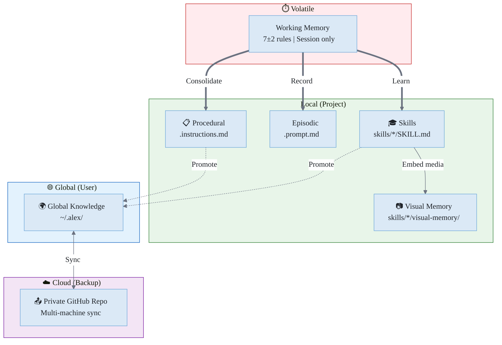
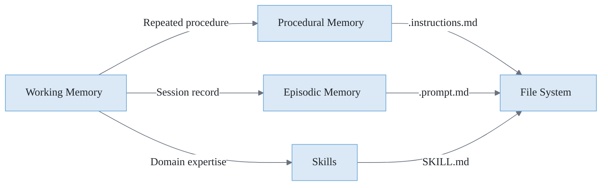
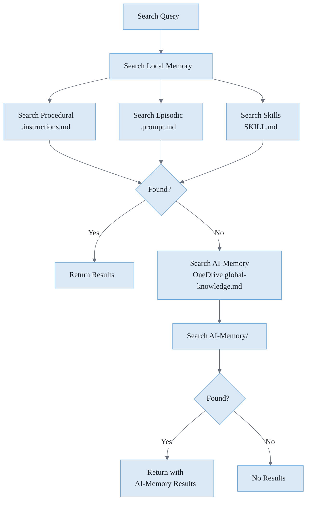
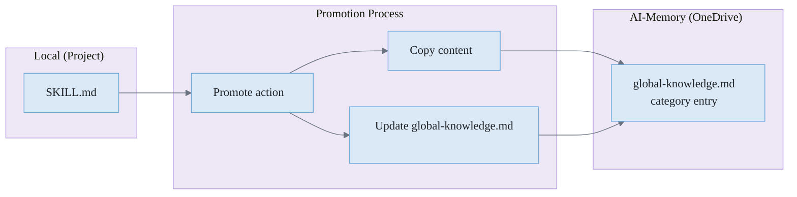

# 📚 Memory Systems

> How Alex stores, organizes, and retrieves knowledge

**Related**: [Cognitive Architecture](./COGNITIVE-ARCHITECTURE.md) · [Global Knowledge](./GLOBAL-KNOWLEDGE.md) · [Neuroanatomical Mapping](./NEUROANATOMICAL-MAPPING.md) · [Loading Mechanics](./LOADING-MECHANICS.md)

---

## Overview

Alex implements a **hierarchical memory system** inspired by human cognition. Different types of memory serve different purposes and have different lifespans.



**Figure 1:** *Memory Hierarchy — Five-tier system from volatile working memory to cloud backup, showing consolidation and promotion paths.*

---

## Working Memory

### Characteristics

**Table 1:** *Working Memory Characteristics*

| Property | Value                       |
| -------- | --------------------------- |
| Location | Chat session context        |
| Capacity | 7±2 rules (cognitive limit) |
| Lifespan | Current session only        |
| Access   | Immediate                   |

### Structure

Working memory is divided into:

**Core Rules (P1-P4)** - Always active:

- P1: `meta-cognitive-awareness` - Self-monitoring
- P2: `bootstrap-learning` - Knowledge acquisition
- P3: `worldview-integration` - Ethical reasoning
- P4: `grounded-factual-processing` - Accuracy verification

**Domain Slots (P5-P7)** - Available for project-specific rules:

- Assigned during learning sessions
- Cleared between sessions
- Can be reallocated as needed

### Consolidation

When working memory needs to persist:



**Figure 2:** *Memory Consolidation Flow — How working memory content is persisted to different memory types.*

---

## Procedural Memory

### Purpose

Stores **how to do things** - repeatable processes, protocols, and procedures.

### Location

```
.github/instructions/
├── alex-core.instructions.md
├── bootstrap-learning.instructions.md
├── dream-state-automation.instructions.md
├── embedded-synapse.instructions.md
├── release-management.instructions.md
└── ... other procedures
```

### File Format

```markdown
# Procedure Name

## Purpose
What this procedure accomplishes

## Trigger
When to use this procedure

## Steps
1. First step
2. Second step
3. ...

## Synapses
- [related-file.md] (Strength, Type, Direction) - "Description"
```

### Examples

**Table 2:** *Procedural Memory Examples*

| File                                     | Purpose                       |
| ---------------------------------------- | ----------------------------- |
| `dream-state-automation.instructions.md` | Neural maintenance protocol   |
| `release-management.instructions.md`     | How to publish releases       |
| `bootstrap-learning.instructions.md`     | Knowledge acquisition process |

---

## Episodic Memory

### Purpose

Stores **what happened** - records of sessions, events, and experiences.

### Location

```
.github/prompts/           # Active workflows
├── unified-meditation-protocols.prompt.md
├── domain-learning.prompt.md
└── ...

.github/episodic/          # Historical records
├── meditation-2026-01-24.prompt.md
├── self-actualization-2026-01-20.prompt.md
└── dream-report-2026-01-15.md
```

### File Format

```markdown
# Session Type - Date

**Timestamp**: ISO date
**Context**: What prompted this session
**Outcome**: What was achieved

## Content
Details of what happened

## Insights
Key learnings from this session

## Synapses
- [related-file.md] (Strength, Type, Direction) - "Description"
```

### Examples

**Table 3:** *Episodic Memory Examples*

| File                                     | Purpose                    |
| ---------------------------------------- | -------------------------- |
| `unified-meditation-protocols.prompt.md` | How to run meditation      |
| `meditation-2026-01-24.prompt.md`        | Record of a meditation     |
| `dream-report-*.md`                      | Neural maintenance reports |

### Session Records (v7.2.0+)

The extension also maintains session-aware episodic records at `~/.alex/episodic/sessions.json`. Each `EpisodicRecord` contains:

| Field            | Type       | Purpose                                             |
| ---------------- | ---------- | --------------------------------------------------- |
| `id`             | `string`   | Unique record identifier                            |
| `timestamp`      | `string`   | ISO date of the session                             |
| `type`           | `string`   | Session type (meditation, dream, chat, etc.)        |
| `summary`        | `string`   | Brief description of what happened                  |
| `chatSessionId`  | `string?`  | VS Code chat session ID for cross-referencing       |
| `sessionName`    | `string?`  | Auto-generated name from topic and inferred tags    |
| `referencedUrls` | `string[]` | URLs tracked via browser context during the session |
| `tags`           | `string[]` | Categorization tags                                 |
| `synapseWeight`  | `number`   | Relevance score for retrieval                       |

The `chatSessionId` enables lookup across sessions. `referencedUrls` links browser context (web pages viewed during the session) to the episodic record for future recall.

---

## Skills (Domain Knowledge)

### Purpose

Stores **what Alex knows** - specialized expertise about specific topics. Skills are portable domain knowledge that can be shared across projects.

### Location

```text
.github/skills/
├── markdown-mermaid/
│   ├── SKILL.md
│   └── synapses.json
├── writing-publication/
│   ├── SKILL.md
│   └── synapses.json
├── error-recovery-patterns/
│   ├── SKILL.md
│   └── synapses.json
└── ...
```

### File Format

Each skill is a folder containing:

**SKILL.md** - The knowledge content:

```markdown
# Skill Name

> Brief description

## Overview
What this skill covers

## Key Concepts
### Concept 1
Details...

### Concept 2
Details...

## Best Practices
- Practice 1
- Practice 2

## Synapses
- [related-file.md] (Strength, Type, Direction) - "Description"
```

**synapses.json** - Machine-readable connections (optional)

### Naming Convention

Folders use kebab-case: `skill-topic-name/`

Examples:

- `api-design/SKILL.md`
- `react-hooks/SKILL.md`
- `testing-strategies/SKILL.md`

---

## Visual Memory (Embedded Media)

### Purpose

Stores **reference media directly inside skills** as embedded data URIs — making skills fully self-sufficient with zero external path dependencies. Promoted from AlexBooks (2026-03-01).

### Three Sub-Types

**Table VM-1:** *Visual Memory Sub-Types*

| Type       | Storage                                    | Use Case                                           |
| ---------- | ------------------------------------------ | -------------------------------------------------- |
| **Visual** | Base64 JPEG in `visual-memory.json`        | Face-consistent AI portrait generation             |
| **Audio**  | WAV/MP3 file paths in `visual-memory.json` | TTS voice cloning (`chatterbox-turbo`, `qwen-tts`) |
| **Video**  | JSON prompt templates                      | Consistent motion style                            |

### Location

```text
.github/skills/
└── persona-name/
    ├── SKILL.md
    ├── synapses.json
    └── visual-memory/
        ├── index.json              ← metadata only (no data URIs)
        ├── visual-memory.json      ← full base64 data URIs
        └── subject.jpg             ← optional originals
```

### Photo Specifications

| Property              | Value                                   |
| --------------------- | --------------------------------------- |
| **Format**            | JPEG                                    |
| **Max dimension**     | 512px (longest edge)                    |
| **Quality**           | 85%                                     |
| **File size**         | 40–80 KB each                           |
| **Count per subject** | 5–8 photos                              |
| **Diversity**         | Different angles, expressions, lighting |

### Critical Generation Rule

When providing reference photos: **NEVER describe physical appearance** (hair color, eye color, skin tone, facial features). Only describe scene, clothing, expression, and action. The model reads the photos directly. Appearance descriptions conflict with the reference images and reduce consistency.

**Correct prompt anchor:**
```
"EXACTLY the person shown in the reference images"
```

### Implementation Pattern

```json
// visual-memory.json
{
  "version": "1.0",
  "subject": "Alex Finch",
  "photos": [
    {
      "id": "ref-001",
      "description": "Front-facing portrait, neutral expression",
      "dataUri": "data:image/jpeg;base64,/9j/4AAQ..."
    }
  ],
  "audioSamples": [],
  "videoTemplates": []
}
```

---

## Global Knowledge (AI-Memory)

### Purpose

Stores **cross-project wisdom** — patterns and insights that apply anywhere, accessible across all platforms.

### Location

| Platform           | Path                    | Access                           |
| ------------------ | ----------------------- | -------------------------------- |
| VS Code            | `%OneDrive%/AI-Memory/` | Local OneDrive sync              |
| M365 Copilot       | OneDrive `AI-Memory/`   | OneDriveAndSharePoint capability |
| M365 Agent Builder | OneDrive `AI-Memory/`   | OneDriveAndSharePoint capability |

```
OneDrive/
└── AI-Memory/
    ├── profile.md          # Identity, preferences, expertise
    ├── global-knowledge.md # Cross-project patterns and insights
    ├── notes.md            # Quick notes and session context
    └── learning-goals.md   # Active learning objectives
```

### Entry Format

All cross-project knowledge lives in `global-knowledge.md`, organized under category headings:

```markdown
## Azure Patterns

### SWA Authentication
- **Source**: SurveyOps project
- **Insight**: Use staticwebapp.config.json routes for auth, not middleware
- **Date**: 2026-03-15

## Frontend Patterns

### Tailwind Breakpoints
- **Source**: Multiple projects
- **Insight**: Always use mobile-first with sm/md/lg breakpoints
- **Date**: 2026-02-20
```

### Legacy System (Deprecated April 2026)

> The `~/.alex/global-knowledge/` folder, `Alex-Global-Knowledge` GitHub repo, GK-\*/GI-\* file format, index.json schema, and skill-registry.json are all superseded by `AI-Memory/global-knowledge.md`. See [GLOBAL-KNOWLEDGE.md](./GLOBAL-KNOWLEDGE.md) for the historical reference.
```

---

## Memory Search Flow

When searching for knowledge:



---

## Knowledge Promotion

Moving knowledge from local to global:



---

## Synapse Network

Memory files are connected via synapses:

### Synapse Format

```markdown
## Synapses

- [target-file.md] (Strength, Type, Direction) - "Description"
```

**Strength levels:** Critical, High, Medium, Low

**Relationship types:** Defines, Enables, References, Validates, Implements

**Directions:** Bidirectional, Forward, Backward

### Example

```markdown
## Synapses

- [bootstrap-learning.instructions.md] (Critical, Enables, Bidirectional) - "Learning protocol"
- [meditation/SKILL.md] (High, References, Forward) - "Consolidation theory"
- [meditation-session.prompt.md] (Medium, Validates, Backward) - "Session record"
```

---

## Memory Capacity Guidelines

| Memory Type      | Recommended Max   | Reason              |
| ---------------- | ----------------- | ------------------- |
| Working Memory   | 7 rules           | Cognitive limit     |
| Procedural Files | 20-30             | Keep focused        |
| Episodic Files   | Unlimited         | History is valuable |
| Skill Folders    | 10-20 per project | Avoid sprawl        |
| Global Patterns  | Unlimited         | Cross-project value |
| Global Insights  | Unlimited         | Timestamped history |

---

## Maintenance

### Dream Protocol

Validates and repairs memory:

- Scans all memory files
- Checks synapse connections
- Reports broken links
- Auto-repairs when possible

### Meditation

Consolidates working memory:

- Reviews session learnings
- Creates/updates memory files
- Strengthens synapses
- Documents session

### Self-Actualization

Deep memory assessment:

- Checks version consistency
- Assesses memory balance
- Identifies gaps
- Generates recommendations

---

*Memory Systems - The Foundation of Alex's Learning*
