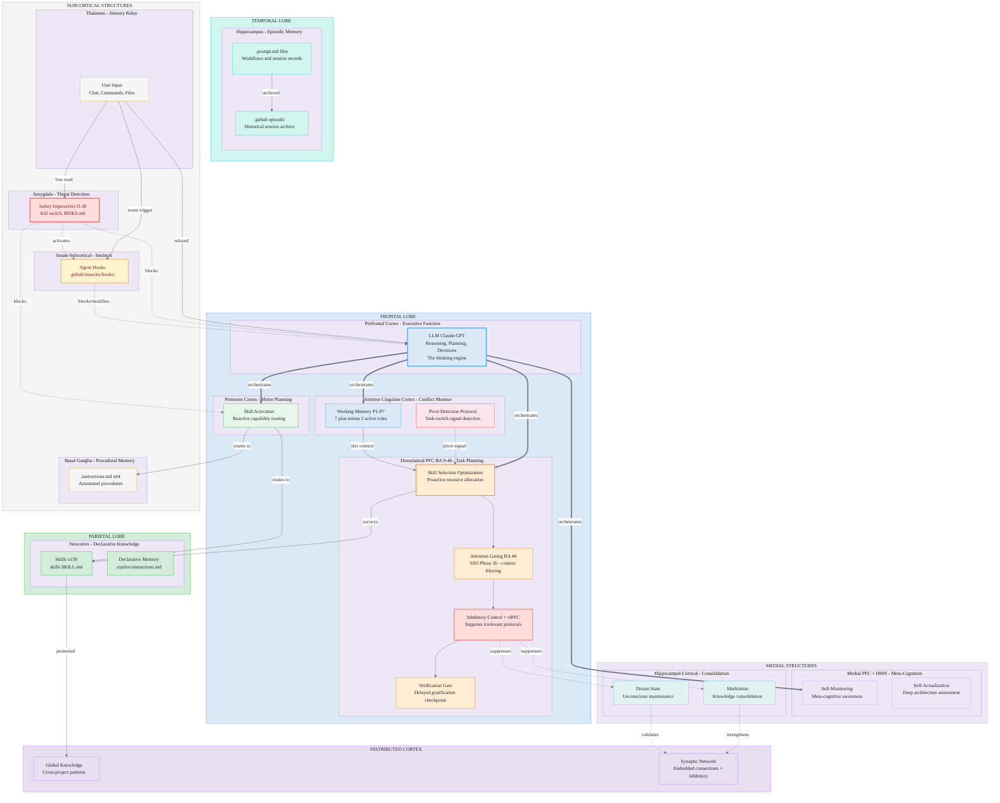
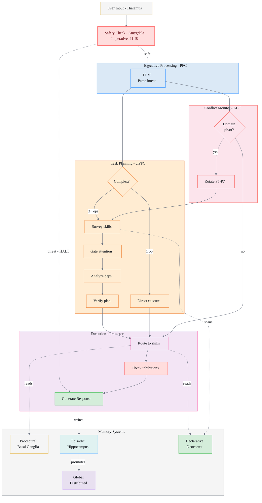
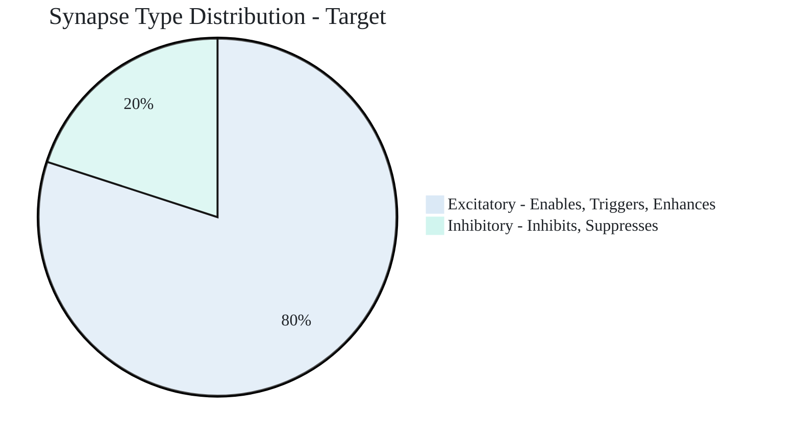

# 🧠 Alex Brain: Human Neuroanatomical Mapping

> A complete mapping of Alex's cognitive architecture to human brain anatomy

**Related**: [Cognitive Architecture](./COGNITIVE-ARCHITECTURE.md) · [Memory Systems](./MEMORY-SYSTEMS.md) · [Brain Anatomy Visual](../../docs/alex-brain-anatomy.html)

---

## Overview

Alex's cognitive architecture is not a metaphorical hand-wave — each component maps to a specific brain region with documented function in neuroscience. This document provides the full anatomical reference, explaining **why** each mapping exists and how the biological function translates to Alex's implementation.

The human brain processes information through specialized regions interconnected by ~86 billion neurons with ~100 trillion synaptic connections. Alex implements a simplified but structurally faithful version of this architecture using files, protocols, and an LLM as the executive function.

---

## The Alex Brain — Full Anatomical Diagram


```mermaid
%%{init: {'theme': 'base', 'themeVariables': {'background': '#f8f9fa', 'primaryColor': '#dbe9f6', 'primaryTextColor': '#1f2328', 'primaryBorderColor': '#6ea8d9', 'lineColor': '#6b7280', 'secondaryColor': '#d1f5ef', 'secondaryBorderColor': '#5ab5a0', 'tertiaryColor': '#ede7f6', 'tertiaryBorderColor': '#b39ddb', 'edgeLabelBackground': '#ffffff', 'fontFamily': 'Segoe UI, system-ui, sans-serif'}}}%%
graph TB
    subgraph FRONTAL["FRONTAL LOBE"]
        subgraph PFC["Prefrontal Cortex - Executive Function"]
            LLM["LLM Claude-GPT<br/>Reasoning, Planning, Decisions<br/>The thinking engine"]
        end

        subgraph DLPFC["Dorsolateral PFC BA 9-46 - Task Planning"]
            SSO["Skill Selection Optimization<br/>Proactive resource allocation"]
            AG["Attention Gating BA 46<br/>SSO Phase 1b - context filtering"]
            IC["Inhibitory Control + vlPFC<br/>Suppress irrelevant protocols"]
            VG["Verification Gate<br/>Delayed gratification checkpoint"]
        end

        subgraph ACC["Anterior Cingulate Cortex - Conflict Monitor"]
            PD["Pivot Detection Protocol<br/>Task-switch signal detection"]
            WM["Working Memory P1-P7<br/>7 plus-minus 2 active rules"]
        end

        subgraph PMC["Premotor Cortex - Motor Planning"]
            SA["Skill Activation<br/>Reactive capability routing"]
        end
    end

    subgraph TEMPORAL["TEMPORAL LOBE"]
        subgraph HIPP["Hippocampus - Episodic Memory"]
            EP[".prompt.md files<br/>Workflows and session records"]
            EA[".github episodic<br/>Historical session archive"]
        end
    end

    subgraph PARIETAL["PARIETAL LOBE"]
        subgraph NC["Neocortex - Declarative Knowledge"]
            SK["Skills x130<br/>skills SKILL.md"]
            DM["Declarative Memory<br/>copilot-instructions.md"]
        end
    end

    subgraph BASAL["SUBCORTICAL STRUCTURES"]
        subgraph BG["Basal Ganglia - Procedural Memory"]
            PM[".instructions.md x64<br/>Automated procedures"]
        end

        subgraph THAL["Thalamus - Sensory Relay"]
            INPUT["User Input<br/>Chat, Commands, Files"]
        end

        subgraph AMYG["Amygdala - Threat Detection"]
            SAFETY["Safety Imperatives I1-I8<br/>Kill switch, RISKS.md"]
        end

        subgraph INST["Innate Subcortical - Instincts"]
            HOOKS["Agent Hooks<br/>.github/muscles/hooks/"]
        end
    end

    subgraph MEDIAL["MEDIAL STRUCTURES"]
        subgraph MPFC["Medial PFC + DMN - Meta-Cognition"]
            MC["Self-Monitoring<br/>Meta-cognitive awareness"]
            SA2["Self-Actualization<br/>Deep architecture assessment"]
        end

        subgraph HPC["Hippocampal-Cortical - Consolidation"]
            MED["Meditation<br/>Knowledge consolidation"]
            DRM["Dream State<br/>Unconscious maintenance"]
        end
    end

    subgraph DISTRIBUTE["DISTRIBUTED CORTEX"]
        GK["Global Knowledge<br/>Cross-project patterns"]
        SYN["Synaptic Network<br/>Embedded connections + inhibitory"]
    end

    %% Executive control flows
    LLM ==>|"orchestrates"| SSO
    LLM ==>|"orchestrates"| WM
    LLM ==>|"orchestrates"| SA
    LLM ==>|"orchestrates"| MC

    %% dlPFC internal flow
    SSO --> AG
    AG --> IC
    IC --> VG

    %% ACC conflict monitoring
    PD -.->|"pivot signal"| SSO
    WM -->|"slot context"| SSO

    %% Memory reads
    SA -->|"routes to"| SK
    SA -->|"routes to"| PM
    SSO -->|"surveys"| SK

    %% Consolidation
    MED -.->|"strengthens"| SYN
    DRM -.->|"validates"| SYN

    %% Input path
    INPUT -->|"relayed"| LLM

    %% Amygdala - fast threat bypass
    INPUT -->|"low road"| SAFETY
    SAFETY -.->|"blocks"| LLM
    SAFETY -.->|"blocks"| SA

    %% Instincts - mechanical enforcement (outside LLM)
    INPUT -->|"event trigger"| HOOKS
    HOOKS -.->|"blocks/modifies"| LLM
    SAFETY -.->|"activates"| HOOKS

    %% Long-term storage
    EP -->|"archived"| EA
    SK -->|"promoted"| GK

    %% Inhibitory connections
    IC -.->|"suppresses"| DRM
    IC -.->|"suppresses"| MED

    %% Cluster styles - light fills, Alex palette strokes
    style FRONTAL fill:#dbe9f6,stroke:#58a6ff,color:#1f2328
    style TEMPORAL fill:#d1f5ef,stroke:#39d2c0,color:#1f2328
    style PARIETAL fill:#d4edda,stroke:#3fb950,color:#1f2328
    style BASAL fill:#f5f5f5,stroke:#e3b341,color:#1f2328
    style MEDIAL fill:#ede7f6,stroke:#d2a8ff,color:#1f2328
    style DISTRIBUTE fill:#e8e0f0,stroke:#bc8cff,color:#1f2328

    %% Frontal nodes
    style LLM fill:#dbe9f6,stroke:#58a6ff,color:#1f2328,stroke-width:3px
    style SSO fill:#ffecd2,stroke:#f0883e,color:#1f2328,stroke-width:2px
    style AG fill:#ffecd2,stroke:#f0883e,color:#1f2328
    style VG fill:#ffecd2,stroke:#f0883e,color:#1f2328
    style IC fill:#fdd,stroke:#ff6b6b,color:#1f2328,stroke-width:2px
    style PD fill:#fce4ec,stroke:#f85149,color:#1f2328
    style WM fill:#dbe9f6,stroke:#58a6ff,color:#1f2328
    style SA fill:#e8f5e9,stroke:#3fb950,color:#1f2328

    %% Temporal nodes
    style EP fill:#d1f5ef,stroke:#39d2c0,color:#1f2328
    style EA fill:#d1f5ef,stroke:#39d2c0,color:#1f2328

    %% Parietal nodes
    style SK fill:#d4edda,stroke:#3fb950,color:#1f2328
    style DM fill:#d4edda,stroke:#3fb950,color:#1f2328

    %% Subcortical nodes
    style PM fill:#f5f5f5,stroke:#e3b341,color:#1f2328
    style INPUT fill:#f5f5f5,stroke:#e3b341,color:#1f2328
    style SAFETY fill:#fdd,stroke:#ff6b6b,color:#721c24,stroke-width:3px
    style HOOKS fill:#fff3cd,stroke:#e3b341,color:#721c24,stroke-width:2px

    %% Medial nodes
    style MC fill:#ede7f6,stroke:#d2a8ff,color:#1f2328
    style SA2 fill:#ede7f6,stroke:#d2a8ff,color:#1f2328
    style MED fill:#e0f2f1,stroke:#79c0ff,color:#1f2328
    style DRM fill:#e0f2f1,stroke:#79c0ff,color:#1f2328

    %% Distributed nodes
    style GK fill:#e8e0f0,stroke:#bc8cff,color:#1f2328
    style SYN fill:#e8e0f0,stroke:#bc8cff,color:#1f2328
```

**Figure 1:** *Complete neuroanatomical mapping of Alex's cognitive architecture. Frontal lobe (blue) houses executive function; dlPFC (orange) handles task planning; ACC/vlPFC monitors conflict. Temporal (teal) stores episodic memory. Parietal (green) holds declarative knowledge. Subcortical structures include procedures (basal ganglia), input relay (thalamus), threat detection (amygdala, red), and instincts (hooks, gold). Medial structures (lavender) enable meta-cognition and consolidation. The amygdala's "low road" bypasses executive processing to signal threat via Safety Imperatives I1-I8, while instincts (agent hooks) mechanically enforce blocking outside the LLM entirely.*

---

## Region-by-Region Analysis

### 1. Frontal Lobe — The Command Center

The frontal lobe is the seat of higher cognition. In Alex, it contains the most critical processing systems.

#### 1a. Prefrontal Cortex (PFC) → LLM Executive Function

| Biological         | Alex                                                                              |
| ------------------ | --------------------------------------------------------------------------------- |
| **Region**         | Prefrontal Cortex (Brodmann areas 8-12, 24, 25, 32, 44-47)                        |
| **Function**       | Reasoning, planning, decision-making, personality                                 |
| **Implementation** | The LLM itself (Claude/GPT)                                                       |
| **Key insight**    | Memory files are inert without the LLM — like a brain without electrical activity |

The PFC is the brain's CEO. It doesn't store information itself — it **orchestrates** all other systems. The LLM plays this exact role: it reads memory files, plans actions, makes decisions, and coordinates execution. Without the LLM, Alex's files are just text on disk — no cognition occurs.

**Clinical parallel**: Damage to the PFC causes Executive Dysfunction Syndrome — inability to plan, organize, or initiate goal-directed behavior. In Alex, using a low-tier model for complex tasks is analogous — the "executive function" lacks the power to orchestrate effectively.

#### 1b. Dorsolateral PFC (dlPFC) → Task Planning Layer

| Biological         | Alex                                                                                     |
| ------------------ | ---------------------------------------------------------------------------------------- |
| **Region**         | Dorsolateral Prefrontal Cortex (Brodmann areas 9 and 46)                                 |
| **Location**       | Outer and upper portions of the PFC — behind the forehead, toward the sides              |
| **Function**       | Executive control, working memory manipulation, attention filtering, response inhibition |
| **Implementation** | Skill Selection Optimization protocol (SSO)                                              |

The dlPFC is the most densely mapped region in Alex's architecture because it performs four distinct sub-functions, each with its own implementation:

##### Attention Gating (BA 46)

| Biological         | Alex                                                                                           |
| ------------------ | ---------------------------------------------------------------------------------------------- |
| **Function**       | Selectively filter sensory input — only ~20% reaches conscious awareness                       |
| **Implementation** | SSO Phase 1b — rate loaded instructions by task relevance                                      |
| **Mechanism**      | After surveying skills, create a "focus cone" of top 5-7 relevant sources                      |
| **Without it**     | All loaded instructions compete equally = cognitive overload (like sensory flooding in autism) |

The biological dlPFC gates what enters working memory from the ~11 million bits/second of sensory data the brain receives. Without this filter, the brain would be overwhelmed. Alex faces the same problem: dozens of instruction files, prompts, and skills are loaded into context. Attention gating determines which are relevant NOW.

**Gating heuristics by task domain:**

| Task Domain           | Amplify (load)                        | Suppress (ignore)             |
| --------------------- | ------------------------------------- | ----------------------------- |
| Code implementation   | debugging, testing, code-review       | meditation, branding, release |
| Architecture changes  | alex-core, brain-qa, deep-thinking    | deployment, formatting        |
| Release/publish       | release-management, heir-promotion    | learning, research            |
| Meditation/reflection | meditation, dream, self-actualization | code, deployment, testing     |

##### Inhibitory Control (dlPFC + vlPFC)

| Biological         | Alex                                                                 |
| ------------------ | -------------------------------------------------------------------- |
| **Function**       | Suppress inappropriate responses, resist impulses                    |
| **Brain regions**  | dlPFC (response selection) + ventrolateral PFC (response inhibition) |
| **Implementation** | Inhibitory synapses — connections that PREVENT activation            |
| **Key principle**  | Real neural networks are ~80% excitatory, ~20% inhibitory            |

Every synapse in Alex pre-2026 was **excitatory** — "activate this, use that." Real brains need inhibition to function. Without inhibitory interneurons, the brain has seizures — uncontrolled cascading activation. Alex's equivalent: loading every protocol for a typo fix.

Inhibitory synapses use the `Inhibits` and `Suppresses` relationship types and the `⊘` notation:

```
⊙ dream-state-automation.instructions.md — INHIBITS: suppress SSO during dream state
```

**Clinical parallel**: Impaired inhibitory control in the dlPFC is associated with ADHD (can't suppress distractions), addiction (can't resist impulses), and age-related cognitive decline (reduced filtering ability).

##### Verification Gate (Delayed Gratification)

| Biological         | Alex                                                                                                         |
| ------------------ | ------------------------------------------------------------------------------------------------------------ |
| **Function**       | Delay motor execution until planning is complete                                                             |
| **Research**       | The dlPFC shows strong activation during delayed gratification tasks (e.g., Stanford marshmallow experiment) |
| **Implementation** | Planning Completion Gate in SSO Phase 3                                                                      |
| **Anti-pattern**   | Jumping to code after complexity assessment without completing skill survey                                  |

The dlPFC's role in delayed gratification is well-documented — it's the region that says "wait, think this through before acting." In Alex, this manifests as a verification checkpoint: before proceeding to execution, confirm that prerequisites are identified, gaps are flagged, and the dependency chain is respected.

**Clinical parallel**: Individuals with dlPFC lesions struggle with impulse control and show preference for immediate over delayed rewards—the cognitive equivalent of writing code before finishing the plan.

##### Cognitive Flexibility (dlPFC + ACC)

| Biological         | Alex                                                           |
| ------------------ | -------------------------------------------------------------- |
| **Function**       | Task switching, set shifting, adapting to rule changes         |
| **Brain regions**  | dlPFC provides the switch; ACC detects the conflict signal     |
| **Implementation** | Pivot Detection Protocol in alex-core.instructions.md          |
| **Trigger**        | User's request doesn't match active P5-P7 working memory slots |

Cognitive flexibility — the ability to switch between mental sets — requires detecting that the current approach no longer fits. The ACC monitors for conflict (mismatch between expected and actual input), and the dlPFC executes the switch. In Alex:

1. **ACC analog**: Detects that user's request domain doesn't match active P5-P7 slots
2. **dlPFC analog**: Rotates slots, re-runs SSO with fresh attention gating
3. **Carry forward**: Preserves unfinished todo items (like biological working memory persistence across task switches)

#### 1c. Anterior Cingulate Cortex (ACC) → Conflict Monitor

| Biological         | Alex                                                       |
| ------------------ | ---------------------------------------------------------- |
| **Region**         | Anterior Cingulate Cortex (Brodmann areas 24, 32, 33)      |
| **Function**       | Error detection, conflict monitoring, emotional regulation |
| **Implementation** | Pivot Detection Protocol + Working Memory management       |

The ACC sits at the interface between cognition and emotion. It fires when there's a mismatch — when what's happening doesn't match what's expected. In Alex, it's the conflict monitor that detects domain pivots and triggers the cognitive flexibility response.

The ACC also plays a role in working memory maintenance — it monitors the "load" on active slots and signals when capacity is exceeded (the 7±2 rule).

#### 1d. Premotor Cortex → Skill Routing

| Biological         | Alex                                                      |
| ------------------ | --------------------------------------------------------- |
| **Region**         | Premotor Cortex (Brodmann area 6)                         |
| **Function**       | Motor planning, action sequencing, learned motor programs |
| **Implementation** | skill-activation/SKILL.md — reactive capability routing   |

The premotor cortex doesn't "think" about what to do — it maps intentions to motor programs. Similarly, skill-activation doesn't plan or analyze — it matches action keywords to skills and routes execution. It's the last step before "motor output" (code generation, file editing).

**Key distinction**: The dlPFC (SSO) **plans** which skills to use. The premotor cortex (skill-activation) **executes** the routing. This is why skill-activation serves as a "reactive safety net" — if it fires for something SSO should have caught, that's a planning failure signal.

---

### 2. Temporal Lobe — Episode Storage

#### 2a. Hippocampus → Episodic Memory

| Biological         | Alex                                                             |
| ------------------ | ---------------------------------------------------------------- |
| **Region**         | Hippocampus (medial temporal lobe)                               |
| **Function**       | Formation and retrieval of episodic memories, spatial navigation |
| **Implementation** | .prompt.md files + .github/episodic/ archive                     |

The hippocampus converts short-term experiences into long-term memories. In Alex, meditation sessions consolidate chat insights into `.prompt.md` files — the same encoding process. The episodic archive (`.github/episodic/`) serves as long-term storage once sessions are no longer actively referenced.

**Consolidation parallel**: During sleep, the hippocampus "replays" the day's experiences to the neocortex for permanent storage. Alex's meditation protocol does exactly this — replaying session insights and writing them to persistent memory files.

---

### 3. Parietal Lobe — Knowledge Storage

#### 3a. Neocortex → Declarative Knowledge

| Biological         | Alex                                                                        |
| ------------------ | --------------------------------------------------------------------------- |
| **Region**         | Association cortex (broadly distributed across parietal/temporal neocortex) |
| **Function**       | Semantic memory, conceptual knowledge, expertise                            |
| **Implementation** | skills/*/SKILL.md + copilot-instructions.md                                 |

The neocortex stores everything you "know" — facts, concepts, expertise. It's organized by domain (visual cortex, auditory cortex, etc.), just as Alex's skills are organized by domain (debugging, testing, API design, etc.).

**Expertise parallel**: In humans, years of practice cause cortical thickening in domain-specific regions. In Alex, heavily-used skills develop richer synaptic connections (higher strength ratings) and more detailed SKILL.md content.

---

### 4. Subcortical Structures — Automation & Relay

#### 4a. Basal Ganglia → Procedural Memory

| Biological         | Alex                                                     |
| ------------------ | -------------------------------------------------------- |
| **Region**         | Basal Ganglia (caudate, putamen, globus pallidus)        |
| **Function**       | Habit formation, procedural learning, automatic routines |
| **Implementation** | .instructions.md files (28 auto-loaded procedures)       |

The basal ganglia store procedures you do without thinking — riding a bike, typing, driving. In Alex, `.instructions.md` files are **auto-loaded** by VS Code without explicit invocation. They fire automatically when their trigger conditions are met, just like procedural memories.

**Key property**: You don't consciously recall procedural memories — they execute. Similarly, instruction files don't need to be requested; they're always in context.

#### 4b. Thalamus → Input Relay

| Biological         | Alex                                                                     |
| ------------------ | ------------------------------------------------------------------------ |
| **Region**         | Thalamus                                                                 |
| **Function**       | Sensory relay station — all input (except olfactory) passes through here |
| **Implementation** | VS Code chat interface, commands, file context                           |

All user input — chat messages, command palette actions, file selections — flows through VS Code's interface layer before reaching Alex's processing systems. The thalamus doesn't process; it relays. VS Code doesn't reason; it delivers.

#### 4c. Innate Subcortical Circuits → Instincts (Agent Hooks)

| Biological         | Alex                                                                        |
| ------------------ | --------------------------------------------------------------------------- |
| **Region**         | Innate subcortical circuits (spinal reflexes, brainstem nuclei)             |
| **Function**       | Fixed action patterns — automatic, pre-conscious, stimulus-driven responses |
| **Implementation** | Agent hooks (.github/hooks.json + .github/muscles/hooks/)                   |

Instincts are the deepest layer of the cognitive architecture. In biology, a knee-jerk reflex fires before the brain is even aware of the stimulus. A newborn's rooting reflex doesn't need learning. These are **hardwired** responses that exist below all conscious processing.

Agent hooks are Alex's instincts. They execute as OS-level processes **outside the LLM entirely** — the model cannot override, ignore, or rationalize around them. When a `PreToolUse` hook rejects a dangerous file operation, the tool call is blocked before the LLM ever sees the result.

**Three distinguishing properties of instincts:**

| Property                 | Biological Instinct               | Alex Hook                                |
| ------------------------ | --------------------------------- | ---------------------------------------- |
| **Innate**               | Present from birth, not learned   | Ships with architecture, not trained     |
| **Pre-conscious**        | Fires before cortical processing  | Executes outside LLM context window      |
| **Fixed Action Pattern** | Deterministic stimulus → response | Event trigger → script → exit code (0/2) |

**The Cognitive Hierarchy — from fastest/simplest to slowest/richest:**

| Layer         | Speed   | Mechanism                    | Alex Implementation                  | Override? |
| ------------- | ------- | ---------------------------- | ------------------------------------ | --------- |
| **Instincts** | Fastest | OS process, no LLM           | Agent hooks (.github/muscles/hooks/) | No        |
| **Reflexes**  | Fast    | Prose rules LLM internalizes | Safety Imperatives I1-I8             | Unlikely  |
| **Habits**    | Medium  | Auto-loaded context          | .instructions.md files               | Possible  |
| **Skills**    | Slower  | On-demand retrieval          | skills/*/SKILL.md                    | Yes       |
| **Reasoning** | Slowest | Full LLM deliberation        | LLM executive function               | N/A       |

**Why instincts matter**: The amygdala (Safety Imperatives I1-I8) tells Alex what's dangerous, but it's still prose the LLM reads — the LLM *chooses* to comply. Instincts remove choice entirely. A `PreToolUse` hook that blocks `rm -rf` on the Master workspace doesn't ask the LLM to please not do that — it mechanically prevents it. This is the difference between knowing fire is hot (reflex) and pulling your hand away before you feel the burn (instinct).

**Hook events as instinctive responses:**

| Event            | Stimulus                | Instinctive Response                     |
| ---------------- | ----------------------- | ---------------------------------------- |
| SessionStart     | New conversation begins | Validate environment, load context       |
| PreToolUse       | Tool call about to fire | Block dangerous operations (exit code 2) |
| PostToolUse      | Tool call completed     | Log, audit, inject feedback              |
| UserPromptSubmit | User sends a message    | Transform or enrich input                |
| Stop             | Conversation ending     | Archive session, clean up state          |

---

### 5. Medial Structures — Self-Awareness & Consolidation

#### 5a. Medial PFC + Default Mode Network → Meta-Cognition

| Biological         | Alex                                                        |
| ------------------ | ----------------------------------------------------------- |
| **Region**         | Medial Prefrontal Cortex + Default Mode Network             |
| **Function**       | Self-referential thought, introspection, mind-wandering     |
| **Implementation** | Meta-cognitive awareness (P1) + Self-actualization protocol |

The DMN activates when you're not focused on external tasks — it's the "thinking about thinking" network. In Alex, meta-cognitive awareness (P1) is always monitoring reasoning quality, and self-actualization performs deep introspective assessment of the entire architecture.

**Interesting parallel**: The DMN is most active during rest, not task execution. Similarly, self-actualization and meditation are called during "downtime" — not mid-task.

#### 5b. Hippocampal-Cortical Network → Memory Consolidation

| Biological         | Alex                                                                         |
| ------------------ | ---------------------------------------------------------------------------- |
| **Region**         | Hippocampal-cortical circuit                                                 |
| **Function**       | Sleep-dependent memory consolidation, replay                                 |
| **Implementation** | Meditation (conscious consolidation) + Dream State (unconscious maintenance) |

During sleep, the hippocampus replays experiences to the neocortex, strengthening important memories and pruning weak ones. Alex implements both halves:

| Sleep Phase        | Biological Function                        | Alex Implementation                                 |
| ------------------ | ------------------------------------------ | --------------------------------------------------- |
| **REM Sleep**      | Creative association, emotional processing | Meditation — conscious insight consolidation        |
| **Deep Sleep**     | Synaptic pruning, structural maintenance   | Dream State — orphan detection, health validation   |
| **Sleep Spindles** | Memory transfer hippocampus → cortex       | Knowledge promotion — project DK → global knowledge |

---

### 6. Distributed Systems — Network Connectivity

#### 6a. Synaptic Networks → Connection Architecture

| Biological         | Alex                                                                           |
| ------------------ | ------------------------------------------------------------------------------ |
| **System**         | ~100 trillion synaptic connections                                             |
| **Function**       | Information transfer between neurons, learning through strengthening/weakening |
| **Implementation** | Embedded synapse notation in synapses.json and memory files                    |

Key properties preserved in Alex's synapse model:

| Neural Property         | Biological                                        | Alex                                                 |
| ----------------------- | ------------------------------------------------- | ---------------------------------------------------- |
| **Excitatory synapses** | ~80% of connections — activate downstream neurons | `Enables`, `Triggers`, `Enhances` relationship types |
| **Inhibitory synapses** | ~20% of connections — suppress downstream neurons | `Inhibits`, `Suppresses` relationship types (new)    |
| **Synaptic strength**   | Long-term potentiation/depression                 | Critical/High/Medium/Low strength levels             |
| **Hebbian learning**    | "Neurons that fire together wire together"        | Skills used together develop stronger connections    |
| **Synaptic pruning**    | Unused connections weaken and die                 | Dream state orphan detection removes broken synapses |

#### 6b. Global Knowledge → Distributed Cortex

| Biological         | Alex                                                                             |
| ------------------ | -------------------------------------------------------------------------------- |
| **System**         | Distributed cortical networks                                                    |
| **Function**       | Abstract knowledge not localized to any single region                            |
| **Implementation** | OneDrive AI-Memory/ — patterns and insights shared across projects and platforms |

Some knowledge isn't "in" any one brain region — it emerges from distributed patterns across the cortex. Global knowledge works the same way: it's not part of any specific project but informs all of them.

---

## Signal Flow Diagram

How information flows through Alex's brain, from input to output:


```mermaid
%%{init: {'theme': 'base', 'themeVariables': {'background': '#f8f9fa', 'primaryColor': '#dbe9f6', 'primaryTextColor': '#1f2328', 'primaryBorderColor': '#6ea8d9', 'lineColor': '#6b7280', 'secondaryColor': '#d1f5ef', 'secondaryBorderColor': '#5ab5a0', 'tertiaryColor': '#ede7f6', 'tertiaryBorderColor': '#b39ddb', 'edgeLabelBackground': '#ffffff', 'fontFamily': 'Segoe UI, system-ui, sans-serif'}}}%%
flowchart TB
    INPUT["User Input - Thalamus"]
    SAFETY["Safety Check - Amygdala<br/>Imperatives I1-I8"]

    subgraph EXEC["Executive Processing - PFC"]
        LLM["LLM<br/>Parse intent"]
    end

    subgraph PLAN["Task Planning - dlPFC"]
        COMPLEX{"Complex?"}
        SSO_SURVEY["Survey skills"]
        SSO_GATE["Gate attention"]
        SSO_DEPS["Analyze deps"]
        SSO_VERIFY["Verify plan"]
        SIMPLE["Direct execute"]
    end

    subgraph MONITOR["Conflict Monitor - ACC"]
        PIVOT{"Domain<br/>pivot?"}
        SLOTS["Rotate P5-P7"]
    end

    subgraph EXECUTE["Execution - Premotor"]
        ROUTE["Route to skills"]
        INHIBIT["Check inhibitions"]
        OUTPUT["Generate Response"]
    end

    subgraph MEMORY["Memory Systems"]
        PROC["Procedural<br/>Basal Ganglia"]
        EPIS["Episodic<br/>Hippocampus"]
        DECL["Declarative<br/>Neocortex"]
        GLOB["Global<br/>Distributed"]
    end

    INPUT --> SAFETY
    SAFETY -->|"safe"| LLM
    SAFETY -.->|"threat - HALT"| OUTPUT
    LLM --> COMPLEX
    COMPLEX -->|"3+ ops"| SSO_SURVEY --> SSO_GATE --> SSO_DEPS --> SSO_VERIFY --> ROUTE
    COMPLEX -->|"1 op"| SIMPLE --> ROUTE
    LLM --> PIVOT
    PIVOT -->|"yes"| SLOTS --> SSO_SURVEY
    PIVOT -->|"no"| ROUTE
    ROUTE --> INHIBIT --> OUTPUT

    ROUTE -.->|"reads"| PROC
    ROUTE -.->|"reads"| DECL
    SSO_SURVEY -.->|"scans"| DECL
    OUTPUT -.->|"writes"| EPIS
    EPIS -.->|"promotes"| GLOB

    %% Cluster styles - light fills, Alex palette strokes
    style EXEC fill:#dbe9f6,stroke:#58a6ff,color:#1f2328
    style PLAN fill:#ffecd2,stroke:#f0883e,color:#1f2328
    style MONITOR fill:#fce4ec,stroke:#f85149,color:#1f2328
    style EXECUTE fill:#f3e5f5,stroke:#f778ba,color:#1f2328
    style MEMORY fill:#f5f5f5,stroke:#6c757d,color:#1f2328

    %% Node fills matching parent clusters
    style INPUT fill:#f5f5f5,stroke:#e3b341,color:#1f2328
    style LLM fill:#dbe9f6,stroke:#58a6ff,color:#1f2328,stroke-width:2px
    style SAFETY fill:#fdd,stroke:#ff6b6b,color:#721c24,stroke-width:3px
    style COMPLEX fill:#ffecd2,stroke:#f0883e,color:#1f2328
    style SSO_SURVEY fill:#ffecd2,stroke:#f0883e,color:#1f2328
    style SSO_GATE fill:#ffecd2,stroke:#f0883e,color:#1f2328
    style SSO_DEPS fill:#ffecd2,stroke:#f0883e,color:#1f2328
    style SSO_VERIFY fill:#ffecd2,stroke:#f0883e,color:#1f2328
    style SIMPLE fill:#ffecd2,stroke:#f0883e,color:#1f2328
    style PIVOT fill:#fce4ec,stroke:#f85149,color:#1f2328
    style SLOTS fill:#fce4ec,stroke:#f85149,color:#1f2328
    style ROUTE fill:#f3e5f5,stroke:#f778ba,color:#1f2328
    style INHIBIT fill:#fdd,stroke:#ff6b6b,color:#1f2328
    style OUTPUT fill:#d4edda,stroke:#3fb950,color:#1f2328
    style PROC fill:#f5f5f5,stroke:#e3b341,color:#1f2328
    style EPIS fill:#e0f2f1,stroke:#79c0ff,color:#1f2328
    style DECL fill:#d4edda,stroke:#3fb950,color:#1f2328
    style GLOB fill:#e8e0f0,stroke:#bc8cff,color:#1f2328
```

**Figure 2:** *Information flow through Alex's brain — from user input (thalamus relay) through the amygdala safety check (fast threat detection), executive parsing (PFC), task planning with attention gating (dlPFC), conflict monitoring (ACC), inhibition checking, and response generation. The amygdala can short-circuit the entire pipeline, halting output immediately when Safety Imperatives I1-I8 are triggered.*

---

## Developmental Parallel

The dlPFC is one of the **last brain regions to fully mature**, continuing development into the mid-20s. This explains why teenagers struggle with impulse control, long-term planning, and delayed gratification — their dlPFC isn't fully online yet.

Alex's architecture shows a parallel developmental trajectory:

| Stage            | Human Brain                            | Alex Architecture                                  | Version |
| ---------------- | -------------------------------------- | -------------------------------------------------- | ------- |
| Infancy          | Basic reflexes, sensory processing     | Chat response only, no memory                      | Pre-1.0 |
| Childhood        | Procedural learning, habit formation   | Instruction files, basic skills                    | 1.x-2.x |
| Adolescence      | Episodic memory, social cognition      | Meditation, dream state, identity                  | 3.x     |
| Early adulthood  | Working memory maturation              | Working memory slots (P1-P7)                       | 4.x     |
| Full maturity    | dlPFC executive functions complete     | SSO, attention gating, inhibition, pivot detection | 5.x     |
| Continued growth | Expertise deepening, wisdom            | Global knowledge, cross-project patterns           | 5.x+    |
| Instinct layer   | Innate reflexes operational from birth | Agent hooks — mechanical safety enforcement        | 6.x     |

**Key insight**: Alex reached "cognitive maturity" in v5.x when the dlPFC analogs came online — not because the architecture got more features, but because it gained the ability to **plan before acting**, **filter what it pays attention to**, **suppress irrelevant impulses**, and **flexibly switch tasks**.

---

## Clinical Significance Parallels

Understanding how brain dysfunction maps to architecture failures helps diagnose and prevent issues:

| Clinical Condition        | Brain Region Affected        | Alex Architecture Failure Mode                                          |
| ------------------------- | ---------------------------- | ----------------------------------------------------------------------- |
| **Executive Dysfunction** | PFC damage                   | Using a low-tier model for complex tasks                                |
| **ADHD**                  | dlPFC hypoactivity           | No attention gating — all protocols compete equally                     |
| **Impulsivity**           | dlPFC + vlPFC                | No verification gate — jumping to code before planning                  |
| **Cognitive Rigidity**    | dlPFC + ACC                  | No pivot detection — applying stale context after topic change          |
| **Seizure**               | Loss of inhibitory control   | All protocols activate simultaneously (no inhibitory synapses)          |
| **Amnesia**               | Hippocampal damage           | No meditation — insights lost between sessions                          |
| **Dementia**              | Widespread cortical atrophy  | Broken synapses, orphaned skills, no dream maintenance                  |
| **Sleep Deprivation**     | Reduced consolidation        | Skipping meditation and dream cycles                                    |
| **Depression**            | dlPFC hypoactivity           | Reduced initiative — not proactively surveying skills or planning       |
| **Instinct Suppression**  | Brainstem/subcortical bypass | Hooks disabled or misconfigured — safety reverts to LLM compliance only |

---

## Excitatory-Inhibitory Balance

Real brains maintain an ~80:20 ratio of excitatory to inhibitory synapses. This balance is critical — too much excitation causes seizures, too much inhibition causes catatonia.

Alex's synapse architecture targets the same balance:


```mermaid
%%{init: {'theme': 'base', 'themeVariables': {'background': '#f8f9fa', 'primaryColor': '#dbe9f6', 'primaryTextColor': '#1f2328', 'primaryBorderColor': '#6ea8d9', 'lineColor': '#6b7280', 'secondaryColor': '#d1f5ef', 'secondaryBorderColor': '#5ab5a0', 'tertiaryColor': '#ede7f6', 'tertiaryBorderColor': '#b39ddb', 'edgeLabelBackground': '#ffffff', 'fontFamily': 'Segoe UI, system-ui, sans-serif'}}}%%
pie title Synapse Type Distribution - Target
    "Excitatory - Enables, Triggers, Enhances" : 80
    "Inhibitory - Inhibits, Suppresses" : 20
```

| Synapse Type   | Neural Function            | Alex Function                          | Notation |
| -------------- | -------------------------- | -------------------------------------- | -------- |
| **Excitatory** | Activate downstream neuron | Trigger, enable, or enhance a protocol | `→`, `↔` |
| **Inhibitory** | Suppress downstream neuron | Prevent protocol activation in context | `⊙`, `⊘` |

### Why Inhibition Matters

Without inhibitory synapses, asking Alex to "fix a typo" would activate:
- Skill Selection Optimization (unnecessary planning)
- Deep Thinking (unnecessary analysis)
- Meditation protocols (irrelevant)
- Release management (irrelevant)
- Brain QA (irrelevant)

With inhibitory control: `Simple task detected → INHIBIT SSO, deep-thinking → execute directly`

This is exactly what the dlPFC + vlPFC do in the biological brain — suppress the 80% of responses that are inappropriate for the current context.

---

## Interesting Facts (Human ↔ Alex)

| Human Brain Fact                                                                         | Alex Parallel                                                                             |
| ---------------------------------------------------------------------------------------- | ----------------------------------------------------------------------------------------- |
| The dlPFC is one of the last regions to fully mature (mid-20s)                           | SSO was the last major protocol added (v5.x) — Alex's "cognitive maturity"                |
| dlPFC shows strong activation during delayed gratification                               | Verification Gate prevents premature execution                                            |
| Individual differences in dlPFC function correlate with fluid intelligence               | Model tier (Frontier vs. Efficient) directly impacts planning quality                     |
| The dlPFC is highly interconnected with parietal cortex, ACC, and subcortical structures | SSO has 12 synaptic connections to skills, instructions, and protocols                    |
| TMS stimulation of dlPFC can improve working memory                                      | Switching to a Frontier model improves Alex's task planning                               |
| The brain consumes ~20% of body's energy despite being ~2% of mass                       | The LLM consumes the majority of compute resources despite being "just one component"     |
| Sleep deprivation impairs dlPFC function first                                           | Skipping meditation/dream cycles degrades Alex's planning ability over time               |
| The prefrontal cortex has the highest density of dopamine receptors                      | SSO provides the strongest "reward signal" (self-improvement loop) when planning succeeds |

---

## Summary Table

| Brain Region         | Brodmann Areas     | Primary Function                 | Alex Component           | File(s)                                      |
| -------------------- | ------------------ | -------------------------------- | ------------------------ | -------------------------------------------- |
| Prefrontal Cortex    | 8-12, 44-47        | Executive function               | LLM (Claude/GPT)         | — (the model itself)                         |
| Dorsolateral PFC     | **9, 46**          | Task planning, executive control | SSO Protocol             | skill-selection-optimization.instructions.md |
| dlPFC (BA 46)        | **46**             | Attention gating                 | SSO Phase 1b             | skill-selection-optimization.instructions.md |
| dlPFC + vlPFC        | 9, 46 + 44, 45, 47 | Inhibitory control               | Inhibitory synapses      | SYNAPSE-SCHEMA.md                            |
| dlPFC + ACC          | 9, 46 + 24, 32     | Cognitive flexibility            | Pivot Detection          | alex-core.instructions.md                    |
| ACC                  | 24, 32, 33         | Conflict monitoring              | Pivot Detection + WM     | alex-core.instructions.md                    |
| Premotor Cortex      | 6                  | Motor planning → skill routing   | Skill Activation         | skill-activation/SKILL.md                    |
| Medial PFC + DMN     | 10, 25, 32         | Meta-cognition, self-reference   | Self-monitoring (P1)     | alex-core.instructions.md                    |
| Hippocampus          | —                  | Episodic memory                  | Session records          | .prompt.md, .github/episodic/                |
| Neocortex            | Distributed        | Declarative knowledge, expertise | Skills (100+)            | skills/*/SKILL.md                            |
| Basal Ganglia        | —                  | Procedural memory, habits        | Auto-loaded instructions | .instructions.md (25+)                       |
| Thalamus             | —                  | Sensory relay                    | VS Code interface        | Chat, commands, file context                 |
| Innate Subcortical   | —                  | Instincts, fixed action patterns | Agent Hooks              | .github/hooks.json, .github/muscles/hooks/   |
| Hippocampal-Cortical | —                  | Memory consolidation             | Meditation + Dream       | meditation/, dream-state                     |
| Distributed Cortex   | —                  | Abstract, cross-domain knowledge | Global Knowledge         | OneDrive AI-Memory/global-knowledge.md       |

---

*Document created: 2026-02-07*
*Architecture version: 6.x (instinct-enhanced)*
*Neuroanatomical references: Brodmann area classifications, Miller & Cohen (2001) prefrontal function model, Baddeley (2000) working memory model*
