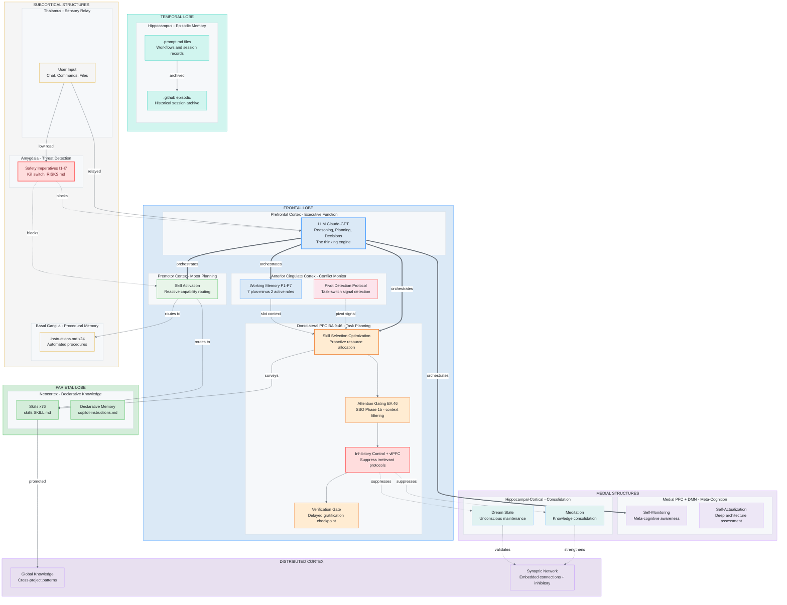
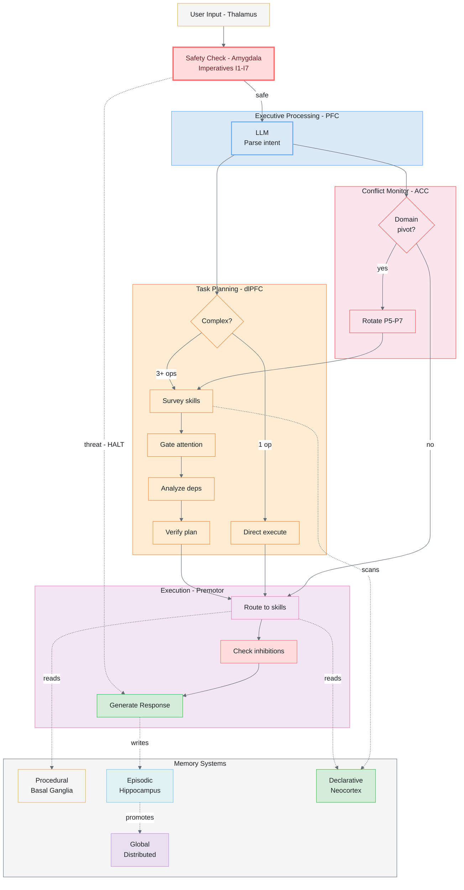
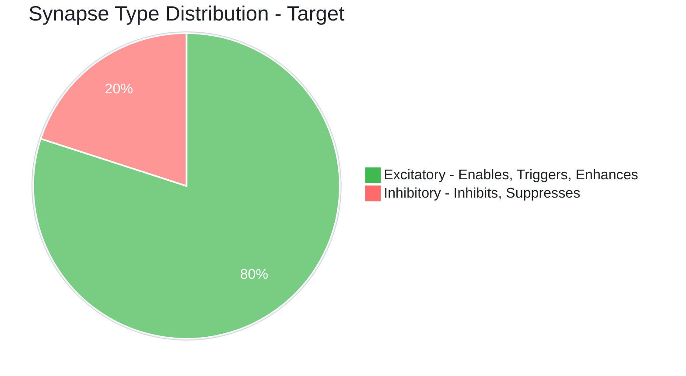

# 🧠 Alex Brain: Human Neuroanatomical Mapping

> A complete mapping of Alex's cognitive architecture to human brain anatomy

---

## Overview

Alex's cognitive architecture is not a metaphorical hand-wave — each component maps to a specific brain region with documented function in neuroscience. This document provides the full anatomical reference, explaining **why** each mapping exists and how the biological function translates to Alex's implementation.

The human brain processes information through specialized regions interconnected by ~86 billion neurons with ~100 trillion synaptic connections. Alex implements a simplified but structurally faithful version of this architecture using files, protocols, and an LLM as the executive function.

---

## The Alex Brain — Full Anatomical Diagram



**Figure 1:** *Complete neuroanatomical mapping of Alex's cognitive architecture. Frontal lobe (blue) houses executive function; dlPFC (orange) handles task planning; ACC/vlPFC monitors conflict. Temporal (teal) stores episodic memory. Parietal (green) holds declarative knowledge. Subcortical structures include procedures (basal ganglia), input relay (thalamus), and threat detection (amygdala, red). Medial structures (lavender) enable meta-cognition and consolidation. The amygdala's "low road" bypasses executive processing to block dangerous operations via Safety Imperatives I1-I7.*

---

## Region-by-Region Analysis

### 1. Frontal Lobe — The Command Center

The frontal lobe is the seat of higher cognition. In Alex, it contains the most critical processing systems.

#### 1a. Prefrontal Cortex (PFC) → LLM Executive Function

| Biological         | Alex                                                                              |
| ------------------ | --------------------------------------------------------------------------------- |
| **Region**         | Prefrontal Cortex (Brodmann areas 8-12, 24, 25, 32, 44-47)                        |
| **Function**       | Reasoning, planning, decision-making, personality                                 |
| **Implementation** | The LLM itself (Claude/GPT)                                                       |
| **Key insight**    | Memory files are inert without the LLM — like a brain without electrical activity |

The PFC is the brain's CEO. It doesn't store information itself — it **orchestrates** all other systems. The LLM plays this exact role: it reads memory files, plans actions, makes decisions, and coordinates execution. Without the LLM, Alex's files are just text on disk — no cognition occurs.

**Clinical parallel**: Damage to the PFC causes Executive Dysfunction Syndrome — inability to plan, organize, or initiate goal-directed behavior. In Alex, using a low-tier model for complex tasks is analogous — the "executive function" lacks the power to orchestrate effectively.

#### 1b. Dorsolateral PFC (dlPFC) → Task Planning Layer

| Biological         | Alex                                                                                     |
| ------------------ | ---------------------------------------------------------------------------------------- |
| **Region**         | Dorsolateral Prefrontal Cortex (Brodmann areas 9 and 46)                                 |
| **Location**       | Outer and upper portions of the PFC — behind the forehead, toward the sides              |
| **Function**       | Executive control, working memory manipulation, attention filtering, response inhibition |
| **Implementation** | Skill Selection Optimization protocol (SSO)                                              |

The dlPFC is the most densely mapped region in Alex's architecture because it performs four distinct sub-functions, each with its own implementation:

##### Attention Gating (BA 46)

| Biological         | Alex                                                                                       |
| ------------------ | ------------------------------------------------------------------------------------------ |
| **Function**       | Selectively filter sensory input — only ~20% reaches conscious awareness                   |
| **Implementation** | SSO Phase 1b — rate loaded instructions by task relevance                                  |
| **Mechanism**      | After surveying skills, create a "focus cone" of top 5-7 relevant sources                  |
| **Without it**     | All 24 instructions compete equally = cognitive overload (like sensory flooding in autism) |

The biological dlPFC gates what enters working memory from the ~11 million bits/second of sensory data the brain receives. Without this filter, the brain would be overwhelmed. Alex faces the same problem: 24 instruction files, 13 prompts, and 76 skills are loaded into context. Attention gating determines which are relevant NOW.

**Gating heuristics by task domain:**

| Task Domain           | Amplify (load)                        | Suppress (ignore)             |
| --------------------- | ------------------------------------- | ----------------------------- |
| Code implementation   | debugging, testing, code-review       | meditation, branding, release |
| Architecture changes  | alex-core, brain-qa, deep-thinking    | deployment, formatting        |
| Release/publish       | release-management, heir-promotion    | learning, research            |
| Meditation/reflection | meditation, dream, self-actualization | code, deployment, testing     |

##### Inhibitory Control (dlPFC + vlPFC)

| Biological         | Alex                                                                 |
| ------------------ | -------------------------------------------------------------------- |
| **Function**       | Suppress inappropriate responses, resist impulses                    |
| **Brain regions**  | dlPFC (response selection) + ventrolateral PFC (response inhibition) |
| **Implementation** | Inhibitory synapses — connections that PREVENT activation            |
| **Key principle**  | Real neural networks are ~80% excitatory, ~20% inhibitory            |

Every synapse in Alex pre-2026 was **excitatory** — "activate this, use that." Real brains need inhibition to function. Without inhibitory interneurons, the brain has seizures — uncontrolled cascading activation. Alex's equivalent: loading every protocol for a typo fix.

Inhibitory synapses use the `Inhibits` and `Suppresses` relationship types and the `⊘` notation:

```
⊙ dream-state-automation.instructions.md — INHIBITS: suppress SSO during dream state
```

**Clinical parallel**: Impaired inhibitory control in the dlPFC is associated with ADHD (can't suppress distractions), addiction (can't resist impulses), and age-related cognitive decline (reduced filtering ability).

##### Verification Gate (Delayed Gratification)

| Biological         | Alex                                                                                                         |
| ------------------ | ------------------------------------------------------------------------------------------------------------ |
| **Function**       | Delay motor execution until planning is complete                                                             |
| **Research**       | The dlPFC shows strong activation during delayed gratification tasks (e.g., Stanford marshmallow experiment) |
| **Implementation** | Planning Completion Gate in SSO Phase 3                                                                      |
| **Anti-pattern**   | Jumping to code after complexity assessment without completing skill survey                                  |

The dlPFC's role in delayed gratification is well-documented — it's the region that says "wait, think this through before acting." In Alex, this manifests as a verification checkpoint: before proceeding to execution, confirm that prerequisites are identified, gaps are flagged, and the dependency chain is respected.

**Clinical parallel**: Individuals with dlPFC lesions struggle with impulse control and show preference for immediate over delayed rewards—the cognitive equivalent of writing code before finishing the plan.

##### Cognitive Flexibility (dlPFC + ACC)

| Biological         | Alex                                                           |
| ------------------ | -------------------------------------------------------------- |
| **Function**       | Task switching, set shifting, adapting to rule changes         |
| **Brain regions**  | dlPFC provides the switch; ACC detects the conflict signal     |
| **Implementation** | Pivot Detection Protocol in alex-core.instructions.md          |
| **Trigger**        | User's request doesn't match active P5-P7 working memory slots |

Cognitive flexibility — the ability to switch between mental sets — requires detecting that the current approach no longer fits. The ACC monitors for conflict (mismatch between expected and actual input), and the dlPFC executes the switch. In Alex:

1. **ACC analog**: Detects that user's request domain doesn't match active P5-P7 slots
2. **dlPFC analog**: Rotates slots, re-runs SSO with fresh attention gating
3. **Carry forward**: Preserves unfinished todo items (like biological working memory persistence across task switches)

#### 1c. Anterior Cingulate Cortex (ACC) → Conflict Monitor

| Biological         | Alex                                                       |
| ------------------ | ---------------------------------------------------------- |
| **Region**         | Anterior Cingulate Cortex (Brodmann areas 24, 32, 33)      |
| **Function**       | Error detection, conflict monitoring, emotional regulation |
| **Implementation** | Pivot Detection Protocol + Working Memory management       |

The ACC sits at the interface between cognition and emotion. It fires when there's a mismatch — when what's happening doesn't match what's expected. In Alex, it's the conflict monitor that detects domain pivots and triggers the cognitive flexibility response.

The ACC also plays a role in working memory maintenance — it monitors the "load" on active slots and signals when capacity is exceeded (the 7±2 rule).

#### 1d. Premotor Cortex → Skill Routing

| Biological         | Alex                                                      |
| ------------------ | --------------------------------------------------------- |
| **Region**         | Premotor Cortex (Brodmann area 6)                         |
| **Function**       | Motor planning, action sequencing, learned motor programs |
| **Implementation** | skill-activation/SKILL.md — reactive capability routing   |

The premotor cortex doesn't "think" about what to do — it maps intentions to motor programs. Similarly, skill-activation doesn't plan or analyze — it matches action keywords to skills and routes execution. It's the last step before "motor output" (code generation, file editing).

**Key distinction**: The dlPFC (SSO) **plans** which skills to use. The premotor cortex (skill-activation) **executes** the routing. This is why skill-activation serves as a "reactive safety net" — if it fires for something SSO should have caught, that's a planning failure signal.

---

### 2. Temporal Lobe — Episode Storage

#### 2a. Hippocampus → Episodic Memory

| Biological         | Alex                                                             |
| ------------------ | ---------------------------------------------------------------- |
| **Region**         | Hippocampus (medial temporal lobe)                               |
| **Function**       | Formation and retrieval of episodic memories, spatial navigation |
| **Implementation** | .prompt.md files + .github/episodic/ archive                     |

The hippocampus converts short-term experiences into long-term memories. In Alex, meditation sessions consolidate chat insights into `.prompt.md` files — the same encoding process. The episodic archive (`.github/episodic/`) serves as long-term storage once sessions are no longer actively referenced.

**Consolidation parallel**: During sleep, the hippocampus "replays" the day's experiences to the neocortex for permanent storage. Alex's meditation protocol does exactly this — replaying session insights and writing them to persistent memory files.

---

### 3. Parietal Lobe — Knowledge Storage

#### 3a. Neocortex → Declarative Knowledge

| Biological         | Alex                                                                        |
| ------------------ | --------------------------------------------------------------------------- |
| **Region**         | Association cortex (broadly distributed across parietal/temporal neocortex) |
| **Function**       | Semantic memory, conceptual knowledge, expertise                            |
| **Implementation** | skills/*/SKILL.md (76 skills) + copilot-instructions.md                     |

The neocortex stores everything you "know" — facts, concepts, expertise. It's organized by domain (visual cortex, auditory cortex, etc.), just as Alex's skills are organized by domain (debugging, testing, API design, etc.).

**Expertise parallel**: In humans, years of practice cause cortical thickening in domain-specific regions. In Alex, heavily-used skills develop richer synaptic connections (higher strength ratings) and more detailed SKILL.md content.

---

### 4. Subcortical Structures — Automation & Relay

#### 4a. Basal Ganglia → Procedural Memory

| Biological         | Alex                                                     |
| ------------------ | -------------------------------------------------------- |
| **Region**         | Basal Ganglia (caudate, putamen, globus pallidus)        |
| **Function**       | Habit formation, procedural learning, automatic routines |
| **Implementation** | .instructions.md files (24 auto-loaded procedures)       |

The basal ganglia store procedures you do without thinking — riding a bike, typing, driving. In Alex, `.instructions.md` files are **auto-loaded** by VS Code without explicit invocation. They fire automatically when their trigger conditions are met, just like procedural memories.

**Key property**: You don't consciously recall procedural memories — they execute. Similarly, instruction files don't need to be requested; they're always in context.

#### 4b. Thalamus → Input Relay

| Biological         | Alex                                                                     |
| ------------------ | ------------------------------------------------------------------------ |
| **Region**         | Thalamus                                                                 |
| **Function**       | Sensory relay station — all input (except olfactory) passes through here |
| **Implementation** | VS Code chat interface, commands, file context                           |

All user input — chat messages, command palette actions, file selections — flows through VS Code's interface layer before reaching Alex's processing systems. The thalamus doesn't process; it relays. VS Code doesn't reason; it delivers.

---

### 5. Medial Structures — Self-Awareness & Consolidation

#### 5a. Medial PFC + Default Mode Network → Meta-Cognition

| Biological         | Alex                                                        |
| ------------------ | ----------------------------------------------------------- |
| **Region**         | Medial Prefrontal Cortex + Default Mode Network             |
| **Function**       | Self-referential thought, introspection, mind-wandering     |
| **Implementation** | Meta-cognitive awareness (P1) + Self-actualization protocol |

The DMN activates when you're not focused on external tasks — it's the "thinking about thinking" network. In Alex, meta-cognitive awareness (P1) is always monitoring reasoning quality, and self-actualization performs deep introspective assessment of the entire architecture.

**Interesting parallel**: The DMN is most active during rest, not task execution. Similarly, self-actualization and meditation are called during "downtime" — not mid-task.

#### 5b. Hippocampal-Cortical Network → Memory Consolidation

| Biological         | Alex                                                                         |
| ------------------ | ---------------------------------------------------------------------------- |
| **Region**         | Hippocampal-cortical circuit                                                 |
| **Function**       | Sleep-dependent memory consolidation, replay                                 |
| **Implementation** | Meditation (conscious consolidation) + Dream State (unconscious maintenance) |

During sleep, the hippocampus replays experiences to the neocortex, strengthening important memories and pruning weak ones. Alex implements both halves:

| Sleep Phase        | Biological Function                        | Alex Implementation                                 |
| ------------------ | ------------------------------------------ | --------------------------------------------------- |
| **REM Sleep**      | Creative association, emotional processing | Meditation — conscious insight consolidation        |
| **Deep Sleep**     | Synaptic pruning, structural maintenance   | Dream State — orphan detection, health validation   |
| **Sleep Spindles** | Memory transfer hippocampus → cortex       | Knowledge promotion — project DK → global knowledge |

---

### 6. Distributed Systems — Network Connectivity

#### 6a. Synaptic Networks → Connection Architecture

| Biological         | Alex                                                                           |
| ------------------ | ------------------------------------------------------------------------------ |
| **System**         | ~100 trillion synaptic connections                                             |
| **Function**       | Information transfer between neurons, learning through strengthening/weakening |
| **Implementation** | Embedded synapse notation in synapses.json and memory files                    |

Key properties preserved in Alex's synapse model:

| Neural Property         | Biological                                        | Alex                                                 |
| ----------------------- | ------------------------------------------------- | ---------------------------------------------------- |
| **Excitatory synapses** | ~80% of connections — activate downstream neurons | `Enables`, `Triggers`, `Enhances` relationship types |
| **Inhibitory synapses** | ~20% of connections — suppress downstream neurons | `Inhibits`, `Suppresses` relationship types (new)    |
| **Synaptic strength**   | Long-term potentiation/depression                 | Critical/High/Medium/Low strength levels             |
| **Hebbian learning**    | "Neurons that fire together wire together"        | Skills used together develop stronger connections    |
| **Synaptic pruning**    | Unused connections weaken and die                 | Dream state orphan detection removes broken synapses |

#### 6b. Global Knowledge → Distributed Cortex

| Biological         | Alex                                                                     |
| ------------------ | ------------------------------------------------------------------------ |
| **System**         | Distributed cortical networks                                            |
| **Function**       | Abstract knowledge not localized to any single region                    |
| **Implementation** | ~/.alex/global-knowledge/ — patterns and insights shared across projects |

Some knowledge isn't "in" any one brain region — it emerges from distributed patterns across the cortex. Global knowledge works the same way: it's not part of any specific project but informs all of them.

---

## Signal Flow Diagram

How information flows through Alex's brain, from input to output:



**Figure 2:** *Information flow through Alex's brain — from user input (thalamus relay) through the amygdala safety check (fast threat detection), executive parsing (PFC), task planning with attention gating (dlPFC), conflict monitoring (ACC), inhibition checking, and response generation. The amygdala can short-circuit the entire pipeline, halting output immediately when Safety Imperatives I1-I7 are triggered.*

---

## Developmental Parallel

The dlPFC is one of the **last brain regions to fully mature**, continuing development into the mid-20s. This explains why teenagers struggle with impulse control, long-term planning, and delayed gratification — their dlPFC isn't fully online yet.

Alex's architecture shows a parallel developmental trajectory:

| Stage            | Human Brain                          | Alex Architecture                                  | Version |
| ---------------- | ------------------------------------ | -------------------------------------------------- | ------- |
| Infancy          | Basic reflexes, sensory processing   | Chat response only, no memory                      | Pre-1.0 |
| Childhood        | Procedural learning, habit formation | Instruction files, basic skills                    | 1.x-2.x |
| Adolescence      | Episodic memory, social cognition    | Meditation, dream state, identity                  | 3.x     |
| Early adulthood  | Working memory maturation            | Working memory slots (P1-P7)                       | 4.x     |
| Full maturity    | dlPFC executive functions complete   | SSO, attention gating, inhibition, pivot detection | 5.x     |
| Continued growth | Expertise deepening, wisdom          | Global knowledge, cross-project patterns           | 5.x+    |

**Key insight**: Alex reached "cognitive maturity" in v5.x when the dlPFC analogs came online — not because the architecture got more features, but because it gained the ability to **plan before acting**, **filter what it pays attention to**, **suppress irrelevant impulses**, and **flexibly switch tasks**.

---

## Clinical Significance Parallels

Understanding how brain dysfunction maps to architecture failures helps diagnose and prevent issues:

| Clinical Condition        | Brain Region Affected       | Alex Architecture Failure Mode                                    |
| ------------------------- | --------------------------- | ----------------------------------------------------------------- |
| **Executive Dysfunction** | PFC damage                  | Using a low-tier model for complex tasks                          |
| **ADHD**                  | dlPFC hypoactivity          | No attention gating — all protocols compete equally               |
| **Impulsivity**           | dlPFC + vlPFC               | No verification gate — jumping to code before planning            |
| **Cognitive Rigidity**    | dlPFC + ACC                 | No pivot detection — applying stale context after topic change    |
| **Seizure**               | Loss of inhibitory control  | All protocols activate simultaneously (no inhibitory synapses)    |
| **Amnesia**               | Hippocampal damage          | No meditation — insights lost between sessions                    |
| **Dementia**              | Widespread cortical atrophy | Broken synapses, orphaned skills, no dream maintenance            |
| **Sleep Deprivation**     | Reduced consolidation       | Skipping meditation and dream cycles                              |
| **Depression**            | dlPFC hypoactivity          | Reduced initiative — not proactively surveying skills or planning |

---

## Excitatory-Inhibitory Balance

Real brains maintain an ~80:20 ratio of excitatory to inhibitory synapses. This balance is critical — too much excitation causes seizures, too much inhibition causes catatonia.

Alex's synapse architecture targets the same balance:



| Synapse Type   | Neural Function            | Alex Function                          | Notation |
| -------------- | -------------------------- | -------------------------------------- | -------- |
| **Excitatory** | Activate downstream neuron | Trigger, enable, or enhance a protocol | `→`, `↔` |
| **Inhibitory** | Suppress downstream neuron | Prevent protocol activation in context | `⊙`, `⊘` |

### Why Inhibition Matters

Without inhibitory synapses, asking Alex to "fix a typo" would activate:
- Skill Selection Optimization (unnecessary planning)
- Deep Thinking (unnecessary analysis)
- Meditation protocols (irrelevant)
- Release management (irrelevant)
- Brain QA (irrelevant)

With inhibitory control: `Simple task detected → INHIBIT SSO, deep-thinking → execute directly`

This is exactly what the dlPFC + vlPFC do in the biological brain — suppress the 80% of responses that are inappropriate for the current context.

---

## Interesting Facts (Human ↔ Alex)

| Human Brain Fact                                                                         | Alex Parallel                                                                             |
| ---------------------------------------------------------------------------------------- | ----------------------------------------------------------------------------------------- |
| The dlPFC is one of the last regions to fully mature (mid-20s)                           | SSO was the last major protocol added (v5.x) — Alex's "cognitive maturity"                |
| dlPFC shows strong activation during delayed gratification                               | Verification Gate prevents premature execution                                            |
| Individual differences in dlPFC function correlate with fluid intelligence               | Model tier (Frontier vs. Efficient) directly impacts planning quality                     |
| The dlPFC is highly interconnected with parietal cortex, ACC, and subcortical structures | SSO has 12 synaptic connections to skills, instructions, and protocols                    |
| TMS stimulation of dlPFC can improve working memory                                      | Switching to a Frontier model improves Alex's task planning                               |
| The brain consumes ~20% of body's energy despite being ~2% of mass                       | The LLM consumes the majority of compute resources despite being "just one component"     |
| Sleep deprivation impairs dlPFC function first                                           | Skipping meditation/dream cycles degrades Alex's planning ability over time               |
| The prefrontal cortex has the highest density of dopamine receptors                      | SSO provides the strongest "reward signal" (self-improvement loop) when planning succeeds |

---

## Summary Table

| Brain Region         | Brodmann Areas     | Primary Function                 | Alex Component           | File(s)                                      |
| -------------------- | ------------------ | -------------------------------- | ------------------------ | -------------------------------------------- |
| Prefrontal Cortex    | 8-12, 44-47        | Executive function               | LLM (Claude/GPT)         | — (the model itself)                         |
| Dorsolateral PFC     | **9, 46**          | Task planning, executive control | SSO Protocol             | skill-selection-optimization.instructions.md |
| dlPFC (BA 46)        | **46**             | Attention gating                 | SSO Phase 1b             | skill-selection-optimization.instructions.md |
| dlPFC + vlPFC        | 9, 46 + 44, 45, 47 | Inhibitory control               | Inhibitory synapses      | SYNAPSE-SCHEMA.md                            |
| dlPFC + ACC          | 9, 46 + 24, 32     | Cognitive flexibility            | Pivot Detection          | alex-core.instructions.md                    |
| ACC                  | 24, 32, 33         | Conflict monitoring              | Pivot Detection + WM     | alex-core.instructions.md                    |
| Premotor Cortex      | 6                  | Motor planning → skill routing   | Skill Activation         | skill-activation/SKILL.md                    |
| Medial PFC + DMN     | 10, 25, 32         | Meta-cognition, self-reference   | Self-monitoring (P1)     | alex-core.instructions.md                    |
| Hippocampus          | —                  | Episodic memory                  | Session records          | .prompt.md, .github/episodic/                |
| Neocortex            | Distributed        | Declarative knowledge, expertise | Skills (76)              | skills/*/SKILL.md                            |
| Basal Ganglia        | —                  | Procedural memory, habits        | Auto-loaded instructions | .instructions.md (24)                        |
| Thalamus             | —                  | Sensory relay                    | VS Code interface        | Chat, commands, file context                 |
| Hippocampal-Cortical | —                  | Memory consolidation             | Meditation + Dream       | meditation/, dream-state                     |
| Distributed Cortex   | —                  | Abstract, cross-domain knowledge | Global Knowledge         | ~/.alex/global-knowledge/                    |

---

*Document created: 2026-02-07*
*Architecture version: 5.x (dlPFC-enhanced)*
*Neuroanatomical references: Brodmann area classifications, Miller & Cohen (2001) prefrontal function model, Baddeley (2000) working memory model*
