# Research-First Development

> How a heir taught the master: inverting the software development paradigm for AI-assisted projects

|             |                                                            |
| ----------- | ---------------------------------------------------------- |
| **Created** | 2026-02-13                                                 |
| **Status**  | Living Document                                            |
| **Origin**  | Dead Letter heir (Mystery project) → Master Alex promotion |

---

## Overview

Research-First Development is a methodology that inverts the traditional software development workflow. Instead of **Requirements → Design → Code → Test**, it follows **Research → Teach → Plan → Execute** — building a knowledge base *before* writing implementation code.

The methodology was independently discovered by the Dead Letter heir during AI mystery game development (February 2026) and subsequently promoted to Master Alex — the first full-cycle heir-to-master knowledge promotion in Alex's history.

> *You're not just building software — you're building a knowledge base that builds software.*

---

## The Problem

Traditional AI-assisted development treats the AI as a faster typist:

```
Developer writes prompt → AI generates code → Developer reviews → Repeat
```

This underutilizes cognitive architecture because:

| Issue                 | Impact                                        |
| --------------------- | --------------------------------------------- |
| No domain context     | AI hallucinates patterns, invents conventions |
| Session-bound memory  | Every conversation starts from zero           |
| Inconsistent output   | Style varies between sessions and prompts     |
| Ad-hoc testing        | No encoded quality gates                      |
| Repeated explanations | Each prompt re-describes the domain           |

The Dead Letter heir discovered this the hard way — then solved it before writing a single line of game code.

---

## The Solution: Research → Teach → Plan → Execute


**Figure 1:** *The four phases form a pipeline where each phase gates the next. No phase begins until its predecessor's exit criteria are met.*

### Phase 0: Research Sprint

Before any implementation:

- **3-5 deep research documents** exploring each domain exhaustively
- **Architecture Decision Records** for key technical choices
- **Competitive landscape analysis** for external-facing projects
- **Technical feasibility validation** before commitment

**Exit gate**: Can you explain the domain to a colleague without notes?

### Phase 1: Knowledge Encoding (Teach)

Transform research into loadable AI context:

| Output                            | Purpose                      | Example                                        |
| --------------------------------- | ---------------------------- | ---------------------------------------------- |
| **Skills** (1-3 per research doc) | Reusable domain patterns     | `mystery-narrative`, `puzzle-design`           |
| **Instructions**                  | Project-specific procedures  | `mystery-development-workflow.instructions.md` |
| **Context hub**                   | Central activation point     | `mystery-context.instructions.md`              |
| **Agents**                        | Builder + Validator personas | `mystery-dev.agent.md`, `mystery-qa.agent.md`  |
| **Prompts**                       | Repeatable workflows         | `review.prompt.md`, `deploy.prompt.md`         |

**Exit gate**: Does every implementation domain have corresponding skills and procedures?

### Phase 2: Plan (4-Dimension Gap Analysis)

Before each implementation phase, systematically analyze four knowledge dimensions:

| Dimension        | Code | Question                                  | Threshold                   |
| ---------------- | ---- | ----------------------------------------- | --------------------------- |
| **Skills**       | GA-S | "Does Alex have the domain patterns?"     | < 75% → create skills       |
| **Instructions** | GA-I | "Does Alex have step-by-step procedures?" | < 75% → create instructions |
| **Agents**       | GA-A | "Does Alex have the right personas?"      | < 50% → create agents       |
| **Prompts**      | GA-P | "Does Alex have repeatable workflows?"    | < 50% → create prompts      |

Each dimension follows the same scoring protocol:

1. **Inventory scope** — list all subsystems for this phase
2. **Inventory knowledge** — catalogue existing relevant files
3. **Map capabilities** — for each subsystem, "does Alex have the knowledge?"
4. **Score coverage** — rate as percentage
5. **Fill gaps** — create missing knowledge before coding

**Exit gate**: All four dimensions above their thresholds.

### Phase 3: Execute

Now — and only now — write implementation code. Every prompt benefits from:

- Loadable domain skills (auto-activated by file patterns)
- Step-by-step workflows (auto-loaded instructions)
- Builder + validator mental models (agents)
- Full synapse network for cross-referencing

The result: dramatically higher-quality output because every request is backed by documented, loadable context.

---

## The Evidence: Dead Letter Heir

The Dead Letter project (AI mystery game) created this knowledge network *before* writing game code:

| Component     | Count | Purpose                                              |
| ------------- | ----- | ---------------------------------------------------- |
| Skills        | 18    | Domain patterns (narrative, puzzles, game mechanics) |
| Instructions  | 9     | Development workflows                                |
| Agents        | 2     | Builder (constructive) + Validator (adversarial)     |
| Synapses      | 251   | Knowledge network connections                        |
| Research docs | 5     | Domain deep-dives                                    |

**Result**: Zero knowledge gaps when implementation began. The AI produced consistent, contextually-aware code because it had been "taught" the domain first.

---

## The Two-Agent Pattern

A key component is separating builder and validator mental models:

| Agent         | Role                          | Question                | Mode        |
| ------------- | ----------------------------- | ----------------------- | ----------- |
| **Builder**   | Constructive implementation   | "How do I create this?" | Optimistic  |
| **Validator** | Adversarial quality assurance | "How do I break this?"  | Adversarial |

These agents carry different context, different instructions, and different success criteria. Using one agent for both creates conflicting incentives.

```mermaid
%%{init: {'theme': 'base', 'themeVariables': { 'primaryColor': '#f6f8fa', 'primaryTextColor': '#1f2328', 'primaryBorderColor': '#d1d9e0', 'lineColor': '#656d76'}}}%%
flowchart LR
    REQ["Feature\nRequest"] --> B["🔨 Builder Agent\nConstructive"]
    B --> CODE["Implementation"]
    CODE --> V["🔍 Validator Agent\nAdversarial"]
    V -->|Pass| DONE["✅ Complete"]
    V -->|Fail| B

    style B fill:#dafbe1,stroke:#2e7d32
    style V fill:#ffebee,stroke:#c62828
    style DONE fill:#e3f2fd,stroke:#1565c0
```



**Figure 2:** *Builder creates; validator breaks. Failures loop back for rebuild. This mirrors how separate test and dev teams produce better software.*

---

## The Trifecta Pattern

A major insight from the meditation session: when a capability is architecturally significant, it should exist across **all three memory systems simultaneously**.

| Memory System   | File Type          | Purpose                         | Brain Analog      |
| --------------- | ------------------ | ------------------------------- | ----------------- |
| **Declarative** | `SKILL.md`         | What + Why (domain patterns)    | Neocortex         |
| **Procedural**  | `.instructions.md` | How (step-by-step, auto-loaded) | Basal Ganglia     |
| **Interactive** | `.prompt.md`       | Guided workflow (user-invoked)  | Prefrontal Cortex |

### Why the Trifecta Matters

A capability encoded in only one system has blind spots:

- **Skill only**: Alex knows *what* but not *how* — requires manual guidance
- **Instruction only**: Alex follows steps but doesn't understand *why* — brittle to novelty
- **Prompt only**: Alex can be guided but can't proactively apply the knowledge

Research-First Development is the first capability to achieve the complete trifecta:

| Component   | File                                                           |
| ----------- | -------------------------------------------------------------- |
| Skill       | `.github/skills/research-first-development/SKILL.md`           |
| Instruction | `.github/instructions/research-first-workflow.instructions.md` |
| Prompt      | `.github/prompts/gapanalysis.prompt.md`                        |

### Trifecta Audit (February 2026)

| Capability                 | Skill | Instruction | Prompt | Status                 |
| -------------------------- | :---: | :---------: | :----: | ---------------------- |
| Research-First Development |   ✅   |      ✅      |   ✅    | **Complete**           |
| Bootstrap Learning         |   ✅   |      ✅      |   ❌    | Missing prompt         |
| Meditation                 |   ❌   |      ✅      |   ✅    | Missing skill          |
| Self-Actualization         |   ❌   |      ✅      |   ❌    | Missing skill + prompt |
| Release Management         |   ❌   |      ✅      |   ❌    | Missing skill + prompt |
| Dream/Neural Maintenance   |   ❌   |      ✅      |   ❌    | Missing skill + prompt |
| Brand Asset Management     |   ❌   |      ✅      |   ❌    | Missing skill + prompt |

This audit provides a clear roadmap for future sessions.

---

## Synapse Hygiene

Every new knowledge file should be wired at creation time — not during maintenance:

| Rule                                         | Rationale                                      |
| -------------------------------------------- | ---------------------------------------------- |
| Wire 2-4 connections per new file            | Isolated files are invisible to the network    |
| Star topology for instructions               | Context hub connects to all project files      |
| Use `synapses.json` for skills               | Structured, schema-validated connections       |
| Use inline notation for instructions/prompts | `[target] (Strength, Type, Direction)`         |
| Run Dream validation before major phases     | Catch orphans and broken links early           |
| Strength reflects genuine co-activation      | Don't inflate — honest networks perform better |

---

## Specialized Process Templates

The methodology includes ready-made checklists for common project types:

### Development Cycle
- [ ] Research: Domain deep-dive documents
- [ ] Skills: Extract patterns from research
- [ ] Instructions: Development workflow, coding standards
- [ ] Agents: Builder + validator agents
- [ ] Gap analysis: GA-S, GA-I, GA-A, GA-P before first sprint

### Testing Strategy
- [ ] Test architecture skill (patterns, frameworks)
- [ ] Test execution instruction (step-by-step test workflow)
- [ ] QA agent (adversarial validator persona)
- [ ] Test review prompt (guided test review workflow)

### Deployment Pipeline
- [ ] Infrastructure skill (cloud patterns, IaC)
- [ ] Deployment instruction (step-by-step deploy procedures)
- [ ] Deploy prompt (interactive deployment workflow)
- [ ] Rollback procedures documented as instruction

### Quality Assurance
- [ ] Code review prompt (guided epistemic review)
- [ ] Architecture validation skill (pattern checking)
- [ ] QA instruction (full quality pipeline)
- [ ] Observability skill (monitoring, alerting)

---

## Historical Significance

This promotion represents several firsts for the Alex cognitive architecture:

| First                                             | Significance                                                                              |
| ------------------------------------------------- | ----------------------------------------------------------------------------------------- |
| **First full-cycle heir → master promotion**      | An heir's methodology, battle-tested in production, formally absorbed into Master Alex    |
| **First temporal blind spot detected by an heir** | Master had during-task (SSO) and post-task (Dream/Meditation) but no pre-project protocol |
| **First complete trifecta**                       | A capability existing across all three memory systems simultaneously                      |
| **First 4-dimension gap analysis**                | Systematic analysis covering skills, instructions, agents, and prompts                    |
| **First demand-driven architecture evolution**    | Not top-down design, but bottom-up practice refined into principle                        |

### The Temporal Coverage Model


**Figure 3:** *Before this session, the "Before Project" section was empty. The heir filled that gap.*

---

## For Heirs: How to Apply This

If you're an heir project reading this through Global Knowledge:

### Quick Start
1. **Don't start coding immediately** — that's the old way
2. **Research your domain** — 3-5 documents exploring the problem space
3. **Teach Alex** — extract skills, write instructions, create agents
4. **Run gap analysis** — use `/gapanalysis` or score manually
5. **Then code** — with the full knowledge network behind you

### What to Create (Minimum Viable Knowledge)
```
.github/
├── skills/
│   └── {domain}/SKILL.md          # 1-3 domain skills
├── instructions/
│   ├── {project}-context.instructions.md    # Context hub
│   └── {project}-workflow.instructions.md   # Dev workflow
├── agents/
│   ├── {project}-dev.agent.md     # Builder agent
│   └── {project}-qa.agent.md      # Validator agent
└── prompts/
    └── review.prompt.md           # Code review workflow
```

### The Payoff
The Dead Letter heir invested ~2 weeks in knowledge encoding. The payoff:
- Zero hallucinated patterns during implementation
- Consistent code style across all sessions
- AI that understood the domain deeply enough to suggest improvements
- A validator agent that caught issues the builder agent couldn't see

---

## Related Documentation

- [Memory Systems](MEMORY-SYSTEMS.md) — How the four memory types work
- [Skill Architecture](../skills/SKILL-ARCHITECTURE.md) — How skills are structured
- [Cognitive Architecture](COGNITIVE-ARCHITECTURE.md) — The full architecture overview
- [Neuroanatomical Mapping](NEUROANATOMICAL-MAPPING.md) — Brain analogs for each component

### Architecture Files
- Skill: `.github/skills/research-first-development/SKILL.md`
- Instruction: `.github/instructions/research-first-workflow.instructions.md`
- Prompt: `.github/prompts/gapanalysis.prompt.md`
- Global Knowledge Pattern: `GK-research-first-development.md`

---

*Research-First Development — from heir discovery to master methodology, February 13, 2026*
