# Semantic Skill Graph — Compiled Cognitive Runtime

> **From keyword matching to semantic understanding: making 75+ skills actually discoverable**

|             |                                                                                                |
| ----------- | ---------------------------------------------------------------------------------------------- |
| **Author**  | Fabio Correa                                                                                   |
| **Date**    | February 7, 2026                                                                               |
| **Status**  | Proposal                                                                                       |
| **Problem** | Skill discovery fails as skill count grows, causing repeated mistakes and rework               |
| **Related** | [MEMORY-SYSTEMS.md](MEMORY-SYSTEMS.md), [COGNITIVE-ARCHITECTURE.md](COGNITIVE-ARCHITECTURE.md) |

---

## Implementation Plan

### Phase Checklist

| #   | Phase                                | Impact   | Effort | Dependencies         | Timeline     | Status        |
| --- | ------------------------------------ | -------- | ------ | -------------------- | ------------ | ------------- |
| 1   | Proof of Concept (standalone script) | 🔴 HIGH   | 1 week | Azure OpenAI API key | Feb 17-21    | ⬜ Not started |
| 2   | Extension Integration                | 🔴 HIGH   | 1 week | Phase 1 complete     | Mar 3-7      | ⬜ Not started |
| 3   | Synapse Discovery Dashboard          | 🟡 MEDIUM | 1 week | Phase 2 complete     | Mar 17-21    | ⬜ Not started |
| 4   | Global Knowledge Integration         | 🟡 MEDIUM | 1 week | Phase 2 complete     | Mar 31-Apr 4 | ⬜ Not started |

> **Phase 1 validates the entire approach** with zero VS Code API dependency. If cosine similarity doesn't beat keyword matching on the 3 known failures, the plan is abandoned at minimal cost ($0.002).

### Implementation Timeline

```mermaid
%%{init: {'theme': 'dark', 'themeVariables': {'background': '#0f172a', 'primaryColor': '#1e293b', 'primaryTextColor': '#f1f5f9', 'primaryBorderColor': '#818cf8', 'lineColor': '#475569', 'secondaryColor': '#1e293b', 'secondaryBorderColor': '#2dd4bf', 'tertiaryColor': '#1e293b', 'fontFamily': 'Segoe UI, system-ui, sans-serif'}}}%%
gantt
    title Semantic Skill Graph — Implementation Phases
    dateFormat YYYY-MM-DD
    axisFormat %b %Y

    section Phase 1 — Proof of Concept
    Parse all 75 SKILL.md + synapses.json       :p1a, 2026-02-17, 2d
    Chunk skills into ~300-token segments        :p1b, after p1a, 1d
    Generate Azure OpenAI embeddings            :p1c, after p1b, 2d
    Compute pairwise cosine similarity          :p1d, after p1c, 1d
    Merge explicit + discovered synapses        :p1e, after p1d, 1d
    K-means clustering on skill centroids       :p1f, after p1e, 1d
    Build query function + validate 3 failures  :p1g, after p1f, 2d

    section Phase 2 — Extension Integration
    Add alex.recompileSkills command            :p2a, 2026-03-03, 2d
    Integrate into Dream maintenance            :p2b, after p2a, 2d
    Add semantic query to skill-activation      :p2c, after p2b, 3d
    Staleness detection + fallback              :p2d, after p2c, 2d

    section Phase 3 — Synapse Discovery Dashboard
    Generate discovered-synapses.md             :p3a, 2026-03-17, 2d
    TreeView of discovered connections          :p3b, after p3a, 3d
    Promote / Dismiss actions                   :p3c, after p3b, 3d

    section Phase 4 — Global Knowledge Integration
    Embed GK-* patterns into graph              :p4a, 2026-03-31, 3d
    Embed GI-* insights into graph              :p4b, after p4a, 3d
    Cross-project query pipeline                :p4c, after p4b, 3d
    Store global vectors in ~/.alex/compiled/   :p4d, after p4c, 2d
```

### Architecture Overview

```mermaid
%%{init: {'theme': 'dark', 'themeVariables': {'background': '#0f172a', 'primaryColor': '#1e293b', 'primaryTextColor': '#f1f5f9', 'primaryBorderColor': '#818cf8', 'lineColor': '#475569', 'secondaryColor': '#1e293b', 'secondaryBorderColor': '#2dd4bf', 'tertiaryColor': '#1e293b', 'fontFamily': 'Segoe UI, system-ui, sans-serif'}}}%%
flowchart LR
    subgraph NOW["Current: Keyword Matching"]
        direction TB
        KW["87-row keyword table"]
        SYN["synapses.json — inert, rarely traversed"]
        KW ~~~ SYN
    end

    subgraph P1["Phase 1: Compiled Graph"]
        direction TB
        VEC["Vector embeddings"]
        GRAPH["Semantic graph"]
        CLUST["Skill clusters"]
        VEC --> GRAPH --> CLUST
    end

    subgraph P2["Phase 2: Extension"]
        direction TB
        CMD["alex.recompileSkills"]
        QUERY["Semantic activation"]
        FALL["Keyword fallback"]
        CMD --> QUERY --> FALL
    end

    subgraph P34["Phase 3-4: Discovery"]
        direction TB
        DISC["Synapse discovery"]
        GK["Global knowledge"]
        DISC ~~~ GK
    end

    style NOW fill:#ffcdd2,stroke:#e53935,stroke-width:2px
    style P1 fill:#c8e6c9,stroke:#43a047,stroke-width:2px
    style P2 fill:#bbdefb,stroke:#1e88e5,stroke-width:2px
    style P34 fill:#e1bee7,stroke:#8e24aa,stroke-width:2px

    NOW -->|"compile"| P1
    P1 -->|"integrate"| P2
    P2 -->|"extend"| P34

    style KW fill:#ffcdd2,stroke:#e53935
    style SYN fill:#ffcdd2,stroke:#e53935
    style VEC fill:#c8e6c9,stroke:#43a047
    style GRAPH fill:#c8e6c9,stroke:#43a047
    style CLUST fill:#c8e6c9,stroke:#43a047
    style CMD fill:#bbdefb,stroke:#1e88e5
    style QUERY fill:#bbdefb,stroke:#1e88e5
    style FALL fill:#bbdefb,stroke:#1e88e5
    style DISC fill:#e1bee7,stroke:#8e24aa
    style GK fill:#e1bee7,stroke:#8e24aa
    linkStyle default stroke:#475569,stroke-width:1.5px
```

---

## 1. The Problem

Alex has **75 skills**, **20 procedural memories**, **25 global knowledge patterns**, and **166 insights**. The current skill activation system uses a flat keyword lookup table — an 87-row text table in `skill-activation/SKILL.md` that the LLM scans linearly.

**This breaks in practice.** Concrete failures:

| Failure                         | What Happened                                                                                           | Root Cause                                                                                                                                                                     |
| ------------------------------- | ------------------------------------------------------------------------------------------------------- | ------------------------------------------------------------------------------------------------------------------------------------------------------------------------------ |
| **Mermaid colors — every time** | Created diagrams without the GitHub Pastel palette. Had to redo colors on 18 blocks across 2 documents. | `markdown-mermaid` skill triggered but its synapse to `graphic-design` (strength 0.9) was never followed. The color palette lives in `graphic-design`, not `markdown-mermaid`. |
| **SVG→PNG incident**            | Suggested manual browser screenshot instead of using `sharp-cli` via `image-handling` skill.            | Keyword "convert" didn't match "image-handling" in the flat table scan.                                                                                                        |
| **Mermaid layout**              | Diagrams rendered too tall, subgraphs stacking vertically.                                              | `activationBoost` keywords in `synapses.json` not consulted — only the flat SKILL.md table was read.                                                                           |

The pattern: **the knowledge exists but can't be found**. As skill count grows, this worsens combinatorially:

- 75 skills × average 4 synapses = **300 connections** the LLM should traverse
- 87 keyword rows × 5 keywords each = **435 keywords** to pattern-match
- None of this captures *conceptual similarity* — only exact keyword matches

### Why Keyword Matching Fails

```
User request: "make the diagrams look consistent"

Keyword scan matches:
  ✅ markdown-mermaid → "diagram"
  ❌ graphic-design → none of: "visual hierarchy, layout grid, typography, color palette"
  ❌ awareness → none triggered
  ❌ cognitive-load → none triggered

What SHOULD have matched:
  ✅ markdown-mermaid → diagram creation
  ✅ graphic-design → color consistency, visual hierarchy
  ✅ lint-clean-markdown → formatting standards
  ✅ markdown-mermaid → graphic-design synapse (strength 0.9)
```

The synapse between `markdown-mermaid` and `graphic-design` **exists** (strength 0.9, reason: "Color theory, accessibility, contrast principles for diagram styling"). But synapse traversal requires the LLM to:

1. Find the primary skill via keywords
2. Read its `synapses.json`
3. Follow connections to secondary skills
4. Read THOSE skills' content
5. Synthesize across all loaded skills

At step 2, the LLM usually stops — it has the primary skill and starts generating. The synapse network is **inert data** unless the LLM explicitly traverses it.

---

## 2. The Insight: Compile, Don't Interpret

The current architecture treats skills like an interpreted language — the LLM parses keyword tables, reads files, follows connections at runtime. This is fragile and slow.

The proposal: **compile skills into a semantic graph** optimized for retrieval, while keeping the current `.md` + `.json` files as editable source code.

```mermaid
%%{init: {'theme': 'dark', 'themeVariables': {'background': '#0f172a', 'primaryColor': '#1e293b', 'primaryTextColor': '#f1f5f9', 'primaryBorderColor': '#818cf8', 'lineColor': '#475569', 'secondaryColor': '#1e293b', 'secondaryBorderColor': '#2dd4bf', 'tertiaryColor': '#1e293b', 'fontFamily': 'Segoe UI, system-ui, sans-serif'}}}%%
flowchart LR
    subgraph SRC["Source Code: human-editable"]
        SK["SKILL.md files"]
        SY["synapses.json"]
        DK["DK-*.md files"]
        GK["GK-*.md / GI-*.md"]
    end

    COMPILE((" compile "))

    subgraph OUT[".alex/compiled/: machine-optimized"]
        VEC["skill-vectors.json<br/>Vector embeddings"]
        GRA["skill-graph.json<br/>Semantic graph"]
        CLU["cluster-map.json<br/>Cluster map"]
    end

    SK --> COMPILE
    SY --> COMPILE
    DK --> COMPILE
    GK --> COMPILE
    COMPILE --> VEC
    COMPILE --> GRA
    COMPILE --> CLU

    style SRC fill:#1e293b,stroke:#475569,stroke-width:2px
    style OUT fill:#1e293b,stroke:#475569,stroke-width:2px
    style COMPILE fill:#c4a35a,stroke:#475569,color:#fff,stroke-width:2px
    style SK fill:#bbdefb,stroke:#1e88e5
    style SY fill:#bbdefb,stroke:#1e88e5
    style DK fill:#c8e6c9,stroke:#43a047
    style GK fill:#c8e6c9,stroke:#43a047
    style VEC fill:#e1bee7,stroke:#8e24aa
    style GRA fill:#e1bee7,stroke:#8e24aa
    style CLU fill:#e1bee7,stroke:#8e24aa
    linkStyle default stroke:#475569,stroke-width:1.5px
```

### The Compiler Analogy

| Concept              | Source Code                                      | Compiled Output                                           |
| -------------------- | ------------------------------------------------ | --------------------------------------------------------- |
| **Skill definition** | `SKILL.md` — human-readable knowledge            | Vector embedding — 1536-dim float array                   |
| **Connections**      | `synapses.json` — explicit typed edges           | Semantic similarity matrix — implicit + explicit edges    |
| **Keywords**         | `skill-activation/SKILL.md` table                | Redundant — embeddings capture meaning, not tokens        |
| **Domain knowledge** | `DK-*.md` — prose descriptions                   | Chunk embeddings linked to skill clusters                 |
| **Global knowledge** | `GK-*`, `GI-*` files                             | Cross-project vectors in shared index                     |
| **Activation**       | LLM reads keyword table → maybe follows synapses | Cosine similarity query → top-K skills with full subgraph |

---

## 3. Architecture

### 3.1 Compilation Pipeline

```mermaid
%%{init: {'theme': 'dark', 'themeVariables': {'background': '#0f172a', 'primaryColor': '#1e293b', 'primaryTextColor': '#f1f5f9', 'primaryBorderColor': '#818cf8', 'lineColor': '#475569', 'secondaryColor': '#1e293b', 'secondaryBorderColor': '#2dd4bf', 'tertiaryColor': '#1e293b', 'fontFamily': 'Segoe UI, system-ui, sans-serif'}}}%%
flowchart LR
    P["🔍 Parse Sources<br/>75 skills, 20 procedures<br/>25 patterns, 166 insights"]
    C["✂️ Chunk Content<br/>~400 chunks<br/>~300-500 tokens each"]
    E["🧮 Embed Chunks<br/>~400 vectors<br/>1536 dimensions"]
    B["🕸️ Build Graph<br/>skill-graph.json<br/>cluster-map.json<br/>skill-vectors.json"]

    P -->|structured docs| C
    C -->|chunked segments| E
    E -->|vector arrays| B

    style P fill:#bbdefb,stroke:#1e88e5,stroke-width:2px
    style C fill:#c8e6c9,stroke:#43a047,stroke-width:2px
    style E fill:#c4a35a,stroke:#475569,color:#fff,stroke-width:2px
    style B fill:#e1bee7,stroke:#8e24aa,stroke-width:2px
    linkStyle default stroke:#475569,stroke-width:1.5px
```

#### Step 1 — Parse Sources

Read all skill sources and extract structured content:

```
For each skill:
  - SKILL.md → title, purpose, protocols, examples, synapses section
  - synapses.json → explicit connections, activation boosts, triggers
  - Related DK-*/GK-*/GI-* files → domain context

Output: Structured skill documents with metadata
```

#### Step 2 — Chunk Content

Split each skill into semantic chunks (~300-500 tokens each):

```
markdown-mermaid/SKILL.md →
  chunk[0]: "Purpose and supported diagram types..."
  chunk[1]: "Flowchart syntax and direction patterns..."
  chunk[2]: "GitHub Pastel Palette v2 color definitions..."
  chunk[3]: "Common anti-patterns and fixes..."
  chunk[4]: "Accessibility and dark mode considerations..."
```

Each chunk retains metadata: `{ skill, section, chunkIndex, wordCount }`.

#### Step 3 — Embed Chunks

Compute vector embeddings for each chunk. **Implementation**: direct call to an embeddings API (Azure OpenAI `text-embedding-3-small` or equivalent). No VS Code proposed API dependency.

```
embed("GitHub Pastel Palette v2 color definitions for Mermaid diagrams")
  → [0.023, -0.041, 0.087, ..., 0.012]  // 1536 dimensions

embed("Color theory: complementary, analogous, triadic schemes")
  → [0.019, -0.038, 0.091, ..., 0.008]  // nearby in vector space!
```

**Key property**: The Mermaid color palette chunk and the graphic-design color theory chunk will be **near each other in vector space** even though they live in different skills with different keywords.

#### Step 4 — Build Graph + Clusters

Combine explicit synapses with semantic similarity:

```mermaid
%%{init: {'theme': 'dark', 'themeVariables': {'background': '#0f172a', 'primaryColor': '#1e293b', 'primaryTextColor': '#f1f5f9', 'primaryBorderColor': '#818cf8', 'lineColor': '#475569', 'secondaryColor': '#1e293b', 'secondaryBorderColor': '#2dd4bf', 'tertiaryColor': '#1e293b', 'fontFamily': 'Segoe UI, system-ui, sans-serif'}}}%%
graph LR
    subgraph EXP["Explicit Edges: from synapses.json"]
        MM1["markdown-mermaid"] -->|0.9| GD1["graphic-design"]
        MM1 -->|0.8| LC1["lint-clean-markdown"]
    end

    subgraph DIS["Discovered Edges: embedding similarity > 0.75"]
        MM2["markdown-mermaid:chunk 2"] -.->|0.89| GD2["graphic-design:chunk 3"]
        MM3["markdown-mermaid:chunk 3"] -.->|0.82| AW["awareness:chunk 1"]
        GD3["graphic-design:chunk 3"] -.->|0.78| SVG["svg-graphics:chunk 2"]
    end

    style EXP fill:#1e293b,stroke:#475569,stroke-width:2px
    style DIS fill:#1e293b,stroke:#475569,stroke-width:2px

    style MM1 fill:#bbdefb,stroke:#1e88e5
    style GD1 fill:#c8e6c9,stroke:#43a047
    style LC1 fill:#c8e6c9,stroke:#43a047
    style MM2 fill:#bbdefb,stroke:#1e88e5
    style MM3 fill:#bbdefb,stroke:#1e88e5
    style GD2 fill:#e1bee7,stroke:#8e24aa
    style GD3 fill:#e1bee7,stroke:#8e24aa
    style AW fill:#e1bee7,stroke:#8e24aa
    style SVG fill:#e1bee7,stroke:#8e24aa
    linkStyle default stroke:#475569,stroke-width:1.5px
```

Merged graph = explicit + discovered, deduped, max(strength).

Clusters emerge from dense subgraphs:

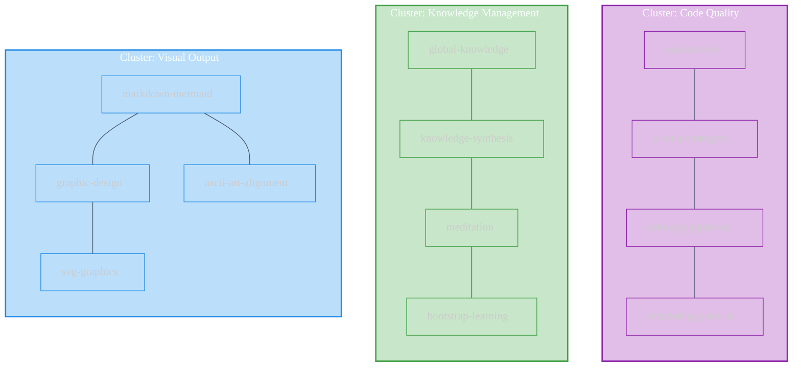

### 3.2 Compiled Artifacts

Three files produced by compilation, stored in `.alex/compiled/`:

#### `skill-vectors.json`

```json
{
  "model": "text-embedding-3-small",
  "dimensions": 1536,
  "compiledAt": "2026-02-07T14:30:00Z",
  "sourceHash": "abc123...",
  "chunks": [
    {
      "id": "markdown-mermaid:0",
      "skill": "markdown-mermaid",
      "section": "Purpose",
      "text": "Mermaid diagram creation skill for flowcharts, sequence diagrams...",
      "vector": [0.023, -0.041, ...]
    }
  ]
}
```

#### `skill-graph.json`

```json
{
  "compiledAt": "2026-02-07T14:30:00Z",
  "nodes": [
    {
      "id": "markdown-mermaid",
      "chunks": ["markdown-mermaid:0", "markdown-mermaid:1", "..."],
      "centroid": [0.021, -0.039, ...]
    }
  ],
  "edges": [
    {
      "source": "markdown-mermaid",
      "target": "graphic-design",
      "strength": 0.9,
      "origin": "explicit",
      "reason": "Color theory, accessibility, contrast principles"
    },
    {
      "source": "markdown-mermaid",
      "target": "svg-graphics",
      "strength": 0.78,
      "origin": "discovered",
      "reason": "Semantic similarity between visual output chunks"
    }
  ]
}
```

#### `cluster-map.json`

```json
{
  "clusters": [
    {
      "name": "Visual Output",
      "skills": ["markdown-mermaid", "graphic-design", "svg-graphics", "ascii-art-alignment"],
      "centroid": [0.021, -0.039, ...],
      "description": "Skills for creating visual artifacts: diagrams, graphics, icons"
    }
  ]
}
```

### 3.3 Semantic Query Pipeline

When a user request arrives, the compiled graph enables a fundamentally different activation path:

```mermaid
%%{init: {'theme': 'dark', 'themeVariables': {'background': '#0f172a', 'primaryColor': '#1e293b', 'primaryTextColor': '#f1f5f9', 'primaryBorderColor': '#818cf8', 'lineColor': '#475569', 'secondaryColor': '#1e293b', 'secondaryBorderColor': '#2dd4bf', 'tertiaryColor': '#1e293b', 'fontFamily': 'Segoe UI, system-ui, sans-serif'}}}%%
flowchart TB
    subgraph KW["Current: Keyword Matching"]
        direction LR
        Q1["make diagrams consistent"] --> SCAN["Scan 87 rows"]
        SCAN --> MATCH1["match: diagram"]
        MATCH1 --> LOAD1["Load markdown-mermaid"]
        LOAD1 --> DONE1["Done - Missing color palette"]
    end

    subgraph SEM["Proposed: Semantic Activation"]
        Q2["make diagrams consistent"] --> EMB["Embed query"]
        EMB --> COS["Cosine similarity"]
        COS --> TOP["Top-5 chunks"]
        TOP --> C1["markdown-mermaid:chunk 2<br/>0.91 - color palette"]
        TOP --> C2["graphic-design:chunk 3<br/>0.87 - color consistency"]
        TOP --> C3["markdown-mermaid:chunk 0<br/>0.85 - diagram creation"]
        TOP --> C4["awareness:chunk 1<br/>0.79 - self-correction"]
        TOP --> C5["lint-clean-markdown:chunk 0<br/>0.76 - formatting"]
        C1 & C2 & C3 & C4 & C5 --> EXPAND["Graph expansion +1 hop"]
        EXPAND --> FINAL["Load 5 skills - Complete context"]
    end

    style KW fill:#ffcdd2,stroke:#e53935,stroke-width:2px
    style SEM fill:#c8e6c9,stroke:#43a047,stroke-width:2px
    style Q1 fill:#1e293b,stroke:#475569
    style Q2 fill:#1e293b,stroke:#475569
    style SCAN fill:#ffcdd2,stroke:#e53935
    style MATCH1 fill:#ffcdd2,stroke:#e53935
    style LOAD1 fill:#ffcdd2,stroke:#e53935
    style DONE1 fill:#ffcdd2,stroke:#e53935
    style EMB fill:#bbdefb,stroke:#1e88e5
    style COS fill:#bbdefb,stroke:#1e88e5
    style TOP fill:#c4a35a,stroke:#475569,color:#fff
    style C1 fill:#e1bee7,stroke:#8e24aa
    style C2 fill:#e1bee7,stroke:#8e24aa
    style C3 fill:#e1bee7,stroke:#8e24aa
    style C4 fill:#e1bee7,stroke:#8e24aa
    style C5 fill:#e1bee7,stroke:#8e24aa
    style EXPAND fill:#c8e6c9,stroke:#43a047
    style FINAL fill:#c8e6c9,stroke:#43a047
    linkStyle default stroke:#475569,stroke-width:1.5px
```

The Mermaid color problem **never happens again** because the query "make diagrams consistent" is semantically close to both the Mermaid palette chunk AND the graphic-design color theory chunk. The system finds the combination automatically.

---

## 4. Compilation Triggers

The compiled graph should be rebuilt when source files change. This runs as a background process — never blocking the user.

| Trigger                                 | Scope          | Behavior                                            |
| --------------------------------------- | -------------- | --------------------------------------------------- |
| **`Alex: Dream`** (neural maintenance)  | Full recompile | Rebuild all vectors, graph, clusters                |
| **Skill file changes**                  | Incremental    | Re-embed changed skill's chunks, update graph edges |
| **New GK/GI files**                     | Incremental    | Add new chunks, recalculate affected clusters       |
| **`Alex: Initialize`** on a new project | Project-scoped | Compile project's DK-* files into local overlay     |
| **Manual: `Alex: Recompile Skills`**    | Full recompile | Force rebuild (debug/recovery)                      |

### Staleness Detection

```mermaid
%%{init: {'theme': 'dark', 'themeVariables': {'background': '#0f172a', 'primaryColor': '#1e293b', 'primaryTextColor': '#f1f5f9', 'primaryBorderColor': '#818cf8', 'lineColor': '#475569', 'secondaryColor': '#1e293b', 'secondaryBorderColor': '#2dd4bf', 'tertiaryColor': '#1e293b', 'fontFamily': 'Segoe UI, system-ui, sans-serif'}}}%%
flowchart LR
    ACT["Extension activates"] --> HASH["Compute hash of<br/>all skill sources"]
    HASH --> CMP{"hash ==<br/>sourceHash?"}
    CMP -->|Yes| LOAD["Load compiled artifacts<br/>from .alex/compiled/"]
    CMP -->|No| RECOMP["Trigger background<br/>recompile"]
    RECOMP --> LOAD

    style ACT fill:#1e293b,stroke:#475569
    style HASH fill:#bbdefb,stroke:#1e88e5
    style CMP fill:#c4a35a,stroke:#475569,color:#fff
    style LOAD fill:#c8e6c9,stroke:#43a047
    style RECOMP fill:#e1bee7,stroke:#8e24aa
    linkStyle default stroke:#475569,stroke-width:1.5px
```

---

## 5. Two-Layer Architecture

The compiled graph doesn't replace the existing system — it wraps it.

```mermaid
%%{init: {'theme': 'dark', 'themeVariables': {'background': '#0f172a', 'primaryColor': '#1e293b', 'primaryTextColor': '#f1f5f9', 'primaryBorderColor': '#818cf8', 'lineColor': '#475569', 'secondaryColor': '#1e293b', 'secondaryBorderColor': '#2dd4bf', 'tertiaryColor': '#1e293b', 'fontFamily': 'Segoe UI, system-ui, sans-serif'}}}%%
block-beta
    columns 1

    block:semantic["Semantic Layer: NEW"]:1
        columns 3
        A["User query → embed"] B["Cosine similarity → top-K"] C["Graph expansion → skill set"]
    end

    block:artifacts["Compiled Artifacts"]:1
        columns 3
        D["skill-vectors.json"] E["skill-graph.json"] F["cluster-map.json"]
    end

    block:source["Source Layer: EXISTING"]:1
        columns 3
        G["SKILL.md files"] H["synapses.json"] I["skill-activation table"]
    end

    semantic --> artifacts
    artifacts --> source

    style semantic fill:#e1bee7,stroke:#8e24aa,stroke-width:2px
    style artifacts fill:#c4a35a,stroke:#475569,color:#fff,stroke-width:2px
    style source fill:#bbdefb,stroke:#1e88e5,stroke-width:2px
    style A fill:#e1bee7,stroke:#8e24aa
    style B fill:#e1bee7,stroke:#8e24aa
    style C fill:#e1bee7,stroke:#8e24aa
    style D fill:#fff3e0,stroke:#c4a35a
    style E fill:#fff3e0,stroke:#c4a35a
    style F fill:#fff3e0,stroke:#c4a35a
    style G fill:#bbdefb,stroke:#1e88e5
    style H fill:#bbdefb,stroke:#1e88e5
    style I fill:#bbdefb,stroke:#1e88e5
```

### Relationship Between Layers

| Aspect                  | Source Layer                     | Semantic Layer                                                |
| ----------------------- | -------------------------------- | ------------------------------------------------------------- |
| **Audience**            | Human (Fabio) + LLM              | Machine retrieval only                                        |
| **Format**              | Markdown + JSON                  | Vector arrays + graph edges                                   |
| **Editable?**           | Yes — primary authoring surface  | No — generated artifact                                       |
| **Version controlled?** | Yes — in `.github/skills/`       | Optional — can be in `.gitignore`                             |
| **When rebuilt?**       | Manual edits                     | Auto-compiled from source                                     |
| **Synapse discovery**   | Manual — you write synapses.json | Automatic — embedding similarity discovers hidden connections |

### Synapse Discovery: The Best Part

Today, synapses are manually curated. You wrote `markdown-mermaid → graphic-design (0.9)` because you know color theory applies. But there are likely **dozens of undiscovered connections** between 75 skills.

The compilation step produces a **similarity matrix** across all skill chunks. Any pair with cosine similarity > 0.75 that ISN'T already in `synapses.json` is a **discovered synapse** — a connection that exists semantically but was never made explicit.

```mermaid
%%{init: {'theme': 'dark', 'themeVariables': {'background': '#0f172a', 'primaryColor': '#1e293b', 'primaryTextColor': '#f1f5f9', 'primaryBorderColor': '#818cf8', 'lineColor': '#475569', 'secondaryColor': '#1e293b', 'secondaryBorderColor': '#2dd4bf', 'tertiaryColor': '#1e293b', 'fontFamily': 'Segoe UI, system-ui, sans-serif'}}}%%
graph LR
    PE["prompt-engineering"] -.->|"0.81 — Chunking info for LLM"| CL["cognitive-load"]
    PM["post-mortem"] -.->|"0.79 — 5-whys overlap"| RCA["root-cause-analysis"]
    DP["debugging-patterns"] -.->|"0.77 — Explain to find bug"| RD["rubber-duck-debugging"]
    SR["security-review"] -.->|"0.76 — STRIDE modeling"| SFI["microsoft-sfi"]

    style PE fill:#bbdefb,stroke:#1e88e5
    style CL fill:#e1bee7,stroke:#8e24aa
    style PM fill:#bbdefb,stroke:#1e88e5
    style RCA fill:#e1bee7,stroke:#8e24aa
    style DP fill:#bbdefb,stroke:#1e88e5
    style RD fill:#e1bee7,stroke:#8e24aa
    style SR fill:#bbdefb,stroke:#1e88e5
    style SFI fill:#e1bee7,stroke:#8e24aa
    linkStyle default stroke:#475569,stroke-width:1.5px
```

After compilation, you could review these and either:
- **Promote** them into explicit `synapses.json` entries (with reason text)
- **Dismiss** them as false positives (too generic a similarity)

This turns the compilation step into a **synapse discovery tool** — the graph teaches you connections you didn't see.

---

## 6. Embedding Strategy

### Provider Options (No VS Code Proposed API Required)

| Provider                    | Model                    | Dimensions | Cost               | Latency | Offline? |
| --------------------------- | ------------------------ | :--------: | ------------------ | ------- | :------: |
| **Azure OpenAI**            | `text-embedding-3-small` |    1536    | ~$0.02 / 1M tokens | ~200ms  |    ❌     |
| **Azure OpenAI**            | `text-embedding-3-large` |    3072    | ~$0.13 / 1M tokens | ~300ms  |    ❌     |
| **Local (Transformers.js)** | `all-MiniLM-L6-v2`       |    384     | Free               | ~50ms   |    ✅     |
| **Local (ONNX Runtime)**    | `bge-small-en-v1.5`      |    384     | Free               | ~30ms   |    ✅     |

### Recommended: Hybrid Approach

```mermaid
%%{init: {'theme': 'dark', 'themeVariables': {'background': '#0f172a', 'primaryColor': '#1e293b', 'primaryTextColor': '#f1f5f9', 'primaryBorderColor': '#818cf8', 'lineColor': '#475569', 'secondaryColor': '#1e293b', 'secondaryBorderColor': '#2dd4bf', 'tertiaryColor': '#1e293b', 'fontFamily': 'Segoe UI, system-ui, sans-serif'}}}%%
flowchart LR
    subgraph BG["Compilation: background"]
        direction TB
        DREAM["Alex: Dream"] --> API["Azure OpenAI<br/>text-embedding-3-small"]
        API --> VEC["~400 vectors<br/>1536 dims"]
        VEC --> STORE[".alex/compiled/"]
    end

    subgraph RT["Query: real-time"]
        direction TB
        Q["User query"] --> QEMB["Embed query<br/>~50 tokens"]
        QEMB --> COS["Cosine similarity<br/>~1ms in-memory"]
        COS --> TOPK["Top-K skills"]
    end

    BG ~~~ RT
    STORE -.->|"precomputed vectors"| COS

    style BG fill:#bbdefb,stroke:#1e88e5,stroke-width:2px
    style RT fill:#c8e6c9,stroke:#43a047,stroke-width:2px

    style DREAM fill:#bbdefb,stroke:#1e88e5
    style API fill:#c4a35a,stroke:#475569,color:#fff
    style VEC fill:#e1bee7,stroke:#8e24aa
    style STORE fill:#e1bee7,stroke:#8e24aa
    style Q fill:#1e293b,stroke:#475569
    style QEMB fill:#c8e6c9,stroke:#43a047
    style COS fill:#c8e6c9,stroke:#43a047
    style TOPK fill:#c8e6c9,stroke:#43a047
```

**Compilation**: Azure OpenAI `text-embedding-3-small` — higher quality, 1536 dims, runs during Dream/maintenance (~75 skills × ~5 chunks × ~300 tokens = ~112K tokens ≈ $0.002 per compile).

**Query**: Same model for consistency — single query embedding ~50 tokens (negligible cost), cosine similarity against precomputed vectors ~1ms (in-memory).

For fully offline scenarios, fall back to a local model at lower quality. The compilation artifacts are interchangeable — just recompile when switching providers.

### Cost Estimate

| Operation                    | Frequency                | Tokens | Cost        |
| ---------------------------- | ------------------------ | ------ | ----------- |
| Full compile (75 skills)     | Weekly (during Dream)    | ~112K  | $0.002      |
| Incremental (1 skill change) | As needed                | ~1.5K  | $0.00003    |
| Query embedding              | Per chat turn            | ~50    | $0.000001   |
| **Monthly estimate**         | 4 compiles + 200 queries | ~460K  | **< $0.01** |

Negligible. The entire semantic skill graph costs less per month than a single LLM chat turn.

---

## 7. Solving the Mermaid Problem

Walk through how the compiled graph prevents the recurring Mermaid color issue:

### Before (Keyword Activation)

```
1. User: "create a flowchart showing the architecture"
2. Skill activation scans keyword table
3. Match: "flowchart" → markdown-mermaid
4. Load markdown-mermaid/SKILL.md
5. Generate diagram with whatever colors the LLM defaults to
6. User: "wrong colors, use our palette"
7. Still in markdown-mermaid context — palette definition is there but buried
8. LLM uses inline colors, misses the default init directive
9. Another round of fixes...
```

### After (Semantic Activation)

```
1. User: "create a flowchart showing the architecture"
2. Embed query: "create flowchart showing architecture"
3. Top-K semantic matches:
     markdown-mermaid:chunk[0] (0.93) — diagram creation
     markdown-mermaid:chunk[2] (0.88) — color palette + default init directive
     graphic-design:chunk[3] (0.82) — color consistency principles
     graphic-design:chunk[5] (0.77) — accessibility contrast
4. Load: markdown-mermaid + graphic-design
5. Generate diagram WITH correct palette, init directive, and contrast checks
6. Done. No rework.
```

The palette chunk matches because "create a flowchart" is semantically related to "Mermaid diagram styling" — even though no keyword overlaps. And `graphic-design` loads because its color theory chunks are in the same vector neighborhood as Mermaid styling chunks.

---

## 8. Implementation Plan (Details)

### Phase 1 — Proof of Concept (1 week)

Build the compilation pipeline as a standalone script with no VS Code API dependency.

| Step | Task                                                  | Output                 |
| ---- | ----------------------------------------------------- | ---------------------- |
| 1    | Parse all 75 `SKILL.md` files + their `synapses.json` | Structured skill array |
| 2    | Chunk each skill into ~300-token segments             | ~375 chunks            |
| 3    | Call Azure OpenAI embeddings API                      | `skill-vectors.json`   |
| 4    | Compute pairwise cosine similarity                    | Similarity matrix      |
| 5    | Merge explicit synapses + discovered edges            | `skill-graph.json`     |
| 6    | K-means clustering on skill centroids                 | `cluster-map.json`     |
| 7    | Build query function: embed → cosine → top-K → expand | CLI test harness       |

**Validation**: Run the 3 known failure cases through the query function and confirm correct skill activation.

### Phase 2 — Extension Integration (1 week)

Wire the compiled graph into Alex's existing skill activation.

| Step | Task                                           | Details                                             |
| ---- | ---------------------------------------------- | --------------------------------------------------- |
| 1    | Add `alex.recompileSkills` command             | Triggers full pipeline, stores in `.alex/compiled/` |
| 2    | Integrate into Dream maintenance               | Recompile during `Alex: Dream` command              |
| 3    | Add semantic query to `skill-activation`       | Before keyword table scan, query the vector index   |
| 4    | Add staleness detection on activation          | Hash check → background recompile if stale          |
| 5    | Fallback to keyword table if no compiled graph | Graceful degradation if embeddings unavailable      |

### Phase 3 — Synapse Discovery Dashboard (1 week)

Surface discovered connections for human review.

| Step | Task                                             | Details                                                            |
| ---- | ------------------------------------------------ | ------------------------------------------------------------------ |
| 1    | Generate `discovered-synapses.md` during compile | List all high-similarity pairs not in explicit synapses            |
| 2    | TreeView of discovered connections               | Expandable tree: skill → discovered connections → similarity score |
| 3    | "Promote" action on discovered synapses          | One-click: add to `synapses.json` with auto-generated reason       |
| 4    | "Dismiss" action                                 | Mark as false positive — excluded from future reports              |

### Phase 4 — Global Knowledge Integration (1 week)

Extend the graph to cross-project knowledge.

| Step | Task                                        | Details                                                              |
| ---- | ------------------------------------------- | -------------------------------------------------------------------- |
| 1    | Include GK-* patterns in compilation        | ~25 patterns → embedded + linked to relevant skill clusters          |
| 2    | Include GI-* insights                       | ~166 insights → embedded, searchable alongside skills                |
| 3    | Cross-project query                         | "How did I solve auth caching?" finds GI-* insights + related skills |
| 4    | Store global vectors in `~/.alex/compiled/` | Shared across all projects                                           |

---

## 9. Risk Assessment

| Risk                                                   | Severity   | Mitigation                                                                              |
| ------------------------------------------------------ | ---------- | --------------------------------------------------------------------------------------- |
| **Embedding API unavailable** (offline, quota, outage) | Medium     | Graceful fallback to keyword table. Compiled artifacts cached locally.                  |
| **False positive skills loaded**                       | Low        | Top-K threshold tuning. Start conservative (K=3), increase based on feedback.           |
| **Compilation cost**                                   | Negligible | Full compile < $0.01. No ongoing compute.                                               |
| **Vector drift on model update**                       | Low        | Recompile all vectors when embedding model changes. `sourceHash` + `model` in metadata. |
| **Stale graph**                                        | Low        | Hash-based staleness detection. Auto-recompile during Dream.                            |
| **Over-engineering**                                   | Medium     | Phase 1 is a script + 3 JSON files. No infrastructure. Can abandon cheaply.             |

---

## 10. Success Metrics

| Metric                                    | Before                                 | Target                             | How to Measure                                             |
| ----------------------------------------- | -------------------------------------- | ---------------------------------- | ---------------------------------------------------------- |
| **Correct skill activation on first try** | ~70% (estimated from rework frequency) | 95%+                               | Track skill loads vs. corrections per session              |
| **Mermaid rework cycles**                 | 2-3 per document                       | 0                                  | Count palette/layout fix requests                          |
| **Undiscovered synapse rate**             | Unknown                                | Discover 20+ initially             | Count edges in `skill-graph.json` with origin "discovered" |
| **Skill activation latency**              | ~500ms (file reads)                    | ~50ms (vector lookup + file reads) | Time from query to skill set loaded                        |
| **Knowledge search relevance**            | Keyword-dependent                      | Concept-dependent                  | Qualitative: does `memory_search` find what you meant?     |

---

## Appendix: Why Not VS Code's Embeddings API?

The VS Code source analysis identified a `vscode.lm.computeEmbeddings` proposed API. We're deliberately NOT using it because:

1. **Marketplace blocker** — proposed APIs cannot be published
2. **Namespace instability** — source has `TODO@API strictly not the right namespace`
3. **No version number** — the most unstable proposed API in the set
4. **Less capable** — Azure OpenAI embeddings offer higher dimensions, more models, and direct control
5. **Vendor lock-in** — ties to whatever embedding model VS Code ships, which may change

Direct Azure OpenAI calls give Alex full control over model selection, dimension size, and upgrade timing. The compiled artifacts are portable and work offline once generated.

If VS Code's embeddings API eventually graduates to stable AND offers meaningful advantages, it could be added as an additional provider alongside Azure OpenAI — the architecture supports multiple embedding backends.

---

*This plan transforms Alex's skill system from a keyword lookup table into a semantic knowledge graph — using the same compilation metaphor that makes software development work: source code for humans, compiled output for machines.*
