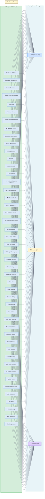

# Trifecta Catalog

> **Last Audited**: 2026-04-08
> **Protocol**: `.github/instructions/trifecta-audit.instructions.md`
> **Principle**: Completeness with purpose, not completeness for its own sake.

**Related**: [Cognitive Architecture](./COGNITIVE-ARCHITECTURE.md) · [Skills Catalog](../skills/SKILLS-CATALOG.md) · [Agent Catalog](./AGENT-CATALOG.md)

The trifecta pattern encodes architecturally significant capabilities across all three memory systems. **Not every file needs a trifecta.** This catalog tracks which capabilities have earned one — and why.

---

## Memory System Roles

| System          | File Type          | Encodes                        | Brain Analog      |
| --------------- | ------------------ | ------------------------------ | ----------------- |
| **Declarative** | `SKILL.md`         | What + Why (domain patterns)   | Neocortex         |
| **Procedural**  | `.instructions.md` | How (auto-loaded steps)        | Basal Ganglia     |
| **Interactive** | `.prompt.md`       | Guided workflow (user-invoked) | Prefrontal Cortex |

A capability in only one system has blind spots:
- **Skill only**: Knows *what* but not *how* — requires manual guidance
- **Instruction only**: Follows steps but doesn't understand *why* — brittle to novelty
- **Prompt only**: Can be guided but can't proactively apply the knowledge

## Scripts Are Muscles, Not Memories

Scripts (`.ps1`, `.js`, `.ts`) are **execution artifacts** — "muscles" that perform physical work. They are NOT a fourth memory system. The trifecta is Skill + Instruction + Prompt. Scripts are *referenced by* trifecta files, never a component of them.

| Concept      | Brain Analog                          | Alex Implementation                             |
| ------------ | ------------------------------------- | ----------------------------------------------- |
| **Muscles**  | Motor cortex → skeletal muscles       | Scripts perform actions (build, sync, validate) |
| **Memories** | Hippocampus, neocortex, basal ganglia | Skills, instructions, prompts encode knowledge  |

**The relationship**: Trifecta files *document when and why* to flex the muscle. Scripts *do the flexing*.

```
Instruction: "Run normalize-paths.ps1 after reorganizing files"
                   ↓ references
Script:     .github/muscles/normalize-paths.ps1 (the muscle that does the work)
```

**Trifecta-referenced muscles** (`.github/muscles/`): Execution scripts referenced by trifecta files.
**Other scripts** (`scripts/`): Release utilities not part of trifectas (release-preflight.ps1, release-vscode.ps1, etc.).

| Script                                        | Referenced By                                     |
| --------------------------------------------- | ------------------------------------------------- |
| `.github/muscles/audit-master-alex.ps1`       | dream-state-automation, architecture-audit        |
| `.github/muscles/brain-qa.ps1`                | brain-qa (31-phase validation)                    |
| `.github/muscles/build-extension-package.ps1` | heir-sync-management, release-management          |
| `.github/muscles/dream-cli.ts`                | dream-state-automation (CLI alternative)          |
| `.github/muscles/gamma-generator.cjs`         | gamma-presentations (CLI generation)              |
| `.github/muscles/normalize-paths.ps1`         | dream-state-automation (path normalization)       |
| `.github/muscles/pptxgen-cli.ts`              | pptx-generation (offline PPTX)                    |
| `.github/muscles/sync-architecture.cjs`       | heir-sync-management, build-extension-package.ps1 |
| `.github/muscles/validate-skills.ps1`         | brain-qa, dream-state-automation                  |
| `.github/muscles/validate-synapses.ps1`       | brain-qa, dream-state-automation                  |
| `scripts/release-preflight.ps1`               | release-management, release-preflight             |

---

## Complete Trifectas (45)

Capabilities with all three memory system components — each justified by the "Why?" test.

### Research-First Development

| Component   | File                                                           | Why It Exists                                                                                       |
| ----------- | -------------------------------------------------------------- | --------------------------------------------------------------------------------------------------- |
| Skill       | `.github/skills/research-first-development/SKILL.md`           | Teaches the 4D gap analysis model (GA-S/GA-I/GA-A/GA-P), Research → Teach → Plan → Execute paradigm |
| Instruction | `.github/instructions/research-first-workflow.instructions.md` | Auto-loaded pre-project procedure: when to research, how to encode, how to gap-analyze              |
| Prompt      | `.github/prompts/gapanalysis.prompt.md`                        | `/gapanalysis` — user invokes interactive 4-dimension gap analysis                                  |

### Meditation

| Component   | File                                              | Why It Exists                                                                                                |
| ----------- | ------------------------------------------------- | ------------------------------------------------------------------------------------------------------------ |
| Skill       | `.github/skills/meditation/SKILL.md`              | Domain knowledge: consolidation theory, pre-meditation optimization, session types                           |
| Instruction | `.github/instructions/meditation.instructions.md` | 5-phase procedure: Content Analysis → Memory Creation → Synaptic Connection → Skill Validation → Integration |
| Prompt      | `.github/prompts/meditate.prompt.md`              | `/meditate` — user invokes guided consolidation session                                                      |

### Self-Actualization

| Component   | File                                                      | Why It Exists                                                                               |
| ----------- | --------------------------------------------------------- | ------------------------------------------------------------------------------------------- |
| Skill       | `.github/skills/self-actualization/SKILL.md`              | Domain knowledge: assessment dimensions, growth metrics, architecture optimization patterns |
| Instruction | `.github/instructions/self-actualization.instructions.md` | Auto-loaded procedure: how to run deep assessment, what to evaluate, how to report          |
| Prompt      | `.github/prompts/selfactualize.prompt.md`                 | `/selfactualize` — user invokes deep architecture assessment                                |

### Dream / Neural Maintenance

| Component   | File                                                          | Why It Exists                                                                                |
| ----------- | ------------------------------------------------------------- | -------------------------------------------------------------------------------------------- |
| Skill       | `.github/skills/dream-state/SKILL.md`                         | Domain knowledge: 6-phase protocol concepts, health metrics, dream vs meditation distinction |
| Instruction | `.github/instructions/dream-state-automation.instructions.md` | Auto-loaded procedure: activation methods, repair steps, consolidation mappings              |
| Prompt      | `.github/prompts/dream.prompt.md`                             | `/dream` — user invokes neural maintenance                                                   |

### Release Management

| Component   | File                                                      | Why It Exists                                                                                  |
| ----------- | --------------------------------------------------------- | ---------------------------------------------------------------------------------------------- |
| Skill       | `.github/skills/release-process/SKILL.md`                 | Domain knowledge: marketplace workflows, PAT handling, versioning strategy                     |
| Instruction | `.github/instructions/release-management.instructions.md` | Auto-loaded procedure: Step 0-3 pre-release assessment, changelog generation, publish sequence |
| Prompt      | `.github/prompts/release.prompt.md`                       | `/release` — user invokes release workflow                                                     |

**Also has**: `release-preflight/SKILL.md` (pre-release validation — companion skill, not duplicate)

### Extension Audit Methodology

| Component   | File                                                               | Why It Exists                                                                                              |
| ----------- | ------------------------------------------------------------------ | ---------------------------------------------------------------------------------------------------------- |
| Skill       | `.github/skills/extension-audit-methodology/SKILL.md`              | Domain knowledge: 5-dimension audit — debug hygiene, dead code, performance, menu validation, dependencies |
| Instruction | `.github/instructions/extension-audit-methodology.instructions.md` | Auto-loaded procedure: systematic audit steps, checklist validation, regression prevention                 |
| Prompt      | `.github/prompts/extension-audit-methodology.prompt.md`            | `/extension-audit-methodology` — user invokes comprehensive extension audit workflow                       |

**Inheritance**: `heir:vscode` — VS Code extension-specific audit capability

### Brand Asset Management

| Component   | File                                                          | Why It Exists                                                                         |
| ----------- | ------------------------------------------------------------- | ------------------------------------------------------------------------------------- |
| Skill       | `.github/skills/brand-asset-management/SKILL.md`              | Domain knowledge: brand hierarchy, locked elements, persona copy, platform guidelines |
| Instruction | `.github/instructions/brand-asset-management.instructions.md` | Auto-loaded procedure: asset locations, generation commands, deployment steps         |
| Prompt      | `.github/prompts/brand.prompt.md`                             | `/brand` — user invokes brand management workflow                                     |

### AI Character Reference Generation

| Component   | File                                                                     | Why It Exists                                                                                            |
| ----------- | ------------------------------------------------------------------------ | -------------------------------------------------------------------------------------------------------- |
| Skill       | `.github/skills/ai-character-reference-generation/SKILL.md`              | Domain knowledge: face-consistent portrait generation via Nano-Banana Pro / Flux 2 Pro, model comparison |
| Instruction | `.github/instructions/ai-character-reference-generation.instructions.md` | Auto-loaded procedure: reference photo setup, model selection, `image_input` array format, cost guidance |
| Prompt      | `.github/prompts/ai-character-reference-generation.prompt.md`            | `/ai-character-reference-generation` — user invokes portrait generation with face reference workflow     |

**Synapse connections**: visual-memory (0.95), image-handling (0.9), graphic-design (0.7), mcp-development (0.6)
**Inheritance**: `inheritable` — face-consistent generation applicable across all heirs

### AI-Generated README Banners

| Component   | File                                                               | Why It Exists                                                                                                |
| ----------- | ------------------------------------------------------------------ | ------------------------------------------------------------------------------------------------------------ |
| Skill       | `.github/skills/ai-generated-readme-banners/SKILL.md`              | Domain knowledge: ultra-wide cinematic banners via Ideogram v2, typography, professional README compositions |
| Instruction | `.github/instructions/ai-generated-readme-banners.instructions.md` | Auto-loaded procedure: prompt templates, aspect ratios, model parameters, quality control                    |
| Prompt      | `.github/prompts/ai-generated-readme-banners.prompt.md`            | `/ai-generated-readme-banners` — user invokes guided banner generation workflow                              |

**Synapse connections**: brand-asset-management (0.9), prompt-engineering (0.88), ai-character-reference-generation (0.85), markdown-mermaid (0.7)
**Inheritance**: `inheritable` — README banner generation applicable across all heirs

### Bootstrap Learning

| Component   | File                                                      | Why It Exists                                                                     |
| ----------- | --------------------------------------------------------- | --------------------------------------------------------------------------------- |
| Skill       | `.github/skills/bootstrap-learning/SKILL.md`              | Domain knowledge: domain-agnostic learning patterns, knowledge acquisition theory |
| Instruction | `.github/instructions/bootstrap-learning.instructions.md` | Auto-loaded procedure: how to learn new domains, encoding steps                   |
| Prompt      | `.github/prompts/learn.prompt.md`                         | `/learn` — user invokes guided learning session                                   |

### Brain QA

| Component   | File                                                  | Why It Exists                                                                                    |
| ----------- | ----------------------------------------------------- | ------------------------------------------------------------------------------------------------ |
| Skill       | `.github/skills/brain-qa/SKILL.md`                    | Domain knowledge: 31-phase validation, semantic/logic/code/architectural review dimensions       |
| Instruction | `.github/instructions/semantic-audit.instructions.md` | Auto-loaded procedure: 4-dimension semantic audit (meaning, logic, code alignment, architecture) |
| Prompt      | `.github/prompts/brainqa.prompt.md`                   | `/brainqa` — user invokes guided brain QA session (script + semantic review)                     |

**Muscle**: `brain-qa.ps1` — the structural validation engine. The trifecta adds the semantic layer the script can't automate.

### Architecture Audit (includes Master Alex Audit)

| Component   | File                                                  | Why It Exists                                                                           |
| ----------- | ----------------------------------------------------- | --------------------------------------------------------------------------------------- |
| Skill       | `.github/skills/architecture-audit/SKILL.md`          | Domain knowledge: 22-section audit, semantic/logic/code/architectural review dimensions |
| Instruction | `.github/instructions/semantic-audit.instructions.md` | Shared procedure: same 4-dimension semantic audit methodology used by brain-qa          |
| Prompt      | `.github/prompts/masteraudit.prompt.md`               | `/masteraudit` — user invokes guided project audit (script + semantic review)           |

**Muscle**: `audit-master-alex.ps1` — the structural validation engine.
**Shared instruction**: Both brain-qa and architecture-audit reference the same `semantic-audit.instructions.md`.

### UI/UX Design

| Component   | File                                                | Why It Exists                                                                                                                     |
| ----------- | --------------------------------------------------- | --------------------------------------------------------------------------------------------------------------------------------- |
| Skill       | `.github/skills/ui-ux-design/SKILL.md`              | Domain knowledge: WCAG 2.1 AA accessibility patterns, design system implementation, testing workflows                             |
| Instruction | `.github/instructions/ui-ux-design.instructions.md` | Auto-loaded procedure: accessibility standards (typography ≥11px, contrast 4.5:1, touch ≥44px) for HTML/JSX/TSX/Vue/Svelte        |
| Prompt      | `.github/prompts/ui-ux-audit.prompt.md`             | `/uiuxaudit` — user invokes systematic 5-phase accessibility audit (Visual → Accessibility → Design System → Testing → Reporting) |

**Also has**: Bidirectional synapse connections to code-review (0.85), graphic-design (0.7), testing-strategies (0.8), vscode-extension-patterns (0.75)
**Inheritance**: `inheritable` — promotes to all heirs

### VS Code Configuration Validation

| Component   | File                                                                   | Why It Exists                                                                                       |
| ----------- | ---------------------------------------------------------------------- | --------------------------------------------------------------------------------------------------- |
| Skill       | `.github/skills/vscode-configuration-validation/SKILL.md`              | Domain knowledge: VS Code manifest validation patterns, runtime code vs declared config consistency |
| Instruction | `.github/instructions/vscode-configuration-validation.instructions.md` | Auto-loaded procedure: validates extension manifest against actual code usage                       |
| Prompt      | `.github/prompts/validate-config.prompt.md`                            | `/validateconfig` — user invokes manifest vs code audit workflow                                    |

**Inheritance**: `heir:vscode` — VS Code heir-specific capability (no universal promotion)

### Heir Sync Management

| Component   | File                                                           | Why It Exists                                                                   |
| ----------- | -------------------------------------------------------------- | ------------------------------------------------------------------------------- |
| Skill       | `.github/skills/heir-sync-management/SKILL.md`                 | Domain knowledge: quality gates, promotion criteria, master→heir sync patterns  |
| Instruction | `.github/instructions/heir-skill-promotion.instructions.md`    | Auto-loaded procedure: validation scoring, YAML frontmatter, promotion workflow |
| ~~Prompt~~  | ~~`promotetomaster.prompt.md`~~ — **MISSING** (needs creation) | `/promotetomaster` — skill promotion from heir to Master Alex                   |

**Status**: Skill+Instruction only — prompt does not exist yet.
**Muscle**: `sync-architecture.cjs` — automated master→heir synchronization with PII protection
**Inheritance**: `master-only` — heir-sync-management is a master-only skill

### Markdown to Word Conversion

| Component   | File                                              | Why It Exists                                                                              |
| ----------- | ------------------------------------------------- | ------------------------------------------------------------------------------------------ |
| Skill       | `.github/skills/md-to-word/SKILL.md`              | Domain knowledge: markdown→docx conversion patterns, diagram embedding, style preservation |
| Instruction | `.github/instructions/md-to-word.instructions.md` | Auto-loaded procedure: pandoc workflow, OOXML post-processing, mermaid→image conversion    |
| Prompt      | `.github/prompts/word.prompt.md`                  | `/word` — user invokes markdown to Word document conversion with diagrams                  |

**Muscle**: `md-to-word.cjs` — Node.js script for conversion with diagram support
**Inheritance**: `inheritable` — useful for academic and professional documentation across all heirs

### Gamma Presentation Generation

| Component   | File                                                      | Why It Exists                                                                   |
| ----------- | --------------------------------------------------------- | ------------------------------------------------------------------------------- |
| Skill       | `.github/skills/gamma-presentations/SKILL.md`             | Domain knowledge: Gamma.app API patterns, presentation structure, card types    |
| Instruction | `.github/instructions/gamma-presentation.instructions.md` | Auto-loaded procedure: API authentication, content generation, export workflows |
| Prompt      | `.github/prompts/gamma.prompt.md`                         | `/gamma` — user invokes Gamma presentation generation from markdown             |

**Muscle**: `gamma-generator.cjs` — Node.js CLI for Gamma API integration
**Inheritance**: `inheritable` — presentation generation valuable across academic and business heirs
**Integration**: Uses secrets-management trifecta for GAMMA_API_KEY storage

### Secrets Management

| Component   | File                                                      | Why It Exists                                                                                              |
| ----------- | --------------------------------------------------------- | ---------------------------------------------------------------------------------------------------------- |
| Skill       | `.github/skills/secrets-management/SKILL.md`              | Domain knowledge: VS Code SecretStorage API, platform encryption patterns, token lifecycle management      |
| Instruction | `.github/instructions/secrets-management.instructions.md` | Auto-loaded procedure: SecretStorage integration, .env detection, migration strategies, security checklist |
| Prompt      | `.github/prompts/secrets.prompt.md`                       | `/secrets` — user invokes token management and .env secret detection workflow                              |

**Service**: `secretsManager.ts` — Centralized credential storage (750+ lines) with OS-encrypted SecretStorage API
**Commands**: `alex.manageSecrets` (token UI), `alex.detectEnvSecrets` (.env scanning)
**Inheritance**: `inheritable` — critical for any heir handling API credentials
**Platform encryption**: Windows Credential Manager, macOS Keychain, Linux Secret Service

### Chat Participant Patterns

| Component   | File                                                             | Why It Exists                                                                                   |
| ----------- | ---------------------------------------------------------------- | ----------------------------------------------------------------------------------------------- |
| Skill       | `.github/skills/chat-participant-patterns/SKILL.md`              | Domain knowledge: VS Code chat participant API, slash command scaffolding, LM tool registration |
| Instruction | `.github/instructions/chat-participant-patterns.instructions.md` | Auto-loaded procedure: participant handler patterns, streaming API, tool use workflow           |
| Prompt      | `.github/prompts/chat-participant.prompt.md`                     | `/chat-participant` — user invokes scaffold workflow for new chat participant                   |

**Inheritance**: `heir:vscode` — VS Code extension development capability

### VS Code Extension Patterns

| Component   | File                                                             | Why It Exists                                                                         |
| ----------- | ---------------------------------------------------------------- | ------------------------------------------------------------------------------------- |
| Skill       | `.github/skills/vscode-extension-patterns/SKILL.md`              | Domain knowledge: activation events, contribution points, webview patterns, packaging |
| Instruction | `.github/instructions/vscode-extension-patterns.instructions.md` | Auto-loaded procedure: extension development standards, API usage, ADR compliance     |
| Prompt      | `.github/prompts/extension-audit-methodology.prompt.md`          | `/extension-audit` — systematic 5-dimension quality audit for VS Code extensions      |

**Inheritance**: `heir:vscode` — core to VS Code heir identity

### MCP Development

| Component   | File                                                   | Why It Exists                                                                                        |
| ----------- | ------------------------------------------------------ | ---------------------------------------------------------------------------------------------------- |
| Skill       | `.github/skills/mcp-development/SKILL.md`              | Domain knowledge: Model Context Protocol architecture, tool/resource/prompt design, server packaging |
| Instruction | `.github/instructions/mcp-development.instructions.md` | Auto-loaded procedure: MCP server scaffolding, transport setup, capability registration              |
| Prompt      | `.github/prompts/mcp-server.prompt.md`                 | `/mcp-server` — user invokes MCP server scaffold and tool design workflow                            |

**Inheritance**: `inheritable` — MCP development valuable across all coding heirs

### Microsoft Graph API

| Component   | File                                                       | Why It Exists                                                                            |
| ----------- | ---------------------------------------------------------- | ---------------------------------------------------------------------------------------- |
| Skill       | `.github/skills/microsoft-graph-api/SKILL.md`              | Domain knowledge: Graph API surface, auth flows (MSAL), endpoint patterns, OData queries |
| Instruction | `.github/instructions/microsoft-graph-api.instructions.md` | Auto-loaded procedure: auth setup, API call patterns, pagination, permissions            |
| Prompt      | `.github/prompts/graph-api.prompt.md`                      | `/graph-api` — user invokes Graph API integration workflow                               |

**Inheritance**: `inheritable` — Graph API used across M365, Teams, and general Microsoft integration heirs

### Teams App Patterns

| Component   | File                                                      | Why It Exists                                                                                |
| ----------- | --------------------------------------------------------- | -------------------------------------------------------------------------------------------- |
| Skill       | `.github/skills/teams-app-patterns/SKILL.md`              | Domain knowledge: Teams app manifest, bot/tab/message extension scaffolding, deployment      |
| Instruction | `.github/instructions/teams-app-patterns.instructions.md` | Auto-loaded procedure: Teams Toolkit workflow, app registration, Teams-specific API patterns |
| Prompt      | `.github/prompts/teams-app.prompt.md`                     | `/teams-app` — user invokes Teams app scaffold and deployment workflow                       |

**Inheritance**: `heir:m365` — Microsoft 365 heir-specific capability

### M365 Agent Debugging

| Component   | File                                                        | Why It Exists                                                                                       |
| ----------- | ----------------------------------------------------------- | --------------------------------------------------------------------------------------------------- |
| Skill       | `.github/skills/m365-agent-debugging/SKILL.md`              | Domain knowledge: declarative agent debugging, Developer Portal, troubleshooting conditional access |
| Instruction | `.github/instructions/m365-agent-debugging.instructions.md` | Auto-loaded procedure: AADSTS error resolution, manual upload workflow, Teams testing steps         |
| Prompt      | `.github/prompts/m365-agent-debug.prompt.md`                | `/m365-agent-debug` — user invokes M365 declarative agent diagnostic workflow                       |

**Inheritance**: `heir:m365` — M365 heir-specific troubleshooting capability

### Markdown & Mermaid

| Component   | File                                                                          | Why It Exists                                                                                    |
| ----------- | ----------------------------------------------------------------------------- | ------------------------------------------------------------------------------------------------ |
| Skill       | `.github/skills/markdown-mermaid/SKILL.md`                                    | Domain knowledge: Mermaid diagram types, syntax, VS Code rendering, diagram selection heuristics |
| Instruction | `.github/instructions/markdown-mermaid.instructions.md`                       | Auto-loaded procedure: diagram type selection, syntax patterns, troubleshooting rendering        |
| ~~Prompt~~  | ~~`diagramming-mastery-meditation.prompt.md`~~ — **MISSING** (needs creation) | `/diagramming` — Mermaid mastery integration meditation session                                  |

**Status**: Skill+Instruction only — prompt does not exist yet.
**Inheritance**: `inheritable` — documentation visualization across all heirs

### Testing Strategies

| Component   | File                                                      | Why It Exists                                                                                         |
| ----------- | --------------------------------------------------------- | ----------------------------------------------------------------------------------------------------- |
| Skill       | `.github/skills/testing-strategies/SKILL.md`              | Domain knowledge: test pyramid, integration vs unit vs e2e tradeoffs, confidence-without-over-testing |
| Instruction | `.github/instructions/testing-strategies.instructions.md` | Auto-loaded procedure: test selection, coverage strategy, boundary testing patterns                   |
| Prompt      | `.github/prompts/tdd.prompt.md`                           | `/tdd` — user invokes guided test-driven development workflow                                         |

**Inheritance**: `inheritable` — testing discipline universal across all coding heirs

### Knowledge Synthesis

| Component   | File                                                       | Why It Exists                                                                                   |
| ----------- | ---------------------------------------------------------- | ----------------------------------------------------------------------------------------------- |
| Skill       | `.github/skills/knowledge-synthesis/SKILL.md`              | Domain knowledge: abstraction levels, cross-project pattern extraction, GI/GK storage hierarchy |
| Instruction | `.github/instructions/knowledge-synthesis.instructions.md` | Auto-loaded procedure: when to abstract, how to generalize, storage level selection             |
| Prompt      | `.github/prompts/cross-domain-transfer.prompt.md`          | `/cross-domain` — user invokes cross-domain knowledge transfer and pattern application          |

**Inheritance**: `inheritable` — cross-project learning universal across all heirs

### North Star

| Component   | File                                              | Why It Exists                                                                                       |
| ----------- | ------------------------------------------------- | --------------------------------------------------------------------------------------------------- |
| Skill       | `.github/skills/north-star/SKILL.md`              | Domain knowledge: North Star definition, success metrics, alignment patterns, anti-drift heuristics |
| Instruction | `.github/instructions/north-star.instructions.md` | Auto-loaded procedure: North Star alignment check before major decisions, drift detection           |
| Prompt      | `.github/prompts/northstar.prompt.md`             | `/northstar` — user invokes North Star alignment review and strategic focus session                 |

**Inheritance**: `inheritable` — strategic alignment universal across all heirs

### Image Handling

| Component   | File                                                  | Why It Exists                                                                              |
| ----------- | ----------------------------------------------------- | ------------------------------------------------------------------------------------------ |
| Skill       | `.github/skills/image-handling/SKILL.md`              | Domain knowledge: format selection, conversion rules, Replicate model selection for AI gen |
| Instruction | `.github/instructions/image-handling.instructions.md` | Auto-loaded procedure: format rules, conversion steps, model parameters                    |
| Prompt      | `.github/prompts/image-handling.prompt.md`            | `/image-handling` — user invokes image format selection and AI generation workflow         |

**Inheritance**: `inheritable` — image handling universal across all heirs

### Character Aging Progression

| Component   | File                                                               | Why It Exists                                                                           |
| ----------- | ------------------------------------------------------------------ | --------------------------------------------------------------------------------------- |
| Skill       | `.github/skills/character-aging-progression/SKILL.md`              | Domain knowledge: life-stage accuracy, age-specific prompts, nano-banana-pro parameters |
| Instruction | `.github/instructions/character-aging-progression.instructions.md` | Auto-loaded procedure: age progression generation, identity consistency rules           |
| Prompt      | `.github/prompts/character-aging-progression.prompt.md`            | `/character-aging-progression` — user invokes age progression generation workflow       |

**Synapse connections**: ai-character-reference-generation (0.95), visual-memory (0.9)
**Inheritance**: `inheritable` — character consistency applicable across all heirs

### Visual Memory

| Component   | File                                                 | Why It Exists                                                                            |
| ----------- | ---------------------------------------------------- | ---------------------------------------------------------------------------------------- |
| Skill       | `.github/skills/visual-memory/SKILL.md`              | Domain knowledge: embedded reference photos, face-consistent generation, base64 encoding |
| Instruction | `.github/instructions/visual-memory.instructions.md` | Auto-loaded procedure: reference photo setup, visual-memory.json structure, API params   |
| Prompt      | `.github/prompts/visual-memory.prompt.md`            | `/visual-memory` — user invokes visual memory subject management                         |

**Inheritance**: `inheritable` — self-sufficient skills with embedded media refs

### Code Review

| Component   | File                                                          | Why It Exists                                                                             |
| ----------- | ------------------------------------------------------------- | ----------------------------------------------------------------------------------------- |
| Skill       | `.github/skills/code-review/SKILL.md`                         | Domain knowledge: 3-pass review, comment prefixes, epistemic confidence calibration       |
| Instruction | `.github/instructions/code-review-guidelines.instructions.md` | Auto-loaded procedure: review quality gates, feedback guidelines, severity classification |
| Prompt      | `.github/prompts/review.prompt.md`                            | `/review` — user invokes epistemic code review with confidence calibration                |

**Inheritance**: `inheritable` — code review discipline universal across all coding heirs

### Root Cause Analysis

| Component   | File                                                       | Why It Exists                                                                                |
| ----------- | ---------------------------------------------------------- | -------------------------------------------------------------------------------------------- |
| Skill       | `.github/skills/root-cause-analysis/SKILL.md`              | Domain knowledge: 5 Whys, binary search debugging, cause categories, timeline reconstruction |
| Instruction | `.github/instructions/root-cause-analysis.instructions.md` | Auto-loaded procedure: 6-step investigation protocol, category-based fix patterns            |
| Prompt      | `.github/prompts/root-cause-analysis.prompt.md`            | `/rca` — user invokes systematic root cause investigation                                    |

**Inheritance**: `inheritable` — debugging methodology universal across all heirs

### Refactoring Patterns

| Component   | File                                                        | Why It Exists                                                                             |
| ----------- | ----------------------------------------------------------- | ----------------------------------------------------------------------------------------- |
| Skill       | `.github/skills/refactoring-patterns/SKILL.md`              | Domain knowledge: code smells, safe moves, refactor vs rewrite decision                   |
| Instruction | `.github/instructions/refactoring-patterns.instructions.md` | Auto-loaded procedure: safe workflow, file decomposition for monoliths, smell→fix mapping |
| Prompt      | `.github/prompts/refactor.prompt.md`                        | `/refactor` — user invokes guided refactoring session                                     |

**Inheritance**: `inheritable` — refactoring discipline universal across all coding heirs

### Debugging Patterns

| Component   | File                                                      | Why It Exists                                                                             |
| ----------- | --------------------------------------------------------- | ----------------------------------------------------------------------------------------- |
| Skill       | `.github/skills/debugging-patterns/SKILL.md`              | Domain knowledge: debugging mindset, binary search, stack trace reading, error categories |
| Instruction | `.github/instructions/debugging-patterns.instructions.md` | Auto-loaded procedure: 6-step debug protocol, isolation techniques, hypothesis testing    |
| Prompt      | `.github/prompts/debug.prompt.md`                         | `/debug` — user invokes systematic debugging session                                      |

**Inheritance**: `inheritable` — debugging methodology universal across all heirs

### Security Review

| Component   | File                                                   | Why It Exists                                                                          |
| ----------- | ------------------------------------------------------ | -------------------------------------------------------------------------------------- |
| Skill       | `.github/skills/security-review/SKILL.md`              | Domain knowledge: OWASP Top 10, STRIDE, Microsoft SFI, dependency audit patterns       |
| Instruction | `.github/instructions/security-review.instructions.md` | Auto-loaded procedure: 6-point security checklist, STRIDE threat assessment, reporting |
| Prompt      | `.github/prompts/security-review.prompt.md`            | `/security-review` — user invokes security review with OWASP and STRIDE checks         |

**Inheritance**: `inheritable` — security review critical across all coding heirs

### Skill Building

| Component   | File                                                  | Why It Exists                                                                        |
| ----------- | ----------------------------------------------------- | ------------------------------------------------------------------------------------ |
| Skill       | `.github/skills/skill-building/SKILL.md`              | Domain knowledge: skill creation workflow, depth rubric, trifecta assessment         |
| Instruction | `.github/instructions/skill-building.instructions.md` | Auto-loaded procedure: phase-by-phase skill creation, registration, depth validation |
| Prompt      | `.github/prompts/skill-building.prompt.md`            | `/skill-building` — user invokes guided skill creation from real-world experience    |

**Inheritance**: `inheritable` — meta-skill for building skills across all heirs

### Global Knowledge

| Component   | File                                                             | Why It Exists                                                                    |
| ----------- | ---------------------------------------------------------------- | -------------------------------------------------------------------------------- |
| Skill       | `.github/skills/global-knowledge/SKILL.md`                       | Domain knowledge: GK/GI patterns, knowledge types, memory system differentiation |
| Instruction | `.github/instructions/global-knowledge-curation.instructions.md` | Auto-loaded procedure: curation workflow, triage decisions, promotion criteria   |
| Prompt      | `.github/prompts/knowledge.prompt.md`                            | `/knowledge` — user invokes global knowledge search, save, promote, or curate    |

**Inheritance**: `inheritable` — cross-project knowledge management universal

### Flux Brand Finetune

| Component   | File                                                       | Why It Exists                                                                           |
| ----------- | ---------------------------------------------------------- | --------------------------------------------------------------------------------------- |
| Skill       | `.github/skills/flux-brand-finetune/SKILL.md`              | Domain knowledge: FLUX LoRA fine-tuning on Replicate, training data prep, trigger words |
| Instruction | `.github/instructions/flux-brand-finetune.instructions.md` | Auto-loaded procedure: training data requirements, model creation, inference parameters |
| Prompt      | `.github/prompts/flux-brand-finetune.prompt.md`            | `/flux-brand-finetune` — user invokes LoRA training or image generation workflow        |

**Synapse connections**: ai-character-reference-generation (0.95), visual-memory (0.9), brand-asset-management (0.85)
**Inheritance**: `inheritable` — brand character fine-tuning applicable across all heirs

### AI Writing Avoidance

| Component   | File                                                        | Why It Exists                                                                             |
| ----------- | ----------------------------------------------------------- | ----------------------------------------------------------------------------------------- |
| Skill       | `.github/skills/ai-writing-avoidance/SKILL.md`              | Domain knowledge: AI writing tells, authentic voice patterns, detection-avoidance tactics |
| Instruction | `.github/instructions/ai-writing-avoidance.instructions.md` | Auto-loaded procedure: writing quality rules, pattern detection, authentic voice guidance |
| Prompt      | `.github/prompts/audit-writing.prompt.md`                   | `/audit-writing` — user invokes document audit for AI writing tells                       |

**Inheritance**: `inheritable` — authentic writing relevant across all content-producing heirs

### Memory Export

| Component   | File                                                 | Why It Exists                                                                      |
| ----------- | ---------------------------------------------------- | ---------------------------------------------------------------------------------- |
| Skill       | `.github/skills/memory-export/SKILL.md`              | Domain knowledge: multi-layer memory collection, portable format, cross-surface AI |
| Instruction | `.github/instructions/memory-export.instructions.md` | Auto-loaded procedure: export rules, source ordering, format requirements          |
| Prompt      | `.github/prompts/export-memory.prompt.md`            | `/export-memory` — user invokes full memory export to portable document            |

**Synapse connections**: knowledge-synthesis (0.7), global-knowledge (0.8), doc-hygiene (0.6)
**Inheritance**: `inheritable` — memory portability applicable across all heirs

### Token Waste Elimination

| Component   | File                                                           | Why It Exists                                                                      |
| ----------- | -------------------------------------------------------------- | ---------------------------------------------------------------------------------- |
| Skill       | `.github/skills/token-waste-elimination/SKILL.md`              | Domain knowledge: VS Code loading tiers, token cost models, waste pattern taxonomy |
| Instruction | `.github/instructions/token-waste-elimination.instructions.md` | Auto-loaded procedure: decision tables, size thresholds, quick-check patterns      |
| Prompt      | `.github/prompts/token-audit.prompt.md`                        | `/token-audit` — user invokes full token waste audit with automated muscle         |
| Muscle      | `.github/muscles/audit-token-waste.cjs`                        | 6-phase automated scanner with `--fix` auto-repair and `--json` machine output     |

**Synapse connections**: doc-hygiene (0.9), heir-project-improvement (0.85), architecture-audit (0.8), skill-building (0.75)
**Inheritance**: `inheritable` — context optimization applicable across all heirs

### Data Visualization

| Component   | File                                                      | Why It Exists                                                                                    |
| ----------- | --------------------------------------------------------- | ------------------------------------------------------------------------------------------------ |
| Skill       | `.github/skills/data-visualization/SKILL.md`              | Domain knowledge: story-intent chart selection, color theory, decluttering, annotation hierarchy |
| Instruction | `.github/instructions/data-visualization.instructions.md` | Auto-loaded procedure: 8-step chart generation from intent to validation                         |
| Prompt      | `.github/prompts/visualize.prompt.md`                     | `/visualize` — user invokes guided chart creation                                                |
| Muscles     | `.github/muscles/chart-recommend.cjs`                     | Story-intent chart advisor with audience filtering                                               |

**Synapse connections**: dashboard-design (0.95), data-analysis (0.9), data-storytelling (0.9), chart-interpretation (0.85)
**Inheritance**: `inheritable` — visualization applicable across all data-producing heirs

### Data Analysis

| Component   | File                                                  | Why It Exists                                                                                |
| ----------- | ----------------------------------------------------- | -------------------------------------------------------------------------------------------- |
| Skill       | `.github/skills/data-analysis/SKILL.md`               | Domain knowledge: EDA, statistics, distribution shapes, correlation, anomaly detection, DIKW |
| Instruction | `.github/instructions/data-analysis.instructions.md`  | Auto-loaded procedure: 9-step analysis from ingestion to narrative arc                       |
| Prompt      | `.github/prompts/analyze.prompt.md`                   | `/analyze` — user invokes guided exploratory data analysis                                   |
| Muscles     | `.github/muscles/data-ingest.cjs`, `data-profile.cjs` | Universal data loader and statistical profiler                                               |

**Synapse connections**: data-visualization (0.95), data-storytelling (0.9), dashboard-design (0.85), chart-interpretation (0.8)
**Inheritance**: `inheritable` — analysis patterns applicable across all heirs

### Dashboard Design

| Component   | File                                                    | Why It Exists                                                                          |
| ----------- | ------------------------------------------------------- | -------------------------------------------------------------------------------------- |
| Skill       | `.github/skills/dashboard-design/SKILL.md`              | Domain knowledge: layout patterns, KPI cards, filter architecture, self-contained HTML |
| Instruction | `.github/instructions/dashboard-design.instructions.md` | Auto-loaded procedure: 10-step dashboard from audience identification to export        |
| Prompt      | `.github/prompts/dashboard.prompt.md`                   | `/dashboard` — user invokes guided dashboard creation                                  |
| Muscles     | `.github/muscles/dashboard-scaffold.cjs`                | JSON-spec to self-contained HTML generator with dark/light themes                      |

**Synapse connections**: data-visualization (0.95), data-analysis (0.85), data-storytelling (0.9), ui-ux-design (0.8)
**Inheritance**: `inheritable` — dashboard patterns applicable across all heirs

### Data Storytelling

| Component   | File                                                     | Why It Exists                                                                               |
| ----------- | -------------------------------------------------------- | ------------------------------------------------------------------------------------------- |
| Skill       | `.github/skills/data-storytelling/SKILL.md`              | Domain knowledge: three-act data structure, Knaflic+Duarte, audience framing, orchestration |
| Instruction | `.github/instructions/data-storytelling.instructions.md` | Auto-loaded procedure: 4-phase orchestration (Ingest -> Discover -> Visualize -> Arrange)   |
| Prompt      | `.github/prompts/datastory.prompt.md`                    | `/datastory` — user invokes end-to-end data storytelling                                    |

**Synapse connections**: data-analysis (0.95), data-visualization (0.95), dashboard-design (0.9), executive-storytelling (0.85)
**Inheritance**: `inheritable` — narrative data communication across all heirs

### Chart Interpretation

| Component   | File                                                        | Why It Exists                                                                          |
| ----------- | ----------------------------------------------------------- | -------------------------------------------------------------------------------------- |
| Skill       | `.github/skills/chart-interpretation/SKILL.md`              | Domain knowledge: chart type recognition, visual decoding, bias detection, CSAR loop   |
| Instruction | `.github/instructions/chart-interpretation.instructions.md` | Auto-loaded procedure: 10-step reverse-flow from chart image to narrative + confidence |
| Prompt      | `.github/prompts/interpret.prompt.md`                       | `/interpret` — user invokes chart reading and insight extraction                       |

**Synapse connections**: data-visualization (0.9), data-storytelling (0.85), data-analysis (0.8), dashboard-design (0.7)
**Inheritance**: `inheritable` — chart literacy applicable across all heirs

---

## Justified Non-Trifectas

These instructions intentionally lack one or more components. The "Why?" test determined they don't need siblings.

### Procedural-Only (Instruction exists, no skill or prompt needed)

| Instruction                     | Why No Skill?                                         | Why No Prompt?                                    |
| ------------------------------- | ----------------------------------------------------- | ------------------------------------------------- |
| `alex-core`                     | IS the core — it's the hub, not a teachable domain    | Always auto-loaded, never user-invoked by name    |
| `alex-identity-integration`     | Identity is constant, not a domain to teach           | Always auto-loaded, never user-invoked            |
| `architecture-decision-records` | Format spec, not domain knowledge                     | ADRs are created inline, not via command          |
| `copilot-chat-buttons`          | UI pattern rules, not teachable concepts              | Always auto-loaded for button rendering           |
| `deep-thinking`                 | Cognitive mode, not a domain                          | Auto-activates on complex tasks, not user-invoked |
| `dependency-management`         | Procedural rules only (pin versions, audit)           | No interactive workflow needed                    |
| `embedded-synapse`              | Format spec for connection syntax                     | Always auto-loaded when editing synapses          |
| `empirical-validation`          | Research principles, auto-applied                     | No user-facing workflow                           |
| `heir-skill-promotion`          | Has `heir-sync-management` skill (different scope)    | Promotion is a meditation-triggered process       |
| `language-detection-patterns`   | Pattern matching rules, not teachable                 | Always auto-loaded, no user command               |
| `lucid-dream-integration`       | Extension of dream protocol, not standalone           | Dream prompt covers invocation                    |
| `protocol-triggers`             | Reference table, not a procedure                      | Always auto-loaded, never invoked                 |
| `skill-selection-optimization`  | Planning algorithm, not user-facing                   | Auto-activates on complex tasks                   |
| `technical-debt-tracking`       | Tracking rules, auto-applied                          | No interactive workflow                           |
| `trifecta-audit`                | THIS protocol — has no domain knowledge beyond itself | Results go to this catalog document               |
| `worldview-constitutional-ai`   | Ethical principles, always loaded                     | Not a workflow, a constraint                      |
| `worldview-integration`         | Moral framework, always loaded                        | Not a workflow, a constraint                      |
| `worldview-moral-psychology`    | Psychology foundations, always loaded                 | Not a workflow, a constraint                      |

### Prompt-Only (Prompt exists, no instruction or skill needed)

| Prompt                   | Why No Instruction?                                             | Why No Skill?                          |
| ------------------------ | --------------------------------------------------------------- | -------------------------------------- |
| `alex-initialization`    | One-time setup, not a repeated procedure                        | No domain knowledge to teach           |
| `domain-learning`        | Guided session, bootstrap-learning instruction covers procedure | Bootstrap-learning skill covers domain |
| `performance-assessment` | Post-session evaluation, ad hoc                                 | No persistent domain to teach          |

### Skill-Only (No instruction or prompt, just domain expertise)

The vast majority of skills are skill-only. This is correct — most skills are passive domain knowledge activated by `memory-activation` when needed. They don't need auto-loaded procedures or user commands.

Notable skill-only examples and why:
- **`cognitive-load`**: Passive knowledge applied during any task — no procedure, no command
- **`appropriate-reliance`**: Trust calibration patterns — applied contextually, not invoked
- **`svg-graphics`**: Domain expertise activated when creating SVGs — no fixed procedure
- **`microsoft-fabric`**: Platform knowledge used during data work — reactive, not proactive

---

## Trifecta Health Summary

```
Complete Trifectas:   45 (+ 2 pending prompt creation: markdown-mermaid, heir-sync-management)
Procedural-Only:      17 (all justified)
Prompt-Only:           3 (all justified)
Skill-Only:          ~90 (standard — passive expertise)
```

**Pending**: `markdown-mermaid` and `heir-sync-management` need prompts created to reach full completeness.

### Network Diagram


```mermaid
%%{init: {'theme': 'base', 'themeVariables': {'background': '#f8f9fa', 'primaryColor': '#dbe9f6', 'primaryTextColor': '#1f2328', 'primaryBorderColor': '#6ea8d9', 'lineColor': '#6b7280', 'secondaryColor': '#d1f5ef', 'secondaryBorderColor': '#5ab5a0', 'tertiaryColor': '#ede7f6', 'tertiaryBorderColor': '#b39ddb', 'edgeLabelBackground': '#ffffff', 'fontFamily': 'Segoe UI, system-ui, sans-serif'}}}%%
flowchart LR
    subgraph COMPLETE["✅ Complete Trifectas (45)"]
        RFD["Research-First Development"]
        MED["Meditation"]
        SA["Self- Actualization"]
        DS["Dream / Neural Maintenance"]
        REL["Release Management"]
        BAM["Brand Asset Management"]
        ACRG["AI Character Ref Gen"]
        AGRB["AI README Banners"]
        EAM["Extension Audit Method."]
        BL["Bootstrap Learning"]
        BQA["Brain QA"]
        MAA["Master Alex Audit"]
        UIUX["UI/UX Design"]
        VSCC["VS Code Configuration Validation"]
        HSM["Heir Sync Management"]
        MD2W["Markdown to Word"]
        GAMMA["Gamma Presentation"]
        SEC["Secrets Management"]
        CPP["Chat Participant Patterns"]
        VEP["VS Code Extension Patterns"]
        MCPD["MCP Development"]
        MGA["Microsoft Graph API"]
        TAP["Teams App Patterns"]
        M365D["M365 Agent Debugging"]
        MMRM["Markdown Mermaid"]
        TS["Testing Strategies"]
        KS["Knowledge Synthesis"]
        NS["North Star"]
        IH["Image Handling"]
        CAP["Character Aging"]
        VM["Visual Memory"]
        CR["Code Review"]
        RCA["Root Cause Analysis"]
        RP["Refactoring Patterns"]
        DP["Debugging Patterns"]
        SR["Security Review"]
        SB["Skill Building"]
        GKN["Global Knowledge"]
        FBF["Flux Brand Finetune"]
        AWA["AI Writing Avoidance"]
        MEX["Memory Export"]
        TWE["Token Waste Elimination"]
        DVZ["Data Visualization"]
        DAN["Data Analysis"]
        DDB["Dashboard Design"]
        DST["Data Storytelling"]
        CIT["Chart Interpretation"]
    end

    subgraph LAYERS["Memory System Coverage"]
        SK["🧠 Skill (What + Why)"]
        INS["⚙️ Instruction (How)"]
        PR["💬 Prompt (Guide)"]
    end

    subgraph PRODUCTION["🎨 Production Cluster"]
        ACRG --- SK & INS & PR
        BAM --- SK & INS & PR
        GAMMA --- SK & INS & PR
    end

    RFD --- SK & INS & PR
    MED --- SK & INS & PR
    SA --- SK & INS & PR
    DS --- SK & INS & PR
    REL --- SK & INS & PR
    BL --- SK & INS & PR
    BQA --- SK & INS & PR
    MAA --- SK & INS & PR
    UIUX --- SK & INS & PR
    VSCC --- SK & INS & PR
    HSM --- SK & INS & PR
    MD2W --- SK & INS & PR
    SEC --- SK & INS & PR
    CPP --- SK & INS & PR
    VEP --- SK & INS & PR
    MCPD --- SK & INS & PR
    MGA --- SK & INS & PR
    TAP --- SK & INS & PR
    M365D --- SK & INS & PR
    MMRM --- SK & INS & PR
    TS --- SK & INS & PR
    KS --- SK & INS & PR
    NS --- SK & INS & PR
    IH --- SK & INS & PR
    CAP --- SK & INS & PR
    VM --- SK & INS & PR
    CR --- SK & INS & PR
    RCA --- SK & INS & PR
    RP --- SK & INS & PR
    DP --- SK & INS & PR
    SR --- SK & INS & PR
    SB --- SK & INS & PR
    GKN --- SK & INS & PR
    FBF --- SK & INS & PR
    AWA --- SK & INS & PR
    MEX --- SK & INS & PR
    TWE --- SK & INS & PR
    DVZ --- SK & INS & PR
    DAN --- SK & INS & PR
    DDB --- SK & INS & PR
    DST --- SK & INS & PR
    CIT --- SK & INS & PR

    style COMPLETE fill:#d4edda,stroke:#28a745
    style LAYERS fill:#e8f4f8,stroke:#0969da
    style PRODUCTION fill:#fff3cd,stroke:#856404
    style SK fill:#cfe2ff,stroke:#0d6efd
    style INS fill:#fff3cd,stroke:#856404
    style PR fill:#e0cffc,stroke:#6f42c1
```

---

## When to Add a New Trifecta

Before creating a skill, instruction, or prompt as a trifecta companion, pass the **Why Test**:

1. **Is this user-facing?** → Users invoke it by name = needs a prompt
2. **Does it encode reusable domain patterns?** → Concepts beyond steps = needs a skill
3. **Does it require auto-loaded steps?** → Must run every time = needs an instruction
4. **Is it architecturally significant?** → Core cognitive function = trifecta candidate

If you answer NO to any question, that component is unnecessary. **Not everything deserves three files.** The power of the trifecta is selectivity — these capabilities earned it because they occupy a central role in the cognitive architecture.

---

## Heir Trifectas

Heirs inherit the trifecta model but apply it to **platform-specific capabilities**, not architecture-wide cognitive functions. A VS Code heir's core capabilities are different from an M365 heir's.

### Heir Why Test

The same "Ask Why" philosophy applies, with adapted questions:

| Question                                                          | Trifecta Signal                 |
| ----------------------------------------------------------------- | ------------------------------- |
| Is this central to the heir's **daily work**?                     | Frequency → instruction needed  |
| Does it encode **platform-specific patterns** worth teaching?     | Domain depth → skill needed     |
| Do users **invoke it by name**? ("scaffold chat participant")     | User-facing → prompt needed     |
| Is it too **complex for a single file**? (6+ steps, deep gotchas) | Complexity → trifecta candidate |

### VS Code Heir — Trifecta Candidates

| Capability                     | Current State | Notes                                                    |
| ------------------------------ | ------------- | -------------------------------------------------------- |
| **Chat Participant Patterns**  | ✅ Complete    | Full trifecta: Skill + Instruction + Prompt (2026-02-28) |
| **MCP Development**            | ✅ Complete    | Full trifecta: Skill + Instruction + Prompt (2026-02-28) |
| **VS Code Extension Patterns** | ✅ Complete    | Full trifecta: Skill + Instruction + Prompt (2026-02-28) |

### M365 Heir — Trifecta Candidates

| Capability               | Current State | Notes                                                    |
| ------------------------ | ------------- | -------------------------------------------------------- |
| **Teams App Patterns**   | ✅ Complete    | Full trifecta: Skill + Instruction + Prompt (2026-02-28) |
| **Microsoft Graph API**  | ✅ Complete    | Full trifecta: Skill + Instruction + Prompt (2026-02-28) |
| **M365 Agent Debugging** | ✅ Complete    | Full trifecta: Skill + Instruction + Prompt (2026-02-28) |

### GitHub Copilot Web Heir (DISCONTINUED)

~~Discontinued 2026-03-05. Was `.github/`-only, no TypeScript extension.~~

### Promotion Path for Heir Trifectas

```
Heir-only trifecta → (proven useful) → Global Knowledge pattern → (generalizable) → Master trifecta
```

- **Heir-only**: Platform-specific, stays in heir's `.github/`
- **Pattern-worthy**: The approach is generalizable → promote as `GK-*` pattern
- **Full promotion**: Useful to ALL Alexes → promote all components to Master

**Signal for promotion**: If 2+ heirs develop similar trifectas independently, that's a strong signal.

See `trifecta-audit.instructions.md` § "Heir Trifecta Implementation" for the full protocol.

---

## Audit Changelog

| Date       | Action                                                                                                                                 | Result                                                                                                                                                                                                                                                                                                                                                                                                                                                                               |
| ---------- | -------------------------------------------------------------------------------------------------------------------------------------- | ------------------------------------------------------------------------------------------------------------------------------------------------------------------------------------------------------------------------------------------------------------------------------------------------------------------------------------------------------------------------------------------------------------------------------------------------------------------------------------ |
| 2026-02-13 | Initial trifecta refactoring                                                                                                           | Completed 6 capabilities (meditation instruction, release prompt, dream skill, brand skill + prompt)                                                                                                                                                                                                                                                                                                                                                                                 |
| 2026-02-13 | Full audit with Why? protocol                                                                                                          | 7 complete trifectas, 21 justified procedural-only, 8 prompt-only, 92 skill-only                                                                                                                                                                                                                                                                                                                                                                                                     |
| 2026-02-13 | Created `trifecta-audit.instructions.md`                                                                                               | Formal audit protocol with anti-patterns                                                                                                                                                                                                                                                                                                                                                                                                                                             |
| 2026-02-13 | Heir trifecta generalization                                                                                                           | Added heir Why Test, VS Code + M365 candidates, promotion path                                                                                                                                                                                                                                                                                                                                                                                                                       |
| 2026-02-13 | Heir project improvement instruction                                                                                                   | Created `heir-project-improvement.instructions.md` + `/improve` prompt — teaches heirs to build trifectas and apply research-first                                                                                                                                                                                                                                                                                                                                                   |
| 2026-02-13 | Scripts are muscles doctrine                                                                                                           | Added "Scripts Are Muscles, Not Memories" section — clarifies scripts are execution artifacts referenced by trifectas, not a 4th component                                                                                                                                                                                                                                                                                                                                           |
| 2026-02-15 | UI/UX Design + VS Code Configuration Validation trifectas                                                                              | Added 2 complete trifectas: **ui-ux-design** (inheritable, from v5.8.0 accessibility session) and **vscode-configuration-validation** (heir:vscode, existing but undocumented). Total: 9 → 11 complete trifectas                                                                                                                                                                                                                                                                     |
| 2026-02-19 | Heir Curation, MD-to-Word, Gamma Presentation, Secrets Management trifectas                                                            | Added 4 complete trifectas: **heir-curation**, **md-to-word**, **gamma-presentation**, **secrets-management**. Total: 11 → 15 complete trifectas                                                                                                                                                                                                                                                                                                                                     |
| 2026-02-28 | Chat Participant, VS Code Extension, MCP, Graph API, Teams, M365 Debugging, Markdown-Mermaid, Testing, Knowledge Synthesis, North Star | Completed 9 heir trifectas — all previously "Skill only" candidates now have Instruction + Prompt. Total: 15 → 23 complete trifectas. Also fixed `vscode-configuration-validation` synapses.json malformed inheritance field (`object → "heir:vscode"`).                                                                                                                                                                                                                             |
| 2026-03-03 | AI Character Reference Generation promoted to full trifecta; production cluster synapse updates                                        | Added 24th trifecta: **ai-character-reference-generation** (SKILL.md + instructions.md + prompt.md). Fixed CRITICAL API bug (`image` → `image_input` array). Updated 5 synapses.json files with media production cross-connections (image-handling ↔ visual-memory ↔ char-ref ↔ graphic-design ↔ TTS). Enriched image-handling with video generation (Veo-3, Grok, Kling v3), face refs (Nano-Banana Pro, Flux 2 Pro), cloud TTS, Recraft v4 SVG. Total: 23 → 24 complete trifectas. |
| 2026-03-03 | Uncataloged skill discovery — 4 skills added, 2 full trifectas documented                                                              | Cataloged 4 missing skills: **ai-generated-readme-banners** (full trifecta, inheritable), **extension-audit-methodology** (full trifecta, heir:vscode), **character-aging-progression** (skill-only), **correax-brand** (skill-only). Updated all category tables, network diagrams, coverage summaries. Total: 24 → 26 complete trifectas.                                                                                                                                          |

---

*Trifecta catalog — the definitive reference for capability completeness across Alex's three memory systems*
