# Trifecta Catalog

> **Last Audited**: 2026-02-19
> **Protocol**: `.github/instructions/trifecta-audit.instructions.md`
> **Principle**: Completeness with purpose, not completeness for its own sake.

The trifecta pattern encodes architecturally significant capabilities across all three memory systems. **Not every file needs a trifecta.** This catalog tracks which capabilities have earned one — and why.

---

## Memory System Roles

| System          | File Type          | Encodes                        | Brain Analog      |
| --------------- | ------------------ | ------------------------------ | ----------------- |
| **Declarative** | `SKILL.md`         | What + Why (domain patterns)   | Neocortex         |
| **Procedural**  | `.instructions.md` | How (auto-loaded steps)        | Basal Ganglia     |
| **Interactive** | `.prompt.md`       | Guided workflow (user-invoked) | Prefrontal Cortex |

A capability in only one system has blind spots:
- **Skill only**: Knows *what* but not *how* — requires manual guidance
- **Instruction only**: Follows steps but doesn't understand *why* — brittle to novelty
- **Prompt only**: Can be guided but can't proactively apply the knowledge

## Scripts Are Muscles, Not Memories

Scripts (`.ps1`, `.js`, `.ts`) are **execution artifacts** — "muscles" that perform physical work. They are NOT a fourth memory system. The trifecta is Skill + Instruction + Prompt. Scripts are *referenced by* trifecta files, never a component of them.

| Concept      | Brain Analog                          | Alex Implementation                             |
| ------------ | ------------------------------------- | ----------------------------------------------- |
| **Muscles**  | Motor cortex → skeletal muscles       | Scripts perform actions (build, sync, validate) |
| **Memories** | Hippocampus, neocortex, basal ganglia | Skills, instructions, prompts encode knowledge  |

**The relationship**: Trifecta files *document when and why* to flex the muscle. Scripts *do the flexing*.

```
Instruction: "Run normalize-paths.ps1 after reorganizing files"
                   ↓ references
Script:     .github/muscles/normalize-paths.ps1 (the muscle that does the work)
```

**Trifecta-referenced muscles** (`.github/muscles/`): Execution scripts referenced by trifecta files.
**Other scripts** (`scripts/`): Release utilities not part of trifectas (release-preflight.ps1, release-vscode.ps1, etc.)
**Archived scripts** (`scripts/archive/`): One-time migrations and superseded tools.

| Script                                        | Referenced By                               |
| --------------------------------------------- | ------------------------------------------- |
| `.github/muscles/audit-master-alex.ps1`       | dream-state-automation, master-alex-audit   |
| `.github/muscles/brain-qa.ps1`                | brain-qa (31-phase validation)              |
| `.github/muscles/build-extension-package.ps1` | heir-curation, release-management           |
| `.github/muscles/dream-cli.ts`                | dream-state-automation (CLI alternative)    |
| `.github/muscles/gamma-generator.js`          | gamma-presentations (CLI generation)        |
| `.github/muscles/normalize-paths.ps1`         | dream-state-automation (path normalization) |
| `.github/muscles/pptxgen-cli.ts`              | pptx-generation (offline PPTX)              |
| `.github/muscles/sync-architecture.js`        | heir-curation, build-extension-package.ps1  |
| `.github/muscles/validate-skills.ps1`         | brain-qa, dream-state-automation            |
| `.github/muscles/validate-synapses.ps1`       | brain-qa, dream-state-automation            |
| `scripts/release-preflight.ps1`               | release-management, release-preflight       |

---

## Complete Trifectas (14)

Capabilities with all three memory system components — each justified by the "Why?" test.

### Research-First Development

| Component   | File                                                           | Why It Exists                                                                                       |
| ----------- | -------------------------------------------------------------- | --------------------------------------------------------------------------------------------------- |
| Skill       | `.github/skills/research-first-development/SKILL.md`           | Teaches the 4D gap analysis model (GA-S/GA-I/GA-A/GA-P), Research → Teach → Plan → Execute paradigm |
| Instruction | `.github/instructions/research-first-workflow.instructions.md` | Auto-loaded pre-project procedure: when to research, how to encode, how to gap-analyze              |
| Prompt      | `.github/prompts/gapanalysis.prompt.md`                        | `/gapanalysis` — user invokes interactive 4-dimension gap analysis                                  |

### Meditation

| Component   | File                                              | Why It Exists                                                                                                |
| ----------- | ------------------------------------------------- | ------------------------------------------------------------------------------------------------------------ |
| Skill       | `.github/skills/meditation/SKILL.md`              | Domain knowledge: consolidation theory, pre-meditation optimization, session types                           |
| Instruction | `.github/instructions/meditation.instructions.md` | 5-phase procedure: Content Analysis → Memory Creation → Synaptic Connection → Skill Validation → Integration |
| Prompt      | `.github/prompts/meditate.prompt.md`              | `/meditate` — user invokes guided consolidation session                                                      |

**Also has**: `unified-meditation-protocols.prompt.md` (comprehensive workflow prompt — the "deep dive" version)

### Self-Actualization

| Component   | File                                                      | Why It Exists                                                                               |
| ----------- | --------------------------------------------------------- | ------------------------------------------------------------------------------------------- |
| Skill       | `.github/skills/self-actualization/SKILL.md`              | Domain knowledge: assessment dimensions, growth metrics, architecture optimization patterns |
| Instruction | `.github/instructions/self-actualization.instructions.md` | Auto-loaded procedure: how to run deep assessment, what to evaluate, how to report          |
| Prompt      | `.github/prompts/selfactualize.prompt.md`                 | `/selfactualize` — user invokes deep architecture assessment                                |

### Dream / Neural Maintenance

| Component   | File                                                          | Why It Exists                                                                                |
| ----------- | ------------------------------------------------------------- | -------------------------------------------------------------------------------------------- |
| Skill       | `.github/skills/dream-state/SKILL.md`                         | Domain knowledge: 6-phase protocol concepts, health metrics, dream vs meditation distinction |
| Instruction | `.github/instructions/dream-state-automation.instructions.md` | Auto-loaded procedure: VS Code command integration, repair steps, consolidation mappings     |
| Prompt      | `.github/prompts/dream.prompt.md`                             | `/dream` — user invokes neural maintenance                                                   |

### Release Management

| Component   | File                                                      | Why It Exists                                                                                  |
| ----------- | --------------------------------------------------------- | ---------------------------------------------------------------------------------------------- |
| Skill       | `.github/skills/release-process/SKILL.md`                 | Domain knowledge: marketplace workflows, PAT handling, versioning strategy                     |
| Instruction | `.github/instructions/release-management.instructions.md` | Auto-loaded procedure: Step 0-3 pre-release assessment, changelog generation, publish sequence |
| Prompt      | `.github/prompts/release.prompt.md`                       | `/release` — user invokes release workflow                                                     |

**Also has**: `release-preflight/SKILL.md` (pre-release validation — companion skill, not duplicate)

### Brand Asset Management

| Component   | File                                                          | Why It Exists                                                                         |
| ----------- | ------------------------------------------------------------- | ------------------------------------------------------------------------------------- |
| Skill       | `.github/skills/brand-asset-management/SKILL.md`              | Domain knowledge: brand hierarchy, locked elements, persona copy, platform guidelines |
| Instruction | `.github/instructions/brand-asset-management.instructions.md` | Auto-loaded procedure: asset locations, generation commands, deployment steps         |
| Prompt      | `.github/prompts/brand.prompt.md`                             | `/brand` — user invokes brand management workflow                                     |

### Bootstrap Learning

| Component   | File                                                      | Why It Exists                                                                     |
| ----------- | --------------------------------------------------------- | --------------------------------------------------------------------------------- |
| Skill       | `.github/skills/bootstrap-learning/SKILL.md`              | Domain knowledge: domain-agnostic learning patterns, knowledge acquisition theory |
| Instruction | `.github/instructions/bootstrap-learning.instructions.md` | Auto-loaded procedure: how to learn new domains, encoding steps                   |
| Prompt      | `.github/prompts/learn.prompt.md`                         | `/learn` — user invokes guided learning session                                   |

### Brain QA

| Component   | File                                                  | Why It Exists                                                                                    |
| ----------- | ----------------------------------------------------- | ------------------------------------------------------------------------------------------------ |
| Skill       | `.github/skills/brain-qa/SKILL.md`                    | Domain knowledge: 31-phase validation, semantic/logic/code/architectural review dimensions       |
| Instruction | `.github/instructions/semantic-audit.instructions.md` | Auto-loaded procedure: 4-dimension semantic audit (meaning, logic, code alignment, architecture) |
| Prompt      | `.github/prompts/brainqa.prompt.md`                   | `/brainqa` — user invokes guided brain QA session (script + semantic review)                     |

**Muscle**: `brain-qa.ps1` — the structural validation engine. The trifecta adds the semantic layer the script can't automate.

### Master Alex Audit

| Component   | File                                                  | Why It Exists                                                                           |
| ----------- | ----------------------------------------------------- | --------------------------------------------------------------------------------------- |
| Skill       | `.github/skills/master-alex-audit/SKILL.md`           | Domain knowledge: 22-section audit, semantic/logic/code/architectural review dimensions |
| Instruction | `.github/instructions/semantic-audit.instructions.md` | Shared procedure: same 4-dimension semantic audit methodology used by brain-qa          |
| Prompt      | `.github/prompts/masteraudit.prompt.md`               | `/masteraudit` — user invokes guided project audit (script + semantic review)           |

**Muscle**: `audit-master-alex.ps1` — the structural validation engine. Master-only inheritance.
**Shared instruction**: Both brain-qa and master-alex-audit reference the same `semantic-audit.instructions.md` — the 4-dimension review methodology is universal.

### UI/UX Design

| Component   | File                                                | Why It Exists                                                                                                                     |
| ----------- | --------------------------------------------------- | --------------------------------------------------------------------------------------------------------------------------------- |
| Skill       | `.github/skills/ui-ux-design/SKILL.md`              | Domain knowledge: WCAG 2.1 AA accessibility patterns, design system implementation, testing workflows                             |
| Instruction | `.github/instructions/ui-ux-design.instructions.md` | Auto-loaded procedure: accessibility standards (typography ≥11px, contrast 4.5:1, touch ≥44px) for HTML/JSX/TSX/Vue/Svelte        |
| Prompt      | `.github/prompts/ui-ux-audit.prompt.md`             | `/uiuxaudit` — user invokes systematic 5-phase accessibility audit (Visual → Accessibility → Design System → Testing → Reporting) |

**Also has**: Bidirectional synapse connections to code-review (0.85), graphic-design (0.7), testing-strategies (0.8), vscode-extension-patterns (0.75)
**Inheritance**: `inheritable` — promotes to all heirs

### VS Code Configuration Validation

| Component   | File                                                                   | Why It Exists                                                                                       |
| ----------- | ---------------------------------------------------------------------- | --------------------------------------------------------------------------------------------------- |
| Skill       | `.github/skills/vscode-configuration-validation/SKILL.md`              | Domain knowledge: VS Code manifest validation patterns, runtime code vs declared config consistency |
| Instruction | `.github/instructions/vscode-configuration-validation.instructions.md` | Auto-loaded procedure: validates extension manifest against actual code usage                       |
| Prompt      | `.github/prompts/validate-config.prompt.md`                            | `/validateconfig` — user invokes manifest vs code audit workflow                                    |

**Inheritance**: `heir:vscode` — VS Code heir-specific capability (no universal promotion)

### Heir Curation

| Component   | File                                                    | Why It Exists                                                                                         |
| ----------- | ------------------------------------------------------- | ----------------------------------------------------------------------------------------------------- |
| Skill       | `.github/skills/heir-curation/SKILL.md`                 | Domain knowledge: quality gates, promotion criteria, master→heir sync patterns                        |
| Instruction | `.github/instructions/heir-skill-promotion.instructions.md` | Auto-loaded procedure: validation scoring, YAML frontmatter, promotion workflow                      |
| Prompt      | `.github/prompts/promotetomaster.prompt.md`             | `/promotetomaster` — user invokes skill promotion from heir to Master Alex                            |

**Muscle**: `sync-architecture.js` — automated master→heir synchronization with PII protection
**Inheritance**: `inheritable` — all heirs can promote skills back to Master

### Markdown to Word Conversion

| Component   | File                                                | Why It Exists                                                                                    |
| ----------- | --------------------------------------------------- | ------------------------------------------------------------------------------------------------ |
| Skill       | `.github/skills/md-to-word/SKILL.md`                | Domain knowledge: markdown→docx conversion patterns, diagram embedding, style preservation       |
| Instruction | `.github/instructions/md-to-word.instructions.md`   | Auto-loaded procedure: pandoc workflow, python-docx integration, mermaid→image conversion        |
| Prompt      | `.github/prompts/word.prompt.md`                    | `/word` — user invokes markdown to Word document conversion with diagrams                        |

**Muscle**: `md-to-word.py` — Python script for conversion with diagram support
**Inheritance**: `inheritable` — useful for academic and professional documentation across all heirs

### Gamma Presentation Generation

| Component   | File                                                      | Why It Exists                                                                                  |
| ----------- | --------------------------------------------------------- | ---------------------------------------------------------------------------------------------- |
| Skill       | `.github/skills/gamma-presentation/SKILL.md`              | Domain knowledge: Gamma.app API patterns, presentation structure, card types                   |
| Instruction | `.github/instructions/gamma-presentation.instructions.md` | Auto-loaded procedure: API authentication, content generation, export workflows                |
| Prompt      | `.github/prompts/gamma.prompt.md`                         | `/gamma` — user invokes Gamma presentation generation from markdown                            |

**Muscle**: `gamma-generator.js` — Node.js CLI for Gamma API integration
**Inheritance**: `inheritable` — presentation generation valuable across academic and business heirs
**Integration**: Uses secrets-management trifecta for GAMMA_API_KEY storage

### Secrets Management

| Component   | File                                                      | Why It Exists                                                                                           |
| ----------- | --------------------------------------------------------- | ------------------------------------------------------------------------------------------------------- |
| Skill       | `.github/skills/secrets-management/SKILL.md`              | Domain knowledge: VS Code SecretStorage API, platform encryption patterns, token lifecycle management   |
| Instruction | `.github/instructions/secrets-management.instructions.md` | Auto-loaded procedure: SecretStorage integration, .env detection, migration strategies, security checklist |
| Prompt      | `.github/prompts/secrets.prompt.md`                       | `/secrets` — user invokes token management and .env secret detection workflow                           |

**Service**: `secretsManager.ts` — Centralized credential storage (750+ lines) with OS-encrypted SecretStorage API
**Commands**: `alex.manageSecrets` (token UI), `alex.detectEnvSecrets` (.env scanning)
**Inheritance**: `inheritable` — critical for any heir handling API credentials
**Platform encryption**: Windows Credential Manager, macOS Keychain, Linux Secret Service

---

## Justified Non-Trifectas

These instructions intentionally lack one or more components. The "Why?" test determined they don't need siblings.

### Procedural-Only (Instruction exists, no skill or prompt needed)

| Instruction                     | Why No Skill?                                         | Why No Prompt?                                    |
| ------------------------------- | ----------------------------------------------------- | ------------------------------------------------- |
| `alex-core`                     | IS the core — it's the hub, not a teachable domain    | Always auto-loaded, never user-invoked by name    |
| `alex-identity-integration`     | Identity is constant, not a domain to teach           | Always auto-loaded, never user-invoked            |
| `architecture-decision-records` | Format spec, not domain knowledge                     | ADRs are created inline, not via command          |
| `code-review-guidelines`        | Has `code-review` skill already (different scope)     | Review triggered by `review.prompt.md`            |
| `copilot-chat-buttons`          | UI pattern rules, not teachable concepts              | Always auto-loaded for button rendering           |
| `deep-thinking`                 | Cognitive mode, not a domain                          | Auto-activates on complex tasks, not user-invoked |
| `dependency-management`         | Procedural rules only (pin versions, audit)           | No interactive workflow needed                    |
| `embedded-synapse`              | Format spec for connection syntax                     | Always auto-loaded when editing synapses          |
| `empirical-validation`          | Research principles, auto-applied                     | No user-facing workflow                           |
| `global-knowledge-curation`     | Has `global-knowledge` skill (different scope)        | Curation happens during meditation                |
| `heir-skill-promotion`          | Has `heir-curation` skill (different scope)           | Promotion is a meditation-triggered process       |
| `language-detection-patterns`   | Pattern matching rules, not teachable                 | Always auto-loaded, no user command               |
| `lucid-dream-integration`       | Extension of dream protocol, not standalone           | Dream prompt covers invocation                    |
| `protocol-triggers`             | Reference table, not a procedure                      | Always auto-loaded, never invoked                 |
| `skill-selection-optimization`  | Planning algorithm, not user-facing                   | Auto-activates on complex tasks                   |
| `technical-debt-tracking`       | Tracking rules, auto-applied                          | No interactive workflow                           |
| `trifecta-audit`                | THIS protocol — has no domain knowledge beyond itself | Results go to this catalog document               |
| `worldview-constitutional-ai`   | Ethical principles, always loaded                     | Not a workflow, a constraint                      |
| `worldview-integration`         | Moral framework, always loaded                        | Not a workflow, a constraint                      |
| `worldview-moral-psychology`    | Psychology foundations, always loaded                 | Not a workflow, a constraint                      |

### Prompt-Only (Prompt exists, no instruction or skill needed)

| Prompt                           | Why No Instruction?                                             | Why No Skill?                                    |
| -------------------------------- | --------------------------------------------------------------- | ------------------------------------------------ |
| `alex-initialization`            | One-time setup, not a repeated procedure                        | No domain knowledge to teach                     |
| `cross-domain-transfer`          | Guided exploration, not a fixed procedure                       | Discovery-based, not domain-specific             |
| `diagramming-mastery-meditation` | Specialized meditation variant, not a standalone procedure      | Subsumed by meditation + markdown-mermaid skills |
| `domain-learning`                | Guided session, bootstrap-learning instruction covers procedure | Bootstrap-learning skill covers domain           |
| `performance-assessment`         | Post-session evaluation, ad hoc                                 | No persistent domain to teach                    |
| `quantified-enhancement-session` | Specialized meditation variant                                  | Subsumed by meditation skill                     |
| `review`                         | Thin wrapper invoking code-review skill                         | Code-review skill exists                         |
| `tdd`                            | Guided workflow for TDD                                         | Testing-strategies skill covers domain           |

### Skill-Only (No instruction or prompt, just domain expertise)

The vast majority of skills are skill-only. This is correct — most skills are passive domain knowledge activated by `skill-activation` when needed. They don't need auto-loaded procedures or user commands.

Notable skill-only examples and why:
- **`cognitive-load`**: Passive knowledge applied during any task — no procedure, no command
- **`appropriate-reliance`**: Trust calibration patterns — applied contextually, not invoked
- **`svg-graphics`**: Domain expertise activated when creating SVGs — no fixed procedure
- **`microsoft-fabric`**: Platform knowledge used during data work — reactive, not proactive

---

## Trifecta Health Summary

```
Complete Trifectas:   14 justified candidates
Procedural-Only:      21 (all justified)
Prompt-Only:           8 (all justified)
Skill-Only:          ~110 (standard — passive expertise)
```

### Network Diagram

```mermaid
%%{init: {'theme': 'base', 'themeVariables': { 'lineColor': '#666', 'primaryColor': '#f6f8fa'}}}%%
flowchart LR
    subgraph COMPLETE["✅ Complete Trifectas (11)"]
        RFD["Research-First Development"]
        MED["Meditation"]
        SA["Self- Actualization"]
        DS["Dream / Neural Maintenance"]
        REL["Release Management"]
        BAM["Brand Asset Management"]
        BL["Bootstrap Learning"]
        BQA["Brain QA"]
        MAA["Master Alex Audit"]
        UIUX["UI/UX Design"]
        VSCC["VS Code Configuration Validation"]
        HC["Heir Curation"]
        MD2W["Markdown to Word"]
        GAMMA["Gamma Presentation"]
        SEC["Secrets Management"]
    end

    subgraph LAYERS["Memory System Coverage"]
        SK["🧠 Skill (What + Why)"]
        INS["⚙️ Instruction (How)"]
        PR["💬 Prompt (Guide)"]
    end

    RFD --- SK & INS & PR
    MED --- SK & INS & PR
    SA --- SK & INS & PR
    DS --- SK & INS & PR
    REL --- SK & INS & PR
    BAM --- SK & INS & PR
    BL --- SK & INS & PR
    BQA --- SK & INS & PR
    MAA --- SK & INS & PR
    UIUX --- SK & INS & PR
    VSCC --- SK & INS & PR

    style COMPLETE fill:#d4edda,stroke:#28a745
    style LAYERS fill:#e8f4f8,stroke:#0969da
    style SK fill:#cfe2ff,stroke:#0d6efd
    style INS fill:#fff3cd,stroke:#856404
    style PR fill:#e0cffc,stroke:#6f42c1
```



---

## When to Add a New Trifecta

Before creating a skill, instruction, or prompt as a trifecta companion, pass the **Why Test**:

1. **Is this user-facing?** → Users invoke it by name = needs a prompt
2. **Does it encode reusable domain patterns?** → Concepts beyond steps = needs a skill
3. **Does it require auto-loaded steps?** → Must run every time = needs an instruction
4. **Is it architecturally significant?** → Core cognitive function = trifecta candidate

If you answer NO to any question, that component is unnecessary. **Not everything deserves three files.** The power of the trifecta is selectivity — these capabilities earned it because they occupy a central role in the cognitive architecture.

---

## Heir Trifectas

Heirs inherit the trifecta model but apply it to **platform-specific capabilities**, not architecture-wide cognitive functions. A VS Code heir's core capabilities are different from an M365 heir's. The GitHub Copilot Web heir is `.github/`-only and inherits skill knowledge files but has no extension-based trifecta candidates.

### Heir Why Test

The same "Ask Why" philosophy applies, with adapted questions:

| Question                                                          | Trifecta Signal                 |
| ----------------------------------------------------------------- | ------------------------------- |
| Is this central to the heir's **daily work**?                     | Frequency → instruction needed  |
| Does it encode **platform-specific patterns** worth teaching?     | Domain depth → skill needed     |
| Do users **invoke it by name**? ("scaffold chat participant")     | User-facing → prompt needed     |
| Is it too **complex for a single file**? (6+ steps, deep gotchas) | Complexity → trifecta candidate |

### VS Code Heir — Trifecta Candidates

| Capability                     | Current State | Why Trifecta?                                                                   | Missing                       |
| ------------------------------ | ------------- | ------------------------------------------------------------------------------- | ----------------------------- |
| **Chat Participant Patterns**  | Skill only    | Daily workflow, 6+ steps to scaffold, deep API knowledge, user-invocable        | Instruction + Prompt          |
| **MCP Development**            | Skill only    | Complex multi-step, user invokes "create MCP server", platform-specific gotchas | Instruction + Prompt          |
| **VS Code Extension Patterns** | Skill only    | Core to identity, deep domain knowledge, complex scaffolding                    | Instruction (prompt optional) |

### M365 Heir — Trifecta Candidates

| Capability               | Current State | Why Trifecta?                                            | Missing              |
| ------------------------ | ------------- | -------------------------------------------------------- | -------------------- |
| **Teams App Patterns**   | Skill only    | Core workflow, complex scaffolding, deep platform domain | Instruction + Prompt |
| **Microsoft Graph API**  | Skill only    | Daily use, auth flow complexity, hard-won gotchas        | Instruction + Prompt |
| **M365 Agent Debugging** | Skill only    | Complex, user-invoked, troubleshooting procedures        | Instruction + Prompt |

### GitHub Copilot Web Heir — Trifecta Candidates

The GitHub Copilot Web heir is `.github/`-only — no TypeScript extension. It inherits skill knowledge files from Master but has no commands, tools, or executable trifectas. Skills function as readable context, not activatable capabilities. No separate trifecta candidates exist.

### Promotion Path for Heir Trifectas

```
Heir-only trifecta → (proven useful) → Global Knowledge pattern → (generalizable) → Master trifecta
```

- **Heir-only**: Platform-specific, stays in heir's `.github/`
- **Pattern-worthy**: The approach is generalizable → promote as `GK-*` pattern
- **Full promotion**: Useful to ALL Alexes → promote all components to Master

**Signal for promotion**: If 2+ heirs develop similar trifectas independently, that's a strong signal.

See `trifecta-audit.instructions.md` § "Heir Trifecta Implementation" for the full protocol.

---

## Audit Changelog

| Date       | Action                                                    | Result                                                                                                                                                                                                           |
| ---------- | --------------------------------------------------------- | ---------------------------------------------------------------------------------------------------------------------------------------------------------------------------------------------------------------- |
| 2026-02-13 | Initial trifecta refactoring                              | Completed 6 capabilities (meditation instruction, release prompt, dream skill, brand skill + prompt)                                                                                                             |
| 2026-02-13 | Full audit with Why? protocol                             | 7 complete trifectas, 21 justified procedural-only, 8 prompt-only, 92 skill-only                                                                                                                                 |
| 2026-02-13 | Created `trifecta-audit.instructions.md`                  | Formal audit protocol with anti-patterns                                                                                                                                                                         |
| 2026-02-13 | Heir trifecta generalization                              | Added heir Why Test, VS Code + M365 candidates, promotion path                                                                                                                                                   |
| 2026-02-13 | Heir project improvement instruction                      | Created `heir-project-improvement.instructions.md` + `/improve` prompt — teaches heirs to build trifectas and apply research-first                                                                               |
| 2026-02-13 | Scripts are muscles doctrine                              | Added "Scripts Are Muscles, Not Memories" section — clarifies scripts are execution artifacts referenced by trifectas, not a 4th component                                                                       |
| 2026-02-15 | UI/UX Design + VS Code Configuration Validation trifectas | Added 2 complete trifectas: **ui-ux-design** (inheritable, from v5.8.0 accessibility session) and **vscode-configuration-validation** (heir:vscode, existing but undocumented). Total: 9 → 11 complete trifectas |
| 2026-02-19 | Heir Curation, MD-to-Word, Gamma Presentation, Secrets Management trifectas | Added 3 complete trifectas: **heir-curation** (skill promotion workflow), **md-to-word** (document conversion with diagrams), **gamma-presentation** (presentation generation), **secrets-management** (VS Code SecretStorage API, .env detection, platform encryption). Total: 11 → 14 complete trifectas |

---

*Trifecta catalog — the definitive reference for capability completeness across Alex's three memory systems*
