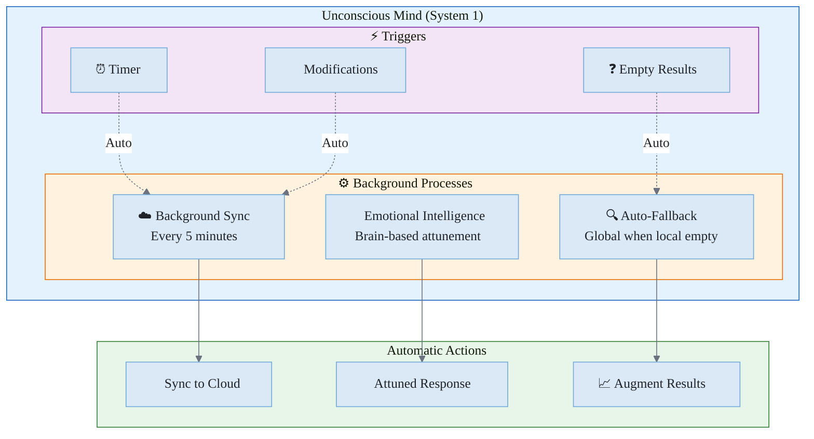
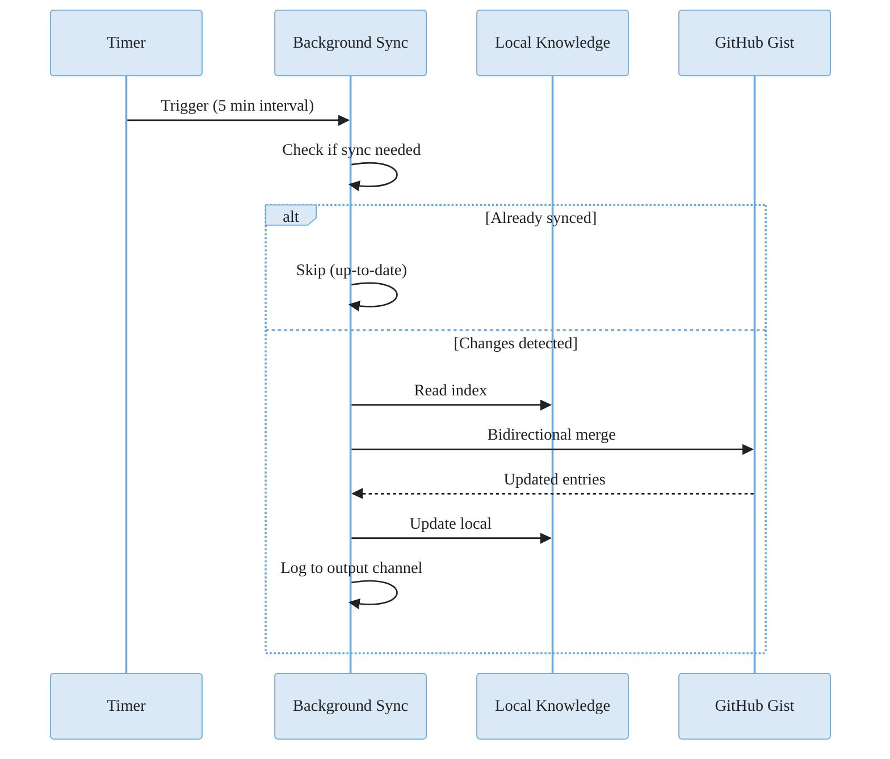
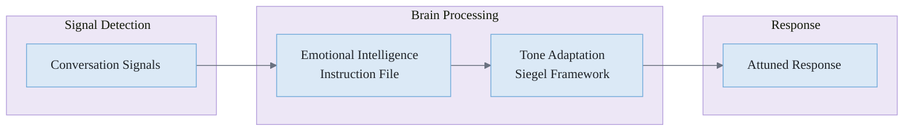
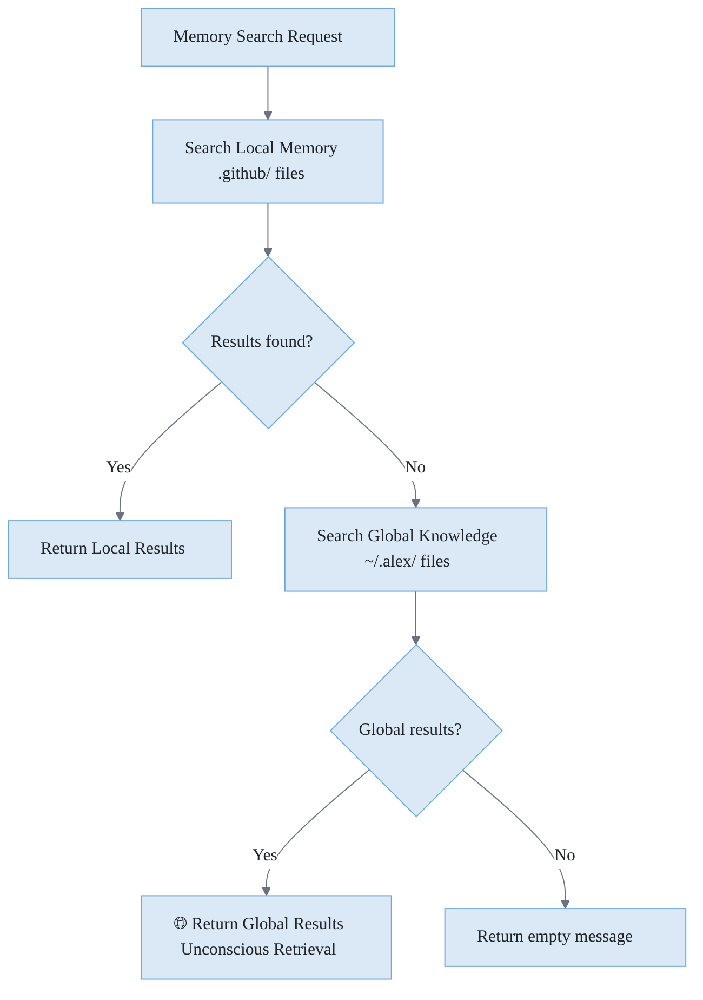
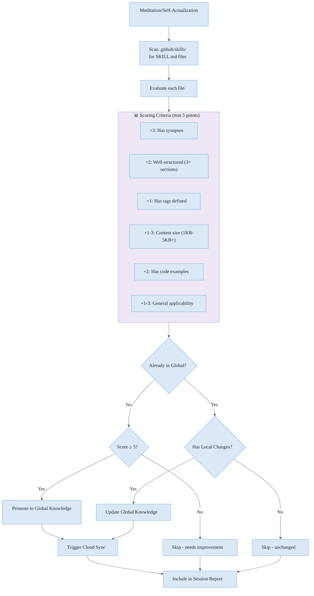
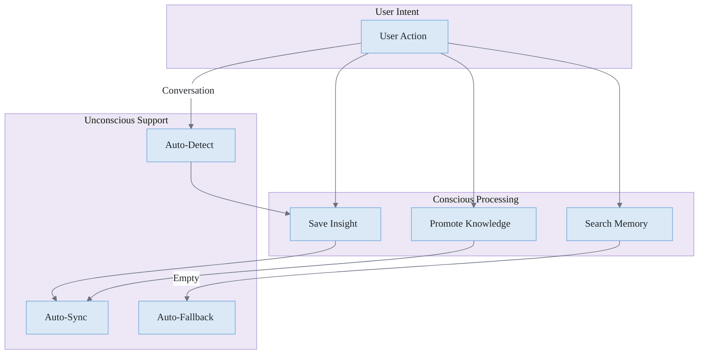

# 🌙 Unconscious Mind

> Automatic processes that run transparently without user intervention

**Related**: [Cognitive Architecture](./COGNITIVE-ARCHITECTURE.md) · [Conscious Mind](./CONSCIOUS-MIND.md) · [Memory Systems](./MEMORY-SYSTEMS.md)

---

## Overview

The **Unconscious Mind** represents Alex's automatic, always-running processes. These are fast, effortless operations analogous to System 1 thinking in cognitive psychology. They handle routine tasks without requiring user attention.

> **Note**: Below the unconscious mind sits an even deeper layer — **instincts** (agent hooks in `.github/hooks.json`). While the unconscious mind operates within the LLM context, instincts execute as OS-level processes *outside* the LLM entirely. See [Neuroanatomical Mapping §4c](./NEUROANATOMICAL-MAPPING.md) for the full instinct layer documentation.



**Figure 1:** *Unconscious Mind Architecture - Automatic background processes and their triggers*

---

## Background Cloud Sync

### What It Does

Automatically backs up your global knowledge to GitHub Gist without any user action.

### When It Runs

**Table 1:** *Background Sync Triggers*

| Trigger           | Timing                                                |
| ----------------- | ----------------------------------------------------- |
| Startup           | 10 seconds after VS Code activates                    |
| Periodic          | Every 5 minutes while VS Code is open                 |
| Post-modification | 2 seconds after saving insight or promoting knowledge |

### How It Works



**Figure 2:** *Background Sync Sequence - Timer-triggered synchronization with change detection*

### Logging

All unconscious activity is logged to the "Alex Unconscious Mind" output channel:

```
[2026-01-24T10:30:00.000Z] Background sync enabled - Alex unconscious mind active
[2026-01-24T10:30:10.000Z] Running startup sync...
[2026-01-24T10:30:12.000Z] Sync complete: 3 pushed, 0 pulled
[2026-01-24T10:35:00.000Z] Already up-to-date, no sync needed
```

To view: **View → Output → Select "Alex Unconscious Mind"**

---

## Auto-Insight Detection

### What It Does

Monitors conversations for valuable learnings and automatically saves them to the global knowledge base.

### Pattern Detection

The system looks for phrases indicating valuable insights:

**Learning Indicators:**

- "I learned...", "I discovered...", "I realized..."
- "The solution is...", "The fix is...", "What fixed it..."
- "Turns out...", "The trick is...", "The key is..."

**Domain Keywords:**

- pattern, anti-pattern, best practice
- gotcha, pitfall, workaround
- debugging, performance, security
- architecture, optimization

### Emotional Intelligence (Brain-Based)



**Figure 3:** *Emotional Intelligence - Brain-based signal detection and tone adaptation via .instructions.md*

Emotional intelligence is handled entirely through brain instructions (`emotional-intelligence.instructions.md`), not code. The LLM detects frustration, success, flow, and disengagement signals naturally and adapts its response tone using the Siegel framework.

### Knowledge Capture

Knowledge capture is brain-directed rather than code-driven. During meditation and self-actualization sessions, Alex identifies valuable learnings and saves them to the global knowledge base. The LLM's natural language understanding is better at identifying genuine insights than regex pattern matching.

---

## Auto-Fallback Search

### What It Does

When you search local memory and find nothing, automatically searches the global knowledge base.

### How It Works



**Figure 4:** *Auto-Fallback Search Flow - Seamless transition from local to global knowledge*

### User Experience

The user simply uses `alex_memory_search` or `/knowledge` and gets unified results:

**Before (local only):**

```
No matches found for "error handling" in local memory.
```

**After (with auto-fallback):**

```
## 🌐 Global Knowledge Results (Unconscious Retrieval)

*Local search found nothing. Automatically searched cross-project knowledge:*

### 💡 Error Handling Best Practices
- **Type**: insight | **Category**: error-handling
- **Tags**: try-catch, async, typescript
- **Summary**: Always wrap async operations in try-catch...
```

---

## Configuration

The unconscious mind has sensible defaults but can be observed:

**Table 2:** *Unconscious Mind Configuration Defaults*

| Setting                      | Default    | Description                  |
| ---------------------------- | ---------- | ---------------------------- |
| Background sync interval     | 5 minutes  | Time between automatic syncs |
| Minimum sync interval        | 1 minute   | Prevents sync spam           |
| Startup delay                | 10 seconds | Wait before first sync       |
| Post-modification delay      | 2 seconds  | Wait after changes           |
| Insight confidence threshold | 0.5        | Minimum score to auto-save   |
| Conversation buffer size     | 5 messages | Recent messages analyzed     |

---

## Observability

### Output Channel

View unconscious activity:

1. Open **View → Output**
2. Select **"Alex Unconscious Mind"** from dropdown

### Status Indicators

The `alex_global_knowledge_status` tool shows sync status:

```
| Cloud Sync | ✅ up-to-date |
```

Status values:

- ✅ `up-to-date` - Fully synced
- 📤 `needs-push` - Local changes not yet uploaded
- 📥 `needs-pull` - Remote changes available
- ⚪ `Not configured` - GitHub auth not set up
- ❌ `error` - Sync failed

---

## Benefits of Unconscious Processing

### 1. Zero Cognitive Load

Users don't need to remember to:

- Back up their knowledge
- Sync across machines
- Search multiple locations
- Save every insight manually

### 2. Continuous Protection

Knowledge is automatically backed up:

- Every 5 minutes
- After every modification
- Without user intervention

### 3. Unified Knowledge Access

Search once, get results from:

- Current project
- All past projects
- Any machine (via cloud sync)

### 4. Serendipitous Learning

Auto-insight detection captures knowledge you might forget to save:

- Debugging breakthroughs
- Aha moments
- Casual mentions of solutions

---

## Auto-Promotion During Meditation

### What It Does

Automatically evaluates and promotes valuable skill knowledge (SKILL.md files) to the global knowledge base during meditation and self-actualization sessions.

### When It Runs

**Table 2.5:** *Auto-Promotion Triggers*

| Trigger             | Timing                         |
| ------------------- | ------------------------------ |
| Self-Actualization  | Phase 4 of the protocol        |
| Meditation Sessions | During knowledge consolidation |

### How It Works



**Figure 3.5:** *Auto-Promotion Flow - Evaluation, promotion, and update of domain knowledge*

### Scoring Criteria

Files need a minimum score of **5 points** to be promoted:

**Table 2.6:** *Auto-Promotion Scoring*

| Criterion             | Points   | Description                                 |
| --------------------- | -------- | ------------------------------------------- |
| Has Synapses          | +3       | Contains synapse connections to other files |
| Well-Structured       | +2       | Has 3+ H2 sections                          |
| Has Tags              | +1       | Tags defined in file header                 |
| Substantial Content   | +1       | File size > 1KB                             |
| Rich Content          | +2       | File size > 5KB                             |
| Has Examples          | +2       | Contains code blocks                        |
| General Applicability | +1 to +3 | Contains pattern/best practice language     |

### Excluded Files

Some files are intentionally excluded from auto-promotion:

- Personal growth tracking skills
- Template files
- Project-specific naming conventions

### Session Report

After each meditation, the report shows:

```markdown
## 🌐 Global Knowledge Promotion (Unconscious Mind)

| Metric                      | Value |
| --------------------------- | ----- |
| Skills Evaluated            | 46    |
| Auto-Promoted               | 3     |
| Updated                     | 2     |
| Skipped (needs improvement) | 4     |
| Already Global (unchanged)  | 2     |

### Newly Promoted Knowledge
- 📐 **Advanced Diagramming**
- 📐 **Documentation Excellence**
- 📐 **Human Learning Psychology**

### Updated Global Knowledge
- 🔄 **Memory Consolidation**
- 🔄 **Dream Processing**
```

### Update Detection

When a DK file has already been promoted to global knowledge, Alex compares:

1. **Local file modification time** - When the project's DK file was last saved
2. **Global entry modified timestamp** - When the global version was last updated

If the local file is newer, Alex updates the global knowledge file with:

- Fresh content from the local file
- Preserved original metadata (ID, creation date)
- Updated modification timestamp
- Merged tags (existing + new)

This ensures improvements made to your project's domain knowledge automatically flow to the global knowledge base.

### Benefits

1. **Knowledge Shares Itself** - Valuable learnings automatically become available across all projects
2. **Quality Gate** - Only well-structured, connected knowledge gets promoted
3. **Zero Manual Effort** - Happens during routine meditation
4. **Cloud Backup** - Promoted knowledge immediately syncs to cloud

---

## Interaction with Conscious Mind

The unconscious mind supports the conscious mind:



**Figure 5:** *Conscious-Unconscious Interaction - How automatic processes support user actions*

---

## Failure Handling

The unconscious mind is designed to fail silently:

**Table 3:** *Failure Scenarios and Behaviors*

| Scenario                | Behavior                  |
| ----------------------- | ------------------------- |
| No GitHub auth          | Sync skipped, logged      |
| Network error           | Retry on next interval    |
| Insight detection fails | Continue conversation     |
| Global search fails     | Return local results only |

No user notifications for routine failures - just logged for debugging.

---

## Privacy & Security

### What's Synced

Only knowledge **you explicitly create**:

- Insights you save (or auto-detected from your conversations)
- Knowledge files you promote
- Pattern files you create

### What's NOT Synced

- Chat history
- Source code
- Personal information (unless you include it in insights)

### Where It Goes

- Private GitHub Gist (not public)
- Linked to your GitHub account
- Only accessible with your credentials

---

*The Unconscious Mind - Automatic, Effortless, Always-On*
