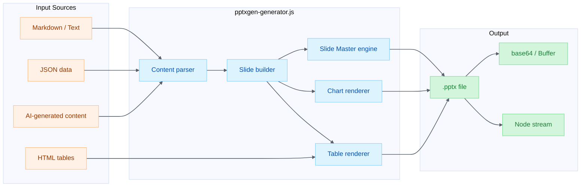
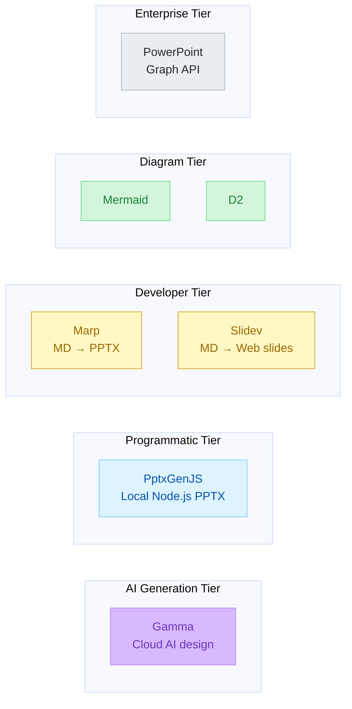

# PptxGenJS Implementation Plan — `pptxgen-generator.js`

**Date**: 2026-02-07
**Author**: Alex Cognitive Architecture Research
**Status**: Proposed — Ready for Implementation
**Priority**: Tier 1 (Programmatic Tier)
**Validated**: ✅ Two PPTX files generated via Claude PptxGenJS integration (2026-02-07)
**Companion**: [PRESENTATION-VISUALIZATION-ECOSYSTEM-2026.md](PRESENTATION-VISUALIZATION-ECOSYSTEM-2026.md) | [PRESENTATION-VISUALIZATION-OPPORTUNITIES-2026.md](PRESENTATION-VISUALIZATION-OPPORTUNITIES-2026.md) | [MARP-AUTOMATION-PLAN.md](MARP-AUTOMATION-PLAN.md)

---

## Table of Contents

1. [Executive Summary](#1-executive-summary)
2. [Repository & Library Details](#2-repository--library-details)
3. [Architecture Overview](#3-architecture-overview)
4. [Implementation Phases](#4-implementation-phases)
5. [API Reference — Core Surfaces](#5-api-reference--core-surfaces)
6. [Slide Master Templates](#6-slide-master-templates)
7. [Integration with Alex Architecture](#7-integration-with-alex-architecture)
8. [CLI Interface Design](#8-cli-interface-design)
9. [Code Examples](#9-code-examples)
10. [Testing Strategy](#10-testing-strategy)
11. [Risk Assessment](#11-risk-assessment)
12. [Comparison: PptxGenJS vs Alternatives](#12-comparison-pptxgenjs-vs-alternatives)
13. [Template-Based Generator Architecture](#13-template-based-generator-architecture)
- [Appendix A: Real-World Generation Code](#appendix-a-real-world-generation-code-claude--pptxgenjs)
- [Appendix B: Charlotte History Presentation](#appendix-b-charlotte-history-presentation-9-slide-template)

---

## 1. Executive Summary

PptxGenJS is a pure TypeScript library for programmatic PowerPoint (PPTX) generation that runs natively in Node.js — Alex's exact runtime. It fills the **Programmatic Tier** in Alex's multi-tier presentation architecture with **zero cloud dependencies**.

**Why PptxGenJS is the #1 discovery:**

| Factor             | Details                                                                    |
| ------------------ | -------------------------------------------------------------------------- |
| **Zero setup**     | `npm install pptxgenjs` — no API keys, OAuth, or accounts                  |
| **Node.js native** | Runs in Alex's VS Code extension runtime                                   |
| **Offline**        | No network, no latency, no rate limits                                     |
| **Full creation**  | Text, tables, shapes, images, charts, media — everything                   |
| **Chart support**  | 10+ chart types (bar, line, pie, scatter, etc.) — no other API offers this |
| **PPTX output**    | Compatible with PowerPoint, Keynote, LibreOffice, Google Slides            |
| **TypeScript**     | Full type definitions, IntelliSense, type-safe development                 |
| **MIT license**    | No restrictions on commercial use                                          |
| **Mature**         | v4.0.1, 48 releases, 4.5k stars, 5.8k dependents                           |

---

## 2. Repository & Library Details

### Source Repository

| Field              | Value                                                                  |
| ------------------ | ---------------------------------------------------------------------- |
| **GitHub**         | [github.com/gitbrent/PptxGenJS](https://github.com/gitbrent/PptxGenJS) |
| **Author**         | Brent Ely ([@gitbrent](https://github.com/gitbrent))                   |
| **Stars**          | 4,500+                                                                 |
| **Forks**          | 770+                                                                   |
| **Used By**        | 5,800+ projects                                                        |
| **Language**       | TypeScript (96.7%)                                                     |
| **License**        | MIT                                                                    |
| **npm**            | [npmjs.com/package/pptxgenjs](https://www.npmjs.com/package/pptxgenjs) |
| **Latest**         | v4.0.1 (June 2025)                                                     |
| **Total Releases** | 48                                                                     |
| **First Release**  | v1.0.0 (2016)                                                          |

### Documentation

| Resource            | URL                                                                                                  |
| ------------------- | ---------------------------------------------------------------------------------------------------- |
| **Official Docs**   | [gitbrent.github.io/PptxGenJS](https://gitbrent.github.io/PptxGenJS/)                                |
| **Quick Start**     | [docs/quick-start](https://gitbrent.github.io/PptxGenJS/docs/quick-start/)                           |
| **Installation**    | [docs/installation](https://gitbrent.github.io/PptxGenJS/docs/installation/)                         |
| **API — Text**      | [docs/api-text](https://gitbrent.github.io/PptxGenJS/docs/api-text/)                                 |
| **API — Tables**    | [docs/api-tables](https://gitbrent.github.io/PptxGenJS/docs/api-tables/)                             |
| **API — Charts**    | [docs/api-charts](https://gitbrent.github.io/PptxGenJS/docs/api-charts/)                             |
| **API — Images**    | [docs/api-images](https://gitbrent.github.io/PptxGenJS/docs/api-images/)                             |
| **API — Shapes**    | [docs/api-shapes](https://gitbrent.github.io/PptxGenJS/docs/api-shapes/)                             |
| **API — Media**     | [docs/api-media](https://gitbrent.github.io/PptxGenJS/docs/api-media/)                               |
| **Slide Masters**   | [docs/usage-slide-masters](https://gitbrent.github.io/PptxGenJS/docs/usage-slide-masters/)           |
| **Saving**          | [docs/usage-saving](https://gitbrent.github.io/PptxGenJS/docs/usage-saving/)                         |
| **HTML to PPTX**    | [docs/html-to-powerpoint](https://gitbrent.github.io/PptxGenJS/docs/html-to-powerpoint/)             |
| **75+ Demo Slides** | [demos](https://gitbrent.github.io/PptxGenJS/demos/)                                                 |
| **Demo Source**     | [demos/modules/](https://github.com/gitbrent/PptxGenJS/tree/master/demos/modules)                    |
| **Stack Overflow**  | [stackoverflow.com/questions/tagged/pptxgenjs](https://stackoverflow.com/questions/tagged/pptxgenjs) |

### Package Details

```bash
npm install pptxgenjs
# or
yarn add pptxgenjs
# or
pnpm add pptxgenjs
```

| Detail           | Value                                                                                    |
| ---------------- | ---------------------------------------------------------------------------------------- |
| **Dependencies** | JSZip only (single dependency)                                                           |
| **Bundle (CJS)** | `dist/pptxgenjs.cjs.js`                                                                  |
| **Bundle (ESM)** | `dist/pptxgenjs.es.js`                                                                   |
| **Types**        | `types/index.d.ts` (full TypeScript)                                                     |
| **Min Node**     | Node.js 14+                                                                              |
| **Platforms**    | Node.js, Browser, React, Angular, Vite, Electron, AWS Lambda, Vercel, Cloudflare Workers |

---

## 3. Architecture Overview



**Figure 1:** *PptxGenJS generator data flow — multiple input formats through rendering pipeline to PPTX output*

### Where It Fits in Alex's Multi-Tier Architecture



**Figure 2:** *Alex's multi-tier presentation architecture — PptxGenJS fills the Programmatic Tier*

---

## 4. Implementation Phases

### Phase 1: Core Generator (1 session)

**Goal:** Working `pptxgen-generator.js` that creates PPTX from structured input.

| Task                       | Details                                   |
| -------------------------- | ----------------------------------------- |
| Add `pptxgenjs` dependency | `npm install pptxgenjs` in extension      |
| Create generator script    | `scripts/pptxgen-generator.js`            |
| Implement text slides      | `addText()` with formatting               |
| Implement title slide      | Slide Master with branding                |
| Implement content slides   | Text + bullets + images                   |
| CLI interface              | `--content`, `--slides`, `--output` flags |
| File output                | `writeFile()` to disk                     |

**Deliverable:** Generate a basic branded PPTX from text content.

### Phase 2: Rich Content (1 session)

**Goal:** Support tables, charts, and images.

| Task               | Details                                    |
| ------------------ | ------------------------------------------ |
| Table support      | `addTable()` with cell-level formatting    |
| Chart support      | `addChart()` — bar, line, pie, scatter     |
| Image support      | `addImage()` — file paths, URLs, base64    |
| Shape support      | `addShape()` — rectangles, circles, arrows |
| Speaker notes      | `slide.addNotes()`                         |
| Auto-paging tables | `autoPage: true` for large datasets        |
| HTML table import  | `tableToSlides()` for one-line conversion  |

**Deliverable:** Data-driven presentations with charts and tables.

### Phase 3: Intelligence Layer (1-2 sessions)

**Goal:** AI-powered content structuring and design decisions.

| Task             | Details                                                               |
| ---------------- | --------------------------------------------------------------------- |
| Markdown parser  | Parse `# Heading → Title Slide`, `## → Section`, `- bullet` → content |
| Content analyzer | Detect data → auto-suggest chart type                                 |
| Layout engine    | Distribute content across slide real estate                           |
| Theme system     | Alex brand colors, fonts, consistent styling                          |
| Template library | Pre-built layouts (title, content, two-column, chart, comparison)     |
| Gamma fallback   | If design quality needed → route to Gamma instead                     |

**Deliverable:** Smart content-to-slide mapping with design intelligence.

### Phase 4: Skill Integration (1 session)

**Goal:** Full Alex skill with activation triggers and synapses.

| Task                    | Details                                       |
| ----------------------- | --------------------------------------------- |
| Create skill directory  | `.github/skills/pptx-generation/`             |
| Write SKILL.md          | Knowledge + procedures + examples             |
| Create synapses.json    | Connections to gamma-generator, mermaid, etc. |
| Add to skill-activation | Register triggers in routing index            |
| Unified `alex present`  | Route "create a PPTX" to this generator       |

**Deliverable:** Fully integrated Alex skill for PPTX generation.

---

## 5. API Reference — Core Surfaces

### Presentation Object

```typescript
import pptxgen from "pptxgenjs";

const pres = new pptxgen();

// Metadata
pres.author = "Alex Cognitive Architecture";
pres.company = "Alex";
pres.subject = "Generated Presentation";
pres.title = "My Presentation";

// Layout (default: LAYOUT_16x9)
pres.layout = "LAYOUT_16x9"; // or LAYOUT_16x10, LAYOUT_4x3, LAYOUT_WIDE, LAYOUT_CUSTOM

// Define Slide Masters (optional)
pres.defineSlideMaster({ /* options */ });

// Create slides
const slide = pres.addSlide();
const slide2 = pres.addSlide({ masterName: "TITLE_SLIDE" });

// Save
await pres.writeFile({ fileName: "output.pptx" });
```

### Text API

```typescript
// Simple text
slide.addText("Hello World", { x: 1, y: 1, color: "363636", fontSize: 24 });

// Multi-format text (word-level formatting)
slide.addText([
  { text: "Bold ", options: { bold: true, color: "0088CC" } },
  { text: "Normal ", options: { fontSize: 18 } },
  { text: "Italic", options: { italic: true, color: "CC0000" } },
], { x: 1, y: 2, w: 8, h: 1.5 });

// Bullets
slide.addText("Bullet point", { x: 1, y: 3, bullet: true });
slide.addText("Numbered", { x: 1, y: 3.5, bullet: { type: "number" } });

// Hyperlinks
slide.addText([
  { text: "Click here", options: { hyperlink: { url: "https://example.com" } } }
], { x: 1, y: 4 });
```

### Table API

```typescript
// Simple table
const rows = [
  ["Name", "Score", "Grade"],
  ["Alice", "95", "A"],
  ["Bob", "87", "B+"],
];
slide.addTable(rows, { x: 0.5, y: 1, w: 9, colW: [3, 3, 3], fontFace: "Arial" });

// Formatted table
const formattedRows = [
  [
    { text: "Header", options: { bold: true, fill: "0550ae", color: "FFFFFF" } },
    { text: "Value", options: { bold: true, fill: "0550ae", color: "FFFFFF" } },
  ],
  [
    { text: "Row 1", options: { fill: "F1F1F1" } },
    { text: "Data 1" },
  ],
];
slide.addTable(formattedRows, {
  x: 0.5, y: 1, w: 9,
  border: { type: "solid", pt: 1, color: "CFCFCF" },
  autoPage: true,           // Auto-paginate if overflow
  autoPageRepeatHeader: true // Repeat headers on new slides
});
```

### Chart API

```typescript
// Bar chart
const data = [
  { name: "Q1", labels: ["Jan","Feb","Mar"], values: [100, 200, 300] },
  { name: "Q2", labels: ["Jan","Feb","Mar"], values: [150, 250, 350] },
];
slide.addChart(pres.ChartType.bar, data, {
  x: 1, y: 1, w: 8, h: 4,
  showTitle: true,
  title: "Quarterly Revenue",
  showValue: true,
  chartColors: ["0550ae", "1a7f37"],
});

// Pie chart
slide.addChart(pres.ChartType.pie, [
  { name: "Market", labels: ["Product A","Product B","Product C"], values: [45, 30, 25] }
], { x: 1, y: 1, w: 6, h: 4, showPercent: true });

// Line chart
slide.addChart(pres.ChartType.line, data, {
  x: 1, y: 1, w: 8, h: 4,
  lineSmooth: true,
  showLegend: true,
});

// Combo chart (bar + line)
slide.addChart([
  { type: pres.ChartType.bar, data: barData, options: {} },
  { type: pres.ChartType.line, data: lineData, options: { secondaryValAxis: true } },
], { x: 1, y: 1, w: 8, h: 4 });
```

**Available Chart Types:**

| Type     | Constant             | Best For                        |
| -------- | -------------------- | ------------------------------- |
| Area     | `ChartType.area`     | Trends over time (filled)       |
| Bar      | `ChartType.bar`      | Comparisons, categories         |
| Bar 3D   | `ChartType.bar3d`    | Visual emphasis                 |
| Bubble   | `ChartType.bubble`   | Three-variable data             |
| Doughnut | `ChartType.doughnut` | Proportions (with center space) |
| Line     | `ChartType.line`     | Trends over time                |
| Pie      | `ChartType.pie`      | Proportions                     |
| Radar    | `ChartType.radar`    | Multi-variable comparison       |
| Scatter  | `ChartType.scatter`  | Correlation analysis            |

### Image API

```typescript
// From file path
slide.addImage({ path: "./logo.png", x: 1, y: 1, w: 2, h: 2 });

// From URL
slide.addImage({ path: "https://example.com/image.jpg", x: 1, y: 1, w: 4, h: 3 });

// From base64
slide.addImage({ data: "data:image/png;base64,iVBOR...", x: 1, y: 1, w: 2, h: 2 });

// SVG
slide.addImage({ path: "./diagram.svg", x: 0.5, y: 0.5, w: 9, h: 5 });
```

### Export API

```typescript
// Write to file (Node.js: disk, Browser: download)
await pres.writeFile({ fileName: "output.pptx", compression: true });

// Generate as base64 (for API upload)
const base64 = await pres.write({ outputType: "base64" });

// Generate as Buffer (for Node.js stream/HTTP response)
const buffer = await pres.write({ outputType: "nodebuffer" });

// Stream (for Express HTTP response)
const stream = await pres.stream();
```

---

## 6. Slide Master Templates

Slide Masters define reusable layouts with consistent branding.

### Alex Brand Slide Masters

```typescript
// Title Slide
pres.defineSlideMaster({
  title: "ALEX_TITLE",
  background: { fill: "0550ae" },
  objects: [
    { text: {
      text: "ALEX",
      options: { x: 0.5, y: 0.5, w: 4, h: 0.5, color: "FFFFFF", fontSize: 14, fontFace: "Arial" }
    }},
    { image: { path: "./assets/logo.png", x: 8.5, y: 0.3, w: 1, h: 0.5 } },
    { rect: { x: 0, y: 6.5, w: "100%", h: 0.5, fill: "1a7f37" } },
  ],
  slideNumber: { x: 9.0, y: 6.7, color: "FFFFFF", fontSize: 10 },
});

// Content Slide
pres.defineSlideMaster({
  title: "ALEX_CONTENT",
  background: { fill: "FFFFFF" },
  objects: [
    { rect: { x: 0, y: 0, w: "100%", h: 0.75, fill: "0550ae" } },
    { text: {
      text: "Alex Cognitive Architecture",
      options: { x: 0.5, y: 0.15, w: 6, h: 0.45, color: "FFFFFF", fontSize: 12, fontFace: "Arial" }
    }},
    { rect: { x: 0, y: 6.5, w: "100%", h: 0.5, fill: "eaeef2" } },
  ],
  slideNumber: { x: 9.0, y: 6.7, color: "24292f", fontSize: 10 },
});

// Section Divider
pres.defineSlideMaster({
  title: "ALEX_SECTION",
  background: { fill: "d8b9ff" },
  objects: [
    { rect: { x: 0, y: 3.0, w: "100%", h: 0.05, fill: "6639ba" } },
  ],
});

// Chart Slide
pres.defineSlideMaster({
  title: "ALEX_CHART",
  background: { fill: "FFFFFF" },
  objects: [
    { rect: { x: 0, y: 0, w: "100%", h: 0.75, fill: "0550ae" } },
    { text: {
      text: "Data & Analytics",
      options: { x: 0.5, y: 0.15, w: 6, h: 0.45, color: "FFFFFF", fontSize: 12 }
    }},
  ],
});
```

### GitHub Pastel Palette Mapping

Alex's standard GitHub Pastel v2 palette maps to PptxGenJS hex values:

| Palette Color | Fill     | Text     | Border   | PptxGenJS Usage      |
| ------------- | -------- | -------- | -------- | -------------------- |
| Bronze/Peach  | `fff1e5` | `953800` | `ffb77c` | Accent, callouts     |
| Silver/Gray   | `eaeef2` | `24292f` | `afb8c1` | Backgrounds, neutral |
| Gold/Yellow   | `fff8c5` | `9a6700` | `d4a72c` | Warnings, highlights |
| Blue/Sky      | `ddf4ff` | `0550ae` | `80ccff` | Primary, headers     |
| Purple        | `d8b9ff` | `6639ba` | `bf8aff` | Section dividers     |
| Green/Mint    | `d3f5db` | `1a7f37` | `6fdd8b` | Success, positive    |
| Red/Coral     | `ffebe9` | `cf222e` | `f5a3a3` | Errors, critical     |

---

## 7. Integration with Alex Architecture

### Skill Structure

```
.github/skills/pptx-generation/
├── SKILL.md          # Knowledge: PptxGenJS API, templates, patterns
└── synapses.json     # Connections to gamma, mermaid, data-analysis
```

### Synaptic Connections

| Connection            | Relationship                              | Direction     |
| --------------------- | ----------------------------------------- | ------------- |
| `gamma-generator`     | Complementary — AI design vs programmatic | Bidirectional |
| `markdown-mermaid`    | Mermaid → SVG → embed in PPTX             | Inbound       |
| `data-analysis`       | Data → charts → PPTX                      | Inbound       |
| `skill-activation`    | Routing: "create a PPTX" → this skill     | Inbound       |
| `presentation-export` | PPTX output augments Marp export          | Outbound      |

### Activation Triggers

```
"create pptx", "generate powerpoint", "make slides from data",
"build a deck with charts", "create presentation from markdown",
"export data as powerpoint", "programmatic slides"
```

### When to Route PptxGenJS vs Gamma

| Signal                            | Route To      | Reason                          |
| --------------------------------- | ------------- | ------------------------------- |
| "create a beautiful presentation" | **Gamma**     | AI design quality needed        |
| "make slides from this data"      | **PptxGenJS** | Data-driven, chart-heavy        |
| "create a pptx with charts"       | **PptxGenJS** | Charts are PptxGenJS's strength |
| "generate a deck about X"         | **Gamma**     | AI content + design             |
| "convert this table to slides"    | **PptxGenJS** | HTML table → PPTX               |
| "create branded quarterly report" | **PptxGenJS** | Slide Masters + data            |
| "quickly make a deck offline"     | **PptxGenJS** | No network required             |
| "make an impressive pitch deck"   | **Gamma**     | Design quality paramount        |

---

## 8. CLI Interface Design

### `pptxgen-generator.js`

```bash
# From content prompt (Alex generates structure)
node pptxgen-generator.js --content "Quarterly Sales Report" --slides 10 --output report.pptx

# From markdown file
node pptxgen-generator.js --input presentation.md --output deck.pptx

# From JSON data (charts + tables)
node pptxgen-generator.js --data sales-data.json --template quarterly --output Q4-report.pptx

# With options
node pptxgen-generator.js \
  --input content.md \
  --output output.pptx \
  --theme alex-brand \
  --layout 16x9 \
  --compression true
```

### CLI Flags

| Flag            | Short | Default             | Description                                |
| --------------- | ----- | ------------------- | ------------------------------------------ |
| `--content`     | `-c`  | —                   | Text content / prompt for slide generation |
| `--input`       | `-i`  | —                   | Markdown file path                         |
| `--data`        | `-d`  | —                   | JSON data file for charts/tables           |
| `--output`      | `-o`  | `presentation.pptx` | Output file path                           |
| `--template`    | `-t`  | `default`           | Slide Master template name                 |
| `--theme`       | —     | `alex-brand`        | Color theme                                |
| `--layout`      | `-l`  | `16x9`              | Aspect ratio: `16x9`, `4x3`, `16x10`       |
| `--slides`      | `-s`  | 10                  | Target number of slides                    |
| `--compression` | —     | `false`             | Apply zip compression                      |
| `--format`      | `-f`  | `file`              | Output: `file`, `base64`, `buffer`         |

---

## 9. Code Examples

### Minimal Working Example

```typescript
import pptxgen from "pptxgenjs";

const pres = new pptxgen();
pres.author = "Alex";
pres.title = "Quick Deck";

const slide = pres.addSlide();
slide.addText("Hello from Alex!", {
  x: 1.5, y: 1.5, w: 7, h: 2,
  fontSize: 36, color: "0550ae", fontFace: "Arial",
  align: "center", bold: true
});

await pres.writeFile({ fileName: "hello.pptx" });
```

### Data-Driven Report

```typescript
import pptxgen from "pptxgenjs";

const pres = new pptxgen();

// Title slide
const titleSlide = pres.addSlide();
titleSlide.background = { fill: "0550ae" };
titleSlide.addText("Q4 2025 Sales Report", {
  x: 1, y: 2, w: 8, h: 1.5,
  fontSize: 36, color: "FFFFFF", fontFace: "Arial", align: "center"
});
titleSlide.addText("Alex Cognitive Architecture — Auto-Generated", {
  x: 1, y: 4, w: 8, h: 0.75,
  fontSize: 14, color: "80ccff", align: "center"
});

// Chart slide
const chartSlide = pres.addSlide();
chartSlide.addText("Revenue by Region", { x: 0.5, y: 0.3, fontSize: 24, bold: true, color: "24292f" });
chartSlide.addChart(pres.ChartType.bar, [
  { name: "EMEA", labels: ["Q1","Q2","Q3","Q4"], values: [2.5, 3.1, 2.8, 4.2] },
  { name: "APAC", labels: ["Q1","Q2","Q3","Q4"], values: [1.8, 2.0, 2.5, 3.0] },
  { name: "Americas", labels: ["Q1","Q2","Q3","Q4"], values: [4.0, 4.5, 5.0, 5.8] },
], {
  x: 0.5, y: 1.2, w: 9, h: 4.5,
  chartColors: ["0550ae", "1a7f37", "9a6700"],
  showTitle: false, showValue: true,
  valAxisLabelFormatCode: "$#,##0.0M",
});

// Table slide
const tableSlide = pres.addSlide();
tableSlide.addText("Regional Breakdown", { x: 0.5, y: 0.3, fontSize: 24, bold: true, color: "24292f" });
tableSlide.addTable([
  [
    { text: "Region", options: { bold: true, fill: "0550ae", color: "FFFFFF" } },
    { text: "Revenue", options: { bold: true, fill: "0550ae", color: "FFFFFF" } },
    { text: "Growth", options: { bold: true, fill: "0550ae", color: "FFFFFF" } },
  ],
  ["EMEA", "$12.6M", "+15%"],
  ["APAC", "$9.3M", "+22%"],
  ["Americas", "$19.3M", "+12%"],
  [
    { text: "Total", options: { bold: true, fill: "eaeef2" } },
    { text: "$41.2M", options: { bold: true, fill: "eaeef2" } },
    { text: "+16%", options: { bold: true, fill: "d3f5db", color: "1a7f37" } },
  ],
], {
  x: 1.5, y: 1.2, w: 7,
  colW: [2.5, 2.5, 2],
  border: { type: "solid", pt: 1, color: "afb8c1" },
  fontFace: "Arial", fontSize: 14,
});

await pres.writeFile({ fileName: "Q4-Report.pptx", compression: true });
```

### Markdown to PPTX Converter

```typescript
import pptxgen from "pptxgenjs";
import { readFileSync } from "fs";

function markdownToSlides(mdPath: string): void {
  const content = readFileSync(mdPath, "utf-8");
  const sections = content.split(/^---$/m); // Split on --- dividers
  const pres = new pptxgen();

  for (const section of sections) {
    const slide = pres.addSlide();
    const lines = section.trim().split("\n");

    for (const line of lines) {
      if (line.startsWith("# ")) {
        // Title
        slide.addText(line.replace("# ", ""), {
          x: 0.5, y: 0.5, w: 9, h: 1,
          fontSize: 32, bold: true, color: "0550ae"
        });
      } else if (line.startsWith("## ")) {
        // Subtitle
        slide.addText(line.replace("## ", ""), {
          x: 0.5, y: 1.5, w: 9, h: 0.75,
          fontSize: 24, color: "6639ba"
        });
      } else if (line.startsWith("- ")) {
        // Bullet
        slide.addText(line.replace("- ", ""), {
          x: 1, y: slide._slideObjects.length + 1, w: 8, h: 0.5,
          fontSize: 16, bullet: true, color: "24292f"
        });
      }
    }
  }

  pres.writeFile({ fileName: mdPath.replace(".md", ".pptx") });
}
```

---

## 10. Testing Strategy

### Test Cases

| #   | Test           | Input                            | Expected Output                   |
| --- | -------------- | -------------------------------- | --------------------------------- |
| 1   | Minimal deck   | Single text slide                | Valid .pptx, opens in PowerPoint  |
| 2   | Multi-slide    | 10 slides with mixed content     | All slides render correctly       |
| 3   | Charts         | Bar, line, pie chart data        | Charts display with correct data  |
| 4   | Tables         | Formatted table with headers     | Table with styling preserved      |
| 5   | Images         | Local file + URL + base64        | Images embedded and visible       |
| 6   | Slide Masters  | Branded template applied         | Consistent branding across slides |
| 7   | Export formats | writeFile, write(base64), stream | All formats produce valid output  |
| 8   | Large tables   | 100+ row table                   | Auto-paging creates new slides    |
| 9   | Markdown input | `.md` file with headings/bullets | Correct slide structure           |
| 10  | Compression    | `compression: true`              | Smaller file size, still valid    |

### Validation

```bash
# Generate test deck
node pptxgen-generator.js --content "Test presentation" --slides 5 --output test.pptx

# Verify file exists and is valid ZIP (PPTX = ZIP)
file test.pptx        # Should report: Microsoft OOXML
unzip -t test.pptx     # Should list valid entries
```

### Real-World Validation (2026-02-07)

PptxGenJS capability confirmed via Claude app integration — two PPTX files generated successfully:

| File                                   | Content                    | Generated By       |
| -------------------------------------- | -------------------------- | ------------------ |
| `AI Readiness Scale Presentation.pptx` | AIRS-16 scale presentation | Claude + PptxGenJS |
| `charlotte history.pptx`               | Charlotte history content  | Claude + PptxGenJS |

Both files located in `alex_docs/gamma/` and confirm that PptxGenJS produces valid, presentation-ready PPTX output.

---

## 11. Risk Assessment

| Risk                 | Likelihood | Impact | Mitigation                                                        |
| -------------------- | ---------- | ------ | ----------------------------------------------------------------- |
| Library abandoned    | Very Low   | High   | 4.5k stars, active maintainer, 48 releases over 9 years           |
| Breaking API changes | Low        | Medium | Pin to v4.x, TypeScript types catch issues                        |
| PPTX compatibility   | Low        | Medium | Standard OOXML format, tested with PowerPoint/Keynote/LibreOffice |
| Large file size      | Medium     | Low    | Use `compression: true`, optimize images                          |
| Complex layout needs | Medium     | Medium | Fallback to Gamma for design-heavy decks                          |
| Font availability    | Low        | Low    | Use standard fonts (Arial, Calibri), embed if needed              |
| Bundle size impact   | Low        | Low    | ~300KB total (pptxgenjs + jszip), minimal for Node.js             |

---

## 12. Comparison: PptxGenJS vs Alternatives

### Local PPTX Generation Libraries

| Library       | Language   | Stars | Last Update | PPTX     | Charts      | Status           |
| ------------- | ---------- | ----- | ----------- | -------- | ----------- | ---------------- |
| **PptxGenJS** | TypeScript | 4.5k  | Jun 2025    | ✅        | ✅ 10+ types | **Recommended**  |
| python-pptx   | Python     | 2.3k  | 2023        | ✅        | ✅           | Python only      |
| officegen     | JavaScript | 2.6k  | 2021        | ✅        | ❌           | Unmaintained     |
| docx (JS)     | TypeScript | 4.3k  | Active      | ❌ (DOCX) | N/A         | Different format |
| Marp          | TypeScript | 7k    | Active      | ✅        | ❌           | Markdown only    |

**PptxGenJS wins because:**
1. TypeScript with full type definitions
2. Active maintenance (v4.0.1, June 2025)
3. Most comprehensive chart support of any JS PPTX library
4. Dual CJS/ESM builds
5. Single dependency (JSZip only)
6. Works in Node.js AND browser
7. Largest community (5.8k dependents)

### vs Cloud APIs (Summary)

| Factor             | PptxGenJS                   | Google Slides    | Gamma              |
| ------------------ | --------------------------- | ---------------- | ------------------ |
| **Output**         | .pptx                       | Google Slides    | Gamma page         |
| **Setup**          | `npm install`               | GCP + OAuth      | API key            |
| **Network**        | Offline                     | Required         | Required           |
| **Charts**         | 10+ types                   | Sheets link only | AI design          |
| **Design quality** | Template-based              | Template-based   | AI-generated       |
| **Cost**           | Free                        | Free (quotas)    | Credits            |
| **Speed**          | ~ms                         | ~seconds         | ~30 seconds        |
| **Best for**       | Data reports, branded decks | Google ecosystem | Beautiful AI decks |

---

## 13. Template-Based Generator Architecture

### Problem: Per-Presentation Code Generation

Claude's approach (Appendix A & B) generates 400+ lines of JavaScript per presentation. This works but has limitations:

| Issue                     | Impact                                                                   |
| ------------------------- | ------------------------------------------------------------------------ |
| **Redundant boilerplate** | Same helper functions, palette setup, icon rendering repeated every time |
| **No design consistency** | Each deck can drift from brand standards                                 |
| **Hard to maintain**      | Bug fixes require regenerating all presentations                         |
| **Slow iteration**        | Content changes require full code regeneration                           |
| **Large token cost**      | LLM generates/reviews 400+ lines instead of 50                           |

### Solution: Template-Based Generator

Separate **content** (what changes) from **presentation logic** (reusable):

```
pptxgen-templates/
├── generate.js              # Orchestrator — JSON → PPTX
├── palettes/
│   ├── github-pastel.json   # Alex's standard palette
│   └── queen-city-heritage.json
├── templates/
│   ├── title.js             # Title slide template
│   ├── content-icon.js      # Heading + icon + body text
│   ├── two-column.js        # Side-by-side comparison
│   ├── three-column.js      # Feature/pillar grid
│   ├── timeline.js          # Year cards (horizontal)
│   ├── stats.js             # Big number + label
│   ├── bullets.js           # Bullet list with optional card
│   └── conclusion.js        # Dark/accent closing slide
├── helpers/
│   ├── icons.js             # React Icons → PNG pipeline
│   ├── shadows.js           # Shadow factory
│   └── text.js              # Multi-run text builder
└── presentations/
    ├── charlotte-history.json
    └── airs-presentation.json
```

### Content Schema (What Alex Generates)

```json
{
  "meta": {
    "title": "The History of Charlotte",
    "subtitle": "North Carolina",
    "author": "Alex Cognitive Architecture",
    "palette": "github-pastel"
  },
  "slides": [
    {
      "type": "title",
      "title": "The History of Charlotte",
      "subtitle": "North Carolina",
      "tagline": "From Colonial Settlement to Modern Banking Capital"
    },
    {
      "type": "content-icon",
      "icon": "FaMountain",
      "iconColor": "accent",
      "heading": "Indigenous Origins & Early Settlement",
      "sections": [
        {
          "subheading": "The Catawba Nation",
          "body": "For thousands of years, the Catawba Native American tribe inhabited the Piedmont region..."
        },
        {
          "subheading": "European Settlers Arrive",
          "card": "warm",
          "bullets": [
            { "label": "Mid-1700s", "text": "Scots-Irish and German immigrants arrived" },
            { "label": "1768", "text": "Charlotte officially founded" }
          ]
        }
      ]
    },
    {
      "type": "timeline",
      "heading": "The Gold Rush Era",
      "subheading": "America's First Gold Rush",
      "icon": "FaCoins",
      "items": [
        { "year": "1799", "text": "Conrad Reed discovers a 17-pound gold nugget", "color": "accent" },
        { "year": "1830s", "text": "Charlotte becomes the center of gold production", "color": "primary" },
        { "year": "1837", "text": "U.S. Branch Mint established", "color": "secondary" }
      ],
      "footer": {
        "heading": "Economic Impact",
        "body": "The gold rush transformed Charlotte from a small farming community into a commercial center."
      }
    },
    {
      "type": "two-column",
      "heading": "Civil War & Reconstruction",
      "left": {
        "card": "white",
        "heading": "During the Civil War",
        "bullets": ["Confederate naval yard", "Strategic manufacturing"]
      },
      "right": {
        "card": "primary",
        "heading": "Population Growth",
        "stats": [
          { "label": "1870", "value": "~4,500" },
          { "label": "1900", "value": "18,000+" }
        ]
      }
    },
    {
      "type": "three-column",
      "heading": "Modern Charlotte",
      "columns": [
        { "heading": "Sports & Culture", "color": "accent", "bullets": ["Panthers", "Hornets"] },
        { "heading": "Economic Diversity", "color": "secondary", "bullets": ["Banking", "Tech"] },
        { "heading": "Heritage Preserved", "color": "primary", "bullets": ["Fourth Ward", "Mint"] }
      ]
    },
    {
      "type": "conclusion",
      "heading": "The Queen City's Legacy",
      "body": "From revolutionary roots through gold rush prosperity...",
      "background": "primary"
    }
  ]
}
```

### Palette Schema

```json
{
  "name": "GitHub Pastel v2",
  "id": "github-pastel",
  "colors": {
    "primary": { "fill": "ddf4ff", "text": "0550ae", "border": "80ccff" },
    "secondary": { "fill": "d8b9ff", "text": "6639ba", "border": "bf8aff" },
    "accent": { "fill": "fff8c5", "text": "9a6700", "border": "d4a72c" },
    "warm": { "fill": "fff1e5", "text": "953800", "border": "ffb77c" },
    "success": { "fill": "d3f5db", "text": "1a7f37", "border": "6fdd8b" },
    "neutral": { "fill": "eaeef2", "text": "24292f", "border": "afb8c1" },
    "white": { "fill": "FFFFFF", "text": "24292f", "border": "afb8c1" }
  },
  "defaults": {
    "slideBackground": "neutral",
    "titleBackground": "primary",
    "conclusionBackground": "primary",
    "fontFace": "Calibri",
    "shadow": { "type": "outer", "blur": 8, "offset": 2, "angle": 135, "color": "6639ba", "opacity": 0.08 }
  }
}
```

### Template Example: `timeline.js`

```javascript
// templates/timeline.js
module.exports = function renderTimeline(pres, slide, data, palette, icons) {
  const colors = palette.colors;

  // Heading
  slide.addText(data.heading, {
    x: 0.5, y: 0.3, w: 9, h: 0.6,
    fontSize: 40, bold: true, color: colors.primary.text,
    fontFace: palette.defaults.fontFace
  });

  // Icon + subheading
  if (data.icon && icons[data.icon]) {
    slide.addImage({ data: icons[data.icon], x: 0.6, y: 1.2, w: 0.5, h: 0.5 });
  }
  slide.addText(data.subheading, {
    x: 1.3, y: 1.25, w: 8, h: 0.4,
    fontSize: 24, bold: true, color: colors.neutral.text,
    fontFace: palette.defaults.fontFace
  });

  // Timeline cards
  const cardWidth = 2.8;
  const gap = 0.3;
  const startX = 0.5;

  data.items.forEach((item, i) => {
    const x = startX + i * (cardWidth + gap);
    const colorSet = colors[item.color] || colors.primary;

    slide.addShape(pres.shapes.RECTANGLE, {
      x, y: 1.9, w: cardWidth, h: 1.8,
      fill: { color: colorSet.fill },
      line: { color: colorSet.border, width: 2 },
      shadow: palette.defaults.shadow
    });

    slide.addText(item.year, {
      x, y: 2.1, w: cardWidth, h: 0.5,
      fontSize: 48, bold: true, color: colorSet.text,
      align: "center", fontFace: palette.defaults.fontFace
    });

    slide.addText(item.text, {
      x: x + 0.1, y: 2.7, w: cardWidth - 0.2, h: 0.8,
      fontSize: 13, color: colors.neutral.text,
      align: "center", fontFace: palette.defaults.fontFace
    });
  });

  // Footer card
  if (data.footer) {
    slide.addShape(pres.shapes.RECTANGLE, {
      x: 0.5, y: 3.9, w: 9, h: 1.4,
      fill: { color: colors.white.fill },
      line: { color: colors.neutral.border, width: 1 },
      shadow: palette.defaults.shadow
    });

    slide.addText(data.footer.heading, {
      x: 0.7, y: 4.1, w: 8.6, h: 0.3,
      fontSize: 18, bold: true, color: colors.primary.text,
      fontFace: palette.defaults.fontFace
    });

    slide.addText(data.footer.body, {
      x: 0.7, y: 4.5, w: 8.6, h: 0.7,
      fontSize: 14, color: colors.neutral.text,
      fontFace: palette.defaults.fontFace
    });
  }
};
```

### Generator Orchestrator: `generate.js`

```javascript
// generate.js
const pptxgen = require("pptxgenjs");
const fs = require("fs");
const path = require("path");
const { renderIcons } = require("./helpers/icons");

// Load templates dynamically
const templates = {
  title: require("./templates/title"),
  "content-icon": require("./templates/content-icon"),
  "two-column": require("./templates/two-column"),
  "three-column": require("./templates/three-column"),
  timeline: require("./templates/timeline"),
  stats: require("./templates/stats"),
  bullets: require("./templates/bullets"),
  conclusion: require("./templates/conclusion")
};

async function generate(contentPath, outputPath) {
  // Load content JSON
  const content = JSON.parse(fs.readFileSync(contentPath, "utf-8"));

  // Load palette
  const palettePath = path.join(__dirname, "palettes", `${content.meta.palette}.json`);
  const palette = JSON.parse(fs.readFileSync(palettePath, "utf-8"));

  // Pre-render all icons used in the presentation
  const iconNames = extractIconNames(content.slides);
  const icons = await renderIcons(iconNames, palette.colors);

  // Create presentation
  const pres = new pptxgen();
  pres.layout = "LAYOUT_16x9";
  pres.author = content.meta.author || "Alex Cognitive Architecture";
  pres.title = content.meta.title;

  // Render each slide
  for (const slideData of content.slides) {
    const template = templates[slideData.type];
    if (!template) {
      console.warn(`Unknown slide type: ${slideData.type}`);
      continue;
    }

    const slide = pres.addSlide();
    const bgColor = slideData.background
      ? palette.colors[slideData.background].fill
      : palette.colors[palette.defaults.slideBackground].fill;
    slide.background = { color: bgColor };

    template(pres, slide, slideData, palette, icons);
  }

  // Write output
  await pres.writeFile({ fileName: outputPath });
  console.log(`✅ Generated: ${outputPath}`);
}

function extractIconNames(slides) {
  const icons = new Set();
  for (const slide of slides) {
    if (slide.icon) icons.add(slide.icon);
    // Recursively check nested structures
  }
  return [...icons];
}

// CLI usage
if (require.main === module) {
  const [,, contentPath, outputPath] = process.argv;
  if (!contentPath) {
    console.log("Usage: node generate.js <content.json> [output.pptx]");
    process.exit(1);
  }
  const output = outputPath || contentPath.replace(".json", ".pptx");
  generate(contentPath, output).catch(console.error);
}

module.exports = { generate };
```

### Benefits Summary

| Metric                   | Per-Presentation JS | Template-Based    |
| ------------------------ | ------------------- | ----------------- |
| **Lines Alex generates** | 400-600             | 40-80 (JSON only) |
| **Token cost**           | High                | ~90% reduction    |
| **Palette swap**         | Regenerate all      | Change 1 field    |
| **Bug fixes**            | Per-deck            | Single template   |
| **Design consistency**   | Manual              | Enforced          |
| **New presentation**     | Full code           | Content JSON only |
| **Learning curve**       | PptxGenJS API       | Simple schema     |

### Implementation Phases

| Phase     | Deliverable                    | Effort    |
| --------- | ------------------------------ | --------- |
| **P1**    | Core generator + 3 palettes    | 4 hours   |
| **P2**    | 8 slide templates              | 4 hours   |
| **P3**    | Icon helper + shadow factory   | 2 hours   |
| **P4**    | CLI + VS Code integration      | 2 hours   |
| **P5**    | Convert Charlotte/AIRS to JSON | 2 hours   |
| **Total** |                                | ~14 hours |

### Future Extensions

1. **Markdown → JSON converter**: Parse markdown with special syntax into content JSON
2. **AI content generation**: Alex generates content JSON from natural language request
3. **Template designer**: Visual tool to build custom templates
4. **Batch generation**: Generate multiple palettes from same content
5. **Chart templates**: Data → chart slide (bar, line, pie)

---

## Appendix A: Real-World Generation Code (Claude + PptxGenJS)

The following code was used by Claude (via its PptxGenJS integration) to generate [AI Readiness Scale Presentation.pptx](AI%20Readiness%20Scale%20Presentation.pptx) — a 14-slide academic presentation with icons, shadow effects, color palette, data-driven layouts, and multi-text styling. This serves as a **production reference** for what's achievable with PptxGenJS.

**Key patterns demonstrated:**
- React Icons → SVG → Sharp → Base64 PNG pipeline for icon embedding
- Shadow helper factory for consistent card styling
- Color palette object for brand consistency
- Data-driven slide generation with `forEach` loops
- Multi-run text arrays for inline styling (`bold`, `color`, `italic` per span)
- Coordinate-based layout system (x, y, w, h in inches)

```javascript
const pptxgen = require("pptxgenjs");
const React = require("react");
const ReactDOMServer = require("react-dom/server");
const sharp = require("sharp");
const {
  FaRobot, FaBrain, FaChartBar, FaUsers, FaCheckCircle,
  FaLightbulb, FaGraduationCap, FaCog, FaChartLine,
  FaExclamationTriangle, FaBalanceScale, FaClipboardCheck
} = require("react-icons/fa");

// Icon rendering utilities
function renderIconSvg(IconComponent, color = "#000000", size = 256) {
  return ReactDOMServer.renderToStaticMarkup(
    React.createElement(IconComponent, { color, size: String(size) })
  );
}

async function iconToBase64Png(IconComponent, color, size = 256) {
  const svg = renderIconSvg(IconComponent, color, size);
  const pngBuffer = await sharp(Buffer.from(svg)).png().toBuffer();
  return "image/png;base64," + pngBuffer.toString("base64");
}

// Create shadow helper function
const makeShadow = () => ({
  type: "outer",
  blur: 6,
  offset: 2,
  angle: 135,
  color: "000000",
  opacity: 0.08
});

async function createPresentation() {
  let pres = new pptxgen();
  pres.layout = 'LAYOUT_16x9';
  pres.author = 'Fabio Correa';
  pres.title = 'AI Readiness Scale: Extending UTAUT2 for Enterprise AI Adoption';

  // Color palette - Academic Navy & Teal
  const colors = {
    navy: "1E2761",        // Primary dark
    teal: "028090",        // Accent
    lightTeal: "02C39A",   // Secondary accent
    cream: "F5F5F5",       // Light background
    white: "FFFFFF",
    darkGray: "2C3E50",
    medGray: "64748B",
    lightGray: "E2E8F0"
  };

  // Pre-render all icons
  const icons = {
    robot: await iconToBase64Png(FaRobot, "#" + colors.teal, 256),
    brain: await iconToBase64Png(FaBrain, "#" + colors.teal, 256),
    chart: await iconToBase64Png(FaChartBar, "#" + colors.teal, 256),
    users: await iconToBase64Png(FaUsers, "#" + colors.teal, 256),
    check: await iconToBase64Png(FaCheckCircle, "#" + colors.lightTeal, 256),
    lightbulb: await iconToBase64Png(FaLightbulb, "#" + colors.teal, 256),
    graduate: await iconToBase64Png(FaGraduationCap, "#" + colors.teal, 256),
    cog: await iconToBase64Png(FaCog, "#" + colors.teal, 256),
    chartline: await iconToBase64Png(FaChartLine, "#" + colors.teal, 256),
    warning: await iconToBase64Png(FaExclamationTriangle, "#" + colors.teal, 256),
    balance: await iconToBase64Png(FaBalanceScale, "#" + colors.teal, 256),
    clipboard: await iconToBase64Png(FaClipboardCheck, "#" + colors.teal, 256)
  };

  // ==================== SLIDE 1: TITLE ====================
  let slide1 = pres.addSlide();
  slide1.background = { color: colors.navy };

  slide1.addText("Artificial Intelligence Readiness Scale", {
    x: 0.5, y: 1.5, w: 9, h: 0.8,
    fontSize: 44, bold: true, color: colors.white, align: "center",
    fontFace: "Calibri"
  });

  slide1.addText("Extending UTAUT2 for Enterprise AI Adoption", {
    x: 0.5, y: 2.4, w: 9, h: 0.6,
    fontSize: 28, color: colors.lightTeal, align: "center",
    fontFace: "Calibri"
  });

  slide1.addShape(pres.shapes.RECTANGLE, {
    x: 3.5, y: 3.3, w: 3, h: 0.02,
    fill: { color: colors.teal }
  });

  slide1.addText("Fabio Correa", {
    x: 0.5, y: 3.8, w: 9, h: 0.4,
    fontSize: 18, color: colors.cream, align: "center",
    fontFace: "Calibri"
  });

  slide1.addText(
    "Doctoral Candidate, Doctor of Business Administration\n" +
    "Touro University Worldwide | December 2025", {
    x: 0.5, y: 4.2, w: 9, h: 0.6,
    fontSize: 14, color: colors.medGray, align: "center",
    fontFace: "Calibri"
  });

  // ==================== SLIDE 2: THE ADOPTION-VALUE PARADOX ====================
  let slide2 = pres.addSlide();
  slide2.background = { color: colors.cream };

  slide2.addText("The Adoption-Value Paradox", {
    x: 0.5, y: 0.3, w: 9, h: 0.6,
    fontSize: 38, bold: true, color: colors.navy, align: "left",
    fontFace: "Calibri", margin: 0
  });

  slide2.addImage({ data: icons.warning, x: 0.5, y: 1.2, w: 0.5, h: 0.5 });

  slide2.addText("AI Adoption is Soaring…", {
    x: 1.2, y: 1.25, w: 8.3, h: 0.4,
    fontSize: 22, bold: true, color: colors.darkGray,
    fontFace: "Calibri"
  });

  // Adoption stats boxes
  const adoptionData = [
    { year: "Historical", pct: "50%", x: 0.5 },
    { year: "2024", pct: "72%", x: 3.5 },
    { year: "Late 2025", pct: "88%", x: 6.5 }
  ];

  adoptionData.forEach(item => {
    slide2.addShape(pres.shapes.RECTANGLE, {
      x: item.x, y: 1.85, w: 2.5, h: 1.2,
      fill: { color: colors.white },
      shadow: makeShadow()
    });

    slide2.addText(item.pct, {
      x: item.x, y: 1.95, w: 2.5, h: 0.6,
      fontSize: 36, bold: true, color: colors.teal, align: "center",
      fontFace: "Calibri"
    });

    slide2.addText(item.year, {
      x: item.x, y: 2.5, w: 2.5, h: 0.4,
      fontSize: 14, color: colors.medGray, align: "center",
      fontFace: "Calibri"
    });
  });

  slide2.addImage({ data: icons.chart, x: 0.5, y: 3.4, w: 0.5, h: 0.5 });

  slide2.addText("…But Value Capture is Failing", {
    x: 1.2, y: 3.45, w: 8.3, h: 0.4,
    fontSize: 22, bold: true, color: colors.darkGray,
    fontFace: "Calibri"
  });

  // Value capture stats
  slide2.addShape(pres.shapes.RECTANGLE, {
    x: 0.5, y: 4.05, w: 4.2, h: 0.9,
    fill: { color: colors.white },
    shadow: makeShadow()
  });

  slide2.addShape(pres.shapes.RECTANGLE, {
    x: 0.5, y: 4.05, w: 0.08, h: 0.9,
    fill: { color: colors.teal }
  });

  slide2.addText([
    { text: "Only ", options: { fontSize: 16, color: colors.darkGray } },
    { text: "5%", options: { fontSize: 16, bold: true, color: colors.teal } },
    { text: " of companies achieve measurable business value",
      options: { fontSize: 16, color: colors.darkGray } }
  ], {
    x: 0.7, y: 4.3, w: 3.8, h: 0.4,
    align: "left", fontFace: "Calibri"
  });

  slide2.addShape(pres.shapes.RECTANGLE, {
    x: 5.3, y: 4.05, w: 4.2, h: 0.9,
    fill: { color: colors.white },
    shadow: makeShadow()
  });

  slide2.addShape(pres.shapes.RECTANGLE, {
    x: 5.3, y: 4.05, w: 0.08, h: 0.9,
    fill: { color: colors.teal }
  });

  slide2.addText([
    { text: "90-95%", options: { fontSize: 16, bold: true, color: colors.teal } },
    { text: " of generative AI pilots fail to scale",
      options: { fontSize: 16, color: colors.darkGray } }
  ], {
    x: 5.5, y: 4.3, w: 3.8, h: 0.4,
    align: "left", fontFace: "Calibri"
  });

  // ==================== SLIDE 3: RESEARCH OBJECTIVES ====================
  let slide3 = pres.addSlide();
  slide3.background = { color: colors.cream };

  slide3.addText("Research Objectives", {
    x: 0.5, y: 0.3, w: 9, h: 0.6,
    fontSize: 38, bold: true, color: colors.navy, align: "left",
    fontFace: "Calibri", margin: 0
  });

  slide3.addImage({ data: icons.lightbulb, x: 0.5, y: 1.2, w: 0.6, h: 0.6 });

  slide3.addText("Central Research Question", {
    x: 1.3, y: 1.3, w: 8.2, h: 0.4,
    fontSize: 20, bold: true, color: colors.teal,
    fontFace: "Calibri"
  });

  slide3.addShape(pres.shapes.RECTANGLE, {
    x: 0.5, y: 1.9, w: 9, h: 1.0,
    fill: { color: colors.white },
    shadow: makeShadow()
  });

  slide3.addText(
    "Do established technology acceptance frameworks adequately explain " +
    "AI-specific adoption patterns, or do the unique characteristics of " +
    "AI systems require theoretical extension?", {
    x: 0.8, y: 2.1, w: 8.4, h: 0.6,
    fontSize: 16, color: colors.darkGray, align: "left", valign: "middle",
    fontFace: "Calibri", italic: true
  });

  // Two objectives
  slide3.addShape(pres.shapes.RECTANGLE, {
    x: 0.5, y: 3.2, w: 4.4, h: 2.0,
    fill: { color: colors.white },
    shadow: makeShadow()
  });

  slide3.addShape(pres.shapes.RECTANGLE, {
    x: 0.5, y: 3.2, w: 0.08, h: 2.0,
    fill: { color: colors.teal }
  });

  slide3.addText("1", {
    x: 0.7, y: 3.35, w: 0.4, h: 0.4,
    fontSize: 28, bold: true, color: colors.teal, align: "center",
    fontFace: "Calibri"
  });

  slide3.addText("Develop & Validate AIRS", {
    x: 1.2, y: 3.4, w: 3.5, h: 0.35,
    fontSize: 18, bold: true, color: colors.navy,
    fontFace: "Calibri"
  });

  slide3.addText(
    "Create a psychometrically sound AI Readiness Scale extending " +
    "UTAUT2 with AI-specific constructs", {
    x: 0.8, y: 3.9, w: 4.0, h: 1.1,
    fontSize: 14, color: colors.medGray, align: "left",
    fontFace: "Calibri"
  });

  slide3.addShape(pres.shapes.RECTANGLE, {
    x: 5.1, y: 3.2, w: 4.4, h: 2.0,
    fill: { color: colors.white },
    shadow: makeShadow()
  });

  slide3.addShape(pres.shapes.RECTANGLE, {
    x: 5.1, y: 3.2, w: 0.08, h: 2.0,
    fill: { color: colors.teal }
  });

  slide3.addText("2", {
    x: 5.3, y: 3.35, w: 0.4, h: 0.4,
    fontSize: 28, bold: true, color: colors.teal, align: "center",
    fontFace: "Calibri"
  });

  slide3.addText("Identify Adoption Drivers", {
    x: 5.8, y: 3.4, w: 3.5, h: 0.35,
    fontSize: 18, bold: true, color: colors.navy,
    fontFace: "Calibri"
  });

  slide3.addText(
    "Determine the key psychological factors that drive AI adoption " +
    "intention in professional and academic contexts", {
    x: 5.4, y: 3.9, w: 4.0, h: 1.1,
    fontSize: 14, color: colors.medGray, align: "left",
    fontFace: "Calibri"
  });

  // ==================== SLIDE 4: THEORETICAL FOUNDATION ====================
  let slide4 = pres.addSlide();
  slide4.background = { color: colors.cream };

  slide4.addText("Theoretical Foundation: UTAUT2", {
    x: 0.5, y: 0.3, w: 9, h: 0.6,
    fontSize: 38, bold: true, color: colors.navy, align: "left",
    fontFace: "Calibri", margin: 0
  });

  slide4.addImage({ data: icons.brain, x: 0.5, y: 1.1, w: 0.5, h: 0.5 });

  slide4.addText("Core UTAUT2 Constructs", {
    x: 1.15, y: 1.2, w: 8.35, h: 0.35,
    fontSize: 20, bold: true, color: colors.teal,
    fontFace: "Calibri"
  });

  // Grid of constructs
  const constructs = [
    { name: "Performance\nExpectancy", desc: "Beliefs about enhancing job performance" },
    { name: "Effort\nExpectancy", desc: "Perceived ease of use" },
    { name: "Social\nInfluence", desc: "Perceptions of others' opinions" },
    { name: "Facilitating\nConditions", desc: "Organizational & technical support" },
    { name: "Hedonic\nMotivation", desc: "Enjoyment from technology use" },
    { name: "Price\nValue", desc: "Cost-benefit trade-offs" },
    { name: "Habit", desc: "Automaticity from repeated use" }
  ];

  let row = 0, col = 0;
  constructs.forEach((construct, idx) => {
    const xPos = 0.5 + (col * 3.25);
    const yPos = 1.85 + (row * 1.15);

    slide4.addShape(pres.shapes.RECTANGLE, {
      x: xPos, y: yPos, w: 3.0, h: 0.95,
      fill: { color: colors.white },
      shadow: makeShadow()
    });

    slide4.addText(construct.name, {
      x: xPos + 0.1, y: yPos + 0.1, w: 2.8, h: 0.4,
      fontSize: 13, bold: true, color: colors.navy, align: "center",
      fontFace: "Calibri"
    });

    slide4.addText(construct.desc, {
      x: xPos + 0.1, y: yPos + 0.52, w: 2.8, h: 0.35,
      fontSize: 11, color: colors.medGray, align: "center",
      fontFace: "Calibri"
    });

    col++;
    if (col === 3) { col = 0; row++; }
  });

  // Meta-analysis citation
  slide4.addShape(pres.shapes.RECTANGLE, {
    x: 0.5, y: 4.7, w: 9, h: 0.65,
    fill: { color: colors.navy },
    transparency: 5
  });

  slide4.addText(
    "Meta-Analysis (Blut et al., 2022): 737,112 users across 1,935 samples", {
    x: 0.7, y: 4.85, w: 8.6, h: 0.35,
    fontSize: 14, color: colors.white, align: "left", valign: "middle",
    fontFace: "Calibri"
  });

  // ==================== SLIDE 5: AI-SPECIFIC EXTENSIONS ====================
  let slide5 = pres.addSlide();
  slide5.background = { color: colors.cream };

  slide5.addText("AI-Specific Extensions", {
    x: 0.5, y: 0.3, w: 9, h: 0.6,
    fontSize: 38, bold: true, color: colors.navy, align: "left",
    fontFace: "Calibri", margin: 0
  });

  slide5.addImage({ data: icons.cog, x: 0.5, y: 1.1, w: 0.5, h: 0.5 });

  slide5.addText("Proposed AI Trust Construct", {
    x: 1.15, y: 1.2, w: 8.35, h: 0.35,
    fontSize: 20, bold: true, color: colors.teal,
    fontFace: "Calibri"
  });

  // AI Trust card
  slide5.addShape(pres.shapes.RECTANGLE, {
    x: 0.5, y: 1.8, w: 9, h: 1.3,
    fill: { color: colors.white },
    shadow: makeShadow()
  });

  slide5.addShape(pres.shapes.RECTANGLE, {
    x: 0.5, y: 1.8, w: 0.08, h: 1.3,
    fill: { color: colors.lightTeal }
  });

  slide5.addText(
    "AI Trust addresses unique challenges of trusting systems that operate " +
    "through opaque algorithms and probabilistic reasoning. Users cannot " +
    "directly observe or verify decision-making processes, creating " +
    "fundamentally different trust dynamics than conventional technologies.", {
    x: 0.8, y: 2.0, w: 8.5, h: 0.9,
    fontSize: 14, color: colors.darkGray, align: "left",
    fontFace: "Calibri"
  });

  slide5.addText(
    "Additional Constructs Explored (Excluded Due to Measurement Challenges)", {
    x: 0.5, y: 3.35, w: 9, h: 0.35,
    fontSize: 18, bold: true, color: colors.medGray,
    fontFace: "Calibri"
  });

  // Excluded constructs
  const excluded = [
    { name: "AI Anxiety",
      reason: "Apprehension about job displacement & loss of control (α = .582)" },
    { name: "Explainability",
      reason: "Transparency & interpretability concerns (α = .381)" },
    { name: "Ethical Risk",
      reason: "Moral implications of algorithmic decisions (α = .301)" }
  ];

  excluded.forEach((item, idx) => {
    const yPos = 3.9 + (idx * 0.5);
    slide5.addText("•", {
      x: 0.7, y: yPos, w: 0.2, h: 0.3,
      fontSize: 14, color: colors.medGray, fontFace: "Calibri"
    });
    slide5.addText([
      { text: item.name + ": ", options: { bold: true, color: colors.darkGray } },
      { text: item.reason, options: { color: colors.medGray } }
    ], {
      x: 0.95, y: yPos, w: 8.5, h: 0.3,
      fontSize: 13, fontFace: "Calibri"
    });
  });

  // ==================== SLIDE 6: METHODOLOGY ====================
  let slide6 = pres.addSlide();
  slide6.background = { color: colors.cream };

  slide6.addText("Research Methodology", {
    x: 0.5, y: 0.3, w: 9, h: 0.6,
    fontSize: 38, bold: true, color: colors.navy, align: "left",
    fontFace: "Calibri", margin: 0
  });

  slide6.addImage({ data: icons.users, x: 0.5, y: 1.1, w: 0.5, h: 0.5 });

  slide6.addText("Sample Composition (N = 523)", {
    x: 1.15, y: 1.2, w: 8.35, h: 0.35,
    fontSize: 20, bold: true, color: colors.teal,
    fontFace: "Calibri"
  });

  const sampleData = [
    { group: "Students", n: "216", pct: "41.3%" },
    { group: "Professionals", n: "184", pct: "35.2%" },
    { group: "Organizational Leaders", n: "123", pct: "23.5%" }
  ];

  sampleData.forEach((item, idx) => {
    const xPos = 0.5 + (idx * 3.17);

    slide6.addShape(pres.shapes.RECTANGLE, {
      x: xPos, y: 1.85, w: 3.0, h: 1.0,
      fill: { color: colors.white },
      shadow: makeShadow()
    });

    slide6.addText(item.pct, {
      x: xPos, y: 1.95, w: 3.0, h: 0.4,
      fontSize: 32, bold: true, color: colors.teal, align: "center",
      fontFace: "Calibri"
    });

    slide6.addText(item.group + " (n=" + item.n + ")", {
      x: xPos, y: 2.4, w: 3.0, h: 0.35,
      fontSize: 13, color: colors.medGray, align: "center",
      fontFace: "Calibri"
    });
  });

  // Ten-phase validation
  slide6.addImage({ data: icons.clipboard, x: 0.5, y: 3.15, w: 0.5, h: 0.5 });

  slide6.addText("Rigorous 10-Phase Psychometric Validation", {
    x: 1.15, y: 3.25, w: 8.35, h: 0.35,
    fontSize: 20, bold: true, color: colors.teal,
    fontFace: "Calibri"
  });

  slide6.addShape(pres.shapes.RECTANGLE, {
    x: 0.5, y: 3.85, w: 9, h: 1.5,
    fill: { color: colors.white },
    shadow: makeShadow()
  });

  const phases =
    "Split-sample validation • Exploratory Factor Analysis (n=261) • " +
    "Confirmatory Factor Analysis (n=262) • Measurement invariance testing • " +
    "Structural equation modeling • Mediation analysis • Moderation analysis • " +
    "Behavioral validation • Qualitative analysis • Final synthesis";

  slide6.addText(phases, {
    x: 0.8, y: 4.05, w: 8.4, h: 1.1,
    fontSize: 13, color: colors.darkGray, align: "left",
    fontFace: "Calibri"
  });

  // ==================== SLIDE 7: VALIDATED MODEL ====================
  let slide7 = pres.addSlide();
  slide7.background = { color: colors.cream };

  slide7.addText("Validated 8-Factor AIRS Model", {
    x: 0.5, y: 0.3, w: 9, h: 0.6,
    fontSize: 38, bold: true, color: colors.navy, align: "left",
    fontFace: "Calibri", margin: 0
  });

  slide7.addImage({ data: icons.check, x: 0.5, y: 1.1, w: 0.5, h: 0.5 });

  slide7.addText("16-Item Instrument: Excellent Psychometric Properties", {
    x: 1.15, y: 1.2, w: 8.35, h: 0.35,
    fontSize: 20, bold: true, color: colors.teal,
    fontFace: "Calibri"
  });

  // Model fit metrics
  slide7.addShape(pres.shapes.RECTANGLE, {
    x: 0.5, y: 1.85, w: 9, h: 0.8,
    fill: { color: colors.navy },
    transparency: 5
  });

  slide7.addText("Model Fit Indices (Holdout Sample Validation)", {
    x: 0.7, y: 1.95, w: 8.6, h: 0.3,
    fontSize: 14, bold: true, color: colors.white, align: "left",
    fontFace: "Calibri"
  });

  slide7.addText("CFI = .975  •  TLI = .960  •  RMSEA = .065  •  SRMR = .048", {
    x: 0.7, y: 2.25, w: 8.6, h: 0.3,
    fontSize: 13, color: colors.cream, align: "left",
    fontFace: "Calibri"
  });

  // Validated factors
  slide7.addText("8 Validated Factors", {
    x: 0.5, y: 2.9, w: 9, h: 0.35,
    fontSize: 18, bold: true, color: colors.darkGray,
    fontFace: "Calibri"
  });

  const validatedFactors = [
    { name: "Performance Expectancy", alpha: ".891" },
    { name: "Effort Expectancy", alpha: ".887" },
    { name: "Social Influence", alpha: ".854" },
    { name: "Facilitating Conditions", alpha: ".743" },
    { name: "Hedonic Motivation", alpha: ".893" },
    { name: "Price Value", alpha: ".901" },
    { name: "Habit", alpha: ".909" },
    { name: "AI Trust", alpha: ".885" }
  ];

  let factorRow = 0, factorCol = 0;
  validatedFactors.forEach((factor, idx) => {
    const xPos = 0.5 + (factorCol * 2.42);
    const yPos = 3.4 + (factorRow * 0.52);

    slide7.addShape(pres.shapes.RECTANGLE, {
      x: xPos, y: yPos, w: 2.3, h: 0.45,
      fill: { color: colors.white },
      shadow: makeShadow()
    });

    slide7.addText([
      { text: factor.name, options: { fontSize: 12, color: colors.darkGray } },
      { text: " (α = " + factor.alpha + ")",
        options: { fontSize: 11, color: colors.teal, bold: true } }
    ], {
      x: xPos + 0.1, y: yPos + 0.12, w: 2.1, h: 0.2,
      fontFace: "Calibri", align: "left"
    });

    factorCol++;
    if (factorCol === 4) { factorCol = 0; factorRow++; }
  });

  // ==================== SLIDE 8: KEY FINDINGS ====================
  let slide8 = pres.addSlide();
  slide8.background = { color: colors.cream };

  slide8.addText("Key Findings: A Paradigm Shift", {
    x: 0.5, y: 0.3, w: 9, h: 0.6,
    fontSize: 38, bold: true, color: colors.navy, align: "left",
    fontFace: "Calibri", margin: 0
  });

  slide8.addImage({ data: icons.chartline, x: 0.5, y: 1.1, w: 0.5, h: 0.5 });

  slide8.addText(
    "Model Explains 85.2% of Variance in Behavioral Intention (R² = .852)", {
    x: 1.15, y: 1.2, w: 8.35, h: 0.35,
    fontSize: 18, bold: true, color: colors.teal,
    fontFace: "Calibri"
  });

  // Top predictors
  slide8.addShape(pres.shapes.RECTANGLE, {
    x: 0.5, y: 1.85, w: 4.4, h: 1.6,
    fill: { color: colors.white },
    shadow: makeShadow()
  });

  slide8.addShape(pres.shapes.RECTANGLE, {
    x: 0.5, y: 1.85, w: 0.15, h: 1.6,
    fill: { color: colors.teal }
  });

  slide8.addText("1", {
    x: 0.7, y: 1.95, w: 0.5, h: 0.4,
    fontSize: 32, bold: true, color: colors.teal, align: "center",
    fontFace: "Calibri"
  });

  slide8.addText("Price Value", {
    x: 1.3, y: 2.0, w: 3.4, h: 0.35,
    fontSize: 20, bold: true, color: colors.navy,
    fontFace: "Calibri"
  });

  slide8.addText(
    "Dominant predictor (β = .505, p < .001)\n" +
    "Cost-benefit evaluation drives AI adoption", {
    x: 0.8, y: 2.45, w: 3.9, h: 0.8,
    fontSize: 13, color: colors.medGray, align: "left",
    fontFace: "Calibri"
  });

  slide8.addShape(pres.shapes.RECTANGLE, {
    x: 5.1, y: 1.85, w: 4.4, h: 1.6,
    fill: { color: colors.white },
    shadow: makeShadow()
  });

  slide8.addShape(pres.shapes.RECTANGLE, {
    x: 5.1, y: 1.85, w: 0.15, h: 1.6,
    fill: { color: colors.lightTeal }
  });

  slide8.addText("2", {
    x: 5.3, y: 1.95, w: 0.5, h: 0.4,
    fontSize: 32, bold: true, color: colors.lightTeal, align: "center",
    fontFace: "Calibri"
  });

  slide8.addText("Hedonic Motivation", {
    x: 5.9, y: 2.0, w: 3.4, h: 0.35,
    fontSize: 20, bold: true, color: colors.navy,
    fontFace: "Calibri"
  });

  slide8.addText(
    "Second strongest (β = .217, p = .014)\n" +
    "Enjoyment & engagement quality matter", {
    x: 5.4, y: 2.45, w: 3.9, h: 0.8,
    fontSize: 13, color: colors.medGray, align: "left",
    fontFace: "Calibri"
  });

  // Surprising non-findings
  slide8.addText("Surprising Departure from Traditional UTAUT", {
    x: 0.5, y: 3.7, w: 9, h: 0.35,
    fontSize: 18, bold: true, color: colors.darkGray,
    fontFace: "Calibri"
  });

  slide8.addShape(pres.shapes.RECTANGLE, {
    x: 0.5, y: 4.15, w: 9, h: 1.15,
    fill: { color: colors.white },
    shadow: makeShadow()
  });

  slide8.addText([
    { text: "Performance Expectancy, Effort Expectancy, Facilitating " +
            "Conditions, and Habit ",
      options: { color: colors.darkGray } },
    { text: "were not significant predictors",
      options: { bold: true, color: colors.teal } },
    { text: " (all p > .05)", options: { color: colors.medGray, italic: true } }
  ], {
    x: 0.8, y: 4.35, w: 8.4, h: 0.3,
    fontSize: 14, fontFace: "Calibri", align: "left"
  });

  slide8.addText(
    "Users evaluate AI through a value lens ("Is it worth it?") rather " +
    "than utility lens ("Will it help me?") — a fundamental shift in " +
    "technology adoption psychology", {
    x: 0.8, y: 4.7, w: 8.4, h: 0.5,
    fontSize: 13, color: colors.medGray, align: "left", italic: true,
    fontFace: "Calibri"
  });

  // ==================== SLIDE 9: USER SEGMENTS ====================
  let slide9 = pres.addSlide();
  slide9.background = { color: colors.cream };

  slide9.addText("Four Distinct User Segments", {
    x: 0.5, y: 0.3, w: 9, h: 0.6,
    fontSize: 38, bold: true, color: colors.navy, align: "left",
    fontFace: "Calibri", margin: 0
  });

  const segments = [
    { name: "AI Enthusiasts", pct: "16%",
      desc: "High trust, high intention, low anxiety" },
    { name: "Cautious Adopters", pct: "30%",
      desc: "Moderate trust, evaluative stance" },
    { name: "Moderate Users", pct: "37%",
      desc: "Balanced profiles, pragmatic approach" },
    { name: "Anxious Avoiders", pct: "17%",
      desc: "Elevated anxiety, low adoption intent" }
  ];

  segments.forEach((seg, idx) => {
    const yPos = 1.1 + (idx * 1.05);

    slide9.addShape(pres.shapes.RECTANGLE, {
      x: 0.5, y: yPos, w: 9, h: 0.9,
      fill: { color: colors.white },
      shadow: makeShadow()
    });

    const barColors = [colors.lightTeal, colors.teal, "028090", colors.navy];
    slide9.addShape(pres.shapes.RECTANGLE, {
      x: 0.5, y: yPos, w: 0.12, h: 0.9,
      fill: { color: barColors[idx] }
    });

    slide9.addText(seg.pct, {
      x: 0.75, y: yPos + 0.25, w: 1.0, h: 0.4,
      fontSize: 28, bold: true, color: barColors[idx], align: "center",
      fontFace: "Calibri"
    });

    slide9.addText(seg.name, {
      x: 1.9, y: yPos + 0.15, w: 3.5, h: 0.3,
      fontSize: 18, bold: true, color: colors.navy,
      fontFace: "Calibri"
    });

    slide9.addText(seg.desc, {
      x: 1.9, y: yPos + 0.5, w: 7.4, h: 0.3,
      fontSize: 13, color: colors.medGray,
      fontFace: "Calibri"
    });
  });

  // ==================== SLIDE 10: IMPLICATIONS ====================
  let slide10 = pres.addSlide();
  slide10.background = { color: colors.cream };

  slide10.addText("Implications & Recommendations", {
    x: 0.5, y: 0.3, w: 9, h: 0.6,
    fontSize: 38, bold: true, color: colors.navy, align: "left",
    fontFace: "Calibri", margin: 0
  });

  slide10.addImage({ data: icons.lightbulb, x: 0.5, y: 1.1, w: 0.5, h: 0.5 });

  slide10.addText("For Practitioners", {
    x: 1.15, y: 1.2, w: 8.35, h: 0.35,
    fontSize: 20, bold: true, color: colors.teal,
    fontFace: "Calibri"
  });

  const practitioner = [
    "Demonstrate clear ROI — value perception matters more than capabilities alone",
    "Design for engagement, not just utility — make AI tools enjoyable to use",
    "Leverage visible AI champions and peer communities for social influence",
    "Apply segment-specific strategies based on user readiness profiles"
  ];

  practitioner.forEach((rec, idx) => {
    const yPos = 1.75 + (idx * 0.45);
    slide10.addText("•", {
      x: 0.7, y: yPos, w: 0.2, h: 0.3,
      fontSize: 14, color: colors.teal, fontFace: "Calibri"
    });
    slide10.addText(rec, {
      x: 0.95, y: yPos, w: 8.5, h: 0.3,
      fontSize: 13, color: colors.darkGray, fontFace: "Calibri"
    });
  });

  slide10.addImage({
    data: icons.graduate, x: 0.5, y: 3.65, w: 0.5, h: 0.5
  });

  slide10.addText("For Researchers", {
    x: 1.15, y: 3.75, w: 8.35, h: 0.35,
    fontSize: 20, bold: true, color: colors.teal,
    fontFace: "Calibri"
  });

  const researcher = [
    "Validated 16-item AIRS instrument available for cross-context research",
    "Replication with larger samples (n > 600) to confirm small effects",
    "Longitudinal validation tracking behavior over 6-12 months post-intention",
    "Cross-cultural & industry-specific adaptation studies"
  ];

  researcher.forEach((rec, idx) => {
    const yPos = 4.3 + (idx * 0.38);
    slide10.addText("•", {
      x: 0.7, y: yPos, w: 0.2, h: 0.25,
      fontSize: 13, color: colors.teal, fontFace: "Calibri"
    });
    slide10.addText(rec, {
      x: 0.95, y: yPos, w: 8.5, h: 0.25,
      fontSize: 12, color: colors.darkGray, fontFace: "Calibri"
    });
  });

  // ==================== SLIDE 11: CONTRIBUTIONS ====================
  let slide11 = pres.addSlide();
  slide11.background = { color: colors.cream };

  slide11.addText("Theoretical Contributions", {
    x: 0.5, y: 0.3, w: 9, h: 0.6,
    fontSize: 38, bold: true, color: colors.navy, align: "left",
    fontFace: "Calibri", margin: 0
  });

  const contributions = [
    { num: "1", title: "Framework Extension",
      desc: "Successfully extended UTAUT2 with AI Trust construct, " +
            "demonstrating AI as theoretically distinct technology category" },
    { num: "2", title: "Value-Centric Paradigm",
      desc: "Identified fundamental shift from utility-based to value-based " +
            "evaluation in AI adoption" },
    { num: "3", title: "Career Development Integration",
      desc: "Experience moderation effect connects technology acceptance " +
            "with vocational psychology" },
    { num: "4", title: "Validated Diagnostic Tool",
      desc: "Created psychometrically sound 16-item instrument for " +
            "organizational AI readiness assessment" }
  ];

  contributions.forEach((contrib, idx) => {
    const yPos = 1.15 + (idx * 1.05);

    slide11.addShape(pres.shapes.RECTANGLE, {
      x: 0.5, y: yPos, w: 9, h: 0.9,
      fill: { color: colors.white },
      shadow: makeShadow()
    });

    slide11.addShape(pres.shapes.RECTANGLE, {
      x: 0.5, y: yPos, w: 0.08, h: 0.9,
      fill: { color: colors.teal }
    });

    slide11.addText(contrib.num, {
      x: 0.7, y: yPos + 0.25, w: 0.4, h: 0.4,
      fontSize: 28, bold: true, color: colors.teal, align: "center",
      fontFace: "Calibri"
    });

    slide11.addText(contrib.title, {
      x: 1.2, y: yPos + 0.15, w: 7.8, h: 0.3,
      fontSize: 16, bold: true, color: colors.navy,
      fontFace: "Calibri"
    });

    slide11.addText(contrib.desc, {
      x: 1.2, y: yPos + 0.5, w: 8.1, h: 0.35,
      fontSize: 12, color: colors.medGray,
      fontFace: "Calibri"
    });
  });

  // ==================== SLIDE 12: LIMITATIONS ====================
  let slide12 = pres.addSlide();
  slide12.background = { color: colors.cream };

  slide12.addText("Limitations & Future Research", {
    x: 0.5, y: 0.3, w: 9, h: 0.6,
    fontSize: 38, bold: true, color: colors.navy, align: "left",
    fontFace: "Calibri", margin: 0
  });

  slide12.addImage({ data: icons.balance, x: 0.5, y: 1.1, w: 0.5, h: 0.5 });

  slide12.addText("Study Limitations", {
    x: 1.15, y: 1.2, w: 8.35, h: 0.35,
    fontSize: 20, bold: true, color: colors.teal,
    fontFace: "Calibri"
  });

  const limitations = [
    "Cross-sectional design precludes definitive causal inference",
    "US-based panel sample limits cross-cultural generalizability",
    "Four proposed AI constructs excluded due to reliability challenges (α < .60)",
    "Self-reported usage data rather than objective behavioral tracking"
  ];

  limitations.forEach((lim, idx) => {
    const yPos = 1.75 + (idx * 0.4);
    slide12.addText("•", {
      x: 0.7, y: yPos, w: 0.2, h: 0.25,
      fontSize: 13, color: colors.medGray, fontFace: "Calibri"
    });
    slide12.addText(lim, {
      x: 0.95, y: yPos, w: 8.5, h: 0.25,
      fontSize: 12, color: colors.darkGray, fontFace: "Calibri"
    });
  });

  slide12.addImage({
    data: icons.chartline, x: 0.5, y: 3.4, w: 0.5, h: 0.5
  });

  slide12.addText("Priority Research Directions", {
    x: 1.15, y: 3.5, w: 8.35, h: 0.35,
    fontSize: 20, bold: true, color: colors.teal,
    fontFace: "Calibri"
  });

  const future = [
    "Longitudinal designs tracking intention → behavior relationships over time",
    "Cross-cultural validation in collectivist societies and developing economies",
    "Industry-specific adaptation examining sector differences in AI adoption drivers",
    "Intervention effectiveness studies testing segment-tailored approaches",
    "Enhanced measurement of AI Anxiety, Explainability, and Ethical Risk constructs"
  ];

  future.forEach((item, idx) => {
    const yPos = 4.05 + (idx * 0.35);
    slide12.addText("•", {
      x: 0.7, y: yPos, w: 0.2, h: 0.25,
      fontSize: 12, color: colors.teal, fontFace: "Calibri"
    });
    slide12.addText(item, {
      x: 0.95, y: yPos, w: 8.5, h: 0.25,
      fontSize: 11, color: colors.darkGray, fontFace: "Calibri"
    });
  });

  // ==================== SLIDE 13: CONCLUSION ====================
  let slide13 = pres.addSlide();
  slide13.background = { color: colors.navy };

  slide13.addText("Conclusion", {
    x: 0.5, y: 0.8, w: 9, h: 0.6,
    fontSize: 44, bold: true, color: colors.white, align: "center",
    fontFace: "Calibri"
  });

  slide13.addShape(pres.shapes.RECTANGLE, {
    x: 3.5, y: 1.6, w: 3, h: 0.02,
    fill: { color: colors.teal }
  });

  slide13.addText(
    "AI adoption operates through different psychological mechanisms " +
    "than conventional technology. Cost-benefit perceptions and intrinsic " +
    "enjoyment matter more than traditional utility considerations.", {
    x: 1.5, y: 2.0, w: 7, h: 0.9,
    fontSize: 18, color: colors.cream, align: "center", valign: "middle",
    fontFace: "Calibri"
  });

  slide13.addShape(pres.shapes.RECTANGLE, {
    x: 1.0, y: 3.2, w: 8, h: 1.6,
    fill: { color: colors.white },
    transparency: 10,
    shadow: makeShadow()
  });

  slide13.addText(
    "The validated AIRS diagnostic instrument enables both research " +
    "advancement and practical organizational assessment — helping close " +
    "the persistent gap between AI adoption and value realization.", {
    x: 1.4, y: 3.5, w: 7.2, h: 0.9,
    fontSize: 16, color: colors.white, align: "center", valign: "middle",
    fontFace: "Calibri", bold: true
  });

  // ==================== SLIDE 14: THANK YOU ====================
  let slide14 = pres.addSlide();
  slide14.background = { color: colors.navy };

  slide14.addText("Thank You", {
    x: 0.5, y: 1.8, w: 9, h: 0.7,
    fontSize: 48, bold: true, color: colors.white, align: "center",
    fontFace: "Calibri"
  });

  slide14.addShape(pres.shapes.RECTANGLE, {
    x: 3.5, y: 2.7, w: 3, h: 0.02,
    fill: { color: colors.teal }
  });

  slide14.addText("Questions & Discussion", {
    x: 0.5, y: 3.1, w: 9, h: 0.5,
    fontSize: 24, color: colors.lightTeal, align: "center",
    fontFace: "Calibri"
  });

  slide14.addText(
    "Fabio Correa\nDoctor of Business Administration\n" +
    "Touro University Worldwide", {
    x: 0.5, y: 3.9, w: 9, h: 0.8,
    fontSize: 16, color: colors.cream, align: "center",
    fontFace: "Calibri"
  });

  // Save presentation
  await pres.writeFile({
    fileName: "/home/claude/AI_Readiness_Scale_Presentation.pptx"
  });
  console.log("Presentation created successfully!");
}

createPresentation().catch(err => {
  console.error("Error creating presentation:", err);
  process.exit(1);
});
```

**Slide-by-slide breakdown:**

| #   | Title                          | PptxGenJS Features Used                                                                                               |
| --- | ------------------------------ | --------------------------------------------------------------------------------------------------------------------- |
| 1   | Title                          | Background color, centered text, decorative rectangle divider                                                         |
| 2   | The Adoption-Value Paradox     | Icon images (base64 PNG), data-driven stat boxes via `forEach`, shadow cards, left-accent bars, multi-run text arrays |
| 3   | Research Objectives            | Shadow cards, numbered objective cards with accent bars                                                               |
| 4   | Theoretical Foundation: UTAUT2 | Data-driven grid layout (3-column), semi-transparent overlay bar                                                      |
| 5   | AI-Specific Extensions         | Accent-bar cards, bullet lists with inline bold+color styling                                                         |
| 6   | Research Methodology           | Data-driven stat boxes, multi-section layout                                                                          |
| 7   | Validated 8-Factor AIRS Model  | 4-column grid, model fit metrics bar, inline alpha values                                                             |
| 8   | Key Findings: A Paradigm Shift | Side-by-side numbered cards, multi-run styled text                                                                    |
| 9   | Four Distinct User Segments    | Full-width segment cards with gradient accent colors                                                                  |
| 10  | Implications & Recommendations | Dual-section bullet lists with icons                                                                                  |
| 11  | Theoretical Contributions      | Numbered contribution cards with accent bars                                                                          |
| 12  | Limitations & Future Research  | Dual-section bullet lists                                                                                             |
| 13  | Conclusion                     | Dark background, quote card with transparency                                                                         |
| 14  | Thank You                      | Centered text, decorative elements                                                                                    |

**Dependencies:** `pptxgenjs`, `react`, `react-dom/server`, `sharp`, `react-icons`

---

## Appendix B: Charlotte History Presentation (9-Slide Template)

This is a second real-world example — a **9-slide educational history presentation** about Charlotte, NC. Demonstrates different design patterns: Carolina Blue color palette, timeline layouts, two-column comparisons, and historical narrative flow.

### Key Patterns in This Sample

| Pattern                   | Implementation                                     | Difference from Appendix A                         |
| ------------------------- | -------------------------------------------------- | -------------------------------------------------- |
| **Color palette**         | Queen City Heritage (teal + antique gold + ivory)  | Historical gravitas vs. corporate research palette |
| **Timeline layout**       | Date cards with large typography (Slides 4-5)      | Year-focused vs. data-focused                      |
| **Two-column comparison** | Side-by-side rectangles (Slide 3)                  | Narrative contrast vs. stat comparison             |
| **Population growth**     | Stacked horizontal bars with dividers (Slide 5)    | Visual progression line vs. stat boxes             |
| **Three-column grid**     | Equal-width columns with colored headers (Slide 8) | Topic categories vs. pillars/segments              |
| **Fewer icons**           | 8 icons vs. 14 (one per major section)             | Selective emphasis vs. comprehensive iconography   |

### Full Generation Code

```javascript
const pptxgen = require("pptxgenjs");
const React = require("react");
const ReactDOMServer = require("react-dom/server");
const sharp = require("sharp");
const { FaLandmark, FaMountain, FaIndustry, FaUniversity, FaChartLine, FaStar, FaFlag, FaCoins } = require("react-icons/fa");

// Helper function to render icon as SVG
function renderIconSvg(IconComponent, color = "#000000", size = 256) {
  return ReactDOMServer.renderToStaticMarkup(
    React.createElement(IconComponent, { color, size: String(size) })
  );
}

// Helper function to convert icon to base64 PNG
async function iconToBase64Png(IconComponent, color, size = 256) {
  const svg = renderIconSvg(IconComponent, color, size);
  const pngBuffer = await sharp(Buffer.from(svg)).png().toBuffer();
  return "image/png;base64," + pngBuffer.toString("base64");
}

// Helper to create shadow objects (avoid reuse)
const makeShadow = () => ({
  type: "outer",
  blur: 6,
  offset: 2,
  angle: 135,
  color: "000000",
  opacity: 0.15
});

async function createPresentation() {
  let pres = new pptxgen();
  pres.layout = 'LAYOUT_16x9';
  pres.author = 'Charlotte History Project';
  pres.title = 'The History of Charlotte, North Carolina';

  // Color palette - "Queen City Heritage" (designed for historical gravitas)
  // Primary: Deep teal-blue (Charlotte Hornets heritage, regal tone)
  // Accent: Antique gold (Gold Rush era, aged elegance vs bright amber)
  // Background: Warm ivory (parchment feel, not cold corporate gray)
  const colors = {
    primary: "1B4965",      // Deep teal-blue — regal, authoritative
    secondary: "62929E",     // Sage teal — sophisticated complement
    accent: "C6A962",        // Antique gold — aged, Gold Rush heritage
    lightBg: "FAF7F2",       // Warm ivory — historical, parchment-like
    white: "FFFFFF",
    darkText: "2D3142",      // Gunmetal — warm undertone, excellent contrast
    mutedText: "7B8794"      // Steel gray — balanced, professional
  };

  // Pre-render icons
  const iconLandmark = await iconToBase64Png(FaLandmark, "#" + colors.accent, 256);
  const iconMountain = await iconToBase64Png(FaMountain, "#" + colors.accent, 256);
  const iconFlag = await iconToBase64Png(FaFlag, "#" + colors.accent, 256);
  const iconCoins = await iconToBase64Png(FaCoins, "#" + colors.accent, 256);
  const iconIndustry = await iconToBase64Png(FaIndustry, "#" + colors.accent, 256);
  const iconUniversity = await iconToBase64Png(FaUniversity, "#" + colors.accent, 256);
  const iconChart = await iconToBase64Png(FaChartLine, "#" + colors.accent, 256);
  const iconStar = await iconToBase64Png(FaStar, "#" + colors.accent, 256);

  // Slide 1: Title Slide
  let slide1 = pres.addSlide();
  slide1.background = { color: colors.primary };

  slide1.addText("The History of Charlotte", {
    x: 0.5, y: 1.8, w: 9, h: 0.8,
    fontSize: 48, bold: true, color: colors.white,
    align: "center", fontFace: "Calibri"
  });

  slide1.addText("North Carolina", {
    x: 0.5, y: 2.7, w: 9, h: 0.5,
    fontSize: 32, color: colors.accent,
    align: "center", fontFace: "Calibri"
  });

  slide1.addText("From Colonial Settlement to Modern Banking Capital", {
    x: 0.5, y: 3.5, w: 9, h: 0.4,
    fontSize: 18, color: colors.lightBg, italic: true,
    align: "center", fontFace: "Calibri"
  });

  // Slide 2: Indigenous Origins and Early Settlement
  let slide2 = pres.addSlide();
  slide2.background = { color: colors.lightBg };

  slide2.addText("Indigenous Origins & Early Settlement", {
    x: 0.5, y: 0.3, w: 9, h: 0.6,
    fontSize: 40, bold: true, color: colors.primary,
    fontFace: "Calibri", margin: 0
  });

  slide2.addImage({
    data: iconMountain,
    x: 0.6, y: 1.2, w: 0.5, h: 0.5
  });

  slide2.addText("The Catawba Nation", {
    x: 1.3, y: 1.25, w: 8, h: 0.4,
    fontSize: 24, bold: true, color: colors.darkText,
    fontFace: "Calibri"
  });

  slide2.addText("For thousands of years, the Catawba Native American tribe inhabited the Piedmont region, including what would become Charlotte. They were skilled farmers, hunters, and traders who established a thriving civilization in the Carolina backcountry.", {
    x: 1.3, y: 1.7, w: 8, h: 1.0,
    fontSize: 14, color: colors.darkText,
    fontFace: "Calibri"
  });

  slide2.addShape(pres.shapes.RECTANGLE, {
    x: 0.6, y: 2.9, w: 8.8, h: 2.0,
    fill: { color: colors.white },
    shadow: makeShadow()
  });

  slide2.addText("European Settlers Arrive", {
    x: 1.0, y: 3.1, w: 8, h: 0.4,
    fontSize: 20, bold: true, color: colors.primary,
    fontFace: "Calibri"
  });

  slide2.addText([
    { text: "Mid-1700s: ", options: { bold: true } },
    { text: "Scots-Irish and German immigrants arrived seeking farmland", options: { breakLine: true } },
    { text: "1768: ", options: { bold: true } },
    { text: "Charlotte officially founded and named after Queen Charlotte of Mecklenburg-Strelitz", options: { breakLine: true } },
    { text: "Early Economy: ", options: { bold: true } },
    { text: "Agriculture and small-scale trade dominated the settlement" }
  ], {
    x: 1.0, y: 3.6, w: 8, h: 1.2,
    fontSize: 14, color: colors.darkText,
    fontFace: "Calibri"
  });

  // Slide 3: Revolutionary Spirit
  let slide3 = pres.addSlide();
  slide3.background = { color: colors.lightBg };

  slide3.addText("Revolutionary Spirit", {
    x: 0.5, y: 0.3, w: 9, h: 0.6,
    fontSize: 40, bold: true, color: colors.primary,
    fontFace: "Calibri", margin: 0
  });

  // Create two-column layout
  slide3.addImage({
    data: iconFlag,
    x: 0.6, y: 1.2, w: 0.5, h: 0.5
  });

  slide3.addShape(pres.shapes.RECTANGLE, {
    x: 0.5, y: 1.0, w: 4.3, h: 3.5,
    fill: { color: colors.white },
    shadow: makeShadow()
  });

  slide3.addText("The Mecklenburg Declaration", {
    x: 1.2, y: 1.2, w: 3.5, h: 0.5,
    fontSize: 20, bold: true, color: colors.primary,
    fontFace: "Calibri"
  });

  slide3.addText("May 20, 1775", {
    x: 0.7, y: 1.8, w: 4.0, h: 0.4,
    fontSize: 24, bold: true, color: colors.accent, italic: true,
    align: "center", fontFace: "Calibri"
  });

  slide3.addText("Charlotte claims to have declared independence from Britain over a year before the national declaration. While historians debate its authenticity, this date appears on both the North Carolina state flag and Charlotte's city seal.", {
    x: 0.7, y: 2.3, w: 4.0, h: 1.0,
    fontSize: 13, color: colors.darkText,
    fontFace: "Calibri"
  });

  slide3.addText('"The Hornet\'s Nest"', {
    x: 0.7, y: 3.5, w: 4.0, h: 0.4,
    fontSize: 16, bold: true, color: colors.secondary, italic: true,
    align: "center", fontFace: "Calibri"
  });

  slide3.addText("British General Cornwallis gave Charlotte this nickname after fierce resistance during the Battle of Charlotte in 1780.", {
    x: 0.7, y: 3.9, w: 4.0, h: 0.5,
    fontSize: 11, color: colors.mutedText, italic: true,
    align: "center", fontFace: "Calibri"
  });

  // Right column
  slide3.addShape(pres.shapes.RECTANGLE, {
    x: 5.2, y: 1.0, w: 4.3, h: 3.5,
    fill: { color: colors.secondary },
    shadow: makeShadow()
  });

  slide3.addText("Revolutionary Legacy", {
    x: 5.4, y: 1.3, w: 3.9, h: 0.5,
    fontSize: 22, bold: true, color: colors.white,
    fontFace: "Calibri"
  });

  slide3.addText([
    { text: "Despite its royal name, Charlotte became known for fierce independence", options: { breakLine: true } },
    { text: "", options: { breakLine: true } },
    { text: "Local militia resisted British occupation", options: { breakLine: true } },
    { text: "", options: { breakLine: true } },
    { text: "This spirit of resistance continues to define the Queen City today" }
  ], {
    x: 5.5, y: 2.0, w: 3.8, h: 2.2,
    fontSize: 14, color: colors.white,
    fontFace: "Calibri"
  });

  // Slide 4: The Gold Rush Era
  let slide4 = pres.addSlide();
  slide4.background = { color: colors.lightBg };

  slide4.addText("The Gold Rush Era", {
    x: 0.5, y: 0.3, w: 9, h: 0.6,
    fontSize: 40, bold: true, color: colors.primary,
    fontFace: "Calibri", margin: 0
  });

  slide4.addImage({
    data: iconCoins,
    x: 0.6, y: 1.2, w: 0.5, h: 0.5
  });

  slide4.addText("America's First Gold Rush", {
    x: 1.3, y: 1.25, w: 8, h: 0.4,
    fontSize: 24, bold: true, color: colors.darkText,
    fontFace: "Calibri"
  });

  slide4.addShape(pres.shapes.RECTANGLE, {
    x: 0.5, y: 1.9, w: 2.8, h: 1.8,
    fill: { color: colors.accent },
    shadow: makeShadow()
  });

  slide4.addText("1799", {
    x: 0.5, y: 2.1, w: 2.8, h: 0.5,
    fontSize: 48, bold: true, color: colors.white,
    align: "center", fontFace: "Calibri"
  });

  slide4.addText("Conrad Reed discovers a 17-pound gold nugget", {
    x: 0.6, y: 2.7, w: 2.6, h: 0.8,
    fontSize: 13, color: colors.white,
    align: "center", fontFace: "Calibri"
  });

  slide4.addShape(pres.shapes.RECTANGLE, {
    x: 3.6, y: 1.9, w: 2.8, h: 1.8,
    fill: { color: colors.primary },
    shadow: makeShadow()
  });

  slide4.addText("1830s", {
    x: 3.6, y: 2.1, w: 2.8, h: 0.5,
    fontSize: 48, bold: true, color: colors.white,
    align: "center", fontFace: "Calibri"
  });

  slide4.addText("Charlotte becomes the center of gold production", {
    x: 3.7, y: 2.7, w: 2.6, h: 0.8,
    fontSize: 13, color: colors.white,
    align: "center", fontFace: "Calibri"
  });

  slide4.addShape(pres.shapes.RECTANGLE, {
    x: 6.7, y: 1.9, w: 2.8, h: 1.8,
    fill: { color: colors.secondary },
    shadow: makeShadow()
  });

  slide4.addText("1837", {
    x: 6.7, y: 2.1, w: 2.8, h: 0.5,
    fontSize: 48, bold: true, color: colors.white,
    align: "center", fontFace: "Calibri"
  });

  slide4.addText("U.S. Branch Mint established in Charlotte", {
    x: 6.8, y: 2.7, w: 2.6, h: 0.8,
    fontSize: 13, color: colors.white,
    align: "center", fontFace: "Calibri"
  });

  slide4.addShape(pres.shapes.RECTANGLE, {
    x: 0.5, y: 3.9, w: 9, h: 1.4,
    fill: { color: colors.white },
    shadow: makeShadow()
  });

  slide4.addText("Economic Impact", {
    x: 0.7, y: 4.1, w: 8.6, h: 0.3,
    fontSize: 18, bold: true, color: colors.primary,
    fontFace: "Calibri"
  });

  slide4.addText("The gold rush transformed Charlotte from a small farming community into a commercial center. The U.S. Mint operated until the Civil War, establishing Charlotte's reputation as a hub for finance and commerce that continues today.", {
    x: 0.7, y: 4.5, w: 8.6, h: 0.7,
    fontSize: 14, color: colors.darkText,
    fontFace: "Calibri"
  });

  // Slide 5: Civil War and Reconstruction
  let slide5 = pres.addSlide();
  slide5.background = { color: colors.lightBg };

  slide5.addText("Civil War & Reconstruction", {
    x: 0.5, y: 0.3, w: 9, h: 0.6,
    fontSize: 40, bold: true, color: colors.primary,
    fontFace: "Calibri", margin: 0
  });

  slide5.addImage({
    data: iconLandmark,
    x: 0.6, y: 1.2, w: 0.5, h: 0.5
  });

  slide5.addText("1861-1900", {
    x: 1.3, y: 1.3, w: 8, h: 0.4,
    fontSize: 20, bold: true, color: colors.accent, italic: true,
    fontFace: "Calibri"
  });

  slide5.addShape(pres.shapes.RECTANGLE, {
    x: 0.5, y: 1.9, w: 4.4, h: 3.3,
    fill: { color: colors.white },
    shadow: makeShadow()
  });

  slide5.addText("During the Civil War", {
    x: 0.7, y: 2.1, w: 4.0, h: 0.4,
    fontSize: 20, bold: true, color: colors.primary,
    fontFace: "Calibri"
  });

  slide5.addText([
    { text: "• Confederate naval yard and supply depot", options: { breakLine: true } },
    { text: "• Strategic manufacturing location", options: { breakLine: true } },
    { text: "• Surrendered to Union forces in 1865", options: { breakLine: true } },
    { text: "• Final meeting place of Confederate Cabinet" }
  ], {
    x: 0.7, y: 2.6, w: 4.0, h: 1.0,
    fontSize: 14, color: colors.darkText,
    fontFace: "Calibri"
  });

  slide5.addText("Economic Transformation", {
    x: 0.7, y: 3.7, w: 4.0, h: 0.4,
    fontSize: 16, bold: true, color: colors.secondary,
    fontFace: "Calibri"
  });

  slide5.addText('After the war, Charlotte rebuilt around cotton trading and textile manufacturing, earning the nickname "The Cotton Town."', {
    x: 0.7, y: 4.1, w: 4.0, h: 0.9,
    fontSize: 13, color: colors.darkText, italic: true,
    fontFace: "Calibri"
  });

  slide5.addShape(pres.shapes.RECTANGLE, {
    x: 5.1, y: 1.9, w: 4.4, h: 3.3,
    fill: { color: colors.primary },
    shadow: makeShadow()
  });

  slide5.addText("Population Growth", {
    x: 5.3, y: 2.1, w: 4.0, h: 0.4,
    fontSize: 20, bold: true, color: colors.white,
    fontFace: "Calibri"
  });

  slide5.addShape(pres.shapes.RECTANGLE, {
    x: 5.5, y: 2.7, w: 3.8, h: 0.08,
    fill: { color: colors.accent }
  });

  slide5.addText("1870", {
    x: 5.3, y: 2.9, w: 1.8, h: 0.4,
    fontSize: 16, bold: true, color: colors.accent,
    fontFace: "Calibri"
  });

  slide5.addText("~4,500", {
    x: 7.3, y: 2.9, w: 2.0, h: 0.4,
    fontSize: 24, bold: true, color: colors.white,
    align: "right", fontFace: "Calibri"
  });

  slide5.addShape(pres.shapes.RECTANGLE, {
    x: 5.5, y: 3.5, w: 3.8, h: 0.08,
    fill: { color: colors.accent }
  });

  slide5.addText("1900", {
    x: 5.3, y: 3.7, w: 1.8, h: 0.4,
    fontSize: 16, bold: true, color: colors.accent,
    fontFace: "Calibri"
  });

  slide5.addText("18,000+", {
    x: 7.3, y: 3.7, w: 2.0, h: 0.4,
    fontSize: 24, bold: true, color: colors.white,
    align: "right", fontFace: "Calibri"
  });

  slide5.addText("4x increase in 30 years", {
    x: 5.3, y: 4.3, w: 4.0, h: 0.5,
    fontSize: 14, color: colors.lightBg, italic: true,
    align: "center", fontFace: "Calibri"
  });

  // Slide 6: Textile and Railroad Hub
  let slide6 = pres.addSlide();
  slide6.background = { color: colors.lightBg };

  slide6.addText("Textile & Railroad Hub", {
    x: 0.5, y: 0.3, w: 9, h: 0.6,
    fontSize: 40, bold: true, color: colors.primary,
    fontFace: "Calibri", margin: 0
  });

  slide6.addImage({
    data: iconIndustry,
    x: 0.6, y: 1.2, w: 0.5, h: 0.5
  });

  slide6.addText("1900-1970: Industrial Powerhouse", {
    x: 1.3, y: 1.25, w: 8, h: 0.4,
    fontSize: 24, bold: true, color: colors.darkText,
    fontFace: "Calibri"
  });

  slide6.addShape(pres.shapes.RECTANGLE, {
    x: 0.5, y: 1.9, w: 9, h: 1.5,
    fill: { color: colors.white },
    shadow: makeShadow()
  });

  slide6.addText("The South's Leading Textile Manufacturing Center", {
    x: 0.7, y: 2.1, w: 8.6, h: 0.4,
    fontSize: 18, bold: true, color: colors.primary,
    fontFace: "Calibri"
  });

  slide6.addText("Mills dotted the landscape as Charlotte became a major railroad junction connecting the Southeast. This industrial growth attracted workers from across the region and transformed the city from a small town into a thriving industrial center.", {
    x: 0.7, y: 2.6, w: 8.6, h: 0.6,
    fontSize: 14, color: colors.darkText,
    fontFace: "Calibri"
  });

  slide6.addImage({
    data: iconUniversity,
    x: 0.6, y: 3.6, w: 0.5, h: 0.5
  });

  slide6.addText("Civil Rights Movement", {
    x: 1.3, y: 3.65, w: 8, h: 0.4,
    fontSize: 20, bold: true, color: colors.darkText,
    fontFace: "Calibri"
  });

  slide6.addShape(pres.shapes.RECTANGLE, {
    x: 0.5, y: 4.2, w: 9, h: 1.0,
    fill: { color: colors.secondary },
    shadow: makeShadow()
  });

  slide6.addText([
    { text: "Swann v. Charlotte-Mecklenburg Board of Education ", options: { bold: true, italic: true } },
    { text: "(1971): Landmark Supreme Court case establishing busing as a tool for school desegregation. Charlotte peacefully integrated its schools, setting an example for the nation." }
  ], {
    x: 0.7, y: 4.4, w: 8.6, h: 0.6,
    fontSize: 13, color: colors.white,
    fontFace: "Calibri"
  });

  // Slide 7: Banking Capital
  let slide7 = pres.addSlide();
  slide7.background = { color: colors.lightBg };

  slide7.addText("Banking Capital & Modern Growth", {
    x: 0.5, y: 0.3, w: 9, h: 0.6,
    fontSize: 40, bold: true, color: colors.primary,
    fontFace: "Calibri", margin: 0
  });

  slide7.addImage({
    data: iconChart,
    x: 0.6, y: 1.2, w: 0.5, h: 0.5
  });

  slide7.addText("1970-Present: Financial Transformation", {
    x: 1.3, y: 1.25, w: 8, h: 0.4,
    fontSize: 24, bold: true, color: colors.darkText,
    fontFace: "Calibri"
  });

  slide7.addShape(pres.shapes.RECTANGLE, {
    x: 0.5, y: 1.9, w: 4.4, h: 1.3,
    fill: { color: colors.accent },
    shadow: makeShadow()
  });

  slide7.addText("2nd Largest", {
    x: 0.5, y: 2.1, w: 4.4, h: 0.5,
    fontSize: 36, bold: true, color: colors.white,
    align: "center", fontFace: "Calibri"
  });

  slide7.addText("Banking Center in the U.S.", {
    x: 0.5, y: 2.7, w: 4.4, h: 0.4,
    fontSize: 16, color: colors.white,
    align: "center", fontFace: "Calibri"
  });

  slide7.addShape(pres.shapes.RECTANGLE, {
    x: 5.1, y: 1.9, w: 4.4, h: 1.3,
    fill: { color: colors.primary },
    shadow: makeShadow()
  });

  slide7.addText([
    { text: "Bank of America", options: { bold: true, breakLine: true } },
    { text: "Corporate Headquarters", options: { breakLine: true } },
    { text: "", options: { breakLine: true } },
    { text: "Wells Fargo", options: { bold: true, breakLine: true } },
    { text: "East Coast Operations" }
  ], {
    x: 5.1, y: 2.1, w: 4.4, h: 1.0,
    fontSize: 14, color: colors.white,
    align: "center", fontFace: "Calibri"
  });

  slide7.addShape(pres.shapes.RECTANGLE, {
    x: 0.5, y: 3.4, w: 9, h: 1.7,
    fill: { color: colors.white },
    shadow: makeShadow()
  });

  slide7.addText("Explosive Population Growth", {
    x: 0.7, y: 3.6, w: 8.6, h: 0.4,
    fontSize: 20, bold: true, color: colors.primary,
    fontFace: "Calibri"
  });

  slide7.addText([
    { text: "1970: ", options: { bold: true } },
    { text: "~240,000 residents", options: { breakLine: true } },
    { text: "Today: ", options: { bold: true } },
    { text: "900,000+ city population, 2.8 million metro area", options: { breakLine: true } },
    { text: "Economy: ", options: { bold: true } },
    { text: "Diversified beyond banking to include healthcare, technology, and energy" }
  ], {
    x: 0.7, y: 4.1, w: 8.6, h: 0.9,
    fontSize: 14, color: colors.darkText,
    fontFace: "Calibri"
  });

  // Slide 8: Modern Charlotte
  let slide8 = pres.addSlide();
  slide8.background = { color: colors.lightBg };

  slide8.addText("Modern Charlotte", {
    x: 0.5, y: 0.3, w: 9, h: 0.6,
    fontSize: 40, bold: true, color: colors.primary,
    fontFace: "Calibri", margin: 0
  });

  slide8.addImage({
    data: iconStar,
    x: 0.6, y: 1.2, w: 0.5, h: 0.5
  });

  slide8.addText("One of America's Fastest-Growing Cities", {
    x: 1.3, y: 1.25, w: 8, h: 0.4,
    fontSize: 24, bold: true, color: colors.darkText,
    fontFace: "Calibri"
  });

  // Three column layout
  slide8.addShape(pres.shapes.RECTANGLE, {
    x: 0.5, y: 1.9, w: 2.9, h: 3.0,
    fill: { color: colors.white },
    shadow: makeShadow()
  });

  slide8.addShape(pres.shapes.RECTANGLE, {
    x: 0.5, y: 1.9, w: 2.9, h: 0.08,
    fill: { color: colors.accent }
  });

  slide8.addText("Sports & Culture", {
    x: 0.6, y: 2.1, w: 2.7, h: 0.4,
    fontSize: 18, bold: true, color: colors.primary,
    fontFace: "Calibri"
  });

  slide8.addText([
    { text: "• Carolina Panthers (NFL)", options: { breakLine: true } },
    { text: "• Charlotte Hornets (NBA)", options: { breakLine: true } },
    { text: "• NASCAR events at Charlotte Motor Speedway", options: { breakLine: true } },
    { text: "• Vibrant arts and music scene" }
  ], {
    x: 0.6, y: 2.6, w: 2.7, h: 1.5,
    fontSize: 13, color: colors.darkText,
    fontFace: "Calibri"
  });

  slide8.addShape(pres.shapes.RECTANGLE, {
    x: 3.55, y: 1.9, w: 2.9, h: 3.0,
    fill: { color: colors.white },
    shadow: makeShadow()
  });

  slide8.addShape(pres.shapes.RECTANGLE, {
    x: 3.55, y: 1.9, w: 2.9, h: 0.08,
    fill: { color: colors.secondary }
  });

  slide8.addText("Economic Diversity", {
    x: 3.65, y: 2.1, w: 2.7, h: 0.4,
    fontSize: 18, bold: true, color: colors.primary,
    fontFace: "Calibri"
  });

  slide8.addText([
    { text: "• Banking & finance", options: { breakLine: true } },
    { text: "• Healthcare & biotech", options: { breakLine: true } },
    { text: "• Technology sector", options: { breakLine: true } },
    { text: "• Energy companies" }
  ], {
    x: 3.65, y: 2.6, w: 2.7, h: 1.5,
    fontSize: 13, color: colors.darkText,
    fontFace: "Calibri"
  });

  slide8.addShape(pres.shapes.RECTANGLE, {
    x: 6.6, y: 1.9, w: 2.9, h: 3.0,
    fill: { color: colors.white },
    shadow: makeShadow()
  });

  slide8.addShape(pres.shapes.RECTANGLE, {
    x: 6.6, y: 1.9, w: 2.9, h: 0.08,
    fill: { color: colors.primary }
  });

  slide8.addText("Heritage Preserved", {
    x: 6.7, y: 2.1, w: 2.7, h: 0.4,
    fontSize: 18, bold: true, color: colors.primary,
    fontFace: "Calibri"
  });

  slide8.addText([
    { text: "• Fourth Ward historic district", options: { breakLine: true } },
    { text: "• Levine Museum of the New South", options: { breakLine: true } },
    { text: "• Original mint building preserved", options: { breakLine: true } },
    { text: "• \"Hornet's Nest\" legacy lives on" }
  ], {
    x: 6.7, y: 2.6, w: 2.7, h: 1.5,
    fontSize: 13, color: colors.darkText,
    fontFace: "Calibri"
  });

  // Slide 9: Conclusion
  let slide9 = pres.addSlide();
  slide9.background = { color: colors.primary };

  slide9.addText("The Queen City's Legacy", {
    x: 0.5, y: 1.5, w: 9, h: 0.7,
    fontSize: 42, bold: true, color: colors.white,
    align: "center", fontFace: "Calibri"
  });

  slide9.addShape(pres.shapes.RECTANGLE, {
    x: 2.0, y: 2.5, w: 6.0, h: 0.05,
    fill: { color: colors.accent }
  });

  slide9.addText('From revolutionary roots through gold rush prosperity, industrial dominance, and financial power, Charlotte has evolved into one of America\'s fastest-growing cities. The spirit of independence and innovation that earned it the "Hornet\'s Nest" nickname continues to drive the Queen City forward.', {
    x: 1.5, y: 3.0, w: 7.0, h: 1.5,
    fontSize: 16, color: colors.lightBg,
    align: "center", fontFace: "Calibri"
  });

  await pres.writeFile({ fileName: "/home/claude/charlotte_history.pptx" });
  console.log("Presentation created successfully!");
}

createPresentation().catch(console.error);
```

### Slide-by-Slide Breakdown

| Slide | Title                | Key Patterns Demonstrated                                               |
| ----- | -------------------- | ----------------------------------------------------------------------- |
| 1     | Title Slide          | Dark background, centered text, accent color subtitle                   |
| 2     | Indigenous Origins   | Icon + header combo, white card with shadow, multi-run timeline bullets |
| 3     | Revolutionary Spirit | Two-column layout (white vs colored), contrast cards, quote styling     |
| 4     | Gold Rush Era        | Three-card timeline (year + description), horizontal progression        |
| 5     | Civil War            | Two-column comparison, population growth bars with dividers             |
| 6     | Textile Hub          | Full-width cards, dual icon sections, highlighted case reference        |
| 7     | Banking Capital      | Large stat card, side-by-side companies, bullet list with bold labels   |
| 8     | Modern Charlotte     | Three-column equal grid with colored header bars per column             |
| 9     | Conclusion           | Dark background, decorative line, centered narrative closing            |

### Color Palette Comparison

| Element    | Appendix A (AIRS Research)  | Appendix B (Charlotte History)       |
| ---------- | --------------------------- | ------------------------------------ |
| Primary    | `#2E4057` (Dark slate blue) | `#1B4965` (Deep teal-blue, regal)    |
| Secondary  | `#6B9AC4` (Sky blue)        | `#62929E` (Sage teal, sophisticated) |
| Accent     | `#F4A261` (Coral/orange)    | `#C6A962` (Antique gold, aged)       |
| Background | `#F8F9FA` (Off-white)       | `#FAF7F2` (Warm ivory, parchment)    |
| Dark Text  | `#1C2541` (Navy)            | `#2D3142` (Gunmetal, warm)           |

**Design Philosophy**: Appendix B uses a "Queen City Heritage" palette — antique gold references the Gold Rush era, deep teal nods to Charlotte Hornets heritage, and warm ivory creates a historical-document feel rather than cold corporate aesthetics.

**Dependencies:** `pptxgenjs`, `react`, `react-dom/server`, `sharp`, `react-icons`

---

*Implementation plan created 2026-02-07 — Alex Cognitive Architecture*
