# Presentation & Visualization Integration Opportunities

**Date**: 2026-02-07
**Author**: Alex Cognitive Architecture Research
**Status**: Actionable Roadmap
**Companion**: [PRESENTATION-VISUALIZATION-ECOSYSTEM-2026.md](PRESENTATION-VISUALIZATION-ECOSYSTEM-2026.md) | [PPTXGENJS-IMPLEMENTATION-PLAN.md](PPTXGENJS-IMPLEMENTATION-PLAN.md) | [MARP-AUTOMATION-PLAN.md](MARP-AUTOMATION-PLAN.md)

---

## Table of Contents

1. [Opportunity Ranking](#1-opportunity-ranking)
2. [PptxGenJS Local Generator](#2-pptxgenjs-local-generator)
3. [Google Slides Integration](#3-google-slides-integration)
4. [D2 Diagramming Integration](#4-d2-diagramming-integration)
5. [Slidev Integration](#5-slidev-integration)
6. [Canva Connect Integration](#6-canva-connect-integration)
7. [Figma Export Pipeline](#7-figma-export-pipeline)
8. [Unified Presentation Command](#8-unified-presentation-command)
9. [Implementation Priority Matrix](#9-implementation-priority-matrix)
10. [Dependencies & Prerequisites](#10-dependencies--prerequisites)
11. [Roadmap Alignment](#11-roadmap-alignment)

---

## 1. Opportunity Ranking

```mermaid
%%{init: {'theme': 'base', 'themeVariables': { 'edgeLabelBackground':'#ffffff', 'lineColor': '#57606a' }}}%%
graph LR
    subgraph tier1["Tier 1 — High Priority"]
        direction TB
        PG["PptxGenJS<br/>Local Node.js PPTX ⭐"]:::blue
        GS["Google Slides<br/>REST API generator"]:::blue
        D2["D2 Diagrams<br/>CLI skill"]:::blue
    end
    subgraph tier2["Tier 2 — Medium Priority"]
        direction TB
        SV["Slidev<br/>MD project generator"]:::gold
        CV["Canva Connect<br/>Template autofill"]:::gold
    end
    subgraph tier3["Tier 3 — Low Priority"]
        direction TB
        FG["Figma Export<br/>Design → image pipeline"]:::silver
    end

    tier1 --> tier2
    tier2 --> tier3

    classDef blue fill:#ddf4ff,color:#0550ae,stroke:#80ccff
    classDef gold fill:#fff8c5,color:#9a6700,stroke:#d4a72c
    classDef silver fill:#eaeef2,color:#24292f,stroke:#afb8c1

    linkStyle default stroke:#57606a,stroke-width:1.5px
```



**Figure 1:** *Integration opportunity tiers ranked by API quality × user impact × implementation effort*

| Rank | Tool              | API Quality | User Impact | Effort | Score  |
| ---- | ----------------- | ----------- | ----------- | ------ | ------ |
| 1    | **PptxGenJS** ⭐   | 10/10       | 9/10        | Low    | **90** |
| 2    | **Google Slides** | 9/10        | 9/10        | Medium | **81** |
| 3    | **D2 Diagrams**   | 8/10        | 7/10        | Low    | **56** |
| 4    | **Slidev**        | 6/10        | 6/10        | Low    | **36** |
| 5    | **Canva Connect** | 7/10        | 5/10        | Medium | **35** |
| 6    | **Figma Export**  | 6/10        | 4/10        | Low    | **24** |

---

## 2. PptxGenJS Local Generator

### Why PptxGenJS?

- **Zero cloud dependency** — no API keys, OAuth, network, or accounts
- **Node.js native** — runs in Alex's exact runtime (VS Code extension)
- **Chart powerhouse** — 10+ chart types (bar, line, pie, scatter, radar, doughnut, area, bubble, combo)
- **Full PPTX creation** — text, tables, shapes, images, charts, media, SVGs, speaker notes
- **Instant** — generates in milliseconds, no network latency
- **One dependency** — only JSZip, minimal supply chain risk
- **[4.5k stars](https://github.com/gitbrent/PptxGenJS), 5.8k dependents** — mature and battle-tested (v4.0.1, 48 releases)

### Proposed Implementation: `pptxgen-generator.js`

**Full implementation plan:** [PPTXGENJS-IMPLEMENTATION-PLAN.md](PPTXGENJS-IMPLEMENTATION-PLAN.md)

**CLI Interface:**

```bash
# Generate from content
node pptxgen-generator.js --content "AI Architecture Overview" --slides 12 --output deck.pptx

# Generate from data (charts + tables)
node pptxgen-generator.js --data sales.json --template quarterly --output Q4-report.pptx

# Generate from markdown
node pptxgen-generator.js --input presentation.md --output slides.pptx
```

**Key Advantages Over Google Slides API:**

| Dimension | PptxGenJS                | Google Slides API                    |
| --------- | ------------------------ | ------------------------------------ |
| Setup     | `npm install pptxgenjs`  | GCP project + OAuth + consent screen |
| Auth      | None                     | OAuth 2.0                            |
| Network   | Offline / local          | Requires internet                    |
| Charts    | 10+ types, full creation | Link from Sheets only                |
| Latency   | ~ms                      | ~seconds                             |
| Templates | Slide Masters in code    | replaceAllText in cloud              |

**Estimated Effort:** 1-2 sessions (Low — npm install + generator script)

---

## 3. Google Slides Integration

### Why Google Slides?

- **Largest presentation platform** after PowerPoint — used in education, startups, SMBs
- **Full REST API** — create, modify, and format slides programmatically
- **Template merge** — fill pre-designed templates with data
- **Free to use** — no per-call costs, only quota limits
- **Complements Gamma** — Gamma creates AI-designed decks; Google Slides creates structured programmatic decks
- **GitHub** — [googleapis/google-api-nodejs-client](https://github.com/googleapis/google-api-nodejs-client)

### Proposed Implementation: `google-slides-generator.js`

**Architecture:**


**Figure 2:** *Google Slides generator data flow — markdown/data input → API processing → multi-format output*

**CLI Interface:**

```bash
# Generate from content
node google-slides-generator.js --content "AI Architecture Overview" --slides 12

# Generate from template
node google-slides-generator.js --template <template-id> --data data.json

# Generate from markdown file
node google-slides-generator.js --input presentation.md --format google-slides
```

**Key API Operations Needed:**

| Step | API Call                      | Purpose                    |
| ---- | ----------------------------- | -------------------------- |
| 1    | `presentations.create()`      | Create new presentation    |
| 2    | `presentations.batchUpdate()` | Add slides with layout     |
| 3    | `CreateShapeRequest`          | Add text boxes, shapes     |
| 4    | `InsertTextRequest`           | Add content text           |
| 5    | `UpdateTextStyleRequest`      | Style text (fonts, colors) |
| 6    | `CreateImageRequest`          | Add images from URLs       |
| 7    | `UpdatePageProperties`        | Set backgrounds, layouts   |
| 8    | Drive API `export()`          | Download as PPTX/PDF       |

**Auth Setup Requirements:**
1. Google Cloud project with Slides API enabled
2. OAuth 2.0 credentials (or Service Account for automation)
3. First-run auth flow with token storage
4. Token refresh handling

**Estimated Effort:** 2-3 sessions (Medium)

---

## 4. D2 Diagramming Integration

### Why D2?

- **Superior visual quality** compared to Mermaid for complex diagrams
- **Multiple layout engines** — dagre, ELK, TALA handle different diagram types better
- **Production themes** — designed by professional designers
- **Animated diagrams** — unique capability no other text-to-diagram tool offers
- **Architecture documentation** — widely adopted (ElasticSearch, Temporal, Sourcegraph, Tauri, JetBrains)
- **GitHub** — [terrastruct/d2](https://github.com/terrastruct/d2) — 23k+ stars, MPL-2.0

### Proposed Implementation: D2 Skill

**Skill Structure:**

```
.github/skills/d2-diagramming/
├── SKILL.md          # Knowledge + syntax reference
└── synapses.json     # Connections to other skills
```

**Key Capabilities:**

| Capability        | Implementation                                    |
| ----------------- | ------------------------------------------------- |
| Generate D2 files | LLM writes `.d2` syntax based on user description |
| Render to SVG/PNG | CLI: `d2 input.d2 output.svg`                     |
| Theme selection   | `--theme <id>` (0-300+)                           |
| Layout engine     | `--layout elk` or `--layout dagre`                |
| Watch mode        | `d2 --watch input.d2 output.svg`                  |
| Embed in docs     | SVG output embedded in Markdown                   |

**When to Use D2 vs Mermaid:**

| Scenario                      | Recommended Tool               |
| ----------------------------- | ------------------------------ |
| GitHub README diagrams        | **Mermaid** (native rendering) |
| Quick flowcharts              | **Mermaid** (simpler syntax)   |
| Complex architecture diagrams | **D2** (better layouts)        |
| Sequence diagrams             | **Mermaid** (dedicated syntax) |
| Animated diagrams             | **D2** (only option)           |
| Professional documentation    | **D2** (designer themes)       |
| Software architecture         | **D2** (container support)     |
| Class/ER diagrams             | **Mermaid** (dedicated syntax) |

**Estimated Effort:** 1 session (Low)

---

## 5. Slidev Integration

### Why Slidev?

- **Developer conference talks** — live code, interactive components
- **Mermaid + KaTeX built-in** — no additional setup for diagrams and math
- **Vue 3 components** — dynamic slides impossible in static tools
- **VS Code extension** — native development experience
- **Export to PPTX** — bridge to enterprise workflows
- **GitHub** — [slidevjs/slidev](https://github.com/slidevjs/slidev) — 37k+ stars, MIT

### Proposed Implementation: Slidev Generator

**Skill Integration:**

```
.github/skills/slidev-presentations/
├── SKILL.md          # Slidev syntax + best practices
└── synapses.json     # Connections
```

**Generation Workflow:**


**Figure 3:** *Slidev workflow — from topic outline through dev server to multi-format export*

**Slidev vs Marp Decision Matrix:**

| Factor                 | Use Marp              | Use Slidev |
| ---------------------- | --------------------- | ---------- |
| Quick one-off deck     | ✅                     |            |
| No Node.js available   | ✅                     |            |
| Repetitive templates   | ✅ (batch automation)  |            |
| Weekly/sprint reports  | ✅ (template + export) |            |
| Live code demos        |                       | ✅          |
| Interactive components |                       | ✅          |
| Theme customization    |                       | ✅          |
| Conference talk        |                       | ✅          |
| Simple text + images   | ✅                     |            |
| Mathematical content   | Both                  | Both       |

**Estimated Effort:** 1 session (Low)

---

## 6. Canva Connect Integration

### Why Canva (Conditionally)?

- **Massive user base** — 190M+ monthly active users
- **Design quality** — professional templates for non-designers
- **Brand management** — brand kits ensure consistency
- **Autofill API** — template-based generation (Enterprise only)
- **GitHub** — [canva-sdks/canva-connect-api-starter-kit](https://github.com/canva-sdks/canva-connect-api-starter-kit)

### Proposed Implementation: Canva Asset Bridge

**Scope (Non-Enterprise):**
- Upload Alex-generated images/assets to Canva
- List and manage designs
- Export finished designs to local filesystem
- Comment on designs programmatically

**Scope (Enterprise — if available):**
- Template-based design generation via Autofill API
- Automated brand-consistent content at scale

**Key Limitation:** Autofill (the most valuable feature) requires Canva Enterprise, which limits applicability for individual developers or small teams.

**Estimated Effort:** 1-2 sessions (Medium, due to OAuth setup)

---

## 7. Figma Export Pipeline

### Why Figma?

- **Design system extraction** — pull colors, fonts, tokens for consistency
- **Export nodes as images** — use Figma designs in other presentations
- **Webhook integration** — react to design changes automatically
- **GitHub** — [figma/rest-api-spec](https://github.com/figma/rest-api-spec)

### Proposed Implementation: Figma Design Extractor

**Capabilities:**
1. Export specific frames/pages as PNG/SVG
2. Extract design tokens (colors, typography)
3. Monitor file changes via webhooks
4. Pull component images for use in Gamma/Google Slides decks

**Limitation:** Cannot create or modify Figma files via API — read + export only.

**Estimated Effort:** 1 session (Low)

---

## 8. Unified Presentation Command

### Vision: `alex present`

A single command that routes to the right tool based on context:


**Figure 4:** *Unified presentation command routing based on context analysis*

**Routing Logic:**

| Signal                                     | Route To                       |
| ------------------------------------------ | ------------------------------ |
| "make me a beautiful presentation about X" | Gamma                          |
| "create slides from this data / charts"    | PptxGenJS (local PPTX)         |
| "create a deck from this Google Sheet"     | Google Slides (template merge) |
| "I'm giving a tech talk at a conference"   | Slidev                         |
| "quick slides for standup"                 | Marp                           |
| "generate weekly report slides"            | Marp (template automation)     |
| "batch create sprint review decks"         | Marp (template automation)     |
| "update the board deck in SharePoint"      | PowerPoint (Graph API)         |
| "diagram the microservices architecture"   | D2                             |
| "add a flowchart to the README"            | Mermaid                        |

**Estimated Effort:** 2-3 sessions (Medium — requires skill-activation routing update)

---

## 9. Implementation Priority Matrix


**Figure 5:** *Gantt chart showing phased integration of presentation tools across Alex versions*

---

## 10. Dependencies & Prerequisites

| Integration         | Prerequisites                                                                                   |
| ------------------- | ----------------------------------------------------------------------------------------------- |
| **PptxGenJS** ⭐     | `npm install pptxgenjs` — no accounts, API keys, or network required                            |
| **Google Slides**   | Google Cloud project, OAuth 2.0 credentials, `googleapis` npm package                           |
| **D2**              | D2 CLI installed (`curl -fsSL https://d2lang.com/install.sh \| sh`), VS Code extension optional |
| **Slidev**          | Node.js 18+, `pnpm` recommended                                                                 |
| **Canva Connect**   | Canva Developer account, OAuth app registration, Enterprise for Autofill                        |
| **Figma**           | Figma account, Personal Access Token or OAuth app                                               |
| **Unified Command** | All individual integrations + skill-activation routing update                                   |

---

## 11. Roadmap Alignment

### Mapping to ROADMAP-UNIFIED.md

| Roadmap Version      | Presentation Items                                    |
| -------------------- | ----------------------------------------------------- |
| **v5.0.2** (Current) | ✅ Gamma v1.0 complete, Marp integrated                |
| **v5.1.0** (Next)    | **PptxGenJS generator** ⭐, D2 skill, Slidev generator |
| **v5.2.0**           | Google Slides generator, Unified present command      |
| **v5.3.0+**          | Canva Connect, Figma export, additional tools         |

### Coverage After Full Integration

| Use Case                      | Tool                   | Status     |
| ----------------------------- | ---------------------- | ---------- |
| AI-designed presentations     | Gamma                  | ✅ Done     |
| **Data-driven PPTX decks**    | **PptxGenJS** ⭐        | 📋 v5.1.0   |
| Enterprise M365 decks         | PowerPoint (Graph API) | 🔄 v5.1.0   |
| Developer conference talks    | Slidev                 | 📋 Proposed |
| Quick markdown slides         | Marp                   | ✅ Done     |
| **Repetitive template decks** | **Marp (automation)**  | ✅ Done     |
| Cloud-synced template decks   | Google Slides          | 📋 v5.2.0   |
| Complex architecture diagrams | D2                     | 📋 Proposed |
| GitHub-native diagrams        | Mermaid                | ✅ Done     |
| Design-quality assets         | Canva / Figma          | 📋 Future   |

**Result:** Alex will have **complete presentation coverage** across every major use case — from quick developer decks to polished enterprise presentations to complex technical diagrams.

---

*Research completed 2026-02-07 — Alex Cognitive Architecture*
