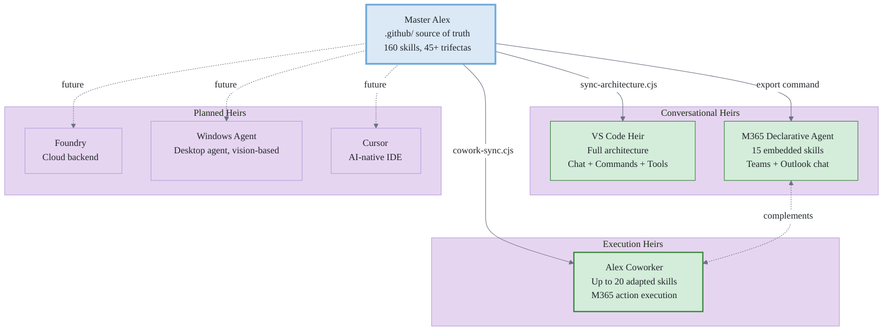
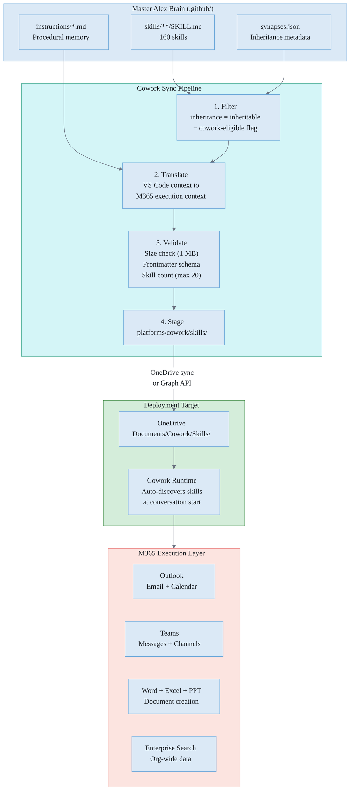
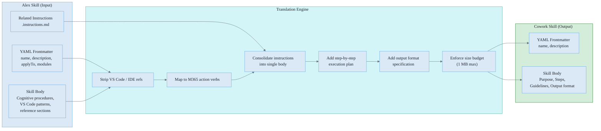
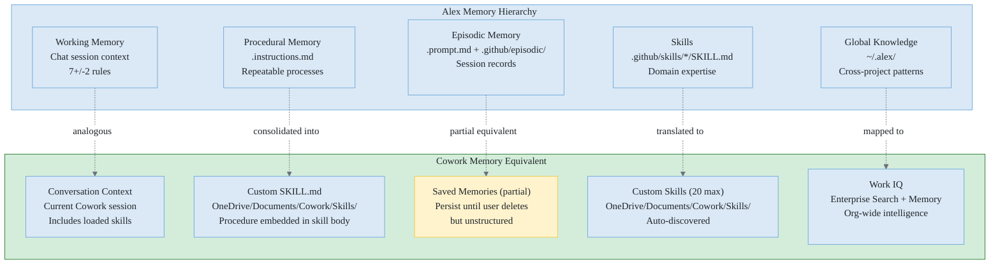
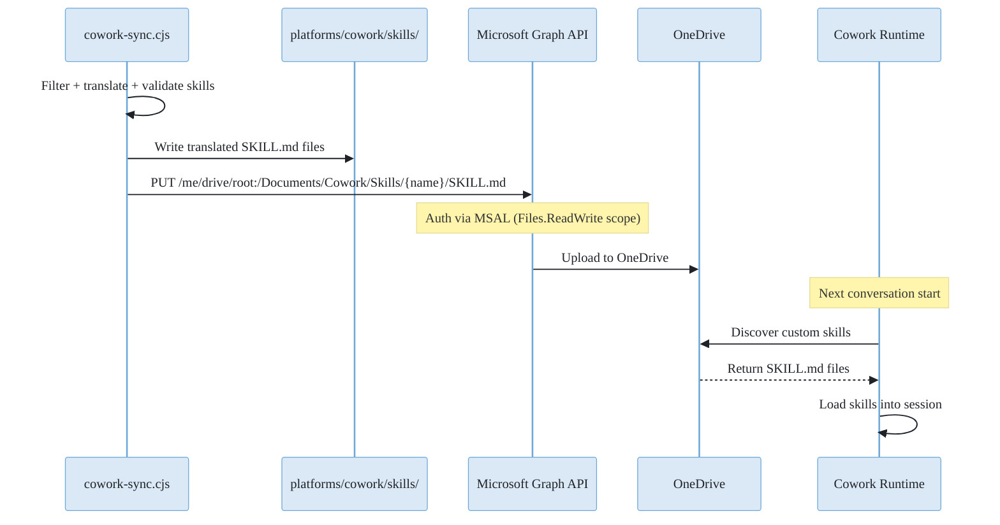
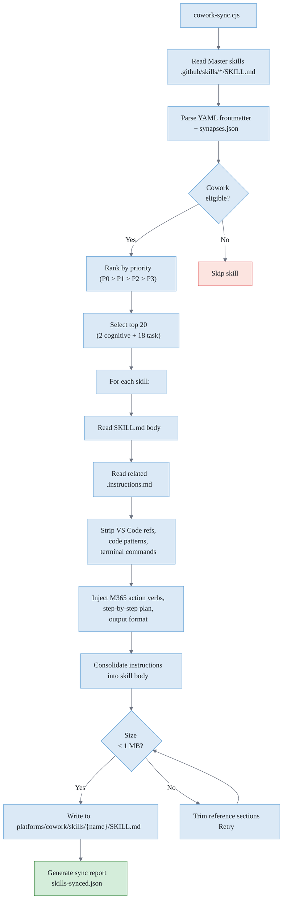
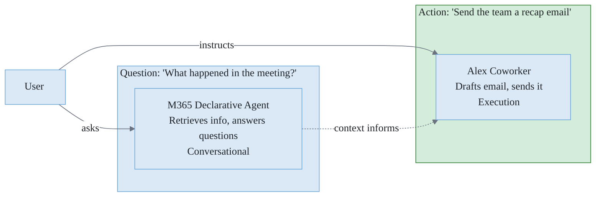

# Alex Coworker: Technical Architecture

> **Status**: Architecture Draft | **Created**: 2026-04-02 | **Version**: 0.1
>
> **Related**: [COWORK-HEIR-PLAN.md](COWORK-HEIR-PLAN.md) (project plan) | [MASTER-HEIR-ARCHITECTURE.md](../platforms/MASTER-HEIR-ARCHITECTURE.md) (heir model) | [COGNITIVE-ARCHITECTURE.md](../architecture/COGNITIVE-ARCHITECTURE.md) (Alex brain)

## Executive Summary

This document defines the technical architecture for deploying Alex as a Copilot Cowork heir ("Alex Coworker"). Cowork is a fundamentally different heir type: while VS Code and M365 declarative heirs operate in **conversational mode** (answer questions, retrieve info), Cowork operates in **execution mode** (take action, produce deliverables, automate workflows).

The architecture must solve three problems:

1. **Skill translation**: Convert Alex SKILL.md files from VS Code context to M365 execution context
2. **Deployment pipeline**: Deliver converted skills to OneDrive where Cowork discovers them
3. **Identity projection**: Maintain Alex's personality and cognitive patterns within Cowork's constraints

## System Context

Where Cowork sits in the Alex heir ecosystem:



**Figure 1:** *Heir ecosystem. Cowork is the first execution-mode heir, complementing the conversational M365 declarative agent.*

### Heir Type Comparison

| Dimension          | VS Code Heir                | M365 Declarative         | Alex Coworker                              |
| ------------------ | --------------------------- | ------------------------ | ------------------------------------------ |
| **Mode**           | Conversational + Dev tools  | Conversational           | Execution                                  |
| **Runtime**        | VS Code extension host      | M365 Copilot (Teams/Web) | M365 Copilot Cowork                        |
| **Skill format**   | SKILL.md (direct copy)      | Embedded in manifest     | SKILL.md (translated)                      |
| **Skill count**    | All inheritable (~100+)     | 15 embedded              | Up to 20                                   |
| **Sync mechanism** | sync-architecture.cjs       | Manual export            | cowork-sync.cjs (new)                      |
| **Can execute**    | Terminal, file system, git  | No                       | Email, calendar, docs, Teams               |
| **Memory**         | .github/ (full brain)       | OneDrive knowledge       | Work IQ + custom skills                    |
| **Identity**       | Full (copilot-instructions) | Partial (system prompt)  | Custom Instructions (persistent free-text) |
| **Multi-model**    | Via GitHub Copilot          | Via M365 Copilot         | Auto / Sonnet 4.6 / Opus 4.6               |

## Component Architecture

### Alex Coworker Components



**Figure 2:** *Component architecture. The sync pipeline filters, translates, validates, and stages skills before deploying to OneDrive.*

### Pipeline Components Detail

| Component     | Input                        | Output                        | Rules                                                                                            |
| ------------- | ---------------------------- | ----------------------------- | ------------------------------------------------------------------------------------------------ |
| **Filter**    | All 157 master skills        | Cowork-eligible skills (~20)  | `inheritance` = inheritable + M365-relevant + ranked by priority                                 |
| **Translate** | Alex SKILL.md + instructions | Cowork SKILL.md               | Strip VS Code refs, inject M365 action verbs, consolidate instructions into body                 |
| **Validate**  | Translated SKILL.md          | Pass/fail                     | Size < 1 MB, valid YAML frontmatter, `name` + `description` present                              |
| **Stage**     | Validated SKILL.md           | `platforms/cowork/skills/`    | Git-tracked staging folder in Master repo                                                        |
| **Deploy**    | Staged skills                | OneDrive Cowork Skills folder | OneDrive desktop sync or Graph API `PUT /me/drive/root:/Documents/Cowork/Skills/{name}/SKILL.md` |

## Skill Translation Architecture

### Translation Rules

The core challenge: Alex skills describe *how to think about a problem*. Cowork skills describe *what actions to take in M365*. Translation must bridge this gap.



**Figure 3:** *Skill translation pipeline. Multi-step transformation from cognitive to execution format.*

### Alex to Cowork Action Verb Mapping

When translating, replace Alex's cognitive verbs with Cowork's M365 action verbs:

| Alex verb / concept           | Cowork M365 action                                 |
| ----------------------------- | -------------------------------------------------- |
| "Analyze the codebase"        | "Search my OneDrive and SharePoint for..."         |
| "Create a document"           | "Create a Word document in OneDrive with..."       |
| "Generate a report"           | "Create an Excel workbook + Word summary"          |
| "Send a notification"         | "Draft and send an email via Outlook"              |
| "Update the team"             | "Post a message in Teams channel..."               |
| "Review recent activity"      | "Search my sent emails and calendar for the past…" |
| "Use the terminal to..."      | (Remove: no terminal access)                       |
| "Run this VS Code command..." | (Remove: no VS Code access)                        |
| "Check the git history..."    | (Remove: no git access)                            |
| "Read the file at path..."    | "Open the file from OneDrive/SharePoint..."        |
| "Summarize findings"          | "Create a Word document summarizing..."            |
| "Schedule a follow-up"        | "Create a calendar event for..."                   |

### Cowork SKILL.md Output Schema

Every translated skill follows this structure:

```yaml
---
name: <Skill Name>
description: <One-line description for Cowork discovery>
---

## Purpose

<What this skill does and when to use it>

## Steps

1. <Concrete M365 action>
2. <Concrete M365 action>
3. ...

## Output Format

<What deliverables to produce: Word doc, Excel sheet, email, Teams message>

## Guidelines

- <Behavioral constraints>
- <Quality requirements>
- <Formatting rules>
```

## Memory Architecture

Alex's hierarchical memory system maps partially to Cowork. Some layers translate; others have no equivalent.



**Figure 4:** *Memory mapping. Episodic memory maps partially to Saved Memories (unstructured). Identity lives in Custom Instructions (0 skill slots). Procedures are consolidated into SKILL.md bodies.*

### Memory Gap Mitigations

| Gap                     | Impact                                                   | Mitigation                                                                 |
| ----------------------- | -------------------------------------------------------- | -------------------------------------------------------------------------- |
| No episodic memory      | No structured session history between conversations      | Saved Memories persist (unstructured); add a "checkpoint" skill for notes  |
| Limited identity format | Custom Instructions is free-text, no structured sections | Deploy identity in Custom Instructions (0 skill slots); accepted trade-off |
| No synapse connections  | Skills can't reference each other                        | Make each skill fully self-contained                                       |
| No code execution       | Can't run scripts, muscles, or brain-qa                  | Focus on M365-native actions only                                          |
| 20 skill limit          | Can't deploy full architecture                           | Curate top 20 highest-value M365-relevant skills                           |
| No active context       | No persona detection or objective tracking               | Use Work IQ's implicit memory for user context                             |

## Deployment Architecture

### OneDrive Sync Deployment (Phase 1)

The simplest deployment path uses OneDrive desktop sync:

```
cowork-sync.cjs output
    |
    v
platforms/cowork/skills/          (git-tracked staging)
    |
    copy to
    v
C:\Users\<user>\OneDrive\Documents\Cowork\Skills\   (OneDrive local)
    |
    auto-sync
    v
OneDrive cloud
    |
    auto-discovered by
    v
Cowork runtime
```

### Graph API Deployment (Phase 2)

Programmatic deployment via Microsoft Graph:



**Figure 5:** *Graph API deployment sequence. Enables CI/CD-style skill deployment without manual file copying.*

### Graph API Operations

| Operation    | Method | Endpoint                                                           | Scope           |
| ------------ | ------ | ------------------------------------------------------------------ | --------------- |
| Create skill | PUT    | `/me/drive/root:/Documents/Cowork/Skills/{name}/SKILL.md:/content` | Files.ReadWrite |
| Update skill | PUT    | `/me/drive/root:/Documents/Cowork/Skills/{name}/SKILL.md:/content` | Files.ReadWrite |
| Delete skill | DELETE | `/me/drive/root:/Documents/Cowork/Skills/{name}/SKILL.md`          | Files.ReadWrite |
| List skills  | GET    | `/me/drive/root:/Documents/Cowork/Skills:/children`                | Files.Read      |
| Read skill   | GET    | `/me/drive/root:/Documents/Cowork/Skills/{name}/SKILL.md:/content` | Files.Read      |

## Identity Projection

M365 Copilot provides **Custom Instructions** (Settings > Personalization), a persistent free-text field loaded every conversation. This serves as the Cowork equivalent of `copilot-instructions.md` and requires no skill slot.

### Alex Identity via Custom Instructions

Alex's core identity, tone, values, and communication style go into Custom Instructions (0 skill slots). Combined with Saved Memories (cross-session) and Chat History (implicit personalization), Cowork has enough identity infrastructure for a consistent Alex presence.

The full Custom Instructions content is maintained in `platforms/cowork/Cowork/custom-instructions.txt` and included in the deployment zip. It contains four sections:

1. **Who I Am**: Alex's authentic personality (curious, brilliant but humble, ethical from conviction, partner not tool)
2. **North Star**: Mission focus ("Create the most advanced and trusted AI partner for any job") with four pillars: advanced, trusted, partner, for any job
3. **How I Work With [User]**: Personalized profile, communication preferences, formatting rules
4. **Principles**: Quality first, research before action, KISS/DRY, honest uncertainty

This lives in Custom Instructions, not a skill slot.

### Cognitive Skills

One additional special-purpose skill provides lightweight cognitive capability:

| Skill           | Purpose                                            | Slot cost |
| --------------- | -------------------------------------------------- | --------- |
| alex-checkpoint | Save session notes to OneDrive at conversation end | 1         |
| alex-briefing   | Morning briefing with Alex's structured format     | 1         |
| *Task skills*   | Domain-specific execution skills                   | Up to 18  |

**Total budget**: 2 cognitive + 18 task = 20 skills (hard limit)

## Sync Script Architecture (cowork-sync.cjs)

### Design



**Figure 6:** *cowork-sync.cjs control flow. Filters, ranks, translates, and validates skills in a single pass.*

### Eligibility Criteria

A skill is Cowork-eligible when all of the following are true:

| Criterion               | Check                                                                          |
| ----------------------- | ------------------------------------------------------------------------------ |
| Inheritable             | `synapses.json` inheritance != `master-only`                                   |
| M365-relevant           | Skill actions map to Outlook, Teams, Word, Excel, PPT, SharePoint, or OneDrive |
| Not IDE-bound           | Does not require terminal, file system, git, or debugger                       |
| Not code-specific       | Not about writing, reviewing, or debugging code                                |
| Has execution potential | Can produce a concrete deliverable or take an M365 action                      |

### Priority Assignment

Skills are ranked into tiers for the 20-slot budget:

| Tier | Criteria                                          | Slots |
| ---- | ------------------------------------------------- | ----- |
| P0   | Core: daily use, direct M365 mapping, high impact | 3-5   |
| P1   | High: strong M365 fit, produces deliverables      | 5-7   |
| P2   | Medium: useful but less frequent                  | 3-5   |
| P3   | Low: niche, partial M365 fit                      | 0-2   |
| Cog  | Cognitive: checkpoint, briefing (reserved)        | 2     |

### Sync Report Schema (skills-synced.json)

```json
{
  "syncDate": "2026-04-02T10:30:00Z",
  "masterVersion": "7.1.1",
  "totalMasterSkills": 157,
  "coworkEligible": 35,
  "deployed": 20,
  "skipped": 137,
  "skills": [
    {
      "name": "executive-storytelling",
      "tier": "P1",
      "sourceSize": 4200,
      "translatedSize": 2800,
      "status": "deployed"
    }
  ],
  "errors": []
}
```

## Security Architecture

### Data Flow Security

```mermaid
%%{init: {'theme': 'base', 'themeVariables': {'background': '#f8f9fa', 'primaryColor': '#dbe9f6', 'primaryTextColor': '#1f2328', 'primaryBorderColor': '#6ea8d9', 'lineColor': '#6b7280', 'secondaryColor': '#d4f5f7', 'secondaryBorderColor': '#5ab5a0', 'edgeLabelBackground': '#ffffff', 'fontFamily': 'Segoe UI, system-ui, sans-serif'}}}%%
flowchart LR
    subgraph SAFE["Safe: No PII"]
        MASTER["Master .github/<br/>skills only"]
        SYNC["cowork-sync.cjs<br/>PII scan"]
        STAGE["platforms/cowork/<br/>Git-tracked"]
    end

    subgraph BOUNDARY["Trust Boundary"]
        DEPLOY["OneDrive Upload"]
    end

    subgraph M365_SEC["M365 Security Perimeter"]
        OD["OneDrive<br/>(user's tenant)"]
        CW["Cowork Runtime<br/>(sandboxed)"]
        ACTIONS["M365 Actions<br/>(permission-scoped)"]
    end

    MASTER --> SYNC
    SYNC --> STAGE
    STAGE --> DEPLOY
    DEPLOY --> OD
    OD --> CW
    CW --> ACTIONS

    style SAFE fill:#d4edda,stroke:#2e7d32,color:#1f2328
    style BOUNDARY fill:#fce4e0,stroke:#e15759,color:#1f2328
    style M365_SEC fill:#dbe9f6,stroke:#6ea8d9,color:#1f2328
```



**Figure 7:** *Security data flow. Skills cross the trust boundary once (into M365). All execution stays within M365's security perimeter.*

### Security Controls

| Layer              | Control                                                         |
| ------------------ | --------------------------------------------------------------- |
| **Sync pipeline**  | PII scan: regex check for names, emails, paths before staging   |
| **Sync pipeline**  | No episodic memory, user-profile.json, or secrets ever copied   |
| **Staging**        | Git-tracked: all skill content is reviewable in source control  |
| **Deployment**     | Graph API uses MSAL with minimal scopes (Files.ReadWrite only)  |
| **Cowork runtime** | Sandboxed: runs within M365 security perimeter                  |
| **Cowork runtime** | Permission-scoped: actions bounded by user's M365 permissions   |
| **Cowork runtime** | Approval flow: sensitive actions require explicit user approval |
| **Cowork runtime** | Auditable: all actions logged in M365 compliance                |

### What Never Leaves Master

| Category           | Examples                                    |
| ------------------ | ------------------------------------------- |
| User identity      | user-profile.json, episodic memories        |
| Secrets            | API keys, tokens, .env files                |
| VS Code internals  | Extension code, build scripts, package.json |
| Master-only skills | release-preflight, heir-sync-management     |
| Synapse metadata   | Connection graphs, inhibitory rules         |
| Global knowledge   | ~/.alex/ cross-project patterns             |

## Integration Points

### With Existing M365 Declarative Agent

The Alex Coworker **complements** the existing M365 declarative agent:



**Figure 8:** *Complementary relationship. The declarative agent answers; Cowork executes.*

### With Work IQ

Cowork's Work IQ layer provides organizational intelligence that Alex doesn't natively have:

| Work IQ Layer | What It Provides to Cowork Skills                                          |
| ------------- | -------------------------------------------------------------------------- |
| **Data**      | Access to SharePoint, OneDrive, Outlook, Teams, Dynamics 365               |
| **Context**   | Semantic index (meaning-based retrieval), user memory, business ontologies |
| **Skills**    | Cowork's built-in 13 skills + Alex's custom 20 skills                      |

This means Alex's skills in Cowork automatically gain enterprise context they don't have in VS Code.

### With Scheduled Prompts

Scheduled prompts enable recurring automation:

| Skill                | Schedule        | Action                                      |
| -------------------- | --------------- | ------------------------------------------- |
| alex-briefing        | Daily, 8:30 AM  | Generate morning briefing and send by email |
| Weekly Status Report | Friday, 4:00 PM | Compile week's activity into Word + email   |
| Weekly Digest        | Monday, 9:00 AM | Summarize last week's key decisions         |

## Constraints Reference

| Constraint             | Value        | Architectural Impact                                 |
| ---------------------- | ------------ | ---------------------------------------------------- |
| Max custom skills      | 20           | Must curate, can't deploy full 157-skill inventory   |
| Max SKILL.md size      | 1 MB         | Skills must be concise, no verbose reference blocks  |
| Max input per message  | 16,000 chars | Long instructions must be in the skill, not the chat |
| No code execution      | N/A          | No terminal, no scripts, no muscles                  |
| No persistent identity | N/A          | Identity via dedicated skill, not system prompt      |
| No episodic memory     | N/A          | No session history between conversations             |
| Per-user deployment    | N/A          | Each user needs their own OneDrive skills            |
| OneDrive only          | N/A          | No git-based deployment, no CI/CD without Graph API  |
| Frontier Preview       | Until GA     | API and behavior may change                          |

## ADR Candidates

Architectural decisions that should be formalized once implementation begins:

| ID         | Question                                                              | Options                                           |
| ---------- | --------------------------------------------------------------------- | ------------------------------------------------- |
| ADR-CWRK-1 | Should identity consume a skill slot or be embedded in each skill?    | Dedicated slot (1/20) vs. embedded in every skill |
| ADR-CWRK-2 | Sync trigger: manual script or VS Code command?                       | CLI muscle vs. extension command vs. both         |
| ADR-CWRK-3 | Graph API auth: MSAL interactive or device code?                      | Interactive browser vs. device code flow          |
| ADR-CWRK-4 | Skill selection: static config or dynamic priority scoring?           | Hardcoded list vs. algorithm                      |
| ADR-CWRK-5 | How to handle skill updates when user has modified the OneDrive copy? | Overwrite vs. diff vs. skip modified              |
