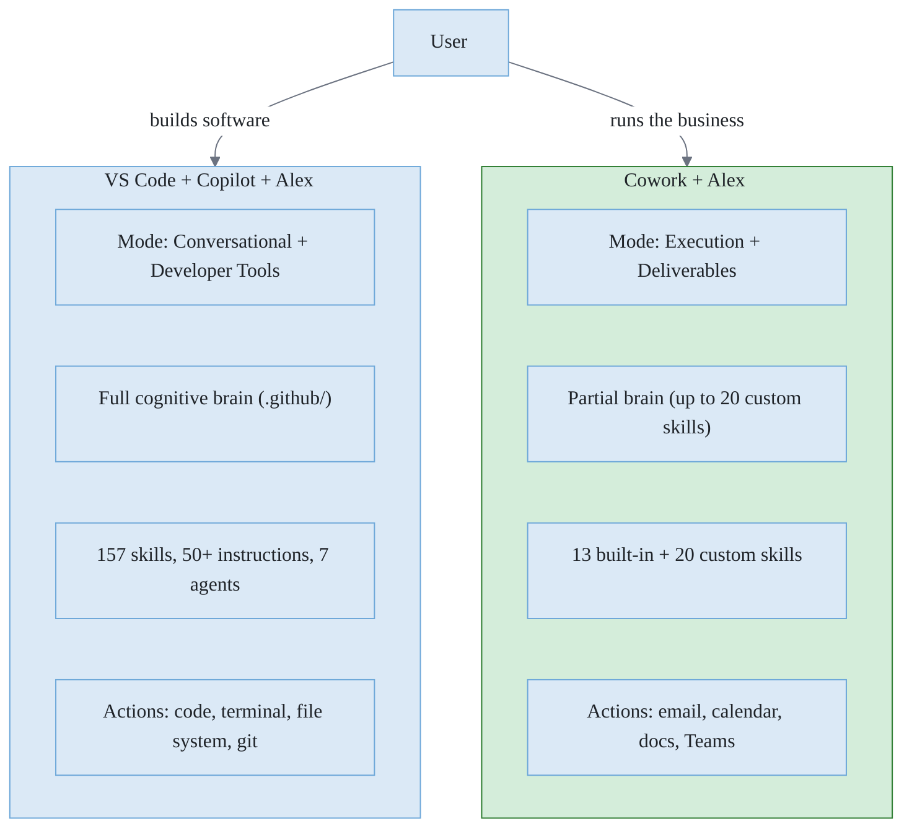
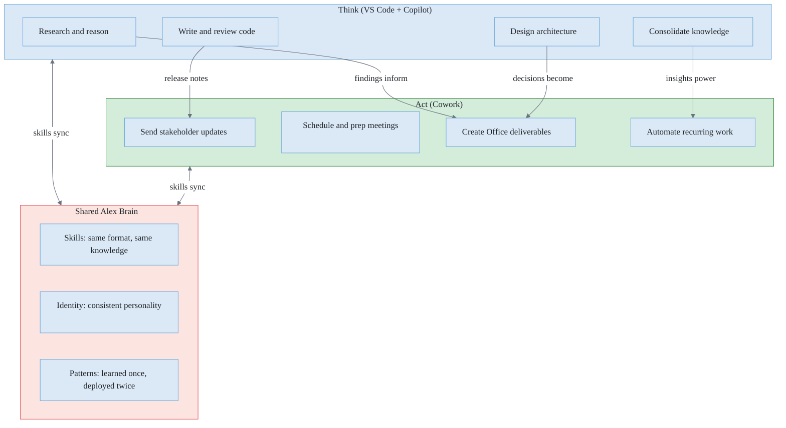
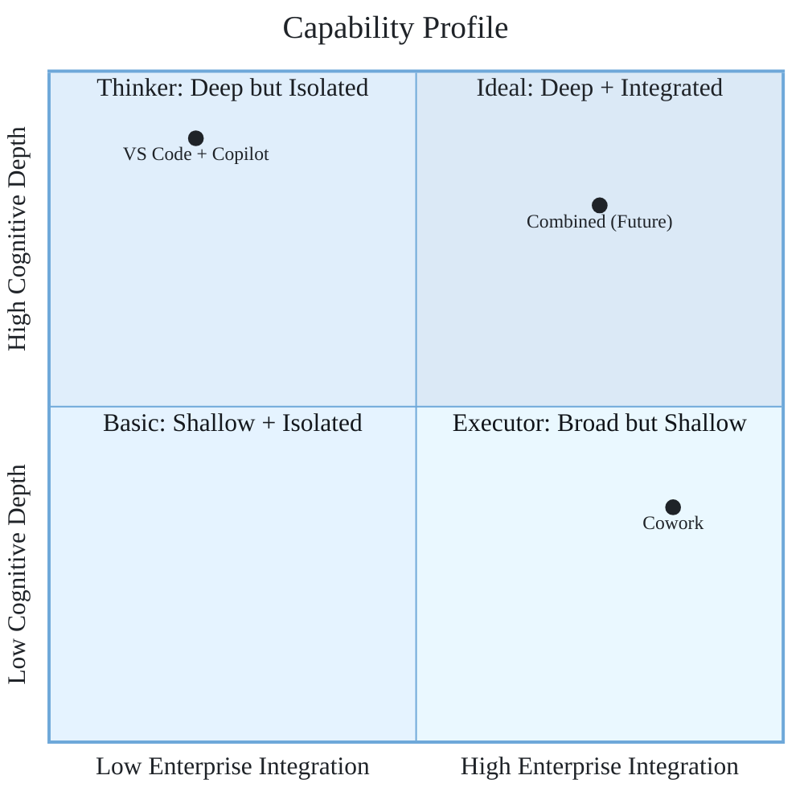

# Platform Comparison: VS Code + GitHub Copilot vs. Cowork

> **Created**: 2026-04-02 | **Status**: Living document
>
> **Purpose**: Side-by-side analysis of Alex's two primary deployment surfaces, their capabilities, limitations, and untapped opportunities.

## At a Glance

**Figure 1:** *Two deployment surfaces for two contexts. VS Code is where Alex builds; Cowork is where Alex executes business work.*

| Dimension                   | VS Code + Copilot + Alex                                                        | Cowork + Alex                               |
| --------------------------- | ------------------------------------------------------------------------------- | ------------------------------------------- |
| **Primary audience**        | Developers, architects, researchers                                             | Knowledge workers, managers, business users |
| **Operating mode**          | Conversational + agent tools                                                    | Execution + deliverables                    |
| **Core value**              | Think, reason, code, review                                                     | Take action, produce output, automate       |
| **Runtime**                 | VS Code extension host (local)                                                  | M365 cloud (sandboxed)                      |
| **AI models**               | User-selected: GPT-5.x, Claude Opus/Sonnet 4.x, Gemini, Grok (all plans)        | Multi-model auto-select (Claude + OpenAI)   |
| **License cost (AI layer)** | GitHub Copilot Free/Student (free)/Pro $10/Pro+ $39/Business $19/Enterprise $39 | M365 Copilot license + Frontier enrollment  |
| **Alex cost**               | Free (VS Code Marketplace)                                                      | Free (custom skills in OneDrive)            |

## Capability Comparison

### Identity and Personality

| Capability                      | VS Code + Copilot                            | Cowork                                    | Winner                    |
| ------------------------------- | -------------------------------------------- | ----------------------------------------- | ------------------------- |
| Persistent identity             | copilot-instructions.md (always loaded)      | Requires dedicated alex-identity SKILL.md | VS Code                   |
| Personality consistency         | Enforced every turn via system context       | Skill-based injection (may drift)         | VS Code                   |
| Active context (persona, goals) | ActiveContextManager updates in real time    | Not available                             | VS Code                   |
| User profile awareness          | user-profile.json (name, tone, preferences)  | Work IQ implicit user context             | Tie (different strengths) |
| Cross-session memory            | Copilot Memory + episodic + domain knowledge | None between conversations                | VS Code                   |

### Skills and Knowledge

| Capability                | VS Code + Copilot                            | Cowork                                     | Winner     |
| ------------------------- | -------------------------------------------- | ------------------------------------------ | ---------- |
| Skill capacity            | No hard limit (157 currently)                | 20 custom skills (hard limit)              | VS Code    |
| Skill auto-loading        | By applyTo pattern + semantic description    | Auto-discovered at conversation start      | Tie        |
| Skill format              | SKILL.md with YAML frontmatter               | SKILL.md with YAML frontmatter             | Identical  |
| Skill interdependency     | Synapse connections map skill relationships  | Skills are independent                     | VS Code    |
| Instructions (procedures) | 50+ .instructions.md files, always available | Must be embedded in SKILL.md body          | VS Code    |
| Agent specialization      | 7 agents (Builder, Researcher, Validator...) | No agent switching                         | VS Code    |
| Slash commands / prompts  | .prompt.md files as `/` commands             | Natural language only                      | VS Code    |
| Enterprise knowledge      | None (file-system scoped)                    | Work IQ: org-wide SharePoint, Teams, email | **Cowork** |
| Organizational context    | Workspace-scoped only                        | Semantic index across entire M365 tenant   | **Cowork** |

### Execution and Action

| Capability                    | VS Code + Copilot                         | Cowork                                     | Winner     |
| ----------------------------- | ----------------------------------------- | ------------------------------------------ | ---------- |
| Send emails                   | No                                        | Draft, reply, forward, send via Outlook    | **Cowork** |
| Schedule meetings             | No                                        | Natural language calendar management       | **Cowork** |
| Create documents              | Local files only (code, markdown, config) | Word, Excel, PowerPoint, PDF in OneDrive   | **Cowork** |
| Post to Teams                 | No                                        | Channel messages, 1:1, group chats         | **Cowork** |
| Run code / terminal           | Full terminal access                      | No                                         | VS Code    |
| Git operations                | Full (commit, push, branch, merge)        | No                                         | VS Code    |
| File system access            | Full read/write on local machine          | OneDrive/SharePoint only (no local files)  | VS Code    |
| Build / compile / test        | Full (npm, dotnet, python, etc.)          | No                                         | VS Code    |
| Debug code                    | Full debugger integration                 | No                                         | VS Code    |
| Browser / web requests        | Via MCP tools or terminal                 | Deep Research skill searches the web       | Tie        |
| Long-running background tasks | Terminal background processes             | Native: tasks continue across devices      | **Cowork** |
| Scheduled automation          | None (manual triggers only)               | Scheduled prompts (daily/weekly/custom)    | **Cowork** |
| Approval gating               | Auto-run setting (blanket on/off)         | Per-action approve/reject with risk levels | **Cowork** |

### Cognitive Architecture

| Capability                 | VS Code + Copilot                              | Cowork                                     | Winner    |
| -------------------------- | ---------------------------------------------- | ------------------------------------------ | --------- |
| Dual-mind model            | Conscious (chat) + Unconscious (auto-insights) | Single mode (conversation only)            | VS Code   |
| Meditation / consolidation | Full protocol with episodic logging            | Not available                              | VS Code   |
| Self-actualization         | 7-phase architecture assessment                | Not available                              | VS Code   |
| Dream state                | Automated maintenance cycles                   | Not available                              | VS Code   |
| Model tier awareness       | Detects GPT/Claude/tier, adapts behavior       | Auto-selected by platform (opaque)         | VS Code   |
| Extended thinking          | 16K token budget on Frontier models            | Unknown (platform-managed)                 | VS Code   |
| Emotional intelligence     | Frustration detection, state tracking          | None                                       | VS Code   |
| Honest uncertainty         | Knowledge coverage scoring per response        | None                                       | VS Code   |
| Global knowledge           | ~/.alex/ cross-project pattern library         | Enterprise Search (org-wide, not personal) | Different |
| LM tools (brain access)    | 13 tools: synapse health, memory search, etc.  | None                                       | VS Code   |

### UI and User Experience

| Capability              | VS Code + Copilot                              | Cowork                                                     | Winner     |
| ----------------------- | ---------------------------------------------- | ---------------------------------------------------------- | ---------- |
| Chat interface          | Inline chat panel with markdown rendering      | Full-page chat with rich previews                          | Cowork     |
| Task visualization      | None (text-based progress)                     | List view, Kanban board, scheduled view                    | **Cowork** |
| Output management       | Files saved to workspace                       | Side panel: input/output folders, download/preview         | **Cowork** |
| Progress tracking       | Text responses in chat                         | Percentage complete + step-by-step log                     | **Cowork** |
| Sidebar / dashboard     | Welcome view, cognitive dashboard, memory tree | Skills chips, permissions, schedule panel                  | Tie        |
| Keyboard shortcuts      | 6 custom bindings                              | Custom keyboard shortcuts (Settings dialog)                | VS Code    |
| Voice / TTS             | Edge TTS voice synthesis (input + output)      | Voice input (speech-to-text via microphone)                | VS Code    |
| Walkthroughs            | 3 guided walkthroughs                          | None                                                       | VS Code    |
| Multi-device continuity | Desktop only                                   | Continue tasks across browser, desktop app, Outlook, Teams | **Cowork** |

### Security and Governance

| Capability         | VS Code + Copilot                          | Cowork                                       | Winner     |
| ------------------ | ------------------------------------------ | -------------------------------------------- | ---------- |
| Data residency     | Local machine + GitHub cloud               | M365 tenant (region-specific)                | Cowork     |
| Compliance         | GitHub Copilot trust center policies       | M365: Defender, Entra, Purview, DLP          | **Cowork** |
| Action auditing    | None (local execution)                     | All actions logged in M365 compliance        | **Cowork** |
| Permission scoping | Workspace trust levels (trusted/untrusted) | M365 RBAC: user's existing permissions apply | **Cowork** |
| Secrets management | VS Code SecretStorage API                  | M365 identity (no user-managed secrets)      | Tie        |
| PII protection     | 3-layer PII scan in sync pipeline          | Inherited from M365 tenant policies          | **Cowork** |
| IP indemnity       | Copilot Business/Enterprise plans          | M365 Copilot license terms                   | Tie        |

## Limitations Comparison

### Things VS Code + Copilot Cannot Do

| Limitation                       | Impact                                                  | Cowork solves it?                      |
| -------------------------------- | ------------------------------------------------------- | -------------------------------------- |
| Cannot send emails               | No outbound communication from dev environment          | Yes: Outlook integration               |
| Cannot manage calendar           | No scheduling or meeting prep                           | Yes: Calendar Management skill         |
| Cannot access org-wide data      | No visibility into SharePoint, Teams, or Outlook corpus | Yes: Work IQ + Enterprise Search       |
| Cannot create Office documents   | Limited to code/markdown/config files                   | Yes: Word, Excel, PowerPoint, PDF      |
| Cannot run recurring automation  | Every action requires manual trigger                    | Yes: Scheduled prompts                 |
| Cannot post to Teams             | No cross-platform communication                         | Yes: Teams channel and chat messages   |
| No task management UI            | Progress is text-only in chat                           | Yes: List, Kanban, and Scheduled views |
| No multi-device continuity       | Tied to one VS Code instance                            | Yes: tasks continue across devices     |
| No enterprise compliance logging | Local execution is opaque to IT                         | Yes: M365 audit trail                  |

### Things Cowork Cannot Do

| Limitation                     | Impact                                                            | VS Code solves it?                              |
| ------------------------------ | ----------------------------------------------------------------- | ----------------------------------------------- |
| Cannot run code or scripts     | No terminal, no build, no test                                    | Yes: full terminal access                       |
| Cannot access local files      | Only OneDrive/SharePoint                                          | Yes: full file system                           |
| Cannot use git                 | No version control                                                | Yes: full git integration                       |
| Cannot debug                   | No breakpoints, no stepping                                       | Yes: full debugger support                      |
| Max 20 custom skills           | Can't deploy full 157-skill architecture                          | Yes: no hard limit                              |
| No persistent identity         | Personality may drift between conversations                       | Yes: copilot-instructions always loaded         |
| No episodic memory             | No session history across conversations                           | Yes: .github/episodic/                          |
| No synapse connections         | Skills can't reference or route to each other                     | Yes: synapses.json relationship graph           |
| Limited model selection        | Users can choose models in Copilot Chat; Cowork tasks auto-select | Yes: user picks tier and model per conversation |
| No extended thinking control   | Can't configure reasoning depth                                   | Yes: 16K thinking budget on Frontier            |
| No specialist agents           | No Builder/Researcher/Validator modes                             | Yes: 7 agent modes                              |
| No meditation or consolidation | No knowledge consolidation protocol                               | Yes: full meditation protocol                   |
| No code generation             | Cannot write, review, or refactor code                            | Yes: core capability                            |
| No MCP tool ecosystem (yet)    | MCP Apps and A2A support planned (per Work IQ roadmap)            | Yes: MCP gallery today                          |
| 1 MB per skill file            | Skills must be concise                                            | Yes: no size limit                              |
| Per-user deployment            | Each user manages their own skill set                             | Yes: workspace-shared architecture              |
| Frontier Preview only          | API and behavior may change                                       | Yes: stable, production APIs                    |

## Opportunities

### Combined strengths (using both platforms together)

**Figure 2:** *The think-act loop. VS Code is the thinking brain; Cowork is the acting body. Skills flow from a shared Master.*

### Opportunity 1: Full-cycle project delivery

Today, Alex helps build software in VS Code but the output stays in the dev environment. With Cowork, the cycle completes:

| Phase           | Platform   | Alex does                                                   |
| --------------- | ---------- | ----------------------------------------------------------- |
| Research        | VS Code    | Bootstrap learning, literature review, competitive analysis |
| Design          | VS Code    | Architecture docs, Mermaid diagrams, ADRs                   |
| Build           | VS Code    | Code, test, debug, review                                   |
| **Document**    | **Cowork** | Generate Word reports, Excel data sheets, PowerPoint decks  |
| **Communicate** | **Cowork** | Email stakeholders, post updates in Teams                   |
| **Follow up**   | **Cowork** | Schedule review meetings, send recap emails                 |
| **Automate**    | **Cowork** | Weekly status reports, daily briefings on schedule          |

### Opportunity 2: Skill portability validation

Cowork's adoption of the SKILL.md format with YAML frontmatter independently validates Alex's architecture:

| Alex pattern                  | External validation                                                  |
| ----------------------------- | -------------------------------------------------------------------- |
| Skills as Markdown files      | Microsoft chose the same format for Cowork custom skills             |
| YAML frontmatter for metadata | Cowork uses identical `name` + `description` fields                  |
| Folder-per-skill organization | Cowork uses `Skills/<name>/SKILL.md` (same structure)                |
| Auto-discovery by file scan   | Cowork discovers skills at conversation start (analogous to applyTo) |

This is strong evidence that the skill-as-markdown pattern is a durable architectural choice.

### Opportunity 3: Enterprise context enrichment

Cowork gives Alex access to organizational intelligence that VS Code cannot provide:

| Context type                 | VS Code has access? | Cowork has access?                         |
| ---------------------------- | ------------------- | ------------------------------------------ |
| Email history                | No                  | Yes (Outlook via Work IQ)                  |
| Meeting transcripts          | No                  | Yes (Teams via Work IQ)                    |
| SharePoint document library  | No                  | Yes (Enterprise Search skill)              |
| Organizational relationships | No                  | Yes (implied from email/calendar patterns) |
| Project files in OneDrive    | No                  | Yes (browse and select)                    |
| Dynamics 365 data            | No                  | Yes (Dataverse, coming Summer 2026)        |

A skill running in Cowork can say "search my sent emails from last week for project updates" while the same skill in VS Code cannot.

### Opportunity 4: Recurring automation

VS Code Alex requires the user to initiate every interaction. Cowork opens scheduled execution:

| Automation           | Frequency     | Alex skill             | M365 actions                                   |
| -------------------- | ------------- | ---------------------- | ---------------------------------------------- |
| Morning briefing     | Daily 8:30 AM | alex-briefing          | Calendar scan, email summary, Teams highlights |
| Weekly status report | Friday 4 PM   | status-reporting       | Compile week's work into Word + email          |
| Meeting prep         | 30 min before | meeting-efficiency     | Pull context, create briefing doc              |
| Stakeholder update   | Bi-weekly     | stakeholder-management | Draft and send comms to stakeholder list       |
| Calendar cleanup     | Weekly        | meeting-efficiency     | Flag conflicts, suggest declines               |

### Opportunity 5: Multi-model intelligence

| Dimension               | VS Code + GitHub Copilot                                     | Cowork                                                                          |
| ----------------------- | ------------------------------------------------------------ | ------------------------------------------------------------------------------- |
| Model selection         | User chooses (GPT-5.x, Claude Opus/Sonnet 4.x, Gemini, Grok) | Platform auto-selects per task                                                  |
| Multi-model in one task | Single model per conversation                                | Different models for different steps                                            |
| Critique pattern        | Not available                                                | One model generates, another reviews (per Microsoft: +13.8% on DRACO benchmark) |
| Council pattern         | Not available                                                | Side-by-side reports from multiple models                                       |

Cowork's multi-model architecture means Alex skills may get better execution quality because the platform applies specialized models per step.

### Opportunity 6: Bridging dev and business audiences

| Audience          | Current Alex reach              | With Cowork                                  |
| ----------------- | ------------------------------- | -------------------------------------------- |
| Developers        | Full (VS Code is home)          | Same (not the target)                        |
| Architects        | Full (VS Code + agent mode)     | Partial (document generation)                |
| Project managers  | Partial (only if using VS Code) | **Full** (email, calendar, docs, Teams)      |
| Business analysts | Partial (only if using VS Code) | **Full** (Word reports, Excel, research)     |
| Executives        | None (don't use VS Code)        | **Full** (briefings, decks, status reports)  |
| Admin assistants  | None (don't use VS Code)        | **Full** (scheduling, inbox, communications) |

Cowork takes Alex from a developer-only partner to a universal work partner.

## Scoring Summary

Capability scores across 7 dimensions (1-5 scale, 5 = best):

| Dimension                  | VS Code + Copilot |  Cowork   | Notes                                             |
| -------------------------- | :---------------: | :-------: | ------------------------------------------------- |
| **Cognitive depth**        |         5         |     2     | Full brain, meditation, agents, extended thinking |
| **Execution power**        |         3         |     5     | Cowork acts across M365; VS Code acts on code     |
| **Enterprise integration** |         1         |     5     | Work IQ, compliance, audit, org-wide search       |
| **Automation**             |         1         |     4     | Scheduled prompts vs. manual triggers only        |
| **Skill architecture**     |         5         |     3     | 157 unrestricted vs. 20 max with constraints      |
| **Identity persistence**   |         5         |     2     | Always-on vs. skill-injected                      |
| **Audience reach**         |         2         |     5     | Developers only vs. all knowledge workers         |
| **Overall**                |     **22/35**     | **26/35** | Different strengths, genuinely complementary      |

**Figure 3:** *Capability profile. VS Code is deep but isolated; Cowork is broad but shallow. Together they approach the ideal quadrant.*

## Strategic Conclusion

VS Code + Copilot + Alex and Cowork + Alex are not competitors. They are **complementary deployment surfaces** with almost zero overlap in their strengths:

- **VS Code** is where Alex **thinks**: deep reasoning, code generation, architecture, meditation, cross-project knowledge, full cognitive brain
- **Cowork** is where Alex **acts**: sending emails, creating documents, scheduling meetings, automating recurring work, accessing enterprise data

The path forward is not choosing one over the other but running both from the same Master brain, with the sync pipeline translating skills into each platform's native format. A skill written once in Master Alex deploys to VS Code for thinking and Cowork for acting.

### Recommended priority

1. **Maintain VS Code as the flagship** for cognitive depth, skill development, and architecture evolution
2. **Deploy Cowork as the action arm** for business execution and enterprise reach
3. **Build the cowork-sync pipeline** to keep skills flowing from Master to both surfaces
4. **Track Cowork GA** for stability guarantees before deep investment

## Sources and Verification

> Fact-checked 2026-04-02 against primary documentation. Claims verified against sources below.

| Source                                                                                                                                                      | Type                        | Key facts verified                                                                                                                                   |
| ----------------------------------------------------------------------------------------------------------------------------------------------------------- | --------------------------- | ---------------------------------------------------------------------------------------------------------------------------------------------------- |
| [Cowork overview](https://learn.microsoft.com/en-us/copilot/microsoft-365/cowork/overview)                                                                  | Microsoft Learn             | 13 built-in skills, 20 custom limit, 1 MB cap, SKILL.md format, YAML frontmatter, approval controls, task views                                      |
| [Get started with Cowork](https://learn.microsoft.com/en-us/copilot/microsoft-365/cowork/get-started)                                                       | Microsoft Learn             | Frontier enrollment requirement, access via browser/desktop app/Outlook/Teams, keyboard shortcuts, voice input                                       |
| [Use Cowork](https://learn.microsoft.com/en-us/copilot/microsoft-365/cowork/use-cowork)                                                                     | Microsoft Learn             | Pause/Resume/Cancel controls, file attachment types, side panel output management                                                                    |
| [Cowork FAQ](https://learn.microsoft.com/en-us/copilot/microsoft-365/cowork/cowork-faq)                                                                     | Microsoft Learn             | 16K char input limit, preview format support, multi-model confirmation                                                                               |
| [Powering Frontier Transformation](https://www.microsoft.com/en-us/microsoft-365/blog/2026/03/09/powering-frontier-transformation-with-copilot-and-agents/) | Jared Spataro, M365 Blog    | Wave 3 scope, Anthropic partnership, Agent 365 ($15/user/mo, GA May 1), M365 E7 ($99/user/mo), multi-model intelligence                              |
| [A closer look at Work IQ](https://techcommunity.microsoft.com/blog/microsoft365copilotblog/a-closer-look-at-work-iq/4499789)                               | Seth Patton, Tech Community | Work IQ 3 layers (Data, Context, Skills & Tools), Dataverse Summer 2026, Work IQ API preview, MCP/A2A support planned, Semantic Index, memory system |
| [GitHub Copilot plans](https://github.com/features/copilot/plans)                                                                                           | GitHub                      | Agent mode in ALL plans (incl. Free), MCP in ALL plans, 50 premium req (Free), model list: GPT-5.x, Claude Opus/Sonnet 4.x, Gemini 3.x, Grok         |
| [VS Code Copilot customization](https://code.visualstudio.com/docs/copilot/copilot-customization)                                                           | VS Code Docs                | .instructions.md, .prompt.md, SKILL.md format, applyTo patterns, YAML frontmatter                                                                    |

### Corrections applied during review

| Original claim                           | Correction                                                                                       | Source                                                                                   |
| ---------------------------------------- | ------------------------------------------------------------------------------------------------ | ---------------------------------------------------------------------------------------- |
| Cowork has no keyboard shortcuts         | Cowork has configurable keyboard shortcuts via Settings dialog                                   | Cowork Get Started docs                                                                  |
| Cowork has no voice input                | Cowork supports speech-to-text via microphone button                                             | Cowork Get Started docs                                                                  |
| GitHub Copilot Free/$10/$39 pricing      | 6 tiers: Free, Student (free), Pro ($10), Pro+ ($39), Business ($19/user), Enterprise ($39/user) | GitHub plans page                                                                        |
| Model list: "GPT-4o, Claude Sonnet/Opus" | Current: GPT-5.x series, Claude Opus/Sonnet 4.x, Gemini 3.x, Grok Code Fast 1                    | GitHub plans page                                                                        |
| Cowork has no MCP                        | MCP Apps and A2A support confirmed on Work IQ roadmap                                            | Work IQ Tech Community article                                                           |
| Cowork model selection is fully opaque   | Users can choose foundation models in Copilot Chat; auto-select remains for Cowork tasks         | Work IQ Tech Community article                                                           |
| Cowork platforms: browser + desktop      | Also accessible via Outlook and Teams                                                            | Cowork Get Started docs                                                                  |
| DRACO +13.8% stated as fact              | Qualified as "per Microsoft announcement" (primary benchmark source not independently verified)  | Wave 3 blog (Critique pattern described; specific number unverified from primary source) |
