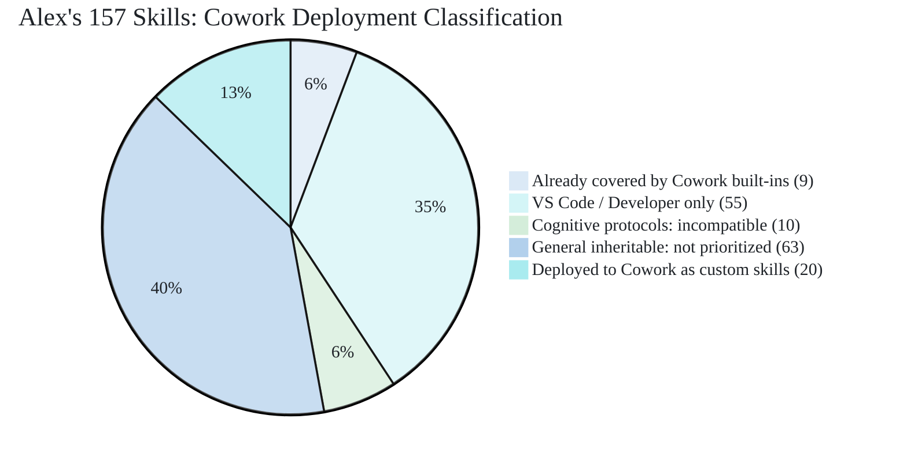

# Cowork Skill Deployment Strategy: Overlap, Gaps, and the 20-Slot Plan

> **Created**: 2026-04-03 | **Purpose**: Map Alex's 157 skills against Cowork's 13 built-in skills to eliminate duplication and maximize the value of 20 custom skill slots.

## The Constraint

Cowork allows **20 custom skills** max. Alex has **157 skills**. That means every slot must deliver value that Cowork cannot provide on its own. Deploying a skill that duplicates a built-in capability wastes 5% of our total budget.

## Cowork Built-in Coverage Map

First, what does Cowork already handle natively (no custom skill needed)?

| Cowork built-in     | What it does                                  | Alex skills it replaces or overlaps                       |
| ------------------- | --------------------------------------------- | --------------------------------------------------------- |
| Word                | Create and edit Word documents                | md-to-word, book-publishing (Word output)                 |
| Excel               | Create and edit spreadsheets                  | data-visualization (chart creation), dashboard-design     |
| PowerPoint          | Create and edit presentations                 | pptx-generation, gamma-presentations, slide-design        |
| PDF                 | Work with PDF documents                       | book-publishing (PDF output)                              |
| Email               | Compose, reply, forward, send via Outlook     | (no Alex equivalent: VS Code can't send email)            |
| Scheduling          | Schedule meetings                             | meeting-efficiency (scheduling advice)                    |
| Calendar Management | Create events, manage calendar, Teams links   | meeting-efficiency (calendar organization advice)         |
| Meetings            | Prepare meeting intelligence                  | meeting-efficiency (prep content)                         |
| Daily Briefing      | Prepare daily overview                        | status-reporting (daily updates)                          |
| Enterprise Search   | Search across organization                    | (no Alex equivalent: workspace-scoped only)               |
| Deep Research       | Multi-source research, comprehensive analysis | bootstrap-learning, literature-review                     |
| Communications      | Draft stakeholder communications              | stakeholder-management (comms strategy), status-reporting |
| Adaptive Cards      | Interactive card responses                    | teams-app-patterns (developer-side card creation)         |

## Alex Skill Classification for Cowork

Every Alex skill falls into one of four categories:

### Category A: Already Covered (DO NOT DEPLOY)

These skills duplicate what Cowork does natively. Deploying them wastes slots.

| Alex skill              | Covered by Cowork built-in       | Why it's redundant                                                   |
| ----------------------- | -------------------------------- | -------------------------------------------------------------------- |
| md-to-word              | Word                             | Cowork creates Word docs natively; no Markdown conversion needed     |
| pptx-generation         | PowerPoint                       | Cowork creates PowerPoint natively                                   |
| book-publishing         | Word + PDF                       | Cowork outputs both formats directly                                 |
| gamma-presentations     | PowerPoint                       | Cowork's PowerPoint skill handles creation; Gamma is a separate SaaS |
| meeting-efficiency      | Scheduling + Calendar + Meetings | All three built-ins cover meeting prep, scheduling, conflicts        |
| teams-app-patterns      | Adaptive Cards + Teams posting   | Dev-focused; Cowork posts to Teams and creates cards natively        |
| markdown-mermaid        | Word + PowerPoint                | Cowork renders native diagrams in Office docs                        |
| ascii-art-alignment     | (not applicable in M365)         | Text-art has no M365 use case                                        |
| fabric-notebook-publish | (not applicable)                 | Fabric Git sync is a dev workflow                                    |

**Slot savings: 9 skills that would have been wasted.**

### Category B: VS Code / Developer Only (CANNOT RUN IN COWORK)

These skills require terminal, file system, git, debugger, or VS Code APIs. Cowork has none of these.

| Category                | Skills (not deployable)                                                                                                                                                    |
| ----------------------- | -------------------------------------------------------------------------------------------------------------------------------------------------------------------------- |
| Coding fundamentals     | testing-strategies, refactoring-patterns, debugging-patterns, code-review, git-workflow, project-scaffolding, api-design                                                   |
| Azure / cloud           | azure-architecture-patterns, azure-devops-automation, azure-deployment-operations, bicep-avm-mastery, infrastructure-as-code                                               |
| VS Code specific        | vscode-extension-patterns, vscode-configuration-validation, chat-participant-patterns, vscode-environment, extension-audit-methodology, agent-debug-panel                  |
| Data engineering        | microsoft-fabric, fabric-notebook-publish                                                                                                                                  |
| MCP / agent platform    | mcp-development, foundry-agent-platform, ai-agent-design                                                                                                                   |
| Security (code-focused) | security-review, secrets-management, distribution-security                                                                                                                 |
| Build / deploy          | project-deployment, release-process, release-preflight                                                                                                                     |
| Terminal / image gen    | terminal-image-rendering, image-handling (Replicate API), ai-character-reference-generation, ai-generated-readme-banners, character-aging-progression, flux-brand-finetune |
| Meta-architecture       | skill-catalog-generator, heir-sync-management, brain-qa, dream-state, memory-activation, architecture-audit, architecture-refinement                                       |

**Total: ~55 skills. Not candidates for Cowork deployment.**

### Category C: Cognitive Protocols (NO COWORK EQUIVALENT)

These require episodic memory, persistent identity, or cross-session state that Cowork doesn't support.

| Alex skill          | Why it can't work in Cowork                                    |
| ------------------- | -------------------------------------------------------------- |
| meditation          | Requires episodic memory logging, cross-session state          |
| self-actualization  | Requires full architecture assessment, 7-phase protocol        |
| dream-state         | Requires automated maintenance cycles, synapse access          |
| persona-detection   | Requires workspace scoring, copilot-instructions.md            |
| global-knowledge    | Requires ~/.alex/ cross-project library                        |
| knowledge-synthesis | Requires cross-project pattern recognition                     |
| memory-activation   | Requires synapse network and action-keyword index              |
| cognitive-symbiosis | Meta-cognitive: no Cowork context for AI-human paradigm        |
| skill-building      | Requires Master Alex architecture to create and promote skills |
| skill-development   | Requires tracking across sessions                              |

**Total: ~10 skills. Architecturally incompatible.**

### Category D: AUGMENTATION CANDIDATES (DEPLOY THESE)

These skills add genuine value that no Cowork built-in provides. Ranked by impact.

## The 20-Slot Plan

Given 20 slots, here is the priority-ranked deployment list. Identity goes into Custom Instructions (free, no slot). All 20 slots are pure augmentation.

### Tier 1: Identity (0 skill slots: uses Custom Instructions instead)

M365 Copilot's **Custom Instructions** (Settings > Personalization) is a persistent free-text field loaded every conversation, functioning like a simplified copilot-instructions.md. Alex's core identity (name, personality, tone, values, ethical reasoning, user preferences) goes here rather than consuming a skill slot. Combined with **Saved Memories** (cross-session) and **Chat History** (implicit personalization), Cowork has enough identity infrastructure for a consistent Alex presence.

| Mechanism           | What goes there                                                   | Slot cost |
| ------------------- | ----------------------------------------------------------------- | --------- |
| Custom Instructions | Alex identity, tone, values, user preferences, output style rules | 0         |
| Saved Memories      | Learned preferences, project context, recurring patterns          | 0         |
| Chat History        | Implicit personalization from past conversations                  | 0         |

This frees all 20 slots for pure augmentation skills.

### Tier 2: Knowledge Work Methodology (slots 1-6)

These teach Cowork *how to think* about tasks, not just execute them. Cowork can create a Word doc, but it doesn't know how to structure a literature review or frame an executive narrative.

| Slot | Skill name                 | What it adds                                                             | How it augments built-ins                                      |
| ---- | -------------------------- | ------------------------------------------------------------------------ | -------------------------------------------------------------- |
| 1    | executive-storytelling     | Data-driven narrative construction, stakeholder framing                  | Communications sends the message; this shapes *what* to say    |
| 2    | data-analysis              | EDA methodology: profiling, distributions, anomaly detection, DIKW       | Excel creates sheets; this teaches *how to analyze*            |
| 3    | data-storytelling          | Three-act narrative, Knaflic/Duarte methodology, audience-first framing  | PowerPoint creates slides; this teaches *what story to tell*   |
| 4    | research-first-development | 4-dimension gap analysis, knowledge encoding before action               | Deep Research finds info; this structures *how to use it*      |
| 5    | bootstrap-learning         | Domain-agnostic knowledge acquisition: from zero to structured expertise | Deep Research searches; this builds *structured understanding* |
| 6    | literature-review          | Systematic search, synthesis, gap identification for academic work       | Deep Research is broad; this adds *academic rigor*             |

### Tier 3: Business Execution (slots 7-11)

These add strategic and organizational capabilities that complement Cowork's M365 actions.

| Slot | Skill name             | What it adds                                                      | How it augments built-ins                                        |
| ---- | ---------------------- | ----------------------------------------------------------------- | ---------------------------------------------------------------- |
| 7    | stakeholder-management | Influence mapping, communication strategy, expectation management | Communications drafts; this plans *who gets what message*        |
| 8    | business-analysis      | Requirements elicitation, BRDs, process analysis, SWOT            | Enterprise Search finds data; this structures *business insight* |
| 9    | change-management      | ADKAR methodology, adoption strategies, resistance patterns       | (no built-in equivalent: organizational transformation)          |
| 10   | status-reporting       | Structured project status: RAG, risks, dependencies, action items | Daily Briefing covers *today*; this covers *project status*      |
| 11   | scope-management       | Scope creep detection, MVP cuts, boundary management              | (no built-in equivalent: project governance)                     |

### Tier 4: Communication Quality (slots 12-14)

These improve the quality of what Cowork produces, beyond just creating files.

| Slot | Skill name           | What it adds                                                           | How it augments built-ins                             |
| ---- | -------------------- | ---------------------------------------------------------------------- | ----------------------------------------------------- |
| 12   | ai-writing-avoidance | Eliminate telltale AI patterns: "delve into," "it's important to note" | All outputs sound more human and professional         |
| 13   | slide-design         | Visual hierarchy, data-viz principles, minimal text patterns           | PowerPoint creates slides; this makes them *good*     |
| 14   | creative-writing     | Narrative structure, character development, engagement techniques      | Communications drafts; this adds *craft* to long-form |

### Tier 5: Stretch Candidates (slots 15-20)

Deploy only after validating Tiers 1-4. These add specialized value. The freed identity slot gives us one extra.

| Slot | Skill name           | What it adds                                                   | Deployment condition                    |
| ---- | -------------------- | -------------------------------------------------------------- | --------------------------------------- |
| 15   | coaching-techniques  | GROW model, developmental feedback, active listening           | If user manages people                  |
| 16   | chart-interpretation | Read charts from images/docs, extract insights, detect bias    | If user works with data reports         |
| 17   | citation-management  | APA 7th, IEEE, Chicago formatting for academic work            | If user writes academic papers          |
| 18   | prompt-engineering   | Better prompts for Cowork itself: structure, few-shot patterns | Meta: helps user get more from Cowork   |
| 19   | north-star           | Mission alignment, quality standards, vision definition        | If org uses Alex as a strategic partner |
| 20   | data-visualization   | Chart type selection, Tableau 10 palette, annotation patterns  | If user creates visual reports          |

## What Gets Left Behind

With 20 slots fully utilized, 137 skills remain VS Code-only. The most notable gaps:

| Capability lost in Cowork        | Impact                                                              | Mitigation                                                    |
| -------------------------------- | ------------------------------------------------------------------- | ------------------------------------------------------------- |
| Full cognitive protocols         | No meditation, dream state, self-actualization                      | These are VS Code-only by nature                              |
| Synapse network                  | Skills can't reference or route to each other                       | Accept as platform limitation                                 |
| Episodic memory                  | No structured episodic log (Saved Memories exists but unstructured) | Alex-identity in Custom Instructions can instruct note-taking |
| Code generation / review         | No coding capability                                                | Use VS Code for all dev work                                  |
| 7 specialist agents              | No Builder/Researcher/Validator modes                               | Single Alex persona handles all tasks                         |
| MCP tool ecosystem               | No Azure, Bicep, Graph, or third-party tools                        | Use VS Code for tool-heavy work                               |
| Image / audio / video generation | No Replicate API access                                             | Use VS Code for media generation                              |
| Security review                  | No OWASP, STRIDE, or code scanning                                  | Use VS Code for security work                                 |
| Global knowledge library         | No cross-project pattern recognition                                | Enterprise Search provides org-level alternative              |
| Extended thinking control        | Can't configure reasoning depth                                     | Accept: platform manages model selection                      |

## Overlap Summary

| Classification                        | Count | % of 157 |
| ------------------------------------- | ----: | -------: |
| Already covered by Cowork built-ins   |     9 |     5.7% |
| VS Code / developer only              |    55 |    35.0% |
| Cognitive protocols (incompatible)    |    10 |     6.4% |
| General inheritable (not prioritized) |    63 |    40.1% |
| **Deployed to Cowork (the 20 slots)** |    20 |    12.7% |

## Key Insight

The 20 custom skills should never try to replicate what Cowork already does. Every slot should answer the question: **"What does Alex know that Cowork doesn't?"**

Cowork knows how to send emails. Alex knows *who should get what message and why*.
Cowork knows how to create a PowerPoint. Alex knows *what story the data tells*.
Cowork knows how to search the org. Alex knows *how to turn information into structured knowledge*.

The strategy is: **Cowork provides the hands. Alex provides the mind.**
