```mermaid
%%{init: {'theme': 'base', 'themeVariables': {'fontSize': '14px'}}}%%
flowchart TD
    M["Master Alex<br/><i>.github/</i>"] --> VS["💻 VS Code<br/>Full deployment"]
    M --> CS["☁️ Codespaces<br/>VS Code in the cloud"]
    M --> CC["🤖 Claude Code<br/>Hooks + auto-memory"]
    M --> CU["⚡ Cursor<br/>Rules + agents"]
    M --> WS["🌊 Windsurf<br/>Rules + auto-memory"]
    M --> CX["⌨️ Codex CLI<br/>Instructions + reasoning"]

    classDef core fill:#ddf4ff,color:#0550ae,stroke:#80ccff
    classDef prod fill:#d3f5db,color:#1a7f37,stroke:#6fdd8b
    classDef planned fill:#d8b9ff,color:#6639ba,stroke:#bf8aff
    class M core
    class VS,CS prod
    class CC,CU,WS,CX planned
    linkStyle default stroke:#57606a,stroke-width:1.5px
```

```mermaid
%%{init: {'theme': 'base', 'themeVariables': { 'primaryColor': '#f6f8fa'}}}%%
flowchart TB
    subgraph VSCODE["💻 VS Code Extension"]
        direction TB

        subgraph INTERFACE["User Interface Layer"]
            direction LR
            CHAT["💬 Chat Participant<br/>@alex"]
            LMT["🔧 Language Model Tools<br/>alex_status, alex_search"]
        end

        subgraph MEM_LAYER["Memory Management Layer"]
            direction LR
            LOADER["📥 Loader<br/>file → memory"]
            INDEX["🔍 Indexer<br/>search"]
            SYNC["☁️ Syncer<br/>cloud sync"]
        end

        CHAT --> MEM_LAYER
        LMT --> MEM_LAYER
    end

    subgraph STORAGE["💾 File System"]
        direction LR
        LOCAL["📁 .github/<br/>Project Memory"]
        GLOBAL["🌐 ~/.alex/<br/>Global Memory"]
    end

    MEM_LAYER --> LOCAL
    MEM_LAYER --> GLOBAL

    style VSCODE fill:#f5f5f5,stroke:#424242
    style INTERFACE fill:#e8f5e9,stroke:#2e7d32
    style MEM_LAYER fill:#e3f2fd,stroke:#1565c0
    style STORAGE fill:#fff3e0,stroke:#ef6c00
```

```mermaid
%%{init: {'theme': 'base', 'themeVariables': {'fontSize': '14px'}}}%%
flowchart LR
    subgraph INPUT["📥 Input"]
        CONV[User Conversation]
        CODE[Code Context]
        DOC[Documentation]
    end

    subgraph PROCESS["🧠 Processing"]
        OBS[Observe Patterns]
        EXT[Extract Insights]
        VAL[Validate Learning]
    end

    subgraph CONSOLIDATE["🧘 Consolidation"]
        MED[Meditation Session]
        SYN[Synapse Formation]
        MEM[Memory Creation]
    end

    subgraph OUTPUT["💾 Long-Term Memory"]
        SKILL[Skills Library]
        INST[Instructions]
        PROM[Prompts]
    end

    INPUT --> PROCESS --> CONSOLIDATE --> OUTPUT
    OUTPUT -.->|Inform Future| PROCESS

    classDef input fill:#e3f2fd,stroke:#1976d2,color:#0d47a1
    classDef process fill:#f3e5f5,stroke:#7b1fa2,color:#4a148c
    classDef consolidate fill:#fff3e0,stroke:#f57c00,color:#e65100
    classDef output fill:#e8f5e9,stroke:#388e3c,color:#1b5e20

    class CONV,CODE,DOC input
    class OBS,EXT,VAL process
    class MED,SYN,MEM consolidate
    class SKILL,INST,PROM output
```

# Mermaid Diagram Visualization Gallery

> Exploring AI-generated visual representations of complex system diagrams

---

## Overview

This document showcases the transformation of Mermaid diagrams into professional visual imagery using Ideogram v2. Each diagram below includes:
1. **Original Mermaid code** - The textual diagram definition
2. **AI-generated image** - Visual interpretation created by Ideogram v2
3. **Context** - What the diagram represents

---

## Diagram 1: Cross-Platform Deployment Strategy

### Context
High-level overview of how Alex cognitive architecture deploys across multiple development platforms (VS Code, Codespaces, Claude Code, Cursor, Windsurf).

### Mermaid Diagram

### AI-Generated Visualization

---

## Diagram 2: Memory Architecture Mapping

### Context
How VS Code native features map to Alex's cognitive memory systems (declarative, procedural, episodic memory).

### Mermaid Diagram

### AI-Generated Visualization

---

## Diagram 3: High-Level System Architecture

### Context
VS Code extension architecture with user interface layer, memory management, and file system storage.

### Mermaid Diagram

### AI-Generated Visualization

---

## Diagram 4: Cognitive Learning Pipeline (NEW)

### Context
How Alex learns from conversations through observation, consolidation, and long-term memory formation.

### Mermaid Diagram

### AI-Generated Visualization

---

## Diagram 5: Skill Activation Network (NEW)

### Context
How skills connect through synapses and activate based on context, demonstrating the neural network-like architecture.

### Mermaid Diagram

### AI-Generated Visualization

---

## Diagram 6: Release Management Workflow (NEW)

### Context
End-to-end release process from development through deployment with quality gates.

### Mermaid Diagram

### AI-Generated Visualization

---

## Generation Notes

**Model**: Ideogram v2 (ideogram-ai/ideogram-v2)
**Aspect Ratio**: 3:1 (ultra-wide, ideal for diagrams)
**Resolution**: 1536x512
**Style**: Technical diagram aesthetic with clean composition

**Prompt Strategy**:
- Describe diagram structure and relationships
- Emphasize clarity and professional presentation
- Include color scheme matching Mermaid theme
- Request technical illustration style

---

## Usage

These AI-generated visualizations can be used for:
- 📊 Presentations and slide decks
- 📝 Documentation and blog posts
- 🖼️ Marketing materials
- 🎓 Educational content
- 📱 Social media graphics

They provide a more visually engaging alternative to traditional Mermaid rendering while maintaining the same information architecture.

---

*Generated February 15, 2026*
