# 📚 Global Knowledge Sharing

> Your knowledge, everywhere you code — via GitHub

**Main Doc**: [Global Knowledge Base](./GLOBAL-KNOWLEDGE.md) · **Related**: [ADR-009](../decisions/ADR-009-global-knowledge-sync-direction.md)

---

## Overview

**Global Knowledge** enables cross-project learning with two access modes:

| Mode       | Description                         | Use Case                     |
| ---------- | ----------------------------------- | ---------------------------- |
| **Local**  | Full read/write to local repository | Creator, primary contributor |
| **Remote** | Read-only from GitHub               | Team members, multi-machine  |

```mermaid
%%{init: {'theme': 'base', 'themeVariables': { 'primaryColor': '#e8f5e9', 'primaryTextColor': '#1f2328', 'primaryBorderColor': '#2e7d32', 'lineColor': '#5c6bc0', 'secondaryColor': '#e3f2fd', 'tertiaryColor': '#fff', 'edgeLabelBackground': '#ffffff' }}}%%
flowchart LR
    subgraph CREATOR["👤 Creator Machine"]
        LOCAL[("📁 Local GK Repo<br/>Full Read/Write")]
    end

    subgraph GITHUB["☁️ GitHub"]
        REPO[("📚 Private Repo<br/>Alex-Global-Knowledge")]
    end

    subgraph TEAM["👥 Team Members"]
        REMOTE[("🔗 Remote Access<br/>Read-Only")]
    end

    LOCAL -->|"git push"| REPO
    REPO -->|"raw.githubusercontent.com"| REMOTE

    style CREATOR fill:#e8f5e9,stroke:#2e7d32,color:#1f2328
    style GITHUB fill:#f5f5f5,stroke:#424242,color:#1f2328
    style TEAM fill:#e3f2fd,stroke:#1565c0,color:#1f2328
```



**Figure 1:** *Knowledge Sharing Architecture - Local write, remote read via GitHub*

---

## Getting Started

### First User (Creator)

1. Run `Alex: Initialize` in your project
2. Choose **"Create New"** when prompted for Global Knowledge
3. Follow the next steps to push to GitHub:
   ```bash
   cd Alex-Global-Knowledge
   git init && git add -A && git commit -m "feat: initialize global knowledge"
   gh repo create Alex-Global-Knowledge --private --source=. --push
   ```
4. Share your GitHub username/org with your team (e.g., `fabioc-aloha`)

### Team Members

1. Run `Alex: Initialize` in your project
2. Choose **"Connect GitHub"** when prompted
3. Enter the owner name: `fabioc-aloha` (repo name is standardized)
4. For private repos, sign in with GitHub when prompted (or configure PAT)
5. Knowledge is now accessible read-only

---

## How It Works

### Local Mode (Full Access)

When a local GK repository exists (as a sibling folder or configured path):

- ✅ **Search** patterns and insights
- ✅ **Read** full knowledge content
- ✅ **Save** new insights (`/saveinsight`)
- ✅ **Promote** patterns (`/promote`)
- ✅ **Sync** via standard Git workflow

### Remote Mode (Read-Only)

When connected to a GitHub repo without local clone:

- ✅ **Search** patterns and insights
- ✅ **Read** full knowledge content
- ❌ **Save** — requires local clone
- ❌ **Promote** — requires local clone

### Private Repository Access

For private team repos, Alex supports two authentication methods:

1. **VS Code GitHub SSO** (Recommended)
   - Uses VS Code's built-in GitHub authentication
   - Prompts you to sign in when accessing private repo
   - No manual token management required

2. **Personal Access Token (PAT)**
   - Configure `alex.globalKnowledge.githubToken` with a PAT
   - Token needs `repo` scope for private repos
   - Useful for automated/headless scenarios

When authentication fails, Alex shows an actionable error dialog with options to sign in or configure settings.

---

## Settings

| Setting                               | Description                                 | Default     |
| ------------------------------------- | ------------------------------------------- | ----------- |
| `alex.globalKnowledge.repoPath`       | Local path to GK repo                       | Auto-detect |
| `alex.globalKnowledge.remoteRepo`     | GitHub owner (e.g., `fabioc-aloha`)         | Empty       |
| `alex.globalKnowledge.remoteCacheTTL` | Cache TTL in seconds                        | 300 (5 min) |
| `alex.globalKnowledge.useGitHubAuth`  | Use VS Code GitHub SSO for private repos    | true        |
| `alex.globalKnowledge.githubToken`    | PAT for private repos (fallback if SSO off) | Empty       |

> **Note**: The repository name `Alex-Global-Knowledge` is standardized. Just enter the owner/org name.

### Detection Priority

1. **Configured path** — `alex.globalKnowledge.repoPath` setting
2. **Workspace folder** — Multi-root workspace with GK repo open
3. **Sibling folder** — Walk up to 3 levels looking for `Alex-Global-Knowledge`
4. **Remote GitHub** — `alex.globalKnowledge.remoteRepo` setting

---

## Remote Access Details

### How Remote Reading Works


**Figure 2:** *Remote Read Flow - Cached access to GitHub raw content*

### Cache Behavior

- **TTL**: Configurable, default 5 minutes
- **Auto-refresh**: On cache miss, fetches from GitHub
- **Branch fallback**: Tries `main`, then `master`
- **No API limits**: Uses raw.githubusercontent.com (not GitHub API)

---

## Team Workflow

### Recommended Setup

```text
1. Team Lead creates GK repo, pushes to GitHub (private)
2. Team Lead shares just their GitHub username: "fabioc-aloha"
3. Team members configure: alex.globalKnowledge.remoteRepo = "fabioc-aloha"
4. For private repos, team members sign in with GitHub when prompted
5. Everyone can search and read knowledge
6. Contributors clone for write access when needed
```

> **Why just the username?** The repo name `Alex-Global-Knowledge` is standardized, so only the owner needs to be shared.

### Contributing to Shared Knowledge

To add insights or patterns, team members need write access:

1. Clone the repo locally
2. Configure `alex.globalKnowledge.repoPath` to point to clone
3. Use `/saveinsight` or `/promote` as normal
4. Commit and push changes
5. Other team members see updates after cache refresh

---

## Comparison with Old Gist Sync

| Feature     | Gist Sync (Deprecated) | GitHub Repo (Current) |
| ----------- | ---------------------- | --------------------- |
| Storage     | Single Gist            | Full Git repository   |
| Size limit  | 10MB per file          | Unlimited             |
| Versioning  | Gist history           | Full Git history      |
| Branching   | No                     | Yes                   |
| Team access | Via Gist sharing       | Via GitHub teams      |
| CI/CD       | No                     | Yes, if desired       |
| Remote read | No                     | Yes, via raw content  |

---

## Troubleshooting

### Remote Access Not Working

1. Verify repo exists and is accessible
2. Check setting: `alex.globalKnowledge.remoteRepo`
3. Enter just the owner name (e.g., `fabioc-aloha`) — repo name is auto-appended
4. For private repos:
   - **VS Code SSO**: Sign in when prompted, or run "GitHub: Sign In" command
   - **PAT**: Configure `alex.globalKnowledge.githubToken` with a token that has `repo` scope

### Authentication Errors

| Error                     | Cause                    | Fix                                  |
| ------------------------- | ------------------------ | ------------------------------------ |
| "Authentication required" | Private repo, no auth    | Sign in with GitHub or configure PAT |
| "Access forbidden"        | Token lacks `repo` scope | Regenerate PAT with correct scope    |
| "Repository not found"    | Wrong path or no access  | Verify repo URL and permissions      |

### Cache Not Refreshing

1. Wait for TTL (default 5 min) to expire
2. Or restart VS Code to clear cache
3. Or reduce TTL: `alex.globalKnowledge.remoteCacheTTL`

### Cannot Save Insights

This is expected in remote-only mode. To save:
1. Clone the GK repo locally
2. Configure `alex.globalKnowledge.repoPath`
3. Then `/saveinsight` works

---

*Part of the [Alex Cognitive Architecture](https://github.com/fabioc-aloha/Alex_Plug_In)*
