# 🌐 Global Knowledge Base

> Cross-project learning that travels with you

**Related**: [Team Sharing](./GLOBAL-KNOWLEDGE-SHARING.md) · [Pattern Format](../architecture/GK-PATTERN-FORMAT-STANDARD.md) · [ADR-009](../decisions/ADR-009-global-knowledge-sync-direction.md)

---

## Overview

The **Global Knowledge Base** is Alex's long-term memory for insights and patterns that apply across multiple projects. Unlike project-local memory (in `.github/`), global knowledge lives in your home directory and is available everywhere.

```mermaid
%%{init: {'theme': 'base', 'themeVariables': { 'primaryColor': '#f6f8fa', 'primaryTextColor': '#1f2328', 'primaryBorderColor': '#d1d9e0', 'lineColor': '#656d76', 'secondaryColor': '#f6f8fa', 'tertiaryColor': '#ffffff', 'background': '#ffffff', 'mainBkg': '#f6f8fa', 'nodeBorder': '#d1d9e0', 'clusterBkg': '#f6f8fa', 'clusterBorder': '#d1d9e0', 'titleColor': '#1f2328', 'edgeLabelBackground': '#ffffff'}}}%%
flowchart LR
    subgraph PROJECTS["📁 Your Projects"]
        P1["Project A"]
        P2["Project B"]
        P3["Project C"]
    end

    GK[("🧠 Global Knowledge<br/>~/.alex/")]

    GIST[("☁️ GitHub Gist")]

    PROJECTS <-->|"Promote & Search"| GK
    GK <-->|"Sync"| GIST

    style PROJECTS fill:#e8f5e9,stroke:#2e7d32
    style GK fill:#e3f2fd,stroke:#1565c0
    style GIST fill:#f3e5f5,stroke:#7b1fa2
```



**Figure 1:** *Global Knowledge Architecture - Cross-project memory with cloud synchronization*

---

## Directory Structure

```
~/.alex/
├── global-knowledge/
│   ├── index.json              # Master index of all knowledge
│   ├── patterns/               # Reusable patterns (GK-*)
│   │   ├── GK-error-handling-patterns.md
│   │   ├── GK-api-design-best-practices.md
│   │   └── ...
│   └── insights/               # Timestamped learnings (GI-*)
│       ├── GI-react-hooks-gotcha-2026-01-24.md
│       ├── GI-typescript-generics-tip-2026-01-20.md
│       └── ...
├── project-registry.json       # List of known projects
└── sync-metadata.json          # Cloud sync state
```

---

## Knowledge Types

### Patterns (GK-*)

**Reusable solutions** that apply to many situations:

- Not tied to a specific moment
- Broadly applicable
- Example: "API Error Handling Pattern"

Pattern file structure:

```markdown
# Pattern Title

**ID**: GK-pattern-slug
**Category**: category-name
**Tags**: tag1, tag2, tag3
**Source**: Original project name
**Created**: ISO timestamp

---

## Description

What this pattern solves and when to use it.

## Implementation

How to implement this pattern.

## Examples

Code examples showing the pattern.

## Synapses

*Cross-references to related knowledge*
```

### Insights (GI-*)

**Specific learnings** captured at a moment in time:

- Timestamped
- Often from debugging or problem-solving
- Example: "React useEffect runs cleanup before next effect"

Insight file structure:

```markdown
# Insight Title

**ID**: GI-insight-slug-date
**Category**: category-name
**Tags**: tag1, tag2, tag3
**Source Project**: project-name
**Date**: ISO timestamp

---

## Context

What problem you were solving.

## Insight

What you learned.

## Solution

How you applied the learning.

---

## Applicability

When would this insight be useful again?

## Related Projects

- Project where this was discovered
```

---

## Categories

Knowledge is organized into categories:

**Table 1:** *Global Knowledge Categories*

| Category         | Description                        |
| ---------------- | ---------------------------------- |
| `error-handling` | Exception handling, error recovery |
| `api-design`     | REST, GraphQL, API patterns        |
| `testing`        | Unit, integration, E2E testing     |
| `debugging`      | Troubleshooting, diagnostics       |
| `performance`    | Optimization, profiling            |
| `architecture`   | System design, patterns            |
| `security`       | Auth, encryption, vulnerabilities  |
| `deployment`     | CI/CD, infrastructure              |
| `documentation`  | Docs, comments, diagrams           |
| `refactoring`    | Code improvement                   |
| `patterns`       | Design patterns                    |
| `tooling`        | Dev tools, configuration           |
| `general`        | Everything else                    |

---

## Index File

The `index.json` maintains metadata for all knowledge:

```json
{
  "version": "1.0.0",
  "lastUpdated": "2026-01-24T10:30:00.000Z",
  "cloudGistId": "abc123def456...",
  "cloudGistUrl": "https://gist.github.com/abc123...",
  "entries": [
    {
      "id": "GK-error-handling-patterns",
      "title": "Error Handling Patterns",
      "type": "pattern",
      "category": "error-handling",
      "tags": ["try-catch", "async", "typescript"],
      "sourceProject": "my-api-project",
      "relatedProjects": ["my-api-project", "another-project"],
      "created": "2026-01-20T14:30:00.000Z",
      "modified": "2026-01-24T10:00:00.000Z",
      "summary": "Best practices for handling errors in async TypeScript...",
      "filePath": "/home/user/.alex/global-knowledge/patterns/GK-..."
    }
  ]
}
```

---

## Operations

### Searching Global Knowledge


**Figure 2:** *Global Knowledge Search Flow - Index filtering and content matching*

**Via chat:**

```text
@alex /knowledge error handling async
```

**Via tool:**

The `alex_global_knowledge_search` tool with parameters:

- `query`: Search text
- `type`: "pattern", "insight", or "all"
- `category`: Filter by category
- `tags`: Comma-separated tag filter

### Saving Insights

**Via chat:**

```text
@alex /saveinsight React's useEffect cleanup runs before the next effect, not just on unmount
```

**Via tool:**

The `alex_save_insight` tool with parameters:

- `title`: Clear title
- `insight`: Main content
- `category`: Category name
- `tags`: Comma-separated tags
- `problem`: Context (optional)
- `solution`: Solution (optional)

### Promoting Local Knowledge

Move project-local skills to global knowledge:

**Via chat:**

```text
@alex /promote .github/skills/api-design/SKILL.md
```

**Via tool:**

The `alex_promote_knowledge` tool with parameters:

- `filePath`: Path to skill SKILL.md file
- `category`: Global category
- `additionalTags`: Extra tags to add

### Viewing Status

**Via chat:**

```text
@alex /knowledgestatus
```

Shows:

- Total patterns and insights
- Knowledge by category
- Top tags
- Recent entries
- Known projects
- Cloud sync status

---

## Project Registry

Tracks all projects where Alex is installed:

```json
{
  "version": "1.0.0",
  "lastUpdated": "2026-01-24T10:30:00.000Z",
  "projects": [
    {
      "path": "/home/user/projects/my-api",
      "name": "my-api",
      "lastAccessed": "2026-01-24T10:30:00.000Z",
      "knowledgeFiles": 5
    },
    {
      "path": "/home/user/projects/frontend-app",
      "name": "frontend-app",
      "lastAccessed": "2026-01-23T15:00:00.000Z",
      "knowledgeFiles": 3
    }
  ]
}
```

---

## Search Relevance

Results are ranked by relevance score:

**Table 2:** *Search Relevance Scoring Weights*

| Match Type             | Weight              |
| ---------------------- | ------------------- |
| Title contains query   | +10                 |
| Title word match       | +3 per word         |
| Tag exact match        | +5                  |
| Tag word match         | +2 per word         |
| Summary contains query | +3                  |
| Summary word match     | +1 per word         |
| Category match         | +2                  |
| Content word match     | +0.5 per occurrence |

Results are sorted by total score, highest first.

---

## Automatic Behaviors

### Auto-Fallback Search

When local memory search finds nothing, global knowledge is searched automatically:


**Figure 3:** *Auto-Fallback Search - Automatic transition to global knowledge when local is empty*

### Auto-Insight Detection

Valuable learnings in conversations are auto-saved:

```mermaid
%%{init: {'theme': 'base', 'themeVariables': { 'primaryColor': '#f6f8fa', 'primaryTextColor': '#1f2328', 'primaryBorderColor': '#d1d9e0', 'lineColor': '#656d76', 'secondaryColor': '#f6f8fa', 'tertiaryColor': '#ffffff', 'background': '#ffffff', 'mainBkg': '#f6f8fa', 'nodeBorder': '#d1d9e0', 'clusterBkg': '#f6f8fa', 'clusterBorder': '#d1d9e0', 'titleColor': '#1f2328', 'edgeLabelBackground': '#ffffff'}}}%%
flowchart TD
    CONV[Conversation]
    DETECT[Pattern Detection<br/>Unconscious]
    SAVE[Auto-Save Insight]

    CONV --> DETECT
    DETECT -->|Confidence ≥ 0.5| SAVE
```



**Figure 4:** *Auto-Insight Detection - Confidence-based automatic knowledge capture*

### Auto-Sync

Changes are automatically synced to cloud:


**Figure 5:** *Auto-Sync Flow - Automatic cloud backup after knowledge modifications*

---

## Best Practices

### When to Save Insights

- After solving a tricky debugging problem
- When you discover a gotcha or pitfall
- After finding a better way to do something
- When you learn something you'll want to remember

### When to Promote Knowledge

- When local domain knowledge applies to other projects
- When you've refined patterns that are reusable
- When knowledge would benefit future projects

### Tagging Guidelines

- Use lowercase tags
- Be specific: `react-hooks` not just `react`
- Include technology: `typescript`, `python`, `nodejs`
- Include problem domain: `authentication`, `caching`

### Category Selection

- Choose the most specific applicable category
- `debugging` for problem-solving insights
- `patterns` for design/implementation patterns
- `error-handling` for exception/error management
- `general` only if nothing else fits

---

## Troubleshooting

### Knowledge Not Found

1. Check if global knowledge exists: `@alex /knowledgestatus`
2. Verify search terms match content
3. Try broader search terms
4. Check category/tag filters

### Sync Issues

1. Check GitHub authentication in VS Code
2. View "Alex Unconscious Mind" output channel
3. Try manual sync: `@alex /sync`
4. Check internet connection

### Duplicate Entries

The system uses unique IDs to prevent duplicates. If you see duplicates:

1. Check `index.json` for duplicate IDs
2. Remove duplicate files manually
3. Run sync to update cloud

---

*Global Knowledge - Your Cross-Project Learning Companion*
