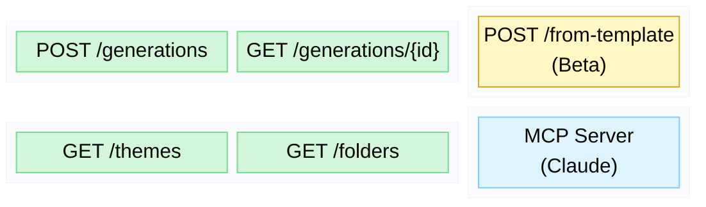
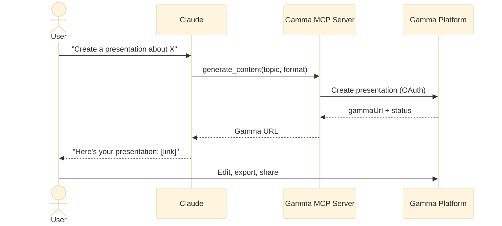

# Gamma Ecosystem Analysis — Alex Integration Surface Area

> **Complete inventory of Gamma's API platform, MCP server, and Claude integration — mapped to Alex's current and potential capabilities**

|                  |                                                                                                                                  |
| ---------------- | -------------------------------------------------------------------------------------------------------------------------------- |
| **Author**       | Fabio Correa                                                                                                                     |
| **Date**         | February 7, 2026                                                                                                                 |
| **Alex Version** | v5.0.1                                                                                                                           |
| **Gamma API**    | v1.0 GA (Generate) + v1.0 Beta (Create from Template)                                                                            |
| **Gamma MCP**    | Hosted MCP Server (Claude Connector)                                                                                             |
| **Related**      | [GAMMA-INTEGRATION-OPPORTUNITIES.md](GAMMA-INTEGRATION-OPPORTUNITIES.md), [GAMMA-ENHANCEMENT-PLAN.md](GAMMA-ENHANCEMENT-PLAN.md) |

---

## Table of Contents

1. [Summary Dashboard](#1-summary-dashboard)
2. [Platform Overview](#2-platform-overview)
3. [API Surface Area](#3-api-surface-area)
4. [MCP Server & Claude Connector](#4-mcp-server--claude-connector)
5. [Alex's Current Integration](#5-alexs-current-integration)
6. [API Gap Analysis](#6-api-gap-analysis)
7. [Claude-Gamma Integration (News)](#7-claude-gamma-integration-news)
8. [Alex Implications](#8-alex-implications)
9. [Platform Constraints & Limits](#9-platform-constraints--limits)
10. [Competitive Landscape](#10-competitive-landscape)

---

## 1. Summary Dashboard

### What Alex Currently Has

| Component                   | Status        | Notes                                      |
| --------------------------- | ------------- | ------------------------------------------ |
| `gamma-presentations` skill | ✅ Active      | 765-line SKILL.md, full API docs           |
| `gamma-generator.js` CLI    | ✅ **v1.0 GA** | Migrated from v0.2 → v1.0 on Feb 7, 2026   |
| Generate from topic         | ✅ Working     | via CLI script                             |
| Generate from file          | ✅ Working     | via CLI script                             |
| Draft workflow (no API)     | ✅ Working     | `--draft` flag generates markdown template |
| Export (PPTX/PDF)           | ✅ Working     | Downloads to `./exports/`                  |
| Auto-open exported file     | ✅ Working     | `--open` flag                              |
| Create from Template        | ❌ Not using   | **NEW** — v1.0 Beta endpoint               |
| MCP Server (Claude)         | ❌ Not using   | Gamma's hosted MCP for AI tools            |
| Theme browsing              | ❌ Not using   | **NEW** — v1.0 List Themes endpoint        |
| Folder management           | ❌ Not using   | **NEW** — v1.0 List Folders endpoint       |
| Sharing options             | ❌ Not using   | **NEW** — workspace/external/email sharing |
| Header/Footer branding      | ❌ Not using   | **NEW** — logo, card numbers, custom text  |
| Additional instructions     | ✅ Active      | `--instructions` CLI arg (v1.0)            |
| Pexels image source         | ✅ Active      | `--image-source pexels` CLI arg            |

### Critical Issue: API Version — RESOLVED ✅

**Migrated February 7, 2026.** Alex's `gamma-generator.js` now uses v1.0 endpoints.

```javascript
// Before (BROKEN/DEPRECATED)
const API_VERSION = 'v0.2';

// After (CURRENT — v1.0 GA)
const API_VERSION = 'v1.0';
```

Also added: `--instructions` (additionalInstructions), `--image-source` (pexels + all sources).

---

## 2. Platform Overview

### Gamma At-a-Glance

| Metric                | Value                                                  |
| --------------------- | ------------------------------------------------------ |
| **Users**             | 50M+                                                   |
| **Content generated** | 250M+ presentations, websites, social posts, documents |
| **API status**        | v1.0 GA (Generate), v1.0 Beta (Create from Template)   |
| **MCP Server**        | Hosted (Claude Connector)                              |
| **Authentication**    | API Key only (OAuth coming soon)                       |
| **Plans with API**    | Pro, Ultra, Teams, Business                            |
| **Credit system**     | 3-4 credits/card + image model credits                 |
| **Rate limit**        | 50 generations/hour                                    |
| **Languages**         | 60+                                                    |

### Content Formats

| Format           | Dimensions                  | Use Case                    |
| ---------------- | --------------------------- | --------------------------- |
| **Presentation** | fluid, 16x9, 4x3            | Slide decks, pitch decks    |
| **Document**     | fluid, pageless, letter, A4 | Reports, memos, long-form   |
| **Social**       | 1x1, 4x5, 9x16              | Instagram, LinkedIn, TikTok |
| **Webpage**      | responsive                  | Landing pages, one-pagers   |

### Integrations Ecosystem

Gamma integrates with:
- **Automation**: Make.com, Zapier (API-based workflows)
- **AI Assistants**: Claude (MCP Connector), and potentially others
- **Embeds**: YouTube, Vimeo, Figma, Miro, Loom, Spotify, Airtable, Power BI
- **Content Sources**: Google Docs/Sheets/Slides, Microsoft Word/Excel/PowerPoint, Unsplash, Pexels, GIPHY
- **Social**: Instagram, TikTok, X (Twitter)

### API Surface Map



**Figure 1:** *Gamma API v1.0 surface map — GA endpoints (green), Beta (gold), MCP (blue)*

---

## 3. API Surface Area

### Endpoints

| Endpoint                          | Method | Version | Status   | Alex Uses        |
| --------------------------------- | ------ | ------- | -------- | ---------------- |
| `/v1.0/generations`               | POST   | v1.0    | **GA**   | ✅ Migrated Feb 7 |
| `/v1.0/generations/{id}`          | GET    | v1.0    | **GA**   | ✅ Migrated Feb 7 |
| `/v1.0/generations/from-template` | POST   | v1.0    | **Beta** | ❌                |
| `/v1.0/themes`                    | GET    | v1.0    | **GA**   | ❌                |
| `/v1.0/folders`                   | GET    | v1.0    | **GA**   | ❌                |

### Generate API (v1.0 GA) — Full Parameter Map

#### Required Parameters

| Parameter   | Type   | Description                                          | Alex Uses |
| ----------- | ------ | ---------------------------------------------------- | --------- |
| `inputText` | string | Content + image URLs (max 100K tokens / ~400K chars) | ✅         |
| `textMode`  | enum   | `generate` / `condense` / `preserve`                 | ✅         |

#### Optional Parameters

| Parameter                        | Type    | Default           | Description                                             | Alex Uses   |
| -------------------------------- | ------- | ----------------- | ------------------------------------------------------- | ----------- |
| `format`                         | enum    | `presentation`    | `presentation` / `document` / `social` / `webpage`      | ✅           |
| `themeId`                        | string  | workspace default | Theme from Gamma library                                | ❌ **NEW**   |
| `numCards`                       | integer | 10                | 1-60 (Pro) / 1-75 (Ultra)                               | ✅           |
| `cardSplit`                      | enum    | `auto`            | `auto` / `inputTextBreaks`                              | ✅           |
| `additionalInstructions`         | string  | —                 | Extra guidance, 1-2000 chars                            | ✅ **ADDED** |
| `folderIds`                      | array   | —                 | Save to specific workspace folders                      | ❌ **NEW**   |
| `exportAs`                       | enum    | —                 | `pdf` / `pptx`                                          | ✅           |
| `textOptions.amount`             | enum    | `medium`          | `brief` / `medium` / `detailed` / `extensive`           | ✅           |
| `textOptions.tone`               | string  | —                 | Free text, 1-500 chars                                  | ✅           |
| `textOptions.audience`           | string  | —                 | Free text, 1-500 chars                                  | ✅           |
| `textOptions.language`           | string  | `en`              | 60+ language codes                                      | ✅           |
| `imageOptions.source`            | enum    | `aiGenerated`     | 10 sources (see below)                                  | ✅ (partial) |
| `imageOptions.model`             | string  | auto              | AI image model                                          | ✅           |
| `imageOptions.style`             | string  | —                 | Free text, 1-500 chars                                  | ✅           |
| `cardOptions.dimensions`         | string  | varies            | Aspect ratio                                            | ✅           |
| `cardOptions.headerFooter`       | object  | —                 | Logo, card numbers, custom text                         | ❌ **NEW**   |
| `sharingOptions.workspaceAccess` | enum    | workspace default | `noAccess` / `view` / `comment` / `edit` / `fullAccess` | ❌ **NEW**   |
| `sharingOptions.externalAccess`  | enum    | workspace default | `noAccess` / `view` / `comment` / `edit`                | ❌ **NEW**   |
| `sharingOptions.emailOptions`    | object  | —                 | Share via email recipients                              | ❌ **NEW**   |

#### Image Sources (v1.0)

| Source                     | Description                  | Alex Uses       |
| -------------------------- | ---------------------------- | --------------- |
| `aiGenerated`              | AI-generated (model + style) | ✅               |
| `pictographic`             | Pictographic library         | ❌               |
| `pexels`                   | Pexels stock photos          | ✅ **ADDED**     |
| `unsplash`                 | Unsplash photos              | ✅ (in SKILL.md) |
| `giphy`                    | Animated GIFs                | ✅ (in SKILL.md) |
| `webAllImages`             | Web images (any license)     | ✅ (in SKILL.md) |
| `webFreeToUse`             | Personal use licensed        | ✅ (in SKILL.md) |
| `webFreeToUseCommercially` | Commercial use licensed      | ✅ (in SKILL.md) |
| `placeholder`              | Empty placeholders           | ✅ (in SKILL.md) |
| `noImages`                 | No images                    | ✅ (in SKILL.md) |

### Create from Template API (v1.0 Beta)

A completely new endpoint that Alex doesn't use at all:

| Parameter        | Type              | Description                             |
| ---------------- | ----------------- | --------------------------------------- |
| `gammaId`        | string (required) | ID of existing Gamma to use as template |
| `prompt`         | string (required) | Instructions + content for adaptation   |
| `themeId`        | string (optional) | Override template's theme               |
| `folderIds`      | array (optional)  | Save to folders                         |
| `exportAs`       | enum (optional)   | `pdf` / `pptx`                          |
| `imageOptions`   | object (optional) | Override AI image settings              |
| `sharingOptions` | object (optional) | Access control                          |

**Key insight**: This enables Alex to maintain branded templates. Create a "Fabio Correa presentation" template once in Gamma, then use the API to generate variations with different content but consistent branding.

### List Themes & Folders APIs (v1.0 GA)

Both support pagination (cursor-based, max 50/page) and search:

```
GET /v1.0/themes?query=dark&limit=50
GET /v1.0/folders?query=Marketing&limit=50&after=cursor123
```

Theme objects include `colorKeywords` and `toneKeywords` — useful for Alex to match user preferences to themes automatically.

---

## 4. MCP Server & Claude Connector

### What Is Gamma MCP?

Gamma provides a **hosted MCP server** that enables AI tools (like Claude) to create content on behalf of users. This is the mechanism behind the Claude-Gamma integration.

### MCP Tools

| Tool               | Description                                        | Equivalent API             |
| ------------------ | -------------------------------------------------- | -------------------------- |
| `generate_content` | Create presentations, docs, webpages, social posts | `POST /v1.0/generations`   |
| `browse_themes`    | Search theme library by name/keywords              | `GET /v1.0/themes`         |
| `organize_folders` | Save content to workspace folders                  | Uses `folderIds` parameter |

### How Claude Uses It



**Figure 2:** *Claude MCP connector sequence — OAuth-based presentation generation flow*

### Key Differences: MCP vs REST API

| Aspect            | MCP (Claude Connector)         | REST API (Alex's approach) |
| ----------------- | ------------------------------ | -------------------------- |
| **Auth**          | OAuth via Gamma account        | API Key                    |
| **Integration**   | Built-in Claude connector      | Custom script              |
| **Features**      | Generate + themes + folders    | Full API surface           |
| **Control**       | Claude decides parameters      | Alex controls everything   |
| **Templates**     | Not available via MCP          | Available via API          |
| **Customization** | Limited to what Claude exposes | Full parameter control     |

### What This Means for Alex

The Claude-Gamma MCP integration is a **consumer-grade connector** — it lets Claude users generate presentations easily. Alex's integration is **developer-grade** — full API control with custom parameters, templates, branding, and workflow automation.

Alex's approach is more powerful but needs updating to v1.0.

---

## 5. Alex's Current Integration

### Architecture

```mermaid
%%{init: {'theme': 'base', 'themeVariables': { 'edgeLabelBackground':'#ffffff', 'lineColor': '#57606a' }}}%%
flowchart LR
    User(["🧑 User"]) --> Alex["🧠 Alex\n(VS Code)"]
    Alex --> Script["📜 gamma-generator.js"]
    Script -->|"✅ v1.0 GA"| API["🌐 Gamma REST API"]
    API --> Platform["🎨 Gamma Platform"]
    Platform --> Export["📄 PPTX / PDF"]
    Platform --> URL["🔗 Gamma URL"]
    Export --> Local["💾 ./exports/"]
    URL --> Browser["🌍 Browser"]

    style User fill:#eaeef2,color:#24292f,stroke:#afb8c1
    style Alex fill:#ddf4ff,color:#0550ae,stroke:#80ccff
    style Script fill:#d3f5db,color:#1a7f37,stroke:#6fdd8b
    style API fill:#d3f5db,color:#1a7f37,stroke:#6fdd8b
    style Platform fill:#fff8c5,color:#9a6700,stroke:#d4a72c
    style Export fill:#fff1e5,color:#953800,stroke:#ffb77c
    style URL fill:#fff1e5,color:#953800,stroke:#ffb77c
    style Local fill:#eaeef2,color:#24292f,stroke:#afb8c1
    style Browser fill:#eaeef2,color:#24292f,stroke:#afb8c1
    linkStyle default stroke:#57606a,stroke-width:1.5px
```



**Figure 3:** *Current Alex-Gamma architecture — v1.0 REST API integration*

### Target Architecture (after Phase 2 — templates, sharing, chat)

```mermaid
%%{init: {'theme': 'base', 'themeVariables': { 'edgeLabelBackground':'#ffffff', 'lineColor': '#57606a' }}}%%
flowchart LR
    User(["🧑 User"]) --> Alex["🧠 Alex\n(VS Code)"]
    Alex --> Script["📜 gamma-generator.js"]
    Script -->|"✅ v1.0 GA"| API["🌐 Gamma REST API v1.0"]
    API --> Platform["🎨 Gamma Platform"]
    Platform --> Export["📄 PPTX / PDF"]
    Platform --> URL["🔗 Gamma URL"]
    Platform --> Share["📧 Auto-Share"]
    Export --> Local["💾 ./exports/"]
    URL --> Browser["🌍 Browser"]

    style User fill:#eaeef2,color:#24292f,stroke:#afb8c1
    style Alex fill:#ddf4ff,color:#0550ae,stroke:#80ccff
    style Script fill:#d3f5db,color:#1a7f37,stroke:#6fdd8b
    style API fill:#d3f5db,color:#1a7f37,stroke:#6fdd8b
    style Platform fill:#fff8c5,color:#9a6700,stroke:#d4a72c
    style Export fill:#fff1e5,color:#953800,stroke:#ffb77c
    style URL fill:#fff1e5,color:#953800,stroke:#ffb77c
    style Share fill:#d8b9ff,color:#6639ba,stroke:#bf8aff
    style Local fill:#eaeef2,color:#24292f,stroke:#afb8c1
    style Browser fill:#eaeef2,color:#24292f,stroke:#afb8c1
    linkStyle default stroke:#57606a,stroke-width:1.5px
```



**Figure 4:** *Target architecture — adds auto-sharing via Gamma Platform*

### What Alex Does Well

1. **Content-first workflow**: Alex writes the actual slide content (not just a topic), then sends to Gamma
2. **Draft mode**: `--draft` generates editable markdown without API calls — zero credit cost for iteration
3. **File-based input**: Can transform any workspace file into a presentation
4. **Multi-format**: Presentations, documents, social posts, webpages
5. **Image model selection**: 20+ image models with cost tiers documented
6. **Auto-open**: Generated files open immediately in the user's default app
7. **Cost awareness**: Reports credits used/remaining after each generation

### What Alex Is Missing (vs v1.0 API)

| Feature                  | Impact                           | Gap                           |
| ------------------------ | -------------------------------- | ----------------------------- |
| **v1.0 endpoint**        | ✅ **RESOLVED** — migrated Feb 7  | Script uses v1.0 GA endpoints |
| `additionalInstructions` | ✅ **RESOLVED** — added Feb 7     | `--instructions` CLI arg      |
| `themeId`                | 🟡 Medium — branded output        | Not available in v0.2         |
| `headerFooter`           | 🟡 Medium — professional branding | Not available in v0.2         |
| `sharingOptions`         | 🟡 Medium — direct sharing        | Not available in v0.2         |
| `folderIds`              | 🟢 Low — organization             | Not available in v0.2         |
| Create from Template     | 🔴 High — brand consistency       | New endpoint entirely         |
| List Themes              | 🟡 Medium — theme discovery       | New endpoint entirely         |
| List Folders             | 🟢 Low — folder discovery         | New endpoint entirely         |
| `pexels` source          | 🟢 Low — additional image source  | New in v1.0                   |
| Image URL input          | 🟡 Medium — user's own images     | New in v1.0                   |

---

## 6. API Gap Analysis

### Critical Gaps

| #      | Gap                                                       | Impact                                | Effort  | Priority |
| ------ | --------------------------------------------------------- | ------------------------------------- | ------- | -------- |
| **G1** | v0.2 → v1.0 migration                                     | ✅ **RESOLVED**                        | Low     | ~~P0~~   |
| **G2** | No template support                                       | 🔴 High — brand consistency            | Medium  | P1       |
| **G3** | No theme browsing                                         | 🟡 Medium — blind theme selection      | Low     | P2       |
| **G4** | No `additionalInstructions`                               | ✅ **RESOLVED**                        | Trivial | ~~P1~~   |
| **G5** | No `headerFooter` branding                                | 🟡 Medium — missing logos/page numbers | Low     | P2       |
| **G6** | No `sharingOptions`                                       | 🟡 Medium — manual sharing             | Low     | P3       |
| **G7** | No folder organization                                    | 🟢 Low — manual organization           | Low     | P3       |
| **G8** | SKILL.md lists `unsplash` but v1.0 replaced with `pexels` | 🟢 Low — docs inaccurate               | Trivial | P2       |

### Strategic Gaps

| #       | Gap                            | Impact                                   | Effort | Blocked?                    |
| ------- | ------------------------------ | ---------------------------------------- | ------ | --------------------------- |
| **G9**  | No MCP server consumption      | Alex can't delegate to Gamma MCP in M365 | Medium | No                          |
| **G10** | No Gamma skill in M365 agent   | M365 Alex can't generate presentations   | High   | Depends on M365 API plugins |
| **G11** | No Make.com/Zapier integration | Workflow automation limited to CLI       | Low    | No                          |
| **G12** | No VS Code command integration | Gamma only available via CLI, not chat   | High   | No                          |

---

## 7. Claude-Gamma Integration (News)

### What It Is

Claude (Anthropic's AI) now has a **native Gamma connector** accessible through Claude's Settings → Connectors interface. When enabled:

- Users can ask Claude to create Gamma presentations within conversation
- Claude calls Gamma's hosted MCP server
- The output appears in the user's Gamma workspace
- Users can further edit in Gamma or export

### Setup

1. Open Claude (web or desktop)
2. Settings → Connectors
3. Search "Gamma" → Connect
4. Authorize Gamma account access

### What This Means for the AI Landscape

The Claude-Gamma integration signals a broader trend: **AI assistants natively consuming productivity tool APIs via MCP**. This is the same pattern emerging in:

- Claude + Gamma (presentations)
- Claude + various MCP servers (code, data, web)
- M365 Copilot + API plugins (MCP support)
- VS Code Copilot + MCP tools

### AI + Content Generation Landscape

```mermaid
%%{init: {'theme': 'base', 'themeVariables': { 'edgeLabelBackground':'#ffffff', 'lineColor': '#57606a' }}}%%
flowchart LR
    subgraph AI["AI Assistants"]
        direction TB
        Claude["Claude"]
        Alex["Alex"]
        M365["M365 Copilot"]
    end

    subgraph Protocol["Integration Layer"]
        direction TB
        MCP["MCP Server"]
        REST["REST API v1.0"]
        Graph["Graph API"]
    end

    subgraph Content["Content Platforms"]
        direction TB
        Gamma["🎨 Gamma"]
        Marp["📊 Marp"]
        PPT["📊 PowerPoint"]
    end

    Claude -->|"MCP Connector"| MCP
    MCP --> Gamma
    Alex -->|"Direct API"| REST
    REST --> Gamma
    Alex -->|"Local"| Marp
    M365 -->|"Native"| Graph
    Graph --> PPT
    M365 -.->|"Future: Plugin"| REST

    style Alex fill:#ddf4ff,color:#0550ae,stroke:#80ccff
    style Claude fill:#d8b9ff,color:#6639ba,stroke:#bf8aff
    style M365 fill:#ddf4ff,color:#0550ae,stroke:#80ccff
    style Gamma fill:#fff8c5,color:#9a6700,stroke:#d4a72c
    style Marp fill:#eaeef2,color:#24292f,stroke:#afb8c1
    style PPT fill:#eaeef2,color:#24292f,stroke:#afb8c1
    style MCP fill:#d3f5db,color:#1a7f37,stroke:#6fdd8b
    style REST fill:#d3f5db,color:#1a7f37,stroke:#6fdd8b
    style Graph fill:#eaeef2,color:#24292f,stroke:#afb8c1
    style AI fill:#ddf4ff22,stroke:#80ccff
    style Protocol fill:#d3f5db22,stroke:#6fdd8b
    style Content fill:#fff8c522,stroke:#d4a72c
    linkStyle default stroke:#57606a,stroke-width:1.5px
```



**Figure 5:** *AI + Content Generation landscape — integration layer comparison across assistants*

### Relevance to Alex

Alex is already ahead of this curve — Alex has had Gamma integration since v4.1.0 (December 2025). But Claude's native connector means:

1. **Validation**: The Alex-Gamma integration pattern is correct — AI + content generation is a major use case
2. **Competition**: Claude can now do basic Gamma generation out of the box, but Alex offers more control (templates, branding, draft workflow, cost-aware model selection)
3. **M365 opportunity**: Gamma's MCP server could be consumed by M365 Copilot Alex via API plugins, giving M365 Alex presentation capabilities
4. **Interop**: Claude users who also use Alex can share Gamma templates between both tools

---

## 8. Alex Implications

### Immediate (v5.0.2)

1. ~~Fix v0.2 → v1.0 migration~~ ✅ **Done Feb 7, 2026**
2. ~~Add new v1.0 parameters~~ ✅ `additionalInstructions` + `imageSource` added

### Short-term (v5.1.0)

3. **Create from Template integration** — Enable branded template workflow
4. **Theme browser** — List and search themes from Alex
5. **VS Code command integration** — `/gamma` command or chat-based generation
6. **Update SKILL.md** — Reflect v1.0 API, remove v0.2 references, add new features

### Medium-term (v5.2.0+)

7. **M365 Gamma plugin** — Consume Gamma's MCP server from M365 Copilot Agent
8. **Template library** — Curated Alex templates (academic poster, pitch deck, project update)
9. **Workflow automation** — Make.com/Zapier integration for scheduled reports

---

## 9. Platform Constraints & Limits

| Constraint                    | Limit                                             | Alex Impact                 |
| ----------------------------- | ------------------------------------------------- | --------------------------- |
| API rate limit                | 50 generations/hour                               | Sufficient for personal use |
| Input text                    | 100K tokens (~400K chars)                         | Sufficient for most files   |
| `numCards`                    | 1-60 (Pro) / 1-75 (Ultra)                         | Sufficient                  |
| `additionalInstructions`      | 1-2000 chars                                      | New budget for AI guidance  |
| `tone` / `audience` / `style` | 1-500 chars each                                  | Sufficient                  |
| Auth                          | API Key only (OAuth coming)                       | Simple but less secure      |
| `headerFooter` positions      | 6 (topLeft/Right/Center, bottomLeft/Right/Center) | Plenty                      |
| Export formats                | PPTX, PDF                                         | No JPEG/PNG export          |
| Image models                  | 20+ models across 4 tiers                         | Well-documented in SKILL.md |
| Folder limit                  | Unlimited (paginated)                             | No issue                    |
| Theme limit                   | Unlimited (standard + custom, paginated)          | No issue                    |
| Plan requirement              | Pro+ for API access                               | User must have Gamma Pro+   |

---

## 10. Competitive Landscape

### AI Presentation Tools

| Tool              | API         | MCP                | VS Code     | M365                    | Alex Integration |
| ----------------- | ----------- | ------------------ | ----------- | ----------------------- | ---------------- |
| **Gamma**         | ✅ v1.0 GA   | ✅ Claude Connector | Via script  | Possible via API plugin | ✅ Skill + CLI    |
| **Beautiful.ai**  | Limited     | ❌                  | ❌           | ❌                       | ❌                |
| **Tome**          | ❌           | ❌                  | ❌           | ❌                       | ❌                |
| **Canva**         | Limited     | ❌                  | ❌           | Limited                 | ❌                |
| **Google Slides** | ✅ REST      | ❌                  | ❌           | ❌                       | ❌                |
| **PowerPoint**    | ✅ Graph API | ❌                  | ✅ Marp      | ✅ Native                | ✅ Marp export    |
| **Marp**          | N/A (local) | ❌                  | ✅ Extension | ❌                       | ✅ Via VS Code    |

**Alex's unique position**: The only AI agent with both Gamma API integration AND Marp local generation. Users can choose between cloud-generated (Gamma) and local (Marp) presentations.

---

## References

- [Gamma Developer Docs](https://developers.gamma.app/) — API overview and guides
- [Generate API Parameters](https://developers.gamma.app/docs/generate-api-parameters-explained) — Full parameter reference
- [Create from Template](https://developers.gamma.app/docs/create-from-template-parameters-explained) — Template API (Beta)
- [List Themes & Folders](https://developers.gamma.app/docs/list-themes-and-list-folders-apis-explained) — Discovery APIs
- [Gamma MCP Server](https://developers.gamma.app/docs/gamma-mcp-server) — Claude Connector docs
- [API Changelog](https://developers.gamma.app/changelog) — Version history
- [Access & Pricing](https://developers.gamma.app/docs/get-access) — Credit system

---

*Analysis performed February 7, 2026 — Alex Cognitive Architecture v5.0.1*
