# Gamma Enhancement Plan — Phased Roadmap

> **3-phase plan to bring Alex's Gamma integration from broken (v0.2) to best-in-class (v1.0+)**

|                  |                                                                                                                                      |
| ---------------- | ------------------------------------------------------------------------------------------------------------------------------------ |
| **Author**       | Fabio Correa                                                                                                                         |
| **Date**         | February 7, 2026                                                                                                                     |
| **Alex Version** | v5.0.1                                                                                                                               |
| **Related**      | [GAMMA-ECOSYSTEM-ANALYSIS.md](GAMMA-ECOSYSTEM-ANALYSIS.md), [GAMMA-INTEGRATION-OPPORTUNITIES.md](GAMMA-INTEGRATION-OPPORTUNITIES.md) |

## Phase Timeline

```mermaid
%%{init: {'theme': 'base', 'themeVariables': { 'edgeLabelBackground':'#ffffff', 'lineColor': '#57606a' }}}%%
gantt
    title Gamma Enhancement Phases
    dateFormat YYYY-MM-DD
    axisFormat %b '%y

    section Phase 1 — Restore (v5.0.2)
        1.1 v0.2→v1.0 migration         :done, crit, p1a, 2026-02-07, 1d
        1.2 additionalInstructions       :done, p1b, after p1a, 1d
        1.3 pexels image source          :done, p1c, after p1a, 1d
        1.4 SKILL.md v1.0 update         :p1d, after p1b, 2d
        1.5 synapses.json update         :p1e, after p1d, 1d
        1.6 E2E testing                  :p1f, after p1e, 1d

    section Phase 2 — Expand (v5.1.0)
        2.1 Create from Template         :p2a, 2026-02-14, 4d
        2.2 Theme browsing               :p2b, 2026-02-14, 2d
        2.3 Folder management            :p2c, after p2b, 1d
        2.4 Header/Footer branding       :p2d, after p2b, 2d
        2.5 Sharing options              :p2e, after p2d, 2d
        2.6 VS Code chat command         :p2f, after p2a, 8d
        2.7 Docs update                  :p2g, after p2f, 2d

    section Phase 3 — Cross-Platform (v5.2.0+)
        3.1 M365 bridge                  :p3a, 2026-03-15, 16d
        3.2 Template library             :p3b, after p3a, 5d
        3.3 Automation docs              :p3c, after p3b, 2d
        3.4 MCP evaluation               :p3d, after p3b, 3d
```



**Figure 1:** *3-phase Gantt timeline — Restore (v5.0.2), Expand (v5.1.0), Cross-Platform (v5.2.0+)*

---

## Current State

Alex has Gamma integration since v4.1.0 (December 2025), but it targets the **deprecated v0.2 API**:

| Component                   | Version  | Status                                          |
| --------------------------- | -------- | ----------------------------------------------- |
| `gamma-presentations` skill | v5.0.1   | ✅ Active — content accurate but references v0.2 |
| `gamma-generator.js` CLI    | v0.2 API | ⚠️ **BROKEN** — v0.2 deprecated Jan 16, 2026     |
| VS Code chat command        | —        | ❌ Does not exist                                |
| M365 API plugin             | —        | ❌ Does not exist                                |

---

## Phase 1: Restore & Modernize (v5.0.2 — URGENT)

> **Goal**: Get Gamma working again on v1.0 API + add low-effort new features

### Checklist

- [x] 1.1 Migrate `gamma-generator.js` from v0.2 to v1.0 ← **O1** ✅ Done Feb 7
  - ~~Change `API_VERSION = 'v0.2'` → `'v1.0'`~~
  - ~~Update endpoint: `/v0.2/generate` → `/v1.0/generations`~~
  - ~~Update status polling: `/v0.2/generate/{id}` → `/v1.0/generations/{id}`~~
  - ~~Map request body to v1.0 schema~~
  - ~~Map response body from v1.0 schema~~
  - Test: generate + poll + export + auto-open
- [x] 1.2 Add `--instructions "..."` CLI argument ← **O2** ✅ Done Feb 7
  - ~~Maps to `additionalInstructions` (1-2000 chars)~~
- [x] 1.3 Add `pexels` to image source options ✅ Done Feb 7
  - ~~Added `--image-source` CLI argument~~
  - Update SKILL.md image source table
- [ ] 1.4 Update SKILL.md for v1.0
  - Replace v0.2 endpoint references
  - Add new parameters (additionalInstructions, headerFooter, sharingOptions, folderIds)
  - Update curl examples to v1.0
  - Add Create from Template section
  - Add Themes/Folders API section
  - Update API changelog section
- [ ] 1.5 Update `synapses.json`
  - Add connections for new v1.0 features
  - Add connection to Claude-Gamma MCP (cross-platform link)
- [ ] 1.6 Test end-to-end
  - `node scripts/gamma-generator.js --topic "Test" --format presentation`
  - `node scripts/gamma-generator.js --file README.md --export pptx`
  - `node scripts/gamma-generator.js --draft --topic "Test"`

### Estimated Effort

| Task                       | Hours         |
| -------------------------- | ------------- |
| 1.1 API migration          | 2-3           |
| 1.2 additionalInstructions | 0.5           |
| 1.3 pexels source          | 0.5           |
| 1.4 SKILL.md update        | 2-3           |
| 1.5 Synapses               | 0.5           |
| 1.6 E2E testing            | 1-2           |
| **Total**                  | **6-9 hours** |

---

## Phase 2: Feature Expansion (v5.1.0)

> **Goal**: Add template support, theme browser, sharing, branding, and VS Code command

### Checklist

- [ ] 2.1 Create from Template support ← **O3**
  - New `--template <gammaId>` CLI argument
  - `POST /v1.0/generations/from-template` implementation
  - Combine with `--file` for template + content workflow
  - Add `--theme <themeId>` override for templates
- [ ] 2.2 Theme browsing ← **O4**
  - New `gamma themes` CLI subcommand
  - `GET /v1.0/themes?query=...` implementation
  - Display: name, id, colorKeywords, toneKeywords
  - `--theme <themeId>` for generation commands
  - Cache mechanism for offline reference
- [ ] 2.3 Folder management ← **O7**
  - New `gamma folders` CLI subcommand
  - `GET /v1.0/folders?query=...` implementation
  - `--folder <folderId>` for generation commands
- [ ] 2.4 Header/Footer branding ← **O5**
  - `--header-footer <JSON>` CLI argument
  - Preset: `--branding standard` (logo topRight, page# bottomCenter)
  - `--logo <url>` shorthand
  - Support all 6 positions (topLeft/Right/Center, bottomLeft/Right/Center)
  - Support types: text, image, cardNumber, themeLogo
- [ ] 2.5 Sharing options ← **O6**
  - `--share user@email.com` CLI argument
  - `--workspace-access view|comment|edit|fullAccess` argument
  - `--external-access view|comment|edit` argument
- [ ] 2.6 VS Code chat command ← **O8**
  - Register `@alex /gamma` chat participant command
  - Gamma API key in VS Code Secret Storage
  - GammaClient as extension module (port from CLI script)
  - Support: topic, file-based, template generation
  - Return: Gamma URL, download link, credits used
  - Auto-download exports to workspace `./exports/`
- [ ] 2.7 Update SKILL.md with all Phase 2 features
  - Template workflow examples
  - Theme browser documentation
  - Sharing examples
  - Branding presets
  - VS Code command reference

### Estimated Effort

| Task                | Hours           |
| ------------------- | --------------- |
| 2.1 Templates       | 4-6             |
| 2.2 Themes          | 2-4             |
| 2.3 Folders         | 1-2             |
| 2.4 Headers         | 2-3             |
| 2.5 Sharing         | 2-3             |
| 2.6 VS Code command | 8-12            |
| 2.7 Docs update     | 2-3             |
| **Total**           | **21-33 hours** |

### Dependencies

```mermaid
%%{init: {'theme': 'base', 'themeVariables': { 'edgeLabelBackground':'#ffffff', 'lineColor': '#57606a' }}}%%
flowchart LR
    subgraph Phase1["Phase 1: Restore (v5.0.2)"]
        direction TB
        P1A["✅ 1.1 v1.0 Migration"]
        P1B["✅ 1.2 Instructions"]
        P1C["✅ 1.3 Pexels"]
        P1D["1.4 SKILL.md"]
        P1E["1.5 Synapses"]
        P1F["1.6 E2E Test"]
        P1A --> P1B & P1C
        P1B & P1C --> P1D --> P1E --> P1F
    end

    subgraph Phase2["Phase 2: Expand (v5.1.0)"]
        direction TB
        P2A["2.1 Templates"]
        P2B["2.2 Themes"]
        P2C["2.3 Folders"]
        P2D["2.4 Headers"]
        P2E["2.5 Sharing"]
        P2F["2.6 Chat Cmd"]
    end

    subgraph Phase3["Phase 3: Cross-Platform (v5.2.0+)"]
        direction TB
        P3A["3.1 M365 Bridge"]
        P3B["3.2 Template Lib"]
    end

    P1F --> Phase2
    P2A --> P3B
    P2F --> P3A

    style P1A fill:#d3f5db,color:#1a7f37,stroke:#6fdd8b,stroke-width:3px
    style P1B fill:#d3f5db,color:#1a7f37,stroke:#6fdd8b
    style P1C fill:#d3f5db,color:#1a7f37,stroke:#6fdd8b
    style P1D fill:#fff8c5,color:#9a6700,stroke:#d4a72c
    style P1E fill:#fff8c5,color:#9a6700,stroke:#d4a72c
    style P1F fill:#fff8c5,color:#9a6700,stroke:#d4a72c
    style P2A fill:#ddf4ff,color:#0550ae,stroke:#80ccff
    style P2B fill:#ddf4ff,color:#0550ae,stroke:#80ccff
    style P2C fill:#ddf4ff,color:#0550ae,stroke:#80ccff
    style P2D fill:#ddf4ff,color:#0550ae,stroke:#80ccff
    style P2E fill:#ddf4ff,color:#0550ae,stroke:#80ccff
    style P2F fill:#ddf4ff,color:#0550ae,stroke:#80ccff
    style P3A fill:#d8b9ff,color:#6639ba,stroke:#bf8aff
    style P3B fill:#d8b9ff,color:#6639ba,stroke:#bf8aff
    style Phase1 fill:#d3f5db33,stroke:#6fdd8b
    style Phase2 fill:#ddf4ff33,stroke:#80ccff
    style Phase3 fill:#d8b9ff33,stroke:#bf8aff
    linkStyle default stroke:#57606a,stroke-width:1.5px
```



**Figure 2:** *Phase dependency flowchart — task-level dependencies across 3 phases*

---

## Phase 3: Cross-Platform & Library (v5.2.0+)

> **Goal**: Gamma available from M365, curated templates, automation flows

### Checklist

- [ ] 3.1 M365 Copilot → Gamma bridge ← **O9**
  - OpenAPI spec for Gamma Generate API
  - Register as M365 API plugin
  - Auth: API key in M365 key vault or environment
  - Adaptive card response with Gamma URL + preview
  - "Create presentation from this meeting" workflow
- [ ] 3.2 Curated template library ← **O10**
  - Create 5-10 Gamma templates for common use cases:
    - `research-update` — Weekly research progress
    - `project-pitch` — Elevator pitch / proposal
    - `standup-report` — Sprint/standup visual summary
    - `course-lecture` — Academic teaching material
    - `academic-poster` — Conference poster style
  - Document gammaIds in SKILL.md
  - `--preset <name>` CLI shorthand
  - Community contributions via global knowledge
- [ ] 3.3 Make.com / Zapier integration docs
  - Document how to connect Alex → Make.com → Gamma
  - Example: Weekly auto-generated project status decks
  - Example: Meeting transcript → presentation pipeline
- [ ] 3.4 Gamma MCP consumption (exploratory)
  - Evaluate: should Alex consume Gamma's MCP server directly?
  - Compare: MCP (OAuth, 3 tools) vs REST API (API key, full control)
  - If MCP offers OAuth: consider switching auth layer
  - If MCP limits features: stay on REST API

### Estimated Effort

| Task                 | Hours           |
| -------------------- | --------------- |
| 3.1 M365 bridge      | 16-24           |
| 3.2 Template library | 4-8 (+ ongoing) |
| 3.3 Automation docs  | 2-3             |
| 3.4 MCP evaluation   | 2-4             |
| **Total**            | **24-39 hours** |

---

## Roadmap Summary

| Phase       | Version | Timeline            | Focus                              | Hours     |
| ----------- | ------- | ------------------- | ---------------------------------- | --------- |
| **Phase 1** | v5.0.2  | ⚡ ASAP — API broken | Restore v1.0 + quick wins          | 6-9       |
| **Phase 2** | v5.1.0  | Next release        | Templates, themes, VS Code command | 21-33     |
| **Phase 3** | v5.2.0+ | Future              | M365 bridge, template library      | 24-39     |
| **Total**   | —       | —                   | —                                  | **51-81** |

---

## Risk Register


**Figure 3:** *Risk assessment quadrant — likelihood vs impact for 6 identified risks*

| Risk                                   | Likelihood              | Impact         | Mitigation                       |
| -------------------------------------- | ----------------------- | -------------- | -------------------------------- |
| v0.2 endpoints return errors           | ~~🔴 High (deprecated)~~ | ~~🔴 CRITICAL~~ | ~~Phase 1 is P0~~ ✅ **RESOLVED** |
| Create from Template API breaks (beta) | 🟡 Medium                | 🟡 Medium       | Feature-flag template support    |
| Gamma changes auth model (OAuth)       | 🟡 Medium                | 🟡 Medium       | Abstraction layer in GammaClient |
| API credit costs surprise users        | 🟢 Low                   | 🟡 Medium       | Cost reporting already in script |
| Rate limit hit (50/hour)               | 🟢 Low                   | 🟢 Low          | Queue + back-off (rarely needed) |
| Gamma deprecates v1.0                  | 🟢 Low (just launched)   | 🔴 High         | Stay current with changelog RSS  |

---

## Next Steps

1. ~~Approve this plan~~ → User reviews
2. ~~Add Phase 1 items to ROADMAP-UNIFIED.md as v5.0.2 Gamma items~~
3. ~~Execute Phase 1 (v0.2 → v1.0 migration)~~ ✅ **Done Feb 7, 2026**
4. Test with live Gamma API key
5. Merge Phase 2 items into v5.1.0 roadmap planning

---

## v1.0 API Quick Reference (for implementation)

### Generate

```http
POST https://public-api.gamma.app/v1.0/generations
X-API-KEY: <key>
Content-Type: application/json

{
  "inputText": "Content here...",
  "textMode": "generate",
  "format": "presentation",
  "numCards": 10,
  "additionalInstructions": "Make it professional and concise",
  "themeId": "theme_abc123",
  "folderIds": ["folder_xyz"],
  "exportAs": "pptx",
  "textOptions": {
    "amount": "medium",
    "tone": "professional",
    "audience": "executive leadership",
    "language": "en"
  },
  "imageOptions": {
    "source": "aiGenerated",
    "model": "auto",
    "style": "modern minimalist"
  },
  "cardOptions": {
    "dimensions": "16x9",
    "headerFooter": {
      "topRight": { "type": "image", "value": "https://example.com/logo.png" },
      "bottomCenter": { "type": "cardNumber" }
    }
  },
  "sharingOptions": {
    "workspaceAccess": "view",
    "externalAccess": "view"
  }
}
```

### Check Status

```http
GET https://public-api.gamma.app/v1.0/generations/{id}
X-API-KEY: <key>
```

### Create from Template

```http
POST https://public-api.gamma.app/v1.0/generations/from-template
X-API-KEY: <key>
Content-Type: application/json

{
  "gammaId": "existing_gamma_id",
  "prompt": "Adapt this for Q1 2026 results..."
}
```

### List Themes

```http
GET https://public-api.gamma.app/v1.0/themes?query=dark&limit=50
X-API-KEY: <key>
```

### List Folders

```http
GET https://public-api.gamma.app/v1.0/folders?query=Research&limit=50
X-API-KEY: <key>
```

---

*Enhancement plan created February 7, 2026 — Alex Cognitive Architecture v5.0.1*
