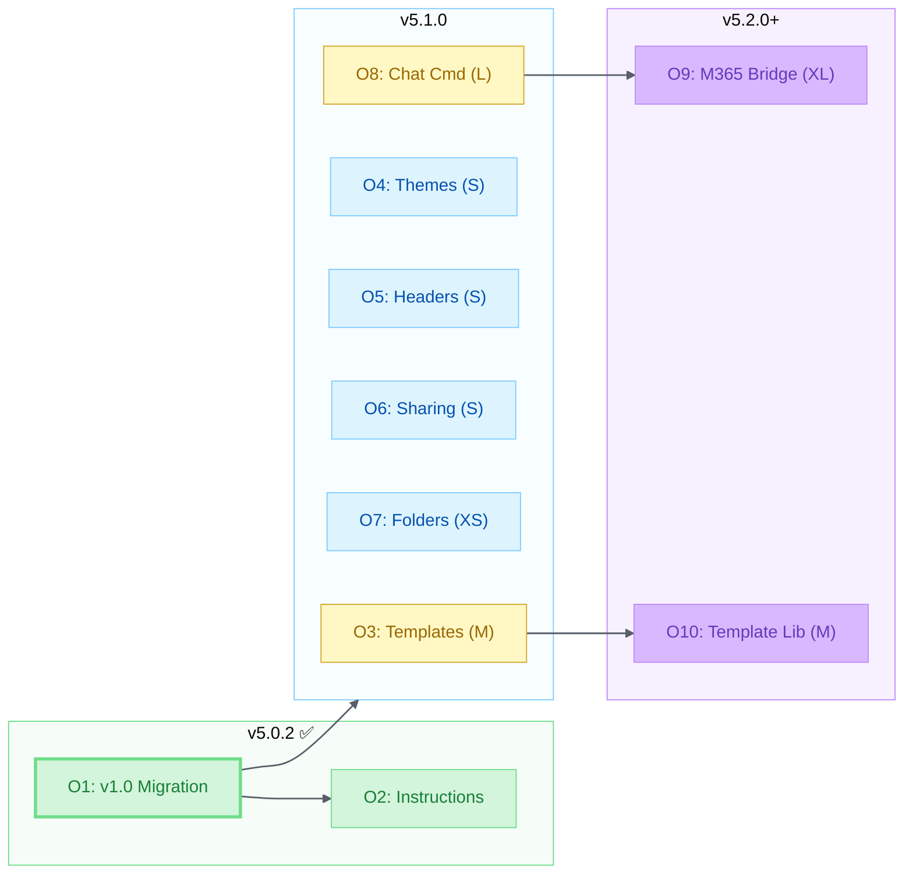
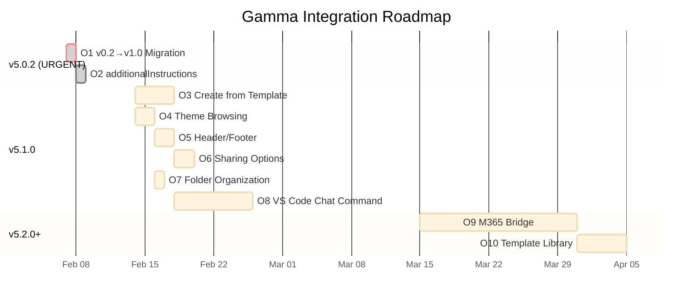
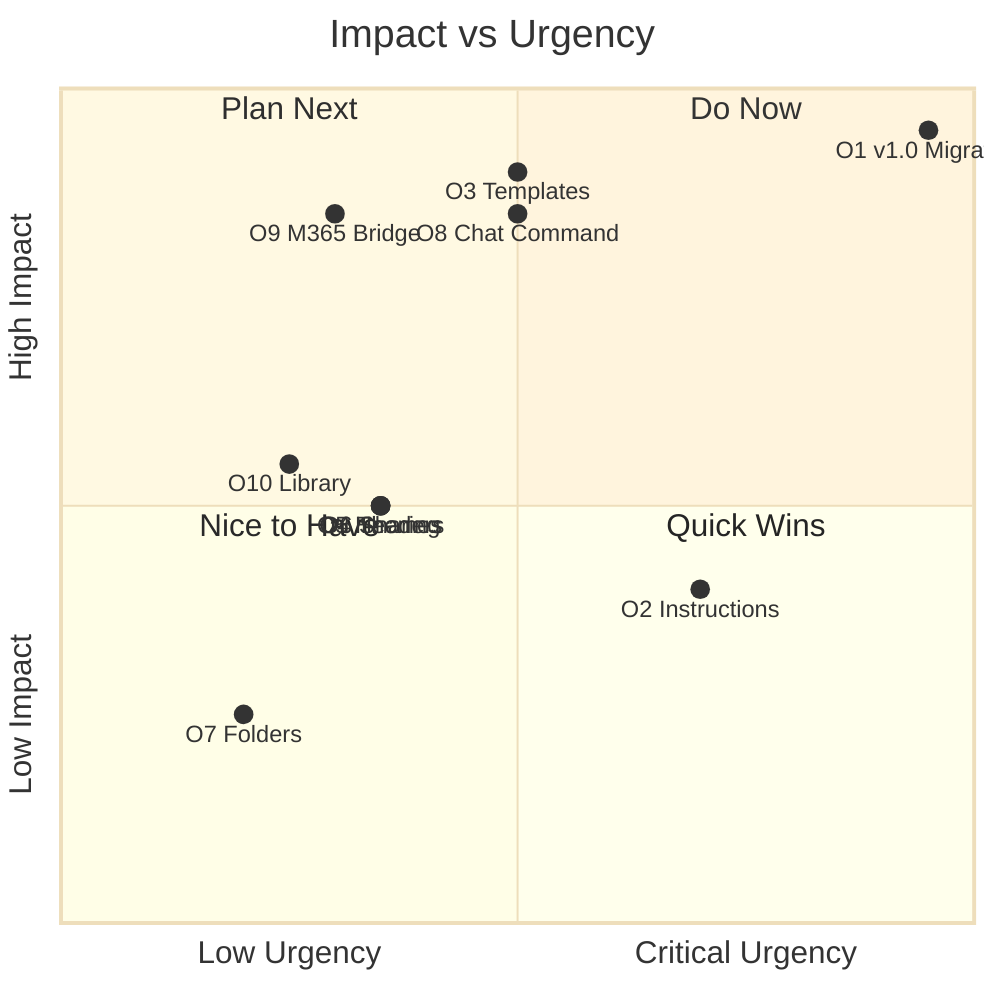

# Gamma Integration Opportunities — Ranked

> **10 integration opportunities ranked by impact, effort, and urgency**

|                  |                                                                                                                    |
| ---------------- | ------------------------------------------------------------------------------------------------------------------ |
| **Author**       | Fabio Correa                                                                                                       |
| **Date**         | February 7, 2026                                                                                                   |
| **Alex Version** | v5.0.1                                                                                                             |
| **Related**      | [GAMMA-ECOSYSTEM-ANALYSIS.md](GAMMA-ECOSYSTEM-ANALYSIS.md), [GAMMA-ENHANCEMENT-PLAN.md](GAMMA-ENHANCEMENT-PLAN.md) |

---

## How to Read This

Each opportunity includes:
- **Impact** (🔴 High / 🟡 Medium / 🟢 Low) — user-facing benefit
- **Effort** (T-shirt size) — development hours
- **Urgency** — time-sensitive or strategic
- **Roadmap target** — which Alex release

---

## O1. Migrate gamma-generator.js from v0.2 to v1.0

| Field          | Value                                         |
| -------------- | --------------------------------------------- |
| **Impact**     | 🔴 High                                        |
| **Effort**     | S (2-4 hours)                                 |
| **Urgency**    | 🔴 **CRITICAL** — v0.2 deprecated Jan 16, 2026 |
| **Status**     | ✅ **Completed Feb 7, 2026**                   |
| **Roadmap**    | v5.0.2                                        |
| **Depends on** | —                                             |

### What

~~The `scripts/gamma-generator.js` file uses `API_VERSION = 'v0.2'` (line 26). Gamma deprecated v0.2 on January 16, 2026. The script stopped working.~~

**RESOLVED**: Migrated `API_VERSION` from `'v0.2'` to `'v1.0'`. Also added `--instructions` and `--image-source` CLI arguments.

### Why

Without this fix, Alex's entire Gamma capability is non-functional. This blocks all other Gamma improvements.

### How

1. Change `API_VERSION` from `'v0.2'` to `'v1.0'`
2. Update endpoint paths (v1.0 uses `/v1.0/generations` not `/v0.2/generate`)
3. Map existing CLI parameters to v1.0 request body format
4. Update status polling (v1.0 response format may differ)
5. Test generation + export + auto-open

### Acceptance Criteria

- [ ] Script generates presentations using v1.0 endpoints
- [ ] `--export pptx` and `--export pdf` still work
- [ ] `--draft` mode unchanged (no API dependency)
- [ ] `--open` flag still launches exported file

---

## O2. Add `additionalInstructions` Parameter

| Field          | Value                       |
| -------------- | --------------------------- |
| **Impact**     | 🟡 Medium                    |
| **Effort**     | XS (1 hour)                 |
| **Urgency**    | Low                         |
| **Status**     | ✅ **Completed Feb 7, 2026** |
| **Roadmap**    | v5.0.2 (alongside O1)       |
| **Depends on** | O1                          |

### What

~~v1.0 adds `additionalInstructions` (1-2000 chars) — extra guidance for the AI beyond the main content. Alex doesn't pass this parameter.~~

**RESOLVED**: Added `--instructions` / `-i` CLI argument mapped to `additionalInstructions`.

### Why

Allows users to say things like "Make it professional but approachable" or "Include a call-to-action on the last slide" without putting that guidance in the main content.

### How

1. Add `--instructions "..."` CLI argument
2. Pass as `additionalInstructions` in API request body
3. Update SKILL.md with examples

---

## O3. Create from Template Support

| Field          | Value         |
| -------------- | ------------- |
| **Impact**     | 🔴 High        |
| **Effort**     | M (4-8 hours) |
| **Urgency**    | Medium        |
| **Status**     | ❌ Not started |
| **Roadmap**    | v5.1.0        |
| **Depends on** | O1            |

### What

v1.0 introduces `POST /v1.0/generations/from-template` (Beta) — generate new content that follows the structure and styling of an existing Gamma. Requires a `gammaId` and a `prompt`.

### Why

This is transformative for brand consistency:
- Create one "Fabio Correa Research Update" template in Gamma
- Use Alex to generate weekly variations with different content
- All presentations share consistent branding, layout, tone

### How

1. Add `--template <gammaId>` CLI argument
2. Implement `POST /v1.0/generations/from-template` call
3. Allow combining with `--file` input (prompt = file content)
4. Add theme override via `--theme` when using templates
5. Update SKILL.md with template workflow examples

### Acceptance Criteria

- [ ] `--template <id> --file input.md` generates from template
- [ ] `--template <id> --topic "Weekly Update"` generates from prompt
- [ ] Exports work with template-based generations
- [ ] SKILL.md documents the template workflow

---

## O4. Theme Browsing and Selection

| Field          | Value         |
| -------------- | ------------- |
| **Impact**     | 🟡 Medium      |
| **Effort**     | S (2-4 hours) |
| **Urgency**    | Low           |
| **Status**     | ❌ Not started |
| **Roadmap**    | v5.1.0        |
| **Depends on** | O1            |

### What

v1.0 adds `GET /v1.0/themes` — search and list themes by name, color, and tone keywords. Currently Alex uses workspace defaults.

### Why

Themes dramatically affect presentation quality. Being able to search "dark modern" or "academic" and apply matching themes elevates output quality.

### How

1. Add `gamma themes [--query "dark"]` CLI subcommand
2. Display theme names + IDs + keywords
3. Add `--theme <themeId>` to generation command
4. Cache theme list for offline reference (theme IDs are stable)

---

## O5. Header/Footer Branding

| Field          | Value         |
| -------------- | ------------- |
| **Impact**     | 🟡 Medium      |
| **Effort**     | S (2-4 hours) |
| **Urgency**    | Low           |
| **Status**     | ❌ Not started |
| **Roadmap**    | v5.1.0        |
| **Depends on** | O1            |

### What

v1.0 adds `cardOptions.headerFooter` — 6 position slots (topLeft/Right/Center, bottomLeft/Right/Center) for text, images (logos), card numbers, or theme logos.

### Why

Professional presentations need consistent branding. Users can put their logo in topRight, page numbers in bottomCenter, and date in bottomLeft — all via API.

### How

1. Add `--header-footer` CLI argument (JSON or shorthand syntax)
2. Support common presets: `--branding standard` (logo top-right, page bottom-center)
3. Allow `--logo <url>` shorthand for logo placement
4. Update SKILL.md

---

## O6. Sharing Options

| Field          | Value         |
| -------------- | ------------- |
| **Impact**     | 🟡 Medium      |
| **Effort**     | S (2-4 hours) |
| **Urgency**    | Low           |
| **Status**     | ❌ Not started |
| **Roadmap**    | v5.1.0        |
| **Depends on** | O1            |

### What

v1.0 adds `sharingOptions` — workspace access levels, external access, and email-based sharing with per-recipient permissions.

### Why

Currently Alex generates content and the user manually shares. With sharing options, Alex can generate AND distribute in one command.

### How

1. Add `--share <emails>` CLI argument
2. Add `--workspace-access <level>` argument
3. Support access levels: `noAccess`, `view`, `comment`, `edit`, `fullAccess`
4. Update SKILL.md

---

## O7. Folder Organization

| Field          | Value         |
| -------------- | ------------- |
| **Impact**     | 🟢 Low         |
| **Effort**     | XS (1 hour)   |
| **Urgency**    | Low           |
| **Status**     | ❌ Not started |
| **Roadmap**    | v5.1.0        |
| **Depends on** | O1            |

### What

v1.0 adds `folderIds` parameter and `GET /v1.0/folders` — save generated content to specific workspace folders.

### Why

Users who generate many presentations need organization. Alex can save to "Research Talks" or "Client Decks" automatically.

### How

1. Add `gamma folders [--query "Research"]` CLI subcommand
2. Add `--folder <folderId>` to generation command
3. Auto-create folders if needed (or report error)

---

## O8. VS Code Chat Command Integration

| Field          | Value          |
| -------------- | -------------- |
| **Impact**     | 🔴 High         |
| **Effort**     | L (8-16 hours) |
| **Urgency**    | Medium         |
| **Status**     | ❌ Not started  |
| **Roadmap**    | v5.1.0         |
| **Depends on** | O1             |

### What

Currently Gamma is only accessible via CLI (`node scripts/gamma-generator.js`). It should be available through Alex's VS Code chat interface.

### Why

The skill exists (`gamma-presentations`) but the VS Code extension has no command/tool that calls the Gamma API. Users must drop to the terminal. This is inconsistent with the chat-first interaction model.

### How

1. Add `@alex /gamma "Create a presentation about..."` chat command
2. Register Gamma API key in VS Code secrets
3. Implement Gamma client as VS Code extension module
4. Support: topic generation, file-based generation, theme selection
5. Return Gamma URL in chat response
6. Auto-download exports to workspace

---

## O9. M365 Copilot → Gamma Bridge

| Field          | Value                                    |
| -------------- | ---------------------------------------- |
| **Impact**     | 🔴 High                                   |
| **Effort**     | XL (16-40 hours)                         |
| **Urgency**    | Low — depends on M365 API plugin support |
| **Status**     | ❌ Not started                            |
| **Roadmap**    | v5.2.0+                                  |
| **Depends on** | O1, M365 API plugin infrastructure       |

### What

Enable M365 Copilot Alex to generate Gamma presentations via API plugin. User says "Create a presentation about this meeting" in Teams, and Alex calls Gamma.

### Why

Bridges two platforms: M365 communication + Gamma content creation. Meeting notes → presentation is a high-value workflow.

### How

1. Define OpenAPI spec for Gamma's Generate API
2. Register as M365 API plugin in Alex's M365 agent
3. Handle auth (API key storage in M365 context)
4. Return Gamma URL as adaptive card in Teams

---

## O10. Curated Template Library

| Field          | Value                            |
| -------------- | -------------------------------- |
| **Impact**     | 🟡 Medium                         |
| **Effort**     | M (4-8 hours + ongoing curation) |
| **Urgency**    | Low                              |
| **Status**     | ❌ Not started                    |
| **Roadmap**    | v5.2.0+                          |
| **Depends on** | O3                               |

### What

A curated set of Gamma templates optimized for Alex's common use cases: research update, project pitch, weekly standup, course lecture, academic poster.

### Why

Templates reduce generation time and ensure quality. Users get professional output without specifying design parameters.

### How

1. Create 5-10 templates in Gamma's web editor
2. Document `gammaId` for each template
3. Add `--preset research-update` shorthand to CLI
4. SKILL.md includes template catalog
5. Community-contributed templates via knowledge base

---

## Dependency Graph

**Figure 1:** *Opportunity dependency graph — done (green), next (blue), future (purple)*

## Timeline

**Figure 2:** *Gamma integration roadmap — 3-phase Gantt timeline*

---

## Priority Matrix

**Figure 3:** *Impact vs Urgency priority matrix — quadrant positioning of O1–O10*

**Recommended execution order**: O1 → O2 → O3 → O4 → O8 → O5 → O6 → O7 → O9 → O10

---

*Analysis performed February 7, 2026 — Alex Cognitive Architecture v5.0.1*
