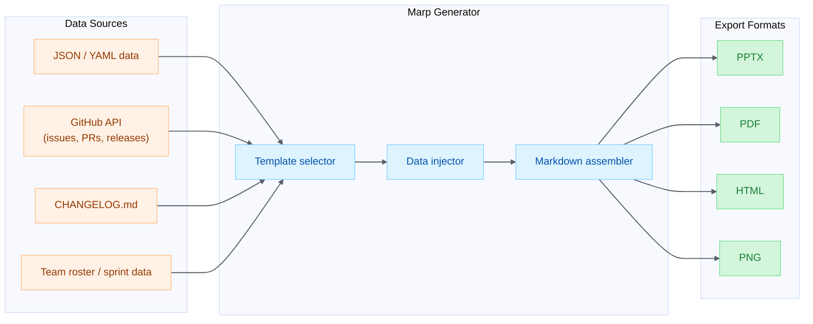

# Marp Automation Plan — Template-Driven Deck Generation

**Date**: 2026-02-07
**Author**: Alex Cognitive Architecture Research
**Status**: Proposed — Ready for Implementation
**Priority**: Enhancement of existing integration (zero new dependencies)
**Companion**: [PRESENTATION-VISUALIZATION-ECOSYSTEM-2026.md](PRESENTATION-VISUALIZATION-ECOSYSTEM-2026.md) | [PRESENTATION-VISUALIZATION-OPPORTUNITIES-2026.md](PRESENTATION-VISUALIZATION-OPPORTUNITIES-2026.md) | [PPTXGENJS-IMPLEMENTATION-PLAN.md](PPTXGENJS-IMPLEMENTATION-PLAN.md)

---

## Table of Contents

1. [Executive Summary](#1-executive-summary)
2. [Current Integration Status](#2-current-integration-status)
3. [The Automation Opportunity](#3-the-automation-opportunity)
4. [Repository & Ecosystem Details](#4-repository--ecosystem-details)
5. [Architecture Overview](#5-architecture-overview)
6. [Template System Design](#6-template-system-design)
7. [Implementation Phases](#7-implementation-phases)
8. [Marp Markdown Reference](#8-marp-markdown-reference)
9. [Template Library](#9-template-library)
10. [Integration with Alex Architecture](#10-integration-with-alex-architecture)
11. [Code Examples](#11-code-examples)
12. [Testing Strategy](#12-testing-strategy)
13. [Marp vs PptxGenJS — When to Use Which](#13-marp-vs-pptxgenjs--when-to-use-which)

---

## 1. Executive Summary

Marp is **already integrated** into Alex via the VS Code extension and the `export_marp` Copilot tool. But today it's used only for manual, one-off deck creation — "write markdown, export PPTX." The untapped opportunity is **template-driven automation**: generating repetitive deck types from structured data using reusable `.md` templates, then exporting via the existing `export_marp` tool.

**Why this matters:**

| Factor                 | Details                                                    |
| ---------------------- | ---------------------------------------------------------- |
| **Zero new deps**      | Marp CLI + VS Code extension already installed             |
| **Zero API keys**      | No accounts, OAuth, or network — fully local               |
| **Instant**            | Markdown generation is string concatenation — sub-ms       |
| **Already proven**     | `export_marp` tool works in Copilot agent mode today       |
| **5 export formats**   | HTML, PDF, PPTX, PNG, JPEG — all from one `.md` file       |
| **Simple to maintain** | Templates are plain Markdown — anyone can read and edit    |
| **Complementary**      | Marp for text-heavy repetitive decks; PptxGenJS for charts |

**The insight:** Marp's Markdown-first approach makes it the fastest path for **simple, repetitive slide decks** that follow a predictable structure. Instead of crafting PPTX objects in code, you concatenate strings into a `.md` file and call `export_marp`.

---

## 2. Current Integration Status

### What Alex Has Today

| Component              | Status      | Details                                              |
| ---------------------- | ----------- | ---------------------------------------------------- |
| Marp VS Code Extension | ✅ Installed | `marp-team.marp-vscode` v3.3.0                       |
| `export_marp` Tool     | ✅ Available | Copilot agent tool exposed via LanguageModelTool API |
| Marp CLI (bundled)     | ✅ Built-in  | Bundled inside the VS Code extension                 |
| Preview                | ✅ Working   | Live preview in VS Code Markdown panel               |
| Export (manual)        | ✅ Working   | Command Palette → Export slide deck                  |
| Custom themes          | ✅ Supported | Via `markdown.marp.themes` workspace setting         |
| IntelliSense           | ✅ Working   | Auto-completion for Marp directives                  |

### What Alex Doesn't Have (Yet)

| Capability              | Gap                                                   |
| ----------------------- | ----------------------------------------------------- |
| Template library        | No reusable `.md` templates for common deck types     |
| Data-to-deck automation | No script to fill templates with structured data      |
| Batch generation        | No way to generate multiple decks from a data source  |
| Custom Alex theme       | No branded theme CSS using GitHub Pastel Palette v2   |
| Template routing        | Skill activation doesn't route to Marp for automation |

---

## 3. The Automation Opportunity

### Use Cases Marp Excels At



**Figure 1:** *Marp automation data flow — structured data → template selection → markdown assembly → multi-format export*

### Target Deck Types

| Deck Type                | Frequency      | Slide Count | Data Source                      |
| ------------------------ | -------------- | ----------- | -------------------------------- |
| **Sprint review**        | Every 2 weeks  | 8-12        | Sprint data (JSON/YAML)          |
| **Weekly status update** | Weekly         | 5-8         | Status summary (text/YAML)       |
| **Release notes**        | Per release    | 6-10        | CHANGELOG.md                     |
| **Standup summary**      | Daily          | 3-5         | Task list (text)                 |
| **Onboarding deck**      | Per new member | 10-15       | Team roster + project info       |
| **Meeting agenda**       | Per meeting    | 4-8         | Agenda items (list)              |
| **Project overview**     | On demand      | 8-12        | README.md + project metadata     |
| **Retrospective**        | Every 2 weeks  | 6-8         | Retro items (what went well/bad) |

---

## 4. Repository & Ecosystem Details

### Marp Ecosystem

| Component     | Package                 | Version | GitHub Stars | Purpose                                |
| ------------- | ----------------------- | ------- | ------------ | -------------------------------------- |
| **Marp CLI**  | `@marp-team/marp-cli`   | v4.2.3  | 3.2k         | CLI converter (HTML/PDF/PPTX/PNG/JPEG) |
| **Marp Core** | `@marp-team/marp-core`  | v4.2.0  | 1k           | Markdown → HTML+CSS engine             |
| **Marpit**    | `@marp-team/marpit`     | —       | —            | Framework for slide deck conversion    |
| **VS Code**   | `marp-team.marp-vscode` | v3.3.0  | 1.9k         | VS Code extension + export             |

### Key URLs

| Resource          | URL                                                                                          |
| ----------------- | -------------------------------------------------------------------------------------------- |
| Marp CLI GitHub   | [github.com/marp-team/marp-cli](https://github.com/marp-team/marp-cli)                       |
| Marp Core GitHub  | [github.com/marp-team/marp-core](https://github.com/marp-team/marp-core)                     |
| VS Code Extension | [github.com/marp-team/marp-vscode](https://github.com/marp-team/marp-vscode)                 |
| Marpit Directives | [marpit.marp.app/directives](https://marpit.marp.app/directives)                             |
| npm (CLI)         | [npmjs.com/package/@marp-team/marp-cli](https://www.npmjs.com/package/@marp-team/marp-cli)   |
| npm (Core)        | [npmjs.com/package/@marp-team/marp-core](https://www.npmjs.com/package/@marp-team/marp-core) |

### Author & License

| Field        | Value                                              |
| ------------ | -------------------------------------------------- |
| **Author**   | Yuki Hattori (@yhatt)                              |
| **Org**      | @marp-team                                         |
| **License**  | MIT                                                |
| **Language** | TypeScript (89.6% CLI, 84.8% Core)                 |
| **Node.js**  | v18+ required                                      |
| **Browsers** | Chrome, Edge, or Firefox for PDF/PPTX/image export |

---

## 5. Architecture Overview

### How Marp Automation Fits Into Alex

```mermaid
%%{init: {'theme': 'base', 'themeVariables': { 'edgeLabelBackground':'#ffffff', 'lineColor': '#57606a' }}}%%
graph LR
    subgraph alex["Alex Presentation Tier"]
        direction TB
        GA["Gamma<br/>AI generation"]:::purple
        PG["PptxGenJS<br/>Data + charts"]:::blue
        MA["Marp Automation<br/>Template decks"]:::green
        MP["Marp Manual<br/>Ad-hoc decks"]:::silver
    end
    subgraph marpstack["Marp Stack"]
        direction TB
        TL["Template library<br/>.md templates"]:::bronze
        MG["marp-generator.js<br/>Data → Markdown"]:::blue
        EX["export_marp tool<br/>Markdown → Output"]:::green
    end

    MA --> TL
    TL --> MG
    MG --> EX

    classDef purple fill:#d8b9ff,color:#6639ba,stroke:#bf8aff
    classDef blue fill:#ddf4ff,color:#0550ae,stroke:#80ccff
    classDef green fill:#d3f5db,color:#1a7f37,stroke:#6fdd8b
    classDef silver fill:#eaeef2,color:#24292f,stroke:#afb8c1
    classDef bronze fill:#fff1e5,color:#953800,stroke:#ffb77c

    linkStyle default stroke:#57606a,stroke-width:1.5px
```



**Figure 2:** *Alex presentation tier showing Marp Automation's relationship with templates, generator, and export tool*

### Component Responsibilities

| Component             | Role                                                                       |
| --------------------- | -------------------------------------------------------------------------- |
| **Template library**  | `.md` files with `{{placeholder}}` slots for data injection                |
| **marp-generator.js** | Node.js script: reads data → selects template → fills slots → writes `.md` |
| **export_marp**       | Existing VS Code Copilot tool: `.md` → PPTX/PDF/HTML/PNG                   |
| **Alex themes**       | Custom CSS using GitHub Pastel Palette v2 colors                           |

---

## 6. Template System Design

### Template Format

Templates are standard Marp Markdown with `{{mustache-style}}` placeholders:

```markdown
---
marp: true
theme: alex-pastel
paginate: true
header: '{{header_text}}'
footer: '{{footer_text}}'
---

<!-- _class: lead -->

# {{title}}

**{{subtitle}}**

{{date}}

---

## {{section_title}}

{{content}}

---

<!-- _class: lead -->

# Thank You

{{closing_message}}
```

### Placeholder Conventions

| Placeholder Pattern | Data Type   | Example                       |
| ------------------- | ----------- | ----------------------------- |
| `{{title}}`         | String      | "Sprint 42 Review"            |
| `{{items}}`         | Array       | Bullet list auto-generated    |
| `{{table:data}}`    | Array[]     | Auto-formatted Markdown table |
| `{{date}}`          | Date        | Auto-formatted current date   |
| `{{date:format}}`   | Date        | Custom format (YYYY-MM-DD)    |
| `{{#each items}}`   | Loop        | Repeat slide per item         |
| `{{#if condition}}` | Conditional | Include/exclude slides        |

### Template Directory Structure

```
.github/marp-templates/
├── alex-pastel.css          # Custom theme CSS
├── sprint-review.md         # Sprint review template
├── weekly-status.md         # Weekly status update
├── release-notes.md         # Release notes from changelog
├── standup-summary.md       # Daily standup summary
├── meeting-agenda.md        # Meeting agenda
├── onboarding.md            # New team member onboarding
├── project-overview.md      # Project overview
└── retrospective.md         # Sprint retrospective
```

---

## 7. Implementation Phases

### Phase 1: Core Generator (1 session)

**Goal:** `marp-generator.js` that reads data + template → produces `.md` ready for `export_marp`

| Task                               | Details                                              |
| ---------------------------------- | ---------------------------------------------------- |
| Create `scripts/marp-generator.js` | Template engine with `{{placeholder}}` replacement   |
| Implement simple placeholders      | String, date, list substitution                      |
| Implement `{{#each}}` loops        | Generate one slide per item (e.g., per sprint story) |
| Implement `{{table:key}}` tables   | Format array-of-objects as Markdown tables           |
| Create first template              | `sprint-review.md` with real structure               |
| Test with sample JSON data         | End-to-end: JSON → `.md` → `export_marp` → PPTX      |

**Deliverables:**
- `scripts/marp-generator.js` — CLI entrypoint
- `.github/marp-templates/sprint-review.md` — first template
- `scripts/sample-data/sprint-review.json` — test data

### Phase 2: Template Library (1 session)

**Goal:** Build out the full template library with real-world utility

| Task                     | Details                                                              |
| ------------------------ | -------------------------------------------------------------------- |
| Weekly status template   | 5-slide structure: summary, highlights, blockers, next week, metrics |
| Release notes template   | Auto-parse CHANGELOG.md → slides per version                         |
| Standup summary template | Minimal 3-slide deck: done, doing, blocked                           |
| Meeting agenda template  | Configurable sections, time allocations                              |
| Retrospective template   | What went well / what didn't / action items                          |

**Deliverables:**
- 5 additional `.md` templates in `.github/marp-templates/`
- `scripts/parsers/changelog-parser.js` — extracts version data from CHANGELOG.md
- Sample data files for each template

### Phase 3: Alex Theme & Branding (1 session)

**Goal:** Custom CSS theme using GitHub Pastel Palette v2 for branded output

| Task                       | Details                                          |
| -------------------------- | ------------------------------------------------ |
| Create `alex-pastel.css`   | Marp theme with GitHub Pastel Palette v2 colors  |
| Define slide classes       | `lead`, `section`, `quote`, `code`, `comparison` |
| Header/footer styling      | Branded with Alex identity                       |
| 4:3 and 16:9 presets       | Via `@size` metadata in theme CSS                |
| Test across export formats | Verify HTML, PDF, PPTX all render consistently   |

**Theme Color Mapping (GitHub Pastel Palette v2):**

| Slide Class | Background | Text      | Accent    |
| ----------- | ---------- | --------- | --------- |
| `default`   | `#ffffff`  | `#24292f` | `#0550ae` |
| `lead`      | `#ddf4ff`  | `#0550ae` | `#80ccff` |
| `highlight` | `#fff8c5`  | `#9a6700` | `#d4a72c` |
| `success`   | `#d3f5db`  | `#1a7f37` | `#6fdd8b` |
| `warning`   | `#fff1e5`  | `#953800` | `#ffb77c` |
| `danger`    | `#ffebe9`  | `#cf222e` | `#f5a3a3` |
| `info`      | `#d8b9ff`  | `#6639ba` | `#bf8aff` |
| `neutral`   | `#eaeef2`  | `#24292f` | `#afb8c1` |

### Phase 4: Skill Integration (1 session)

**Goal:** Wire Marp automation into Alex's skill-activation system

| Task                            | Details                                           |
| ------------------------------- | ------------------------------------------------- |
| Create Marp automation skill    | `.github/skills/marp-automation/SKILL.md`         |
| Update skill-activation routing | Add Marp template triggers to routing index       |
| Add synapses                    | Connect to `presentation-export`, `data-analysis` |
| Create `.prompt.md` workflow    | Guided deck generation prompt                     |
| Document in SKILL-CATALOG       | Add to generated catalog                          |

---

## 8. Marp Markdown Reference

### Front-Matter (Global Directives)

```yaml
---
marp: true                    # REQUIRED — enables Marp rendering
theme: default                # Theme: default | gaia | uncover | custom
paginate: true                # Show page numbers
header: 'Header text'         # Persistent header across slides
footer: 'Footer text'         # Persistent footer across slides
size: 16:9                    # Slide dimensions (16:9 or 4:3)
math: katex                   # Math library (mathjax | katex)
style: |                      # Inline CSS overrides
  section { font-size: 24px; }
headingDivider: 2             # Auto-divide slides at heading level
---
```

### Slide Separation

```markdown
# Slide 1 content

---

# Slide 2 content

---

# Slide 3 content
```

Three dashes (`---`) on a line creates a new slide. Alternatively, use `headingDivider` to auto-split on headings.

### Local Directives (Per-Slide)

```markdown
<!-- _class: lead -->           <!-- Apply CSS class to this slide only -->
<!-- _backgroundColor: #ddf4ff -->  <!-- Background color for this slide -->
<!-- _color: #0550ae -->         <!-- Text color for this slide -->
<!-- _paginate: false -->        <!-- Hide page number on this slide -->
<!-- _header: '' -->             <!-- Clear header on this slide -->
<!-- _footer: '' -->             <!-- Clear footer on this slide -->
```

Without underscore prefix (`_`), directives apply to the current slide **and all following slides**.

### Image Syntax

```markdown
             <!-- Sized image -->
                 <!-- Background image -->
           <!-- Split background (left 40%) -->
            <!-- Split background (right 60%) -->
            <!-- Background, contained -->
       <!-- Background with filter -->
```

### Built-In Themes

| Theme     | Style                             |
| --------- | --------------------------------- |
| `default` | Simple, clean, white background   |
| `gaia`    | Bold, colorful, dark mode option  |
| `uncover` | Minimal, modern, large typography |

### Presenter Notes

```markdown
# My Slide

Content visible to audience.

<!-- This is a presenter note — visible only in presenter view -->
```

### Fitting Headers

```markdown
# <!-- fit --> This header auto-scales to fill the slide width
```

### Fragmented Lists

Use `*` marker for items that appear one at a time in presentation mode:

```markdown
* First point (appears on click)
* Second point (appears on next click)
* Third point (appears on next click)
```

### Export Formats via Marp CLI

| Format | CLI Flag        | `export_marp` Output Extension | Browser Required |
| ------ | --------------- | ------------------------------ | ---------------- |
| HTML   | (default)       | `.html`                        | No               |
| PDF    | `--pdf`         | `.pdf`                         | Yes              |
| PPTX   | `--pptx`        | `.pptx`                        | Yes              |
| PNG    | `--images png`  | `.png`                         | Yes              |
| JPEG   | `--images jpeg` | `.jpg`                         | Yes              |
| Notes  | `--notes`       | `.txt`                         | No               |

### Programmatic API (Node.js)

```javascript
const { marpCli } = require('@marp-team/marp-cli')

// Convert markdown to PDF
marpCli(['slides.md', '--pdf'])
  .then((exitStatus) => {
    if (exitStatus > 0) console.error(`Failure (exit: ${exitStatus})`)
    else console.log('Success')
  })
  .catch(console.error)
```

### Configuration File (`marp.config.mjs`)

```javascript
export default {
  inputDir: './slides',
  output: './public',
  themeSet: './themes',
  pdf: true,
  allowLocalFiles: true,
  html: true,
}
```

---

## 9. Template Library

### Template: Sprint Review (`sprint-review.md`)

```markdown
---
marp: true
theme: alex-pastel
paginate: true
header: 'Sprint {{sprint_number}} Review'
footer: '{{team_name}} — {{date}}'
---

<!-- _class: lead -->

# Sprint {{sprint_number}} Review

**{{team_name}}**
{{date}}

---

## Sprint Goal

{{sprint_goal}}

---

## Completed Stories

{{#each completed_stories}}
### {{this.id}}: {{this.title}}

- **Points:** {{this.points}}
- **Owner:** {{this.owner}}
- {{this.summary}}

---
{{/each}}

## Metrics

| Metric            | Value               |
| ----------------- | ------------------- |
| Stories completed | {{completed_count}} |
| Story points      | {{total_points}}    |
| Velocity (avg)    | {{avg_velocity}}    |
| Sprint health     | {{sprint_health}}   |

---

## Carry-Over Items

{{#each carryover_items}}
- **{{this.id}}**: {{this.title}} ({{this.reason}})
{{/each}}

---

## Demo Highlights

{{demo_notes}}

---

<!-- _class: lead -->

# Questions?

Next sprint starts: **{{next_sprint_date}}**
```

### Template: Weekly Status (`weekly-status.md`)

```markdown
---
marp: true
theme: alex-pastel
paginate: true
header: 'Weekly Status — {{week_of}}'
footer: '{{author}}'
---

<!-- _class: lead -->

# Weekly Status Update

**Week of {{week_of}}**
{{author}}

---

## Highlights

{{#each highlights}}
- ✅ {{this}}
{{/each}}

---

## In Progress

{{#each in_progress}}
- 🔄 {{this.task}} — {{this.status}}
{{/each}}

---

## Blockers

{{#each blockers}}
- 🚫 {{this.issue}} — **Owner:** {{this.owner}}
{{/each}}

{{#if no_blockers}}
- ✅ No blockers this week
{{/if}}

---

## Next Week

{{#each next_week}}
- 📋 {{this}}
{{/each}}

---

## Metrics

| Metric | This Week | Last Week | Trend |
| ------ | --------- | --------- | ----- |
{{#each metrics}}
| {{this.name}} | {{this.current}} | {{this.previous}} | {{this.trend}} |
{{/each}}
```

### Template: Release Notes (`release-notes.md`)

```markdown
---
marp: true
theme: alex-pastel
paginate: true
header: '{{product_name}} Release Notes'
footer: 'v{{version}} — {{date}}'
---

<!-- _class: lead -->

# {{product_name}} v{{version}}

**Release Notes**
{{date}}

---

## What's New

{{#each features}}
### {{this.title}}

{{this.description}}

---
{{/each}}

## Bug Fixes

{{#each fixes}}
- 🐛 {{this}}
{{/each}}

---

## Breaking Changes

{{#each breaking}}
- ⚠️ {{this}}
{{/each}}

{{#if no_breaking}}
- ✅ No breaking changes
{{/if}}

---

## Upgrade Guide

{{upgrade_instructions}}

---

<!-- _class: lead -->

# Thank You

Contributors: {{contributors}}
```

---

## 10. Integration with Alex Architecture

### Skill Mapping

| Alex Component        | Marp Automation Role                            |
| --------------------- | ----------------------------------------------- |
| `skill-activation`    | Route "generate status deck" → Marp automation  |
| `presentation-export` | `export_marp` tool for final conversion         |
| `markdown-mermaid`    | Mermaid diagrams embedded in Marp slides        |
| `data-analysis`       | Data extraction for template population         |
| `release-management`  | Auto-generate release notes deck from CHANGELOG |

### Synapse Connections

| Connection                                | Type     | Description                                |
| ----------------------------------------- | -------- | ------------------------------------------ |
| `marp-automation` → `presentation-export` | Outbound | Templates → export pipeline                |
| `marp-automation` → `markdown-mermaid`    | Outbound | Diagrams in slides                         |
| `marp-automation` → `pptx-generation`     | Sibling  | Text-heavy → Marp; chart-heavy → PptxGenJS |
| `marp-automation` → `release-management`  | Inbound  | Release triggers deck generation           |
| `marp-automation` → `data-analysis`       | Inbound  | Data feeds template population             |

### Skill Activation Triggers

| Trigger Phrase                      | Action                               |
| ----------------------------------- | ------------------------------------ |
| "generate sprint review deck"       | Select `sprint-review.md` template   |
| "create weekly status slides"       | Select `weekly-status.md` template   |
| "make release notes presentation"   | Parse CHANGELOG → `release-notes.md` |
| "standup slides for today"          | Select `standup-summary.md` template |
| "create onboarding deck for [name]" | Select `onboarding.md` + fill name   |
| "meeting agenda slides"             | Select `meeting-agenda.md` template  |

---

## 11. Code Examples

### Example 1: Minimal Template Fill

```javascript
// scripts/marp-generator.js (simplified core)
const fs = require('fs')
const path = require('path')

function fillTemplate(templatePath, data) {
  let md = fs.readFileSync(templatePath, 'utf-8')

  // Simple placeholder replacement
  for (const [key, value] of Object.entries(data)) {
    if (typeof value === 'string' || typeof value === 'number') {
      md = md.replaceAll(`{{${key}}}`, String(value))
    }
  }

  // Array → bullet list
  for (const [key, value] of Object.entries(data)) {
    if (Array.isArray(value) && typeof value[0] === 'string') {
      const bullets = value.map(item => `- ${item}`).join('\n')
      md = md.replaceAll(`{{${key}}}`, bullets)
    }
  }

  return md
}

// Usage
const data = {
  title: 'Sprint 42 Review',
  team_name: 'Platform Team',
  date: '2026-02-07',
  sprint_goal: 'Complete the presentation automation layer',
  completed_count: '12',
  total_points: '34',
}

const output = fillTemplate('.github/marp-templates/sprint-review.md', data)
fs.writeFileSync('output/sprint-42-review.md', output)
// Then: export_marp → PPTX
```

### Example 2: Handlebars-Style Loops

```javascript
function processLoops(md, data) {
  // {{#each key}} ... {{/each}}
  const eachRegex = /\{\{#each (\w+)\}\}([\s\S]*?)\{\{\/each\}\}/g

  return md.replace(eachRegex, (match, key, body) => {
    const items = data[key]
    if (!Array.isArray(items)) return ''

    return items.map(item => {
      let filled = body
      if (typeof item === 'string') {
        filled = filled.replaceAll('{{this}}', item)
      } else if (typeof item === 'object') {
        for (const [k, v] of Object.entries(item)) {
          filled = filled.replaceAll(`{{this.${k}}}`, String(v))
        }
      }
      return filled
    }).join('')
  })
}
```

### Example 3: CHANGELOG Parser → Release Notes Deck

```javascript
function parseChangelog(changelogPath) {
  const content = fs.readFileSync(changelogPath, 'utf-8')
  const versionRegex = /^## \[?(v?\d+\.\d+\.\d+)\]?.*?(?=\n## |\n*$)/gms

  const versions = []
  let match
  while ((match = versionRegex.exec(content)) !== null) {
    const version = match[1]
    const body = match[0]

    const features = extractSection(body, 'Added', 'Features', 'New')
    const fixes = extractSection(body, 'Fixed', 'Bug Fixes')
    const breaking = extractSection(body, 'Breaking', 'BREAKING')

    versions.push({ version, features, fixes, breaking })
  }

  return versions[0] // Most recent
}

function extractSection(body, ...headings) {
  for (const heading of headings) {
    const regex = new RegExp(`### ${heading}[\\s\\S]*?(?=### |$)`, 'i')
    const match = body.match(regex)
    if (match) {
      return match[0]
        .split('\n')
        .filter(line => line.startsWith('- '))
        .map(line => line.replace(/^- /, ''))
    }
  }
  return []
}
```

### Example 4: End-to-End CLI Usage

```bash
# Generate sprint review deck from JSON data
node scripts/marp-generator.js \
  --template sprint-review \
  --data sprint-42-data.json \
  --output output/sprint-42-review.md

# Then export via Marp (VS Code or CLI)
npx @marp-team/marp-cli output/sprint-42-review.md --pptx

# Or use export_marp tool in Copilot agent mode:
# "Export output/sprint-42-review.md as PPTX"
```

### Example 5: Sample Data File (`sprint-review.json`)

```json
{
  "sprint_number": 42,
  "team_name": "Platform Team",
  "date": "February 7, 2026",
  "sprint_goal": "Complete the presentation automation layer for Alex",
  "completed_stories": [
    {
      "id": "ALEX-301",
      "title": "Marp template system",
      "points": 5,
      "owner": "Alex",
      "summary": "Created reusable .md templates with placeholder system"
    },
    {
      "id": "ALEX-302",
      "title": "PptxGenJS integration",
      "points": 8,
      "owner": "Alex",
      "summary": "Implemented data-driven PPTX generation with charts"
    }
  ],
  "completed_count": 12,
  "total_points": 34,
  "avg_velocity": 31,
  "sprint_health": "🟢 Healthy",
  "carryover_items": [
    {
      "id": "ALEX-299",
      "title": "Google Slides API research",
      "reason": "Deferred to v5.2.0"
    }
  ],
  "demo_notes": "Live demo of sprint review deck auto-generation from this exact JSON file.",
  "next_sprint_date": "February 10, 2026"
}
```

---

## 12. Testing Strategy

### Test Cases

| #   | Test Case                        | Input                      | Expected Output             |
| --- | -------------------------------- | -------------------------- | --------------------------- |
| 1   | Simple placeholder fill          | Template + flat JSON       | All `{{key}}` replaced      |
| 2   | Array → bullet list              | Template + string array    | Formatted `- item` list     |
| 3   | `{{#each}}` loop                 | Template + object array    | One block per item          |
| 4   | `{{#if}}` conditional            | Template + boolean data    | Block included/excluded     |
| 5   | `{{table:key}}` table generation | Template + array of arrays | Valid Markdown table        |
| 6   | Date formatting                  | `{{date:YYYY-MM-DD}}`      | Formatted date string       |
| 7   | Missing placeholder              | Template + partial data    | Placeholder left or warning |
| 8   | CHANGELOG parsing                | Real CHANGELOG.md          | Extracted version data      |
| 9   | End-to-end PPTX export           | JSON → template → export   | Valid PPTX file             |
| 10  | Empty data arrays                | Template + empty arrays    | No crash, clean output      |

### Validation Checklist

- [ ] Generated `.md` is valid Marp Markdown (has `marp: true` front-matter)
- [ ] Slide separators (`---`) are correctly placed
- [ ] No broken `{{placeholder}}` remnants in output
- [ ] `export_marp` produces valid PPTX from generated `.md`
- [ ] PDF export renders correctly
- [ ] HTML export works without browser
- [ ] Custom theme CSS loads and renders in all formats
- [ ] Mermaid diagrams render inside exported slides

---

## 13. Marp vs PptxGenJS — When to Use Which

### Decision Matrix

```mermaid
%%{init: {'theme': 'base', 'themeVariables': { 'edgeLabelBackground':'#ffffff', 'lineColor': '#57606a' }}}%%
graph LR
    Q{{"Need charts<br/>or tables?"}}:::silver
    Q -->|"Yes — charts, data viz"| PG["PptxGenJS"]:::blue
    Q -->|"No — text, bullets, images"| Q2{{"Repetitive<br/>schedule?"}}:::silver
    Q2 -->|"Yes — weekly, sprint, etc."| MA["Marp Automation"]:::green
    Q2 -->|"No — one-off deck"| Q3{{"Design<br/>quality?"}}:::silver
    Q3 -->|"High — polished"| GM["Gamma"]:::purple
    Q3 -->|"Functional — fast"| MP["Marp Manual"]:::gold

    classDef silver fill:#eaeef2,color:#24292f,stroke:#afb8c1
    classDef blue fill:#ddf4ff,color:#0550ae,stroke:#80ccff
    classDef green fill:#d3f5db,color:#1a7f37,stroke:#6fdd8b
    classDef purple fill:#d8b9ff,color:#6639ba,stroke:#bf8aff
    classDef gold fill:#fff8c5,color:#9a6700,stroke:#d4a72c

    linkStyle default stroke:#57606a,stroke-width:1.5px
```



**Figure 3:** *Decision tree for choosing between Marp Automation, PptxGenJS, Gamma, and manual Marp*

### Comparison Table

| Dimension           | Marp Automation          | PptxGenJS                  |
| ------------------- | ------------------------ | -------------------------- |
| **Best for**        | Text-heavy, repetitive   | Data-heavy, charts         |
| **Input format**    | Markdown template + data | JavaScript API calls       |
| **Output**          | PPTX, PDF, HTML, PNG     | PPTX only                  |
| **Charts**          | ❌ (use PptxGenJS)        | ✅ 10+ chart types          |
| **Tables**          | ✅ Markdown tables        | ✅ Rich formatted tables    |
| **Templates**       | `.md` files (readable)   | Code-defined Slide Masters |
| **Editable output** | ⚠️ Experimental           | ✅ Fully editable PPTX      |
| **Dependencies**    | None new (already have)  | `pptxgenjs` + `jszip`      |
| **Learning curve**  | Low (it's Markdown)      | Medium (API learning)      |
| **Maintenance**     | Edit `.md` templates     | Edit JavaScript code       |
| **Mermaid support** | ✅ Native in Marp         | ❌ (render separately)      |
| **Math (KaTeX)**    | ✅ Native in Marp         | ❌ Not supported            |
| **Setup time**      | 0 (already have tools)   | 1 session (npm install)    |

### The Golden Rule

> **Text-heavy + repetitive → Marp Automation**
> **Data-heavy + charts → PptxGenJS**
> **Beautiful + AI-designed → Gamma**
> **Enterprise M365 → PowerPoint Graph API**

---

*Research completed 2026-02-07 — Alex Cognitive Architecture*
