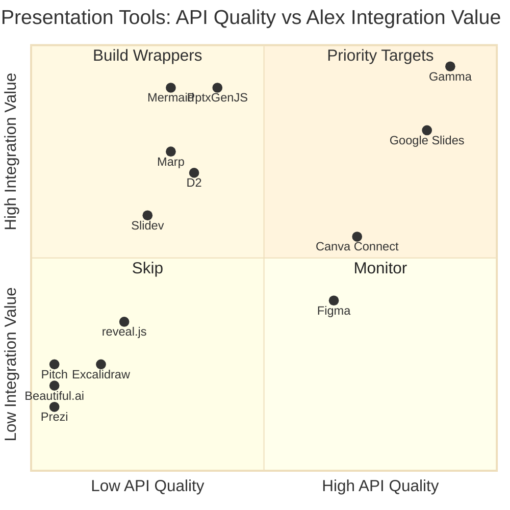

# Presentation & Visualization Tool Ecosystem Research

**Date**: 2026-02-07
**Author**: Alex Cognitive Architecture Research
**Status**: Active Research
**Purpose**: Comprehensive API and integration analysis for all viable presentation and visualization tools beyond Gamma
**Companion**: [PRESENTATION-VISUALIZATION-OPPORTUNITIES-2026.md](PRESENTATION-VISUALIZATION-OPPORTUNITIES-2026.md) | [PPTXGENJS-IMPLEMENTATION-PLAN.md](PPTXGENJS-IMPLEMENTATION-PLAN.md) | [MARP-AUTOMATION-PLAN.md](MARP-AUTOMATION-PLAN.md)

---

## Table of Contents

1. [Executive Summary](#1-executive-summary)
2. [Presentation Tools — Cloud/SaaS](#2-presentation-tools--cloudsaas)
3. [Presentation Tools — Developer/Local](#3-presentation-tools--developerlocal)
4. [Visualization & Diagramming Tools](#4-visualization--diagramming-tools)
5. [API Comparison Matrix](#5-api-comparison-matrix)
6. [Authentication & Access Models](#6-authentication--access-models)
7. [Export Format Comparison](#7-export-format-comparison)
8. [VS Code & M365 Compatibility](#8-vs-code--m365-compatibility)
9. [MCP Availability](#9-mcp-availability)
10. [Competitive Landscape Diagram](#10-competitive-landscape-diagram)
11. [Tool-by-Tool Viability Assessment](#11-tool-by-tool-viability-assessment)
12. [Recommendations](#12-recommendations)

---

## 1. Executive Summary

This document evaluates **16 presentation and visualization tools** for potential integration with the Alex Cognitive Architecture. Each tool is assessed on API availability, programmatic content creation capability, authentication model, export formats, and ecosystem compatibility (VS Code, M365, MCP).

**Key Findings:**
- **PptxGenJS is the top discovery** — local Node.js PPTX generation with zero cloud dependencies, running natively in Alex's runtime
- **3 tools have strong API integration potential**: Google Slides, Canva Connect, Figma
- **4 tools offer local/developer workflows**: PptxGenJS, Marp, Slidev, reveal.js
- **2 tools have strong diagramming APIs**: D2, Mermaid (already integrated)
- **Gamma remains the strongest cloud presentation API** for AI-driven generation
- **Most "AI presentation" tools** (Tome, Beautiful.ai, Prezi) lack public APIs

---

## 2. Presentation Tools — Cloud/SaaS

### 2.1 Google Slides API

| Feature           | Details                                                                                            |
| ----------------- | -------------------------------------------------------------------------------------------------- |
| **API Type**      | REST API (Google Workspace)                                                                        |
| **Base URL**      | `https://slides.googleapis.com/v1/presentations`                                                   |
| **Auth**          | OAuth 2.0 (Google Cloud Console)                                                                   |
| **API Maturity**  | ✅ Production — fully documented, stable                                                            |
| **Rate Limits**   | 300 requests/minute/project (read), 60/min (write)                                                 |
| **Pricing**       | Free (Google Workspace API quotas apply)                                                           |
| **Documentation** | [developers.google.com/slides](https://developers.google.com/workspace/slides/api/guides/overview) |
| **OpenAPI Spec**  | Not officially published (REST reference available)                                                |
| **GitHub**        | [googleapis/google-api-nodejs-client](https://github.com/googleapis/google-api-nodejs-client)      |

**Key Capabilities:**
- Create presentations programmatically
- Add/modify slides, shapes, text, images, tables, charts
- Batch update API (multiple operations in single request)
- Template-based generation via `replaceAllText` and `replaceAllShapesWithImage`
- Import charts from Google Sheets
- Speaker notes support
- Page element transforms (position, scale, rotation)

**Batch Update Request Types:**

| Category       | Operations                                                                                             |
| -------------- | ------------------------------------------------------------------------------------------------------ |
| Slides         | `CreateSlide`, `UpdateSlidesPosition`, `DuplicateObject`, `DeleteObject`                               |
| Shapes & Text  | `CreateShape`, `InsertText`, `DeleteText`, `ReplaceAllText`, `UpdateTextStyle`, `UpdateParagraphStyle` |
| Images & Video | `CreateImage`, `CreateVideo`, `ReplaceAllShapesWithImage`                                              |
| Tables         | `CreateTable`, `InsertTableRows/Columns`, `MergeTableCells`, `UpdateTableCellProperties`               |
| Charts         | `CreateSheetsChart`, `RefreshSheetsChart`                                                              |
| Formatting     | `UpdateShapeProperties`, `UpdatePageProperties`, `UpdatePageElementTransform`                          |

**Alex Integration Potential: HIGH**
- Full programmatic presentation creation
- Template-based workflows (merge data into templates)
- Pairs well with Google Drive API for file management
- No AI generation built-in — Alex would provide the intelligence layer
- Requires Google Cloud project setup + OAuth consent screen

---

### 2.2 Canva Connect API

| Feature           | Details                                                                                                            |
| ----------------- | ------------------------------------------------------------------------------------------------------------------ |
| **API Type**      | REST API                                                                                                           |
| **Base URL**      | `https://api.canva.com/rest/v1`                                                                                    |
| **Auth**          | OAuth 2.0 (Canva Developer Portal)                                                                                 |
| **API Maturity**  | ✅ Production (some endpoints in Preview)                                                                           |
| **Pricing**       | Free tier available; Autofill requires Enterprise                                                                  |
| **Documentation** | [canva.dev/docs/connect](https://www.canva.dev/docs/connect/)                                                      |
| **OpenAPI Spec**  | ✅ Published at `canva.dev/sources/connect/api/latest/api.yml`                                                      |
| **Starter Kit**   | [github.com/canva-sdks/canva-connect-api-starter-kit](https://github.com/canva-sdks/canva-connect-api-starter-kit) |

**Key Capabilities:**

| Endpoint Category   | Operations                                                                    |
| ------------------- | ----------------------------------------------------------------------------- |
| **Designs**         | Create design, List designs, Get design, Get design pages, Get export formats |
| **Assets**          | Upload asset, List assets, Get asset, Delete asset                            |
| **Brand Templates** | List templates, Get template dataset                                          |
| **Autofill**        | Create design autofill job, Get autofill job status                           |
| **Exports**         | Create export job, Get export job                                             |
| **Folders**         | List folders, Create folder, Move items                                       |
| **Comments**        | Create/list/reply to comments                                                 |

**Autofill API (Enterprise Only):**
- Template-based design generation
- Fill brand templates with custom data (text, images)
- Asynchronous job-based workflow
- Requires Canva Enterprise plan

**Limitations:**
- Cannot create designs from scratch programmatically (only from templates)
- Autofill limited to Enterprise tier
- No AI generation — only template filling
- Public integrations require Canva review

**Alex Integration Potential: MEDIUM**
- Useful for template-based design workflows
- Asset management (upload Alex-generated images to Canva)
- Export final designs back to local filesystem
- Enterprise-only autofill is a significant barrier
- Better as a secondary output channel than primary creation tool

---

### 2.3 Figma (including Figma Slides)

| Feature           | Details                                                                                 |
| ----------------- | --------------------------------------------------------------------------------------- |
| **API Type**      | REST API                                                                                |
| **Base URL**      | `https://api.figma.com`                                                                 |
| **Auth**          | Personal Access Tokens or OAuth 2.0                                                     |
| **API Maturity**  | ✅ Production — comprehensive                                                            |
| **Pricing**       | Free tier; Slides included with all plans                                               |
| **Documentation** | [developers.figma.com](https://developers.figma.com/docs/rest-api/)                     |
| **OpenAPI Spec**  | ✅ Published at [github.com/figma/rest-api-spec](https://github.com/figma/rest-api-spec) |
| **Figma Slides**  | Full presentation tool built into Figma                                                 |

**Key Capabilities:**

| Category          | Endpoints                                               |
| ----------------- | ------------------------------------------------------- |
| **Files**         | Get file, Get file nodes, Get images, Get file versions |
| **Images**        | Export nodes as PNG/SVG/PDF/JPG                         |
| **Comments**      | GET/POST comments on files                              |
| **Components**    | Get components, Get component sets, Get styles          |
| **Variables**     | GET/POST/PUT variables and collections                  |
| **Projects**      | List projects, Get project files                        |
| **Webhooks**      | Create/manage event webhooks                            |
| **Dev Resources** | CRUD dev resources linked to nodes                      |
| **Analytics**     | Activity logs, Library analytics                        |

**Figma Slides Features:**
- Design-quality presentations with Figma's full toolset
- Interactive prototypes embedded in slides
- AI-powered copy generation (tone adjustment)
- FigJam → Slides conversion
- Import .pptx files
- Audience engagement tools (polls, voting)
- Co-presenting capabilities

**Limitations:**
- API is read-heavy — cannot create files/designs via API
- No programmatic slide creation (only inspection/export)
- Figma Slides has no dedicated API endpoints
- Best for extracting/exporting existing designs

**Alex Integration Potential: LOW-MEDIUM**
- Export Figma designs as images for use in other presentations
- Extract design system tokens (colors, fonts) for consistency
- Webhook-based workflows (react to file changes)
- Cannot create presentations programmatically

---

### 2.4 Beautiful.ai

| Feature          | Details                                            |
| ---------------- | -------------------------------------------------- |
| **API Type**     | ❌ No public REST API                               |
| **Website**      | [beautiful.ai](https://www.beautiful.ai)           |
| **API Status**   | "Solutions API" page exists but returns no content |
| **Integrations** | PowerPoint export, Slack, Dropbox                  |
| **AI Features**  | AI-powered design suggestions, smart formatting    |

**Alex Integration Potential: NONE**
- No public API available
- No programmatic access
- Closed ecosystem
- Can only export to PPTX (manual workflow)

---

### 2.5 Tome

| Feature         | Details                                   |
| --------------- | ----------------------------------------- |
| **API Type**    | ❌ No public API                           |
| **Website**     | tome.app (currently returning 404)        |
| **Status**      | ⚠️ Product may be discontinued or pivoting |
| **AI Features** | AI-generated presentations and documents  |

**Alex Integration Potential: NONE**
- No API, website appears down
- Unclear product future
- Not a viable integration target

---

### 2.6 Prezi

| Feature          | Details                                              |
| ---------------- | ---------------------------------------------------- |
| **API Type**     | ❌ No public REST API                                 |
| **Website**      | [prezi.com](https://prezi.com)                       |
| **Products**     | Prezi Present, Prezi Video, Prezi Design             |
| **Integrations** | Requires login to view; focused on CRM/collaboration |
| **AI Features**  | Prezi AI for content generation                      |
| **Export**       | PDF, PPTX (from UI only)                             |

**Key Features (Non-API):**
- Non-linear "zooming" presentations
- Prezi Video: appear alongside content
- Brand kits for teams
- SOC2 compliant

**Alex Integration Potential: NONE**
- No public API
- Integrations page requires login
- Closed ecosystem
- Unique "zoomable canvas" paradigm doesn't map to standard slide generation

---

### 2.7 Pitch

| Feature          | Details                                                              |
| ---------------- | -------------------------------------------------------------------- |
| **API Type**     | ❌ No public REST API                                                 |
| **Website**      | [pitch.com](https://pitch.com)                                       |
| **Integrations** | HubSpot, Slack, Notion, Figma, Google Drive, YouTube, Unsplash, etc. |
| **Export**       | PPTX export, PPTX import                                             |
| **AI Features**  | AI Presentation Maker                                                |

**Integration Ecosystem (embed-only, no API):**

| Category      | Integrations                                                          |
| ------------- | --------------------------------------------------------------------- |
| Charts        | Airtable, ChartMogul, Google Analytics, Google Sheets, Graphy, monday |
| Collaboration | Notion, Slack, PowerPoint import/export                               |
| CRM           | HubSpot, Salesforce (coming soon)                                     |
| Design        | Figma, Sketch                                                         |
| Files         | Box, Google Drive                                                     |
| Video         | Loom, Vidyard, Vimeo, Wistia, YouTube                                 |
| Images        | Brandfetch, Giphy, LottieFiles, Unsplash                              |

**Alex Integration Potential: NONE**
- No programmatic API
- All integrations are embed-based (for human use within Pitch UI)
- Cannot create or modify decks programmatically

---

## 3. Presentation Tools — Developer/Local

### 3.1 Marp (Already Integrated)

| Feature         | Details                                                                                                                                                                     |
| --------------- | --------------------------------------------------------------------------------------------------------------------------------------------------------------------------- |
| **Type**        | Local CLI + VS Code Extension                                                                                                                                               |
| **Language**    | Markdown → Slides                                                                                                                                                           |
| **VS Code**     | ✅ `marp-team.marp-vscode` extension                                                                                                                                         |
| **Export**      | HTML, PDF, PPTX, PNG, JPEG                                                                                                                                                  |
| **API**         | Node.js library (`@marp-team/marp-core`)                                                                                                                                    |
| **Alex Status** | ✅ Integrated — Marp export tool available                                                                                                                                   |
| **GitHub**      | [marp-team/marp-cli](https://github.com/marp-team/marp-cli) · [marp-core](https://github.com/marp-team/marp-core) · [marp-vscode](https://github.com/marp-team/marp-vscode) |

**Alex Integration Status:**
- Already functional via VS Code Marp extension
- Can export Markdown to PPTX/PDF/HTML
- Used for local presentation workflows
- No cloud API — purely local tool

**Automation Opportunity (untapped):**

Marp is ideal for **simple repetitive tasks** — any deck that follows a predictable structure and gets regenerated regularly:

| Automation Use Case           | How                                                   |
| ----------------------------- | ----------------------------------------------------- |
| Weekly standup / status decks | Template `.md` with data slots → `export_marp` → PPTX |
| Sprint review presentations   | Pull sprint data → inject into template → export      |
| Onboarding decks              | Standard template → fill name/team/date → export      |
| Meeting agendas               | Template with sections → fill topics → export         |
| Release notes decks           | Parse CHANGELOG.md → generate slides → export         |

**Key advantage:** Alex already has the `export_marp` tool — no new dependencies needed. Generate a `.md` file from a template, call `export_marp`, done. Combine with PptxGenJS for data-heavy content (charts, tables) and Marp for text-heavy repetitive decks.

---

### 3.2 PptxGenJS

| Feature          | Details                                                                                       |
| ---------------- | --------------------------------------------------------------------------------------------- |
| **Type**         | Node.js / TypeScript library                                                                  |
| **Website**      | [gitbrent.github.io/PptxGenJS](https://gitbrent.github.io/PptxGenJS/)                         |
| **GitHub**       | [github.com/gitbrent/PptxGenJS](https://github.com/gitbrent/PptxGenJS) — 4.5k stars           |
| **npm**          | `pptxgenjs` — most popular PowerPoint + JS library on npm                                     |
| **Version**      | v4.0.1 (June 2025) — 48 releases, mature and stable                                           |
| **Language**     | TypeScript (96.7%) — full type definitions included                                           |
| **License**      | MIT                                                                                           |
| **Dependencies** | Only JSZip (single dependency)                                                                |
| **Dependents**   | 5,800+ projects on GitHub                                                                     |
| **Platforms**    | Node.js, React, Angular, Vite, Electron, Browser, Serverless (AWS Lambda, Vercel, Cloudflare) |
| **Builds**       | CommonJS + ES Module (dual)                                                                   |
| **Output**       | PPTX compatible with PowerPoint, Keynote, LibreOffice, Google Slides (via import)             |

**Key Capabilities:**
- Create presentations programmatically in 4 lines of code
- Add text, tables, shapes, images, charts, media to slides
- **10+ chart types**: area, bar, bar3d, bubble, bubble3d, doughnut, line, pie, radar, scatter + combo charts
- **Tables**: cell-level formatting, colspan/rowspan, auto-paging across slides, word-level text formatting
- **HTML `<table>` → PowerPoint**: single-line conversion via `pptx.tableToSlides("tableElementId")`
- Custom **Slide Masters** for branding (title slides, content layouts, placeholders)
- SVGs, animated GIFs, YouTube video embeds
- RTL text support, Asian/CJK font support
- Hyperlinks (web URLs + internal slide links)
- Speaker notes support
- Multiple export formats: `.pptx` file download, base64, Blob, Buffer, Node.js stream

**Quick Start (Node.js / TypeScript):**
```typescript
import pptxgen from "pptxgenjs";
let pres = new pptxgen();
let slide = pres.addSlide();
slide.addText("Hello World from PptxGenJS!", { x: 1, y: 1, color: "363636" });
pres.writeFile({ fileName: "Hello-World.pptx" });
```

**Export Options:**

| Method        | Output                    | Use Case                          |
| ------------- | ------------------------- | --------------------------------- |
| `writeFile()` | `.pptx` file to disk      | Local file generation             |
| `write()`     | base64, Blob, ArrayBuffer | Upload to cloud storage / APIs    |
| `stream()`    | Binary stream             | HTTP response streaming (Express) |

**Chart API Example:**
```typescript
const dataChart = [
  { name: "Region 1", labels: ["Q1","Q2","Q3","Q4"], values: [26,53,100,75] },
  { name: "Region 2", labels: ["Q1","Q2","Q3","Q4"], values: [43,70,90,80] },
];
slide.addChart(pres.ChartType.bar, dataChart, { x: 1, y: 1, w: 8, h: 4 });
```

**Table API Example:**
```typescript
const rows = [
  [{ text: "Header 1", options: { bold: true, fill: "0088CC", color: "FFFFFF" } }, "Header 2"],
  ["Data 1", "Data 2"],
];
slide.addTable(rows, { w: 9, rowH: 1, align: "left", fontFace: "Arial" });
```

**Why PptxGenJS Is Critical for Alex:**

| Advantage                 | Details                                                         |
| ------------------------- | --------------------------------------------------------------- |
| **Zero cloud dependency** | No API keys, OAuth, or accounts needed                          |
| **Node.js native**        | Runs in Alex's exact runtime (VS Code extension is Node.js)     |
| **Local-first**           | Instant generation, no network latency, works offline           |
| **PPTX output**           | Natively compatible with PowerPoint/M365, Google Slides import  |
| **Full TypeScript**       | Type-safe development with IntelliSense                         |
| **Chart creation**        | 10+ native chart types (Google Slides API cannot create charts) |
| **Single dependency**     | Only JSZip — minimal supply chain risk                          |
| **Streaming**             | Can stream PPTX via HTTP (Express, serverless)                  |

**vs. Google Slides API:**

| Dimension | PptxGenJS                | Google Slides API                    |
| --------- | ------------------------ | ------------------------------------ |
| Setup     | `npm install pptxgenjs`  | GCP project + OAuth + consent screen |
| Auth      | None                     | OAuth 2.0                            |
| Network   | Offline / local          | Requires internet                    |
| Charts    | 10+ types, full creation | Link from Sheets only                |
| Cost      | Free (MIT)               | Free (quota limits)                  |
| Output    | `.pptx` file directly    | Google Slides (then export to PPTX)  |
| Latency   | Instant (~ms)            | Network-dependent (~seconds)         |
| Templates | Slide Masters in code    | replaceAllText/Image in cloud        |

**Alex Integration Potential: VERY HIGH** ⭐
- Runs natively in Alex's Node.js runtime — no external services
- Zero setup, zero auth, zero cost
- Full programmatic control over every slide element
- Chart support far exceeds any cloud API option
- Can serve as the **Programmatic Tier** in Alex's multi-tier presentation architecture
- Proposed implementation: `pptxgen-generator.js` CLI tool

---

### 3.3 Slidev

| Feature        | Details                                                            |
| -------------- | ------------------------------------------------------------------ |
| **Type**       | Developer presentation tool (Vite + Vue 3)                         |
| **Website**    | [sli.dev](https://sli.dev)                                         |
| **Language**   | Markdown → Web-based slides                                        |
| **Tech Stack** | Vite, Vue 3, UnoCSS, Shiki, Monaco Editor                          |
| **VS Code**    | ✅ Official VS Code extension                                       |
| **Export**     | PDF, PPTX, PNG (via `slidev export`)                               |
| **License**    | MIT                                                                |
| **GitHub**     | [slidevjs/slidev](https://github.com/slidevjs/slidev) — 37k+ stars |

**Key Features:**
- Markdown-first slide authoring (like Marp)
- Live coding with Monaco Editor integration
- Mermaid and KaTeX support built-in
- Component-based slides (Vue 3)
- Presenter mode with notes
- Recording and camera view
- Theme and addon ecosystem
- Configurable via YAML frontmatter
- "Work with AI" guide available

**CLI Commands:**
```bash
pnpm create slidev          # Create new project
slidev                      # Dev server with hot reload
slidev export               # Export to PDF/PPTX/PNG
slidev build                # Build as static web app
slidev format               # Format markdown
```

**Comparison with Marp:**

| Feature          | Marp                 | Slidev                                  |
| ---------------- | -------------------- | --------------------------------------- |
| Setup complexity | Low (extension only) | Medium (Node.js project)                |
| Interactivity    | Static slides        | Interactive (Vue components, live code) |
| Theming          | CSS directives       | Full theme/addon ecosystem              |
| Diagrams         | Via Mermaid in MD    | Built-in Mermaid + KaTeX                |
| Export           | HTML, PDF, PPTX      | PDF, PPTX, PNG, SPA                     |
| Best for         | Quick one-off decks  | Developer conference talks              |

**Alex Integration Potential: MEDIUM**
- Can generate `slides.md` files programmatically
- CLI-based export workflow
- Good for developer-focused presentations
- Overlaps with Marp for Markdown → slides
- More powerful but more complex than Marp

---

### 3.4 reveal.js

| Feature               | Details                                                                |
| --------------------- | ---------------------------------------------------------------------- |
| **Type**              | HTML/JS presentation framework                                         |
| **Website**           | [revealjs.com](https://revealjs.com)                                   |
| **Language**          | HTML/Markdown → Web slides                                             |
| **Commercial Editor** | [slides.com](https://slides.com) (visual editor)                       |
| **Export**            | PDF (via browser print), HTML                                          |
| **License**           | MIT                                                                    |
| **GitHub**            | [hakimel/reveal.js](https://github.com/hakimel/reveal.js) — 68k+ stars |

**Key Features:**
- Nested slides (vertical + horizontal navigation)
- Markdown content support
- Auto-Animate transitions
- Speaker notes and speaker view
- Syntax-highlighted code blocks
- LaTeX math support
- Full CSS/HTML customization
- JavaScript plugin API
- PDF export via browser
- Multiplexed presentations (sync across devices)

**Plugin Ecosystem:**
- `RevealMarkdown` — write slides in Markdown
- `RevealHighlight` — code syntax highlighting
- `RevealMath` — KaTeX/MathJax rendering
- `RevealNotes` — speaker notes
- `RevealSearch` — full-text search
- `RevealZoom` — slide zoom

**Alex Integration Potential: LOW-MEDIUM**
- Can generate HTML presentation files
- Markdown mode simplifies content generation
- No API — purely file-based
- Slides.com offers a visual editor but no public API
- Better suited as export target than primary tool
- Significant overlap with Marp/Slidev

---

## 4. Visualization & Diagramming Tools

### 4.1 D2 (Declarative Diagramming)

| Feature        | Details                                                          |
| -------------- | ---------------------------------------------------------------- |
| **Type**       | CLI tool + Go library                                            |
| **Website**    | [d2lang.com](https://d2lang.com)                                 |
| **Language**   | D2 scripting language → SVG/PNG/PDF                              |
| **GitHub**     | [terrastruct/d2](https://github.com/terrastruct/d2) — 23k+ stars |
| **License**    | MPL-2.0                                                          |
| **VS Code**    | ✅ Official extension (`terrastruct.d2-vscode`)                   |
| **Playground** | [play.d2lang.com](https://play.d2lang.com)                       |
| **IDE**        | [d2studio.ai](https://d2studio.ai) (paid)                        |

**Key Features:**
- Modern text-to-diagram language
- Multiple layout engines: dagre (default), ELK, TALA
- Production-ready themes (professional designers)
- Sketch mode (hand-drawn aesthetic)
- Animated diagrams
- LaTeX support
- Any language support (CJK, etc.)
- Code snippets in diagrams
- Markdown blocks in diagrams
- SQL table shapes
- UML class diagrams
- Sequence diagrams
- Containers (nested grouping)
- Variables, globs, imports
- Autoformatter
- Language API (programmatic Go library)
- Watch mode with live reload

**Export Formats:** SVG, PNG, PDF

**Community Plugins:**
- Python D2 builder (`py-d2`)
- JavaScript D2 builder (`d2lang-js`)
- C#/.NET SDK (`d2lang-cs`)
- Obsidian, Confluence, MkDocs, VitePress plugins
- VS Code, Vim, Zed, Emacs extensions

**Comparison with Mermaid:**

| Feature           | Mermaid           | D2                              |
| ----------------- | ----------------- | ------------------------------- |
| Syntax complexity | Simple            | More expressive                 |
| Diagram types     | 13+               | Flexible (any shape/connection) |
| Rendering         | Browser (JS)      | Server-side (Go)                |
| Layout engines    | dagre only        | dagre, ELK, TALA                |
| Themes            | Limited           | Professional, customizable      |
| Animation         | No                | ✅ Yes                           |
| Sketch mode       | No                | ✅ Yes                           |
| VS Code           | Built into GitHub | Extension available             |
| GitHub rendering  | ✅ Native          | ❌ Requires image                |

**Alex Integration Potential: MEDIUM-HIGH**
- Complementary to Mermaid for complex diagrams
- CLI-based → easy to script
- Go library for programmatic generation
- Python/JS wrappers available
- Excellent for software architecture diagrams
- Better visual quality than Mermaid for complex layouts

---

### 4.2 Mermaid (Already Integrated)

| Feature         | Details                                                     |
| --------------- | ----------------------------------------------------------- |
| **Type**        | JavaScript library (runs in browser)                        |
| **Alex Status** | ✅ Fully integrated — `markdown-mermaid` skill               |
| **VS Code**     | ✅ Built-in Markdown preview support                         |
| **ATACCU**      | ✅ Protocol added to skill                                   |
| **GitHub**      | [mermaid-js/mermaid](https://github.com/mermaid-js/mermaid) |

*Already covered extensively in Alex's Mermaid skill. No additional research needed.*

---

### 4.3 Excalidraw

| Feature         | Details                                                                         |
| --------------- | ------------------------------------------------------------------------------- |
| **Type**        | React component library + web app                                               |
| **Website**     | [excalidraw.com](https://excalidraw.com)                                        |
| **GitHub**      | [excalidraw/excalidraw](https://github.com/excalidraw/excalidraw) — 116k+ stars |
| **License**     | MIT                                                                             |
| **npm Package** | `@excalidraw/excalidraw`                                                        |
| **VS Code**     | ✅ Community extension (`pomdtr.excalidraw-editor`)                              |
| **Format**      | `.excalidraw` JSON files                                                        |

**Key Features:**
- Hand-drawn aesthetic whiteboard
- Infinite canvas
- Real-time collaboration (web app)
- End-to-end encryption
- Export to PNG, SVG, clipboard
- Shape libraries
- Dark mode
- Localization (i18n)

**Integration Model:**
- NPM package for embedding in React apps
- `.excalidraw` JSON format (open, documented schema)
- No REST API — component library only
- Self-hostable via Docker

**Who Uses Excalidraw:**
Google Cloud, Meta, CodeSandbox, Obsidian, Replit, Notion, HackerRank

**Alex Integration Potential: LOW**
- No REST API for programmatic creation
- React component — requires browser environment
- JSON format could be generated but complex
- VS Code extension allows editing `.excalidraw` files
- Not suitable for automated pipeline
- Better as manual whiteboarding tool

---

### 4.4 draw.io / diagrams.net

| Feature     | Details                                                               |
| ----------- | --------------------------------------------------------------------- |
| **Type**    | Web app + desktop app + VS Code extension                             |
| **Website** | [draw.io](https://draw.io) / [diagrams.net](https://app.diagrams.net) |
| **VS Code** | ✅ `hediet.vscode-drawio`                                              |
| **Format**  | XML-based `.drawio` files                                             |
| **Export**  | PNG, SVG, PDF, JPEG, HTML, XML                                        |
| **License** | Apache 2.0 (editor), proprietary (server)                             |
| **GitHub**  | [jgraph/drawio](https://github.com/jgraph/drawio)                     |

**Key Features:**
- Comprehensive shape libraries (UML, network, AWS, Azure, GCP, etc.)
- VS Code integration (edit `.drawio` files inline)
- Google Drive / OneDrive / Dropbox integration
- Confluence / Jira plugins
- Offline capable (desktop app)
- Template gallery

**Integration Model:**
- No REST API
- VS Code extension for inline editing
- `.drawio` XML format can be generated programmatically
- Embed mode via iframe

**Alex Integration Potential: LOW**
- No API — file format-based only
- XML schema is complex and underdocumented
- VS Code extension for manual editing
- Azure/AWS shape libraries are useful but manual
- Not practical for automated generation

---

### 4.5 tldraw

| Feature         | Details                                                        |
| --------------- | -------------------------------------------------------------- |
| **Type**        | React library for whiteboarding                                |
| **Website**     | [tldraw.com](https://tldraw.com)                               |
| **GitHub**      | [tldraw/tldraw](https://github.com/tldraw/tldraw) — 40k+ stars |
| **npm Package** | `tldraw`                                                       |
| **License**     | tldraw license (custom)                                        |

**Key Features:**
- Infinite canvas with pen/shape tools
- Real-time collaboration
- SDK for building custom whiteboard apps
- "Make Real" AI feature (sketch → code)

**Alex Integration Potential: VERY LOW**
- SDK-only (React component)
- No REST API
- Custom license (not MIT/Apache)
- Not designed for programmatic content creation
- Not suitable for presentation generation

---

## 5. API Comparison Matrix

```mermaid
%%{init: {'theme': 'base', 'themeVariables': { 'edgeLabelBackground':'#ffffff', 'lineColor': '#57606a' }}}%%
graph LR
    subgraph full["✅ Full REST API"]
        direction TB
        GS["Google Slides"]:::blue
        CN["Canva Connect"]:::blue
        GM["Gamma"]:::green
    end
    subgraph partial["⚡ Partial/Read API"]
        direction TB
        FG["Figma"]:::gold
    end
    subgraph local["🔧 Local/CLI Tools"]
        direction TB
        MP["Marp"]:::mint
        SV["Slidev"]:::mint
        RJ["reveal.js"]:::mint
        D2["D2"]:::mint
        MM["Mermaid"]:::mint
    end
    subgraph none["❌ No API"]
        direction TB
        BA["Beautiful.ai"]:::coral
        TM["Tome"]:::coral
        PZ["Prezi"]:::coral
        PT["Pitch"]:::coral
        EX["Excalidraw"]:::silver
        DI["draw.io"]:::silver
        TD["tldraw"]:::silver
    end

    classDef blue fill:#ddf4ff,color:#0550ae,stroke:#80ccff
    classDef green fill:#d3f5db,color:#1a7f37,stroke:#6fdd8b
    classDef gold fill:#fff8c5,color:#9a6700,stroke:#d4a72c
    classDef mint fill:#d3f5db,color:#1a7f37,stroke:#6fdd8b
    classDef coral fill:#ffebe9,color:#cf222e,stroke:#f5a3a3
    classDef silver fill:#eaeef2,color:#24292f,stroke:#afb8c1

    linkStyle default stroke:#57606a,stroke-width:1.5px
```



**Figure 1:** *Presentation & visualization tools grouped by API availability*

| Tool              | REST API     | Create Content   | Auth Model  | OpenAPI Spec | Rate Limits      |
| ----------------- | ------------ | ---------------- | ----------- | ------------ | ---------------- |
| **Gamma**         | ✅ Full       | ✅ AI-generated   | API Key     | ❌            | Unknown          |
| **PptxGenJS**     | N/A (JS lib) | ✅ Full creation  | None        | N/A          | N/A (local)      |
| **Google Slides** | ✅ Full       | ✅ Programmatic   | OAuth 2.0   | ❌ (REST ref) | 300r/60w per min |
| **Canva Connect** | ✅ Full       | ⚠️ Template-only  | OAuth 2.0   | ✅ Published  | Unknown          |
| **Figma**         | ⚡ Read-heavy | ❌ Read + export  | PAT / OAuth | ✅ Published  | Varies           |
| **Marp**          | N/A (local)  | ✅ Markdown       | N/A         | N/A          | N/A              |
| **Slidev**        | N/A (local)  | ✅ Markdown       | N/A         | N/A          | N/A              |
| **reveal.js**     | N/A (local)  | ✅ HTML/Markdown  | N/A         | N/A          | N/A              |
| **D2**            | N/A (CLI)    | ✅ D2 script      | N/A         | N/A          | N/A              |
| **Mermaid**       | N/A (JS lib) | ✅ Mermaid syntax | N/A         | N/A          | N/A              |
| **Beautiful.ai**  | ❌            | ❌                | N/A         | N/A          | N/A              |
| **Tome**          | ❌            | ❌                | N/A         | N/A          | N/A              |
| **Prezi**         | ❌            | ❌                | N/A         | N/A          | N/A              |
| **Pitch**         | ❌            | ❌                | N/A         | N/A          | N/A              |
| **Excalidraw**    | ❌ (npm)      | ⚠️ React only     | N/A         | N/A          | N/A              |
| **draw.io**       | ❌            | ⚠️ XML gen        | N/A         | N/A          | N/A              |
| **tldraw**        | ❌ (npm)      | ❌                | N/A         | N/A          | N/A              |

---

## 6. Authentication & Access Models

| Tool          | Auth Type        | Setup Complexity           | Free Tier          | Enterprise Required |
| ------------- | ---------------- | -------------------------- | ------------------ | ------------------- |
| Gamma         | API Key header   | Low                        | Limited credits    | No (Pro+)           |
| PptxGenJS     | None (local)     | None (`npm install`)       | ✅ Full             | No                  |
| Google Slides | OAuth 2.0        | Medium (GCP project)       | Yes (quota limits) | No                  |
| Canva Connect | OAuth 2.0        | Medium (developer app)     | Yes (limited)      | Yes (for Autofill)  |
| Figma         | PAT or OAuth 2.0 | Low (PAT) / Medium (OAuth) | Yes                | No                  |
| Marp          | None (local)     | None                       | ✅ Full             | No                  |
| Slidev        | None (local)     | Low (Node.js required)     | ✅ Full             | No                  |
| D2            | None (local)     | Low (single binary)        | ✅ Full             | No                  |

---

## 7. Export Format Comparison

| Tool          | PPTX | PDF | PNG/JPG | SVG | HTML    | Google Slides  |
| ------------- | ---- | --- | ------- | --- | ------- | -------------- |
| Gamma         | ✅    | ✅   | ❌       | ❌   | Via URL | ✅ Export       |
| PptxGenJS     | ✅    | ❌   | ❌       | ❌   | ❌       | ✅ (via import) |
| Google Slides | ✅    | ✅   | ✅       | ❌   | ❌       | ✅ Native       |
| Canva         | ✅    | ✅   | ✅       | ✅   | ❌       | ❌              |
| Figma         | ❌    | ✅   | ✅       | ✅   | ❌       | ❌              |
| Marp          | ✅    | ✅   | ✅       | ❌   | ✅       | ❌              |
| Slidev        | ✅    | ✅   | ✅       | ❌   | ✅ (SPA) | ❌              |
| reveal.js     | ❌    | ✅   | ❌       | ❌   | ✅       | ❌              |
| D2            | ❌    | ✅   | ✅       | ✅   | ❌       | ❌              |
| Mermaid       | ❌    | ❌   | ✅       | ✅   | ❌       | ❌              |

---

## 8. VS Code & M365 Compatibility

| Tool          | VS Code Extension            | VS Code Workflow | M365 Integration      | Alex Skill           |
| ------------- | ---------------------------- | ---------------- | --------------------- | -------------------- |
| Gamma         | ❌                            | Via CLI script   | Possible (API plugin) | ✅ `gamma-generator`  |
| PptxGenJS     | ❌                            | Via CLI script   | Via PPTX output       | ❌ Proposed           |
| Google Slides | ❌                            | Via API script   | Via Google Workspace  | ❌ Not yet            |
| Canva         | ❌                            | Via API script   | Limited               | ❌ Not yet            |
| Figma         | ❌                            | Via API script   | ❌                     | ❌ Not yet            |
| Marp          | ✅ `marp-team.marp-vscode`    | ✅ Native         | Via PPTX export       | ✅ Marp export        |
| Slidev        | ✅ Official extension         | ✅ Native         | Via PPTX export       | ❌ Not yet            |
| reveal.js     | ❌                            | Manual HTML edit | ❌                     | ❌ Not yet            |
| D2            | ✅ `terrastruct.d2-vscode`    | ✅ Native         | ❌                     | ❌ Not yet            |
| Mermaid       | ✅ Built-in MD preview        | ✅ Native         | ❌                     | ✅ `markdown-mermaid` |
| Excalidraw    | ✅ `pomdtr.excalidraw-editor` | ✅ Manual         | ❌                     | ❌                    |
| draw.io       | ✅ `hediet.vscode-drawio`     | ✅ Manual         | ❌                     | ❌                    |

---

## 9. MCP Availability

| Tool              | MCP Server  | Status       | Notes                                 |
| ----------------- | ----------- | ------------ | ------------------------------------- |
| **Gamma**         | ✅ Official  | Production   | Claude Connector available            |
| **Google Slides** | ⚠️ Community | Experimental | Via Google Workspace MCP wrappers     |
| **Canva**         | ❌           | N/A          | No MCP integration                    |
| **Figma**         | ⚠️ Community | Experimental | Read-only MCP wrappers exist          |
| **D2**            | ❌           | N/A          | CLI wrapper possible                  |
| **Mermaid**       | ❌           | N/A          | Direct LLM generation (no MCP needed) |
| **Others**        | ❌           | N/A          | No MCP support                        |

---

## 10. Competitive Landscape Diagram



**Figure 2:** *Quadrant chart showing API quality vs. Alex integration value for each tool*

---

## 11. Tool-by-Tool Viability Assessment

```mermaid
%%{init: {'theme': 'base', 'themeVariables': { 'edgeLabelBackground':'#ffffff', 'lineColor': '#57606a' }}}%%
graph LR
    subgraph viable["✅ Viable for Integration"]
        direction TB
        V1["Gamma<br/>✅ Already integrated"]:::green
        V2["PptxGenJS<br/>Local Node.js PPTX ⭐"]:::blue
        V3["Google Slides<br/>Full REST API"]:::blue
        V4["D2 Diagramming<br/>CLI + Go library"]:::blue
        V5["Slidev<br/>MD → Interactive slides"]:::blue
        V6["Mermaid<br/>✅ Already integrated"]:::green
        V7["Marp<br/>✅ Already integrated"]:::green
    end
    subgraph conditional["⚠️ Conditionally Viable"]
        direction TB
        C1["Canva Connect<br/>Enterprise-only autofill"]:::gold
        C2["Figma<br/>Read-only API"]:::gold
    end
    subgraph notviable["❌ Not Viable"]
        direction TB
        N1["Beautiful.ai — No API"]:::coral
        N2["Tome — Defunct?"]:::coral
        N3["Prezi — No API"]:::coral
        N4["Pitch — No API"]:::coral
        N5["Excalidraw — React only"]:::coral
        N6["draw.io — No API"]:::coral
        N7["tldraw — SDK only"]:::coral
        N8["reveal.js — Marp overlap"]:::coral
    end

    classDef blue fill:#ddf4ff,color:#0550ae,stroke:#80ccff
    classDef green fill:#d3f5db,color:#1a7f37,stroke:#6fdd8b
    classDef gold fill:#fff8c5,color:#9a6700,stroke:#d4a72c
    classDef coral fill:#ffebe9,color:#cf222e,stroke:#f5a3a3

    linkStyle default stroke:#57606a,stroke-width:1.5px
```



**Figure 3:** *Viability assessment grouping all 16 tools into integration tiers*

---

## 12. Recommendations

### Immediate Actions (v5.0.x — v5.1.0)

| Priority | Tool              | Action                                                       | Effort |
| -------- | ----------------- | ------------------------------------------------------------ | ------ |
| **P0**   | **PptxGenJS** ⭐   | Build `pptxgen-generator.js` — local Node.js PPTX generation | Low    |
| P1       | **D2 Diagrams**   | Build `d2-generator` skill for architecture diagrams         | Low    |
| P2       | **Slidev**        | Build `slidev-generator` for developer talks                 | Low    |
| P3       | **Google Slides** | Build `google-slides-generator.js` CLI tool                  | Medium |

### Future Consideration (v5.2.0+)

| Priority | Tool              | Action                                               | Effort |
| -------- | ----------------- | ---------------------------------------------------- | ------ |
| P4       | **Canva Connect** | Investigate Enterprise autofill for design workflows | Medium |
| P5       | **Figma**         | Export pipeline (extract designs as images)          | Low    |

### Not Recommended

| Tool         | Reason                               |
| ------------ | ------------------------------------ |
| Beautiful.ai | No API — locked ecosystem            |
| Tome         | Product appears defunct              |
| Prezi        | No API — proprietary platform        |
| Pitch        | No API — embed-only integrations     |
| Excalidraw   | React component — no server-side API |
| draw.io      | Complex XML format — no API          |
| tldraw       | SDK only — custom license            |
| reveal.js    | Duplicates Marp/Slidev capability    |

### Strategic Vision

Alex's presentation ecosystem should follow a **multi-tier architecture**:

1. **AI Generation Tier** — Gamma (cloud, AI-powered design)
2. **Programmatic Tier** — PptxGenJS (local Node.js, zero cloud deps) + Google Slides (cloud API, template-based)
3. **Developer Tier** — Marp + Slidev (local, Markdown-first)
4. **Diagram Tier** — Mermaid + D2 (text-to-diagram)
5. **Enterprise Tier** — PowerPoint via Graph API (M365 native)

This gives Alex complete coverage across use cases: quick developer decks, polished AI-generated presentations, enterprise PowerPoint workflows, and technical diagrams — all accessible from VS Code.

---

*Research completed 2026-02-07 — Alex Cognitive Architecture*
